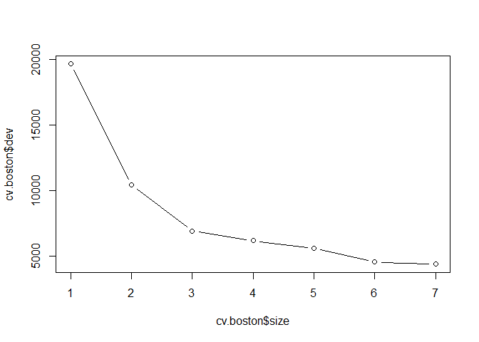
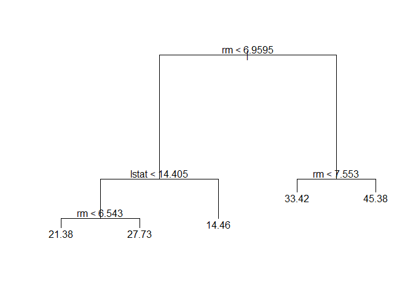
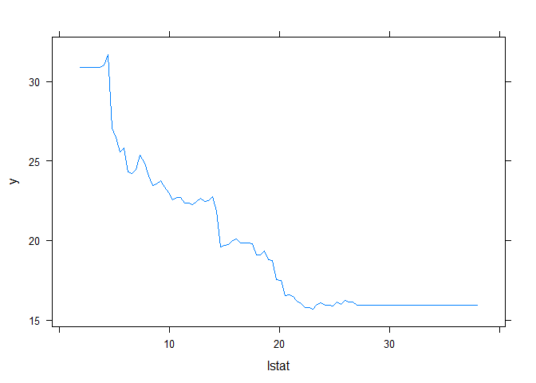

# 8.3.1 Fitting Classification Trees


```r
library(tree)
library(ISLR)
attach(Carseats)
High=factor(ifelse(Sales<=8,"No","Yes"))
Carseats=data.frame(Carseats,High)
tree.carseats=tree(High~.-Sales,Carseats)
summary(tree.carseats)
```

```
## 
## Classification tree:
## tree(formula = High ~ . - Sales, data = Carseats)
## Variables actually used in tree construction:
## [1] "ShelveLoc"   "Price"       "Income"      "CompPrice"   "Population" 
## [6] "Advertising" "Age"         "US"         
## Number of terminal nodes:  27 
## Residual mean deviance:  0.4575 = 170.7 / 373 
## Misclassification error rate: 0.09 = 36 / 400
```

```r
plot(tree.carseats)
text(tree.carseats,pretty=0)
```

<!-- -->

```r
tree.carseats
```

```
## node), split, n, deviance, yval, (yprob)
##       * denotes terminal node
## 
##   1) root 400 541.500 No ( 0.59000 0.41000 )  
##     2) ShelveLoc: Bad,Medium 315 390.600 No ( 0.68889 0.31111 )  
##       4) Price < 92.5 46  56.530 Yes ( 0.30435 0.69565 )  
##         8) Income < 57 10  12.220 No ( 0.70000 0.30000 )  
##          16) CompPrice < 110.5 5   0.000 No ( 1.00000 0.00000 ) *
##          17) CompPrice > 110.5 5   6.730 Yes ( 0.40000 0.60000 ) *
##         9) Income > 57 36  35.470 Yes ( 0.19444 0.80556 )  
##          18) Population < 207.5 16  21.170 Yes ( 0.37500 0.62500 ) *
##          19) Population > 207.5 20   7.941 Yes ( 0.05000 0.95000 ) *
##       5) Price > 92.5 269 299.800 No ( 0.75465 0.24535 )  
##        10) Advertising < 13.5 224 213.200 No ( 0.81696 0.18304 )  
##          20) CompPrice < 124.5 96  44.890 No ( 0.93750 0.06250 )  
##            40) Price < 106.5 38  33.150 No ( 0.84211 0.15789 )  
##              80) Population < 177 12  16.300 No ( 0.58333 0.41667 )  
##               160) Income < 60.5 6   0.000 No ( 1.00000 0.00000 ) *
##               161) Income > 60.5 6   5.407 Yes ( 0.16667 0.83333 ) *
##              81) Population > 177 26   8.477 No ( 0.96154 0.03846 ) *
##            41) Price > 106.5 58   0.000 No ( 1.00000 0.00000 ) *
##          21) CompPrice > 124.5 128 150.200 No ( 0.72656 0.27344 )  
##            42) Price < 122.5 51  70.680 Yes ( 0.49020 0.50980 )  
##              84) ShelveLoc: Bad 11   6.702 No ( 0.90909 0.09091 ) *
##              85) ShelveLoc: Medium 40  52.930 Yes ( 0.37500 0.62500 )  
##               170) Price < 109.5 16   7.481 Yes ( 0.06250 0.93750 ) *
##               171) Price > 109.5 24  32.600 No ( 0.58333 0.41667 )  
##                 342) Age < 49.5 13  16.050 Yes ( 0.30769 0.69231 ) *
##                 343) Age > 49.5 11   6.702 No ( 0.90909 0.09091 ) *
##            43) Price > 122.5 77  55.540 No ( 0.88312 0.11688 )  
##              86) CompPrice < 147.5 58  17.400 No ( 0.96552 0.03448 ) *
##              87) CompPrice > 147.5 19  25.010 No ( 0.63158 0.36842 )  
##               174) Price < 147 12  16.300 Yes ( 0.41667 0.58333 )  
##                 348) CompPrice < 152.5 7   5.742 Yes ( 0.14286 0.85714 ) *
##                 349) CompPrice > 152.5 5   5.004 No ( 0.80000 0.20000 ) *
##               175) Price > 147 7   0.000 No ( 1.00000 0.00000 ) *
##        11) Advertising > 13.5 45  61.830 Yes ( 0.44444 0.55556 )  
##          22) Age < 54.5 25  25.020 Yes ( 0.20000 0.80000 )  
##            44) CompPrice < 130.5 14  18.250 Yes ( 0.35714 0.64286 )  
##              88) Income < 100 9  12.370 No ( 0.55556 0.44444 ) *
##              89) Income > 100 5   0.000 Yes ( 0.00000 1.00000 ) *
##            45) CompPrice > 130.5 11   0.000 Yes ( 0.00000 1.00000 ) *
##          23) Age > 54.5 20  22.490 No ( 0.75000 0.25000 )  
##            46) CompPrice < 122.5 10   0.000 No ( 1.00000 0.00000 ) *
##            47) CompPrice > 122.5 10  13.860 No ( 0.50000 0.50000 )  
##              94) Price < 125 5   0.000 Yes ( 0.00000 1.00000 ) *
##              95) Price > 125 5   0.000 No ( 1.00000 0.00000 ) *
##     3) ShelveLoc: Good 85  90.330 Yes ( 0.22353 0.77647 )  
##       6) Price < 135 68  49.260 Yes ( 0.11765 0.88235 )  
##        12) US: No 17  22.070 Yes ( 0.35294 0.64706 )  
##          24) Price < 109 8   0.000 Yes ( 0.00000 1.00000 ) *
##          25) Price > 109 9  11.460 No ( 0.66667 0.33333 ) *
##        13) US: Yes 51  16.880 Yes ( 0.03922 0.96078 ) *
##       7) Price > 135 17  22.070 No ( 0.64706 0.35294 )  
##        14) Income < 46 6   0.000 No ( 1.00000 0.00000 ) *
##        15) Income > 46 11  15.160 Yes ( 0.45455 0.54545 ) *
```


```r
set.seed(2)
train=sample(1:nrow(Carseats), 200)
Carseats.test=Carseats[-train,]
High.test=High[-train]
tree.carseats=tree(High~.-Sales,Carseats,subset=train)
tree.pred=predict(tree.carseats,Carseats.test,type="class")
table(tree.pred,High.test)
```

```
##          High.test
## tree.pred  No Yes
##       No  104  33
##       Yes  13  50
```

```r
(104+50)/200
```

```
## [1] 0.77
```


```r
set.seed(3)
cv.carseats=cv.tree(tree.carseats,FUN=prune.misclass)
names(cv.carseats)
```

```
## [1] "size"   "dev"    "k"      "method"
```

```r
cv.carseats
```

```
## $size
## [1] 21 19 14  9  8  5  3  2  1
## 
## $dev
## [1] 74 76 81 81 75 77 78 85 81
## 
## $k
## [1] -Inf  0.0  1.0  1.4  2.0  3.0  4.0  9.0 18.0
## 
## $method
## [1] "misclass"
## 
## attr(,"class")
## [1] "prune"         "tree.sequence"
```

```r
par(mfrow=c(1,2))
plot(cv.carseats$size,cv.carseats$dev,type="b")
plot(cv.carseats$k,cv.carseats$dev,type="b")
```

<!-- -->

```r
prune.carseats=prune.misclass(tree.carseats,best=9)
plot(prune.carseats)
text(prune.carseats,pretty=0)
tree.pred=predict(prune.carseats,Carseats.test,type="class")
table(tree.pred,High.test)
```

```
##          High.test
## tree.pred No Yes
##       No  97  25
##       Yes 20  58
```

```r
(97+58)/200
```

```
## [1] 0.775
```

```r
prune.carseats=prune.misclass(tree.carseats,best=15)
plot(prune.carseats)
text(prune.carseats,pretty=0)
```

<!-- -->

```r
tree.pred=predict(prune.carseats,Carseats.test,type="class")
table(tree.pred,High.test)
```

```
##          High.test
## tree.pred  No Yes
##       No  102  30
##       Yes  15  53
```

```r
(102+53)/200
```

```
## [1] 0.775
```

# 8.3.2 Fitting Regression Trees


```r
library(MASS)
set.seed(1)
dim(Boston)
```

```
## [1] 506  14
```

```r
#?Boston
train = sample(1:nrow(Boston), nrow(Boston)/2)
tree.boston=tree(medv~.,Boston,subset=train)
summary(tree.boston)
```

```
## 
## Regression tree:
## tree(formula = medv ~ ., data = Boston, subset = train)
## Variables actually used in tree construction:
## [1] "rm"    "lstat" "crim"  "age"  
## Number of terminal nodes:  7 
## Residual mean deviance:  10.38 = 2555 / 246 
## Distribution of residuals:
##     Min.  1st Qu.   Median     Mean  3rd Qu.     Max. 
## -10.1800  -1.7770  -0.1775   0.0000   1.9230  16.5800
```

```r
plot(tree.boston)
text(tree.boston,pretty=0)
```

<!-- -->

```r
cv.boston=cv.tree(tree.boston)
plot(cv.boston$size,cv.boston$dev,type='b')
```

<!-- -->

```r
prune.boston=prune.tree(tree.boston,best=5)
plot(prune.boston)
text(prune.boston,pretty=0)
```

<!-- -->

```r
yhat=predict(tree.boston,newdata=Boston[-train,])
boston.test=Boston[-train,"medv"]
plot(yhat,boston.test)
abline(0,1)
```

<!-- -->

```r
mean((yhat-boston.test)^2)
```

```
## [1] 35.28688
```

# 8.3.3 Bagging and Random Forests

'mtry=4' which is the number of variable randomly chosen at each split.
Since $p=13$ here, we could try all 13 possible value of 'mtry'.


```r
library(randomForest)
```

```
## Warning: package 'randomForest' was built under R version 4.0.3
```

```
## randomForest 4.6-14
```

```
## Type rfNews() to see new features/changes/bug fixes.
```

```r
set.seed(1)
train = sample(1:nrow(Boston), nrow(Boston)/2)

rf.boston=randomForest(medv~.,data=Boston,subset=train,importance=TRUE)
rf.boston
```

```
## 
## Call:
##  randomForest(formula = medv ~ ., data = Boston, importance = TRUE,      subset = train) 
##                Type of random forest: regression
##                      Number of trees: 500
## No. of variables tried at each split: 4
## 
##           Mean of squared residuals: 9.94747
##                     % Var explained: 87.06
```

```r
obb.err=double(13)
test.err=double(13)
for(mtry in 1:13){
  fit=randomForest(medv~.,data=Boston,subset=train,mtry=mtry,ntree=400)
  obb.err[mtry]=fit$mse[400]
  pred=predict(fit,Boston[-train,])
  test.err[mtry]=with(Boston[-train,],mean((medv-pred)^2))
  cat(mtry," ")
}
```

```
## 1  2  3  4  5  6  7  8  9  10  11  12  13
```

```r
matplot(1:mtry,cbind(test.err,obb.err),pch = 19,col = c("red","blue"),type = "b",ylab = "Mean squared errors")
legend("topright",legend = c("Test","OOB"),pch = 19,col = c("red","blue"))
```

<!-- -->

```r
#
```


```r
set.seed(1)
bag.boston=randomForest(medv~.,data=Boston,subset=train,mtry=13,importance=TRUE)
bag.boston
```

```
## 
## Call:
##  randomForest(formula = medv ~ ., data = Boston, mtry = 13, importance = TRUE,      subset = train) 
##                Type of random forest: regression
##                      Number of trees: 500
## No. of variables tried at each split: 13
## 
##           Mean of squared residuals: 11.39601
##                     % Var explained: 85.17
```

```r
yhat.bag = predict(bag.boston,newdata=Boston[-train,])
plot(yhat.bag, boston.test)
abline(0,1)
```

<!-- -->

```r
mean((yhat.bag-boston.test)^2)
```

```
## [1] 23.59273
```

```r
bag.boston=randomForest(medv~.,data=Boston,subset=train,mtry=13,ntree=25)
bag.boston
```

```
## 
## Call:
##  randomForest(formula = medv ~ ., data = Boston, mtry = 13, ntree = 25,      subset = train) 
##                Type of random forest: regression
##                      Number of trees: 25
## No. of variables tried at each split: 13
## 
##           Mean of squared residuals: 14.38913
##                     % Var explained: 81.28
```

```r
yhat.bag = predict(bag.boston,newdata=Boston[-train,])
mean((yhat.bag-boston.test)^2)
```

```
## [1] 23.66716
```

```r
rf.boston=randomForest(medv~.,data=Boston,subset=train,mtry=6,importance=TRUE)
rf.boston
```

```
## 
## Call:
##  randomForest(formula = medv ~ ., data = Boston, mtry = 6, importance = TRUE,      subset = train) 
##                Type of random forest: regression
##                      Number of trees: 500
## No. of variables tried at each split: 6
## 
##           Mean of squared residuals: 10.15079
##                     % Var explained: 86.79
```

```r
yhat.rf = predict(rf.boston,newdata=Boston[-train,])
mean((yhat.rf-boston.test)^2)
```

```
## [1] 18.986
```

```r
importance(rf.boston)
```

```
##           %IncMSE IncNodePurity
## crim    15.147835    1080.77092
## zn       2.034638      85.02213
## indus    6.749944     634.60426
## chas     1.165267      32.28978
## nox     13.506885     813.23301
## rm      32.029666    7473.59568
## age     12.134563     603.62403
## dis      9.285196     717.09762
## rad      3.514649      98.17352
## tax     10.031711     370.24996
## ptratio  7.235556     775.66024
## black    6.100979     255.50450
## lstat   28.622141    6135.66690
```

```r
varImpPlot(rf.boston)
```

<!-- -->

The MSR and % variance explained are based on OOB _out-of-bag_ estimates.

# 8.3.4 Boosting


```r
library(gbm)
```

```
## Warning: package 'gbm' was built under R version 4.0.3
```

```
## Loaded gbm 2.1.8
```

```r
set.seed(1)
boost.boston.v=gbm(medv~.,data=Boston[train,],distribution="gaussian",n.trees=10000,shrinkage = 0.01,interaction.depth=4) #4 split per tree; tree shrinkage degree
summary(boost.boston.v)
```

<!-- -->

```
##             var     rel.inf
## rm           rm 42.71680162
## lstat     lstat 34.11249775
## dis         dis  4.47290327
## crim       crim  4.29459131
## nox         nox  3.12379851
## age         age  2.72819976
## black     black  2.71144143
## ptratio ptratio  2.39746905
## tax         tax  1.73776481
## indus     indus  0.79301320
## rad         rad  0.71011150
## zn           zn  0.14265627
## chas       chas  0.05875153
```

```r
plot(boost.boston.v,i="lstat")
```

<!-- -->

```r
plot(boost.boston.v,i="rm")
```

<!-- -->


```r
set.seed(1)
boost.boston=gbm(medv~.,data=Boston[train,],distribution="gaussian",n.trees=5000,interaction.depth=4)
summary(boost.boston)
```

<!-- -->

```
##             var    rel.inf
## rm           rm 43.9919329
## lstat     lstat 33.1216941
## crim       crim  4.2604167
## dis         dis  4.0111090
## nox         nox  3.4353017
## black     black  2.8267554
## age         age  2.6113938
## ptratio ptratio  2.5403035
## tax         tax  1.4565654
## indus     indus  0.8008740
## rad         rad  0.6546400
## zn           zn  0.1446149
## chas       chas  0.1443986
```

```r
par(mfrow=c(1,2))
plot(boost.boston,i="rm")
```

<!-- -->

```r
plot(boost.boston,i="lstat")
```

<!-- -->

```r
yhat.boost=predict(boost.boston,newdata=Boston[-train,],n.trees=5000)
mean((yhat.boost-boston.test)^2)
```

```
## [1] 18.84709
```

```r
boost.boston=gbm(medv~.,data=Boston[train,],distribution="gaussian",n.trees=5000,interaction.depth=4,shrinkage=0.2,verbose=F)
yhat.boost=predict(boost.boston,newdata=Boston[-train,],n.trees=5000)
mean((yhat.boost-boston.test)^2)
```

```
## [1] 18.33455
```


```r
set.seed(1)
n.trees=seq(from=100,to=10000,by=100)
predmat=predict(boost.boston,newdata=Boston[-train,],n.trees=n.trees)
```

```
## Warning in predict.gbm(boost.boston, newdata = Boston[-train, ], n.trees =
## n.trees): Number of trees not specified or exceeded number fit so far. Using
## 100 200 300 400 500 600 700 800 900 1000 1100 1200 1300 1400 1500 1600 1700 1800
## 1900 2000 2100 2200 2300 2400 2500 2600 2700 2800 2900 3000 3100 3200 3300 3400
## 3500 3600 3700 3800 3900 4000 4100 4200 4300 4400 4500 4600 4700 4800 4900 5000
## 5000 5000 5000 5000 5000 5000 5000 5000 5000 5000 5000 5000 5000 5000 5000 5000
## 5000 5000 5000 5000 5000 5000 5000 5000 5000 5000 5000 5000 5000 5000 5000 5000
## 5000 5000 5000 5000 5000 5000 5000 5000 5000 5000 5000 5000 5000 5000 5000 5000
## 5000 5000.
```

```r
dim(predmat)
```

```
## [1] 253 100
```

```r
berr=with(Boston[-train,],apply((predmat-medv)^2,2,mean))
plot(n.trees,berr,pch=19,ylab = "Mean squared errors",xlab = "# Trees",main =" Boosting Test Error")
abline(h=min(test.err),col="red")
```

<!-- -->

```r
matplot(1:mtry,cbind(test.err,obb.err),pch = 19,col = c("red","blue"),type = "b",ylab = "Mean squared errors")
legend("topright",legend = c("Test","OOB"),pch = 19,col = c("red","blue"))
abline(h=min(test.err),col="red")
```

<!-- -->

# 9. This problem involves the OJ data set which is part of the ISLR package.


```r
library(ISLR)
summary(OJ)
```

```
##  Purchase WeekofPurchase     StoreID        PriceCH         PriceMM     
##  CH:653   Min.   :227.0   Min.   :1.00   Min.   :1.690   Min.   :1.690  
##  MM:417   1st Qu.:240.0   1st Qu.:2.00   1st Qu.:1.790   1st Qu.:1.990  
##           Median :257.0   Median :3.00   Median :1.860   Median :2.090  
##           Mean   :254.4   Mean   :3.96   Mean   :1.867   Mean   :2.085  
##           3rd Qu.:268.0   3rd Qu.:7.00   3rd Qu.:1.990   3rd Qu.:2.180  
##           Max.   :278.0   Max.   :7.00   Max.   :2.090   Max.   :2.290  
##      DiscCH            DiscMM         SpecialCH        SpecialMM     
##  Min.   :0.00000   Min.   :0.0000   Min.   :0.0000   Min.   :0.0000  
##  1st Qu.:0.00000   1st Qu.:0.0000   1st Qu.:0.0000   1st Qu.:0.0000  
##  Median :0.00000   Median :0.0000   Median :0.0000   Median :0.0000  
##  Mean   :0.05186   Mean   :0.1234   Mean   :0.1477   Mean   :0.1617  
##  3rd Qu.:0.00000   3rd Qu.:0.2300   3rd Qu.:0.0000   3rd Qu.:0.0000  
##  Max.   :0.50000   Max.   :0.8000   Max.   :1.0000   Max.   :1.0000  
##     LoyalCH          SalePriceMM     SalePriceCH      PriceDiff       Store7   
##  Min.   :0.000011   Min.   :1.190   Min.   :1.390   Min.   :-0.6700   No :714  
##  1st Qu.:0.325257   1st Qu.:1.690   1st Qu.:1.750   1st Qu.: 0.0000   Yes:356  
##  Median :0.600000   Median :2.090   Median :1.860   Median : 0.2300            
##  Mean   :0.565782   Mean   :1.962   Mean   :1.816   Mean   : 0.1465            
##  3rd Qu.:0.850873   3rd Qu.:2.130   3rd Qu.:1.890   3rd Qu.: 0.3200            
##  Max.   :0.999947   Max.   :2.290   Max.   :2.090   Max.   : 0.6400            
##    PctDiscMM        PctDiscCH       ListPriceDiff       STORE      
##  Min.   :0.0000   Min.   :0.00000   Min.   :0.000   Min.   :0.000  
##  1st Qu.:0.0000   1st Qu.:0.00000   1st Qu.:0.140   1st Qu.:0.000  
##  Median :0.0000   Median :0.00000   Median :0.240   Median :2.000  
##  Mean   :0.0593   Mean   :0.02731   Mean   :0.218   Mean   :1.631  
##  3rd Qu.:0.1127   3rd Qu.:0.00000   3rd Qu.:0.300   3rd Qu.:3.000  
##  Max.   :0.4020   Max.   :0.25269   Max.   :0.440   Max.   :4.000
```

## (a) Create a training set containing a random sample of 800 observations, and a test set containing the remaining observations.


```r
set.seed(10)
train=sample(1:nrow(OJ), 800)
OJ.test=OJ[-train,]
OJ.train=OJ[train,]
summary(OJ.test)
```

```
##  Purchase WeekofPurchase     StoreID        PriceCH         PriceMM     
##  CH:162   Min.   :227.0   Min.   :1.00   Min.   :1.690   Min.   :1.690  
##  MM:108   1st Qu.:239.0   1st Qu.:2.00   1st Qu.:1.790   1st Qu.:2.090  
##           Median :257.0   Median :3.00   Median :1.860   Median :2.130  
##           Mean   :254.8   Mean   :3.67   Mean   :1.867   Mean   :2.086  
##           3rd Qu.:269.0   3rd Qu.:7.00   3rd Qu.:1.990   3rd Qu.:2.180  
##           Max.   :278.0   Max.   :7.00   Max.   :2.090   Max.   :2.290  
##      DiscCH            DiscMM         SpecialCH        SpecialMM     
##  Min.   :0.00000   Min.   :0.0000   Min.   :0.0000   Min.   :0.0000  
##  1st Qu.:0.00000   1st Qu.:0.0000   1st Qu.:0.0000   1st Qu.:0.0000  
##  Median :0.00000   Median :0.0000   Median :0.0000   Median :0.0000  
##  Mean   :0.04722   Mean   :0.1207   Mean   :0.1407   Mean   :0.1593  
##  3rd Qu.:0.00000   3rd Qu.:0.2000   3rd Qu.:0.0000   3rd Qu.:0.0000  
##  Max.   :0.50000   Max.   :0.8000   Max.   :1.0000   Max.   :1.0000  
##     LoyalCH          SalePriceMM     SalePriceCH     PriceDiff       Store7   
##  Min.   :0.000011   Min.   :1.190   Min.   :1.39   Min.   :-0.6700   No :193  
##  1st Qu.:0.320000   1st Qu.:1.712   1st Qu.:1.75   1st Qu.: 0.0000   Yes: 77  
##  Median :0.546080   Median :2.090   Median :1.86   Median : 0.2400            
##  Mean   :0.551299   Mean   :1.966   Mean   :1.82   Mean   : 0.1457            
##  3rd Qu.:0.836160   3rd Qu.:2.180   3rd Qu.:1.89   3rd Qu.: 0.3200            
##  Max.   :0.999683   Max.   :2.290   Max.   :2.09   Max.   : 0.6400            
##    PctDiscMM         PctDiscCH       ListPriceDiff        STORE      
##  Min.   :0.00000   Min.   :0.00000   Min.   :0.0000   Min.   :0.000  
##  1st Qu.:0.00000   1st Qu.:0.00000   1st Qu.:0.1400   1st Qu.:0.000  
##  Median :0.00000   Median :0.00000   Median :0.2400   Median :2.000  
##  Mean   :0.05777   Mean   :0.02482   Mean   :0.2192   Mean   :1.674  
##  3rd Qu.:0.10050   3rd Qu.:0.00000   3rd Qu.:0.3000   3rd Qu.:3.000  
##  Max.   :0.40201   Max.   :0.25269   Max.   :0.4400   Max.   :4.000
```

```r
summary(OJ.train)
```

```
##  Purchase WeekofPurchase     StoreID         PriceCH         PriceMM     
##  CH:491   Min.   :227.0   Min.   :1.000   Min.   :1.690   Min.   :1.690  
##  MM:309   1st Qu.:240.0   1st Qu.:2.000   1st Qu.:1.790   1st Qu.:1.990  
##           Median :257.0   Median :3.000   Median :1.860   Median :2.090  
##           Mean   :254.3   Mean   :4.058   Mean   :1.868   Mean   :2.085  
##           3rd Qu.:268.0   3rd Qu.:7.000   3rd Qu.:1.990   3rd Qu.:2.180  
##           Max.   :278.0   Max.   :7.000   Max.   :2.090   Max.   :2.290  
##      DiscCH            DiscMM         SpecialCH      SpecialMM     
##  Min.   :0.00000   Min.   :0.0000   Min.   :0.00   Min.   :0.0000  
##  1st Qu.:0.00000   1st Qu.:0.0000   1st Qu.:0.00   1st Qu.:0.0000  
##  Median :0.00000   Median :0.0000   Median :0.00   Median :0.0000  
##  Mean   :0.05343   Mean   :0.1243   Mean   :0.15   Mean   :0.1625  
##  3rd Qu.:0.00000   3rd Qu.:0.2400   3rd Qu.:0.00   3rd Qu.:0.0000  
##  Max.   :0.50000   Max.   :0.8000   Max.   :1.00   Max.   :1.0000  
##     LoyalCH          SalePriceMM     SalePriceCH      PriceDiff       Store7   
##  Min.   :0.000014   Min.   :1.190   Min.   :1.390   Min.   :-0.6700   No :521  
##  1st Qu.:0.330681   1st Qu.:1.690   1st Qu.:1.750   1st Qu.: 0.0000   Yes:279  
##  Median :0.600000   Median :2.090   Median :1.860   Median : 0.2300            
##  Mean   :0.570670   Mean   :1.961   Mean   :1.814   Mean   : 0.1467            
##  3rd Qu.:0.855950   3rd Qu.:2.130   3rd Qu.:1.890   3rd Qu.: 0.3200            
##  Max.   :0.999947   Max.   :2.290   Max.   :2.090   Max.   : 0.6400            
##    PctDiscMM         PctDiscCH       ListPriceDiff        STORE      
##  Min.   :0.00000   Min.   :0.00000   Min.   :0.0000   Min.   :0.000  
##  1st Qu.:0.00000   1st Qu.:0.00000   1st Qu.:0.1400   1st Qu.:0.000  
##  Median :0.00000   Median :0.00000   Median :0.2400   Median :2.000  
##  Mean   :0.05981   Mean   :0.02815   Mean   :0.2176   Mean   :1.616  
##  3rd Qu.:0.11409   3rd Qu.:0.00000   3rd Qu.:0.3000   3rd Qu.:3.000  
##  Max.   :0.40201   Max.   :0.25269   Max.   :0.4400   Max.   :4.000
```

```r
dim(OJ)
```

```
## [1] 1070   18
```

```r
dim(OJ.test)
```

```
## [1] 270  18
```

```r
dim(OJ.train)
```

```
## [1] 800  18
```

## (b) Fit a tree to the training data, with Purchase as the response and the other variables as predictors. Use the summary() function to produce summary statistics about the tree, and describe the results obtained. What is the training error rate? How many terminal nodes does the tree have?


```r
tree.OJ=tree(Purchase~.,OJ,subset=train)
summary(tree.OJ)
```

```
## 
## Classification tree:
## tree(formula = Purchase ~ ., data = OJ, subset = train)
## Variables actually used in tree construction:
## [1] "LoyalCH"   "DiscMM"    "PriceDiff"
## Number of terminal nodes:  7 
## Residual mean deviance:  0.7983 = 633 / 793 
## Misclassification error rate: 0.1775 = 142 / 800
```

> Number of terminal nodes:  7

> Misclassification error rate: 0.1775

## (c) Type in the name of the tree object in order to get a detailed text output. Pick one of the terminal nodes, and interpret the information displayed.


```r
tree.OJ
```

```
## node), split, n, deviance, yval, (yprob)
##       * denotes terminal node
## 
##  1) root 800 1067.000 CH ( 0.61375 0.38625 )  
##    2) LoyalCH < 0.48285 290  315.900 MM ( 0.23448 0.76552 )  
##      4) LoyalCH < 0.035047 51    9.844 MM ( 0.01961 0.98039 ) *
##      5) LoyalCH > 0.035047 239  283.600 MM ( 0.28033 0.71967 )  
##       10) DiscMM < 0.47 220  270.500 MM ( 0.30455 0.69545 ) *
##       11) DiscMM > 0.47 19    0.000 MM ( 0.00000 1.00000 ) *
##    3) LoyalCH > 0.48285 510  466.000 CH ( 0.82941 0.17059 )  
##      6) LoyalCH < 0.764572 245  300.200 CH ( 0.69796 0.30204 )  
##       12) PriceDiff < 0.145 99  137.000 MM ( 0.47475 0.52525 )  
##         24) DiscMM < 0.47 82  112.900 CH ( 0.54878 0.45122 ) *
##         25) DiscMM > 0.47 17   12.320 MM ( 0.11765 0.88235 ) *
##       13) PriceDiff > 0.145 146  123.800 CH ( 0.84932 0.15068 ) *
##      7) LoyalCH > 0.764572 265  103.700 CH ( 0.95094 0.04906 ) *
```

```r
?OJ
```

```
## starting httpd help server ... done
```

> 4) LoyalCH < 0.035047 51    9.844 MM ( 0.01961 0.98039 ) *

> when customer brand loyalty for Citrus Hill is less than 0.035047, 98.039% customer purchased Minute Maid Orange Juice and 1.961% customer purchased Citrus Hill.

## (d) Create a plot of the tree, and interpret the results.


```r
plot(tree.OJ);text(tree.OJ,pretty=0)
```

<!-- -->

> Customer brand loyalty for CH (LoyalCH) and Sale price of MM less sale price of CH (PriceDiff) are important. Discount offered for MM (DiscMM) is also a factor but not as important.

## (e) Predict the response on the test data, and produce a confusion matrix comparing the test labels to the predicted test labels. What is the test error rate?


```r
tree.pred=predict(tree.OJ,OJ.test,type="class")
purchase.test=OJ.test$Purchase
table(tree.pred,purchase.test)
```

```
##          purchase.test
## tree.pred  CH  MM
##        CH 135  20
##        MM  27  88
```

```r
(135+88)/270
```

```
## [1] 0.8259259
```

```r
1-((135+88)/270)
```

```
## [1] 0.1740741
```

> the test error rate = 17.4%

## (f) Apply the cv.tree() function to the training set in order to determine the optimal tree size.


```r
cv.OJ=cv.tree(tree.OJ,FUN=prune.misclass)
names(cv.OJ)
```

```
## [1] "size"   "dev"    "k"      "method"
```

```r
cv.OJ
```

```
## $size
## [1] 7 5 2 1
## 
## $dev
## [1] 154 153 157 309
## 
## $k
## [1]       -Inf   0.000000   4.333333 154.000000
## 
## $method
## [1] "misclass"
## 
## attr(,"class")
## [1] "prune"         "tree.sequence"
```

```r
plot(cv.OJ)
```

<!-- -->

## (g) Produce a plot with tree size on the x-axis and cross-validated classification error rate on the y-axis.


```r
plot(cv.OJ$size,cv.OJ$dev,type="b")
```

<!-- -->

## (h) Which tree size corresponds to the lowest cross-validated classification error rate?

> size 5 corresponds to the lowest cross-validated classification error rate

## (i) Produce a pruned tree corresponding to the optimal tree size obtained using cross-validation. If cross-validation does not lead to selection of a pruned tree, then create a pruned tree with five terminal nodes.


```r
prune.OJ=prune.misclass(tree.OJ,best=5)
plot(prune.OJ);text(prune.OJ,pretty=0)
```

<!-- -->

## (j) Compare the training error rates between the pruned and un-pruned trees. Which is higher?


```r
summary(tree.OJ)
```

```
## 
## Classification tree:
## tree(formula = Purchase ~ ., data = OJ, subset = train)
## Variables actually used in tree construction:
## [1] "LoyalCH"   "DiscMM"    "PriceDiff"
## Number of terminal nodes:  7 
## Residual mean deviance:  0.7983 = 633 / 793 
## Misclassification error rate: 0.1775 = 142 / 800
```

```r
summary(prune.OJ)
```

```
## 
## Classification tree:
## snip.tree(tree = tree.OJ, nodes = 2L)
## Variables actually used in tree construction:
## [1] "LoyalCH"   "PriceDiff" "DiscMM"   
## Number of terminal nodes:  5 
## Residual mean deviance:  0.841 = 668.6 / 795 
## Misclassification error rate: 0.1775 = 142 / 800
```

> the training error rates of the pruned trees is higher

## (k) Compare the test error rates between the pruned and unpruned trees. Which is higher?


```r
tree.pred=predict(tree.OJ,OJ.test,type="class")
table(tree.pred,purchase.test)
```

```
##          purchase.test
## tree.pred  CH  MM
##        CH 135  20
##        MM  27  88
```

```r
(135+88)/270
```

```
## [1] 0.8259259
```

```r
1-((135+88)/270)
```

```
## [1] 0.1740741
```

```r
prune.pred=predict(prune.OJ,OJ.test,type="class")
table(prune.pred,purchase.test)
```

```
##           purchase.test
## prune.pred  CH  MM
##         CH 135  20
##         MM  27  88
```

```r
(135+88)/270
```

```
## [1] 0.8259259
```

```r
1-((135+88)/270)
```

```
## [1] 0.1740741
```

> the test error rates of the pruned and unpruned trees are the same.

# 10. We now use boosting to predict Salary in the Hitters data set.

## (a) Remove the observations for whom the salary information is unknown, and then log-transform the salaries.


```r
library(ISLR)
#?Hitters
summary(Hitters)
```

```
##      AtBat            Hits         HmRun            Runs       
##  Min.   : 16.0   Min.   :  1   Min.   : 0.00   Min.   :  0.00  
##  1st Qu.:255.2   1st Qu.: 64   1st Qu.: 4.00   1st Qu.: 30.25  
##  Median :379.5   Median : 96   Median : 8.00   Median : 48.00  
##  Mean   :380.9   Mean   :101   Mean   :10.77   Mean   : 50.91  
##  3rd Qu.:512.0   3rd Qu.:137   3rd Qu.:16.00   3rd Qu.: 69.00  
##  Max.   :687.0   Max.   :238   Max.   :40.00   Max.   :130.00  
##                                                                
##       RBI             Walks            Years            CAtBat       
##  Min.   :  0.00   Min.   :  0.00   Min.   : 1.000   Min.   :   19.0  
##  1st Qu.: 28.00   1st Qu.: 22.00   1st Qu.: 4.000   1st Qu.:  816.8  
##  Median : 44.00   Median : 35.00   Median : 6.000   Median : 1928.0  
##  Mean   : 48.03   Mean   : 38.74   Mean   : 7.444   Mean   : 2648.7  
##  3rd Qu.: 64.75   3rd Qu.: 53.00   3rd Qu.:11.000   3rd Qu.: 3924.2  
##  Max.   :121.00   Max.   :105.00   Max.   :24.000   Max.   :14053.0  
##                                                                      
##      CHits            CHmRun           CRuns             CRBI        
##  Min.   :   4.0   Min.   :  0.00   Min.   :   1.0   Min.   :   0.00  
##  1st Qu.: 209.0   1st Qu.: 14.00   1st Qu.: 100.2   1st Qu.:  88.75  
##  Median : 508.0   Median : 37.50   Median : 247.0   Median : 220.50  
##  Mean   : 717.6   Mean   : 69.49   Mean   : 358.8   Mean   : 330.12  
##  3rd Qu.:1059.2   3rd Qu.: 90.00   3rd Qu.: 526.2   3rd Qu.: 426.25  
##  Max.   :4256.0   Max.   :548.00   Max.   :2165.0   Max.   :1659.00  
##                                                                      
##      CWalks        League  Division    PutOuts          Assists     
##  Min.   :   0.00   A:175   E:157    Min.   :   0.0   Min.   :  0.0  
##  1st Qu.:  67.25   N:147   W:165    1st Qu.: 109.2   1st Qu.:  7.0  
##  Median : 170.50                    Median : 212.0   Median : 39.5  
##  Mean   : 260.24                    Mean   : 288.9   Mean   :106.9  
##  3rd Qu.: 339.25                    3rd Qu.: 325.0   3rd Qu.:166.0  
##  Max.   :1566.00                    Max.   :1378.0   Max.   :492.0  
##                                                                     
##      Errors          Salary       NewLeague
##  Min.   : 0.00   Min.   :  67.5   A:176    
##  1st Qu.: 3.00   1st Qu.: 190.0   N:146    
##  Median : 6.00   Median : 425.0            
##  Mean   : 8.04   Mean   : 535.9            
##  3rd Qu.:11.00   3rd Qu.: 750.0            
##  Max.   :32.00   Max.   :2460.0            
##                  NA's   :59
```

```r
new.Hitters=na.omit(Hitters)
summary(new.Hitters)
```

```
##      AtBat            Hits           HmRun            Runs       
##  Min.   : 19.0   Min.   :  1.0   Min.   : 0.00   Min.   :  0.00  
##  1st Qu.:282.5   1st Qu.: 71.5   1st Qu.: 5.00   1st Qu.: 33.50  
##  Median :413.0   Median :103.0   Median : 9.00   Median : 52.00  
##  Mean   :403.6   Mean   :107.8   Mean   :11.62   Mean   : 54.75  
##  3rd Qu.:526.0   3rd Qu.:141.5   3rd Qu.:18.00   3rd Qu.: 73.00  
##  Max.   :687.0   Max.   :238.0   Max.   :40.00   Max.   :130.00  
##       RBI             Walks            Years            CAtBat       
##  Min.   :  0.00   Min.   :  0.00   Min.   : 1.000   Min.   :   19.0  
##  1st Qu.: 30.00   1st Qu.: 23.00   1st Qu.: 4.000   1st Qu.:  842.5  
##  Median : 47.00   Median : 37.00   Median : 6.000   Median : 1931.0  
##  Mean   : 51.49   Mean   : 41.11   Mean   : 7.312   Mean   : 2657.5  
##  3rd Qu.: 71.00   3rd Qu.: 57.00   3rd Qu.:10.000   3rd Qu.: 3890.5  
##  Max.   :121.00   Max.   :105.00   Max.   :24.000   Max.   :14053.0  
##      CHits            CHmRun           CRuns             CRBI       
##  Min.   :   4.0   Min.   :  0.00   Min.   :   2.0   Min.   :   3.0  
##  1st Qu.: 212.0   1st Qu.: 15.00   1st Qu.: 105.5   1st Qu.:  95.0  
##  Median : 516.0   Median : 40.00   Median : 250.0   Median : 230.0  
##  Mean   : 722.2   Mean   : 69.24   Mean   : 361.2   Mean   : 330.4  
##  3rd Qu.:1054.0   3rd Qu.: 92.50   3rd Qu.: 497.5   3rd Qu.: 424.5  
##  Max.   :4256.0   Max.   :548.00   Max.   :2165.0   Max.   :1659.0  
##      CWalks       League  Division    PutOuts          Assists     
##  Min.   :   1.0   A:139   E:129    Min.   :   0.0   Min.   :  0.0  
##  1st Qu.:  71.0   N:124   W:134    1st Qu.: 113.5   1st Qu.:  8.0  
##  Median : 174.0                    Median : 224.0   Median : 45.0  
##  Mean   : 260.3                    Mean   : 290.7   Mean   :118.8  
##  3rd Qu.: 328.5                    3rd Qu.: 322.5   3rd Qu.:192.0  
##  Max.   :1566.0                    Max.   :1377.0   Max.   :492.0  
##      Errors           Salary       NewLeague
##  Min.   : 0.000   Min.   :  67.5   A:141    
##  1st Qu.: 3.000   1st Qu.: 190.0   N:122    
##  Median : 7.000   Median : 425.0            
##  Mean   : 8.593   Mean   : 535.9            
##  3rd Qu.:13.000   3rd Qu.: 750.0            
##  Max.   :32.000   Max.   :2460.0
```

```r
logSalary=log(new.Hitters$Salary)
new.Hitters2=data.frame(new.Hitters,logSalary)
summary(new.Hitters2)
```

```
##      AtBat            Hits           HmRun            Runs       
##  Min.   : 19.0   Min.   :  1.0   Min.   : 0.00   Min.   :  0.00  
##  1st Qu.:282.5   1st Qu.: 71.5   1st Qu.: 5.00   1st Qu.: 33.50  
##  Median :413.0   Median :103.0   Median : 9.00   Median : 52.00  
##  Mean   :403.6   Mean   :107.8   Mean   :11.62   Mean   : 54.75  
##  3rd Qu.:526.0   3rd Qu.:141.5   3rd Qu.:18.00   3rd Qu.: 73.00  
##  Max.   :687.0   Max.   :238.0   Max.   :40.00   Max.   :130.00  
##       RBI             Walks            Years            CAtBat       
##  Min.   :  0.00   Min.   :  0.00   Min.   : 1.000   Min.   :   19.0  
##  1st Qu.: 30.00   1st Qu.: 23.00   1st Qu.: 4.000   1st Qu.:  842.5  
##  Median : 47.00   Median : 37.00   Median : 6.000   Median : 1931.0  
##  Mean   : 51.49   Mean   : 41.11   Mean   : 7.312   Mean   : 2657.5  
##  3rd Qu.: 71.00   3rd Qu.: 57.00   3rd Qu.:10.000   3rd Qu.: 3890.5  
##  Max.   :121.00   Max.   :105.00   Max.   :24.000   Max.   :14053.0  
##      CHits            CHmRun           CRuns             CRBI       
##  Min.   :   4.0   Min.   :  0.00   Min.   :   2.0   Min.   :   3.0  
##  1st Qu.: 212.0   1st Qu.: 15.00   1st Qu.: 105.5   1st Qu.:  95.0  
##  Median : 516.0   Median : 40.00   Median : 250.0   Median : 230.0  
##  Mean   : 722.2   Mean   : 69.24   Mean   : 361.2   Mean   : 330.4  
##  3rd Qu.:1054.0   3rd Qu.: 92.50   3rd Qu.: 497.5   3rd Qu.: 424.5  
##  Max.   :4256.0   Max.   :548.00   Max.   :2165.0   Max.   :1659.0  
##      CWalks       League  Division    PutOuts          Assists     
##  Min.   :   1.0   A:139   E:129    Min.   :   0.0   Min.   :  0.0  
##  1st Qu.:  71.0   N:124   W:134    1st Qu.: 113.5   1st Qu.:  8.0  
##  Median : 174.0                    Median : 224.0   Median : 45.0  
##  Mean   : 260.3                    Mean   : 290.7   Mean   :118.8  
##  3rd Qu.: 328.5                    3rd Qu.: 322.5   3rd Qu.:192.0  
##  Max.   :1566.0                    Max.   :1377.0   Max.   :492.0  
##      Errors           Salary       NewLeague   logSalary    
##  Min.   : 0.000   Min.   :  67.5   A:141     Min.   :4.212  
##  1st Qu.: 3.000   1st Qu.: 190.0   N:122     1st Qu.:5.247  
##  Median : 7.000   Median : 425.0             Median :6.052  
##  Mean   : 8.593   Mean   : 535.9             Mean   :5.927  
##  3rd Qu.:13.000   3rd Qu.: 750.0             3rd Qu.:6.620  
##  Max.   :32.000   Max.   :2460.0             Max.   :7.808
```

## (b) Create a training set consisting of the first 200 observations, and a test set consisting of the remaining observations.


```r
dim(new.Hitters2)
```

```
## [1] 263  21
```

```r
new.hitters.train=new.Hitters2[1:200,]
new.hitters.test=new.Hitters2[201:nrow(new.Hitters2),]
dim(new.hitters.train)
```

```
## [1] 200  21
```

```r
dim(new.hitters.test)
```

```
## [1] 63 21
```

## (c) Perform boosting on the training set with 1,000 trees for a range of values of the shrinkage parameter λ. Produce a plot with different shrinkage values on the x-axis and the corresponding training set MSE on the y-axis.


```r
library(gbm)
shrinkage=seq(0.001,0.2,0.001)
train.err=double(200)
test.err=double(200)
for(s in shrinkage){
  boost.hitters=gbm(logSalary~.-Salary, data=new.hitters.train, distribution="gaussian", n.trees=1000, shrinkage=s)
  yhat.boost=predict(boost.hitters, newdata=new.hitters.test, n.trees=1000)
  train.err[s*1000] <- mean((boost.hitters$train.error)^2)
  test.err[s*1000] <- mean((yhat.boost-new.hitters.test$logSalary)^2)
}
plot(data.frame(shrinkage,train.err),type = "b",ylab = "Mean squared errors")
```

<!-- -->

## (d) Produce a plot with different shrinkage values on the x-axis and the corresponding test set MSE on the y-axis.


```r
plot(data.frame(shrinkage,test.err),type = "l",ylab = "Mean squared errors")
```

<!-- -->

## (e) Compare the test MSE of boosting to the test MSE that results from applying two of the regression approaches seen in Chapters 3 and 6.


```r
set.seed(1)
boost.hitters=gbm(logSalary~.-Salary, data=new.hitters.train, distribution="gaussian", n.trees=1000, shrinkage=0.01)
yhat.boost <- predict(boost.hitters, newdata=new.hitters.test, n.trees = 1000)
mean((yhat.boost - new.hitters.test$logSalary)^2)
```

```
## [1] 0.2803223
```

```r
hitters.lm=lm(logSalary ~ .-Salary, data=new.hitters.train)
yhat.lm=predict(hitters.lm, newdata=new.hitters.test)
mean((yhat.lm - new.hitters.test$logSalary)^2)
```

```
## [1] 0.4917959
```
> the test MSE of boosting: 0.2803223

> the test MSE of the regression approaches: 0.4917959


## (f) Which variables appear to be the most important predictors in the boosted model?


```r
summary(boost.hitters)
```

<!-- -->

```
##                 var    rel.inf
## CAtBat       CAtBat 27.3054217
## CHits         CHits 11.1342066
## CRBI           CRBI 10.4738117
## CWalks       CWalks  8.5854670
## CRuns         CRuns  7.9895047
## Years         Years  6.1452125
## CHmRun       CHmRun  5.7226448
## Hits           Hits  4.7410655
## Walks         Walks  3.9378531
## RBI             RBI  3.6359708
## PutOuts     PutOuts  2.9766872
## AtBat         AtBat  2.0255320
## HmRun         HmRun  1.4556220
## Errors       Errors  1.2362298
## Runs           Runs  0.9874552
## Assists     Assists  0.8528629
## Division   Division  0.5232692
## NewLeague NewLeague  0.1488451
## League       League  0.1223383
```

> CAtBat (Number of times at bat during his career) is the most important predictor.

## (g) Now apply bagging to the training set. What is the test set MSE for this approach?


```r
library(randomForest)
dim(new.hitters.train)
```

```
## [1] 200  21
```

```r
bag.hitters=randomForest(logSalary~.-Salary, data=new.hitters.train, mtry = 19, importance = TRUE)
yhat.bag=predict(bag.hitters, newdata=new.hitters.test)
mean((yhat.bag-new.hitters.test$logSalary)^2)
```

```
## [1] 0.2291558
```

```r
importance(bag.hitters)
```

```
##              %IncMSE IncNodePurity
## AtBat     10.6894273     7.5685193
## Hits       8.7218826     4.3285810
## HmRun      2.4883643     1.4422836
## Runs       2.9541817     3.2372411
## RBI        3.0885520     3.2627338
## Walks     10.2876058     7.3734641
## Years     11.4369034     1.8685740
## CAtBat    34.9292453    84.8497925
## CHits      8.3050003    12.1753813
## CHmRun    11.0675100     4.8725825
## CRuns     12.1271533    11.6831791
## CRBI      11.4076584     9.2394258
## CWalks     5.9008280     6.4417680
## League    -2.0342049     0.1191828
## Division  -2.4813658     0.1939507
## PutOuts    1.5690627     2.7279423
## Assists   -0.8374132     1.4812270
## Errors     1.0804031     1.2713468
## NewLeague  1.9472873     0.1883526
```

```r
varImpPlot(bag.hitters)
```

<!-- -->

> the test set MSE of bagging: 0.2291558

# 11. This question uses the Caravan data set.

## (a) Create a training set consisting of the first 1,000 observations, and a test set consisting of the remaining observations.

```r
summary(Caravan)
```

```
##     MOSTYPE         MAANTHUI         MGEMOMV         MGEMLEEF    
##  Min.   : 1.00   Min.   : 1.000   Min.   :1.000   Min.   :1.000  
##  1st Qu.:10.00   1st Qu.: 1.000   1st Qu.:2.000   1st Qu.:2.000  
##  Median :30.00   Median : 1.000   Median :3.000   Median :3.000  
##  Mean   :24.25   Mean   : 1.111   Mean   :2.679   Mean   :2.991  
##  3rd Qu.:35.00   3rd Qu.: 1.000   3rd Qu.:3.000   3rd Qu.:3.000  
##  Max.   :41.00   Max.   :10.000   Max.   :5.000   Max.   :6.000  
##     MOSHOOFD          MGODRK           MGODPR          MGODOV    
##  Min.   : 1.000   Min.   :0.0000   Min.   :0.000   Min.   :0.00  
##  1st Qu.: 3.000   1st Qu.:0.0000   1st Qu.:4.000   1st Qu.:0.00  
##  Median : 7.000   Median :0.0000   Median :5.000   Median :1.00  
##  Mean   : 5.774   Mean   :0.6965   Mean   :4.627   Mean   :1.07  
##  3rd Qu.: 8.000   3rd Qu.:1.0000   3rd Qu.:6.000   3rd Qu.:2.00  
##  Max.   :10.000   Max.   :9.0000   Max.   :9.000   Max.   :5.00  
##      MGODGE          MRELGE          MRELSA           MRELOV    
##  Min.   :0.000   Min.   :0.000   Min.   :0.0000   Min.   :0.00  
##  1st Qu.:2.000   1st Qu.:5.000   1st Qu.:0.0000   1st Qu.:1.00  
##  Median :3.000   Median :6.000   Median :1.0000   Median :2.00  
##  Mean   :3.259   Mean   :6.183   Mean   :0.8835   Mean   :2.29  
##  3rd Qu.:4.000   3rd Qu.:7.000   3rd Qu.:1.0000   3rd Qu.:3.00  
##  Max.   :9.000   Max.   :9.000   Max.   :7.0000   Max.   :9.00  
##     MFALLEEN        MFGEKIND       MFWEKIND      MOPLHOOG        MOPLMIDD    
##  Min.   :0.000   Min.   :0.00   Min.   :0.0   Min.   :0.000   Min.   :0.000  
##  1st Qu.:0.000   1st Qu.:2.00   1st Qu.:3.0   1st Qu.:0.000   1st Qu.:2.000  
##  Median :2.000   Median :3.00   Median :4.0   Median :1.000   Median :3.000  
##  Mean   :1.888   Mean   :3.23   Mean   :4.3   Mean   :1.461   Mean   :3.351  
##  3rd Qu.:3.000   3rd Qu.:4.00   3rd Qu.:6.0   3rd Qu.:2.000   3rd Qu.:4.000  
##  Max.   :9.000   Max.   :9.00   Max.   :9.0   Max.   :9.000   Max.   :9.000  
##     MOPLLAAG        MBERHOOG        MBERZELF        MBERBOER     
##  Min.   :0.000   Min.   :0.000   Min.   :0.000   Min.   :0.0000  
##  1st Qu.:3.000   1st Qu.:0.000   1st Qu.:0.000   1st Qu.:0.0000  
##  Median :5.000   Median :2.000   Median :0.000   Median :0.0000  
##  Mean   :4.572   Mean   :1.895   Mean   :0.398   Mean   :0.5223  
##  3rd Qu.:6.000   3rd Qu.:3.000   3rd Qu.:1.000   3rd Qu.:1.0000  
##  Max.   :9.000   Max.   :9.000   Max.   :5.000   Max.   :9.0000  
##     MBERMIDD        MBERARBG       MBERARBO          MSKA           MSKB1      
##  Min.   :0.000   Min.   :0.00   Min.   :0.000   Min.   :0.000   Min.   :0.000  
##  1st Qu.:2.000   1st Qu.:1.00   1st Qu.:1.000   1st Qu.:0.000   1st Qu.:1.000  
##  Median :3.000   Median :2.00   Median :2.000   Median :1.000   Median :2.000  
##  Mean   :2.899   Mean   :2.22   Mean   :2.306   Mean   :1.621   Mean   :1.607  
##  3rd Qu.:4.000   3rd Qu.:3.00   3rd Qu.:3.000   3rd Qu.:2.000   3rd Qu.:2.000  
##  Max.   :9.000   Max.   :9.00   Max.   :9.000   Max.   :9.000   Max.   :9.000  
##      MSKB2            MSKC            MSKD           MHHUUR     
##  Min.   :0.000   Min.   :0.000   Min.   :0.000   Min.   :0.000  
##  1st Qu.:1.000   1st Qu.:2.000   1st Qu.:0.000   1st Qu.:2.000  
##  Median :2.000   Median :4.000   Median :1.000   Median :4.000  
##  Mean   :2.203   Mean   :3.759   Mean   :1.067   Mean   :4.237  
##  3rd Qu.:3.000   3rd Qu.:5.000   3rd Qu.:2.000   3rd Qu.:7.000  
##  Max.   :9.000   Max.   :9.000   Max.   :9.000   Max.   :9.000  
##      MHKOOP          MAUT1          MAUT2           MAUT0          MZFONDS     
##  Min.   :0.000   Min.   :0.00   Min.   :0.000   Min.   :0.000   Min.   :0.000  
##  1st Qu.:2.000   1st Qu.:5.00   1st Qu.:0.000   1st Qu.:1.000   1st Qu.:5.000  
##  Median :5.000   Median :6.00   Median :1.000   Median :2.000   Median :7.000  
##  Mean   :4.772   Mean   :6.04   Mean   :1.316   Mean   :1.959   Mean   :6.277  
##  3rd Qu.:7.000   3rd Qu.:7.00   3rd Qu.:2.000   3rd Qu.:3.000   3rd Qu.:8.000  
##  Max.   :9.000   Max.   :9.00   Max.   :7.000   Max.   :9.000   Max.   :9.000  
##      MZPART         MINKM30         MINK3045        MINK4575    
##  Min.   :0.000   Min.   :0.000   Min.   :0.000   Min.   :0.000  
##  1st Qu.:1.000   1st Qu.:1.000   1st Qu.:2.000   1st Qu.:1.000  
##  Median :2.000   Median :2.000   Median :4.000   Median :3.000  
##  Mean   :2.729   Mean   :2.574   Mean   :3.536   Mean   :2.731  
##  3rd Qu.:4.000   3rd Qu.:4.000   3rd Qu.:5.000   3rd Qu.:4.000  
##  Max.   :9.000   Max.   :9.000   Max.   :9.000   Max.   :9.000  
##     MINK7512         MINK123M         MINKGEM         MKOOPKLA    
##  Min.   :0.0000   Min.   :0.0000   Min.   :0.000   Min.   :1.000  
##  1st Qu.:0.0000   1st Qu.:0.0000   1st Qu.:3.000   1st Qu.:3.000  
##  Median :0.0000   Median :0.0000   Median :4.000   Median :4.000  
##  Mean   :0.7961   Mean   :0.2027   Mean   :3.784   Mean   :4.236  
##  3rd Qu.:1.0000   3rd Qu.:0.0000   3rd Qu.:4.000   3rd Qu.:6.000  
##  Max.   :9.0000   Max.   :9.0000   Max.   :9.000   Max.   :8.000  
##     PWAPART          PWABEDR           PWALAND           PPERSAUT   
##  Min.   :0.0000   Min.   :0.00000   Min.   :0.00000   Min.   :0.00  
##  1st Qu.:0.0000   1st Qu.:0.00000   1st Qu.:0.00000   1st Qu.:0.00  
##  Median :0.0000   Median :0.00000   Median :0.00000   Median :5.00  
##  Mean   :0.7712   Mean   :0.04002   Mean   :0.07162   Mean   :2.97  
##  3rd Qu.:2.0000   3rd Qu.:0.00000   3rd Qu.:0.00000   3rd Qu.:6.00  
##  Max.   :3.0000   Max.   :6.00000   Max.   :4.00000   Max.   :8.00  
##     PBESAUT           PMOTSCO          PVRAAUT            PAANHANG      
##  Min.   :0.00000   Min.   :0.0000   Min.   :0.000000   Min.   :0.00000  
##  1st Qu.:0.00000   1st Qu.:0.0000   1st Qu.:0.000000   1st Qu.:0.00000  
##  Median :0.00000   Median :0.0000   Median :0.000000   Median :0.00000  
##  Mean   :0.04827   Mean   :0.1754   Mean   :0.009447   Mean   :0.02096  
##  3rd Qu.:0.00000   3rd Qu.:0.0000   3rd Qu.:0.000000   3rd Qu.:0.00000  
##  Max.   :7.00000   Max.   :7.0000   Max.   :9.000000   Max.   :5.00000  
##     PTRACTOR           PWERKT            PBROM           PLEVEN      
##  Min.   :0.00000   Min.   :0.00000   Min.   :0.000   Min.   :0.0000  
##  1st Qu.:0.00000   1st Qu.:0.00000   1st Qu.:0.000   1st Qu.:0.0000  
##  Median :0.00000   Median :0.00000   Median :0.000   Median :0.0000  
##  Mean   :0.09258   Mean   :0.01305   Mean   :0.215   Mean   :0.1948  
##  3rd Qu.:0.00000   3rd Qu.:0.00000   3rd Qu.:0.000   3rd Qu.:0.0000  
##  Max.   :6.00000   Max.   :6.00000   Max.   :6.000   Max.   :9.0000  
##     PPERSONG          PGEZONG           PWAOREG            PBRAND     
##  Min.   :0.00000   Min.   :0.00000   Min.   :0.00000   Min.   :0.000  
##  1st Qu.:0.00000   1st Qu.:0.00000   1st Qu.:0.00000   1st Qu.:0.000  
##  Median :0.00000   Median :0.00000   Median :0.00000   Median :2.000  
##  Mean   :0.01374   Mean   :0.01529   Mean   :0.02353   Mean   :1.828  
##  3rd Qu.:0.00000   3rd Qu.:0.00000   3rd Qu.:0.00000   3rd Qu.:4.000  
##  Max.   :6.00000   Max.   :3.00000   Max.   :7.00000   Max.   :8.000  
##     PZEILPL             PPLEZIER           PFIETS           PINBOED       
##  Min.   :0.0000000   Min.   :0.00000   Min.   :0.00000   Min.   :0.00000  
##  1st Qu.:0.0000000   1st Qu.:0.00000   1st Qu.:0.00000   1st Qu.:0.00000  
##  Median :0.0000000   Median :0.00000   Median :0.00000   Median :0.00000  
##  Mean   :0.0008588   Mean   :0.01889   Mean   :0.02525   Mean   :0.01563  
##  3rd Qu.:0.0000000   3rd Qu.:0.00000   3rd Qu.:0.00000   3rd Qu.:0.00000  
##  Max.   :3.0000000   Max.   :6.00000   Max.   :1.00000   Max.   :6.00000  
##     PBYSTAND          AWAPART         AWABEDR           AWALAND       
##  Min.   :0.00000   Min.   :0.000   Min.   :0.00000   Min.   :0.00000  
##  1st Qu.:0.00000   1st Qu.:0.000   1st Qu.:0.00000   1st Qu.:0.00000  
##  Median :0.00000   Median :0.000   Median :0.00000   Median :0.00000  
##  Mean   :0.04758   Mean   :0.403   Mean   :0.01477   Mean   :0.02061  
##  3rd Qu.:0.00000   3rd Qu.:1.000   3rd Qu.:0.00000   3rd Qu.:0.00000  
##  Max.   :5.00000   Max.   :2.000   Max.   :5.00000   Max.   :1.00000  
##     APERSAUT         ABESAUT           AMOTSCO           AVRAAUT        
##  Min.   :0.0000   Min.   :0.00000   Min.   :0.00000   Min.   :0.000000  
##  1st Qu.:0.0000   1st Qu.:0.00000   1st Qu.:0.00000   1st Qu.:0.000000  
##  Median :1.0000   Median :0.00000   Median :0.00000   Median :0.000000  
##  Mean   :0.5622   Mean   :0.01048   Mean   :0.04105   Mean   :0.002233  
##  3rd Qu.:1.0000   3rd Qu.:0.00000   3rd Qu.:0.00000   3rd Qu.:0.000000  
##  Max.   :7.0000   Max.   :4.00000   Max.   :8.00000   Max.   :3.000000  
##     AAANHANG          ATRACTOR           AWERKT             ABROM        
##  Min.   :0.00000   Min.   :0.00000   Min.   :0.000000   Min.   :0.00000  
##  1st Qu.:0.00000   1st Qu.:0.00000   1st Qu.:0.000000   1st Qu.:0.00000  
##  Median :0.00000   Median :0.00000   Median :0.000000   Median :0.00000  
##  Mean   :0.01254   Mean   :0.03367   Mean   :0.006183   Mean   :0.07042  
##  3rd Qu.:0.00000   3rd Qu.:0.00000   3rd Qu.:0.000000   3rd Qu.:0.00000  
##  Max.   :3.00000   Max.   :4.00000   Max.   :6.000000   Max.   :2.00000  
##      ALEVEN           APERSONG           AGEZONG            AWAOREG        
##  Min.   :0.00000   Min.   :0.000000   Min.   :0.000000   Min.   :0.000000  
##  1st Qu.:0.00000   1st Qu.:0.000000   1st Qu.:0.000000   1st Qu.:0.000000  
##  Median :0.00000   Median :0.000000   Median :0.000000   Median :0.000000  
##  Mean   :0.07661   Mean   :0.005325   Mean   :0.006527   Mean   :0.004638  
##  3rd Qu.:0.00000   3rd Qu.:0.000000   3rd Qu.:0.000000   3rd Qu.:0.000000  
##  Max.   :8.00000   Max.   :1.000000   Max.   :1.000000   Max.   :2.000000  
##      ABRAND          AZEILPL             APLEZIER            AFIETS       
##  Min.   :0.0000   Min.   :0.0000000   Min.   :0.000000   Min.   :0.00000  
##  1st Qu.:0.0000   1st Qu.:0.0000000   1st Qu.:0.000000   1st Qu.:0.00000  
##  Median :1.0000   Median :0.0000000   Median :0.000000   Median :0.00000  
##  Mean   :0.5701   Mean   :0.0005153   Mean   :0.006012   Mean   :0.03178  
##  3rd Qu.:1.0000   3rd Qu.:0.0000000   3rd Qu.:0.000000   3rd Qu.:0.00000  
##  Max.   :7.0000   Max.   :1.0000000   Max.   :2.000000   Max.   :3.00000  
##     AINBOED            ABYSTAND       Purchase  
##  Min.   :0.000000   Min.   :0.00000   No :5474  
##  1st Qu.:0.000000   1st Qu.:0.00000   Yes: 348  
##  Median :0.000000   Median :0.00000             
##  Mean   :0.007901   Mean   :0.01426             
##  3rd Qu.:0.000000   3rd Qu.:0.00000             
##  Max.   :2.000000   Max.   :2.00000
```

```r
dim(Caravan)
```

```
## [1] 5822   86
```

```r
#?ifelse
Caravan$Purchase=ifelse(Caravan$Purchase == "Yes", 1, 0)
Caravan.train=Caravan[1:1000,]
Caravan.test=Caravan[1001:nrow(Caravan),]
dim(Caravan.train)
```

```
## [1] 1000   86
```

```r
dim(Caravan.test)
```

```
## [1] 4822   86
```

## (b) Fit a boosting model to the training set with Purchase as the response and the other variables as predictors. Use 1,000 trees, and a shrinkage value of 0.01. Which predictors appear to be the most important?

```r
set.seed(1)
boost.Caravan=gbm(Purchase~.,data=Caravan.train,distribution="bernoulli",shrinkage=0.01,n.trees = 1000)
```

```
## Warning in gbm.fit(x = x, y = y, offset = offset, distribution = distribution, :
## variable 50: PVRAAUT has no variation.
```

```
## Warning in gbm.fit(x = x, y = y, offset = offset, distribution = distribution, :
## variable 71: AVRAAUT has no variation.
```

```r
summary(boost.Caravan)
```

<!-- -->

```
##               var     rel.inf
## PPERSAUT PPERSAUT 14.63504779
## MKOOPKLA MKOOPKLA  9.47091649
## MOPLHOOG MOPLHOOG  7.31457416
## MBERMIDD MBERMIDD  6.08651965
## PBRAND     PBRAND  4.66766122
## MGODGE     MGODGE  4.49463264
## ABRAND     ABRAND  4.32427755
## MINK3045 MINK3045  4.17590619
## MOSTYPE   MOSTYPE  2.86402583
## PWAPART   PWAPART  2.78191075
## MAUT1       MAUT1  2.61929152
## MBERARBG MBERARBG  2.10480508
## MSKA         MSKA  2.10185152
## MAUT2       MAUT2  2.02172510
## MSKC         MSKC  1.98684345
## MINKGEM   MINKGEM  1.92122708
## MGODPR     MGODPR  1.91777542
## MBERHOOG MBERHOOG  1.80710618
## MGODOV     MGODOV  1.78693913
## PBYSTAND PBYSTAND  1.57279593
## MSKB1       MSKB1  1.43551401
## MFWEKIND MFWEKIND  1.37264255
## MRELGE     MRELGE  1.20805179
## MOPLMIDD MOPLMIDD  0.93791970
## MINK7512 MINK7512  0.92590720
## MINK4575 MINK4575  0.91745993
## MGODRK     MGODRK  0.90765539
## MFGEKIND MFGEKIND  0.85745374
## MZPART     MZPART  0.82531066
## MRELOV     MRELOV  0.80731252
## MINKM30   MINKM30  0.74126812
## MHKOOP     MHKOOP  0.73690793
## MZFONDS   MZFONDS  0.71638323
## MAUT0       MAUT0  0.71388052
## MHHUUR     MHHUUR  0.59287247
## APERSAUT APERSAUT  0.58056986
## MOSHOOFD MOSHOOFD  0.58029563
## MSKB2       MSKB2  0.53885275
## PLEVEN     PLEVEN  0.53052444
## MINK123M MINK123M  0.50660603
## MBERARBO MBERARBO  0.48596479
## MGEMOMV   MGEMOMV  0.47614792
## PMOTSCO   PMOTSCO  0.46163590
## MSKD         MSKD  0.39735297
## MBERBOER MBERBOER  0.36417546
## MGEMLEEF MGEMLEEF  0.26166240
## MFALLEEN MFALLEEN  0.21448118
## MBERZELF MBERZELF  0.15906143
## MOPLLAAG MOPLLAAG  0.05263665
## MAANTHUI MAANTHUI  0.03766014
## MRELSA     MRELSA  0.00000000
## PWABEDR   PWABEDR  0.00000000
## PWALAND   PWALAND  0.00000000
## PBESAUT   PBESAUT  0.00000000
## PVRAAUT   PVRAAUT  0.00000000
## PAANHANG PAANHANG  0.00000000
## PTRACTOR PTRACTOR  0.00000000
## PWERKT     PWERKT  0.00000000
## PBROM       PBROM  0.00000000
## PPERSONG PPERSONG  0.00000000
## PGEZONG   PGEZONG  0.00000000
## PWAOREG   PWAOREG  0.00000000
## PZEILPL   PZEILPL  0.00000000
## PPLEZIER PPLEZIER  0.00000000
## PFIETS     PFIETS  0.00000000
## PINBOED   PINBOED  0.00000000
## AWAPART   AWAPART  0.00000000
## AWABEDR   AWABEDR  0.00000000
## AWALAND   AWALAND  0.00000000
## ABESAUT   ABESAUT  0.00000000
## AMOTSCO   AMOTSCO  0.00000000
## AVRAAUT   AVRAAUT  0.00000000
## AAANHANG AAANHANG  0.00000000
## ATRACTOR ATRACTOR  0.00000000
## AWERKT     AWERKT  0.00000000
## ABROM       ABROM  0.00000000
## ALEVEN     ALEVEN  0.00000000
## APERSONG APERSONG  0.00000000
## AGEZONG   AGEZONG  0.00000000
## AWAOREG   AWAOREG  0.00000000
## AZEILPL   AZEILPL  0.00000000
## APLEZIER APLEZIER  0.00000000
## AFIETS     AFIETS  0.00000000
## AINBOED   AINBOED  0.00000000
## ABYSTAND ABYSTAND  0.00000000
```

> PPERSAUT is the most important.

## (c) Use the boosting model to predict the response on the test data. Predict that a person will make a purchase if the estimated probability of purchase is greater than 20 %. Form a confusion matrix. What fraction of the people predicted to make a purchase do in fact make one? How does this compare with the results obtained from applying KNN or logistic regression to this data set?


```r
preds.boost=predict(boost.Caravan,newdata=Caravan.test,n.trees = 1000,type = "response")
preds.boost=ifelse(preds.boost > 0.2, "yes", "no")
table(Caravan.test$Purchase, preds.boost)
```

```
##    preds.boost
##       no  yes
##   0 4410  123
##   1  256   33
```

```r
(4410+33)/4822
```

```
## [1] 0.9214019
```

```r
33/(123+33)
```

```
## [1] 0.2115385
```

```r
#logistic regression
Caravan.logi=glm(Purchase~ ., data = Caravan.train, family = "binomial")
```

```
## Warning: glm.fit: fitted probabilities numerically 0 or 1 occurred
```

```r
preds.logi=predict(Caravan.logi, newdata=Caravan.test, type = "response")
```

```
## Warning in predict.lm(object, newdata, se.fit, scale = 1, type = if (type == :
## prediction from a rank-deficient fit may be misleading
```

```r
preds.logi=ifelse(preds.logi > .2, "yes", "no")
table(Caravan.test$Purchase, preds.logi)
```

```
##    preds.logi
##       no  yes
##   0 4183  350
##   1  231   58
```

```r
(4183+58)/4822
```

```
## [1] 0.8795106
```

```r
58/(350+58)
```

```
## [1] 0.1421569
```
> Use the boosting model: 21.15% of the people predicted to make a purchase do in fact make one

> Use logistic regression: 14.21% of the people predicted to make a purchase do in fact make one
