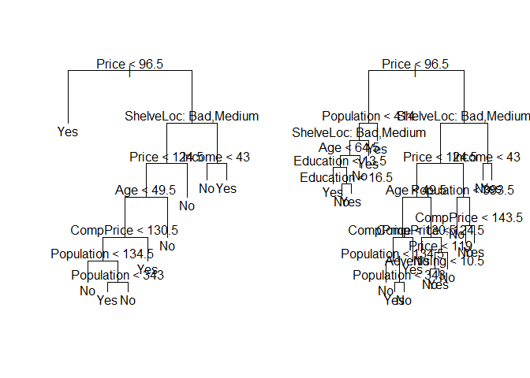
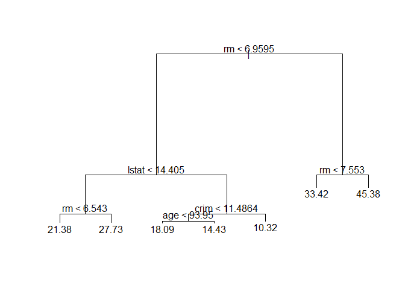
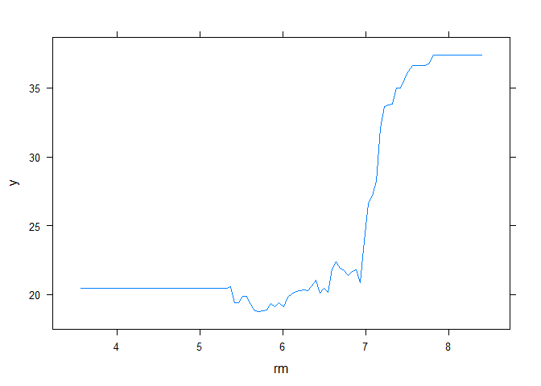

#8.3.1 Fitting Classification Trees


```r
library(tree)
library(ISLR)
attach(Carseats)
High=factor(ifelse(Sales<=8,"No","Yes"))
Carseats=data.frame(Carseats,High)
tree.carseats=tree(High~.-Sales,Carseats)
summary(tree.carseats)
```

```
## 
## Classification tree:
## tree(formula = High ~ . - Sales, data = Carseats)
## Variables actually used in tree construction:
## [1] "ShelveLoc"   "Price"       "Income"      "CompPrice"   "Population" 
## [6] "Advertising" "Age"         "US"         
## Number of terminal nodes:  27 
## Residual mean deviance:  0.4575 = 170.7 / 373 
## Misclassification error rate: 0.09 = 36 / 400
```

```r
plot(tree.carseats)
text(tree.carseats,pretty=0)
```

<!-- -->

```r
tree.carseats
```

```
## node), split, n, deviance, yval, (yprob)
##       * denotes terminal node
## 
##   1) root 400 541.500 No ( 0.59000 0.41000 )  
##     2) ShelveLoc: Bad,Medium 315 390.600 No ( 0.68889 0.31111 )  
##       4) Price < 92.5 46  56.530 Yes ( 0.30435 0.69565 )  
##         8) Income < 57 10  12.220 No ( 0.70000 0.30000 )  
##          16) CompPrice < 110.5 5   0.000 No ( 1.00000 0.00000 ) *
##          17) CompPrice > 110.5 5   6.730 Yes ( 0.40000 0.60000 ) *
##         9) Income > 57 36  35.470 Yes ( 0.19444 0.80556 )  
##          18) Population < 207.5 16  21.170 Yes ( 0.37500 0.62500 ) *
##          19) Population > 207.5 20   7.941 Yes ( 0.05000 0.95000 ) *
##       5) Price > 92.5 269 299.800 No ( 0.75465 0.24535 )  
##        10) Advertising < 13.5 224 213.200 No ( 0.81696 0.18304 )  
##          20) CompPrice < 124.5 96  44.890 No ( 0.93750 0.06250 )  
##            40) Price < 106.5 38  33.150 No ( 0.84211 0.15789 )  
##              80) Population < 177 12  16.300 No ( 0.58333 0.41667 )  
##               160) Income < 60.5 6   0.000 No ( 1.00000 0.00000 ) *
##               161) Income > 60.5 6   5.407 Yes ( 0.16667 0.83333 ) *
##              81) Population > 177 26   8.477 No ( 0.96154 0.03846 ) *
##            41) Price > 106.5 58   0.000 No ( 1.00000 0.00000 ) *
##          21) CompPrice > 124.5 128 150.200 No ( 0.72656 0.27344 )  
##            42) Price < 122.5 51  70.680 Yes ( 0.49020 0.50980 )  
##              84) ShelveLoc: Bad 11   6.702 No ( 0.90909 0.09091 ) *
##              85) ShelveLoc: Medium 40  52.930 Yes ( 0.37500 0.62500 )  
##               170) Price < 109.5 16   7.481 Yes ( 0.06250 0.93750 ) *
##               171) Price > 109.5 24  32.600 No ( 0.58333 0.41667 )  
##                 342) Age < 49.5 13  16.050 Yes ( 0.30769 0.69231 ) *
##                 343) Age > 49.5 11   6.702 No ( 0.90909 0.09091 ) *
##            43) Price > 122.5 77  55.540 No ( 0.88312 0.11688 )  
##              86) CompPrice < 147.5 58  17.400 No ( 0.96552 0.03448 ) *
##              87) CompPrice > 147.5 19  25.010 No ( 0.63158 0.36842 )  
##               174) Price < 147 12  16.300 Yes ( 0.41667 0.58333 )  
##                 348) CompPrice < 152.5 7   5.742 Yes ( 0.14286 0.85714 ) *
##                 349) CompPrice > 152.5 5   5.004 No ( 0.80000 0.20000 ) *
##               175) Price > 147 7   0.000 No ( 1.00000 0.00000 ) *
##        11) Advertising > 13.5 45  61.830 Yes ( 0.44444 0.55556 )  
##          22) Age < 54.5 25  25.020 Yes ( 0.20000 0.80000 )  
##            44) CompPrice < 130.5 14  18.250 Yes ( 0.35714 0.64286 )  
##              88) Income < 100 9  12.370 No ( 0.55556 0.44444 ) *
##              89) Income > 100 5   0.000 Yes ( 0.00000 1.00000 ) *
##            45) CompPrice > 130.5 11   0.000 Yes ( 0.00000 1.00000 ) *
##          23) Age > 54.5 20  22.490 No ( 0.75000 0.25000 )  
##            46) CompPrice < 122.5 10   0.000 No ( 1.00000 0.00000 ) *
##            47) CompPrice > 122.5 10  13.860 No ( 0.50000 0.50000 )  
##              94) Price < 125 5   0.000 Yes ( 0.00000 1.00000 ) *
##              95) Price > 125 5   0.000 No ( 1.00000 0.00000 ) *
##     3) ShelveLoc: Good 85  90.330 Yes ( 0.22353 0.77647 )  
##       6) Price < 135 68  49.260 Yes ( 0.11765 0.88235 )  
##        12) US: No 17  22.070 Yes ( 0.35294 0.64706 )  
##          24) Price < 109 8   0.000 Yes ( 0.00000 1.00000 ) *
##          25) Price > 109 9  11.460 No ( 0.66667 0.33333 ) *
##        13) US: Yes 51  16.880 Yes ( 0.03922 0.96078 ) *
##       7) Price > 135 17  22.070 No ( 0.64706 0.35294 )  
##        14) Income < 46 6   0.000 No ( 1.00000 0.00000 ) *
##        15) Income > 46 11  15.160 Yes ( 0.45455 0.54545 ) *
```


```r
set.seed(2)
train=sample(1:nrow(Carseats), 200)
Carseats.test=Carseats[-train,]
High.test=High[-train]
tree.carseats=tree(High~.-Sales,Carseats,subset=train)
tree.pred=predict(tree.carseats,Carseats.test,type="class")
table(tree.pred,High.test)
```

```
##          High.test
## tree.pred  No Yes
##       No  104  33
##       Yes  13  50
```

```r
(86+57)/200
```

```
## [1] 0.715
```


```r
set.seed(3)
cv.carseats=cv.tree(tree.carseats,FUN=prune.misclass)
names(cv.carseats)
```

```
## [1] "size"   "dev"    "k"      "method"
```

```r
cv.carseats
```

```
## $size
## [1] 21 19 14  9  8  5  3  2  1
## 
## $dev
## [1] 74 76 81 81 75 77 78 85 81
## 
## $k
## [1] -Inf  0.0  1.0  1.4  2.0  3.0  4.0  9.0 18.0
## 
## $method
## [1] "misclass"
## 
## attr(,"class")
## [1] "prune"         "tree.sequence"
```

```r
par(mfrow=c(1,2))
plot(cv.carseats$size,cv.carseats$dev,type="b")
plot(cv.carseats$k,cv.carseats$dev,type="b")
```

<!-- -->

```r
prune.carseats=prune.misclass(tree.carseats,best=9)
plot(prune.carseats)
text(prune.carseats,pretty=0)
tree.pred=predict(prune.carseats,Carseats.test,type="class")
table(tree.pred,High.test)
```

```
##          High.test
## tree.pred No Yes
##       No  97  25
##       Yes 20  58
```

```r
(94+60)/200
```

```
## [1] 0.77
```

```r
prune.carseats=prune.misclass(tree.carseats,best=15)
plot(prune.carseats)
text(prune.carseats,pretty=0)
```

<!-- -->

```r
tree.pred=predict(prune.carseats,Carseats.test,type="class")
table(tree.pred,High.test)
```

```
##          High.test
## tree.pred  No Yes
##       No  102  30
##       Yes  15  53
```

```r
(86+62)/200
```

```
## [1] 0.74
```

#8.3.2 Fitting Regression Trees


```r
library(MASS)
set.seed(1)
train = sample(1:nrow(Boston), nrow(Boston)/2)
tree.boston=tree(medv~.,Boston,subset=train)
summary(tree.boston)
```

```
## 
## Regression tree:
## tree(formula = medv ~ ., data = Boston, subset = train)
## Variables actually used in tree construction:
## [1] "rm"    "lstat" "crim"  "age"  
## Number of terminal nodes:  7 
## Residual mean deviance:  10.38 = 2555 / 246 
## Distribution of residuals:
##     Min.  1st Qu.   Median     Mean  3rd Qu.     Max. 
## -10.1800  -1.7770  -0.1775   0.0000   1.9230  16.5800
```

```r
plot(tree.boston)
text(tree.boston,pretty=0)
```

<!-- -->

```r
cv.boston=cv.tree(tree.boston)
plot(cv.boston$size,cv.boston$dev,type='b')
```

<!-- -->

```r
prune.boston=prune.tree(tree.boston,best=5)
plot(prune.boston)
text(prune.boston,pretty=0)
```

<!-- -->

```r
yhat=predict(tree.boston,newdata=Boston[-train,])
boston.test=Boston[-train,"medv"]
plot(yhat,boston.test)
abline(0,1)
```

<!-- -->

```r
mean((yhat-boston.test)^2)
```

```
## [1] 35.28688
```

#8.3.3 Bagging and Random Forests


```r
library(randomForest)
```

```
## Warning: package 'randomForest' was built under R version 4.0.3
```

```
## randomForest 4.6-14
```

```
## Type rfNews() to see new features/changes/bug fixes.
```

```r
set.seed(1)
bag.boston=randomForest(medv~.,data=Boston,subset=train,mtry=13,importance=TRUE)
bag.boston
```

```
## 
## Call:
##  randomForest(formula = medv ~ ., data = Boston, mtry = 13, importance = TRUE,      subset = train) 
##                Type of random forest: regression
##                      Number of trees: 500
## No. of variables tried at each split: 13
## 
##           Mean of squared residuals: 11.39601
##                     % Var explained: 85.17
```

```r
yhat.bag = predict(bag.boston,newdata=Boston[-train,])
plot(yhat.bag, boston.test)
abline(0,1)
```

<!-- -->

```r
mean((yhat.bag-boston.test)^2)
```

```
## [1] 23.59273
```

```r
bag.boston=randomForest(medv~.,data=Boston,subset=train,mtry=13,ntree=25)
yhat.bag = predict(bag.boston,newdata=Boston[-train,])
mean((yhat.bag-boston.test)^2)
```

```
## [1] 23.66716
```

```r
set.seed(1)
rf.boston=randomForest(medv~.,data=Boston,subset=train,mtry=6,importance=TRUE)
yhat.rf = predict(rf.boston,newdata=Boston[-train,])
mean((yhat.rf-boston.test)^2)
```

```
## [1] 19.62021
```

```r
importance(rf.boston)
```

```
##           %IncMSE IncNodePurity
## crim    16.697017    1076.08786
## zn       3.625784      88.35342
## indus    4.968621     609.53356
## chas     1.061432      52.21793
## nox     13.518179     709.87339
## rm      32.343305    7857.65451
## age     13.272498     612.21424
## dis      9.032477     714.94674
## rad      2.878434      95.80598
## tax      9.118801     364.92479
## ptratio  8.467062     823.93341
## black    7.579482     275.62272
## lstat   27.129817    6027.63740
```

```r
varImpPlot(rf.boston)
```

<!-- -->

#8.3.4 Boosting


```r
library(gbm)
```

```
## Warning: package 'gbm' was built under R version 4.0.3
```

```
## Loaded gbm 2.1.8
```

```r
set.seed(1)
boost.boston=gbm(medv~.,data=Boston[train,],distribution="gaussian",n.trees=5000,interaction.depth=4)
summary(boost.boston)
```

<!-- -->

```
##             var    rel.inf
## rm           rm 43.9919329
## lstat     lstat 33.1216941
## crim       crim  4.2604167
## dis         dis  4.0111090
## nox         nox  3.4353017
## black     black  2.8267554
## age         age  2.6113938
## ptratio ptratio  2.5403035
## tax         tax  1.4565654
## indus     indus  0.8008740
## rad         rad  0.6546400
## zn           zn  0.1446149
## chas       chas  0.1443986
```

```r
par(mfrow=c(1,2))
plot(boost.boston,i="rm")
```

<!-- -->

```r
plot(boost.boston,i="lstat")
```

<!-- -->

```r
yhat.boost=predict(boost.boston,newdata=Boston[-train,],n.trees=5000)
mean((yhat.boost-boston.test)^2)
```

```
## [1] 18.84709
```

```r
boost.boston=gbm(medv~.,data=Boston[train,],distribution="gaussian",n.trees=5000,interaction.depth=4,shrinkage=0.2,verbose=F)
yhat.boost=predict(boost.boston,newdata=Boston[-train,],n.trees=5000)
mean((yhat.boost-boston.test)^2)
```

```
## [1] 18.33455
```

## 8. In the lab, a classification tree was applied to the Carseats data set after converting Sales into a qualitative response variable. Now we will seek to predict Sales using regression trees and related approaches, treating the response as a quantitative variable.

### (a) Split the data set into a training set and a test set.


```r
summary(Carseats)
```

```
##      Sales          CompPrice       Income        Advertising    
##  Min.   : 0.000   Min.   : 77   Min.   : 21.00   Min.   : 0.000  
##  1st Qu.: 5.390   1st Qu.:115   1st Qu.: 42.75   1st Qu.: 0.000  
##  Median : 7.490   Median :125   Median : 69.00   Median : 5.000  
##  Mean   : 7.496   Mean   :125   Mean   : 68.66   Mean   : 6.635  
##  3rd Qu.: 9.320   3rd Qu.:135   3rd Qu.: 91.00   3rd Qu.:12.000  
##  Max.   :16.270   Max.   :175   Max.   :120.00   Max.   :29.000  
##    Population        Price        ShelveLoc        Age          Education   
##  Min.   : 10.0   Min.   : 24.0   Bad   : 96   Min.   :25.00   Min.   :10.0  
##  1st Qu.:139.0   1st Qu.:100.0   Good  : 85   1st Qu.:39.75   1st Qu.:12.0  
##  Median :272.0   Median :117.0   Medium:219   Median :54.50   Median :14.0  
##  Mean   :264.8   Mean   :115.8                Mean   :53.32   Mean   :13.9  
##  3rd Qu.:398.5   3rd Qu.:131.0                3rd Qu.:66.00   3rd Qu.:16.0  
##  Max.   :509.0   Max.   :191.0                Max.   :80.00   Max.   :18.0  
##  Urban       US       High    
##  No :118   No :142   No :236  
##  Yes:282   Yes:258   Yes:164  
##                               
##                               
##                               
## 
```


```r
set.seed(10)
train=sample(1:nrow(Carseats), 200)
Carseats.test=Carseats[-train,]
Carseats.train=Carseats[train,]
summary(Carseats.test)
```

```
##      Sales          CompPrice         Income        Advertising    
##  Min.   : 0.000   Min.   : 77.0   Min.   : 21.00   Min.   : 0.000  
##  1st Qu.: 5.383   1st Qu.:115.0   1st Qu.: 42.00   1st Qu.: 0.000  
##  Median : 7.470   Median :124.0   Median : 72.50   Median : 6.000  
##  Mean   : 7.463   Mean   :124.6   Mean   : 70.90   Mean   : 7.015  
##  3rd Qu.: 9.360   3rd Qu.:133.2   3rd Qu.: 96.25   3rd Qu.:12.000  
##  Max.   :13.910   Max.   :175.0   Max.   :120.00   Max.   :29.000  
##    Population        Price         ShelveLoc        Age          Education    
##  Min.   : 16.0   Min.   : 24.00   Bad   : 46   Min.   :25.00   Min.   :10.00  
##  1st Qu.:135.5   1st Qu.: 99.75   Good  : 36   1st Qu.:42.00   1st Qu.:11.00  
##  Median :294.0   Median :117.00   Medium:118   Median :56.00   Median :14.00  
##  Mean   :272.3   Mean   :115.54                Mean   :54.02   Mean   :13.87  
##  3rd Qu.:408.0   3rd Qu.:132.00                3rd Qu.:66.00   3rd Qu.:16.00  
##  Max.   :509.0   Max.   :191.00                Max.   :80.00   Max.   :18.00  
##  Urban       US       High    
##  No : 65   No : 72   No :117  
##  Yes:135   Yes:128   Yes: 83  
##                               
##                               
##                               
## 
```


```r
summary(Carseats.train)
```

```
##      Sales          CompPrice         Income        Advertising    
##  Min.   : 0.530   Min.   : 86.0   Min.   : 21.00   Min.   : 0.000  
##  1st Qu.: 5.405   1st Qu.:115.8   1st Qu.: 44.00   1st Qu.: 0.000  
##  Median : 7.505   Median :126.0   Median : 67.00   Median : 4.500  
##  Mean   : 7.529   Mean   :125.4   Mean   : 66.42   Mean   : 6.255  
##  3rd Qu.: 9.145   3rd Qu.:136.0   3rd Qu.: 87.25   3rd Qu.:11.000  
##  Max.   :16.270   Max.   :162.0   Max.   :120.00   Max.   :25.000  
##    Population        Price        ShelveLoc        Age          Education    
##  Min.   : 10.0   Min.   : 53.0   Bad   : 50   Min.   :25.00   Min.   :10.00  
##  1st Qu.:144.0   1st Qu.:100.8   Good  : 49   1st Qu.:38.75   1st Qu.:12.00  
##  Median :253.5   Median :118.0   Medium:101   Median :54.00   Median :14.00  
##  Mean   :257.4   Mean   :116.0                Mean   :52.63   Mean   :13.94  
##  3rd Qu.:371.2   3rd Qu.:131.0                3rd Qu.:65.25   3rd Qu.:16.00  
##  Max.   :507.0   Max.   :173.0                Max.   :80.00   Max.   :18.00  
##  Urban       US       High    
##  No : 53   No : 70   No :119  
##  Yes:147   Yes:130   Yes: 81  
##                               
##                               
##                               
## 
```
### (b) Fit a regression tree to the training set. Plot the tree, and interpret the results. What test MSE do you obtain?


```r
tree.carseats=tree(Sales~.-High,Carseats,subset=train)
summary(tree.carseats)
```

```
## 
## Regression tree:
## tree(formula = Sales ~ . - High, data = Carseats, subset = train)
## Variables actually used in tree construction:
## [1] "ShelveLoc"  "Price"      "Age"        "CompPrice"  "Population"
## Number of terminal nodes:  14 
## Residual mean deviance:  2.378 = 442.2 / 186 
## Distribution of residuals:
##     Min.  1st Qu.   Median     Mean  3rd Qu.     Max. 
## -4.33500 -1.02300  0.06757  0.00000  0.96470  3.93500
```

```r
plot(tree.carseats);text(tree.carseats,pretty=0)
```

<!-- -->


```r
yhat=predict(tree.carseats,newdata=Carseats.test)
Sales.test=Carseats.test$Sales
plot(yhat,Sales.test)
abline(0,1)
```

<!-- -->


```r
mean((yhat-Sales.test)^2)
```

```
## [1] 5.202316
```
> MSE = 5.202316

### (c) Use cross-validation in order to determine the optimal level of tree complexity. Does pruning the tree improve the test MSE?


```r
cv.carseats=cv.tree(tree.carseats)
cv.carseats
```

```
## $size
##  [1] 14 13 12 11 10  9  8  7  6  5  4  3  2  1
## 
## $dev
##  [1]  893.1324  900.3290  912.4075  936.4278  878.9263  917.8692  884.7051
##  [8]  853.0551  844.0771  854.5742 1076.6085 1162.2509 1159.3051 1767.1745
## 
## $k
##  [1]      -Inf  19.14501  22.24734  23.49986  29.08834  32.47551  35.34111
##  [8]  36.08833  38.52841  62.04761 112.46401 124.27017 135.12634 625.80556
## 
## $method
## [1] "deviance"
## 
## attr(,"class")
## [1] "prune"         "tree.sequence"
```


```r
plot(cv.carseats$size,cv.carseats$dev,type='b')
```

<!-- -->


```r
prune.carseats=prune.tree(tree.carseats,best=6)
plot(prune.carseats);text(prune.carseats,pretty=0)
```

<!-- -->


```r
yhat=predict(prune.carseats,newdata=Carseats.test)
Sales.test=Carseats.test$Sales
plot(yhat,Sales.test)
abline(0,1)
```

<!-- -->


```r
mean((yhat-Sales.test)^2)
```

```
## [1] 4.855375
```

> MSE = 4.855375, better
