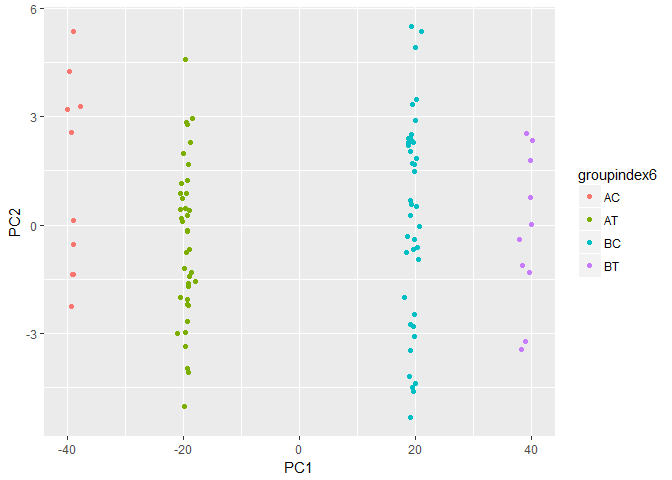
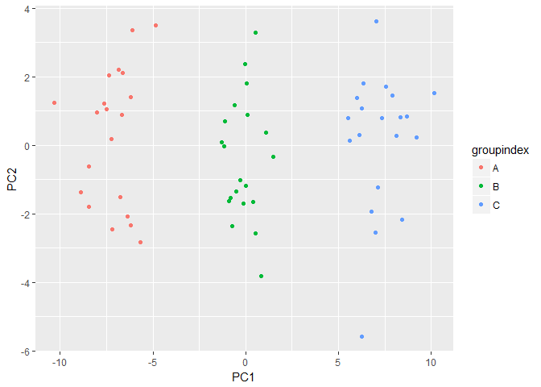

# Chapter 10 Lab 1: Principal Components Analysis


```r
states=row.names(USArrests)
states
```

```
##  [1] "Alabama"        "Alaska"         "Arizona"        "Arkansas"      
##  [5] "California"     "Colorado"       "Connecticut"    "Delaware"      
##  [9] "Florida"        "Georgia"        "Hawaii"         "Idaho"         
## [13] "Illinois"       "Indiana"        "Iowa"           "Kansas"        
## [17] "Kentucky"       "Louisiana"      "Maine"          "Maryland"      
## [21] "Massachusetts"  "Michigan"       "Minnesota"      "Mississippi"   
## [25] "Missouri"       "Montana"        "Nebraska"       "Nevada"        
## [29] "New Hampshire"  "New Jersey"     "New Mexico"     "New York"      
## [33] "North Carolina" "North Dakota"   "Ohio"           "Oklahoma"      
## [37] "Oregon"         "Pennsylvania"   "Rhode Island"   "South Carolina"
## [41] "South Dakota"   "Tennessee"      "Texas"          "Utah"          
## [45] "Vermont"        "Virginia"       "Washington"     "West Virginia" 
## [49] "Wisconsin"      "Wyoming"
```

```r
names(USArrests)
```

```
## [1] "Murder"   "Assault"  "UrbanPop" "Rape"
```

```r
dimnames(USArrests)
```

```
## [[1]]
##  [1] "Alabama"        "Alaska"         "Arizona"        "Arkansas"      
##  [5] "California"     "Colorado"       "Connecticut"    "Delaware"      
##  [9] "Florida"        "Georgia"        "Hawaii"         "Idaho"         
## [13] "Illinois"       "Indiana"        "Iowa"           "Kansas"        
## [17] "Kentucky"       "Louisiana"      "Maine"          "Maryland"      
## [21] "Massachusetts"  "Michigan"       "Minnesota"      "Mississippi"   
## [25] "Missouri"       "Montana"        "Nebraska"       "Nevada"        
## [29] "New Hampshire"  "New Jersey"     "New Mexico"     "New York"      
## [33] "North Carolina" "North Dakota"   "Ohio"           "Oklahoma"      
## [37] "Oregon"         "Pennsylvania"   "Rhode Island"   "South Carolina"
## [41] "South Dakota"   "Tennessee"      "Texas"          "Utah"          
## [45] "Vermont"        "Virginia"       "Washington"     "West Virginia" 
## [49] "Wisconsin"      "Wyoming"       
## 
## [[2]]
## [1] "Murder"   "Assault"  "UrbanPop" "Rape"
```

```r
apply(USArrests, 2, mean)
```

```
##   Murder  Assault UrbanPop     Rape 
##    7.788  170.760   65.540   21.232
```

```r
apply(USArrests, 2, var)
```

```
##     Murder    Assault   UrbanPop       Rape 
##   18.97047 6945.16571  209.51878   87.72916
```

```r
pr.out=prcomp(USArrests, scale=TRUE)
pr.out
```

```
## Standard deviations (1, .., p=4):
## [1] 1.5748783 0.9948694 0.5971291 0.4164494
## 
## Rotation (n x k) = (4 x 4):
##                 PC1        PC2        PC3         PC4
## Murder   -0.5358995  0.4181809 -0.3412327  0.64922780
## Assault  -0.5831836  0.1879856 -0.2681484 -0.74340748
## UrbanPop -0.2781909 -0.8728062 -0.3780158  0.13387773
## Rape     -0.5434321 -0.1673186  0.8177779  0.08902432
```

```r
names(pr.out)
```

```
## [1] "sdev"     "rotation" "center"   "scale"    "x"
```

```r
pr.out$center
```

```
##   Murder  Assault UrbanPop     Rape 
##    7.788  170.760   65.540   21.232
```

```r
pr.out$scale
```

```
##    Murder   Assault  UrbanPop      Rape 
##  4.355510 83.337661 14.474763  9.366385
```

```r
pr.out$rotation
```

```
##                 PC1        PC2        PC3         PC4
## Murder   -0.5358995  0.4181809 -0.3412327  0.64922780
## Assault  -0.5831836  0.1879856 -0.2681484 -0.74340748
## UrbanPop -0.2781909 -0.8728062 -0.3780158  0.13387773
## Rape     -0.5434321 -0.1673186  0.8177779  0.08902432
```

```r
dim(pr.out$x)
```

```
## [1] 50  4
```

```r
biplot(pr.out, scale=0)
```

<!-- -->

```r
biplot(pr.out, scale=0, cex=0.6)
```

<!-- -->

```r
pr.out$rotation=-pr.out$rotation
pr.out$x=-pr.out$x
biplot(pr.out, scale=0)
```

<!-- -->

```r
biplot(pr.out, scale=0, cex=0.6)
```

<!-- -->

```r
pr.out$sdev
```

```
## [1] 1.5748783 0.9948694 0.5971291 0.4164494
```

```r
pr.var=pr.out$sdev^2
pr.var
```

```
## [1] 2.4802416 0.9897652 0.3565632 0.1734301
```

```r
pve=pr.var/sum(pr.var)
pve
```

```
## [1] 0.62006039 0.24744129 0.08914080 0.04335752
```

```r
plot(pve, xlab="Principal Component", ylab="Proportion of Variance Explained", ylim=c(0,1),type='b')
```

<!-- -->

```r
plot(cumsum(pve), xlab="Principal Component", ylab="Cumulative Proportion of Variance Explained", ylim=c(0,1),type='b')
```

<!-- -->

```r
a=c(1,2,8,-3)
cumsum(a)
```

```
## [1]  1  3 11  8
```

# 6. A researcher collects expression measurements for 1,000 genes in 100 tissue samples. The data can be written as a 1, 000 × 100 matrix, which we call X, in which each row represents a gene and each column a tissue sample. Each tissue sample was processed on a different day, and the columns of X are ordered so that the samples that were processed earliest are on the left, and the samples that were processed later are on the right. The tissue samples belong to two groups: control (C) and treatment (T). The C and T samples were processed in a random order across the days. The researcher wishes to determine whether each gene’s expression measurements differ between the treatment and control groups. 
As a pre-analysis (before comparing T versus C), the researcher performs a principal component analysis of the data, and finds that the first principal component (a vector of length 100) has a strong linear trend from left to right, and explains 10 % of the variation. The researcher now remembers that each patient sample was run on one of
two machines, A and B, and machine A was used more often in the earlier times while B was used more often later. The researcher has a record of which sample was run on which machine.

## (a) Explain what it means that the first principal component “explains 10 % of the variation”.

> The proportion of variance explained (PVE) by each principal component. This means PC1 contains 10 % of total variance present in this data set.

## (b) The researcher decides to replace the (j, i)th element of X with
x ji − φ j1 z i1
where z i1 is the ith score, and φ j1 is the jth loading, for the first principal component. He will then perform a two-sample t-test on each gene in this new data set in order to determine whether its expression differs between the two conditions. Critique this idea, and suggest a better approach. (The principal component analysis is performed on X T ).

> Since each patient sample was run on one of two machines, A and B, and machine A was used more often in the earlier times while B was used more often later. If the tissue samples belong to two groups control (C) and treatment (T) samples were not equally run on one of two machines, this approach may has bias. We should rescale the data base on the information of machines.

## (c) Design and run a small simulation experiment to demonstrate the superiority of your idea.


```r
set.seed(1)
AC = matrix(rnorm(10*1000,mean = 1),ncol = 1000)
AT = matrix(rnorm(40*1000,mean = 2),ncol = 1000)
BC = matrix(rnorm(40*1000,mean = 4),ncol = 1000)
BT = matrix(rnorm(10*1000,mean = 5),ncol = 1000)
dim(AC)
```

```
## [1]   10 1000
```

```r
data6=rbind(AC,AT,BC,BT)
dim(data6)
```

```
## [1]  100 1000
```

```r
groupindex6=c(rep("AC", 10), rep("AT", 40), rep("BC", 40), rep("BT", 10))
pca.out6 <- prcomp(data6, scale=TRUE)
summary(pca.out6)
```

```
## Importance of components:
##                            PC1    PC2     PC3    PC4    PC5     PC6
## Standard deviation     24.8735 2.5497 2.53681 2.5306 2.5090 2.48308
## Proportion of Variance  0.6187 0.0065 0.00644 0.0064 0.0063 0.00617
## Cumulative Proportion   0.6187 0.6252 0.63163 0.6380 0.6443 0.65049
##                            PC7     PC8     PC9    PC10    PC11    PC12
## Standard deviation     2.46024 2.44480 2.43147 2.40665 2.38853 2.36271
## Proportion of Variance 0.00605 0.00598 0.00591 0.00579 0.00571 0.00558
## Cumulative Proportion  0.65655 0.66252 0.66844 0.67423 0.67993 0.68551
##                           PC13    PC14    PC15    PC16    PC17    PC18
## Standard deviation     2.35299 2.34634 2.33377 2.31967 2.30360 2.28714
## Proportion of Variance 0.00554 0.00551 0.00545 0.00538 0.00531 0.00523
## Cumulative Proportion  0.69105 0.69656 0.70200 0.70738 0.71269 0.71792
##                          PC19    PC20    PC21    PC22    PC23    PC24
## Standard deviation     2.2808 2.26011 2.25061 2.23151 2.22583 2.20296
## Proportion of Variance 0.0052 0.00511 0.00507 0.00498 0.00495 0.00485
## Cumulative Proportion  0.7231 0.72823 0.73330 0.73828 0.74323 0.74808
##                           PC25    PC26    PC27    PC28    PC29    PC30
## Standard deviation     2.19713 2.18266 2.17796 2.17190 2.16337 2.14332
## Proportion of Variance 0.00483 0.00476 0.00474 0.00472 0.00468 0.00459
## Cumulative Proportion  0.75291 0.75768 0.76242 0.76714 0.77182 0.77641
##                           PC31    PC32    PC33    PC34    PC35    PC36
## Standard deviation     2.13550 2.12553 2.11472 2.10181 2.08747 2.08226
## Proportion of Variance 0.00456 0.00452 0.00447 0.00442 0.00436 0.00434
## Cumulative Proportion  0.78097 0.78549 0.78996 0.79438 0.79874 0.80307
##                           PC37    PC38    PC39    PC40    PC41    PC42
## Standard deviation     2.07660 2.06344 2.05951 2.04415 2.03338 2.03027
## Proportion of Variance 0.00431 0.00426 0.00424 0.00418 0.00413 0.00412
## Cumulative Proportion  0.80738 0.81164 0.81588 0.82006 0.82420 0.82832
##                           PC43    PC44    PC45    PC46    PC47   PC48
## Standard deviation     2.01690 2.01087 2.00266 1.99701 1.98511 1.9747
## Proportion of Variance 0.00407 0.00404 0.00401 0.00399 0.00394 0.0039
## Cumulative Proportion  0.83239 0.83643 0.84044 0.84443 0.84837 0.8523
##                           PC49    PC50   PC51    PC52   PC53    PC54
## Standard deviation     1.96448 1.95277 1.9502 1.93668 1.9236 1.90525
## Proportion of Variance 0.00386 0.00381 0.0038 0.00375 0.0037 0.00363
## Cumulative Proportion  0.85613 0.85994 0.8637 0.86749 0.8712 0.87482
##                           PC55    PC56   PC57    PC58    PC59    PC60
## Standard deviation     1.89264 1.88096 1.8706 1.85998 1.85929 1.85044
## Proportion of Variance 0.00358 0.00354 0.0035 0.00346 0.00346 0.00342
## Cumulative Proportion  0.87841 0.88194 0.8854 0.88890 0.89236 0.89578
##                          PC61    PC62    PC63    PC64    PC65    PC66
## Standard deviation     1.8430 1.82249 1.80472 1.80424 1.79909 1.79198
## Proportion of Variance 0.0034 0.00332 0.00326 0.00326 0.00324 0.00321
## Cumulative Proportion  0.8992 0.90250 0.90576 0.90901 0.91225 0.91546
##                           PC67    PC68    PC69    PC70    PC71    PC72
## Standard deviation     1.77910 1.77306 1.75825 1.75263 1.73010 1.72311
## Proportion of Variance 0.00317 0.00314 0.00309 0.00307 0.00299 0.00297
## Cumulative Proportion  0.91863 0.92177 0.92486 0.92793 0.93093 0.93390
##                           PC73    PC74    PC75    PC76    PC77    PC78
## Standard deviation     1.71701 1.71062 1.70463 1.67711 1.66594 1.66180
## Proportion of Variance 0.00295 0.00293 0.00291 0.00281 0.00278 0.00276
## Cumulative Proportion  0.93684 0.93977 0.94268 0.94549 0.94827 0.95103
##                           PC79    PC80    PC81    PC82   PC83    PC84
## Standard deviation     1.65130 1.64537 1.63696 1.62347 1.6110 1.59123
## Proportion of Variance 0.00273 0.00271 0.00268 0.00264 0.0026 0.00253
## Cumulative Proportion  0.95375 0.95646 0.95914 0.96178 0.9644 0.96690
##                           PC85    PC86    PC87    PC88    PC89    PC90
## Standard deviation     1.57847 1.57467 1.55992 1.53927 1.53267 1.51955
## Proportion of Variance 0.00249 0.00248 0.00243 0.00237 0.00235 0.00231
## Cumulative Proportion  0.96939 0.97187 0.97431 0.97668 0.97903 0.98134
##                           PC91    PC92   PC93   PC94    PC95    PC96
## Standard deviation     1.51216 1.48714 1.4836 1.4476 1.44168 1.42653
## Proportion of Variance 0.00229 0.00221 0.0022 0.0021 0.00208 0.00203
## Cumulative Proportion  0.98362 0.98583 0.9880 0.9901 0.99221 0.99424
##                           PC97    PC98    PC99     PC100
## Standard deviation     1.40928 1.38444 1.36148 3.108e-15
## Proportion of Variance 0.00199 0.00192 0.00185 0.000e+00
## Cumulative Proportion  0.99623 0.99815 1.00000 1.000e+00
```

```r
biplot(pca.out6,scale = 0,cex=0.5)

names(pca.out6)
```

```
## [1] "sdev"     "rotation" "center"   "scale"    "x"
```

```r
scorematrix6=as.data.frame(pca.out6$x)
dim(scorematrix6)
```

```
## [1] 100 100
```

```r
library(ggplot2)
```

<!-- -->

```r
ggplot(scorematrix6, aes(x=PC1, y=PC2, color=groupindex6)) + geom_point()
```

<!-- -->

```r
newAC= AC/1.5
newAT= AT/1.5
newBC= BC/4.5
newBT= BT/4.5

dim(newAC)
```

```
## [1]   10 1000
```

```r
data6new=rbind(newAC,newAT,newBC,newBT)
dim(data6new)
```

```
## [1]  100 1000
```

```r
pca.out6new <- prcomp(data6new, scale=TRUE)
summary(pca.out6new)
```

```
## Importance of components:
##                            PC1     PC2    PC3     PC4     PC5     PC6
## Standard deviation     14.0963 4.59410 4.5386 4.49964 4.45693 4.40977
## Proportion of Variance  0.1987 0.02111 0.0206 0.02025 0.01986 0.01945
## Cumulative Proportion   0.1987 0.21981 0.2404 0.26066 0.28052 0.29997
##                            PC7     PC8     PC9    PC10    PC11    PC12
## Standard deviation     4.36859 4.32939 4.31929 4.27859 4.25022 4.22929
## Proportion of Variance 0.01908 0.01874 0.01866 0.01831 0.01806 0.01789
## Cumulative Proportion  0.31905 0.33780 0.35645 0.37476 0.39282 0.41071
##                           PC13    PC14    PC15   PC16    PC17   PC18
## Standard deviation     4.17557 4.13202 4.12739 4.0860 4.06863 4.0494
## Proportion of Variance 0.01744 0.01707 0.01704 0.0167 0.01655 0.0164
## Cumulative Proportion  0.42815 0.44522 0.46225 0.4789 0.49550 0.5119
##                           PC19    PC20    PC21    PC22    PC23   PC24
## Standard deviation     4.01021 4.00108 3.96660 3.92933 3.90185 3.8861
## Proportion of Variance 0.01608 0.01601 0.01573 0.01544 0.01522 0.0151
## Cumulative Proportion  0.52798 0.54399 0.55973 0.57516 0.59039 0.6055
##                           PC25    PC26    PC27    PC28    PC29    PC30
## Standard deviation     3.84937 3.82924 3.81427 3.78411 3.75222 3.73184
## Proportion of Variance 0.01482 0.01466 0.01455 0.01432 0.01408 0.01393
## Cumulative Proportion  0.62031 0.63497 0.64952 0.66384 0.67792 0.69185
##                           PC31    PC32    PC33    PC34   PC35    PC36
## Standard deviation     3.70920 3.65862 3.63521 3.59394 3.5775 3.54409
## Proportion of Variance 0.01376 0.01339 0.01321 0.01292 0.0128 0.01256
## Cumulative Proportion  0.70560 0.71899 0.73220 0.74512 0.7579 0.77048
##                           PC37    PC38    PC39   PC40    PC41    PC42
## Standard deviation     3.51748 3.49536 3.46888 3.4055 3.38538 3.36664
## Proportion of Variance 0.01237 0.01222 0.01203 0.0116 0.01146 0.01133
## Cumulative Proportion  0.78285 0.79507 0.80710 0.8187 0.83016 0.84150
##                           PC43    PC44    PC45    PC46    PC47    PC48
## Standard deviation     3.33682 3.28469 3.26149 3.20112 3.15794 3.13223
## Proportion of Variance 0.01113 0.01079 0.01064 0.01025 0.00997 0.00981
## Cumulative Proportion  0.85263 0.86342 0.87406 0.88430 0.89428 0.90409
##                           PC49    PC50    PC51    PC52    PC53    PC54
## Standard deviation     2.98696 2.97085 1.60112 1.56093 1.52920 1.50335
## Proportion of Variance 0.00892 0.00883 0.00256 0.00244 0.00234 0.00226
## Cumulative Proportion  0.91301 0.92184 0.92440 0.92684 0.92917 0.93143
##                           PC55    PC56    PC57    PC58    PC59    PC60
## Standard deviation     1.45537 1.44510 1.43501 1.42691 1.41719 1.40460
## Proportion of Variance 0.00212 0.00209 0.00206 0.00204 0.00201 0.00197
## Cumulative Proportion  0.93355 0.93564 0.93770 0.93974 0.94174 0.94372
##                           PC61   PC62    PC63    PC64    PC65    PC66
## Standard deviation     1.38525 1.3795 1.35804 1.35560 1.34952 1.33094
## Proportion of Variance 0.00192 0.0019 0.00184 0.00184 0.00182 0.00177
## Cumulative Proportion  0.94564 0.9475 0.94938 0.95122 0.95304 0.95481
##                           PC67    PC68    PC69    PC70    PC71   PC72
## Standard deviation     1.32501 1.31834 1.29837 1.28962 1.27081 1.2666
## Proportion of Variance 0.00176 0.00174 0.00169 0.00166 0.00161 0.0016
## Cumulative Proportion  0.95657 0.95831 0.95999 0.96166 0.96327 0.9649
##                           PC73    PC74    PC75    PC76    PC77   PC78
## Standard deviation     1.26260 1.25413 1.24330 1.23601 1.22767 1.2263
## Proportion of Variance 0.00159 0.00157 0.00155 0.00153 0.00151 0.0015
## Cumulative Proportion  0.96647 0.96804 0.96959 0.97112 0.97262 0.9741
##                           PC79    PC80    PC81    PC82    PC83    PC84
## Standard deviation     1.20996 1.20066 1.18855 1.18037 1.16563 1.16548
## Proportion of Variance 0.00146 0.00144 0.00141 0.00139 0.00136 0.00136
## Cumulative Proportion  0.97559 0.97703 0.97845 0.97984 0.98120 0.98256
##                           PC85   PC86    PC87    PC88    PC89    PC90
## Standard deviation     1.15854 1.1417 1.13614 1.12762 1.11668 1.10850
## Proportion of Variance 0.00134 0.0013 0.00129 0.00127 0.00125 0.00123
## Cumulative Proportion  0.98390 0.9852 0.98649 0.98776 0.98901 0.99024
##                           PC91    PC92    PC93   PC94    PC95    PC96
## Standard deviation     1.10240 1.08163 1.07002 1.0502 1.04567 1.03053
## Proportion of Variance 0.00122 0.00117 0.00114 0.0011 0.00109 0.00106
## Cumulative Proportion  0.99145 0.99262 0.99377 0.9949 0.99597 0.99703
##                           PC97    PC98    PC99    PC100
## Standard deviation     1.02117 0.99565 0.96873 6.26e-15
## Proportion of Variance 0.00104 0.00099 0.00094 0.00e+00
## Cumulative Proportion  0.99807 0.99906 1.00000 1.00e+00
```

```r
biplot(pca.out6new,scale = 0,cex=0.5)
```

<!-- -->

```r
names(pca.out6new)
```

```
## [1] "sdev"     "rotation" "center"   "scale"    "x"
```

```r
scorematrix6new=as.data.frame(pca.out6new$x)
dim(scorematrix6new)
```

```
## [1] 100 100
```

```r
ggplot(scorematrix6new, aes(x=PC1, y=PC2, color=groupindex6)) + geom_point()
```

<!-- -->


# 8. In Section 10.2.3, a formula for calculating PVE was given in Equation 10.8. We also saw that the PVE can be obtained using the sdev output of the prcomp() function.
On the USArrests data, calculate PVE in two ways:

## (a) Using the sdev output of the prcomp() function, as was done in Section 10.2.3.


```r
pr.out=prcomp(USArrests, scale=TRUE)
pr.out
```

```
## Standard deviations (1, .., p=4):
## [1] 1.5748783 0.9948694 0.5971291 0.4164494
## 
## Rotation (n x k) = (4 x 4):
##                 PC1        PC2        PC3         PC4
## Murder   -0.5358995  0.4181809 -0.3412327  0.64922780
## Assault  -0.5831836  0.1879856 -0.2681484 -0.74340748
## UrbanPop -0.2781909 -0.8728062 -0.3780158  0.13387773
## Rape     -0.5434321 -0.1673186  0.8177779  0.08902432
```

```r
pr.out$sdev
```

```
## [1] 1.5748783 0.9948694 0.5971291 0.4164494
```

```r
pr.var=pr.out$sdev^2
pr.var
```

```
## [1] 2.4802416 0.9897652 0.3565632 0.1734301
```

```r
pve=pr.var/sum(pr.var)
pve
```

```
## [1] 0.62006039 0.24744129 0.08914080 0.04335752
```


## (b) By applying Equation 10.8 directly. That is, use the prcomp() function to compute the principal component loadings. Then, use those loadings in Equation 10.8 to obtain the PVE. 
These two approaches should give the same results.
Hint: You will only obtain the same results in (a) and (b) if the same data is used in both cases. For instance, if in (a) you performed prcomp() using centered and scaled variables, then you must center and scale the variables before applying Equation 10.3 in (b).


```r
pr.out=prcomp(USArrests, scale=TRUE)
pr.out
```

```
## Standard deviations (1, .., p=4):
## [1] 1.5748783 0.9948694 0.5971291 0.4164494
## 
## Rotation (n x k) = (4 x 4):
##                 PC1        PC2        PC3         PC4
## Murder   -0.5358995  0.4181809 -0.3412327  0.64922780
## Assault  -0.5831836  0.1879856 -0.2681484 -0.74340748
## UrbanPop -0.2781909 -0.8728062 -0.3780158  0.13387773
## Rape     -0.5434321 -0.1673186  0.8177779  0.08902432
```

```r
newUSArrests=scale(USArrests)
summary(USArrests)
```

```
##      Murder          Assault         UrbanPop          Rape      
##  Min.   : 0.800   Min.   : 45.0   Min.   :32.00   Min.   : 7.30  
##  1st Qu.: 4.075   1st Qu.:109.0   1st Qu.:54.50   1st Qu.:15.07  
##  Median : 7.250   Median :159.0   Median :66.00   Median :20.10  
##  Mean   : 7.788   Mean   :170.8   Mean   :65.54   Mean   :21.23  
##  3rd Qu.:11.250   3rd Qu.:249.0   3rd Qu.:77.75   3rd Qu.:26.18  
##  Max.   :17.400   Max.   :337.0   Max.   :91.00   Max.   :46.00
```

```r
summary(newUSArrests)
```

```
##      Murder           Assault           UrbanPop             Rape        
##  Min.   :-1.6044   Min.   :-1.5090   Min.   :-2.31714   Min.   :-1.4874  
##  1st Qu.:-0.8525   1st Qu.:-0.7411   1st Qu.:-0.76271   1st Qu.:-0.6574  
##  Median :-0.1235   Median :-0.1411   Median : 0.03178   Median :-0.1209  
##  Mean   : 0.0000   Mean   : 0.0000   Mean   : 0.00000   Mean   : 0.0000  
##  3rd Qu.: 0.7949   3rd Qu.: 0.9388   3rd Qu.: 0.84354   3rd Qu.: 0.5277  
##  Max.   : 2.2069   Max.   : 1.9948   Max.   : 1.75892   Max.   : 2.6444
```

```r
head(newUSArrests)
```

```
##                Murder   Assault   UrbanPop         Rape
## Alabama    1.24256408 0.7828393 -0.5209066 -0.003416473
## Alaska     0.50786248 1.1068225 -1.2117642  2.484202941
## Arizona    0.07163341 1.4788032  0.9989801  1.042878388
## Arkansas   0.23234938 0.2308680 -1.0735927 -0.184916602
## California 0.27826823 1.2628144  1.7589234  2.067820292
## Colorado   0.02571456 0.3988593  0.8608085  1.864967207
```

```r
score=pr.out$rotation
score
```

```
##                 PC1        PC2        PC3         PC4
## Murder   -0.5358995  0.4181809 -0.3412327  0.64922780
## Assault  -0.5831836  0.1879856 -0.2681484 -0.74340748
## UrbanPop -0.2781909 -0.8728062 -0.3780158  0.13387773
## Rape     -0.5434321 -0.1673186  0.8177779  0.08902432
```

```r
newUSArrests.score=newUSArrests%*%score
head(newUSArrests.score)
```

```
##                   PC1        PC2         PC3          PC4
## Alabama    -0.9756604  1.1220012 -0.43980366  0.154696581
## Alaska     -1.9305379  1.0624269  2.01950027 -0.434175454
## Arizona    -1.7454429 -0.7384595  0.05423025 -0.826264240
## Arkansas    0.1399989  1.1085423  0.11342217 -0.180973554
## California -2.4986128 -1.5274267  0.59254100 -0.338559240
## Colorado   -1.4993407 -0.9776297  1.08400162  0.001450164
```

```r
e10.8up=apply(newUSArrests.score^2,2,sum)
e10.8low=sum(apply(newUSArrests^2,2,sum))
e10.8up/e10.8low
```

```
##        PC1        PC2        PC3        PC4 
## 0.62006039 0.24744129 0.08914080 0.04335752
```


# 10. In this problem, you will generate simulated data, and then perform PCA and K-means clustering on the data.

## (a) Generate a simulated data set with 20 observations in each of three classes (i.e. 60 observations total), and 50 variables.
Hint: There are a number of functions in R that you can use to generate data. One example is the rnorm() function; runif() is another option. Be sure to add a mean shift to the observations in each class so that there are three distinct classes.


```r
set.seed(1)
A = matrix(rnorm(1000,mean = 1),ncol = 50)
B = matrix(rnorm(1000,mean = 2),ncol = 50)
C = matrix(rnorm(1000,mean = 3),ncol = 50)
dim(C)
```

```
## [1] 20 50
```

```r
data10=rbind(A,B,C)
dim(data10)
```

```
## [1] 60 50
```


## (b) Perform PCA on the 60 observations and plot the first two principal component score vectors. Use a different color to indicate the observations in each of the three classes. If the three classes appear separated in this plot, then continue on to part (c). If not, then return to part (a) and modify the simulation so that there is greater separation between the three classes. Do not continue to part (c) until the three classes show at least some separation in the first two principal component score vectors.


```r
groupindex=c(rep("A", 20), rep("B", 20), rep("C", 20))
pca.out <- prcomp(data10)
biplot(pca.out,scale = 0,cex=0.5)
```

<!-- -->

```r
names(pca.out)
```

```
## [1] "sdev"     "rotation" "center"   "scale"    "x"
```

```r
scorematrix=as.data.frame(pca.out$x)
colnames(scorematrix)
```

```
##  [1] "PC1"  "PC2"  "PC3"  "PC4"  "PC5"  "PC6"  "PC7"  "PC8"  "PC9"  "PC10"
## [11] "PC11" "PC12" "PC13" "PC14" "PC15" "PC16" "PC17" "PC18" "PC19" "PC20"
## [21] "PC21" "PC22" "PC23" "PC24" "PC25" "PC26" "PC27" "PC28" "PC29" "PC30"
## [31] "PC31" "PC32" "PC33" "PC34" "PC35" "PC36" "PC37" "PC38" "PC39" "PC40"
## [41] "PC41" "PC42" "PC43" "PC44" "PC45" "PC46" "PC47" "PC48" "PC49" "PC50"
```

```r
library(ggplot2)
ggplot(scorematrix, aes(x=PC1, y=PC2, color=groupindex)) + geom_point()
```

<!-- -->

