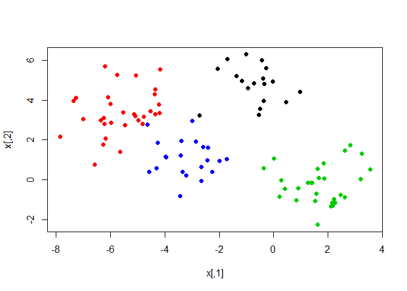
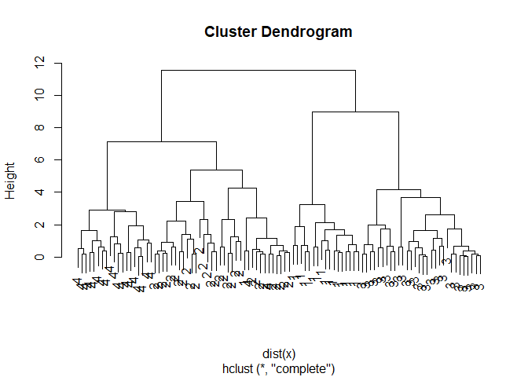
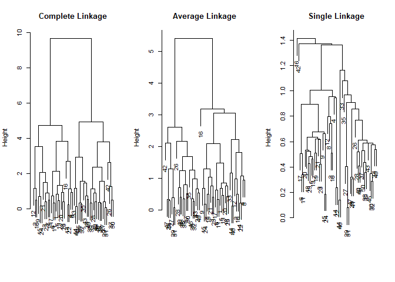
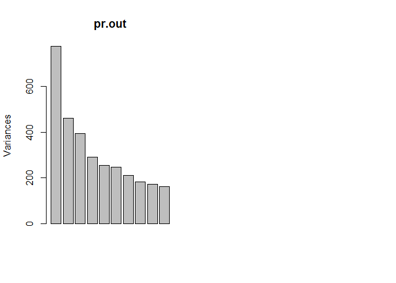
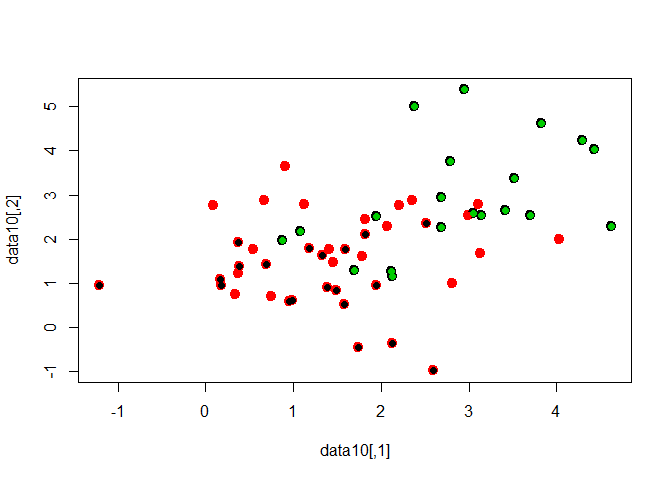
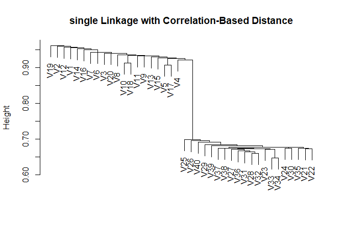

# Chapter 10 Lab 2: Clustering

# video


```r
#K-Means Clustering
set.seed(101)
x=matrix(rnorm(100*2),100,2)
xmean=matrix(rnorm(8,sd=4),4,2)
which=sample(1:4,100,replace = TRUE)
x=x+xmean[which,]
plot(x,col=which,pch=19)
```

<!-- -->

```r
km.out=kmeans(x,4,nstart=15)
km.out
```

```
## K-means clustering with 4 clusters of sizes 21, 30, 32, 17
## 
## Cluster means:
##         [,1]       [,2]
## 1 -3.1068542  1.1213302
## 2  1.7226318 -0.2584919
## 3 -5.5818142  3.3684991
## 4 -0.6148368  4.8861032
## 
## Clustering vector:
##   [1] 2 3 3 4 1 1 4 3 2 3 2 1 1 3 1 1 2 3 3 2 2 3 1 3 1 1 2 2 3 1 1 4 3 1 3
##  [36] 3 1 2 2 3 2 2 3 3 1 3 1 3 4 2 1 2 2 4 3 3 2 2 3 2 1 2 3 4 2 4 3 4 4 2
##  [71] 2 4 3 2 3 4 4 2 2 1 2 4 4 3 3 2 3 3 1 2 3 2 4 4 4 2 3 3 1 1
## 
## Within cluster sum of squares by cluster:
## [1] 30.82790 54.48008 71.98228 21.04952
##  (between_SS / total_SS =  87.6 %)
## 
## Available components:
## 
## [1] "cluster"      "centers"      "totss"        "withinss"    
## [5] "tot.withinss" "betweenss"    "size"         "iter"        
## [9] "ifault"
```

```r
plot(x, col=km.out$cluster, lwd=2, pch=20, cex=2)
points(x,col=which,pch=19)
points(x,col=c(4,3,2,1)[which],pch=19)
```

<!-- -->

```r
#

# Hierarchical Clustering
hc.complete=hclust(dist(x), method="complete")
plot(hc.complete)
```

<!-- -->

```r
hc.average=hclust(dist(x), method="average")
plot(hc.average)
```

<!-- -->

```r
hc.single=hclust(dist(x), method="single")
plot(hc.single)
```

<!-- -->

```r
hc.cut=cutree(hc.complete, 4)
table(hc.cut,which)
```

```
##       which
## hc.cut  1  2  3  4
##      1  0  0 30  0
##      2  1 31  0  2
##      3 17  0  0  0
##      4  0  0  0 19
```

```r
table(hc.cut,km.out$cluster)
```

```
##       
## hc.cut  1  2  3  4
##      1  0 30  0  0
##      2  2  0 32  0
##      3  0  0  0 17
##      4 19  0  0  0
```

```r
plot(hc.complete,labels = which)
```

<!-- -->

```r
#
```


# K-Means Clustering


```r
set.seed(2)
x=matrix(rnorm(50*2), ncol=2)
x[1:25,1]=x[1:25,1]+3
x[1:25,2]=x[1:25,2]-4

km.out=kmeans(x,2,nstart=20)
km.out$cluster
```

```
##  [1] 2 2 2 2 2 2 2 2 2 2 2 2 2 2 2 2 2 2 2 2 2 2 2 2 2 1 1 1 1 1 1 1 1 1 1
## [36] 1 1 1 1 1 1 1 1 1 1 1 1 1 1 1
```

```r
plot(x, col=(km.out$cluster+1), main="K-Means Clustering Results with K=2", xlab="", ylab="", pch=20, cex=2)
```

<!-- -->

```r
set.seed(4)
km.out=kmeans(x,3,nstart=20)
km.out
```

```
## K-means clustering with 3 clusters of sizes 10, 23, 17
## 
## Cluster means:
##         [,1]        [,2]
## 1  2.3001545 -2.69622023
## 2 -0.3820397 -0.08740753
## 3  3.7789567 -4.56200798
## 
## Clustering vector:
##  [1] 3 1 3 1 3 3 3 1 3 1 3 1 3 1 3 1 3 3 3 3 3 1 3 3 3 2 2 2 2 2 2 2 2 2 2
## [36] 2 2 2 2 2 2 2 2 1 2 1 2 2 2 2
## 
## Within cluster sum of squares by cluster:
## [1] 19.56137 52.67700 25.74089
##  (between_SS / total_SS =  79.3 %)
## 
## Available components:
## 
## [1] "cluster"      "centers"      "totss"        "withinss"    
## [5] "tot.withinss" "betweenss"    "size"         "iter"        
## [9] "ifault"
```

```r
plot(x, col=(km.out$cluster+1), main="K-Means Clustering Results with K=3", xlab="", ylab="", pch=20, cex=2)
```

<!-- -->

```r
set.seed(3)
km.out=kmeans(x,3,nstart=1)
km.out$tot.withinss
```

```
## [1] 104.3319
```

```r
km.out=kmeans(x,3,nstart=20)
km.out$tot.withinss
```

```
## [1] 97.97927
```

# Hierarchical Clustering


```r
hc.complete=hclust(dist(x), method="complete")
hc.average=hclust(dist(x), method="average")
hc.single=hclust(dist(x), method="single")

par(mfrow=c(1,3))
plot(hc.complete,main="Complete Linkage", xlab="", sub="", cex=.9)
plot(hc.average, main="Average Linkage", xlab="", sub="", cex=.9)
plot(hc.single, main="Single Linkage", xlab="", sub="", cex=.9)
```

<!-- -->

```r
cutree(hc.complete, 2)
```

```
##  [1] 1 1 1 1 1 1 1 1 1 1 1 1 1 1 1 1 1 1 1 1 1 1 1 1 1 2 2 2 2 2 2 2 2 2 2
## [36] 2 2 2 2 2 2 2 2 2 2 2 2 2 2 2
```

```r
cutree(hc.average, 2)
```

```
##  [1] 1 1 1 1 1 1 1 1 1 1 1 1 1 1 1 1 1 1 1 1 1 1 1 1 1 2 2 2 2 2 2 2 1 2 2
## [36] 2 2 2 2 2 2 2 2 1 2 1 2 2 2 2
```

```r
cutree(hc.single, 2)
```

```
##  [1] 1 1 1 1 1 1 1 1 1 1 1 1 1 1 1 2 1 1 1 1 1 1 1 1 1 1 1 1 1 1 1 1 1 1 1
## [36] 1 1 1 1 1 1 1 1 1 1 1 1 1 1 1
```

```r
cutree(hc.single, 4)
```

```
##  [1] 1 1 1 1 1 1 1 1 1 1 1 1 1 1 1 2 1 1 1 1 1 1 1 1 1 3 3 3 3 3 3 3 3 3 3
## [36] 3 3 3 3 3 3 4 3 3 3 3 3 3 3 3
```

```r
xsc=scale(x)
plot(hclust(dist(xsc), method="complete"), main="Hierarchical Clustering with Scaled Features")

x=matrix(rnorm(30*3), ncol=3)
dd=as.dist(1-cor(t(x)))
plot(hclust(dd, method="complete"), main="Complete Linkage with Correlation-Based Distance", xlab="", sub="")
```

<!-- -->

# Chapter 10 Lab 3: NCI60 Data Example

# The NCI60 data


```r
library(ISLR)
nci.labs=NCI60$labs
nci.data=NCI60$data

dim(nci.data)
```

```
## [1]   64 6830
```

```r
nci.labs[1:4]
```

```
## [1] "CNS"   "CNS"   "CNS"   "RENAL"
```

```r
table(nci.labs)
```

```
## nci.labs
##      BREAST         CNS       COLON K562A-repro K562B-repro    LEUKEMIA 
##           7           5           7           1           1           6 
## MCF7A-repro MCF7D-repro    MELANOMA       NSCLC     OVARIAN    PROSTATE 
##           1           1           8           9           6           2 
##       RENAL     UNKNOWN 
##           9           1
```

# PCA on the NCI60 Data


```r
pr.out=prcomp(nci.data, scale=TRUE)

Cols=function(vec){
    cols=rainbow(length(unique(vec)))
    return(cols[as.numeric(as.factor(vec))])
}

par(mfrow=c(1,2))
plot(pr.out$x[,1:2], col=Cols(nci.labs), pch=19,xlab="Z1",ylab="Z2")
plot(pr.out$x[,c(1,3)], col=Cols(nci.labs), pch=19,xlab="Z1",ylab="Z3")
```

<!-- -->

```r
summary(pr.out)
```

```
## Importance of components:
##                            PC1      PC2      PC3      PC4      PC5
## Standard deviation     27.8535 21.48136 19.82046 17.03256 15.97181
## Proportion of Variance  0.1136  0.06756  0.05752  0.04248  0.03735
## Cumulative Proportion   0.1136  0.18115  0.23867  0.28115  0.31850
##                             PC6      PC7      PC8      PC9     PC10
## Standard deviation     15.72108 14.47145 13.54427 13.14400 12.73860
## Proportion of Variance  0.03619  0.03066  0.02686  0.02529  0.02376
## Cumulative Proportion   0.35468  0.38534  0.41220  0.43750  0.46126
##                            PC11     PC12     PC13     PC14     PC15
## Standard deviation     12.68672 12.15769 11.83019 11.62554 11.43779
## Proportion of Variance  0.02357  0.02164  0.02049  0.01979  0.01915
## Cumulative Proportion   0.48482  0.50646  0.52695  0.54674  0.56590
##                            PC16     PC17     PC18     PC19    PC20
## Standard deviation     11.00051 10.65666 10.48880 10.43518 10.3219
## Proportion of Variance  0.01772  0.01663  0.01611  0.01594  0.0156
## Cumulative Proportion   0.58361  0.60024  0.61635  0.63229  0.6479
##                            PC21    PC22    PC23    PC24    PC25    PC26
## Standard deviation     10.14608 10.0544 9.90265 9.64766 9.50764 9.33253
## Proportion of Variance  0.01507  0.0148 0.01436 0.01363 0.01324 0.01275
## Cumulative Proportion   0.66296  0.6778 0.69212 0.70575 0.71899 0.73174
##                           PC27   PC28    PC29    PC30    PC31    PC32
## Standard deviation     9.27320 9.0900 8.98117 8.75003 8.59962 8.44738
## Proportion of Variance 0.01259 0.0121 0.01181 0.01121 0.01083 0.01045
## Cumulative Proportion  0.74433 0.7564 0.76824 0.77945 0.79027 0.80072
##                           PC33    PC34    PC35    PC36    PC37    PC38
## Standard deviation     8.37305 8.21579 8.15731 7.97465 7.90446 7.82127
## Proportion of Variance 0.01026 0.00988 0.00974 0.00931 0.00915 0.00896
## Cumulative Proportion  0.81099 0.82087 0.83061 0.83992 0.84907 0.85803
##                           PC39    PC40    PC41   PC42    PC43   PC44
## Standard deviation     7.72156 7.58603 7.45619 7.3444 7.10449 7.0131
## Proportion of Variance 0.00873 0.00843 0.00814 0.0079 0.00739 0.0072
## Cumulative Proportion  0.86676 0.87518 0.88332 0.8912 0.89861 0.9058
##                           PC45   PC46    PC47    PC48    PC49    PC50
## Standard deviation     6.95839 6.8663 6.80744 6.64763 6.61607 6.40793
## Proportion of Variance 0.00709 0.0069 0.00678 0.00647 0.00641 0.00601
## Cumulative Proportion  0.91290 0.9198 0.92659 0.93306 0.93947 0.94548
##                           PC51    PC52    PC53    PC54    PC55    PC56
## Standard deviation     6.21984 6.20326 6.06706 5.91805 5.91233 5.73539
## Proportion of Variance 0.00566 0.00563 0.00539 0.00513 0.00512 0.00482
## Cumulative Proportion  0.95114 0.95678 0.96216 0.96729 0.97241 0.97723
##                           PC57   PC58    PC59    PC60    PC61    PC62
## Standard deviation     5.47261 5.2921 5.02117 4.68398 4.17567 4.08212
## Proportion of Variance 0.00438 0.0041 0.00369 0.00321 0.00255 0.00244
## Cumulative Proportion  0.98161 0.9857 0.98940 0.99262 0.99517 0.99761
##                           PC63      PC64
## Standard deviation     4.04124 2.148e-14
## Proportion of Variance 0.00239 0.000e+00
## Cumulative Proportion  1.00000 1.000e+00
```

```r
plot(pr.out)

pve=100*pr.out$sdev^2/sum(pr.out$sdev^2)
par(mfrow=c(1,2))
```

<!-- -->

```r
plot(pve,  type="o", ylab="PVE", xlab="Principal Component", col="blue")
plot(cumsum(pve), type="o", ylab="Cumulative PVE", xlab="Principal Component", col="brown3")
```

<!-- -->

# Clustering the Observations of the NCI60 Data


```r
sd.data=scale(nci.data)

par(mfrow=c(1,3))
data.dist=dist(sd.data)
plot(hclust(data.dist), labels=nci.labs, main="Complete Linkage", xlab="", sub="",ylab="")
plot(hclust(data.dist, method="average"), labels=nci.labs, main="Average Linkage", xlab="", sub="",ylab="")
plot(hclust(data.dist, method="single"), labels=nci.labs,  main="Single Linkage", xlab="", sub="",ylab="")
```

<!-- -->

```r
hc.out=hclust(dist(sd.data))
hc.clusters=cutree(hc.out,4)
table(hc.clusters,nci.labs)
```

```
##            nci.labs
## hc.clusters BREAST CNS COLON K562A-repro K562B-repro LEUKEMIA MCF7A-repro
##           1      2   3     2           0           0        0           0
##           2      3   2     0           0           0        0           0
##           3      0   0     0           1           1        6           0
##           4      2   0     5           0           0        0           1
##            nci.labs
## hc.clusters MCF7D-repro MELANOMA NSCLC OVARIAN PROSTATE RENAL UNKNOWN
##           1           0        8     8       6        2     8       1
##           2           0        0     1       0        0     1       0
##           3           0        0     0       0        0     0       0
##           4           1        0     0       0        0     0       0
```

```r
par(mfrow=c(1,1))
plot(hc.out, labels=nci.labs)
abline(h=139, col="red")
```

<!-- -->

```r
hc.out
```

```
## 
## Call:
## hclust(d = dist(sd.data))
## 
## Cluster method   : complete 
## Distance         : euclidean 
## Number of objects: 64
```

```r
set.seed(2)
km.out=kmeans(sd.data, 4, nstart=20)
km.clusters=km.out$cluster
table(km.clusters,hc.clusters)
```

```
##            hc.clusters
## km.clusters  1  2  3  4
##           1 11  0  0  9
##           2  0  0  8  0
##           3  9  0  0  0
##           4 20  7  0  0
```

```r
hc.out=hclust(dist(pr.out$x[,1:5]))
plot(hc.out, labels=nci.labs, main="Hier. Clust. on First Five Score Vectors")
```

<!-- -->

```r
table(cutree(hc.out,4), nci.labs)
```

```
##    nci.labs
##     BREAST CNS COLON K562A-repro K562B-repro LEUKEMIA MCF7A-repro
##   1      0   2     7           0           0        2           0
##   2      5   3     0           0           0        0           0
##   3      0   0     0           1           1        4           0
##   4      2   0     0           0           0        0           1
##    nci.labs
##     MCF7D-repro MELANOMA NSCLC OVARIAN PROSTATE RENAL UNKNOWN
##   1           0        1     8       5        2     7       0
##   2           0        7     1       1        0     2       1
##   3           0        0     0       0        0     0       0
##   4           1        0     0       0        0     0       0
```

# 9. Consider the USArrests data. We will now perform hierarchical clustering on the states.
## (a) Using hierarchical clustering with complete linkage and Euclidean distance, cluster the states.


```r
library(ISLR)
summary(USArrests)
```

```
##      Murder          Assault         UrbanPop          Rape      
##  Min.   : 0.800   Min.   : 45.0   Min.   :32.00   Min.   : 7.30  
##  1st Qu.: 4.075   1st Qu.:109.0   1st Qu.:54.50   1st Qu.:15.07  
##  Median : 7.250   Median :159.0   Median :66.00   Median :20.10  
##  Mean   : 7.788   Mean   :170.8   Mean   :65.54   Mean   :21.23  
##  3rd Qu.:11.250   3rd Qu.:249.0   3rd Qu.:77.75   3rd Qu.:26.18  
##  Max.   :17.400   Max.   :337.0   Max.   :91.00   Max.   :46.00
```

```r
head(USArrests)
```

```
##            Murder Assault UrbanPop Rape
## Alabama      13.2     236       58 21.2
## Alaska       10.0     263       48 44.5
## Arizona       8.1     294       80 31.0
## Arkansas      8.8     190       50 19.5
## California    9.0     276       91 40.6
## Colorado      7.9     204       78 38.7
```

```r
hc.complete=hclust(dist(USArrests), method="complete")
plot(hc.complete)
```

<!-- -->


## (b) Cut the dendrogram at a height that results in three distinct clusters. Which states belong to which clusters?


```r
cut.hc=cutree(hc.complete, 3)
cut.hc
```

```
##        Alabama         Alaska        Arizona       Arkansas     California 
##              1              1              1              2              1 
##       Colorado    Connecticut       Delaware        Florida        Georgia 
##              2              3              1              1              2 
##         Hawaii          Idaho       Illinois        Indiana           Iowa 
##              3              3              1              3              3 
##         Kansas       Kentucky      Louisiana          Maine       Maryland 
##              3              3              1              3              1 
##  Massachusetts       Michigan      Minnesota    Mississippi       Missouri 
##              2              1              3              1              2 
##        Montana       Nebraska         Nevada  New Hampshire     New Jersey 
##              3              3              1              3              2 
##     New Mexico       New York North Carolina   North Dakota           Ohio 
##              1              1              1              3              3 
##       Oklahoma         Oregon   Pennsylvania   Rhode Island South Carolina 
##              2              2              3              2              1 
##   South Dakota      Tennessee          Texas           Utah        Vermont 
##              3              2              2              3              3 
##       Virginia     Washington  West Virginia      Wisconsin        Wyoming 
##              2              2              3              3              2
```

```r
table(cut.hc)
```

```
## cut.hc
##  1  2  3 
## 16 14 20
```


## (c) Hierarchically cluster the states using complete linkage and Euclidean distance, after scaling the variables to have standard deviation one.


```r
sd.USArrests=scale(USArrests)

sd.hc.complete=hclust(dist(sd.USArrests), method="complete")
plot(sd.hc.complete)
```

<!-- -->

```r
cut.sd.hc=cutree(sd.hc.complete, 3)
cut.sd.hc
```

```
##        Alabama         Alaska        Arizona       Arkansas     California 
##              1              1              2              3              2 
##       Colorado    Connecticut       Delaware        Florida        Georgia 
##              2              3              3              2              1 
##         Hawaii          Idaho       Illinois        Indiana           Iowa 
##              3              3              2              3              3 
##         Kansas       Kentucky      Louisiana          Maine       Maryland 
##              3              3              1              3              2 
##  Massachusetts       Michigan      Minnesota    Mississippi       Missouri 
##              3              2              3              1              3 
##        Montana       Nebraska         Nevada  New Hampshire     New Jersey 
##              3              3              2              3              3 
##     New Mexico       New York North Carolina   North Dakota           Ohio 
##              2              2              1              3              3 
##       Oklahoma         Oregon   Pennsylvania   Rhode Island South Carolina 
##              3              3              3              3              1 
##   South Dakota      Tennessee          Texas           Utah        Vermont 
##              3              1              2              3              3 
##       Virginia     Washington  West Virginia      Wisconsin        Wyoming 
##              3              3              3              3              3
```

```r
table(cut.sd.hc)
```

```
## cut.sd.hc
##  1  2  3 
##  8 11 31
```


## (d) What effect does scaling the variables have on the hierarchical clustering obtained? In your opinion, should the variables be scaled before the inter-observation dissimilarities are computed? Provide a justification for your answer.


```r
table(cut.hc,cut.sd.hc)
```

```
##       cut.sd.hc
## cut.hc  1  2  3
##      1  6  9  1
##      2  2  2 10
##      3  0  0 20
```

```r
summary(USArrests)
```

```
##      Murder          Assault         UrbanPop          Rape      
##  Min.   : 0.800   Min.   : 45.0   Min.   :32.00   Min.   : 7.30  
##  1st Qu.: 4.075   1st Qu.:109.0   1st Qu.:54.50   1st Qu.:15.07  
##  Median : 7.250   Median :159.0   Median :66.00   Median :20.10  
##  Mean   : 7.788   Mean   :170.8   Mean   :65.54   Mean   :21.23  
##  3rd Qu.:11.250   3rd Qu.:249.0   3rd Qu.:77.75   3rd Qu.:26.18  
##  Max.   :17.400   Max.   :337.0   Max.   :91.00   Max.   :46.00
```

>  it is a good decision to scale the variables before computing the dissimilarity measure.

# 10. In this problem, you will generate simulated data, and then perform PCA and K-means clustering on the data.

## (a) Generate a simulated data set with 20 observations in each of three classes (i.e. 60 observations total), and 50 variables.
Hint: There are a number of functions in R that you can use to generate data. One example is the rnorm() function; runif() is another option. Be sure to add a mean shift to the observations in each class so that there are three distinct classes.


```r
set.seed(1)
A = matrix(rnorm(1000,mean = 1),ncol = 50)
B = matrix(rnorm(1000,mean = 2),ncol = 50)
C = matrix(rnorm(1000,mean = 3),ncol = 50)
dim(C)
```

```
## [1] 20 50
```

```r
data10=rbind(A,B,C)
dim(data10)
```

```
## [1] 60 50
```

## (b) Perform PCA on the 60 observations and plot the first two principal component score vectors. Use a different color to indicate the observations in each of the three classes. If the three classes appear separated in this plot, then continue on to part (c). If not, then return to part (a) and modify the simulation so that there is greater separation between the three classes. Do not continue to part (c) until the three classes show at least some separation in the first two principal component score vectors.


```r
groupindex=c(rep(1, 20), rep(2, 20), rep(3, 20))
pca.out <- prcomp(data10)
biplot(pca.out,scale = 0,cex=0.5)
names(pca.out)
```

```
## [1] "sdev"     "rotation" "center"   "scale"    "x"
```

```r
scorematrix=as.data.frame(pca.out$x)
colnames(scorematrix)
```

```
##  [1] "PC1"  "PC2"  "PC3"  "PC4"  "PC5"  "PC6"  "PC7"  "PC8"  "PC9"  "PC10"
## [11] "PC11" "PC12" "PC13" "PC14" "PC15" "PC16" "PC17" "PC18" "PC19" "PC20"
## [21] "PC21" "PC22" "PC23" "PC24" "PC25" "PC26" "PC27" "PC28" "PC29" "PC30"
## [31] "PC31" "PC32" "PC33" "PC34" "PC35" "PC36" "PC37" "PC38" "PC39" "PC40"
## [41] "PC41" "PC42" "PC43" "PC44" "PC45" "PC46" "PC47" "PC48" "PC49" "PC50"
```

```r
library(ggplot2)
```

<!-- -->

```r
ggplot(scorematrix, aes(x=PC1, y=PC2, color=groupindex)) + geom_point()
```

<!-- -->

## (c) Perform K-means clustering of the observations with K = 3. How well do the clusters that you obtained in K-means clustering compare to the true class labels?
Hint: You can use the table() function in R to compare the true class labels to the class labels obtained by clustering. Be careful how you interpret the results: K-means clustering will arbitrarily number the clusters, so you cannot simply check whether the true class labels and clustering labels are the same.


```r
km.out=kmeans(data10,3,nstart=20)
km.out
```

```
## K-means clustering with 3 clusters of sizes 20, 20, 20
## 
## Cluster means:
##       [,1]      [,2]     [,3]     [,4]     [,5]     [,6]     [,7]
## 1 1.700153 2.0832881 2.364076 1.568739 2.232159 1.865665 1.650670
## 2 2.864954 2.9278613 2.828346 3.163347 2.506528 3.113994 2.825189
## 3 1.190524 0.9935285 1.138797 1.101737 1.119851 1.113828 0.782726
##        [,8]     [,9]     [,10]    [,11]     [,12]    [,13]    [,14]
## 1 1.7856372 1.853440 2.0849457 2.178172 2.1382329 2.042932 2.201633
## 2 3.0057910 3.228832 3.1011993 2.663972 3.0743600 3.101405 2.864683
## 3 0.5964904 1.481246 0.8366687 1.265022 0.6415555 1.024491 1.075839
##      [,15]    [,16]    [,17]    [,18]     [,19]    [,20]    [,21]
## 1 2.651839 2.050242 1.679266 1.662865 1.9028802 1.839017 2.016351
## 2 3.104699 3.308155 2.866055 3.364660 3.0205587 3.035001 3.305565
## 3 1.141460 1.210514 1.094427 1.022183 0.8406715 1.090214 1.147230
##       [,22]     [,23]    [,24]    [,25]    [,26]    [,27]     [,28]
## 1 2.7284429 1.7809730 1.751963 2.111706 2.105636 2.113976 2.0206446
## 2 2.7874816 2.9445954 3.122168 3.097995 2.581424 2.657278 3.0560047
## 3 0.7756869 0.5034215 1.300950 1.077040 0.791819 1.068098 0.8391622
##      [,29]    [,30]     [,31]     [,32]     [,33]     [,34]     [,35]
## 1 2.011031 1.653747 2.0931026 1.7143169 2.0487026 1.8469707 1.8197555
## 2 2.747571 3.065388 2.9909762 3.0777568 3.4456420 2.8759592 2.9812834
## 3 1.036726 1.041598 0.9920347 0.9322639 0.5576745 0.6806517 0.8394766
##      [,36]    [,37]     [,38]    [,39]     [,40]     [,41]    [,42]
## 1 1.851299 2.249647 1.9978412 1.850037 1.6094930 2.3087790 2.323720
## 2 3.232052 3.005432 3.0849615 2.719066 3.3332311 2.9429261 3.204473
## 3 1.054902 1.037705 0.8423246 1.164261 0.9020819 0.7923975 1.237492
##       [,43]    [,44]    [,45]    [,46]    [,47]    [,48]     [,49]
## 1 2.2813863 1.772476 1.983839 1.514733 2.153262 1.898396 1.9794858
## 2 2.9026140 3.332208 2.938843 3.212593 3.184409 3.125234 2.9860798
## 3 0.8038038 1.128853 1.087840 1.000081 1.068666 1.285697 0.7291763
##       [,50]
## 1 2.0593387
## 2 2.8546512
## 3 0.9367054
## 
## Clustering vector:
##  [1] 3 3 3 3 3 3 3 3 3 3 3 3 3 3 3 3 3 3 3 3 1 1 1 1 1 1 1 1 1 1 1 1 1 1 1
## [36] 1 1 1 1 1 2 2 2 2 2 2 2 2 2 2 2 2 2 2 2 2 2 2 2 2
## 
## Within cluster sum of squares by cluster:
## [1] 1015.411 1019.930 1028.398
##  (between_SS / total_SS =  41.4 %)
## 
## Available components:
## 
## [1] "cluster"      "centers"      "totss"        "withinss"    
## [5] "tot.withinss" "betweenss"    "size"         "iter"        
## [9] "ifault"
```

```r
plot(data10, col=km.out$cluster, lwd=2, pch=20, cex=2)
points(data10,col=groupindex,pch=19)
```

<!-- -->

```r
table(groupindex,km.out$cluster)
```

```
##           
## groupindex  1  2  3
##          1  0  0 20
##          2 20  0  0
##          3  0 20  0
```

> all correct!

## (d) Perform K-means clustering with K = 2. Describe your results.


```r
km.out=kmeans(data10,2,nstart=20)
km.out
```

```
## K-means clustering with 2 clusters of sizes 20, 40
## 
## Cluster means:
##       [,1]     [,2]     [,3]     [,4]     [,5]     [,6]     [,7]     [,8]
## 1 2.864954 2.927861 2.828346 3.163347 2.506528 3.113994 2.825189 3.005791
## 2 1.445338 1.538408 1.751436 1.335238 1.676005 1.489747 1.216698 1.191064
##       [,9]    [,10]    [,11]    [,12]    [,13]    [,14]    [,15]    [,16]
## 1 3.228832 3.101199 2.663972 3.074360 3.101405 2.864683 3.104699 3.308155
## 2 1.667343 1.460807 1.721597 1.389894 1.533712 1.638736 1.896650 1.630378
##      [,17]    [,18]    [,19]    [,20]    [,21]    [,22]    [,23]    [,24]
## 1 2.866055 3.364660 3.020559 3.035001 3.305565 2.787482 2.944595 3.122168
## 2 1.386846 1.342524 1.371776 1.464615 1.581790 1.752065 1.142197 1.526457
##      [,25]    [,26]    [,27]    [,28]    [,29]    [,30]    [,31]    [,32]
## 1 3.097995 2.581424 2.657278 3.056005 2.747571 3.065388 2.990976 3.077757
## 2 1.594373 1.448727 1.591037 1.429903 1.523879 1.347672 1.542569 1.323290
##      [,33]    [,34]    [,35]    [,36]    [,37]    [,38]    [,39]    [,40]
## 1 3.445642 2.875959 2.981283 3.232052 3.005432 3.084961 2.719066 3.333231
## 2 1.303189 1.263811 1.329616 1.453100 1.643676 1.420083 1.507149 1.255787
##      [,41]    [,42]    [,43]    [,44]    [,45]    [,46]    [,47]    [,48]
## 1 2.942926 3.204473 2.902614 3.332208 2.938843 3.212593 3.184409 3.125234
## 2 1.550588 1.780606 1.542595 1.450665 1.535839 1.257407 1.610964 1.592047
##      [,49]    [,50]
## 1 2.986080 2.854651
## 2 1.354331 1.498022
## 
## Clustering vector:
##  [1] 2 2 2 2 2 2 2 2 2 2 2 2 2 2 2 2 2 2 2 2 2 2 2 2 2 2 2 2 2 2 2 2 2 2 2
## [36] 2 2 2 2 2 1 1 1 1 1 1 1 1 1 1 1 1 1 1 1 1 1 1 1 1
## 
## Within cluster sum of squares by cluster:
## [1] 1019.930 2593.324
##  (between_SS / total_SS =  30.9 %)
## 
## Available components:
## 
## [1] "cluster"      "centers"      "totss"        "withinss"    
## [5] "tot.withinss" "betweenss"    "size"         "iter"        
## [9] "ifault"
```

```r
plot(data10, col=km.out$cluster, lwd=2, pch=20, cex=2)
points(data10,col=groupindex,pch=19)
```

<!-- -->

```r
table(groupindex,km.out$cluster)
```

```
##           
## groupindex  1  2
##          1  0 20
##          2  0 20
##          3 20  0
```


## (e) Now perform K-means clustering with K = 4, and describe your results.


```r
km.out=kmeans(data10,4,nstart=20)
km.out
```

```
## K-means clustering with 4 clusters of sizes 9, 20, 20, 11
## 
## Cluster means:
##        [,1]      [,2]      [,3]      [,4]      [,5]     [,6]      [,7]
## 1 0.9944149 0.8455096 1.3985808 1.5003232 1.5391575 1.123548 0.7456942
## 2 1.7001528 2.0832881 2.3640758 1.5687392 2.2321593 1.865665 1.6506700
## 3 2.8649544 2.9278613 2.8283456 3.1633465 2.5065279 3.113994 2.8251894
## 4 1.3509767 1.1146348 0.9262462 0.7756208 0.7767817 1.105876 0.8130248
##          [,8]     [,9]    [,10]     [,11]     [,12]     [,13]     [,14]
## 1 -0.07227704 1.176729 0.533847 1.6875700 0.3215434 1.3452590 1.2453355
## 2  1.78563721 1.853440 2.084946 2.1781722 2.1382329 2.0429322 2.2016328
## 3  3.00579102 3.228832 3.101199 2.6639715 3.0743600 3.1014054 2.8646832
## 4  1.14366376 1.730396 1.084432 0.9193003 0.9033835 0.7620446 0.9371608
##       [,15]    [,16]    [,17]    [,18]     [,19]    [,20]     [,21]
## 1 1.4866993 1.894879 1.304431 1.206628 0.5024036 1.005836 0.9282688
## 2 2.6518395 2.050242 1.679266 1.662865 1.9028802 1.839017 2.0163506
## 3 3.1046994 3.308155 2.866055 3.364660 3.0205587 3.035001 3.3055655
## 4 0.8589915 0.650579 0.922606 0.871273 1.1174361 1.159250 1.3263807
##       [,22]     [,23]    [,24]     [,25]     [,26]    [,27]     [,28]
## 1 1.3319027 0.1084676 1.133546 1.9310441 0.8897392 1.001189 1.3176023
## 2 2.7284429 1.7809730 1.751963 2.1117063 2.1056355 2.113976 2.0206446
## 3 2.7874816 2.9445954 3.122168 3.0979947 2.5814244 2.657278 3.0560047
## 4 0.3206012 0.8265656 1.437918 0.3783091 0.7117025 1.122842 0.4477113
##       [,29]     [,30]     [,31]     [,32]       [,33]     [,34]     [,35]
## 1 1.3778623 0.9780126 1.1663144 0.9385300 0.003993265 1.0658690 1.0277246
## 2 2.0110311 1.6537469 2.0931026 1.7143169 2.048702611 1.8469707 1.8197555
## 3 2.7475708 3.0653875 2.9909762 3.0777568 3.445642035 2.8759592 2.9812834
## 4 0.7576152 1.0936221 0.8494421 0.9271371 1.010686337 0.3654739 0.6854554
##       [,36]     [,37]     [,38]     [,39]    [,40]    [,41]     [,42]
## 1 0.6247961 1.3051369 0.2792338 0.7819265 0.687290 1.096879 1.6636906
## 2 1.8512986 2.2496471 1.9978412 1.8500367 1.609493 2.308779 2.3237199
## 3 3.2320517 3.0054320 3.0849615 2.7190660 3.333231 2.942926 3.2044728
## 4 1.4068063 0.8188975 1.3030353 1.4770807 1.077821 0.543276 0.8887844
##       [,43]     [,44]     [,45]     [,46]     [,47]    [,48]      [,49]
## 1 1.5346299 0.9964437 1.4592641 0.8114768 1.5130779 1.371969 -0.2858643
## 2 2.2813863 1.7724764 1.9838385 1.5147334 2.1532616 1.898396  1.9794858
## 3 2.9026140 3.3322082 2.9388430 3.2125932 3.1844090 3.125234  2.9860798
## 4 0.2058551 1.2371881 0.7839471 1.1543936 0.7050554 1.215110  1.5596641
##       [,50]
## 1 1.0383813
## 2 2.0593387
## 3 2.8546512
## 4 0.8535161
## 
## Clustering vector:
##  [1] 1 4 1 4 1 1 4 1 4 1 4 1 4 4 1 1 4 4 4 4 2 2 2 2 2 2 2 2 2 2 2 2 2 2 2
## [36] 2 2 2 2 2 3 3 3 3 3 3 3 3 3 3 3 3 3 3 3 3 3 3 3 3
## 
## Within cluster sum of squares by cluster:
## [1]  422.5667 1015.4107 1019.9301  483.7372
##  (between_SS / total_SS =  43.7 %)
## 
## Available components:
## 
## [1] "cluster"      "centers"      "totss"        "withinss"    
## [5] "tot.withinss" "betweenss"    "size"         "iter"        
## [9] "ifault"
```

```r
plot(data10, col=km.out$cluster, lwd=2, pch=20, cex=2)
points(data10,col=groupindex,pch=19)
```

<!-- -->

```r
table(groupindex,km.out$cluster)
```

```
##           
## groupindex  1  2  3  4
##          1  9  0  0 11
##          2  0 20  0  0
##          3  0  0 20  0
```


## (f) Now perform K-means clustering with K = 3 on the first two principal component score vectors, rather than on the raw data. That is, perform K-means clustering on the 60 × 2 matrix of which the first column is the first principal component score vector, and the second column is the second principal component score vector. Comment on the results.


```r
summary(pca.out)
```

```
## Importance of components:
##                           PC1     PC2     PC3     PC4     PC5     PC6
## Standard deviation     6.0532 1.91946 1.81567 1.80461 1.71604 1.67667
## Proportion of Variance 0.4137 0.04159 0.03722 0.03677 0.03325 0.03174
## Cumulative Proportion  0.4137 0.45526 0.49248 0.52924 0.56249 0.59422
##                            PC7     PC8     PC9    PC10    PC11    PC12
## Standard deviation     1.59473 1.53063 1.45426 1.43951 1.42167 1.37589
## Proportion of Variance 0.02871 0.02645 0.02388 0.02339 0.02282 0.02137
## Cumulative Proportion  0.62294 0.64939 0.67326 0.69665 0.71947 0.74084
##                           PC13    PC14    PC15    PC16    PC17    PC18
## Standard deviation     1.31191 1.27879 1.20828 1.17096 1.13676 1.12099
## Proportion of Variance 0.01943 0.01846 0.01648 0.01548 0.01459 0.01419
## Cumulative Proportion  0.76028 0.77874 0.79522 0.81070 0.82529 0.83947
##                           PC19    PC20    PC21    PC22    PC23    PC24
## Standard deviation     1.07004 1.04141 1.00582 0.99532 0.94378 0.92466
## Proportion of Variance 0.01293 0.01224 0.01142 0.01118 0.01006 0.00965
## Cumulative Proportion  0.85240 0.86464 0.87606 0.88725 0.89730 0.90696
##                           PC25    PC26    PC27    PC28    PC29    PC30
## Standard deviation     0.89421 0.84490 0.84116 0.83744 0.80484 0.74449
## Proportion of Variance 0.00903 0.00806 0.00799 0.00792 0.00731 0.00626
## Cumulative Proportion  0.91598 0.92404 0.93203 0.93995 0.94726 0.95352
##                          PC31    PC32   PC33    PC34    PC35    PC36
## Standard deviation     0.7287 0.68003 0.6455 0.62745 0.62031 0.54767
## Proportion of Variance 0.0060 0.00522 0.0047 0.00444 0.00434 0.00339
## Cumulative Proportion  0.9595 0.96473 0.9694 0.97388 0.97823 0.98161
##                           PC37    PC38    PC39    PC40    PC41    PC42
## Standard deviation     0.51874 0.50548 0.46882 0.43549 0.42515 0.36886
## Proportion of Variance 0.00304 0.00288 0.00248 0.00214 0.00204 0.00154
## Cumulative Proportion  0.98465 0.98754 0.99002 0.99216 0.99420 0.99574
##                           PC43    PC44   PC45    PC46    PC47    PC48
## Standard deviation     0.31955 0.29073 0.2668 0.19755 0.17910 0.15881
## Proportion of Variance 0.00115 0.00095 0.0008 0.00044 0.00036 0.00028
## Cumulative Proportion  0.99689 0.99784 0.9987 0.99909 0.99945 0.99973
##                           PC49    PC50
## Standard deviation     0.11302 0.10384
## Proportion of Variance 0.00014 0.00012
## Cumulative Proportion  0.99988 1.00000
```

```r
names(pca.out)
```

```
## [1] "sdev"     "rotation" "center"   "scale"    "x"
```

```r
km.out=kmeans(pca.out$x[,1:2],3,nstart=20)
km.out
```

```
## K-means clustering with 3 clusters of sizes 20, 20, 20
## 
## Cluster means:
##         PC1        PC2
## 1 -7.167374  0.2593049
## 2  7.292888  0.1658575
## 3 -0.125514 -0.4251624
## 
## Clustering vector:
##  [1] 1 1 1 1 1 1 1 1 1 1 1 1 1 1 1 1 1 1 1 1 3 3 3 3 3 3 3 3 3 3 3 3 3 3 3
## [36] 3 3 3 3 3 2 2 2 2 2 2 2 2 2 2 2 2 2 2 2 2 2 2 2 2
## 
## Within cluster sum of squares by cluster:
## [1] 104.00041 106.33676  71.92164
##  (between_SS / total_SS =  88.1 %)
## 
## Available components:
## 
## [1] "cluster"      "centers"      "totss"        "withinss"    
## [5] "tot.withinss" "betweenss"    "size"         "iter"        
## [9] "ifault"
```

```r
plot(data10, col=km.out$cluster, lwd=2, pch=20, cex=2)
points(data10,col=groupindex,pch=19)
```

<!-- -->

```r
table(groupindex,km.out$cluster)
```

```
##           
## groupindex  1  2  3
##          1 20  0  0
##          2  0  0 20
##          3  0 20  0
```

> all correct!

## (g) Using the scale() function, perform K-means clustering with K = 3 on the data after scaling each variable to have standard deviation one. How do these results compare to those obtained in (b)? Explain.


```r
km.out=kmeans(scale(data10),3,nstart=20)
km.out
```

```
## K-means clustering with 3 clusters of sizes 20, 20, 20
## 
## Cluster means:
##         [,1]        [,2]       [,3]       [,4]       [,5]       [,6]
## 1 -0.1768213  0.06493243  0.2093842 -0.2792122  0.2574171 -0.1331904
## 2  0.7662661  0.73593403  0.5926022  0.9053351  0.5102772  0.8714497
## 3 -0.5894448 -0.80086645 -0.8019864 -0.6261229 -0.7676944 -0.7382593
##          [,7]         [,8]       [,9]       [,10]      [,11]      [,12]
## 1 -0.07745553 -0.007242914 -0.2611581  0.05684442  0.1103989  0.1353288
## 2  0.81276294  0.847802836  0.8129907  0.80377359  0.4868927  0.8133322
## 3 -0.73530741 -0.840559922 -0.5518325 -0.86061801 -0.5972916 -0.9486611
##         [,13]     [,14]      [,15]      [,16]      [,17]      [,18]
## 1 -0.01030614  0.119561  0.2754863 -0.1106005 -0.1721480 -0.2581570
## 2  0.80719451  0.633507  0.6293994  0.8874697  0.8460584  0.9839274
## 3 -0.79688836 -0.753068 -0.9048857 -0.7768693 -0.6739104 -0.7257704
##         [,19]      [,20]      [,21]      [,22]      [,23]      [,24]
## 1 -0.01361361 -0.1219440 -0.1099184  0.4609235  0.0242978 -0.2418839
## 2  0.80930216  0.8564724  0.9020567  0.5040329  0.7688001  0.8398179
## 3 -0.79568855 -0.7345284 -0.7921382 -0.9649563 -0.7930979 -0.5979340
##         [,25]      [,26]      [,27]       [,28]       [,29]      [,30]
## 1  0.01131188  0.2325363  0.1377318  0.03869416  0.06946986 -0.1939754
## 2  0.70316052  0.6286026  0.5844083  0.86120519  0.71507330  0.8335161
## 3 -0.71447240 -0.8611390 -0.7221402 -0.89989935 -0.78454316 -0.6395407
##         [,31]      [,32]       [,33]      [,34]       [,35]      [,36]
## 1  0.05181066 -0.1493332  0.02037365  0.0342505 -0.04340283 -0.1277534
## 2  0.73863233  0.9012933  0.92783896  0.8041455  0.79103425  0.7778372
## 3 -0.79044298 -0.7519601 -0.94821261 -0.8383960 -0.74763141 -0.6500838
##        [,37]       [,38]       [,39]      [,40]      [,41]       [,42]
## 1  0.1115470  0.01589362 -0.05326244 -0.2213183  0.2062765  0.05246061
## 2  0.6659974  0.77375462  0.70448330  0.9047803  0.6510889  0.72706616
## 3 -0.7775444 -0.78964825 -0.65122086 -0.6834620 -0.8573654 -0.77952677
##        [,43]      [,44]       [,45]      [,46]       [,47]      [,48]
## 1  0.1883493 -0.2366678 -0.01494773 -0.2835570  0.01302056 -0.1615786
## 2  0.5982536  0.9721571  0.71083675  0.9371249  0.76661066  0.8067585
## 3 -0.7866029 -0.7354893 -0.69588902 -0.6535679 -0.77963122 -0.6451799
##        [,49]       [,50]
## 1  0.0541011  0.08295924
## 2  0.7244464  0.68767350
## 3 -0.7785475 -0.77063274
## 
## Clustering vector:
##  [1] 3 3 3 3 3 3 3 3 3 3 3 3 3 3 3 3 3 3 3 3 1 1 1 1 1 1 1 1 1 1 1 1 1 1 1
## [36] 1 1 1 1 1 2 2 2 2 2 2 2 2 2 2 2 2 2 2 2 2 2 2 2 2
## 
## Within cluster sum of squares by cluster:
## [1] 577.2605 584.1888 576.9228
##  (between_SS / total_SS =  41.1 %)
## 
## Available components:
## 
## [1] "cluster"      "centers"      "totss"        "withinss"    
## [5] "tot.withinss" "betweenss"    "size"         "iter"        
## [9] "ifault"
```

```r
plot(data10, col=km.out$cluster, lwd=2, pch=20, cex=2)
points(data10,col=groupindex,pch=19)
```

<!-- -->

```r
table(groupindex,km.out$cluster)
```

```
##           
## groupindex  1  2  3
##          1  0  0 20
##          2 20  0  0
##          3  0 20  0
```

> all correct!

# 11. On the book website, www.StatLearning.com, there is a gene expression data set (Ch10Ex11.csv) that consists of 40 tissue samples with measurements on 1,000 genes. The first 20 samples are from healthy patients, while the second 20 are from a diseased group.

## (a) Load in the data using read.csv(). You will need to select header=F.


```r
data11 <- read.csv(url("http://www-bcf.usc.edu/~gareth/ISL/Ch10Ex11.csv"), header = F)
head(data11)
```

```
##            V1         V2         V3         V4         V5         V6
## 1 -0.96193340  0.4418028 -0.9750051  1.4175040  0.8188148  0.3162937
## 2 -0.29252570 -1.1392670  0.1958370 -1.2811210 -0.2514393  2.5119970
## 3  0.25878820 -0.9728448  0.5884858 -0.8002581 -1.8203980 -2.0589240
## 4 -1.15213200 -2.2131680 -0.8615249  0.6309253  0.9517719 -1.1657240
## 5  0.19578280  0.5933059  0.2829921  0.2471472  1.9786680 -0.8710180
## 6  0.03012394 -0.6910143 -0.4034258 -0.7298590 -0.3640986  1.1253490
##            V7          V8          V9        V10        V11        V12
## 1 -0.02496682 -0.06396600  0.03149702 -0.3503106 -0.7227299 -0.2819547
## 2 -0.92220620  0.05954277 -1.40964500 -0.6567122 -0.1157652  0.8259783
## 3 -0.06476437  1.59212400 -0.17311700 -0.1210874 -0.1875790 -1.5001630
## 4 -0.39155860  1.06361900 -0.35000900 -1.4890580 -0.2432189 -0.4330340
## 5 -0.98971500 -1.03225300 -1.10965400 -0.3851423  1.6509570 -1.7449090
## 6 -1.40404100 -0.80613040 -1.23792400  0.5776018 -0.2720642  2.1765620
##           V13         V14        V15        V16        V17        V18
## 1  1.33751500  0.70197980  1.0076160 -0.4653828  0.6385951  0.2867807
## 2  0.34644960 -0.56954860 -0.1315365  0.6902290 -0.9090382  1.3026420
## 3 -1.22873700  0.85598900  1.2498550 -0.8980815  0.8702058 -0.2252529
## 4 -0.03879128 -0.05789677 -1.3977620 -0.1561871 -2.7359820  0.7756169
## 5 -0.37888530 -0.67982610 -2.1315840 -0.2301718  0.4661243 -1.8004490
## 6  1.43640700 -1.02578100  0.2981582 -0.5559659  0.2046529 -1.1916480
##          V19         V20        V21        V22        V23        V24
## 1 -0.2270782 -0.22004520 -1.2425730 -0.1085056 -1.8642620 -0.5005122
## 2 -1.6726950 -0.52550400  0.7979700 -0.6897930  0.8995305  0.4285812
## 3  0.4502892  0.55144040  0.1462943  0.1297400  1.3042290 -1.6619080
## 4  0.6141562  2.01919400  1.0811390 -1.0766180 -0.2434181  0.5134822
## 5  0.6262904 -0.09772305 -0.2997108 -0.5295591 -2.0235670 -0.5108402
## 6  0.2350916  0.67096470  0.1307988  1.0689940  1.2309870  1.1344690
##           V25         V26        V27        V28         V29         V30
## 1 -1.32500800  1.06341100 -0.2963712 -0.1216457  0.08516605  0.62417640
## 2 -0.67611410 -0.53409490 -1.7325070 -1.6034470 -1.08362000  0.03342185
## 3 -1.63037600 -0.07742528  1.3061820  0.7926002  1.55946500 -0.68851160
## 4 -0.51285780  2.55167600 -2.3143010 -1.2764700 -1.22927100  1.43439600
## 5  0.04600274  1.26803000 -0.7439868  0.2231319  0.85846280  0.27472610
## 6  0.55636800 -0.35876640  1.0798650 -0.2064905 -0.00616453  0.16425470
##          V31          V32         V33        V34        V35        V36
## 1 -0.5095915 -0.216725500 -0.05550597 -0.4844491 -0.5215811  1.9491350
## 2  1.7007080  0.007289556  0.09906234  0.5638533 -0.2572752 -0.5817805
## 3 -0.6154720  0.009999363  0.94581000 -0.3185212 -0.1178895  0.6213662
## 4 -0.2842774  0.198945600 -0.09183320  0.3496279 -0.2989097  1.5136960
## 5 -0.6929984 -0.845707200 -0.17749680 -0.1664908  1.4831550 -1.6879460
## 6  1.1567370  0.241774500  0.08863952  0.1829540  0.9426771 -0.2096004
##           V37        V38         V39        V40
## 1  1.32433500  0.4681471  1.06110000  1.6559700
## 2 -0.16988710 -0.5423036  0.31293890 -1.2843770
## 3 -0.07076396  0.4016818 -0.01622713 -0.5265532
## 4  0.67118470  0.0108553 -1.04368900  1.6252750
## 5 -0.14142960  0.2007785 -0.67594210  2.2206110
## 6  0.53626210 -1.1852260 -0.42274760  0.6243603
```

```r
dim(data11)
```

```
## [1] 1000   40
```


## (b) Apply hierarchical clustering to the samples using correlation-based distance, and plot the dendrogram. Do the genes separate the samples into the two groups? Do your results depend on the type of linkage used?


```r
ddata11=as.dist(1-cor(data11))
hc.c=hclust(ddata11, method="complete")
plot(hc.c, main="Complete Linkage with Correlation-Based Distance", xlab="", sub="")
```

<!-- -->

```r
hc.c.clusters=cutree(hc.c,2)

hc.s=hclust(ddata11, method="single")
plot(hc.s, main="single Linkage with Correlation-Based Distance", xlab="", sub="")
```

<!-- -->

```r
hc.s.clusters=cutree(hc.s,2)

hc.a=hclust(ddata11, method="average")
plot(hc.a, main="average Linkage with Correlation-Based Distance", xlab="", sub="")
```

<!-- -->

```r
hc.a.clusters=cutree(hc.a,2)

table(hc.c.clusters,hc.s.clusters)
```

```
##              hc.s.clusters
## hc.c.clusters  1  2
##             1 10  0
##             2 29  1
```

```r
table(hc.c.clusters,hc.a.clusters)
```

```
##              hc.a.clusters
## hc.c.clusters  1  2
##             1  4  6
##             2  5 25
```

```r
table(hc.a.clusters,hc.s.clusters)
```

```
##              hc.s.clusters
## hc.a.clusters  1  2
##             1  8  1
##             2 31  0
```


## (c) Your collaborator wants to know which genes differ the most across the two groups. Suggest a way to answer this question, and apply it here.


```r
pr.out=prcomp(t(data11), scale=TRUE)

patients.labs=c(rep(1, 20), rep(2, 20))

par(mfrow=c(1,2))
plot(pr.out$x[,1:2], col=patients.labs, pch=19,xlab="Z1",ylab="Z2")
plot(pr.out$x[,c(1,3)], col=patients.labs, pch=19,xlab="Z1",ylab="Z3")
```

<!-- -->

```r
summary(pr.out)
```

```
## Importance of components:
##                            PC1     PC2     PC3     PC4     PC5     PC6
## Standard deviation     9.00460 5.87302 5.74347 5.61806 5.55344 5.50107
## Proportion of Variance 0.08108 0.03449 0.03299 0.03156 0.03084 0.03026
## Cumulative Proportion  0.08108 0.11558 0.14856 0.18013 0.21097 0.24123
##                            PC7     PC8    PC9    PC10    PC11    PC12
## Standard deviation     5.40069 5.38575 5.3762 5.34146 5.31878 5.25016
## Proportion of Variance 0.02917 0.02901 0.0289 0.02853 0.02829 0.02756
## Cumulative Proportion  0.27040 0.29940 0.3283 0.35684 0.38513 0.41269
##                           PC13   PC14    PC15    PC16    PC17    PC18
## Standard deviation     5.18737 5.1667 5.10384 5.04667 5.03288 4.98926
## Proportion of Variance 0.02691 0.0267 0.02605 0.02547 0.02533 0.02489
## Cumulative Proportion  0.43960 0.4663 0.49234 0.51781 0.54314 0.56803
##                           PC19    PC20    PC21    PC22    PC23    PC24
## Standard deviation     4.92635 4.90996 4.88803 4.85159 4.79974 4.78202
## Proportion of Variance 0.02427 0.02411 0.02389 0.02354 0.02304 0.02287
## Cumulative Proportion  0.59230 0.61641 0.64030 0.66384 0.68688 0.70975
##                           PC25    PC26    PC27    PC28    PC29    PC30
## Standard deviation     4.70171 4.66105 4.64595 4.59194 4.53246 4.47381
## Proportion of Variance 0.02211 0.02173 0.02158 0.02109 0.02054 0.02001
## Cumulative Proportion  0.73185 0.75358 0.77516 0.79625 0.81679 0.83681
##                          PC31    PC32    PC33   PC34    PC35   PC36
## Standard deviation     4.4389 4.41670 4.39404 4.3591 4.23504 4.2184
## Proportion of Variance 0.0197 0.01951 0.01931 0.0190 0.01794 0.0178
## Cumulative Proportion  0.8565 0.87602 0.89533 0.9143 0.93226 0.9501
##                           PC37   PC38    PC39     PC40
## Standard deviation     4.12936 4.0738 4.03658 4.64e-15
## Proportion of Variance 0.01705 0.0166 0.01629 0.00e+00
## Cumulative Proportion  0.96711 0.9837 1.00000 1.00e+00
```

```r
biplot(pr.out, scale=0, cex=0.6)
plot(pr.out)
```

<!-- -->

```r
pve=100*pr.out$sdev^2/sum(pr.out$sdev^2)
par(mfrow=c(1,2))
plot(pve,  type="o", ylab="PVE", xlab="Principal Component", col="blue")
plot(cumsum(pve), type="o", ylab="Cumulative PVE", xlab="Principal Component", col="brown3")
```

<!-- -->

