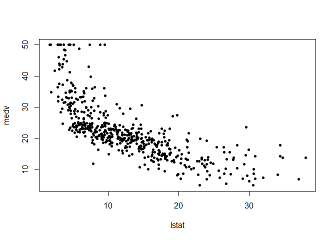
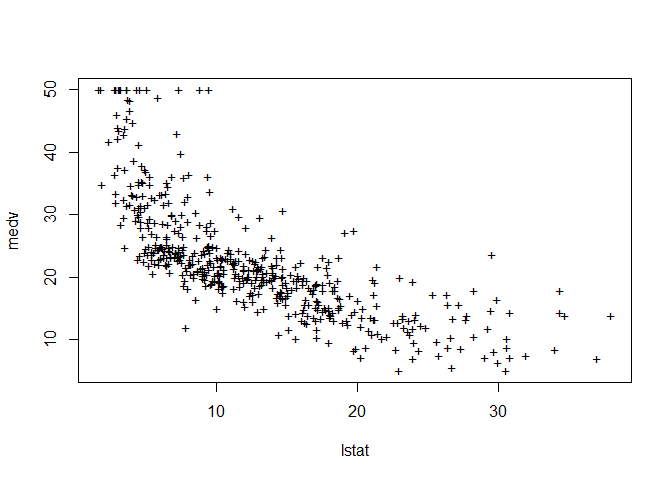

# chapter3-1
Min-Yao  
2017年12月5日  

# Chapter 3 Lab: Linear Regression


```r
library(MASS)
library(ISLR)
```

```
## Warning: package 'ISLR' was built under R version 3.4.2
```

# Simple Linear Regression


```r
#fix(Boston)
names(Boston)
```

```
##  [1] "crim"    "zn"      "indus"   "chas"    "nox"     "rm"      "age"    
##  [8] "dis"     "rad"     "tax"     "ptratio" "black"   "lstat"   "medv"
```

```r
#lm.fit=lm(medv~lstat)
lm.fit=lm(medv~lstat,data=Boston)
attach(Boston)
lm.fit=lm(medv~lstat)
lm.fit
```

```
## 
## Call:
## lm(formula = medv ~ lstat)
## 
## Coefficients:
## (Intercept)        lstat  
##       34.55        -0.95
```

```r
summary(lm.fit)
```

```
## 
## Call:
## lm(formula = medv ~ lstat)
## 
## Residuals:
##     Min      1Q  Median      3Q     Max 
## -15.168  -3.990  -1.318   2.034  24.500 
## 
## Coefficients:
##             Estimate Std. Error t value Pr(>|t|)    
## (Intercept) 34.55384    0.56263   61.41   <2e-16 ***
## lstat       -0.95005    0.03873  -24.53   <2e-16 ***
## ---
## Signif. codes:  0 '***' 0.001 '**' 0.01 '*' 0.05 '.' 0.1 ' ' 1
## 
## Residual standard error: 6.216 on 504 degrees of freedom
## Multiple R-squared:  0.5441,	Adjusted R-squared:  0.5432 
## F-statistic: 601.6 on 1 and 504 DF,  p-value: < 2.2e-16
```

```r
names(lm.fit)
```

```
##  [1] "coefficients"  "residuals"     "effects"       "rank"         
##  [5] "fitted.values" "assign"        "qr"            "df.residual"  
##  [9] "xlevels"       "call"          "terms"         "model"
```

```r
coef(lm.fit)
```

```
## (Intercept)       lstat 
##  34.5538409  -0.9500494
```

```r
confint(lm.fit)
```

```
##                 2.5 %     97.5 %
## (Intercept) 33.448457 35.6592247
## lstat       -1.026148 -0.8739505
```

```r
predict(lm.fit,data.frame(lstat=(c(5,10,15))), interval="confidence")
```

```
##        fit      lwr      upr
## 1 29.80359 29.00741 30.59978
## 2 25.05335 24.47413 25.63256
## 3 20.30310 19.73159 20.87461
```

```r
predict(lm.fit,data.frame(lstat=(c(5,10,15))), interval="prediction")
```

```
##        fit       lwr      upr
## 1 29.80359 17.565675 42.04151
## 2 25.05335 12.827626 37.27907
## 3 20.30310  8.077742 32.52846
```

```r
plot(lstat,medv)
abline(lm.fit)
abline(lm.fit,lwd=3)
abline(lm.fit,lwd=3,col="red")
```

<!-- -->

```r
plot(lstat,medv,col="red")
```

<!-- -->

```r
plot(lstat,medv,pch=20)
```

<!-- -->

```r
plot(lstat,medv,pch="+")
```

<!-- -->

```r
plot(1:20,1:20,pch=1:20)
```

<!-- -->

```r
par(mfrow=c(2,2))
plot(lm.fit)
```

<!-- -->

```r
plot(predict(lm.fit), residuals(lm.fit))
plot(predict(lm.fit), rstudent(lm.fit))
plot(hatvalues(lm.fit))
which.max(hatvalues(lm.fit))
```

```
## 375 
## 375
```

<!-- -->

# 8. This question involves the use of simple linear regression on the Auto data set.

(a) Use the lm() function to perform a simple linear regression with
mpg as the response and horsepower as the predictor. Use the
summary() function to print the results. Comment on the output.
For example:

i. Is there a relationship between the predictor and the re-
sponse?

ii. How strong is the relationship between the predictor and
the response?

iii. Is the relationship between the predictor and the response
positive or negative?

iv. What is the predicted mpg associated with a horsepower of
98? What are the associated 95 % confidence and prediction
intervals?

(b) Plot the response and the predictor. Use the abline() function
to display the least squares regression line.

(c) Use the plot() function to produce diagnostic plots of the least
squares regression fit. Comment on any problems you see with
the fit.

# 13. In this exercise you will create some simulated data and will fit simple linear regression models to it. Make sure to use set.seed(1) prior to starting part (a) to ensure consistent results.

(a) Using the rnorm() function, create a vector, x, containing 100
observations drawn from a N(0, 1) distribution. This represents
a feature, X.
(b) Using the rnorm() function, create a vector, eps, containing 100
observations drawn from a N(0, 0.25) distribution i.e. a normal
distribution with mean zero and variance 0.25.
(c) Using x and eps, generate a vector y according to the model

Y = − 1 + 0.5X + . (3.39)

What is the length of the vector y? What are the values of β 0
and β 1 in this linear model?

(d) Create a scatterplot displaying the relationship between x and
y. Comment on what you observe.
(e) Fit a least squares linear model to predict y using x. Comment
on the model obtained. How do
ˆ
β 0 and
ˆ
β 1 compare to β 0 and
β 1 ?
(f) Display the least squares line on the scatterplot obtained in (d).
Draw the population regression line on the plot, in a different
color. Use the legend() command to create an appropriate leg-
end.
(g) Now fit a polynomial regression model that predicts y using x
and x
2
. Is there evidence that the quadratic term improves the
model fit? Explain your answer.
(h) Repeat (a)–(f) after modifying the data generation process in
such a way that there is less noise in the data. The model (3.39)
should remain the same. You can do this by decreasing the vari-
ance of the normal distribution used to generate the error term
 in (b). Describe your results.
(i) Repeat (a)–(f) after modifying the data generation process in
such a way that there is more noise in the data. The model
(3.39) should remain the same. You can do this by increasing
the variance of the normal distribution used to generate the
error term  in (b). Describe your results.
(j) What are the confidence intervals for β 0 and β 1 based on the
original data set, the noisier data set, and the less noisy data
set? Comment on your results.

# 15. This problem involves the Boston data set, which we saw in the lab
for this chapter. We will now try to predict per capita crime rate
using the other variables in this data set. In other words, per capita
crime rate is the response, and the other variables are the predictors.
(a) For each predictor, fit a simple linear regression model to predict
the response. Describe your results. In which of the models is
there a statistically significant association between the predictor
and the response? Create some plots to back up your assertions.

