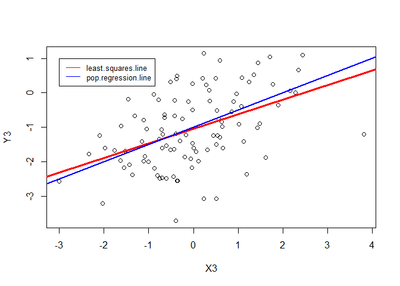

# chapter3-1
Min-Yao  
2017年12月5日  

# Chapter 3 Lab: Linear Regression


```r
library(MASS)
library(ISLR)
```

```
## Warning: package 'ISLR' was built under R version 3.4.2
```

# Simple Linear Regression


```r
#fix(Boston)
names(Boston)
```

```
##  [1] "crim"    "zn"      "indus"   "chas"    "nox"     "rm"      "age"    
##  [8] "dis"     "rad"     "tax"     "ptratio" "black"   "lstat"   "medv"
```

```r
#lm.fit=lm(medv~lstat)
lm.fit=lm(medv~lstat,data=Boston)
attach(Boston)
lm.fit=lm(medv~lstat)
lm.fit
```

```
## 
## Call:
## lm(formula = medv ~ lstat)
## 
## Coefficients:
## (Intercept)        lstat  
##       34.55        -0.95
```

```r
summary(lm.fit)
```

```
## 
## Call:
## lm(formula = medv ~ lstat)
## 
## Residuals:
##     Min      1Q  Median      3Q     Max 
## -15.168  -3.990  -1.318   2.034  24.500 
## 
## Coefficients:
##             Estimate Std. Error t value Pr(>|t|)    
## (Intercept) 34.55384    0.56263   61.41   <2e-16 ***
## lstat       -0.95005    0.03873  -24.53   <2e-16 ***
## ---
## Signif. codes:  0 '***' 0.001 '**' 0.01 '*' 0.05 '.' 0.1 ' ' 1
## 
## Residual standard error: 6.216 on 504 degrees of freedom
## Multiple R-squared:  0.5441,	Adjusted R-squared:  0.5432 
## F-statistic: 601.6 on 1 and 504 DF,  p-value: < 2.2e-16
```

```r
names(lm.fit)
```

```
##  [1] "coefficients"  "residuals"     "effects"       "rank"         
##  [5] "fitted.values" "assign"        "qr"            "df.residual"  
##  [9] "xlevels"       "call"          "terms"         "model"
```

```r
coef(lm.fit)
```

```
## (Intercept)       lstat 
##  34.5538409  -0.9500494
```

```r
confint(lm.fit)
```

```
##                 2.5 %     97.5 %
## (Intercept) 33.448457 35.6592247
## lstat       -1.026148 -0.8739505
```

```r
predict(lm.fit,data.frame(lstat=(c(5,10,15))), interval="confidence")
```

```
##        fit      lwr      upr
## 1 29.80359 29.00741 30.59978
## 2 25.05335 24.47413 25.63256
## 3 20.30310 19.73159 20.87461
```

```r
predict(lm.fit,data.frame(lstat=(c(5,10,15))), interval="prediction")
```

```
##        fit       lwr      upr
## 1 29.80359 17.565675 42.04151
## 2 25.05335 12.827626 37.27907
## 3 20.30310  8.077742 32.52846
```

```r
plot(lstat,medv)
abline(lm.fit)
abline(lm.fit,lwd=3)
abline(lm.fit,lwd=3,col="red")
```

<!-- -->

```r
plot(lstat,medv,col="red")
```

<!-- -->

```r
plot(lstat,medv,pch=20)
```

<!-- -->

```r
plot(lstat,medv,pch="+")
```

<!-- -->

```r
plot(1:20,1:20,pch=1:20)
```

<!-- -->

```r
par(mfrow=c(2,2))
plot(lm.fit)
```

<!-- -->

```r
plot(predict(lm.fit), residuals(lm.fit))
plot(predict(lm.fit), rstudent(lm.fit))
plot(hatvalues(lm.fit))
which.max(hatvalues(lm.fit))
```

```
## 375 
## 375
```

<!-- -->

# 8. This question involves the use of simple linear regression on the Auto data set.

(a) Use the lm() function to perform a simple linear regression with
mpg as the response and horsepower as the predictor. Use the
summary() function to print the results. Comment on the output.
For example:


```r
library(ISLR)
#Auto
summary(Auto)
```

```
##       mpg          cylinders      displacement     horsepower   
##  Min.   : 9.00   Min.   :3.000   Min.   : 68.0   Min.   : 46.0  
##  1st Qu.:17.00   1st Qu.:4.000   1st Qu.:105.0   1st Qu.: 75.0  
##  Median :22.75   Median :4.000   Median :151.0   Median : 93.5  
##  Mean   :23.45   Mean   :5.472   Mean   :194.4   Mean   :104.5  
##  3rd Qu.:29.00   3rd Qu.:8.000   3rd Qu.:275.8   3rd Qu.:126.0  
##  Max.   :46.60   Max.   :8.000   Max.   :455.0   Max.   :230.0  
##                                                                 
##      weight      acceleration        year           origin     
##  Min.   :1613   Min.   : 8.00   Min.   :70.00   Min.   :1.000  
##  1st Qu.:2225   1st Qu.:13.78   1st Qu.:73.00   1st Qu.:1.000  
##  Median :2804   Median :15.50   Median :76.00   Median :1.000  
##  Mean   :2978   Mean   :15.54   Mean   :75.98   Mean   :1.577  
##  3rd Qu.:3615   3rd Qu.:17.02   3rd Qu.:79.00   3rd Qu.:2.000  
##  Max.   :5140   Max.   :24.80   Max.   :82.00   Max.   :3.000  
##                                                                
##                  name    
##  amc matador       :  5  
##  ford pinto        :  5  
##  toyota corolla    :  5  
##  amc gremlin       :  4  
##  amc hornet        :  4  
##  chevrolet chevette:  4  
##  (Other)           :365
```

```r
attach(Auto)
Auto.lm.fit=lm(mpg~horsepower)
summary(Auto.lm.fit)
```

```
## 
## Call:
## lm(formula = mpg ~ horsepower)
## 
## Residuals:
##      Min       1Q   Median       3Q      Max 
## -13.5710  -3.2592  -0.3435   2.7630  16.9240 
## 
## Coefficients:
##              Estimate Std. Error t value Pr(>|t|)    
## (Intercept) 39.935861   0.717499   55.66   <2e-16 ***
## horsepower  -0.157845   0.006446  -24.49   <2e-16 ***
## ---
## Signif. codes:  0 '***' 0.001 '**' 0.01 '*' 0.05 '.' 0.1 ' ' 1
## 
## Residual standard error: 4.906 on 390 degrees of freedom
## Multiple R-squared:  0.6059,	Adjusted R-squared:  0.6049 
## F-statistic: 599.7 on 1 and 390 DF,  p-value: < 2.2e-16
```

```r
plot(horsepower,mpg)
abline(Auto.lm.fit,lwd=3,col="red")
```

<!-- -->


i. Is there a relationship between the predictor and the re-
sponse?

Yes, p-value: < 2.2e-16

ii. How strong is the relationship between the predictor and
the response?

very strong, because
## Coefficients:
##              Estimate Std. Error t value Pr(>|t|)    
## (Intercept) 39.935861   0.717499   55.66   <2e-16 ***
## horsepower  -0.157845   0.006446  -24.49   <2e-16 ***

iii. Is the relationship between the predictor and the response
positive or negative?

negative, we can see their negative relationship on the plot

iv. What is the predicted mpg associated with a horsepower of
98? What are the associated 95 % confidence and prediction
intervals?


```r
predict(Auto.lm.fit,data.frame(horsepower=98), interval="confidence")
```

```
##        fit      lwr      upr
## 1 24.46708 23.97308 24.96108
```

```r
predict(Auto.lm.fit,data.frame(horsepower=98), interval="prediction")
```

```
##        fit     lwr      upr
## 1 24.46708 14.8094 34.12476
```


(b) Plot the response and the predictor. Use the abline() function
to display the least squares regression line.


```r
plot(horsepower,mpg)
abline(Auto.lm.fit,lwd=3,col="red")
```

<!-- -->


(c) Use the plot() function to produce diagnostic plots of the least
squares regression fit. Comment on any problems you see with
the fit.


```r
par(mfrow=c(2,2))
plot(Auto.lm.fit)
```

<!-- -->


# 13. In this exercise you will create some simulated data and will fit simple linear regression models to it. Make sure to use set.seed(1) prior to starting part (a) to ensure consistent results.

(a) Using the rnorm() function, create a vector, x, containing 100
observations drawn from a N(0, 1) distribution. This represents
a feature, X.


```r
set.seed(1) 
#?rnorm() 
X <- rnorm(100, mean = 0, sd = 1)
X
```

```
##   [1] -0.626453811  0.183643324 -0.835628612  1.595280802  0.329507772
##   [6] -0.820468384  0.487429052  0.738324705  0.575781352 -0.305388387
##  [11]  1.511781168  0.389843236 -0.621240581 -2.214699887  1.124930918
##  [16] -0.044933609 -0.016190263  0.943836211  0.821221195  0.593901321
##  [21]  0.918977372  0.782136301  0.074564983 -1.989351696  0.619825748
##  [26] -0.056128740 -0.155795507 -1.470752384 -0.478150055  0.417941560
##  [31]  1.358679552 -0.102787727  0.387671612 -0.053805041 -1.377059557
##  [36] -0.414994563 -0.394289954 -0.059313397  1.100025372  0.763175748
##  [41] -0.164523596 -0.253361680  0.696963375  0.556663199 -0.688755695
##  [46] -0.707495157  0.364581962  0.768532925 -0.112346212  0.881107726
##  [51]  0.398105880 -0.612026393  0.341119691 -1.129363096  1.433023702
##  [56]  1.980399899 -0.367221476 -1.044134626  0.569719627 -0.135054604
##  [61]  2.401617761 -0.039240003  0.689739362  0.028002159 -0.743273209
##  [66]  0.188792300 -1.804958629  1.465554862  0.153253338  2.172611670
##  [71]  0.475509529 -0.709946431  0.610726353 -0.934097632 -1.253633400
##  [76]  0.291446236 -0.443291873  0.001105352  0.074341324 -0.589520946
##  [81] -0.568668733 -0.135178615  1.178086997 -1.523566800  0.593946188
##  [86]  0.332950371  1.063099837 -0.304183924  0.370018810  0.267098791
##  [91] -0.542520031  1.207867806  1.160402616  0.700213650  1.586833455
##  [96]  0.558486426 -1.276592208 -0.573265414 -1.224612615 -0.473400636
```


(b) Using the rnorm() function, create a vector, eps, containing 100
observations drawn from a N(0, 0.25) distribution i.e. a normal
distribution with mean zero and variance 0.25.


```r
eps <- rnorm(100, mean = 0, sd = sqrt(0.25))
eps
```

```
##   [1] -0.310183339  0.021057937 -0.455460824  0.079014386 -0.327292322
##   [6]  0.883643635  0.358353738  0.455087115  0.192092679  0.841088040
##  [11] -0.317868227 -0.230822365  0.716141119 -0.325348177 -0.103690372
##  [16] -0.196403965 -0.159996434 -0.139556651  0.247094166 -0.088665241
##  [21] -0.252978731  0.671519413 -0.107289704 -0.089778265 -0.050095371
##  [26]  0.356333154 -0.036782202 -0.018817086 -0.340830239 -0.162135136
##  [31]  0.030080220 -0.294447243  0.265748096 -0.759197041  0.153278930
##  [36] -0.768224912 -0.150488063 -0.264139952 -0.326047390 -0.028448389
##  [41] -0.957179713  0.588291656 -0.832486218 -0.231765201 -0.557960053
##  [46] -0.375409501  1.043583273  0.008697810 -0.643150265 -0.820302767
##  [51]  0.225093551 -0.009279916 -0.159034187 -0.464681074 -0.743730155
##  [56] -0.537596148  0.500014402 -0.310633347 -0.692213424  0.934645311
##  [61]  0.212550189 -0.119323550  0.529241524  0.443211326 -0.309621524
##  [66]  1.103051232 -0.127513515 -0.712247325 -0.072199801  0.103769170
##  [71]  1.153989200  0.052901184  0.228499403 -0.038576468 -0.167000421
##  [76] -0.017363014  0.393819803  1.037622504  0.513696219  0.603954199
##  [81] -0.615661711  0.491947785  0.109962402 -0.733625015  0.260511371
##  [86] -0.079377302  0.732293656 -0.383041000 -0.215105877 -0.463054749
##  [91] -0.088551981  0.201005890 -0.365874087  0.415186584 -0.604041393
##  [96] -0.523992206  0.720578853 -0.507923733  0.205987356 -0.190538026
```

(c) Using x and eps, generate a vector y according to the model

Y = − 1 + 0.5X + E. (3.39)

What is the length of the vector y? What are the values of β 0
and β 1 in this linear model?

> the length of the vector y is 100
> β 0= -1
> β 1= 0.5


```r
Y = -1 + 0.5*X + eps
Y
```

```
##   [1] -1.62341024 -0.88712040 -1.87327513 -0.12334521 -1.16253844
##   [6] -0.52659056 -0.39793174 -0.17575053 -0.52001665 -0.31160615
##  [11] -0.56197764 -1.03590075 -0.59447917 -2.43269812 -0.54122491
##  [16] -1.21887077 -1.16809157 -0.66763855 -0.34229524 -0.79171458
##  [21] -0.79349005  0.06258756 -1.07000721 -2.08445411 -0.74018250
##  [26] -0.67173122 -1.11467996 -1.75419328 -1.57990527 -0.95316436
##  [31] -0.29058000 -1.34584111 -0.54041610 -1.78609956 -1.53525085
##  [36] -1.97572219 -1.34763304 -1.29379665 -0.77603470 -0.64686051
##  [41] -2.03944151 -0.53838918 -1.48400453 -0.95343360 -1.90233790
##  [46] -1.72915708  0.22587425 -0.60703573 -1.69932337 -1.37974890
##  [51] -0.57585351 -1.31529311 -0.98847434 -2.02936262 -1.02721830
##  [56] -0.54739620 -0.68359634 -1.83270066 -1.40735361 -0.13288199
##  [61]  0.41335907 -1.13894355 -0.12588879 -0.54278759 -1.68125813
##  [66]  0.19744738 -2.02999283 -0.97946989 -0.99557313  0.19007500
##  [71]  0.39174396 -1.30207203 -0.46613742 -1.50562528 -1.79381712
##  [76] -0.87163990 -0.82782613  0.03817518 -0.44913312 -0.69080627
##  [81] -1.89999608 -0.57564152 -0.30099410 -2.49540841 -0.44251553
##  [86] -0.91290212  0.26384357 -1.53513296 -1.03009647 -1.32950535
##  [91] -1.35981200 -0.19506021 -0.78567278 -0.23470659 -0.81062467
##  [96] -1.24474899 -0.91771725 -1.79455644 -1.40631895 -1.42723834
```


(d) Create a scatterplot displaying the relationship between x and
y. Comment on what you observe.


```r
plot(X,Y)
```

<!-- -->

> linear relationship

(e) Fit a least squares linear model to predict y using x. Comment
on the model obtained. How doˆβ 0 and ˆβ 1 compare to β 0 and
β 1 ?


```r
XY.lm.fit <- lm(Y~X)
summary(XY.lm.fit)
```

```
## 
## Call:
## lm(formula = Y ~ X)
## 
## Residuals:
##      Min       1Q   Median       3Q      Max 
## -0.93842 -0.30688 -0.06975  0.26970  1.17309 
## 
## Coefficients:
##             Estimate Std. Error t value Pr(>|t|)    
## (Intercept) -1.01885    0.04849 -21.010  < 2e-16 ***
## X            0.49947    0.05386   9.273 4.58e-15 ***
## ---
## Signif. codes:  0 '***' 0.001 '**' 0.01 '*' 0.05 '.' 0.1 ' ' 1
## 
## Residual standard error: 0.4814 on 98 degrees of freedom
## Multiple R-squared:  0.4674,	Adjusted R-squared:  0.4619 
## F-statistic: 85.99 on 1 and 98 DF,  p-value: 4.583e-15
```

```r
confint(XY.lm.fit)
```

```
##                  2.5 %     97.5 %
## (Intercept) -1.1150804 -0.9226122
## X            0.3925794  0.6063602
```
> β 0= -1
> β 1= 0.5
> Estimate β 0= -1.01885
> Estimate β 1= 0.49947


(f) Display the least squares line on the scatterplot obtained in (d).
Draw the population regression line on the plot, in a different
color. Use the legend() command to create an appropriate legend.


```r
plot(X,Y)
abline(XY.lm.fit,lwd=3,col="red")
abline(coef= c(-1,0.5),lwd=2,col="blue")
#?abline
#?legend()
legend(-2.2,0.5, legend=c("least.squares.line", "pop.regression.line"),
       col=c("red", "blue"), lty=1, cex=0.8)
```

<!-- -->


(g) Now fit a polynomial regression model that predicts y using x
and x2. Is there evidence that the quadratic term improves the
model fit? Explain your answer.


```r
poly.lm.fit=lm(Y ~ poly(X,2))
summary(poly.lm.fit)
```

```
## 
## Call:
## lm(formula = Y ~ poly(X, 2))
## 
## Residuals:
##      Min       1Q   Median       3Q      Max 
## -0.98252 -0.31270 -0.06441  0.29014  1.13500 
## 
## Coefficients:
##             Estimate Std. Error t value Pr(>|t|)    
## (Intercept)  -0.9645     0.0479 -20.134  < 2e-16 ***
## poly(X, 2)1   4.4638     0.4790   9.319 3.97e-15 ***
## poly(X, 2)2  -0.6720     0.4790  -1.403    0.164    
## ---
## Signif. codes:  0 '***' 0.001 '**' 0.01 '*' 0.05 '.' 0.1 ' ' 1
## 
## Residual standard error: 0.479 on 97 degrees of freedom
## Multiple R-squared:  0.4779,	Adjusted R-squared:  0.4672 
## F-statistic:  44.4 on 2 and 97 DF,  p-value: 2.038e-14
```

```r
confint(poly.lm.fit)
```

```
##                 2.5 %     97.5 %
## (Intercept) -1.059532 -0.8693889
## poly(X, 2)1  3.513033  5.4144615
## poly(X, 2)2 -1.622745  0.2786835
```


(h) Repeat (a)–(f) after modifying the data generation process in
such a way that there is less noise in the data. The model (3.39)
should remain the same. You can do this by decreasing the vari-
ance of the normal distribution used to generate the error term
E in (b). Describe your results.


```r
X2 <- rnorm(100, mean = 0, sd = 1)
X2
```

```
##   [1]  0.409401840  1.688873286  1.586588433 -0.330907801 -2.285235535
##   [6]  2.497661590  0.667066167  0.541327336 -0.013399523  0.510108423
##  [11] -0.164375832  0.420694643 -0.400246744 -1.370207878  0.987838267
##  [16]  1.519745025 -0.308740569 -1.253289756  0.642241306 -0.044709137
##  [21] -1.733218407  0.002131860 -0.630300334 -0.340968580 -1.156572363
##  [26]  1.803141908 -0.331132036 -1.605513412  0.197193439  0.263175646
##  [31] -0.985826700 -2.888920672 -0.640481703  0.570507636 -0.059723276
##  [36] -0.098178744  0.560820729 -1.186458639  1.096777044 -0.005344028
##  [41]  0.707310667  1.034107735  0.223480415 -0.878707613  1.162964556
##  [46] -2.000164945 -0.544790740 -0.255670709 -0.166121037  1.020463909
##  [51]  0.136221893  0.407167603 -0.069654813 -0.247664342  0.695550807
##  [56]  1.146228357 -2.403096215  0.572739555  0.374724407 -0.425267722
##  [61]  0.951012808 -0.389237182 -0.284330662  0.857409778  1.719627299
##  [66]  0.270054901 -0.422184010 -1.189113295 -0.331032979 -0.939829327
##  [71] -0.258932583  0.394379168 -0.851857092  2.649166881  0.156011676
##  [76]  1.130207267 -2.289123980  0.741001157 -1.316245160  0.919803678
##  [81]  0.398130155 -0.407528579  1.324258630 -0.701231669 -0.580614304
##  [86] -1.001072181 -0.668178607  0.945184953  0.433702150  1.005159218
##  [91] -0.390118664  0.376370292  0.244164924 -1.426257342  1.778429287
##  [96]  0.134447661  0.765598999  0.955136677 -0.050565701 -0.305815420
```

```r
eps2 <- rnorm(100, mean = 0, sd = sqrt(0.01))
eps2
```

```
##   [1]  0.0893673702 -0.1047298149  0.1971337386 -0.0383632106  0.1654145302
##   [6]  0.1512212694  0.0082965734  0.0567220915 -0.1024548480  0.0323006503
##  [11]  0.1043612458  0.0099078487 -0.0454136909 -0.0655781852 -0.0035922423
##  [16]  0.1069161461 -0.0483974930 -0.0121010111 -0.1294140004  0.0494312836
##  [21]  0.1307901520  0.1497041009  0.0814702731 -0.1869788790  0.0482029504
##  [26]  0.0456135603 -0.0353400286  0.0170489471 -0.0864035954  0.0679230774
##  [31] -0.0327101015 -0.1569082185 -0.0367450756  0.1364434929 -0.0334281365
##  [36]  0.0732750042  0.0946585640  0.0004398704 -0.0352322306 -0.0529695509
##  [41]  0.0739589226 -0.1063457415  0.0246210844 -0.0289499367 -0.2264889356
##  [46] -0.1408850456  0.0916019329 -0.0191278951  0.0803283216  0.1887474463
##  [51]  0.1473881181  0.0677268492  0.0379962687 -0.0192798426  0.1577891795
##  [56]  0.0596234109 -0.1173576941 -0.0155642535 -0.1918909820 -0.0195258846
##  [61] -0.2592327670  0.1314002167 -0.0635543001 -0.0429978839 -0.0169318332
##  [66]  0.0612218174  0.0678340177  0.0567951972 -0.0572542604 -0.1363291256
##  [71] -0.0388722244  0.0277914132 -0.0823081122 -0.0068840934 -0.1167662326
##  [76] -0.0008309014  0.0128855402 -0.0145875628 -0.0163910957  0.1763552003
##  [81]  0.0762586512  0.1111431081 -0.0923206953  0.0164341838  0.1154825187
##  [86] -0.0056521425 -0.2129360648  0.0344845762 -0.1904955446 -0.0811170153
##  [91]  0.1324004321  0.0615636849  0.1091668956  0.0306604862 -0.0110158762
##  [96] -0.0924312773  0.1592913754  0.0045010598 -0.0715128401  0.0865223100
```

```r
Y2 = -1 + 0.5*X2 + eps2
Y2
```

```
##   [1] -0.705931710 -0.260293172 -0.009572045 -1.203817111 -1.977203237
##   [6]  0.400052064 -0.658170343 -0.672614241 -1.109154610 -0.712645138
##  [11] -0.977826670 -0.779744830 -1.245537063 -1.750682124 -0.509673109
##  [16] -0.133211341 -1.202767778 -1.638745889 -0.808293348 -0.972923285
##  [21] -1.735819051 -0.849229969 -1.233679894 -1.357463169 -1.530083231
##  [26] -0.052815486 -1.200906047 -1.785707759 -0.987806876 -0.800489099
##  [31] -1.525623452 -2.601368554 -1.356985927 -0.578302689 -1.063289774
##  [36] -0.975814368 -0.624931072 -1.592789449 -0.486843708 -1.055641565
##  [41] -0.572385744 -0.589291874 -0.863638708 -1.468303743 -0.645006658
##  [46] -2.140967518 -1.180793437 -1.146963250 -1.002732197 -0.301020599
##  [51] -0.784500935 -0.728689349 -0.996831138 -1.143112013 -0.494435417
##  [56] -0.367262410 -2.318905802 -0.729194476 -1.004528779 -1.232159745
##  [61] -0.783726363 -1.063218374 -1.205719631 -0.614292995 -0.157118184
##  [66] -0.803750732 -1.143257987 -1.537761450 -1.222770750 -1.606243789
##  [71] -1.168338516 -0.775019003 -1.508236658  0.317699347 -1.038760395
##  [76] -0.435727268 -2.131676450 -0.644086984 -1.674513676 -0.363742961
##  [81] -0.724676271 -1.092621182 -0.430191380 -1.334181651 -1.174824633
##  [86] -1.506188233 -1.547025368 -0.492922947 -0.973644470 -0.578537406
##  [91] -1.062658900 -0.750251169 -0.768750642 -1.682468185 -0.121801233
##  [96] -1.025207447 -0.457909125 -0.517930602 -1.096795691 -1.066385400
```

```r
XY2.lm.fit <- lm(Y2~X2)
summary(XY2.lm.fit)
```

```
## 
## Call:
## lm(formula = Y2 ~ X2)
## 
## Residuals:
##       Min        1Q    Median        3Q       Max 
## -0.274179 -0.056139 -0.001749  0.067973  0.184843 
## 
## Coefficients:
##              Estimate Std. Error t value Pr(>|t|)    
## (Intercept) -0.995155   0.009910 -100.42   <2e-16 ***
## X2           0.510622   0.009626   53.05   <2e-16 ***
## ---
## Signif. codes:  0 '***' 0.001 '**' 0.01 '*' 0.05 '.' 0.1 ' ' 1
## 
## Residual standard error: 0.09906 on 98 degrees of freedom
## Multiple R-squared:  0.9663,	Adjusted R-squared:  0.966 
## F-statistic:  2814 on 1 and 98 DF,  p-value: < 2.2e-16
```

```r
confint(XY2.lm.fit)
```

```
##                  2.5 %     97.5 %
## (Intercept) -1.0148210 -0.9754890
## X2           0.4915195  0.5297242
```

```r
plot(X2,Y2)
abline(XY2.lm.fit,lwd=3,col="red")
abline(coef= c(-1,0.5),lwd=2,col="blue")
legend(-2.2,0.2, legend=c("least.squares.line", "pop.regression.line"),
       col=c("red", "blue"), lty=1, cex=0.8)
```

<!-- -->


(i) Repeat (a)–(f) after modifying the data generation process in
such a way that there is more noise in the data. The model
(3.39) should remain the same. You can do this by increasing
the variance of the normal distribution used to generate the
error term E in (b). Describe your results.


```r
X3 <- rnorm(100, mean = 0, sd = 1)
X3
```

```
##   [1]  1.07444096  1.89565477 -0.60299730 -0.39086782 -0.41622203
##   [6] -0.37565742 -0.36663095 -0.29567745  1.44182041 -0.69753829
##  [11] -0.38816751  0.65253645  1.12477245 -0.77211080 -0.50808622
##  [16]  0.52362059  1.01775423 -0.25116459 -1.42999345  1.70912103
##  [21]  1.43506957 -0.71037115 -0.06506757 -1.75946874  0.56972297
##  [26]  1.61234680 -1.63728065 -0.77956851 -0.64117693 -0.68113139
##  [31] -2.03328560  0.50096356 -1.53179814 -0.02499764  0.59298472
##  [36] -0.19819542  0.89200839 -0.02571507 -0.64766045  0.64635942
##  [41] -0.43383274  1.77261118 -0.01825971  0.85281499  0.20516290
##  [46] -3.00804860 -1.36611193 -0.42410226  0.23680366 -2.34272312
##  [51]  0.96169663 -0.60442573 -0.75287728 -1.55561159 -1.45389374
##  [56]  0.05633184  0.50936941 -2.09788296 -1.00436198  0.53577172
##  [61] -0.45303708  2.16536850  1.24574667  0.59549803  0.00488445
##  [66]  0.27936078 -0.70590613  0.62801715  1.48021396  1.08342991
##  [71] -0.81324426 -1.61887685 -0.10965570  0.44088937  1.35099398
##  [76] -1.31860948  0.36438459  0.23349984  1.19395526 -0.02790997
##  [81] -0.35729885 -1.14681414 -0.51742048 -0.36212377  2.35055433
##  [86]  2.44653138 -0.16670328 -1.04366744 -1.97293493  0.51467163
##  [91] -1.09057358  2.28465933 -0.88561757  0.11110643  3.81027668
##  [96] -1.10891000  0.30756662 -1.10689447  0.34765365 -0.87326454
```

```r
eps3 <- rnorm(100, mean = 0, sd = sqrt(1))
eps3
```

```
##   [1]  0.07730312 -0.29686864 -1.18324224  0.01129269  0.99160104
##   [6]  1.59396745 -1.37271127 -0.24961093  1.15942453 -1.11422235
##  [11] -2.52850069 -0.93590256 -0.96723946  0.04748859 -0.40373679
##  [16]  0.23149613 -0.42237241  0.37411839 -0.36600577  1.19010145
##  [21] -0.73732753  0.29066665 -0.88484957  0.20800648 -0.04773017
##  [26] -1.68452065 -0.14422656  1.18021367  0.68139992  0.14324763
##  [31] -1.19231644  1.16922865  0.07920171 -0.45177375  1.64202821
##  [36] -0.76959232  0.30336096  1.28173742  0.60222280 -0.30702226
##  [41] -0.41841810  0.35513553  0.51348111  0.01860740  1.31844897
##  [46] -0.06583200 -0.70029608  0.53732613 -2.20178232  0.39197374
##  [51]  0.49696095 -0.22487472 -1.11714317 -0.39499460  1.54983034
##  [56] -0.74351448 -2.33171212  0.81224544 -0.50131066 -0.51088657
##  [61] -1.21536404 -0.02255863  0.70123930 -0.58748203 -0.60672794
##  [66]  1.09664022 -0.24750968 -0.15990171 -0.62577825  0.90043464
##  [71] -0.99419363  0.84925039  0.80570229 -0.46760094  0.84842031
##  [76]  0.98676986  0.57562029  2.02484205 -1.96235319 -1.16492093
##  [81] -1.37651921  0.16767993  1.58462908  1.67788895  0.48829670
##  [86]  0.87867326 -0.14487487  0.46897176  0.37623548 -0.76104028
##  [91] -0.29329493 -0.13484126  1.39384582 -1.03698869 -2.11433515
##  [96]  0.76827822 -0.81616062 -0.43610692  0.90470503 -0.76308626
```

```r
Y3 = -1 + 0.5*X3 + eps3
Y3
```

```
##   [1] -0.385476398 -0.349041255 -2.484740892 -1.184141222 -0.216509980
##   [6]  0.406138742 -2.556026744 -1.397449659  0.880334732 -2.462991494
##  [11] -3.722584442 -1.609634332 -1.404853235 -1.338566809 -1.657779902
##  [16] -0.506693577 -0.913495295 -0.751463899 -2.081002499  1.044661963
##  [21] -1.019792739 -1.064518927 -1.917383355 -1.671727889 -0.762868687
##  [26] -1.878347247 -1.962866880 -0.209570591 -0.639188544 -1.197318066
##  [31] -3.208959242  0.419710432 -1.686697361 -1.464272572  0.938520573
##  [36] -1.868690032 -0.250634843  0.268879886 -0.721607430 -0.983842557
##  [41] -1.635334473  0.241441123 -0.495648741 -0.554985103  0.421030424
##  [46] -2.569856299 -2.383352044 -0.674724999 -3.083380490 -1.779387816
##  [51] -0.022190731 -1.527087582 -2.493581805 -2.172800400 -0.177116527
##  [56] -1.715348562 -3.077027414 -1.236696038 -2.003491647 -1.243000705
##  [61] -2.441882583  0.060125623  0.324112637 -1.289733009 -1.604285717
##  [66]  0.236320606 -1.600462740 -0.845893137 -0.885671271  0.442149591
##  [71] -2.400815758 -0.960188039 -0.249125561 -1.247156251  0.523917304
##  [76] -0.672534879 -0.242187415  1.141591963 -2.365375561 -2.178875917
##  [81] -2.555168641 -1.405727134  0.325918837  0.496827067  0.663573861
##  [86]  1.101938950 -1.228226514 -1.052861959 -1.610231990 -1.503704458
##  [91] -1.838581726  0.007488398 -0.048962970 -1.981435475 -1.209196807
##  [96] -0.786176781 -1.662377309 -1.989554159  0.078531856 -2.199718532
```

```r
XY3.lm.fit <- lm(Y3~X3)
summary(XY3.lm.fit)
```

```
## 
## Call:
## lm(formula = Y3 ~ X3)
## 
## Residuals:
##      Min       1Q   Median       3Q      Max 
## -2.51014 -0.60549  0.02065  0.70483  2.08980 
## 
## Coefficients:
##             Estimate Std. Error t value Pr(>|t|)    
## (Intercept) -1.04745    0.09676 -10.825  < 2e-16 ***
## X3           0.42505    0.08310   5.115 1.56e-06 ***
## ---
## Signif. codes:  0 '***' 0.001 '**' 0.01 '*' 0.05 '.' 0.1 ' ' 1
## 
## Residual standard error: 0.9671 on 98 degrees of freedom
## Multiple R-squared:  0.2107,	Adjusted R-squared:  0.2027 
## F-statistic: 26.16 on 1 and 98 DF,  p-value: 1.56e-06
```

```r
confint(XY3.lm.fit)
```

```
##                  2.5 %     97.5 %
## (Intercept) -1.2394772 -0.8554276
## X3           0.2601391  0.5899632
```

```r
plot(X3,Y3)
abline(XY3.lm.fit,lwd=3,col="red")
abline(coef= c(-1,0.5),lwd=2,col="blue")
legend(-2.2,1.6, legend=c("least.squares.line", "pop.regression.line"),
       col=c("red", "blue"), lty=1, cex=0.8)
```

<!-- -->


(j) What are the confidence intervals for β 0 and β 1 based on the
original data set, the noisier data set, and the less noisy data
set? Comment on your results.


```r
confint(XY.lm.fit)
```

```
##                  2.5 %     97.5 %
## (Intercept) -1.1150804 -0.9226122
## X            0.3925794  0.6063602
```

```r
confint(XY2.lm.fit)
```

```
##                  2.5 %     97.5 %
## (Intercept) -1.0148210 -0.9754890
## X2           0.4915195  0.5297242
```

```r
confint(XY3.lm.fit)
```

```
##                  2.5 %     97.5 %
## (Intercept) -1.2394772 -0.8554276
## X3           0.2601391  0.5899632
```

> the noisier data set has larger confidence intervals for β 0 and β 1

> the less noisy data set has smaller confidence intervals for β 0 and β 1

# 15. This problem involves the Boston data set, which we saw in the lab
for this chapter. We will now try to predict per capita crime rate
using the other variables in this data set. In other words, per capita
crime rate is the response, and the other variables are the predictors.

(a) For each predictor, fit a simple linear regression model to predict
the response. Describe your results. In which of the models is
there a statistically significant association between the predictor
and the response? Create some plots to back up your assertions.


```r
library(MASS)
summary(Boston)
```

```
##       crim                zn             indus            chas        
##  Min.   : 0.00632   Min.   :  0.00   Min.   : 0.46   Min.   :0.00000  
##  1st Qu.: 0.08204   1st Qu.:  0.00   1st Qu.: 5.19   1st Qu.:0.00000  
##  Median : 0.25651   Median :  0.00   Median : 9.69   Median :0.00000  
##  Mean   : 3.61352   Mean   : 11.36   Mean   :11.14   Mean   :0.06917  
##  3rd Qu.: 3.67708   3rd Qu.: 12.50   3rd Qu.:18.10   3rd Qu.:0.00000  
##  Max.   :88.97620   Max.   :100.00   Max.   :27.74   Max.   :1.00000  
##       nox               rm             age              dis        
##  Min.   :0.3850   Min.   :3.561   Min.   :  2.90   Min.   : 1.130  
##  1st Qu.:0.4490   1st Qu.:5.886   1st Qu.: 45.02   1st Qu.: 2.100  
##  Median :0.5380   Median :6.208   Median : 77.50   Median : 3.207  
##  Mean   :0.5547   Mean   :6.285   Mean   : 68.57   Mean   : 3.795  
##  3rd Qu.:0.6240   3rd Qu.:6.623   3rd Qu.: 94.08   3rd Qu.: 5.188  
##  Max.   :0.8710   Max.   :8.780   Max.   :100.00   Max.   :12.127  
##       rad              tax           ptratio          black       
##  Min.   : 1.000   Min.   :187.0   Min.   :12.60   Min.   :  0.32  
##  1st Qu.: 4.000   1st Qu.:279.0   1st Qu.:17.40   1st Qu.:375.38  
##  Median : 5.000   Median :330.0   Median :19.05   Median :391.44  
##  Mean   : 9.549   Mean   :408.2   Mean   :18.46   Mean   :356.67  
##  3rd Qu.:24.000   3rd Qu.:666.0   3rd Qu.:20.20   3rd Qu.:396.23  
##  Max.   :24.000   Max.   :711.0   Max.   :22.00   Max.   :396.90  
##      lstat            medv      
##  Min.   : 1.73   Min.   : 5.00  
##  1st Qu.: 6.95   1st Qu.:17.02  
##  Median :11.36   Median :21.20  
##  Mean   :12.65   Mean   :22.53  
##  3rd Qu.:16.95   3rd Qu.:25.00  
##  Max.   :37.97   Max.   :50.00
```

```r
names(Boston)
```

```
##  [1] "crim"    "zn"      "indus"   "chas"    "nox"     "rm"      "age"    
##  [8] "dis"     "rad"     "tax"     "ptratio" "black"   "lstat"   "medv"
```

```r
?Boston
```

```
## starting httpd help server ...
```

```
##  done
```

```r
attach(Boston)
```

```
## The following objects are masked from Boston (pos = 4):
## 
##     age, black, chas, crim, dis, indus, lstat, medv, nox, ptratio,
##     rad, rm, tax, zn
```

```r
lm.fit.zn=lm(crim~zn)
summary(lm.fit.zn)
```

```
## 
## Call:
## lm(formula = crim ~ zn)
## 
## Residuals:
##    Min     1Q Median     3Q    Max 
## -4.429 -4.222 -2.620  1.250 84.523 
## 
## Coefficients:
##             Estimate Std. Error t value Pr(>|t|)    
## (Intercept)  4.45369    0.41722  10.675  < 2e-16 ***
## zn          -0.07393    0.01609  -4.594 5.51e-06 ***
## ---
## Signif. codes:  0 '***' 0.001 '**' 0.01 '*' 0.05 '.' 0.1 ' ' 1
## 
## Residual standard error: 8.435 on 504 degrees of freedom
## Multiple R-squared:  0.04019,	Adjusted R-squared:  0.03828 
## F-statistic:  21.1 on 1 and 504 DF,  p-value: 5.506e-06
```

```r
lm.fit.indus=lm(crim~indus)
summary(lm.fit.indus)
```

```
## 
## Call:
## lm(formula = crim ~ indus)
## 
## Residuals:
##     Min      1Q  Median      3Q     Max 
## -11.972  -2.698  -0.736   0.712  81.813 
## 
## Coefficients:
##             Estimate Std. Error t value Pr(>|t|)    
## (Intercept) -2.06374    0.66723  -3.093  0.00209 ** 
## indus        0.50978    0.05102   9.991  < 2e-16 ***
## ---
## Signif. codes:  0 '***' 0.001 '**' 0.01 '*' 0.05 '.' 0.1 ' ' 1
## 
## Residual standard error: 7.866 on 504 degrees of freedom
## Multiple R-squared:  0.1653,	Adjusted R-squared:  0.1637 
## F-statistic: 99.82 on 1 and 504 DF,  p-value: < 2.2e-16
```

```r
lm.fit.chas=lm(crim~chas)
summary(lm.fit.chas)
```

```
## 
## Call:
## lm(formula = crim ~ chas)
## 
## Residuals:
##    Min     1Q Median     3Q    Max 
## -3.738 -3.661 -3.435  0.018 85.232 
## 
## Coefficients:
##             Estimate Std. Error t value Pr(>|t|)    
## (Intercept)   3.7444     0.3961   9.453   <2e-16 ***
## chas         -1.8928     1.5061  -1.257    0.209    
## ---
## Signif. codes:  0 '***' 0.001 '**' 0.01 '*' 0.05 '.' 0.1 ' ' 1
## 
## Residual standard error: 8.597 on 504 degrees of freedom
## Multiple R-squared:  0.003124,	Adjusted R-squared:  0.001146 
## F-statistic: 1.579 on 1 and 504 DF,  p-value: 0.2094
```

```r
lm.fit.nox=lm(crim~nox)
summary(lm.fit.nox)
```

```
## 
## Call:
## lm(formula = crim ~ nox)
## 
## Residuals:
##     Min      1Q  Median      3Q     Max 
## -12.371  -2.738  -0.974   0.559  81.728 
## 
## Coefficients:
##             Estimate Std. Error t value Pr(>|t|)    
## (Intercept)  -13.720      1.699  -8.073 5.08e-15 ***
## nox           31.249      2.999  10.419  < 2e-16 ***
## ---
## Signif. codes:  0 '***' 0.001 '**' 0.01 '*' 0.05 '.' 0.1 ' ' 1
## 
## Residual standard error: 7.81 on 504 degrees of freedom
## Multiple R-squared:  0.1772,	Adjusted R-squared:  0.1756 
## F-statistic: 108.6 on 1 and 504 DF,  p-value: < 2.2e-16
```

```r
lm.fit.rm=lm(crim~rm)
summary(lm.fit.rm)
```

```
## 
## Call:
## lm(formula = crim ~ rm)
## 
## Residuals:
##    Min     1Q Median     3Q    Max 
## -6.604 -3.952 -2.654  0.989 87.197 
## 
## Coefficients:
##             Estimate Std. Error t value Pr(>|t|)    
## (Intercept)   20.482      3.365   6.088 2.27e-09 ***
## rm            -2.684      0.532  -5.045 6.35e-07 ***
## ---
## Signif. codes:  0 '***' 0.001 '**' 0.01 '*' 0.05 '.' 0.1 ' ' 1
## 
## Residual standard error: 8.401 on 504 degrees of freedom
## Multiple R-squared:  0.04807,	Adjusted R-squared:  0.04618 
## F-statistic: 25.45 on 1 and 504 DF,  p-value: 6.347e-07
```

```r
lm.fit.age=lm(crim~age)
summary(lm.fit.age)
```

```
## 
## Call:
## lm(formula = crim ~ age)
## 
## Residuals:
##    Min     1Q Median     3Q    Max 
## -6.789 -4.257 -1.230  1.527 82.849 
## 
## Coefficients:
##             Estimate Std. Error t value Pr(>|t|)    
## (Intercept) -3.77791    0.94398  -4.002 7.22e-05 ***
## age          0.10779    0.01274   8.463 2.85e-16 ***
## ---
## Signif. codes:  0 '***' 0.001 '**' 0.01 '*' 0.05 '.' 0.1 ' ' 1
## 
## Residual standard error: 8.057 on 504 degrees of freedom
## Multiple R-squared:  0.1244,	Adjusted R-squared:  0.1227 
## F-statistic: 71.62 on 1 and 504 DF,  p-value: 2.855e-16
```

```r
lm.fit.dis=lm(crim~dis)
summary(lm.fit.dis)
```

```
## 
## Call:
## lm(formula = crim ~ dis)
## 
## Residuals:
##    Min     1Q Median     3Q    Max 
## -6.708 -4.134 -1.527  1.516 81.674 
## 
## Coefficients:
##             Estimate Std. Error t value Pr(>|t|)    
## (Intercept)   9.4993     0.7304  13.006   <2e-16 ***
## dis          -1.5509     0.1683  -9.213   <2e-16 ***
## ---
## Signif. codes:  0 '***' 0.001 '**' 0.01 '*' 0.05 '.' 0.1 ' ' 1
## 
## Residual standard error: 7.965 on 504 degrees of freedom
## Multiple R-squared:  0.1441,	Adjusted R-squared:  0.1425 
## F-statistic: 84.89 on 1 and 504 DF,  p-value: < 2.2e-16
```

```r
lm.fit.rad=lm(crim~rad)
summary(lm.fit.rad)
```

```
## 
## Call:
## lm(formula = crim ~ rad)
## 
## Residuals:
##     Min      1Q  Median      3Q     Max 
## -10.164  -1.381  -0.141   0.660  76.433 
## 
## Coefficients:
##             Estimate Std. Error t value Pr(>|t|)    
## (Intercept) -2.28716    0.44348  -5.157 3.61e-07 ***
## rad          0.61791    0.03433  17.998  < 2e-16 ***
## ---
## Signif. codes:  0 '***' 0.001 '**' 0.01 '*' 0.05 '.' 0.1 ' ' 1
## 
## Residual standard error: 6.718 on 504 degrees of freedom
## Multiple R-squared:  0.3913,	Adjusted R-squared:   0.39 
## F-statistic: 323.9 on 1 and 504 DF,  p-value: < 2.2e-16
```

```r
lm.fit.tax=lm(crim~tax)
summary(lm.fit.tax)
```

```
## 
## Call:
## lm(formula = crim ~ tax)
## 
## Residuals:
##     Min      1Q  Median      3Q     Max 
## -12.513  -2.738  -0.194   1.065  77.696 
## 
## Coefficients:
##              Estimate Std. Error t value Pr(>|t|)    
## (Intercept) -8.528369   0.815809  -10.45   <2e-16 ***
## tax          0.029742   0.001847   16.10   <2e-16 ***
## ---
## Signif. codes:  0 '***' 0.001 '**' 0.01 '*' 0.05 '.' 0.1 ' ' 1
## 
## Residual standard error: 6.997 on 504 degrees of freedom
## Multiple R-squared:  0.3396,	Adjusted R-squared:  0.3383 
## F-statistic: 259.2 on 1 and 504 DF,  p-value: < 2.2e-16
```

```r
lm.fit.ptratio=lm(crim~ptratio)
summary(lm.fit.ptratio)
```

```
## 
## Call:
## lm(formula = crim ~ ptratio)
## 
## Residuals:
##    Min     1Q Median     3Q    Max 
## -7.654 -3.985 -1.912  1.825 83.353 
## 
## Coefficients:
##             Estimate Std. Error t value Pr(>|t|)    
## (Intercept) -17.6469     3.1473  -5.607 3.40e-08 ***
## ptratio       1.1520     0.1694   6.801 2.94e-11 ***
## ---
## Signif. codes:  0 '***' 0.001 '**' 0.01 '*' 0.05 '.' 0.1 ' ' 1
## 
## Residual standard error: 8.24 on 504 degrees of freedom
## Multiple R-squared:  0.08407,	Adjusted R-squared:  0.08225 
## F-statistic: 46.26 on 1 and 504 DF,  p-value: 2.943e-11
```

```r
lm.fit.black=lm(crim~black)
summary(lm.fit.black)
```

```
## 
## Call:
## lm(formula = crim ~ black)
## 
## Residuals:
##     Min      1Q  Median      3Q     Max 
## -13.756  -2.299  -2.095  -1.296  86.822 
## 
## Coefficients:
##              Estimate Std. Error t value Pr(>|t|)    
## (Intercept) 16.553529   1.425903  11.609   <2e-16 ***
## black       -0.036280   0.003873  -9.367   <2e-16 ***
## ---
## Signif. codes:  0 '***' 0.001 '**' 0.01 '*' 0.05 '.' 0.1 ' ' 1
## 
## Residual standard error: 7.946 on 504 degrees of freedom
## Multiple R-squared:  0.1483,	Adjusted R-squared:  0.1466 
## F-statistic: 87.74 on 1 and 504 DF,  p-value: < 2.2e-16
```

```r
lm.fit.lstat=lm(crim~lstat)
summary(lm.fit.lstat)
```

```
## 
## Call:
## lm(formula = crim ~ lstat)
## 
## Residuals:
##     Min      1Q  Median      3Q     Max 
## -13.925  -2.822  -0.664   1.079  82.862 
## 
## Coefficients:
##             Estimate Std. Error t value Pr(>|t|)    
## (Intercept) -3.33054    0.69376  -4.801 2.09e-06 ***
## lstat        0.54880    0.04776  11.491  < 2e-16 ***
## ---
## Signif. codes:  0 '***' 0.001 '**' 0.01 '*' 0.05 '.' 0.1 ' ' 1
## 
## Residual standard error: 7.664 on 504 degrees of freedom
## Multiple R-squared:  0.2076,	Adjusted R-squared:  0.206 
## F-statistic:   132 on 1 and 504 DF,  p-value: < 2.2e-16
```

```r
lm.fit.medv=lm(crim~medv)
summary(lm.fit.medv)
```

```
## 
## Call:
## lm(formula = crim ~ medv)
## 
## Residuals:
##    Min     1Q Median     3Q    Max 
## -9.071 -4.022 -2.343  1.298 80.957 
## 
## Coefficients:
##             Estimate Std. Error t value Pr(>|t|)    
## (Intercept) 11.79654    0.93419   12.63   <2e-16 ***
## medv        -0.36316    0.03839   -9.46   <2e-16 ***
## ---
## Signif. codes:  0 '***' 0.001 '**' 0.01 '*' 0.05 '.' 0.1 ' ' 1
## 
## Residual standard error: 7.934 on 504 degrees of freedom
## Multiple R-squared:  0.1508,	Adjusted R-squared:  0.1491 
## F-statistic: 89.49 on 1 and 504 DF,  p-value: < 2.2e-16
```

