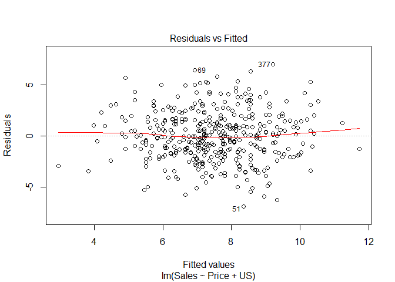
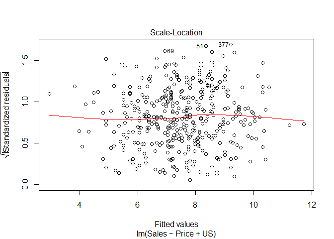
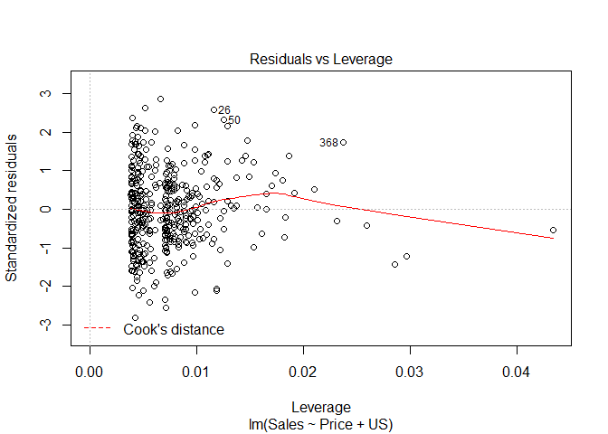
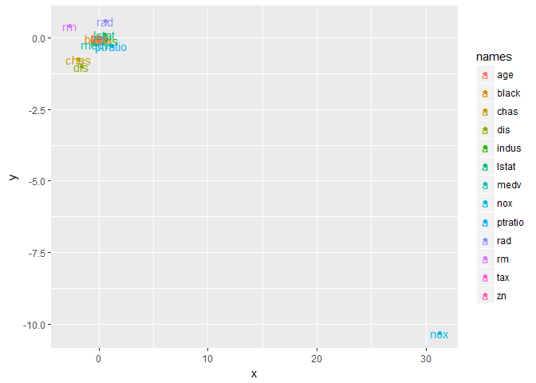

# chapter3-2
Min-Yao  
2017年12月12日  


```r
library(MASS)
library(ISLR)
```


# Multiple Linear Regression


```r
lm.fit=lm(medv~lstat+age,data=Boston)
summary(lm.fit)
```

```
## 
## Call:
## lm(formula = medv ~ lstat + age, data = Boston)
## 
## Residuals:
##     Min      1Q  Median      3Q     Max 
## -15.981  -3.978  -1.283   1.968  23.158 
## 
## Coefficients:
##             Estimate Std. Error t value Pr(>|t|)    
## (Intercept) 33.22276    0.73085  45.458  < 2e-16 ***
## lstat       -1.03207    0.04819 -21.416  < 2e-16 ***
## age          0.03454    0.01223   2.826  0.00491 ** 
## ---
## Signif. codes:  0 '***' 0.001 '**' 0.01 '*' 0.05 '.' 0.1 ' ' 1
## 
## Residual standard error: 6.173 on 503 degrees of freedom
## Multiple R-squared:  0.5513,	Adjusted R-squared:  0.5495 
## F-statistic:   309 on 2 and 503 DF,  p-value: < 2.2e-16
```

```r
lm.fit=lm(medv~.,data=Boston)
summary(lm.fit)
```

```
## 
## Call:
## lm(formula = medv ~ ., data = Boston)
## 
## Residuals:
##     Min      1Q  Median      3Q     Max 
## -15.595  -2.730  -0.518   1.777  26.199 
## 
## Coefficients:
##               Estimate Std. Error t value Pr(>|t|)    
## (Intercept)  3.646e+01  5.103e+00   7.144 3.28e-12 ***
## crim        -1.080e-01  3.286e-02  -3.287 0.001087 ** 
## zn           4.642e-02  1.373e-02   3.382 0.000778 ***
## indus        2.056e-02  6.150e-02   0.334 0.738288    
## chas         2.687e+00  8.616e-01   3.118 0.001925 ** 
## nox         -1.777e+01  3.820e+00  -4.651 4.25e-06 ***
## rm           3.810e+00  4.179e-01   9.116  < 2e-16 ***
## age          6.922e-04  1.321e-02   0.052 0.958229    
## dis         -1.476e+00  1.995e-01  -7.398 6.01e-13 ***
## rad          3.060e-01  6.635e-02   4.613 5.07e-06 ***
## tax         -1.233e-02  3.760e-03  -3.280 0.001112 ** 
## ptratio     -9.527e-01  1.308e-01  -7.283 1.31e-12 ***
## black        9.312e-03  2.686e-03   3.467 0.000573 ***
## lstat       -5.248e-01  5.072e-02 -10.347  < 2e-16 ***
## ---
## Signif. codes:  0 '***' 0.001 '**' 0.01 '*' 0.05 '.' 0.1 ' ' 1
## 
## Residual standard error: 4.745 on 492 degrees of freedom
## Multiple R-squared:  0.7406,	Adjusted R-squared:  0.7338 
## F-statistic: 108.1 on 13 and 492 DF,  p-value: < 2.2e-16
```

```r
library(car)
vif(lm.fit)
```

```
##     crim       zn    indus     chas      nox       rm      age      dis 
## 1.792192 2.298758 3.991596 1.073995 4.393720 1.933744 3.100826 3.955945 
##      rad      tax  ptratio    black    lstat 
## 7.484496 9.008554 1.799084 1.348521 2.941491
```

```r
lm.fit1=lm(medv~.-age,data=Boston)
summary(lm.fit1)
```

```
## 
## Call:
## lm(formula = medv ~ . - age, data = Boston)
## 
## Residuals:
##      Min       1Q   Median       3Q      Max 
## -15.6054  -2.7313  -0.5188   1.7601  26.2243 
## 
## Coefficients:
##               Estimate Std. Error t value Pr(>|t|)    
## (Intercept)  36.436927   5.080119   7.172 2.72e-12 ***
## crim         -0.108006   0.032832  -3.290 0.001075 ** 
## zn            0.046334   0.013613   3.404 0.000719 ***
## indus         0.020562   0.061433   0.335 0.737989    
## chas          2.689026   0.859598   3.128 0.001863 ** 
## nox         -17.713540   3.679308  -4.814 1.97e-06 ***
## rm            3.814394   0.408480   9.338  < 2e-16 ***
## dis          -1.478612   0.190611  -7.757 5.03e-14 ***
## rad           0.305786   0.066089   4.627 4.75e-06 ***
## tax          -0.012329   0.003755  -3.283 0.001099 ** 
## ptratio      -0.952211   0.130294  -7.308 1.10e-12 ***
## black         0.009321   0.002678   3.481 0.000544 ***
## lstat        -0.523852   0.047625 -10.999  < 2e-16 ***
## ---
## Signif. codes:  0 '***' 0.001 '**' 0.01 '*' 0.05 '.' 0.1 ' ' 1
## 
## Residual standard error: 4.74 on 493 degrees of freedom
## Multiple R-squared:  0.7406,	Adjusted R-squared:  0.7343 
## F-statistic: 117.3 on 12 and 493 DF,  p-value: < 2.2e-16
```

```r
lm.fit1=update(lm.fit, ~.-age)
```

# 1. Describe the null hypotheses to which the p-values given in Table 3.4 correspond. Explain what conclusions you can draw based on these p-values. Your explanation should be phrased in terms of sales, TV, radio, and newspaper, rather than in terms of the coefficients of the linear model.

>  the null hypothesis is 
H 0 : β 1 = β 2 = · · · = β p = 0
there is no relationship between the response and the predictors

> Intercept
the null model: a model that contains an intercept but no predictors. .
null hypothesis = no advertising -> no sales
Reject, because small p-value

> TV
for a given amount of radio and newspaper advertising, spending an additional $1,000 on TV advertising leads to an increase in sales by approximately 46 units. 
null hypothesis = add TV -> no sale changes
Reject, because small p-value

> radio
for a given amount of TV and newspaper advertising, spending an additional $1,000 on radio advertising leads to an increase in sales by approximately 189 units. 
null hypothesis = add TV -> no sale changes
Reject, because small p-value

> newspaper
for a given amount of TV and radio advertising, spending an additional $1,000 on newspaper advertising leads to an decrease in sales by approximately 1 units. 
null hypothesis = add newspaper -> no sale changes
accept, because large p-value

# 9. This question involves the use of multiple linear regression on the Auto data set.

(a) Produce a scatterplot matrix which includes all of the variables
in the data set.


```r
pairs (Auto)
```

<!-- -->


(b) Compute the matrix of correlations between the variables using
the function cor(). You will need to exclude the name variable, which is qualitative.


```r
#?cor()
summary(Auto)
```

```
##       mpg          cylinders      displacement     horsepower   
##  Min.   : 9.00   Min.   :3.000   Min.   : 68.0   Min.   : 46.0  
##  1st Qu.:17.00   1st Qu.:4.000   1st Qu.:105.0   1st Qu.: 75.0  
##  Median :22.75   Median :4.000   Median :151.0   Median : 93.5  
##  Mean   :23.45   Mean   :5.472   Mean   :194.4   Mean   :104.5  
##  3rd Qu.:29.00   3rd Qu.:8.000   3rd Qu.:275.8   3rd Qu.:126.0  
##  Max.   :46.60   Max.   :8.000   Max.   :455.0   Max.   :230.0  
##                                                                 
##      weight      acceleration        year           origin     
##  Min.   :1613   Min.   : 8.00   Min.   :70.00   Min.   :1.000  
##  1st Qu.:2225   1st Qu.:13.78   1st Qu.:73.00   1st Qu.:1.000  
##  Median :2804   Median :15.50   Median :76.00   Median :1.000  
##  Mean   :2978   Mean   :15.54   Mean   :75.98   Mean   :1.577  
##  3rd Qu.:3615   3rd Qu.:17.02   3rd Qu.:79.00   3rd Qu.:2.000  
##  Max.   :5140   Max.   :24.80   Max.   :82.00   Max.   :3.000  
##                                                                
##                  name    
##  amc matador       :  5  
##  ford pinto        :  5  
##  toyota corolla    :  5  
##  amc gremlin       :  4  
##  amc hornet        :  4  
##  chevrolet chevette:  4  
##  (Other)           :365
```

```r
str(Auto)
```

```
## 'data.frame':	392 obs. of  9 variables:
##  $ mpg         : num  18 15 18 16 17 15 14 14 14 15 ...
##  $ cylinders   : num  8 8 8 8 8 8 8 8 8 8 ...
##  $ displacement: num  307 350 318 304 302 429 454 440 455 390 ...
##  $ horsepower  : num  130 165 150 150 140 198 220 215 225 190 ...
##  $ weight      : num  3504 3693 3436 3433 3449 ...
##  $ acceleration: num  12 11.5 11 12 10.5 10 9 8.5 10 8.5 ...
##  $ year        : num  70 70 70 70 70 70 70 70 70 70 ...
##  $ origin      : num  1 1 1 1 1 1 1 1 1 1 ...
##  $ name        : Factor w/ 304 levels "amc ambassador brougham",..: 49 36 231 14 161 141 54 223 241 2 ...
```

```r
autononame<-Auto[,-9]
#autononame
#Auto

cor(autononame)
```

```
##                     mpg  cylinders displacement horsepower     weight
## mpg           1.0000000 -0.7776175   -0.8051269 -0.7784268 -0.8322442
## cylinders    -0.7776175  1.0000000    0.9508233  0.8429834  0.8975273
## displacement -0.8051269  0.9508233    1.0000000  0.8972570  0.9329944
## horsepower   -0.7784268  0.8429834    0.8972570  1.0000000  0.8645377
## weight       -0.8322442  0.8975273    0.9329944  0.8645377  1.0000000
## acceleration  0.4233285 -0.5046834   -0.5438005 -0.6891955 -0.4168392
## year          0.5805410 -0.3456474   -0.3698552 -0.4163615 -0.3091199
## origin        0.5652088 -0.5689316   -0.6145351 -0.4551715 -0.5850054
##              acceleration       year     origin
## mpg             0.4233285  0.5805410  0.5652088
## cylinders      -0.5046834 -0.3456474 -0.5689316
## displacement   -0.5438005 -0.3698552 -0.6145351
## horsepower     -0.6891955 -0.4163615 -0.4551715
## weight         -0.4168392 -0.3091199 -0.5850054
## acceleration    1.0000000  0.2903161  0.2127458
## year            0.2903161  1.0000000  0.1815277
## origin          0.2127458  0.1815277  1.0000000
```


(c) Use the lm() function to perform a multiple linear regression
with mpg as the response and all other variables except name as
the predictors. Use the summary() function to print the results.
Comment on the output. For instance:


```r
lm.fit.auto=lm(mpg~.-name,data=Auto)
summary(lm.fit.auto)
```

```
## 
## Call:
## lm(formula = mpg ~ . - name, data = Auto)
## 
## Residuals:
##     Min      1Q  Median      3Q     Max 
## -9.5903 -2.1565 -0.1169  1.8690 13.0604 
## 
## Coefficients:
##                Estimate Std. Error t value Pr(>|t|)    
## (Intercept)  -17.218435   4.644294  -3.707  0.00024 ***
## cylinders     -0.493376   0.323282  -1.526  0.12780    
## displacement   0.019896   0.007515   2.647  0.00844 ** 
## horsepower    -0.016951   0.013787  -1.230  0.21963    
## weight        -0.006474   0.000652  -9.929  < 2e-16 ***
## acceleration   0.080576   0.098845   0.815  0.41548    
## year           0.750773   0.050973  14.729  < 2e-16 ***
## origin         1.426141   0.278136   5.127 4.67e-07 ***
## ---
## Signif. codes:  0 '***' 0.001 '**' 0.01 '*' 0.05 '.' 0.1 ' ' 1
## 
## Residual standard error: 3.328 on 384 degrees of freedom
## Multiple R-squared:  0.8215,	Adjusted R-squared:  0.8182 
## F-statistic: 252.4 on 7 and 384 DF,  p-value: < 2.2e-16
```


i. Is there a relationship between the predictors and the re-
sponse?

> Yes, because p-value: < 2.2e-16

ii. Which predictors appear to have a statistically significant
relationship to the response?

> displacement, because p-value: 0.00844
> weight, because p-value: < 2e-16
> year, because p-value: < 2e-16
> origin, because p-value: 4.67e-07


iii. What does the coefficient for the year variable suggest?

> for a given amount of other predictors, adding one year leads to an increase in mpg by approximately 0.75 units.

# 10. This question should be answered using the Carseats data set.
(a) Fit a multiple regression model to predict Sales using Price,
Urban, and US.


```r
#Carseats
summary(Carseats)
```

```
##      Sales          CompPrice       Income        Advertising    
##  Min.   : 0.000   Min.   : 77   Min.   : 21.00   Min.   : 0.000  
##  1st Qu.: 5.390   1st Qu.:115   1st Qu.: 42.75   1st Qu.: 0.000  
##  Median : 7.490   Median :125   Median : 69.00   Median : 5.000  
##  Mean   : 7.496   Mean   :125   Mean   : 68.66   Mean   : 6.635  
##  3rd Qu.: 9.320   3rd Qu.:135   3rd Qu.: 91.00   3rd Qu.:12.000  
##  Max.   :16.270   Max.   :175   Max.   :120.00   Max.   :29.000  
##    Population        Price        ShelveLoc        Age       
##  Min.   : 10.0   Min.   : 24.0   Bad   : 96   Min.   :25.00  
##  1st Qu.:139.0   1st Qu.:100.0   Good  : 85   1st Qu.:39.75  
##  Median :272.0   Median :117.0   Medium:219   Median :54.50  
##  Mean   :264.8   Mean   :115.8                Mean   :53.32  
##  3rd Qu.:398.5   3rd Qu.:131.0                3rd Qu.:66.00  
##  Max.   :509.0   Max.   :191.0                Max.   :80.00  
##    Education    Urban       US     
##  Min.   :10.0   No :118   No :142  
##  1st Qu.:12.0   Yes:282   Yes:258  
##  Median :14.0                      
##  Mean   :13.9                      
##  3rd Qu.:16.0                      
##  Max.   :18.0
```

```r
lm.fit.Carseats=lm(Sales~Price+Urban+US,data=Carseats)
summary(lm.fit.Carseats)
```

```
## 
## Call:
## lm(formula = Sales ~ Price + Urban + US, data = Carseats)
## 
## Residuals:
##     Min      1Q  Median      3Q     Max 
## -6.9206 -1.6220 -0.0564  1.5786  7.0581 
## 
## Coefficients:
##              Estimate Std. Error t value Pr(>|t|)    
## (Intercept) 13.043469   0.651012  20.036  < 2e-16 ***
## Price       -0.054459   0.005242 -10.389  < 2e-16 ***
## UrbanYes    -0.021916   0.271650  -0.081    0.936    
## USYes        1.200573   0.259042   4.635 4.86e-06 ***
## ---
## Signif. codes:  0 '***' 0.001 '**' 0.01 '*' 0.05 '.' 0.1 ' ' 1
## 
## Residual standard error: 2.472 on 396 degrees of freedom
## Multiple R-squared:  0.2393,	Adjusted R-squared:  0.2335 
## F-statistic: 41.52 on 3 and 396 DF,  p-value: < 2.2e-16
```

```r
#?Carseats
```


(b) Provide an interpretation of each coefficient in the model. Be
careful—some of the variables in the model are qualitative!

> Intercept: the null model: a model that contains an intercept but no predictors. 
null hypothesis = no predictors -> no sales
Reject, because small p-value
*Intercept is different from 0 or not

> Price(Price company charges for car seats at each site)
For a given amount of other predictors, increasing one unit of Price leads to an decrease in Sales by approximately 54 units.

> Urban(A factor with levels No and Yes to indicate whether the store is in an urban or rural location)
For a given amount of other predictors, whether the store is in an urban or rural location doesn't affect sales.

> US(A factor with levels No and Yes to indicate whether the store is in the US or not)
For a given amount of other predictors, whether the store is in the US or not affect sales. If the store is in the US, Sales increases 1200 units.

(c) Write out the model in equation form, being careful to handle
the qualitative variables properly.

> Sales = β 0 + β 1 Price + β 2 Urban + β 3 US + E.

> Sales = 13.04 -0.05 Price -0.02 Urban + 1.20 US + E.

(d) For which of the predictors can you reject the null hypothesis
H 0 : β j = 0?

> Intercept, p value:< 2e-16

> Price, p value:< 2e-16

> USYes, p value:4.86e-06

(e) On the basis of your response to the previous question, fit a
smaller model that only uses the predictors for which there is
evidence of association with the outcome.


```r
lm.fit.Carseats.new <- update(lm.fit.Carseats, ~ . - Urban)
summary(lm.fit.Carseats.new)
```

```
## 
## Call:
## lm(formula = Sales ~ Price + US, data = Carseats)
## 
## Residuals:
##     Min      1Q  Median      3Q     Max 
## -6.9269 -1.6286 -0.0574  1.5766  7.0515 
## 
## Coefficients:
##             Estimate Std. Error t value Pr(>|t|)    
## (Intercept) 13.03079    0.63098  20.652  < 2e-16 ***
## Price       -0.05448    0.00523 -10.416  < 2e-16 ***
## USYes        1.19964    0.25846   4.641 4.71e-06 ***
## ---
## Signif. codes:  0 '***' 0.001 '**' 0.01 '*' 0.05 '.' 0.1 ' ' 1
## 
## Residual standard error: 2.469 on 397 degrees of freedom
## Multiple R-squared:  0.2393,	Adjusted R-squared:  0.2354 
## F-statistic: 62.43 on 2 and 397 DF,  p-value: < 2.2e-16
```


(f) How well do the models in (a) and (e) fit the data?

> (a) Adjusted R-squared:  0.2335
> (e) Adjusted R-squared:  0.2354

(g) Using the model from (e), obtain 95 % confidence intervals for
the coefficient(s).


```r
confint(lm.fit.Carseats.new)
```

```
##                   2.5 %      97.5 %
## (Intercept) 11.79032020 14.27126531
## Price       -0.06475984 -0.04419543
## USYes        0.69151957  1.70776632
```


(h) Is there evidence of outliers or high leverage observations in the
model from (e)?

> outliers are observations for which the response y i is unusual given the predictor x i . In contrast, observations with high leverage have an unusual value for x i . 


```r
plot(lm.fit.Carseats.new)
```

<!-- --><!-- --><!-- --><!-- -->


# 15. This problem involves the Boston data set, which we saw in the lab for this chapter. We will now try to predict per capita crime rate using the other variables in this data set. In other words, per capita crime rate is the response, and the other variables are the predictors.

(a) For each predictor, fit a simple linear regression model to predict
the response. Describe your results. In which of the models is
there a statistically significant association between the predictor
and the response? Create some plots to back up your assertions.


```r
library(MASS)
summary(Boston)
```

```
##       crim                zn             indus            chas        
##  Min.   : 0.00632   Min.   :  0.00   Min.   : 0.46   Min.   :0.00000  
##  1st Qu.: 0.08204   1st Qu.:  0.00   1st Qu.: 5.19   1st Qu.:0.00000  
##  Median : 0.25651   Median :  0.00   Median : 9.69   Median :0.00000  
##  Mean   : 3.61352   Mean   : 11.36   Mean   :11.14   Mean   :0.06917  
##  3rd Qu.: 3.67708   3rd Qu.: 12.50   3rd Qu.:18.10   3rd Qu.:0.00000  
##  Max.   :88.97620   Max.   :100.00   Max.   :27.74   Max.   :1.00000  
##       nox               rm             age              dis        
##  Min.   :0.3850   Min.   :3.561   Min.   :  2.90   Min.   : 1.130  
##  1st Qu.:0.4490   1st Qu.:5.886   1st Qu.: 45.02   1st Qu.: 2.100  
##  Median :0.5380   Median :6.208   Median : 77.50   Median : 3.207  
##  Mean   :0.5547   Mean   :6.285   Mean   : 68.57   Mean   : 3.795  
##  3rd Qu.:0.6240   3rd Qu.:6.623   3rd Qu.: 94.08   3rd Qu.: 5.188  
##  Max.   :0.8710   Max.   :8.780   Max.   :100.00   Max.   :12.127  
##       rad              tax           ptratio          black       
##  Min.   : 1.000   Min.   :187.0   Min.   :12.60   Min.   :  0.32  
##  1st Qu.: 4.000   1st Qu.:279.0   1st Qu.:17.40   1st Qu.:375.38  
##  Median : 5.000   Median :330.0   Median :19.05   Median :391.44  
##  Mean   : 9.549   Mean   :408.2   Mean   :18.46   Mean   :356.67  
##  3rd Qu.:24.000   3rd Qu.:666.0   3rd Qu.:20.20   3rd Qu.:396.23  
##  Max.   :24.000   Max.   :711.0   Max.   :22.00   Max.   :396.90  
##      lstat            medv      
##  Min.   : 1.73   Min.   : 5.00  
##  1st Qu.: 6.95   1st Qu.:17.02  
##  Median :11.36   Median :21.20  
##  Mean   :12.65   Mean   :22.53  
##  3rd Qu.:16.95   3rd Qu.:25.00  
##  Max.   :37.97   Max.   :50.00
```

```r
names(Boston)
```

```
##  [1] "crim"    "zn"      "indus"   "chas"    "nox"     "rm"      "age"    
##  [8] "dis"     "rad"     "tax"     "ptratio" "black"   "lstat"   "medv"
```

```r
#?Boston
```

> faster method from last week


```r
library(psych)
```

```
## 
## Attaching package: 'psych'
```

```
## The following object is masked from 'package:car':
## 
##     logit
```

```r
library(tidyverse)
```

```
## -- Attaching packages ------------------------------------- tidyverse 1.2.1 --
```

```
## √ ggplot2 2.2.1     √ purrr   0.2.4
## √ tibble  1.3.4     √ dplyr   0.7.4
## √ tidyr   0.7.2     √ stringr 1.2.0
## √ readr   1.1.1     √ forcats 0.2.0
```

```
## -- Conflicts ---------------------------------------- tidyverse_conflicts() --
## x ggplot2::%+%()   masks psych::%+%()
## x ggplot2::alpha() masks psych::alpha()
## x dplyr::filter()  masks stats::filter()
## x dplyr::lag()     masks stats::lag()
## x dplyr::recode()  masks car::recode()
## x dplyr::select()  masks MASS::select()
## x purrr::some()    masks car::some()
```

```r
data(Boston)
boston <- as_tibble(Boston)
boston
```

```
## # A tibble: 506 x 14
##       crim    zn indus  chas   nox    rm   age    dis   rad   tax ptratio
##  *   <dbl> <dbl> <dbl> <int> <dbl> <dbl> <dbl>  <dbl> <int> <dbl>   <dbl>
##  1 0.00632  18.0  2.31     0 0.538 6.575  65.2 4.0900     1   296    15.3
##  2 0.02731   0.0  7.07     0 0.469 6.421  78.9 4.9671     2   242    17.8
##  3 0.02729   0.0  7.07     0 0.469 7.185  61.1 4.9671     2   242    17.8
##  4 0.03237   0.0  2.18     0 0.458 6.998  45.8 6.0622     3   222    18.7
##  5 0.06905   0.0  2.18     0 0.458 7.147  54.2 6.0622     3   222    18.7
##  6 0.02985   0.0  2.18     0 0.458 6.430  58.7 6.0622     3   222    18.7
##  7 0.08829  12.5  7.87     0 0.524 6.012  66.6 5.5605     5   311    15.2
##  8 0.14455  12.5  7.87     0 0.524 6.172  96.1 5.9505     5   311    15.2
##  9 0.21124  12.5  7.87     0 0.524 5.631 100.0 6.0821     5   311    15.2
## 10 0.17004  12.5  7.87     0 0.524 6.004  85.9 6.5921     5   311    15.2
## # ... with 496 more rows, and 3 more variables: black <dbl>, lstat <dbl>,
## #   medv <dbl>
```

```r
predictors <- colnames(boston)[-1]
lmfits <- map(predictors,function(x) lm(crim ~ get(x), data=boston))
lmsummaries <- lapply(lmfits,summary)
names(lmsummaries) <- predictors
lmsummaries
```

```
## $zn
## 
## Call:
## lm(formula = crim ~ get(x), data = boston)
## 
## Residuals:
##    Min     1Q Median     3Q    Max 
## -4.429 -4.222 -2.620  1.250 84.523 
## 
## Coefficients:
##             Estimate Std. Error t value Pr(>|t|)    
## (Intercept)  4.45369    0.41722  10.675  < 2e-16 ***
## get(x)      -0.07393    0.01609  -4.594 5.51e-06 ***
## ---
## Signif. codes:  0 '***' 0.001 '**' 0.01 '*' 0.05 '.' 0.1 ' ' 1
## 
## Residual standard error: 8.435 on 504 degrees of freedom
## Multiple R-squared:  0.04019,	Adjusted R-squared:  0.03828 
## F-statistic:  21.1 on 1 and 504 DF,  p-value: 5.506e-06
## 
## 
## $indus
## 
## Call:
## lm(formula = crim ~ get(x), data = boston)
## 
## Residuals:
##     Min      1Q  Median      3Q     Max 
## -11.972  -2.698  -0.736   0.712  81.813 
## 
## Coefficients:
##             Estimate Std. Error t value Pr(>|t|)    
## (Intercept) -2.06374    0.66723  -3.093  0.00209 ** 
## get(x)       0.50978    0.05102   9.991  < 2e-16 ***
## ---
## Signif. codes:  0 '***' 0.001 '**' 0.01 '*' 0.05 '.' 0.1 ' ' 1
## 
## Residual standard error: 7.866 on 504 degrees of freedom
## Multiple R-squared:  0.1653,	Adjusted R-squared:  0.1637 
## F-statistic: 99.82 on 1 and 504 DF,  p-value: < 2.2e-16
## 
## 
## $chas
## 
## Call:
## lm(formula = crim ~ get(x), data = boston)
## 
## Residuals:
##    Min     1Q Median     3Q    Max 
## -3.738 -3.661 -3.435  0.018 85.232 
## 
## Coefficients:
##             Estimate Std. Error t value Pr(>|t|)    
## (Intercept)   3.7444     0.3961   9.453   <2e-16 ***
## get(x)       -1.8928     1.5061  -1.257    0.209    
## ---
## Signif. codes:  0 '***' 0.001 '**' 0.01 '*' 0.05 '.' 0.1 ' ' 1
## 
## Residual standard error: 8.597 on 504 degrees of freedom
## Multiple R-squared:  0.003124,	Adjusted R-squared:  0.001146 
## F-statistic: 1.579 on 1 and 504 DF,  p-value: 0.2094
## 
## 
## $nox
## 
## Call:
## lm(formula = crim ~ get(x), data = boston)
## 
## Residuals:
##     Min      1Q  Median      3Q     Max 
## -12.371  -2.738  -0.974   0.559  81.728 
## 
## Coefficients:
##             Estimate Std. Error t value Pr(>|t|)    
## (Intercept)  -13.720      1.699  -8.073 5.08e-15 ***
## get(x)        31.249      2.999  10.419  < 2e-16 ***
## ---
## Signif. codes:  0 '***' 0.001 '**' 0.01 '*' 0.05 '.' 0.1 ' ' 1
## 
## Residual standard error: 7.81 on 504 degrees of freedom
## Multiple R-squared:  0.1772,	Adjusted R-squared:  0.1756 
## F-statistic: 108.6 on 1 and 504 DF,  p-value: < 2.2e-16
## 
## 
## $rm
## 
## Call:
## lm(formula = crim ~ get(x), data = boston)
## 
## Residuals:
##    Min     1Q Median     3Q    Max 
## -6.604 -3.952 -2.654  0.989 87.197 
## 
## Coefficients:
##             Estimate Std. Error t value Pr(>|t|)    
## (Intercept)   20.482      3.365   6.088 2.27e-09 ***
## get(x)        -2.684      0.532  -5.045 6.35e-07 ***
## ---
## Signif. codes:  0 '***' 0.001 '**' 0.01 '*' 0.05 '.' 0.1 ' ' 1
## 
## Residual standard error: 8.401 on 504 degrees of freedom
## Multiple R-squared:  0.04807,	Adjusted R-squared:  0.04618 
## F-statistic: 25.45 on 1 and 504 DF,  p-value: 6.347e-07
## 
## 
## $age
## 
## Call:
## lm(formula = crim ~ get(x), data = boston)
## 
## Residuals:
##    Min     1Q Median     3Q    Max 
## -6.789 -4.257 -1.230  1.527 82.849 
## 
## Coefficients:
##             Estimate Std. Error t value Pr(>|t|)    
## (Intercept) -3.77791    0.94398  -4.002 7.22e-05 ***
## get(x)       0.10779    0.01274   8.463 2.85e-16 ***
## ---
## Signif. codes:  0 '***' 0.001 '**' 0.01 '*' 0.05 '.' 0.1 ' ' 1
## 
## Residual standard error: 8.057 on 504 degrees of freedom
## Multiple R-squared:  0.1244,	Adjusted R-squared:  0.1227 
## F-statistic: 71.62 on 1 and 504 DF,  p-value: 2.855e-16
## 
## 
## $dis
## 
## Call:
## lm(formula = crim ~ get(x), data = boston)
## 
## Residuals:
##    Min     1Q Median     3Q    Max 
## -6.708 -4.134 -1.527  1.516 81.674 
## 
## Coefficients:
##             Estimate Std. Error t value Pr(>|t|)    
## (Intercept)   9.4993     0.7304  13.006   <2e-16 ***
## get(x)       -1.5509     0.1683  -9.213   <2e-16 ***
## ---
## Signif. codes:  0 '***' 0.001 '**' 0.01 '*' 0.05 '.' 0.1 ' ' 1
## 
## Residual standard error: 7.965 on 504 degrees of freedom
## Multiple R-squared:  0.1441,	Adjusted R-squared:  0.1425 
## F-statistic: 84.89 on 1 and 504 DF,  p-value: < 2.2e-16
## 
## 
## $rad
## 
## Call:
## lm(formula = crim ~ get(x), data = boston)
## 
## Residuals:
##     Min      1Q  Median      3Q     Max 
## -10.164  -1.381  -0.141   0.660  76.433 
## 
## Coefficients:
##             Estimate Std. Error t value Pr(>|t|)    
## (Intercept) -2.28716    0.44348  -5.157 3.61e-07 ***
## get(x)       0.61791    0.03433  17.998  < 2e-16 ***
## ---
## Signif. codes:  0 '***' 0.001 '**' 0.01 '*' 0.05 '.' 0.1 ' ' 1
## 
## Residual standard error: 6.718 on 504 degrees of freedom
## Multiple R-squared:  0.3913,	Adjusted R-squared:   0.39 
## F-statistic: 323.9 on 1 and 504 DF,  p-value: < 2.2e-16
## 
## 
## $tax
## 
## Call:
## lm(formula = crim ~ get(x), data = boston)
## 
## Residuals:
##     Min      1Q  Median      3Q     Max 
## -12.513  -2.738  -0.194   1.065  77.696 
## 
## Coefficients:
##              Estimate Std. Error t value Pr(>|t|)    
## (Intercept) -8.528369   0.815809  -10.45   <2e-16 ***
## get(x)       0.029742   0.001847   16.10   <2e-16 ***
## ---
## Signif. codes:  0 '***' 0.001 '**' 0.01 '*' 0.05 '.' 0.1 ' ' 1
## 
## Residual standard error: 6.997 on 504 degrees of freedom
## Multiple R-squared:  0.3396,	Adjusted R-squared:  0.3383 
## F-statistic: 259.2 on 1 and 504 DF,  p-value: < 2.2e-16
## 
## 
## $ptratio
## 
## Call:
## lm(formula = crim ~ get(x), data = boston)
## 
## Residuals:
##    Min     1Q Median     3Q    Max 
## -7.654 -3.985 -1.912  1.825 83.353 
## 
## Coefficients:
##             Estimate Std. Error t value Pr(>|t|)    
## (Intercept) -17.6469     3.1473  -5.607 3.40e-08 ***
## get(x)        1.1520     0.1694   6.801 2.94e-11 ***
## ---
## Signif. codes:  0 '***' 0.001 '**' 0.01 '*' 0.05 '.' 0.1 ' ' 1
## 
## Residual standard error: 8.24 on 504 degrees of freedom
## Multiple R-squared:  0.08407,	Adjusted R-squared:  0.08225 
## F-statistic: 46.26 on 1 and 504 DF,  p-value: 2.943e-11
## 
## 
## $black
## 
## Call:
## lm(formula = crim ~ get(x), data = boston)
## 
## Residuals:
##     Min      1Q  Median      3Q     Max 
## -13.756  -2.299  -2.095  -1.296  86.822 
## 
## Coefficients:
##              Estimate Std. Error t value Pr(>|t|)    
## (Intercept) 16.553529   1.425903  11.609   <2e-16 ***
## get(x)      -0.036280   0.003873  -9.367   <2e-16 ***
## ---
## Signif. codes:  0 '***' 0.001 '**' 0.01 '*' 0.05 '.' 0.1 ' ' 1
## 
## Residual standard error: 7.946 on 504 degrees of freedom
## Multiple R-squared:  0.1483,	Adjusted R-squared:  0.1466 
## F-statistic: 87.74 on 1 and 504 DF,  p-value: < 2.2e-16
## 
## 
## $lstat
## 
## Call:
## lm(formula = crim ~ get(x), data = boston)
## 
## Residuals:
##     Min      1Q  Median      3Q     Max 
## -13.925  -2.822  -0.664   1.079  82.862 
## 
## Coefficients:
##             Estimate Std. Error t value Pr(>|t|)    
## (Intercept) -3.33054    0.69376  -4.801 2.09e-06 ***
## get(x)       0.54880    0.04776  11.491  < 2e-16 ***
## ---
## Signif. codes:  0 '***' 0.001 '**' 0.01 '*' 0.05 '.' 0.1 ' ' 1
## 
## Residual standard error: 7.664 on 504 degrees of freedom
## Multiple R-squared:  0.2076,	Adjusted R-squared:  0.206 
## F-statistic:   132 on 1 and 504 DF,  p-value: < 2.2e-16
## 
## 
## $medv
## 
## Call:
## lm(formula = crim ~ get(x), data = boston)
## 
## Residuals:
##    Min     1Q Median     3Q    Max 
## -9.071 -4.022 -2.343  1.298 80.957 
## 
## Coefficients:
##             Estimate Std. Error t value Pr(>|t|)    
## (Intercept) 11.79654    0.93419   12.63   <2e-16 ***
## get(x)      -0.36316    0.03839   -9.46   <2e-16 ***
## ---
## Signif. codes:  0 '***' 0.001 '**' 0.01 '*' 0.05 '.' 0.1 ' ' 1
## 
## Residual standard error: 7.934 on 504 degrees of freedom
## Multiple R-squared:  0.1508,	Adjusted R-squared:  0.1491 
## F-statistic: 89.49 on 1 and 504 DF,  p-value: < 2.2e-16
```

> slow method


```r
attach(Boston)
lm.fit.zn=lm(crim~zn)
summary(lm.fit.zn)
```

```
## 
## Call:
## lm(formula = crim ~ zn)
## 
## Residuals:
##    Min     1Q Median     3Q    Max 
## -4.429 -4.222 -2.620  1.250 84.523 
## 
## Coefficients:
##             Estimate Std. Error t value Pr(>|t|)    
## (Intercept)  4.45369    0.41722  10.675  < 2e-16 ***
## zn          -0.07393    0.01609  -4.594 5.51e-06 ***
## ---
## Signif. codes:  0 '***' 0.001 '**' 0.01 '*' 0.05 '.' 0.1 ' ' 1
## 
## Residual standard error: 8.435 on 504 degrees of freedom
## Multiple R-squared:  0.04019,	Adjusted R-squared:  0.03828 
## F-statistic:  21.1 on 1 and 504 DF,  p-value: 5.506e-06
```

```r
lm.fit.indus=lm(crim~indus)
summary(lm.fit.indus)
```

```
## 
## Call:
## lm(formula = crim ~ indus)
## 
## Residuals:
##     Min      1Q  Median      3Q     Max 
## -11.972  -2.698  -0.736   0.712  81.813 
## 
## Coefficients:
##             Estimate Std. Error t value Pr(>|t|)    
## (Intercept) -2.06374    0.66723  -3.093  0.00209 ** 
## indus        0.50978    0.05102   9.991  < 2e-16 ***
## ---
## Signif. codes:  0 '***' 0.001 '**' 0.01 '*' 0.05 '.' 0.1 ' ' 1
## 
## Residual standard error: 7.866 on 504 degrees of freedom
## Multiple R-squared:  0.1653,	Adjusted R-squared:  0.1637 
## F-statistic: 99.82 on 1 and 504 DF,  p-value: < 2.2e-16
```

```r
lm.fit.chas=lm(crim~chas)
summary(lm.fit.chas)
```

```
## 
## Call:
## lm(formula = crim ~ chas)
## 
## Residuals:
##    Min     1Q Median     3Q    Max 
## -3.738 -3.661 -3.435  0.018 85.232 
## 
## Coefficients:
##             Estimate Std. Error t value Pr(>|t|)    
## (Intercept)   3.7444     0.3961   9.453   <2e-16 ***
## chas         -1.8928     1.5061  -1.257    0.209    
## ---
## Signif. codes:  0 '***' 0.001 '**' 0.01 '*' 0.05 '.' 0.1 ' ' 1
## 
## Residual standard error: 8.597 on 504 degrees of freedom
## Multiple R-squared:  0.003124,	Adjusted R-squared:  0.001146 
## F-statistic: 1.579 on 1 and 504 DF,  p-value: 0.2094
```

```r
lm.fit.nox=lm(crim~nox)
summary(lm.fit.nox)
```

```
## 
## Call:
## lm(formula = crim ~ nox)
## 
## Residuals:
##     Min      1Q  Median      3Q     Max 
## -12.371  -2.738  -0.974   0.559  81.728 
## 
## Coefficients:
##             Estimate Std. Error t value Pr(>|t|)    
## (Intercept)  -13.720      1.699  -8.073 5.08e-15 ***
## nox           31.249      2.999  10.419  < 2e-16 ***
## ---
## Signif. codes:  0 '***' 0.001 '**' 0.01 '*' 0.05 '.' 0.1 ' ' 1
## 
## Residual standard error: 7.81 on 504 degrees of freedom
## Multiple R-squared:  0.1772,	Adjusted R-squared:  0.1756 
## F-statistic: 108.6 on 1 and 504 DF,  p-value: < 2.2e-16
```

```r
lm.fit.rm=lm(crim~rm)
summary(lm.fit.rm)
```

```
## 
## Call:
## lm(formula = crim ~ rm)
## 
## Residuals:
##    Min     1Q Median     3Q    Max 
## -6.604 -3.952 -2.654  0.989 87.197 
## 
## Coefficients:
##             Estimate Std. Error t value Pr(>|t|)    
## (Intercept)   20.482      3.365   6.088 2.27e-09 ***
## rm            -2.684      0.532  -5.045 6.35e-07 ***
## ---
## Signif. codes:  0 '***' 0.001 '**' 0.01 '*' 0.05 '.' 0.1 ' ' 1
## 
## Residual standard error: 8.401 on 504 degrees of freedom
## Multiple R-squared:  0.04807,	Adjusted R-squared:  0.04618 
## F-statistic: 25.45 on 1 and 504 DF,  p-value: 6.347e-07
```

```r
lm.fit.age=lm(crim~age)
summary(lm.fit.age)
```

```
## 
## Call:
## lm(formula = crim ~ age)
## 
## Residuals:
##    Min     1Q Median     3Q    Max 
## -6.789 -4.257 -1.230  1.527 82.849 
## 
## Coefficients:
##             Estimate Std. Error t value Pr(>|t|)    
## (Intercept) -3.77791    0.94398  -4.002 7.22e-05 ***
## age          0.10779    0.01274   8.463 2.85e-16 ***
## ---
## Signif. codes:  0 '***' 0.001 '**' 0.01 '*' 0.05 '.' 0.1 ' ' 1
## 
## Residual standard error: 8.057 on 504 degrees of freedom
## Multiple R-squared:  0.1244,	Adjusted R-squared:  0.1227 
## F-statistic: 71.62 on 1 and 504 DF,  p-value: 2.855e-16
```

```r
lm.fit.dis=lm(crim~dis)
summary(lm.fit.dis)
```

```
## 
## Call:
## lm(formula = crim ~ dis)
## 
## Residuals:
##    Min     1Q Median     3Q    Max 
## -6.708 -4.134 -1.527  1.516 81.674 
## 
## Coefficients:
##             Estimate Std. Error t value Pr(>|t|)    
## (Intercept)   9.4993     0.7304  13.006   <2e-16 ***
## dis          -1.5509     0.1683  -9.213   <2e-16 ***
## ---
## Signif. codes:  0 '***' 0.001 '**' 0.01 '*' 0.05 '.' 0.1 ' ' 1
## 
## Residual standard error: 7.965 on 504 degrees of freedom
## Multiple R-squared:  0.1441,	Adjusted R-squared:  0.1425 
## F-statistic: 84.89 on 1 and 504 DF,  p-value: < 2.2e-16
```

```r
lm.fit.rad=lm(crim~rad)
summary(lm.fit.rad)
```

```
## 
## Call:
## lm(formula = crim ~ rad)
## 
## Residuals:
##     Min      1Q  Median      3Q     Max 
## -10.164  -1.381  -0.141   0.660  76.433 
## 
## Coefficients:
##             Estimate Std. Error t value Pr(>|t|)    
## (Intercept) -2.28716    0.44348  -5.157 3.61e-07 ***
## rad          0.61791    0.03433  17.998  < 2e-16 ***
## ---
## Signif. codes:  0 '***' 0.001 '**' 0.01 '*' 0.05 '.' 0.1 ' ' 1
## 
## Residual standard error: 6.718 on 504 degrees of freedom
## Multiple R-squared:  0.3913,	Adjusted R-squared:   0.39 
## F-statistic: 323.9 on 1 and 504 DF,  p-value: < 2.2e-16
```

```r
lm.fit.tax=lm(crim~tax)
summary(lm.fit.tax)
```

```
## 
## Call:
## lm(formula = crim ~ tax)
## 
## Residuals:
##     Min      1Q  Median      3Q     Max 
## -12.513  -2.738  -0.194   1.065  77.696 
## 
## Coefficients:
##              Estimate Std. Error t value Pr(>|t|)    
## (Intercept) -8.528369   0.815809  -10.45   <2e-16 ***
## tax          0.029742   0.001847   16.10   <2e-16 ***
## ---
## Signif. codes:  0 '***' 0.001 '**' 0.01 '*' 0.05 '.' 0.1 ' ' 1
## 
## Residual standard error: 6.997 on 504 degrees of freedom
## Multiple R-squared:  0.3396,	Adjusted R-squared:  0.3383 
## F-statistic: 259.2 on 1 and 504 DF,  p-value: < 2.2e-16
```

```r
lm.fit.ptratio=lm(crim~ptratio)
summary(lm.fit.ptratio)
```

```
## 
## Call:
## lm(formula = crim ~ ptratio)
## 
## Residuals:
##    Min     1Q Median     3Q    Max 
## -7.654 -3.985 -1.912  1.825 83.353 
## 
## Coefficients:
##             Estimate Std. Error t value Pr(>|t|)    
## (Intercept) -17.6469     3.1473  -5.607 3.40e-08 ***
## ptratio       1.1520     0.1694   6.801 2.94e-11 ***
## ---
## Signif. codes:  0 '***' 0.001 '**' 0.01 '*' 0.05 '.' 0.1 ' ' 1
## 
## Residual standard error: 8.24 on 504 degrees of freedom
## Multiple R-squared:  0.08407,	Adjusted R-squared:  0.08225 
## F-statistic: 46.26 on 1 and 504 DF,  p-value: 2.943e-11
```

```r
lm.fit.black=lm(crim~black)
summary(lm.fit.black)
```

```
## 
## Call:
## lm(formula = crim ~ black)
## 
## Residuals:
##     Min      1Q  Median      3Q     Max 
## -13.756  -2.299  -2.095  -1.296  86.822 
## 
## Coefficients:
##              Estimate Std. Error t value Pr(>|t|)    
## (Intercept) 16.553529   1.425903  11.609   <2e-16 ***
## black       -0.036280   0.003873  -9.367   <2e-16 ***
## ---
## Signif. codes:  0 '***' 0.001 '**' 0.01 '*' 0.05 '.' 0.1 ' ' 1
## 
## Residual standard error: 7.946 on 504 degrees of freedom
## Multiple R-squared:  0.1483,	Adjusted R-squared:  0.1466 
## F-statistic: 87.74 on 1 and 504 DF,  p-value: < 2.2e-16
```

```r
lm.fit.lstat=lm(crim~lstat)
summary(lm.fit.lstat)
```

```
## 
## Call:
## lm(formula = crim ~ lstat)
## 
## Residuals:
##     Min      1Q  Median      3Q     Max 
## -13.925  -2.822  -0.664   1.079  82.862 
## 
## Coefficients:
##             Estimate Std. Error t value Pr(>|t|)    
## (Intercept) -3.33054    0.69376  -4.801 2.09e-06 ***
## lstat        0.54880    0.04776  11.491  < 2e-16 ***
## ---
## Signif. codes:  0 '***' 0.001 '**' 0.01 '*' 0.05 '.' 0.1 ' ' 1
## 
## Residual standard error: 7.664 on 504 degrees of freedom
## Multiple R-squared:  0.2076,	Adjusted R-squared:  0.206 
## F-statistic:   132 on 1 and 504 DF,  p-value: < 2.2e-16
```

```r
lm.fit.medv=lm(crim~medv)
summary(lm.fit.medv)
```

```
## 
## Call:
## lm(formula = crim ~ medv)
## 
## Residuals:
##    Min     1Q Median     3Q    Max 
## -9.071 -4.022 -2.343  1.298 80.957 
## 
## Coefficients:
##             Estimate Std. Error t value Pr(>|t|)    
## (Intercept) 11.79654    0.93419   12.63   <2e-16 ***
## medv        -0.36316    0.03839   -9.46   <2e-16 ***
## ---
## Signif. codes:  0 '***' 0.001 '**' 0.01 '*' 0.05 '.' 0.1 ' ' 1
## 
## Residual standard error: 7.934 on 504 degrees of freedom
## Multiple R-squared:  0.1508,	Adjusted R-squared:  0.1491 
## F-statistic: 89.49 on 1 and 504 DF,  p-value: < 2.2e-16
```


(b) Fit a multiple regression model to predict the response using
all of the predictors. Describe your results. For which predictors
can we reject the null hypothesis H 0 : β j = 0?


```r
summary(Boston)
```

```
##       crim                zn             indus            chas        
##  Min.   : 0.00632   Min.   :  0.00   Min.   : 0.46   Min.   :0.00000  
##  1st Qu.: 0.08204   1st Qu.:  0.00   1st Qu.: 5.19   1st Qu.:0.00000  
##  Median : 0.25651   Median :  0.00   Median : 9.69   Median :0.00000  
##  Mean   : 3.61352   Mean   : 11.36   Mean   :11.14   Mean   :0.06917  
##  3rd Qu.: 3.67708   3rd Qu.: 12.50   3rd Qu.:18.10   3rd Qu.:0.00000  
##  Max.   :88.97620   Max.   :100.00   Max.   :27.74   Max.   :1.00000  
##       nox               rm             age              dis        
##  Min.   :0.3850   Min.   :3.561   Min.   :  2.90   Min.   : 1.130  
##  1st Qu.:0.4490   1st Qu.:5.886   1st Qu.: 45.02   1st Qu.: 2.100  
##  Median :0.5380   Median :6.208   Median : 77.50   Median : 3.207  
##  Mean   :0.5547   Mean   :6.285   Mean   : 68.57   Mean   : 3.795  
##  3rd Qu.:0.6240   3rd Qu.:6.623   3rd Qu.: 94.08   3rd Qu.: 5.188  
##  Max.   :0.8710   Max.   :8.780   Max.   :100.00   Max.   :12.127  
##       rad              tax           ptratio          black       
##  Min.   : 1.000   Min.   :187.0   Min.   :12.60   Min.   :  0.32  
##  1st Qu.: 4.000   1st Qu.:279.0   1st Qu.:17.40   1st Qu.:375.38  
##  Median : 5.000   Median :330.0   Median :19.05   Median :391.44  
##  Mean   : 9.549   Mean   :408.2   Mean   :18.46   Mean   :356.67  
##  3rd Qu.:24.000   3rd Qu.:666.0   3rd Qu.:20.20   3rd Qu.:396.23  
##  Max.   :24.000   Max.   :711.0   Max.   :22.00   Max.   :396.90  
##      lstat            medv      
##  Min.   : 1.73   Min.   : 5.00  
##  1st Qu.: 6.95   1st Qu.:17.02  
##  Median :11.36   Median :21.20  
##  Mean   :12.65   Mean   :22.53  
##  3rd Qu.:16.95   3rd Qu.:25.00  
##  Max.   :37.97   Max.   :50.00
```

```r
lm.fit.all=lm(crim~.,data=Boston)
summary(lm.fit.all)
```

```
## 
## Call:
## lm(formula = crim ~ ., data = Boston)
## 
## Residuals:
##    Min     1Q Median     3Q    Max 
## -9.924 -2.120 -0.353  1.019 75.051 
## 
## Coefficients:
##               Estimate Std. Error t value Pr(>|t|)    
## (Intercept)  17.033228   7.234903   2.354 0.018949 *  
## zn            0.044855   0.018734   2.394 0.017025 *  
## indus        -0.063855   0.083407  -0.766 0.444294    
## chas         -0.749134   1.180147  -0.635 0.525867    
## nox         -10.313535   5.275536  -1.955 0.051152 .  
## rm            0.430131   0.612830   0.702 0.483089    
## age           0.001452   0.017925   0.081 0.935488    
## dis          -0.987176   0.281817  -3.503 0.000502 ***
## rad           0.588209   0.088049   6.680 6.46e-11 ***
## tax          -0.003780   0.005156  -0.733 0.463793    
## ptratio      -0.271081   0.186450  -1.454 0.146611    
## black        -0.007538   0.003673  -2.052 0.040702 *  
## lstat         0.126211   0.075725   1.667 0.096208 .  
## medv         -0.198887   0.060516  -3.287 0.001087 ** 
## ---
## Signif. codes:  0 '***' 0.001 '**' 0.01 '*' 0.05 '.' 0.1 ' ' 1
## 
## Residual standard error: 6.439 on 492 degrees of freedom
## Multiple R-squared:  0.454,	Adjusted R-squared:  0.4396 
## F-statistic: 31.47 on 13 and 492 DF,  p-value: < 2.2e-16
```

```r
#?Boston
```

> zn: proportion of residential land zoned for lots over 25,000 sq.ft.

> dis: weighted mean of distances to five Boston employment centres.

> rad: index of accessibility to radial highways.

> black: 1000(Bk - 0.63)^2 where Bk is the proportion of blacks by town.

> medv: median value of owner-occupied homes in \$1000s.

(c) How do your results from (a) compare to your results from (b)?
Create a plot displaying the univariate regression coefficients
from (a) on the x-axis, and the multiple regression coefficients
from (b) on the y-axis. That is, each predictor is displayed as a
single point in the plot. Its coefficient in a simple linear regres-
sion model is shown on the x-axis, and its coefficient estimate
in the multiple linear regression model is shown on the y-axis.


```r
predictors <- colnames(boston)[-1]
coefficients.single <- map(predictors,function(x) coefficients(lm(crim ~ get(x), data=boston))[2])
coefficients.single
```

```
## [[1]]
##      get(x) 
## -0.07393498 
## 
## [[2]]
##    get(x) 
## 0.5097763 
## 
## [[3]]
##    get(x) 
## -1.892777 
## 
## [[4]]
##   get(x) 
## 31.24853 
## 
## [[5]]
##    get(x) 
## -2.684051 
## 
## [[6]]
##    get(x) 
## 0.1077862 
## 
## [[7]]
##    get(x) 
## -1.550902 
## 
## [[8]]
##    get(x) 
## 0.6179109 
## 
## [[9]]
##     get(x) 
## 0.02974225 
## 
## [[10]]
##   get(x) 
## 1.151983 
## 
## [[11]]
##      get(x) 
## -0.03627964 
## 
## [[12]]
##    get(x) 
## 0.5488048 
## 
## [[13]]
##     get(x) 
## -0.3631599
```

```r
##################################

coefficients(lm.fit.zn)
```

```
## (Intercept)          zn 
##  4.45369376 -0.07393498
```

```r
coefficients(lm.fit.all)
```

```
##   (Intercept)            zn         indus          chas           nox 
##  17.033227523   0.044855215  -0.063854824  -0.749133611 -10.313534912 
##            rm           age           dis           rad           tax 
##   0.430130506   0.001451643  -0.987175726   0.588208591  -0.003780016 
##       ptratio         black         lstat          medv 
##  -0.271080558  -0.007537505   0.126211376  -0.198886821
```

```r
coefficients.a = c(coefficients(lm.fit.zn)[2],
                   coefficients(lm.fit.indus)[2],
                   coefficients(lm.fit.chas)[2],
                   coefficients(lm.fit.nox)[2],
                   coefficients(lm.fit.rm)[2],
                   coefficients(lm.fit.age)[2],
                   coefficients(lm.fit.dis)[2],
                   coefficients(lm.fit.rad)[2],
                   coefficients(lm.fit.tax)[2],
                   coefficients(lm.fit.ptratio)[2],
                   coefficients(lm.fit.black)[2],
                   coefficients(lm.fit.lstat)[2],
                   coefficients(lm.fit.medv)[2])
coefficients.a
```

```
##          zn       indus        chas         nox          rm         age 
## -0.07393498  0.50977633 -1.89277655 31.24853120 -2.68405122  0.10778623 
##         dis         rad         tax     ptratio       black       lstat 
## -1.55090168  0.61791093  0.02974225  1.15198279 -0.03627964  0.54880478 
##        medv 
## -0.36315992
```

```r
names(coefficients.a)
```

```
##  [1] "zn"      "indus"   "chas"    "nox"     "rm"      "age"     "dis"    
##  [8] "rad"     "tax"     "ptratio" "black"   "lstat"   "medv"
```

```r
name = c(names(coefficients.a))
name
```

```
##  [1] "zn"      "indus"   "chas"    "nox"     "rm"      "age"     "dis"    
##  [8] "rad"     "tax"     "ptratio" "black"   "lstat"   "medv"
```

```r
coefficients.b = coefficients(lm.fit.all)[2:14]
coefficients.b
```

```
##            zn         indus          chas           nox            rm 
##   0.044855215  -0.063854824  -0.749133611 -10.313534912   0.430130506 
##           age           dis           rad           tax       ptratio 
##   0.001451643  -0.987175726   0.588208591  -0.003780016  -0.271080558 
##         black         lstat          medv 
##  -0.007537505   0.126211376  -0.198886821
```

```r
final.data.fram = data.frame(x=coefficients.a, y= coefficients.b, names = name)
final.data.fram
```

```
##                   x             y   names
## zn      -0.07393498   0.044855215      zn
## indus    0.50977633  -0.063854824   indus
## chas    -1.89277655  -0.749133611    chas
## nox     31.24853120 -10.313534912     nox
## rm      -2.68405122   0.430130506      rm
## age      0.10778623   0.001451643     age
## dis     -1.55090168  -0.987175726     dis
## rad      0.61791093   0.588208591     rad
## tax      0.02974225  -0.003780016     tax
## ptratio  1.15198279  -0.271080558 ptratio
## black   -0.03627964  -0.007537505   black
## lstat    0.54880478   0.126211376   lstat
## medv    -0.36315992  -0.198886821    medv
```

```r
library(ggplot2)

ggplot(final.data.fram, aes(x,y, color =names)) + 
  geom_point() + 
  geom_text(aes(label=names, color =names))
```

<!-- -->


(d) Is there evidence of non-linear association between any of the
predictors and the response? To answer this question, for each
predictor X, fit a model of the form
Y = β 0 + β 1 X + β 2 X2 + β 3 X3 + E.


> faster method based on last week's codes


```r
#library(psych)
#library(tidyverse)

#data(Boston)
#boston <- as_tibble(Boston)
head(boston)
```

```
## # A tibble: 6 x 14
##      crim    zn indus  chas   nox    rm   age    dis   rad   tax ptratio
##     <dbl> <dbl> <dbl> <int> <dbl> <dbl> <dbl>  <dbl> <int> <dbl>   <dbl>
## 1 0.00632    18  2.31     0 0.538 6.575  65.2 4.0900     1   296    15.3
## 2 0.02731     0  7.07     0 0.469 6.421  78.9 4.9671     2   242    17.8
## 3 0.02729     0  7.07     0 0.469 7.185  61.1 4.9671     2   242    17.8
## 4 0.03237     0  2.18     0 0.458 6.998  45.8 6.0622     3   222    18.7
## 5 0.06905     0  2.18     0 0.458 7.147  54.2 6.0622     3   222    18.7
## 6 0.02985     0  2.18     0 0.458 6.430  58.7 6.0622     3   222    18.7
## # ... with 3 more variables: black <dbl>, lstat <dbl>, medv <dbl>
```

```r
predictors <- colnames(boston)[-1]
predictors
```

```
##  [1] "zn"      "indus"   "chas"    "nox"     "rm"      "age"     "dis"    
##  [8] "rad"     "tax"     "ptratio" "black"   "lstat"   "medv"
```

```r
predictors2 <- predictors [-3]
predictors2
```

```
##  [1] "zn"      "indus"   "nox"     "rm"      "age"     "dis"     "rad"    
##  [8] "tax"     "ptratio" "black"   "lstat"   "medv"
```

```r
head(Boston)
```

```
##      crim zn indus chas   nox    rm  age    dis rad tax ptratio  black
## 1 0.00632 18  2.31    0 0.538 6.575 65.2 4.0900   1 296    15.3 396.90
## 2 0.02731  0  7.07    0 0.469 6.421 78.9 4.9671   2 242    17.8 396.90
## 3 0.02729  0  7.07    0 0.469 7.185 61.1 4.9671   2 242    17.8 392.83
## 4 0.03237  0  2.18    0 0.458 6.998 45.8 6.0622   3 222    18.7 394.63
## 5 0.06905  0  2.18    0 0.458 7.147 54.2 6.0622   3 222    18.7 396.90
## 6 0.02985  0  2.18    0 0.458 6.430 58.7 6.0622   3 222    18.7 394.12
##   lstat medv
## 1  4.98 24.0
## 2  9.14 21.6
## 3  4.03 34.7
## 4  2.94 33.4
## 5  5.33 36.2
## 6  5.21 28.7
```

```r
polylmfits <- map(predictors2,
                  function(i) lm(crim ~ poly(Boston[,i],3),data = Boston))

polylmsummaries <- lapply(polylmfits,summary)
names(polylmsummaries) <- predictors2
polylmsummaries
```

```
## $zn
## 
## Call:
## lm(formula = crim ~ poly(Boston[, i], 3), data = Boston)
## 
## Residuals:
##    Min     1Q Median     3Q    Max 
## -4.821 -4.614 -1.294  0.473 84.130 
## 
## Coefficients:
##                       Estimate Std. Error t value Pr(>|t|)    
## (Intercept)             3.6135     0.3722   9.709  < 2e-16 ***
## poly(Boston[, i], 3)1 -38.7498     8.3722  -4.628  4.7e-06 ***
## poly(Boston[, i], 3)2  23.9398     8.3722   2.859  0.00442 ** 
## poly(Boston[, i], 3)3 -10.0719     8.3722  -1.203  0.22954    
## ---
## Signif. codes:  0 '***' 0.001 '**' 0.01 '*' 0.05 '.' 0.1 ' ' 1
## 
## Residual standard error: 8.372 on 502 degrees of freedom
## Multiple R-squared:  0.05824,	Adjusted R-squared:  0.05261 
## F-statistic: 10.35 on 3 and 502 DF,  p-value: 1.281e-06
## 
## 
## $indus
## 
## Call:
## lm(formula = crim ~ poly(Boston[, i], 3), data = Boston)
## 
## Residuals:
##    Min     1Q Median     3Q    Max 
## -8.278 -2.514  0.054  0.764 79.713 
## 
## Coefficients:
##                       Estimate Std. Error t value Pr(>|t|)    
## (Intercept)              3.614      0.330  10.950  < 2e-16 ***
## poly(Boston[, i], 3)1   78.591      7.423  10.587  < 2e-16 ***
## poly(Boston[, i], 3)2  -24.395      7.423  -3.286  0.00109 ** 
## poly(Boston[, i], 3)3  -54.130      7.423  -7.292  1.2e-12 ***
## ---
## Signif. codes:  0 '***' 0.001 '**' 0.01 '*' 0.05 '.' 0.1 ' ' 1
## 
## Residual standard error: 7.423 on 502 degrees of freedom
## Multiple R-squared:  0.2597,	Adjusted R-squared:  0.2552 
## F-statistic: 58.69 on 3 and 502 DF,  p-value: < 2.2e-16
## 
## 
## $nox
## 
## Call:
## lm(formula = crim ~ poly(Boston[, i], 3), data = Boston)
## 
## Residuals:
##    Min     1Q Median     3Q    Max 
## -9.110 -2.068 -0.255  0.739 78.302 
## 
## Coefficients:
##                       Estimate Std. Error t value Pr(>|t|)    
## (Intercept)             3.6135     0.3216  11.237  < 2e-16 ***
## poly(Boston[, i], 3)1  81.3720     7.2336  11.249  < 2e-16 ***
## poly(Boston[, i], 3)2 -28.8286     7.2336  -3.985 7.74e-05 ***
## poly(Boston[, i], 3)3 -60.3619     7.2336  -8.345 6.96e-16 ***
## ---
## Signif. codes:  0 '***' 0.001 '**' 0.01 '*' 0.05 '.' 0.1 ' ' 1
## 
## Residual standard error: 7.234 on 502 degrees of freedom
## Multiple R-squared:  0.297,	Adjusted R-squared:  0.2928 
## F-statistic: 70.69 on 3 and 502 DF,  p-value: < 2.2e-16
## 
## 
## $rm
## 
## Call:
## lm(formula = crim ~ poly(Boston[, i], 3), data = Boston)
## 
## Residuals:
##     Min      1Q  Median      3Q     Max 
## -18.485  -3.468  -2.221  -0.015  87.219 
## 
## Coefficients:
##                       Estimate Std. Error t value Pr(>|t|)    
## (Intercept)             3.6135     0.3703   9.758  < 2e-16 ***
## poly(Boston[, i], 3)1 -42.3794     8.3297  -5.088 5.13e-07 ***
## poly(Boston[, i], 3)2  26.5768     8.3297   3.191  0.00151 ** 
## poly(Boston[, i], 3)3  -5.5103     8.3297  -0.662  0.50858    
## ---
## Signif. codes:  0 '***' 0.001 '**' 0.01 '*' 0.05 '.' 0.1 ' ' 1
## 
## Residual standard error: 8.33 on 502 degrees of freedom
## Multiple R-squared:  0.06779,	Adjusted R-squared:  0.06222 
## F-statistic: 12.17 on 3 and 502 DF,  p-value: 1.067e-07
## 
## 
## $age
## 
## Call:
## lm(formula = crim ~ poly(Boston[, i], 3), data = Boston)
## 
## Residuals:
##    Min     1Q Median     3Q    Max 
## -9.762 -2.673 -0.516  0.019 82.842 
## 
## Coefficients:
##                       Estimate Std. Error t value Pr(>|t|)    
## (Intercept)             3.6135     0.3485  10.368  < 2e-16 ***
## poly(Boston[, i], 3)1  68.1820     7.8397   8.697  < 2e-16 ***
## poly(Boston[, i], 3)2  37.4845     7.8397   4.781 2.29e-06 ***
## poly(Boston[, i], 3)3  21.3532     7.8397   2.724  0.00668 ** 
## ---
## Signif. codes:  0 '***' 0.001 '**' 0.01 '*' 0.05 '.' 0.1 ' ' 1
## 
## Residual standard error: 7.84 on 502 degrees of freedom
## Multiple R-squared:  0.1742,	Adjusted R-squared:  0.1693 
## F-statistic: 35.31 on 3 and 502 DF,  p-value: < 2.2e-16
## 
## 
## $dis
## 
## Call:
## lm(formula = crim ~ poly(Boston[, i], 3), data = Boston)
## 
## Residuals:
##     Min      1Q  Median      3Q     Max 
## -10.757  -2.588   0.031   1.267  76.378 
## 
## Coefficients:
##                       Estimate Std. Error t value Pr(>|t|)    
## (Intercept)             3.6135     0.3259  11.087  < 2e-16 ***
## poly(Boston[, i], 3)1 -73.3886     7.3315 -10.010  < 2e-16 ***
## poly(Boston[, i], 3)2  56.3730     7.3315   7.689 7.87e-14 ***
## poly(Boston[, i], 3)3 -42.6219     7.3315  -5.814 1.09e-08 ***
## ---
## Signif. codes:  0 '***' 0.001 '**' 0.01 '*' 0.05 '.' 0.1 ' ' 1
## 
## Residual standard error: 7.331 on 502 degrees of freedom
## Multiple R-squared:  0.2778,	Adjusted R-squared:  0.2735 
## F-statistic: 64.37 on 3 and 502 DF,  p-value: < 2.2e-16
## 
## 
## $rad
## 
## Call:
## lm(formula = crim ~ poly(Boston[, i], 3), data = Boston)
## 
## Residuals:
##     Min      1Q  Median      3Q     Max 
## -10.381  -0.412  -0.269   0.179  76.217 
## 
## Coefficients:
##                       Estimate Std. Error t value Pr(>|t|)    
## (Intercept)             3.6135     0.2971  12.164  < 2e-16 ***
## poly(Boston[, i], 3)1 120.9074     6.6824  18.093  < 2e-16 ***
## poly(Boston[, i], 3)2  17.4923     6.6824   2.618  0.00912 ** 
## poly(Boston[, i], 3)3   4.6985     6.6824   0.703  0.48231    
## ---
## Signif. codes:  0 '***' 0.001 '**' 0.01 '*' 0.05 '.' 0.1 ' ' 1
## 
## Residual standard error: 6.682 on 502 degrees of freedom
## Multiple R-squared:    0.4,	Adjusted R-squared:  0.3965 
## F-statistic: 111.6 on 3 and 502 DF,  p-value: < 2.2e-16
## 
## 
## $tax
## 
## Call:
## lm(formula = crim ~ poly(Boston[, i], 3), data = Boston)
## 
## Residuals:
##     Min      1Q  Median      3Q     Max 
## -13.273  -1.389   0.046   0.536  76.950 
## 
## Coefficients:
##                       Estimate Std. Error t value Pr(>|t|)    
## (Intercept)             3.6135     0.3047  11.860  < 2e-16 ***
## poly(Boston[, i], 3)1 112.6458     6.8537  16.436  < 2e-16 ***
## poly(Boston[, i], 3)2  32.0873     6.8537   4.682 3.67e-06 ***
## poly(Boston[, i], 3)3  -7.9968     6.8537  -1.167    0.244    
## ---
## Signif. codes:  0 '***' 0.001 '**' 0.01 '*' 0.05 '.' 0.1 ' ' 1
## 
## Residual standard error: 6.854 on 502 degrees of freedom
## Multiple R-squared:  0.3689,	Adjusted R-squared:  0.3651 
## F-statistic:  97.8 on 3 and 502 DF,  p-value: < 2.2e-16
## 
## 
## $ptratio
## 
## Call:
## lm(formula = crim ~ poly(Boston[, i], 3), data = Boston)
## 
## Residuals:
##    Min     1Q Median     3Q    Max 
## -6.833 -4.146 -1.655  1.408 82.697 
## 
## Coefficients:
##                       Estimate Std. Error t value Pr(>|t|)    
## (Intercept)              3.614      0.361  10.008  < 2e-16 ***
## poly(Boston[, i], 3)1   56.045      8.122   6.901 1.57e-11 ***
## poly(Boston[, i], 3)2   24.775      8.122   3.050  0.00241 ** 
## poly(Boston[, i], 3)3  -22.280      8.122  -2.743  0.00630 ** 
## ---
## Signif. codes:  0 '***' 0.001 '**' 0.01 '*' 0.05 '.' 0.1 ' ' 1
## 
## Residual standard error: 8.122 on 502 degrees of freedom
## Multiple R-squared:  0.1138,	Adjusted R-squared:  0.1085 
## F-statistic: 21.48 on 3 and 502 DF,  p-value: 4.171e-13
## 
## 
## $black
## 
## Call:
## lm(formula = crim ~ poly(Boston[, i], 3), data = Boston)
## 
## Residuals:
##     Min      1Q  Median      3Q     Max 
## -13.096  -2.343  -2.128  -1.439  86.790 
## 
## Coefficients:
##                       Estimate Std. Error t value Pr(>|t|)    
## (Intercept)             3.6135     0.3536  10.218   <2e-16 ***
## poly(Boston[, i], 3)1 -74.4312     7.9546  -9.357   <2e-16 ***
## poly(Boston[, i], 3)2   5.9264     7.9546   0.745    0.457    
## poly(Boston[, i], 3)3  -4.8346     7.9546  -0.608    0.544    
## ---
## Signif. codes:  0 '***' 0.001 '**' 0.01 '*' 0.05 '.' 0.1 ' ' 1
## 
## Residual standard error: 7.955 on 502 degrees of freedom
## Multiple R-squared:  0.1498,	Adjusted R-squared:  0.1448 
## F-statistic: 29.49 on 3 and 502 DF,  p-value: < 2.2e-16
## 
## 
## $lstat
## 
## Call:
## lm(formula = crim ~ poly(Boston[, i], 3), data = Boston)
## 
## Residuals:
##     Min      1Q  Median      3Q     Max 
## -15.234  -2.151  -0.486   0.066  83.353 
## 
## Coefficients:
##                       Estimate Std. Error t value Pr(>|t|)    
## (Intercept)             3.6135     0.3392  10.654   <2e-16 ***
## poly(Boston[, i], 3)1  88.0697     7.6294  11.543   <2e-16 ***
## poly(Boston[, i], 3)2  15.8882     7.6294   2.082   0.0378 *  
## poly(Boston[, i], 3)3 -11.5740     7.6294  -1.517   0.1299    
## ---
## Signif. codes:  0 '***' 0.001 '**' 0.01 '*' 0.05 '.' 0.1 ' ' 1
## 
## Residual standard error: 7.629 on 502 degrees of freedom
## Multiple R-squared:  0.2179,	Adjusted R-squared:  0.2133 
## F-statistic: 46.63 on 3 and 502 DF,  p-value: < 2.2e-16
## 
## 
## $medv
## 
## Call:
## lm(formula = crim ~ poly(Boston[, i], 3), data = Boston)
## 
## Residuals:
##     Min      1Q  Median      3Q     Max 
## -24.427  -1.976  -0.437   0.439  73.655 
## 
## Coefficients:
##                       Estimate Std. Error t value Pr(>|t|)    
## (Intercept)              3.614      0.292  12.374  < 2e-16 ***
## poly(Boston[, i], 3)1  -75.058      6.569 -11.426  < 2e-16 ***
## poly(Boston[, i], 3)2   88.086      6.569  13.409  < 2e-16 ***
## poly(Boston[, i], 3)3  -48.033      6.569  -7.312 1.05e-12 ***
## ---
## Signif. codes:  0 '***' 0.001 '**' 0.01 '*' 0.05 '.' 0.1 ' ' 1
## 
## Residual standard error: 6.569 on 502 degrees of freedom
## Multiple R-squared:  0.4202,	Adjusted R-squared:  0.4167 
## F-statistic: 121.3 on 3 and 502 DF,  p-value: < 2.2e-16
```

> slow method


```r
attach(Boston)
```

```
## The following objects are masked from Boston (pos = 3):
## 
##     age, black, chas, crim, dis, indus, lstat, medv, nox, ptratio,
##     rad, rm, tax, zn
```

```r
poly.lm.fit.zn=lm(crim~poly(zn,3))
summary(poly.lm.fit.zn)
```

```
## 
## Call:
## lm(formula = crim ~ poly(zn, 3))
## 
## Residuals:
##    Min     1Q Median     3Q    Max 
## -4.821 -4.614 -1.294  0.473 84.130 
## 
## Coefficients:
##              Estimate Std. Error t value Pr(>|t|)    
## (Intercept)    3.6135     0.3722   9.709  < 2e-16 ***
## poly(zn, 3)1 -38.7498     8.3722  -4.628  4.7e-06 ***
## poly(zn, 3)2  23.9398     8.3722   2.859  0.00442 ** 
## poly(zn, 3)3 -10.0719     8.3722  -1.203  0.22954    
## ---
## Signif. codes:  0 '***' 0.001 '**' 0.01 '*' 0.05 '.' 0.1 ' ' 1
## 
## Residual standard error: 8.372 on 502 degrees of freedom
## Multiple R-squared:  0.05824,	Adjusted R-squared:  0.05261 
## F-statistic: 10.35 on 3 and 502 DF,  p-value: 1.281e-06
```

```r
poly.lm.fit.indus=lm(crim~poly(indus,3))
summary(poly.lm.fit.indus)
```

```
## 
## Call:
## lm(formula = crim ~ poly(indus, 3))
## 
## Residuals:
##    Min     1Q Median     3Q    Max 
## -8.278 -2.514  0.054  0.764 79.713 
## 
## Coefficients:
##                 Estimate Std. Error t value Pr(>|t|)    
## (Intercept)        3.614      0.330  10.950  < 2e-16 ***
## poly(indus, 3)1   78.591      7.423  10.587  < 2e-16 ***
## poly(indus, 3)2  -24.395      7.423  -3.286  0.00109 ** 
## poly(indus, 3)3  -54.130      7.423  -7.292  1.2e-12 ***
## ---
## Signif. codes:  0 '***' 0.001 '**' 0.01 '*' 0.05 '.' 0.1 ' ' 1
## 
## Residual standard error: 7.423 on 502 degrees of freedom
## Multiple R-squared:  0.2597,	Adjusted R-squared:  0.2552 
## F-statistic: 58.69 on 3 and 502 DF,  p-value: < 2.2e-16
```

```r
#poly.lm.fit.chas=lm(crim~poly(chas,3))
#summary(poly.lm.fit.chas)
poly.lm.fit.chas=lm(crim~poly(chas,1))
summary(poly.lm.fit.chas)
```

```
## 
## Call:
## lm(formula = crim ~ poly(chas, 1))
## 
## Residuals:
##    Min     1Q Median     3Q    Max 
## -3.738 -3.661 -3.435  0.018 85.232 
## 
## Coefficients:
##               Estimate Std. Error t value Pr(>|t|)    
## (Intercept)     3.6135     0.3822   9.455   <2e-16 ***
## poly(chas, 1) -10.8036     8.5966  -1.257    0.209    
## ---
## Signif. codes:  0 '***' 0.001 '**' 0.01 '*' 0.05 '.' 0.1 ' ' 1
## 
## Residual standard error: 8.597 on 504 degrees of freedom
## Multiple R-squared:  0.003124,	Adjusted R-squared:  0.001146 
## F-statistic: 1.579 on 1 and 504 DF,  p-value: 0.2094
```

```r
poly.lm.fit.nox=lm(crim~poly(nox,3))
summary(poly.lm.fit.nox)
```

```
## 
## Call:
## lm(formula = crim ~ poly(nox, 3))
## 
## Residuals:
##    Min     1Q Median     3Q    Max 
## -9.110 -2.068 -0.255  0.739 78.302 
## 
## Coefficients:
##               Estimate Std. Error t value Pr(>|t|)    
## (Intercept)     3.6135     0.3216  11.237  < 2e-16 ***
## poly(nox, 3)1  81.3720     7.2336  11.249  < 2e-16 ***
## poly(nox, 3)2 -28.8286     7.2336  -3.985 7.74e-05 ***
## poly(nox, 3)3 -60.3619     7.2336  -8.345 6.96e-16 ***
## ---
## Signif. codes:  0 '***' 0.001 '**' 0.01 '*' 0.05 '.' 0.1 ' ' 1
## 
## Residual standard error: 7.234 on 502 degrees of freedom
## Multiple R-squared:  0.297,	Adjusted R-squared:  0.2928 
## F-statistic: 70.69 on 3 and 502 DF,  p-value: < 2.2e-16
```

```r
poly.lm.fit.rm=lm(crim~poly(rm,3))
summary(poly.lm.fit.rm)
```

```
## 
## Call:
## lm(formula = crim ~ poly(rm, 3))
## 
## Residuals:
##     Min      1Q  Median      3Q     Max 
## -18.485  -3.468  -2.221  -0.015  87.219 
## 
## Coefficients:
##              Estimate Std. Error t value Pr(>|t|)    
## (Intercept)    3.6135     0.3703   9.758  < 2e-16 ***
## poly(rm, 3)1 -42.3794     8.3297  -5.088 5.13e-07 ***
## poly(rm, 3)2  26.5768     8.3297   3.191  0.00151 ** 
## poly(rm, 3)3  -5.5103     8.3297  -0.662  0.50858    
## ---
## Signif. codes:  0 '***' 0.001 '**' 0.01 '*' 0.05 '.' 0.1 ' ' 1
## 
## Residual standard error: 8.33 on 502 degrees of freedom
## Multiple R-squared:  0.06779,	Adjusted R-squared:  0.06222 
## F-statistic: 12.17 on 3 and 502 DF,  p-value: 1.067e-07
```

```r
poly.lm.fit.age=lm(crim~poly(age,3))
summary(poly.lm.fit.age)
```

```
## 
## Call:
## lm(formula = crim ~ poly(age, 3))
## 
## Residuals:
##    Min     1Q Median     3Q    Max 
## -9.762 -2.673 -0.516  0.019 82.842 
## 
## Coefficients:
##               Estimate Std. Error t value Pr(>|t|)    
## (Intercept)     3.6135     0.3485  10.368  < 2e-16 ***
## poly(age, 3)1  68.1820     7.8397   8.697  < 2e-16 ***
## poly(age, 3)2  37.4845     7.8397   4.781 2.29e-06 ***
## poly(age, 3)3  21.3532     7.8397   2.724  0.00668 ** 
## ---
## Signif. codes:  0 '***' 0.001 '**' 0.01 '*' 0.05 '.' 0.1 ' ' 1
## 
## Residual standard error: 7.84 on 502 degrees of freedom
## Multiple R-squared:  0.1742,	Adjusted R-squared:  0.1693 
## F-statistic: 35.31 on 3 and 502 DF,  p-value: < 2.2e-16
```

```r
poly.lm.fit.dis=lm(crim~poly(dis,3))
summary(poly.lm.fit.dis)
```

```
## 
## Call:
## lm(formula = crim ~ poly(dis, 3))
## 
## Residuals:
##     Min      1Q  Median      3Q     Max 
## -10.757  -2.588   0.031   1.267  76.378 
## 
## Coefficients:
##               Estimate Std. Error t value Pr(>|t|)    
## (Intercept)     3.6135     0.3259  11.087  < 2e-16 ***
## poly(dis, 3)1 -73.3886     7.3315 -10.010  < 2e-16 ***
## poly(dis, 3)2  56.3730     7.3315   7.689 7.87e-14 ***
## poly(dis, 3)3 -42.6219     7.3315  -5.814 1.09e-08 ***
## ---
## Signif. codes:  0 '***' 0.001 '**' 0.01 '*' 0.05 '.' 0.1 ' ' 1
## 
## Residual standard error: 7.331 on 502 degrees of freedom
## Multiple R-squared:  0.2778,	Adjusted R-squared:  0.2735 
## F-statistic: 64.37 on 3 and 502 DF,  p-value: < 2.2e-16
```

```r
poly.lm.fit.rad=lm(crim~poly(rad,3))
summary(poly.lm.fit.rad)
```

```
## 
## Call:
## lm(formula = crim ~ poly(rad, 3))
## 
## Residuals:
##     Min      1Q  Median      3Q     Max 
## -10.381  -0.412  -0.269   0.179  76.217 
## 
## Coefficients:
##               Estimate Std. Error t value Pr(>|t|)    
## (Intercept)     3.6135     0.2971  12.164  < 2e-16 ***
## poly(rad, 3)1 120.9074     6.6824  18.093  < 2e-16 ***
## poly(rad, 3)2  17.4923     6.6824   2.618  0.00912 ** 
## poly(rad, 3)3   4.6985     6.6824   0.703  0.48231    
## ---
## Signif. codes:  0 '***' 0.001 '**' 0.01 '*' 0.05 '.' 0.1 ' ' 1
## 
## Residual standard error: 6.682 on 502 degrees of freedom
## Multiple R-squared:    0.4,	Adjusted R-squared:  0.3965 
## F-statistic: 111.6 on 3 and 502 DF,  p-value: < 2.2e-16
```

```r
poly.lm.fit.tax=lm(crim~poly(tax,3))
summary(poly.lm.fit.tax)
```

```
## 
## Call:
## lm(formula = crim ~ poly(tax, 3))
## 
## Residuals:
##     Min      1Q  Median      3Q     Max 
## -13.273  -1.389   0.046   0.536  76.950 
## 
## Coefficients:
##               Estimate Std. Error t value Pr(>|t|)    
## (Intercept)     3.6135     0.3047  11.860  < 2e-16 ***
## poly(tax, 3)1 112.6458     6.8537  16.436  < 2e-16 ***
## poly(tax, 3)2  32.0873     6.8537   4.682 3.67e-06 ***
## poly(tax, 3)3  -7.9968     6.8537  -1.167    0.244    
## ---
## Signif. codes:  0 '***' 0.001 '**' 0.01 '*' 0.05 '.' 0.1 ' ' 1
## 
## Residual standard error: 6.854 on 502 degrees of freedom
## Multiple R-squared:  0.3689,	Adjusted R-squared:  0.3651 
## F-statistic:  97.8 on 3 and 502 DF,  p-value: < 2.2e-16
```

```r
poly.lm.fit.ptratio=lm(crim~poly(ptratio,3))
summary(poly.lm.fit.ptratio)
```

```
## 
## Call:
## lm(formula = crim ~ poly(ptratio, 3))
## 
## Residuals:
##    Min     1Q Median     3Q    Max 
## -6.833 -4.146 -1.655  1.408 82.697 
## 
## Coefficients:
##                   Estimate Std. Error t value Pr(>|t|)    
## (Intercept)          3.614      0.361  10.008  < 2e-16 ***
## poly(ptratio, 3)1   56.045      8.122   6.901 1.57e-11 ***
## poly(ptratio, 3)2   24.775      8.122   3.050  0.00241 ** 
## poly(ptratio, 3)3  -22.280      8.122  -2.743  0.00630 ** 
## ---
## Signif. codes:  0 '***' 0.001 '**' 0.01 '*' 0.05 '.' 0.1 ' ' 1
## 
## Residual standard error: 8.122 on 502 degrees of freedom
## Multiple R-squared:  0.1138,	Adjusted R-squared:  0.1085 
## F-statistic: 21.48 on 3 and 502 DF,  p-value: 4.171e-13
```

```r
poly.lm.fit.black=lm(crim~poly(black,3))
summary(poly.lm.fit.black)
```

```
## 
## Call:
## lm(formula = crim ~ poly(black, 3))
## 
## Residuals:
##     Min      1Q  Median      3Q     Max 
## -13.096  -2.343  -2.128  -1.439  86.790 
## 
## Coefficients:
##                 Estimate Std. Error t value Pr(>|t|)    
## (Intercept)       3.6135     0.3536  10.218   <2e-16 ***
## poly(black, 3)1 -74.4312     7.9546  -9.357   <2e-16 ***
## poly(black, 3)2   5.9264     7.9546   0.745    0.457    
## poly(black, 3)3  -4.8346     7.9546  -0.608    0.544    
## ---
## Signif. codes:  0 '***' 0.001 '**' 0.01 '*' 0.05 '.' 0.1 ' ' 1
## 
## Residual standard error: 7.955 on 502 degrees of freedom
## Multiple R-squared:  0.1498,	Adjusted R-squared:  0.1448 
## F-statistic: 29.49 on 3 and 502 DF,  p-value: < 2.2e-16
```

```r
poly.lm.fit.lstat=lm(crim~poly(lstat,3))
summary(poly.lm.fit.lstat)
```

```
## 
## Call:
## lm(formula = crim ~ poly(lstat, 3))
## 
## Residuals:
##     Min      1Q  Median      3Q     Max 
## -15.234  -2.151  -0.486   0.066  83.353 
## 
## Coefficients:
##                 Estimate Std. Error t value Pr(>|t|)    
## (Intercept)       3.6135     0.3392  10.654   <2e-16 ***
## poly(lstat, 3)1  88.0697     7.6294  11.543   <2e-16 ***
## poly(lstat, 3)2  15.8882     7.6294   2.082   0.0378 *  
## poly(lstat, 3)3 -11.5740     7.6294  -1.517   0.1299    
## ---
## Signif. codes:  0 '***' 0.001 '**' 0.01 '*' 0.05 '.' 0.1 ' ' 1
## 
## Residual standard error: 7.629 on 502 degrees of freedom
## Multiple R-squared:  0.2179,	Adjusted R-squared:  0.2133 
## F-statistic: 46.63 on 3 and 502 DF,  p-value: < 2.2e-16
```

```r
poly.lm.fit.medv=lm(crim~poly(medv,3))
summary(poly.lm.fit.medv)
```

```
## 
## Call:
## lm(formula = crim ~ poly(medv, 3))
## 
## Residuals:
##     Min      1Q  Median      3Q     Max 
## -24.427  -1.976  -0.437   0.439  73.655 
## 
## Coefficients:
##                Estimate Std. Error t value Pr(>|t|)    
## (Intercept)       3.614      0.292  12.374  < 2e-16 ***
## poly(medv, 3)1  -75.058      6.569 -11.426  < 2e-16 ***
## poly(medv, 3)2   88.086      6.569  13.409  < 2e-16 ***
## poly(medv, 3)3  -48.033      6.569  -7.312 1.05e-12 ***
## ---
## Signif. codes:  0 '***' 0.001 '**' 0.01 '*' 0.05 '.' 0.1 ' ' 1
## 
## Residual standard error: 6.569 on 502 degrees of freedom
## Multiple R-squared:  0.4202,	Adjusted R-squared:  0.4167 
## F-statistic: 121.3 on 3 and 502 DF,  p-value: < 2.2e-16
```
