# chapter3-3
Min-Yao  
2017年12月19日  

# Chapter 3 Lab: Linear Regression


```r
library(MASS)
library(ISLR)
```

# Simple Linear Regression

```r
#fix(Boston)
names(Boston)
```

```
##  [1] "crim"    "zn"      "indus"   "chas"    "nox"     "rm"      "age"    
##  [8] "dis"     "rad"     "tax"     "ptratio" "black"   "lstat"   "medv"
```

```r
#lm.fit=lm(medv~lstat)
lm.fit=lm(medv~lstat,data=Boston)
attach(Boston)
lm.fit=lm(medv~lstat)
lm.fit
```

```
## 
## Call:
## lm(formula = medv ~ lstat)
## 
## Coefficients:
## (Intercept)        lstat  
##       34.55        -0.95
```

```r
summary(lm.fit)
```

```
## 
## Call:
## lm(formula = medv ~ lstat)
## 
## Residuals:
##     Min      1Q  Median      3Q     Max 
## -15.168  -3.990  -1.318   2.034  24.500 
## 
## Coefficients:
##             Estimate Std. Error t value Pr(>|t|)    
## (Intercept) 34.55384    0.56263   61.41   <2e-16 ***
## lstat       -0.95005    0.03873  -24.53   <2e-16 ***
## ---
## Signif. codes:  0 '***' 0.001 '**' 0.01 '*' 0.05 '.' 0.1 ' ' 1
## 
## Residual standard error: 6.216 on 504 degrees of freedom
## Multiple R-squared:  0.5441,	Adjusted R-squared:  0.5432 
## F-statistic: 601.6 on 1 and 504 DF,  p-value: < 2.2e-16
```

```r
names(lm.fit)
```

```
##  [1] "coefficients"  "residuals"     "effects"       "rank"         
##  [5] "fitted.values" "assign"        "qr"            "df.residual"  
##  [9] "xlevels"       "call"          "terms"         "model"
```

```r
coef(lm.fit)
```

```
## (Intercept)       lstat 
##  34.5538409  -0.9500494
```

```r
confint(lm.fit)
```

```
##                 2.5 %     97.5 %
## (Intercept) 33.448457 35.6592247
## lstat       -1.026148 -0.8739505
```

```r
predict(lm.fit,data.frame(lstat=(c(5,10,15))), interval="confidence")
```

```
##        fit      lwr      upr
## 1 29.80359 29.00741 30.59978
## 2 25.05335 24.47413 25.63256
## 3 20.30310 19.73159 20.87461
```

```r
predict(lm.fit,data.frame(lstat=(c(5,10,15))), interval="prediction")
```

```
##        fit       lwr      upr
## 1 29.80359 17.565675 42.04151
## 2 25.05335 12.827626 37.27907
## 3 20.30310  8.077742 32.52846
```

```r
plot(lstat,medv)
abline(lm.fit)
abline(lm.fit,lwd=3)
abline(lm.fit,lwd=3,col="red")
```

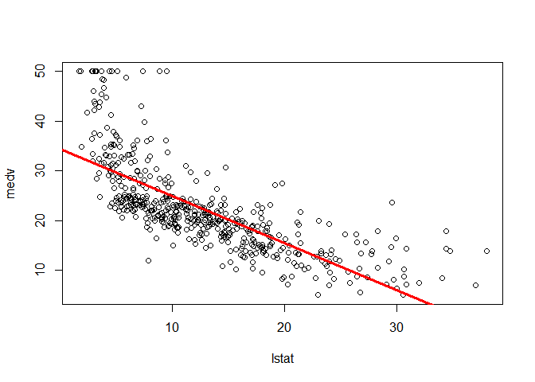<!-- -->

```r
plot(lstat,medv,col="red")
```

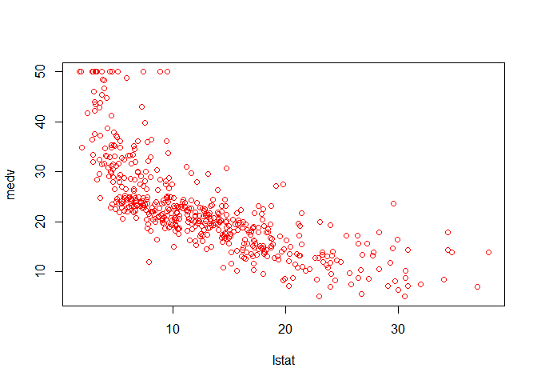<!-- -->

```r
plot(lstat,medv,pch=20)
```

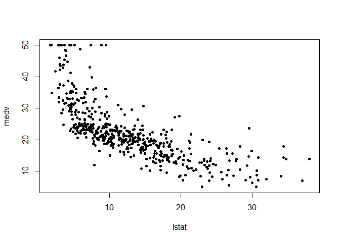<!-- -->

```r
plot(lstat,medv,pch="+")
```

<!-- -->

```r
plot(1:20,1:20,pch=1:20)
```

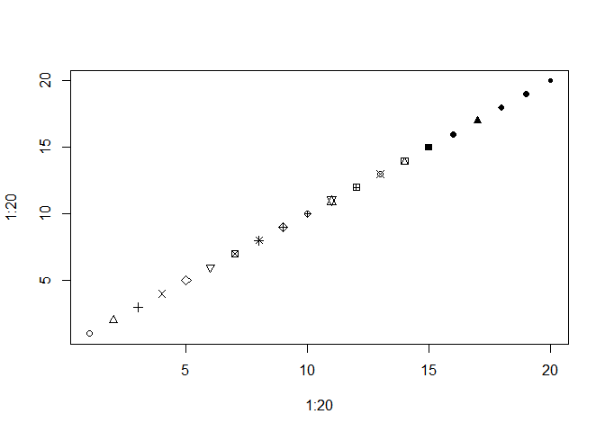<!-- -->

```r
par(mfrow=c(2,2))
plot(lm.fit)
```

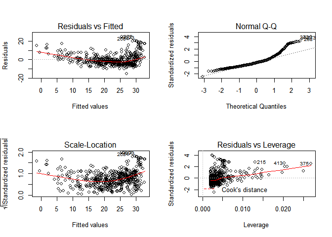<!-- -->

```r
plot(predict(lm.fit), residuals(lm.fit))
plot(predict(lm.fit), rstudent(lm.fit))
plot(hatvalues(lm.fit))
which.max(hatvalues(lm.fit))
```

```
## 375 
## 375
```

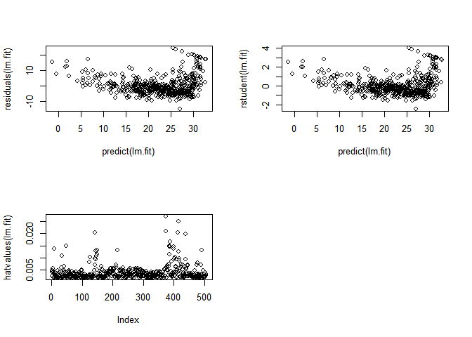<!-- -->

# Multiple Linear Regression

```r
lm.fit=lm(medv~lstat+age,data=Boston)
summary(lm.fit)
```

```
## 
## Call:
## lm(formula = medv ~ lstat + age, data = Boston)
## 
## Residuals:
##     Min      1Q  Median      3Q     Max 
## -15.981  -3.978  -1.283   1.968  23.158 
## 
## Coefficients:
##             Estimate Std. Error t value Pr(>|t|)    
## (Intercept) 33.22276    0.73085  45.458  < 2e-16 ***
## lstat       -1.03207    0.04819 -21.416  < 2e-16 ***
## age          0.03454    0.01223   2.826  0.00491 ** 
## ---
## Signif. codes:  0 '***' 0.001 '**' 0.01 '*' 0.05 '.' 0.1 ' ' 1
## 
## Residual standard error: 6.173 on 503 degrees of freedom
## Multiple R-squared:  0.5513,	Adjusted R-squared:  0.5495 
## F-statistic:   309 on 2 and 503 DF,  p-value: < 2.2e-16
```

```r
lm.fit=lm(medv~.,data=Boston)
summary(lm.fit)
```

```
## 
## Call:
## lm(formula = medv ~ ., data = Boston)
## 
## Residuals:
##     Min      1Q  Median      3Q     Max 
## -15.595  -2.730  -0.518   1.777  26.199 
## 
## Coefficients:
##               Estimate Std. Error t value Pr(>|t|)    
## (Intercept)  3.646e+01  5.103e+00   7.144 3.28e-12 ***
## crim        -1.080e-01  3.286e-02  -3.287 0.001087 ** 
## zn           4.642e-02  1.373e-02   3.382 0.000778 ***
## indus        2.056e-02  6.150e-02   0.334 0.738288    
## chas         2.687e+00  8.616e-01   3.118 0.001925 ** 
## nox         -1.777e+01  3.820e+00  -4.651 4.25e-06 ***
## rm           3.810e+00  4.179e-01   9.116  < 2e-16 ***
## age          6.922e-04  1.321e-02   0.052 0.958229    
## dis         -1.476e+00  1.995e-01  -7.398 6.01e-13 ***
## rad          3.060e-01  6.635e-02   4.613 5.07e-06 ***
## tax         -1.233e-02  3.760e-03  -3.280 0.001112 ** 
## ptratio     -9.527e-01  1.308e-01  -7.283 1.31e-12 ***
## black        9.312e-03  2.686e-03   3.467 0.000573 ***
## lstat       -5.248e-01  5.072e-02 -10.347  < 2e-16 ***
## ---
## Signif. codes:  0 '***' 0.001 '**' 0.01 '*' 0.05 '.' 0.1 ' ' 1
## 
## Residual standard error: 4.745 on 492 degrees of freedom
## Multiple R-squared:  0.7406,	Adjusted R-squared:  0.7338 
## F-statistic: 108.1 on 13 and 492 DF,  p-value: < 2.2e-16
```

```r
library(car)
vif(lm.fit)
```

```
##     crim       zn    indus     chas      nox       rm      age      dis 
## 1.792192 2.298758 3.991596 1.073995 4.393720 1.933744 3.100826 3.955945 
##      rad      tax  ptratio    black    lstat 
## 7.484496 9.008554 1.799084 1.348521 2.941491
```

```r
lm.fit1=lm(medv~.-age,data=Boston)
summary(lm.fit1)
```

```
## 
## Call:
## lm(formula = medv ~ . - age, data = Boston)
## 
## Residuals:
##      Min       1Q   Median       3Q      Max 
## -15.6054  -2.7313  -0.5188   1.7601  26.2243 
## 
## Coefficients:
##               Estimate Std. Error t value Pr(>|t|)    
## (Intercept)  36.436927   5.080119   7.172 2.72e-12 ***
## crim         -0.108006   0.032832  -3.290 0.001075 ** 
## zn            0.046334   0.013613   3.404 0.000719 ***
## indus         0.020562   0.061433   0.335 0.737989    
## chas          2.689026   0.859598   3.128 0.001863 ** 
## nox         -17.713540   3.679308  -4.814 1.97e-06 ***
## rm            3.814394   0.408480   9.338  < 2e-16 ***
## dis          -1.478612   0.190611  -7.757 5.03e-14 ***
## rad           0.305786   0.066089   4.627 4.75e-06 ***
## tax          -0.012329   0.003755  -3.283 0.001099 ** 
## ptratio      -0.952211   0.130294  -7.308 1.10e-12 ***
## black         0.009321   0.002678   3.481 0.000544 ***
## lstat        -0.523852   0.047625 -10.999  < 2e-16 ***
## ---
## Signif. codes:  0 '***' 0.001 '**' 0.01 '*' 0.05 '.' 0.1 ' ' 1
## 
## Residual standard error: 4.74 on 493 degrees of freedom
## Multiple R-squared:  0.7406,	Adjusted R-squared:  0.7343 
## F-statistic: 117.3 on 12 and 493 DF,  p-value: < 2.2e-16
```

```r
lm.fit1=update(lm.fit, ~.-age)
```


# Interaction Terms


```r
summary(lm(medv~lstat*age,data=Boston))
```

```
## 
## Call:
## lm(formula = medv ~ lstat * age, data = Boston)
## 
## Residuals:
##     Min      1Q  Median      3Q     Max 
## -15.806  -4.045  -1.333   2.085  27.552 
## 
## Coefficients:
##               Estimate Std. Error t value Pr(>|t|)    
## (Intercept) 36.0885359  1.4698355  24.553  < 2e-16 ***
## lstat       -1.3921168  0.1674555  -8.313 8.78e-16 ***
## age         -0.0007209  0.0198792  -0.036   0.9711    
## lstat:age    0.0041560  0.0018518   2.244   0.0252 *  
## ---
## Signif. codes:  0 '***' 0.001 '**' 0.01 '*' 0.05 '.' 0.1 ' ' 1
## 
## Residual standard error: 6.149 on 502 degrees of freedom
## Multiple R-squared:  0.5557,	Adjusted R-squared:  0.5531 
## F-statistic: 209.3 on 3 and 502 DF,  p-value: < 2.2e-16
```


# Non-linear Transformations of the Predictors

```r
lm.fit2=lm(medv~lstat+I(lstat^2))
summary(lm.fit2)
```

```
## 
## Call:
## lm(formula = medv ~ lstat + I(lstat^2))
## 
## Residuals:
##      Min       1Q   Median       3Q      Max 
## -15.2834  -3.8313  -0.5295   2.3095  25.4148 
## 
## Coefficients:
##              Estimate Std. Error t value Pr(>|t|)    
## (Intercept) 42.862007   0.872084   49.15   <2e-16 ***
## lstat       -2.332821   0.123803  -18.84   <2e-16 ***
## I(lstat^2)   0.043547   0.003745   11.63   <2e-16 ***
## ---
## Signif. codes:  0 '***' 0.001 '**' 0.01 '*' 0.05 '.' 0.1 ' ' 1
## 
## Residual standard error: 5.524 on 503 degrees of freedom
## Multiple R-squared:  0.6407,	Adjusted R-squared:  0.6393 
## F-statistic: 448.5 on 2 and 503 DF,  p-value: < 2.2e-16
```

```r
lm.fit=lm(medv~lstat)
anova(lm.fit,lm.fit2)
```

```
## Analysis of Variance Table
## 
## Model 1: medv ~ lstat
## Model 2: medv ~ lstat + I(lstat^2)
##   Res.Df   RSS Df Sum of Sq     F    Pr(>F)    
## 1    504 19472                                 
## 2    503 15347  1    4125.1 135.2 < 2.2e-16 ***
## ---
## Signif. codes:  0 '***' 0.001 '**' 0.01 '*' 0.05 '.' 0.1 ' ' 1
```

```r
par(mfrow=c(2,2))
plot(lm.fit2)
```

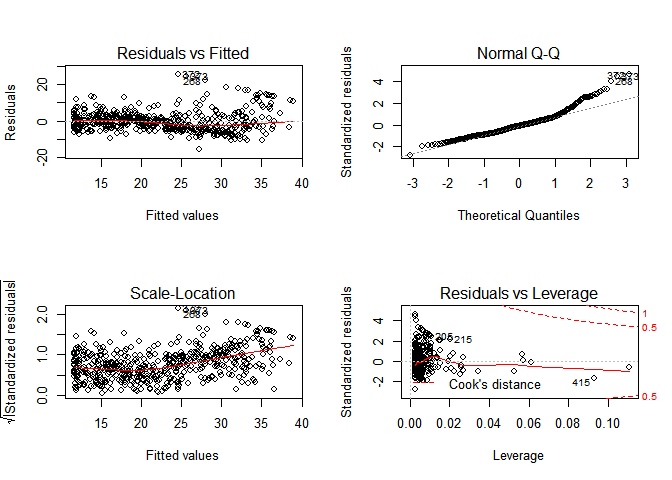<!-- -->

```r
lm.fit5=lm(medv~poly(lstat,5))
summary(lm.fit5)
```

```
## 
## Call:
## lm(formula = medv ~ poly(lstat, 5))
## 
## Residuals:
##      Min       1Q   Median       3Q      Max 
## -13.5433  -3.1039  -0.7052   2.0844  27.1153 
## 
## Coefficients:
##                  Estimate Std. Error t value Pr(>|t|)    
## (Intercept)       22.5328     0.2318  97.197  < 2e-16 ***
## poly(lstat, 5)1 -152.4595     5.2148 -29.236  < 2e-16 ***
## poly(lstat, 5)2   64.2272     5.2148  12.316  < 2e-16 ***
## poly(lstat, 5)3  -27.0511     5.2148  -5.187 3.10e-07 ***
## poly(lstat, 5)4   25.4517     5.2148   4.881 1.42e-06 ***
## poly(lstat, 5)5  -19.2524     5.2148  -3.692 0.000247 ***
## ---
## Signif. codes:  0 '***' 0.001 '**' 0.01 '*' 0.05 '.' 0.1 ' ' 1
## 
## Residual standard error: 5.215 on 500 degrees of freedom
## Multiple R-squared:  0.6817,	Adjusted R-squared:  0.6785 
## F-statistic: 214.2 on 5 and 500 DF,  p-value: < 2.2e-16
```

```r
summary(lm(medv~log(rm),data=Boston))
```

```
## 
## Call:
## lm(formula = medv ~ log(rm), data = Boston)
## 
## Residuals:
##     Min      1Q  Median      3Q     Max 
## -19.487  -2.875  -0.104   2.837  39.816 
## 
## Coefficients:
##             Estimate Std. Error t value Pr(>|t|)    
## (Intercept)  -76.488      5.028  -15.21   <2e-16 ***
## log(rm)       54.055      2.739   19.73   <2e-16 ***
## ---
## Signif. codes:  0 '***' 0.001 '**' 0.01 '*' 0.05 '.' 0.1 ' ' 1
## 
## Residual standard error: 6.915 on 504 degrees of freedom
## Multiple R-squared:  0.4358,	Adjusted R-squared:  0.4347 
## F-statistic: 389.3 on 1 and 504 DF,  p-value: < 2.2e-16
```


# Qualitative Predictors

```r
#fix(Carseats)
names(Carseats)
```

```
##  [1] "Sales"       "CompPrice"   "Income"      "Advertising" "Population" 
##  [6] "Price"       "ShelveLoc"   "Age"         "Education"   "Urban"      
## [11] "US"
```

```r
lm.fit=lm(Sales~.+Income:Advertising+Price:Age,data=Carseats)
summary(lm.fit)
```

```
## 
## Call:
## lm(formula = Sales ~ . + Income:Advertising + Price:Age, data = Carseats)
## 
## Residuals:
##     Min      1Q  Median      3Q     Max 
## -2.9208 -0.7503  0.0177  0.6754  3.3413 
## 
## Coefficients:
##                      Estimate Std. Error t value Pr(>|t|)    
## (Intercept)         6.5755654  1.0087470   6.519 2.22e-10 ***
## CompPrice           0.0929371  0.0041183  22.567  < 2e-16 ***
## Income              0.0108940  0.0026044   4.183 3.57e-05 ***
## Advertising         0.0702462  0.0226091   3.107 0.002030 ** 
## Population          0.0001592  0.0003679   0.433 0.665330    
## Price              -0.1008064  0.0074399 -13.549  < 2e-16 ***
## ShelveLocGood       4.8486762  0.1528378  31.724  < 2e-16 ***
## ShelveLocMedium     1.9532620  0.1257682  15.531  < 2e-16 ***
## Age                -0.0579466  0.0159506  -3.633 0.000318 ***
## Education          -0.0208525  0.0196131  -1.063 0.288361    
## UrbanYes            0.1401597  0.1124019   1.247 0.213171    
## USYes              -0.1575571  0.1489234  -1.058 0.290729    
## Income:Advertising  0.0007510  0.0002784   2.698 0.007290 ** 
## Price:Age           0.0001068  0.0001333   0.801 0.423812    
## ---
## Signif. codes:  0 '***' 0.001 '**' 0.01 '*' 0.05 '.' 0.1 ' ' 1
## 
## Residual standard error: 1.011 on 386 degrees of freedom
## Multiple R-squared:  0.8761,	Adjusted R-squared:  0.8719 
## F-statistic:   210 on 13 and 386 DF,  p-value: < 2.2e-16
```

```r
attach(Carseats)
contrasts(ShelveLoc)
```

```
##        Good Medium
## Bad       0      0
## Good      1      0
## Medium    0      1
```


# Writing Functions

```r
#LoadLibraries
#LoadLibraries()
LoadLibraries=function(){
 library(ISLR)
 library(MASS)
 print("The libraries have been loaded.")
 }
LoadLibraries
```

```
## function(){
##  library(ISLR)
##  library(MASS)
##  print("The libraries have been loaded.")
##  }
```

```r
LoadLibraries()
```

```
## [1] "The libraries have been loaded."
```

3. Suppose we have a data set with five predictors, X 1 = GPA, X 2 = IQ,
X 3 = Gender (1 for Female and 0 for Male), X 4 = Interaction between
GPA and IQ, and X 5 = Interaction between GPA and Gender. The
response is starting salary after graduation (in thousands of dollars).
Suppose we use least squares to fit the model, and get ˆβ 0 = 50, ˆβ 1 =
20, ˆβ 2 = 0.07, ˆβ 3 = 35, ˆβ 4 = 0.01, ˆβ 5 = − 10.

salary = 50 + 20XGPA + 0.07XIQ + 35XGender + 0.01XGPAXIQ + (− 10)XGPAXGender

(a) Which answer is correct, and why?

i. For a fixed value of IQ and GPA, males earn more on average
than females.

> No

ii. For a fixed value of IQ and GPA, females earn more on
average than males.

> Yes

# a person with IQ of 110 and a GPA of 3.0, females earn more on average than males.


```r
Predict.female.low <- 50 + 20*3 + 0.07*110 + 35*1 + 0.01*3*110 + (-10)*3*1
Predict.female.low
```

```
## [1] 126
```

```r
Predict.male.low <- 50 + 20*3 + 0.07*110 + 35*0 + 0.01*3*110 + (-10)*3*0
Predict.male.low
```

```
## [1] 121
```

iii. For a fixed value of IQ and GPA, males earn more on average
than females provided that the GPA is high enough.

> Yes

iv. For a fixed value of IQ and GPA, females earn more on
average than males provided that the GPA is high enough.

> No

# a person with IQ of 110 and a GPA of 4.0, males earn more on average than females provided that the GPA is high enough.


```r
Predict.female.high <- 50 + 20*4 + 0.07*110 + 35*1 + 0.01*4*110 + (-10)*4*1
Predict.female.high
```

```
## [1] 137.1
```

```r
Predict.male.high <- 50 + 20*4 + 0.07*110 + 35*0 + 0.01*4*110 + (-10)*4*0
Predict.male.high
```

```
## [1] 142.1
```


(b) Predict the salary of a female with IQ of 110 and a GPA of 4.0.


```r
Predict1 <- 50 + 20*4 + 0.07*110 + 35*1 + 0.01*4*110 + (-10)*4*1
Predict1
```

```
## [1] 137.1
```

> 137.1 (in thousands of dollars)

(c) True or false: Since the coefficient for the GPA/IQ interaction
term is very small, there is very little evidence of an interaction
effect. Justify your answer.

> No, The evidence of an interaction effect should based on p value.


9. This question involves the use of multiple linear regression on the
Auto data set.

(d) Use the plot() function to produce diagnostic plots of the linear
regression fit. Comment on any problems you see with the fit.
Do the residual plots suggest any unusually large outliers? Does
the leverage plot identify any observations with unusually high
leverage?


```r
lm.fit.auto=lm(mpg~.-name,data=Auto)
summary(lm.fit.auto)
```

```
## 
## Call:
## lm(formula = mpg ~ . - name, data = Auto)
## 
## Residuals:
##     Min      1Q  Median      3Q     Max 
## -9.5903 -2.1565 -0.1169  1.8690 13.0604 
## 
## Coefficients:
##                Estimate Std. Error t value Pr(>|t|)    
## (Intercept)  -17.218435   4.644294  -3.707  0.00024 ***
## cylinders     -0.493376   0.323282  -1.526  0.12780    
## displacement   0.019896   0.007515   2.647  0.00844 ** 
## horsepower    -0.016951   0.013787  -1.230  0.21963    
## weight        -0.006474   0.000652  -9.929  < 2e-16 ***
## acceleration   0.080576   0.098845   0.815  0.41548    
## year           0.750773   0.050973  14.729  < 2e-16 ***
## origin         1.426141   0.278136   5.127 4.67e-07 ***
## ---
## Signif. codes:  0 '***' 0.001 '**' 0.01 '*' 0.05 '.' 0.1 ' ' 1
## 
## Residual standard error: 3.328 on 384 degrees of freedom
## Multiple R-squared:  0.8215,	Adjusted R-squared:  0.8182 
## F-statistic: 252.4 on 7 and 384 DF,  p-value: < 2.2e-16
```

```r
par(mfrow=c(2,2)) 
plot(lm.fit.auto)
```

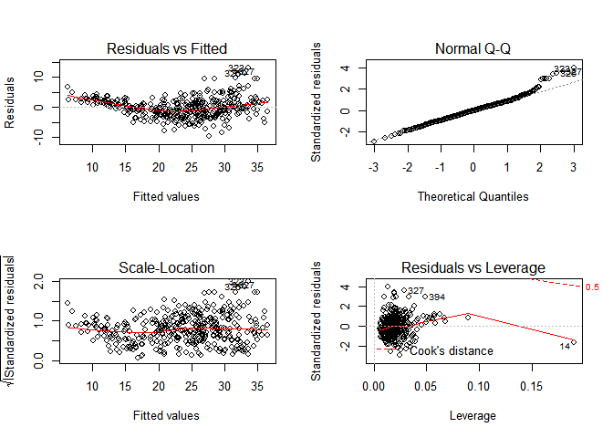<!-- -->
> Potential Problems

> 1. Non-linearity of the response-predictor relationships. 2. Not normal distribution. 3. Outliers. 4. High-leverage points.

(e) Use the * and : symbols to fit linear regression models with
interaction effects. Do any interactions appear to be statistically
significant?


```r
names(Auto)
```

```
## [1] "mpg"          "cylinders"    "displacement" "horsepower"  
## [5] "weight"       "acceleration" "year"         "origin"      
## [9] "name"
```

```r
lm.fit.auto.2I=lm(mpg~(.-name)*(.-name),data=Auto)
summary(lm.fit.auto.2I)
```

```
## 
## Call:
## lm(formula = mpg ~ (. - name) * (. - name), data = Auto)
## 
## Residuals:
##     Min      1Q  Median      3Q     Max 
## -7.6303 -1.4481  0.0596  1.2739 11.1386 
## 
## Coefficients:
##                             Estimate Std. Error t value Pr(>|t|)   
## (Intercept)                3.548e+01  5.314e+01   0.668  0.50475   
## cylinders                  6.989e+00  8.248e+00   0.847  0.39738   
## displacement              -4.785e-01  1.894e-01  -2.527  0.01192 * 
## horsepower                 5.034e-01  3.470e-01   1.451  0.14769   
## weight                     4.133e-03  1.759e-02   0.235  0.81442   
## acceleration              -5.859e+00  2.174e+00  -2.696  0.00735 **
## year                       6.974e-01  6.097e-01   1.144  0.25340   
## origin                    -2.090e+01  7.097e+00  -2.944  0.00345 **
## cylinders:displacement    -3.383e-03  6.455e-03  -0.524  0.60051   
## cylinders:horsepower       1.161e-02  2.420e-02   0.480  0.63157   
## cylinders:weight           3.575e-04  8.955e-04   0.399  0.69000   
## cylinders:acceleration     2.779e-01  1.664e-01   1.670  0.09584 . 
## cylinders:year            -1.741e-01  9.714e-02  -1.793  0.07389 . 
## cylinders:origin           4.022e-01  4.926e-01   0.816  0.41482   
## displacement:horsepower   -8.491e-05  2.885e-04  -0.294  0.76867   
## displacement:weight        2.472e-05  1.470e-05   1.682  0.09342 . 
## displacement:acceleration -3.479e-03  3.342e-03  -1.041  0.29853   
## displacement:year          5.934e-03  2.391e-03   2.482  0.01352 * 
## displacement:origin        2.398e-02  1.947e-02   1.232  0.21875   
## horsepower:weight         -1.968e-05  2.924e-05  -0.673  0.50124   
## horsepower:acceleration   -7.213e-03  3.719e-03  -1.939  0.05325 . 
## horsepower:year           -5.838e-03  3.938e-03  -1.482  0.13916   
## horsepower:origin          2.233e-03  2.930e-02   0.076  0.93931   
## weight:acceleration        2.346e-04  2.289e-04   1.025  0.30596   
## weight:year               -2.245e-04  2.127e-04  -1.056  0.29182   
## weight:origin             -5.789e-04  1.591e-03  -0.364  0.71623   
## acceleration:year          5.562e-02  2.558e-02   2.174  0.03033 * 
## acceleration:origin        4.583e-01  1.567e-01   2.926  0.00365 **
## year:origin                1.393e-01  7.399e-02   1.882  0.06062 . 
## ---
## Signif. codes:  0 '***' 0.001 '**' 0.01 '*' 0.05 '.' 0.1 ' ' 1
## 
## Residual standard error: 2.695 on 363 degrees of freedom
## Multiple R-squared:  0.8893,	Adjusted R-squared:  0.8808 
## F-statistic: 104.2 on 28 and 363 DF,  p-value: < 2.2e-16
```

```r
lm.fit.auto.3I=lm(mpg~(.-name)*(.-name)*(.-name),data=Auto)
summary(lm.fit.auto.3I)
```

```
## 
## Call:
## lm(formula = mpg ~ (. - name) * (. - name) * (. - name), data = Auto)
## 
## Residuals:
##     Min      1Q  Median      3Q     Max 
## -7.3263 -1.3084 -0.0916  1.2427 10.3972 
## 
## Coefficients:
##                                        Estimate Std. Error t value
## (Intercept)                          -2.151e+02  4.506e+02  -0.477
## cylinders                             3.804e+01  1.132e+02   0.336
## displacement                         -2.159e-01  2.595e+00  -0.083
## horsepower                           -5.629e+00  3.435e+00  -1.638
## weight                                3.354e-01  2.376e-01   1.412
## acceleration                         -1.253e+01  1.937e+01  -0.647
## year                                  5.025e+00  5.202e+00   0.966
## origin                               -9.470e+01  9.183e+01  -1.031
## cylinders:displacement               -8.647e-03  1.680e-01  -0.051
## cylinders:horsepower                 -6.153e-01  6.333e-01  -0.971
## cylinders:weight                      1.888e-02  2.613e-02   0.723
## cylinders:acceleration               -9.031e-01  5.191e+00  -0.174
## cylinders:year                       -6.801e-01  1.290e+00  -0.527
## cylinders:origin                      8.173e+00  1.591e+01   0.514
## displacement:horsepower               1.929e-02  9.712e-03   1.986
## displacement:weight                  -5.486e-04  4.648e-04  -1.180
## displacement:acceleration            -5.727e-02  1.038e-01  -0.552
## displacement:year                     1.027e-03  3.065e-02   0.034
## displacement:origin                   5.925e-01  5.692e-01   1.041
## horsepower:weight                    -5.419e-04  1.008e-03  -0.537
## horsepower:acceleration               3.994e-01  9.552e-02   4.181
## horsepower:year                       4.337e-02  4.213e-02   1.030
## horsepower:origin                     2.643e+00  7.805e-01   3.386
## weight:acceleration                  -8.123e-03  8.288e-03  -0.980
## weight:year                          -4.186e-03  2.823e-03  -1.483
## weight:origin                        -1.260e-01  4.344e-02  -2.901
## acceleration:year                     1.348e-01  2.307e-01   0.584
## acceleration:origin                   7.782e+00  3.860e+00   2.016
## year:origin                           3.895e-01  1.024e+00   0.380
## cylinders:displacement:horsepower     1.047e-04  3.498e-04   0.299
## cylinders:displacement:weight        -3.581e-06  7.703e-06  -0.465
## cylinders:displacement:acceleration   2.952e-03  2.793e-03   1.057
## cylinders:displacement:year           3.492e-04  2.309e-03   0.151
## cylinders:displacement:origin        -6.383e-02  2.110e-02  -3.025
## cylinders:horsepower:weight          -1.572e-05  4.080e-05  -0.385
## cylinders:horsepower:acceleration    -1.197e-02  7.002e-03  -1.710
## cylinders:horsepower:year             1.231e-02  8.431e-03   1.461
## cylinders:horsepower:origin          -5.544e-02  5.930e-02  -0.935
## cylinders:weight:acceleration         2.805e-04  3.855e-04   0.728
## cylinders:weight:year                -3.314e-04  3.417e-04  -0.970
## cylinders:weight:origin               2.992e-03  2.797e-03   1.070
## cylinders:acceleration:year           1.158e-02  6.050e-02   0.191
## cylinders:acceleration:origin         7.960e-02  4.358e-01   0.183
## cylinders:year:origin                -3.052e-02  1.636e-01  -0.187
## displacement:horsepower:weight        8.808e-08  3.359e-07   0.262
## displacement:horsepower:acceleration  3.820e-05  1.079e-04   0.354
## displacement:horsepower:year         -2.941e-04  1.242e-04  -2.368
## displacement:horsepower:origin        3.409e-04  1.859e-03   0.183
## displacement:weight:acceleration     -3.748e-06  6.354e-06  -0.590
## displacement:weight:year              8.862e-06  6.045e-06   1.466
## displacement:weight:origin           -1.919e-05  4.168e-05  -0.460
## displacement:acceleration:year        6.991e-04  1.236e-03   0.566
## displacement:acceleration:origin     -1.184e-02  1.288e-02  -0.919
## displacement:year:origin             -2.183e-03  6.107e-03  -0.357
## horsepower:weight:acceleration        2.583e-06  1.158e-05   0.223
## horsepower:weight:year                9.295e-06  1.195e-05   0.778
## horsepower:weight:origin             -6.136e-05  9.824e-05  -0.625
## horsepower:acceleration:year         -3.915e-03  1.154e-03  -3.394
## horsepower:acceleration:origin       -4.246e-02  1.074e-02  -3.952
## horsepower:year:origin               -2.164e-02  9.107e-03  -2.376
## weight:acceleration:year              7.719e-05  9.701e-05   0.796
## weight:acceleration:origin            1.143e-03  7.779e-04   1.470
## weight:year:origin                    1.369e-03  4.798e-04   2.854
## acceleration:year:origin             -8.235e-02  4.289e-02  -1.920
##                                      Pr(>|t|)    
## (Intercept)                          0.633414    
## cylinders                            0.737101    
## displacement                         0.933729    
## horsepower                           0.102305    
## weight                               0.159037    
## acceleration                         0.518227    
## year                                 0.334697    
## origin                               0.303204    
## cylinders:displacement               0.958977    
## cylinders:horsepower                 0.332017    
## cylinders:weight                     0.470493    
## cylinders:acceleration               0.861998    
## cylinders:year                       0.598503    
## cylinders:origin                     0.607746    
## displacement:horsepower              0.047894 *  
## displacement:weight                  0.238746    
## displacement:acceleration            0.581427    
## displacement:year                    0.973292    
## displacement:origin                  0.298704    
## horsepower:weight                    0.591308    
## horsepower:acceleration              3.73e-05 ***
## horsepower:year                      0.303972    
## horsepower:origin                    0.000795 ***
## weight:acceleration                  0.327759    
## weight:year                          0.139001    
## weight:origin                        0.003965 ** 
## acceleration:year                    0.559511    
## acceleration:origin                  0.044604 *  
## year:origin                          0.703859    
## cylinders:displacement:horsepower    0.764857    
## cylinders:displacement:weight        0.642339    
## cylinders:displacement:acceleration  0.291447    
## cylinders:displacement:year          0.879857    
## cylinders:displacement:origin        0.002684 ** 
## cylinders:horsepower:weight          0.700276    
## cylinders:horsepower:acceleration    0.088301 .  
## cylinders:horsepower:year            0.145102    
## cylinders:horsepower:origin          0.350541    
## cylinders:weight:acceleration        0.467370    
## cylinders:weight:year                0.332837    
## cylinders:weight:origin              0.285530    
## cylinders:acceleration:year          0.848333    
## cylinders:acceleration:origin        0.855180    
## cylinders:year:origin                0.852118    
## displacement:horsepower:weight       0.793332    
## displacement:horsepower:acceleration 0.723541    
## displacement:horsepower:year         0.018460 *  
## displacement:horsepower:origin       0.854575    
## displacement:weight:acceleration     0.555689    
## displacement:weight:year             0.143610    
## displacement:weight:origin           0.645500    
## displacement:acceleration:year       0.571951    
## displacement:acceleration:origin     0.358578    
## displacement:year:origin             0.720972    
## horsepower:weight:acceleration       0.823662    
## horsepower:weight:year               0.437395    
## horsepower:weight:origin             0.532667    
## horsepower:acceleration:year         0.000774 ***
## horsepower:acceleration:origin       9.49e-05 ***
## horsepower:year:origin               0.018086 *  
## weight:acceleration:year             0.426779    
## weight:acceleration:origin           0.142583    
## weight:year:origin                   0.004589 ** 
## acceleration:year:origin             0.055720 .  
## ---
## Signif. codes:  0 '***' 0.001 '**' 0.01 '*' 0.05 '.' 0.1 ' ' 1
## 
## Residual standard error: 2.441 on 328 degrees of freedom
## Multiple R-squared:  0.9179,	Adjusted R-squared:  0.9022 
## F-statistic: 58.22 on 63 and 328 DF,  p-value: < 2.2e-16
```

```r
lm.fit.auto.4I=lm(mpg~(.-name)*(.-name)*(.-name)*(.-name),data=Auto)
summary(lm.fit.auto.4I)
```

```
## 
## Call:
## lm(formula = mpg ~ (. - name) * (. - name) * (. - name) * (. - 
##     name), data = Auto)
## 
## Residuals:
##     Min      1Q  Median      3Q     Max 
## -7.2480 -1.0737 -0.0259  1.0256  9.0317 
## 
## Coefficients:
##                                                  Estimate Std. Error
## (Intercept)                                     1.194e+03  5.816e+03
## cylinders                                      -9.490e+02  1.463e+03
## displacement                                    4.215e+01  3.330e+01
## horsepower                                      3.655e+01  3.153e+01
## weight                                         -5.841e+00  5.435e+00
## acceleration                                    7.200e+02  4.943e+02
## year                                           -2.348e+01  8.015e+01
## origin                                         -2.804e+03  5.013e+03
## cylinders:displacement                         -7.119e+00  6.479e+00
## cylinders:horsepower                           -5.797e+00  5.846e+00
## cylinders:weight                                1.680e+00  1.278e+00
## cylinders:acceleration                         -1.641e+02  1.271e+02
## cylinders:year                                  1.372e+01  2.044e+01
## cylinders:origin                                9.390e+02  1.228e+03
## displacement:horsepower                         1.186e-01  1.667e-01
## displacement:weight                            -5.844e-03  4.148e-03
## displacement:acceleration                      -8.078e-01  8.714e-01
## displacement:year                              -6.335e-01  4.643e-01
## displacement:origin                            -3.544e+01  2.771e+01
## horsepower:weight                              -1.804e-02  1.641e-02
## horsepower:acceleration                         1.181e+00  1.372e+00
## horsepower:year                                -5.203e-01  4.183e-01
## horsepower:origin                              -2.597e+01  1.827e+01
## weight:acceleration                             4.108e-03  8.040e-02
## weight:year                                     9.635e-02  8.263e-02
## weight:origin                                   6.834e+00  5.060e+00
## acceleration:year                              -1.062e+01  7.321e+00
## acceleration:origin                            -7.475e+02  4.904e+02
## year:origin                                     3.930e+01  7.097e+01
## cylinders:displacement:horsepower              -3.123e-02  2.579e-02
## cylinders:displacement:weight                   8.689e-04  5.342e-04
## cylinders:displacement:acceleration            -7.017e-02  8.189e-02
## cylinders:displacement:year                     1.164e-01  9.710e-02
## cylinders:displacement:origin                   7.270e+00  6.309e+00
## cylinders:horsepower:weight                     2.838e-03  2.212e-03
## cylinders:horsepower:acceleration              -3.001e-01  2.298e-01
## cylinders:horsepower:year                       9.330e-02  8.226e-02
## cylinders:horsepower:origin                     4.806e+00  4.146e+00
## cylinders:weight:acceleration                   2.775e-04  1.279e-02
## cylinders:weight:year                          -2.656e-02  1.995e-02
## cylinders:weight:origin                        -1.758e+00  1.242e+00
## cylinders:acceleration:year                     2.485e+00  1.876e+00
## cylinders:acceleration:origin                   1.818e+02  1.238e+02
## cylinders:year:origin                          -1.288e+01  1.746e+01
## displacement:horsepower:weight                  5.657e-06  1.107e-05
## displacement:horsepower:acceleration            3.051e-03  3.073e-03
## displacement:horsepower:year                    4.978e-05  1.593e-03
## displacement:horsepower:origin                 -1.459e-01  1.221e-01
## displacement:weight:acceleration                9.432e-05  1.882e-04
## displacement:weight:year                        2.776e-05  4.766e-05
## displacement:weight:origin                      3.584e-03  2.376e-03
## displacement:acceleration:year                  1.155e-02  1.016e-02
## displacement:acceleration:origin                3.966e-01  4.481e-01
## displacement:year:origin                        5.586e-01  4.047e-01
## horsepower:weight:acceleration                 -6.148e-05  4.160e-04
## horsepower:weight:year                          1.034e-04  1.705e-04
## horsepower:weight:origin                        1.106e-02  8.799e-03
## horsepower:acceleration:year                   -8.999e-03  1.628e-02
## horsepower:acceleration:origin                 -4.216e-01  7.208e-01
## horsepower:year:origin                          4.312e-01  2.521e-01
## weight:acceleration:year                       -5.385e-05  9.145e-04
## weight:acceleration:origin                     -2.674e-02  2.939e-02
## weight:year:origin                             -1.064e-01  7.917e-02
## acceleration:year:origin                        1.121e+01  7.307e+00
## cylinders:displacement:horsepower:weight       -4.737e-07  3.638e-07
## cylinders:displacement:horsepower:acceleration  1.016e-04  1.528e-04
## cylinders:displacement:horsepower:year         -1.167e-05  1.101e-04
## cylinders:displacement:horsepower:origin        3.202e-02  2.377e-02
## cylinders:displacement:weight:acceleration     -2.292e-06  3.822e-06
## cylinders:displacement:weight:year             -3.153e-07  2.399e-06
## cylinders:displacement:weight:origin           -7.764e-04  5.155e-04
## cylinders:displacement:acceleration:year        6.031e-04  8.332e-04
## cylinders:displacement:acceleration:origin      2.619e-02  4.066e-02
## cylinders:displacement:year:origin             -1.201e-01  9.559e-02
## cylinders:horsepower:weight:acceleration       -7.726e-06  1.789e-05
## cylinders:horsepower:weight:year               -8.552e-06  1.435e-05
## cylinders:horsepower:weight:origin             -1.934e-03  1.826e-03
## cylinders:horsepower:acceleration:year          2.042e-03  2.335e-03
## cylinders:horsepower:acceleration:origin        1.411e-01  1.479e-01
## cylinders:horsepower:year:origin               -8.406e-02  5.782e-02
## cylinders:weight:acceleration:year             -2.714e-05  1.538e-04
## cylinders:weight:acceleration:origin            2.988e-03  2.907e-03
## cylinders:weight:year:origin                    2.717e-02  1.959e-02
## cylinders:acceleration:year:origin             -2.737e+00  1.843e+00
## displacement:horsepower:weight:acceleration    -1.059e-07  1.629e-07
## displacement:horsepower:weight:year            -9.680e-10  1.388e-07
## displacement:horsepower:weight:origin          -7.451e-07  3.118e-06
## displacement:horsepower:acceleration:year      -4.512e-05  3.242e-05
## displacement:horsepower:acceleration:origin    -6.357e-05  7.685e-04
## displacement:horsepower:year:origin             2.566e-04  8.134e-04
## displacement:weight:acceleration:year          -9.558e-07  2.410e-06
## displacement:weight:acceleration:origin        -2.499e-06  1.940e-05
## displacement:weight:year:origin                -4.384e-06  1.556e-05
## displacement:acceleration:year:origin          -6.425e-03  4.972e-03
## horsepower:weight:acceleration:year             2.133e-06  4.375e-06
## horsepower:weight:acceleration:origin          -6.479e-07  6.662e-05
## horsepower:weight:year:origin                  -4.253e-05  5.466e-05
## horsepower:acceleration:year:origin            -2.344e-03  5.323e-03
## weight:acceleration:year:origin                 2.094e-04  3.202e-04
##                                                t value Pr(>|t|)  
## (Intercept)                                      0.205   0.8375  
## cylinders                                       -0.649   0.5169  
## displacement                                     1.266   0.2066  
## horsepower                                       1.159   0.2473  
## weight                                          -1.075   0.2834  
## acceleration                                     1.457   0.1463  
## year                                            -0.293   0.7698  
## origin                                          -0.559   0.5764  
## cylinders:displacement                          -1.099   0.2728  
## cylinders:horsepower                            -0.992   0.3222  
## cylinders:weight                                 1.315   0.1896  
## cylinders:acceleration                          -1.292   0.1975  
## cylinders:year                                   0.671   0.5024  
## cylinders:origin                                 0.765   0.4449  
## displacement:horsepower                          0.712   0.4771  
## displacement:weight                             -1.409   0.1600  
## displacement:acceleration                       -0.927   0.3547  
## displacement:year                               -1.364   0.1735  
## displacement:origin                             -1.279   0.2018  
## horsepower:weight                               -1.100   0.2724  
## horsepower:acceleration                          0.860   0.3903  
## horsepower:year                                 -1.244   0.2145  
## horsepower:origin                               -1.422   0.1562  
## weight:acceleration                              0.051   0.9593  
## weight:year                                      1.166   0.2445  
## weight:origin                                    1.350   0.1779  
## acceleration:year                               -1.450   0.1481  
## acceleration:origin                             -1.524   0.1286  
## year:origin                                      0.554   0.5801  
## cylinders:displacement:horsepower               -1.211   0.2270  
## cylinders:displacement:weight                    1.627   0.1049  
## cylinders:displacement:acceleration             -0.857   0.3922  
## cylinders:displacement:year                      1.199   0.2316  
## cylinders:displacement:origin                    1.152   0.2501  
## cylinders:horsepower:weight                      1.283   0.2005  
## cylinders:horsepower:acceleration               -1.306   0.1926  
## cylinders:horsepower:year                        1.134   0.2577  
## cylinders:horsepower:origin                      1.159   0.2473  
## cylinders:weight:acceleration                    0.022   0.9827  
## cylinders:weight:year                           -1.331   0.1842  
## cylinders:weight:origin                         -1.415   0.1580  
## cylinders:acceleration:year                      1.325   0.1863  
## cylinders:acceleration:origin                    1.469   0.1429  
## cylinders:year:origin                           -0.738   0.4612  
## displacement:horsepower:weight                   0.511   0.6096  
## displacement:horsepower:acceleration             0.993   0.3217  
## displacement:horsepower:year                     0.031   0.9751  
## displacement:horsepower:origin                  -1.195   0.2331  
## displacement:weight:acceleration                 0.501   0.6167  
## displacement:weight:year                         0.583   0.5606  
## displacement:weight:origin                       1.509   0.1325  
## displacement:acceleration:year                   1.137   0.2565  
## displacement:acceleration:origin                 0.885   0.3769  
## displacement:year:origin                         1.380   0.1686  
## horsepower:weight:acceleration                  -0.148   0.8826  
## horsepower:weight:year                           0.606   0.5447  
## horsepower:weight:origin                         1.257   0.2097  
## horsepower:acceleration:year                    -0.553   0.5808  
## horsepower:acceleration:origin                  -0.585   0.5591  
## horsepower:year:origin                           1.711   0.0882 .
## weight:acceleration:year                        -0.059   0.9531  
## weight:acceleration:origin                      -0.910   0.3636  
## weight:year:origin                              -1.345   0.1798  
## acceleration:year:origin                         1.534   0.1260  
## cylinders:displacement:horsepower:weight        -1.302   0.1939  
## cylinders:displacement:horsepower:acceleration   0.665   0.5068  
## cylinders:displacement:horsepower:year          -0.106   0.9157  
## cylinders:displacement:horsepower:origin         1.347   0.1790  
## cylinders:displacement:weight:acceleration      -0.600   0.5492  
## cylinders:displacement:weight:year              -0.131   0.8955  
## cylinders:displacement:weight:origin            -1.506   0.1331  
## cylinders:displacement:acceleration:year         0.724   0.4698  
## cylinders:displacement:acceleration:origin       0.644   0.5200  
## cylinders:displacement:year:origin              -1.257   0.2099  
## cylinders:horsepower:weight:acceleration        -0.432   0.6662  
## cylinders:horsepower:weight:year                -0.596   0.5517  
## cylinders:horsepower:weight:origin              -1.060   0.2902  
## cylinders:horsepower:acceleration:year           0.874   0.3826  
## cylinders:horsepower:acceleration:origin         0.954   0.3408  
## cylinders:horsepower:year:origin                -1.454   0.1470  
## cylinders:weight:acceleration:year              -0.176   0.8600  
## cylinders:weight:acceleration:origin             1.028   0.3050  
## cylinders:weight:year:origin                     1.387   0.1665  
## cylinders:acceleration:year:origin              -1.486   0.1385  
## displacement:horsepower:weight:acceleration     -0.650   0.5161  
## displacement:horsepower:weight:year             -0.007   0.9944  
## displacement:horsepower:weight:origin           -0.239   0.8113  
## displacement:horsepower:acceleration:year       -1.392   0.1650  
## displacement:horsepower:acceleration:origin     -0.083   0.9341  
## displacement:horsepower:year:origin              0.315   0.7526  
## displacement:weight:acceleration:year           -0.397   0.6919  
## displacement:weight:acceleration:origin         -0.129   0.8976  
## displacement:weight:year:origin                 -0.282   0.7783  
## displacement:acceleration:year:origin           -1.292   0.1973  
## horsepower:weight:acceleration:year              0.487   0.6263  
## horsepower:weight:acceleration:origin           -0.010   0.9922  
## horsepower:weight:year:origin                   -0.778   0.4372  
## horsepower:acceleration:year:origin             -0.440   0.6600  
## weight:acceleration:year:origin                  0.654   0.5136  
## ---
## Signif. codes:  0 '***' 0.001 '**' 0.01 '*' 0.05 '.' 0.1 ' ' 1
## 
## Residual standard error: 2.399 on 293 degrees of freedom
## Multiple R-squared:  0.9292,	Adjusted R-squared:  0.9055 
## F-statistic: 39.23 on 98 and 293 DF,  p-value: < 2.2e-16
```

```r
lm.fit.auto.allI=lm(mpg~.-name + cylinders*displacement*horsepower*weight*acceleration*year*origin,data=Auto)
summary(lm.fit.auto.allI)
```

```
## 
## Call:
## lm(formula = mpg ~ . - name + cylinders * displacement * horsepower * 
##     weight * acceleration * year * origin, data = Auto)
## 
## Residuals:
##     Min      1Q  Median      3Q     Max 
## -6.4533 -1.0707  0.0000  0.9962  9.1994 
## 
## Coefficients: (15 not defined because of singularities)
##                                                                     Estimate
## (Intercept)                                                        6.785e+04
## cylinders                                                         -1.585e+04
## displacement                                                      -1.419e+03
## horsepower                                                        -1.300e+03
## weight                                                             4.373e+01
## acceleration                                                      -8.400e+03
## year                                                               6.232e+02
## origin                                                            -5.789e+04
## cylinders:displacement                                             3.404e+02
## cylinders:horsepower                                               3.118e+02
## displacement:horsepower                                            8.962e+00
## cylinders:weight                                                  -1.158e+01
## displacement:weight                                                2.313e-01
## horsepower:weight                                                  4.055e-01
## cylinders:acceleration                                             2.009e+03
## displacement:acceleration                                          1.682e+01
## horsepower:acceleration                                            1.076e+01
## weight:acceleration                                                3.748e-01
## cylinders:year                                                    -1.748e+02
## displacement:year                                                  8.341e+00
## horsepower:year                                                    1.607e+00
## weight:year                                                       -9.176e-01
## acceleration:year                                                  9.485e+01
## cylinders:origin                                                   1.319e+04
## displacement:origin                                                1.351e+03
## horsepower:origin                                                  1.241e+03
## weight:origin                                                     -4.564e+01
## acceleration:origin                                                7.439e+03
## year:origin                                                       -7.745e+02
## cylinders:displacement:horsepower                                 -2.075e+00
## cylinders:displacement:weight                                     -4.967e-02
## cylinders:horsepower:weight                                       -9.443e-02
## displacement:horsepower:weight                                    -2.805e-03
## cylinders:displacement:acceleration                               -3.446e+00
## cylinders:horsepower:acceleration                                 -1.650e+00
## displacement:horsepower:acceleration                              -6.798e-02
## cylinders:weight:acceleration                                     -3.977e-02
## displacement:weight:acceleration                                  -3.174e-03
## horsepower:weight:acceleration                                    -3.717e-03
## cylinders:displacement:year                                       -1.871e+00
## cylinders:horsepower:year                                         -1.675e-01
## displacement:horsepower:year                                      -1.594e-02
## cylinders:weight:year                                              2.400e-01
## displacement:weight:year                                          -7.017e-04
## horsepower:weight:year                                            -6.825e-04
## cylinders:acceleration:year                                       -2.225e+01
## displacement:acceleration:year                                    -1.068e-01
## horsepower:acceleration:year                                      -1.653e-01
## weight:acceleration:year                                          -6.359e-03
## cylinders:displacement:origin                                     -3.266e+02
## cylinders:horsepower:origin                                       -2.947e+02
## displacement:horsepower:origin                                    -8.446e+00
## cylinders:weight:origin                                            1.216e+01
## displacement:weight:origin                                        -2.103e-01
## horsepower:weight:origin                                          -3.992e-01
## cylinders:acceleration:origin                                     -1.777e+03
## displacement:acceleration:origin                                  -1.175e+01
## horsepower:acceleration:origin                                    -3.670e+00
## weight:acceleration:origin                                        -1.515e-01
## cylinders:year:origin                                              2.131e+02
## displacement:year:origin                                          -7.372e+00
## horsepower:year:origin                                            -6.129e-01
## weight:year:origin                                                 9.512e-01
## acceleration:year:origin                                          -8.096e+01
## cylinders:displacement:horsepower:weight                           6.153e-04
## cylinders:displacement:horsepower:acceleration                     8.053e-03
## cylinders:displacement:weight:acceleration                         3.041e-04
## cylinders:horsepower:weight:acceleration                           3.603e-04
## displacement:horsepower:weight:acceleration                        2.971e-05
## cylinders:displacement:horsepower:year                             1.436e-03
## cylinders:displacement:weight:year                                 5.645e-05
## cylinders:horsepower:weight:year                                   5.134e-05
## displacement:horsepower:weight:year                                6.861e-06
## cylinders:displacement:acceleration:year                           1.517e-02
## cylinders:horsepower:acceleration:year                             2.417e-02
## displacement:horsepower:acceleration:year                          1.006e-03
## cylinders:weight:acceleration:year                                 7.543e-04
## displacement:weight:acceleration:year                              4.571e-05
## horsepower:weight:acceleration:year                                5.842e-05
## cylinders:displacement:horsepower:origin                           1.974e+00
## cylinders:displacement:weight:origin                               4.576e-02
## cylinders:horsepower:weight:origin                                 9.146e-02
## displacement:horsepower:weight:origin                              2.646e-03
## cylinders:displacement:acceleration:origin                         2.354e+00
## cylinders:horsepower:acceleration:origin                          -5.449e-02
## displacement:horsepower:acceleration:origin                        2.922e-02
## cylinders:weight:acceleration:origin                              -1.186e-02
## displacement:weight:acceleration:origin                            1.539e-03
## horsepower:weight:acceleration:origin                              2.184e-03
## cylinders:displacement:year:origin                                 1.676e+00
## cylinders:horsepower:year:origin                                  -8.713e-02
## displacement:horsepower:year:origin                                8.343e-03
## cylinders:weight:year:origin                                      -2.488e-01
## displacement:weight:year:origin                                    3.907e-04
## horsepower:weight:year:origin                                      5.097e-04
## cylinders:acceleration:year:origin                                 1.900e+01
## displacement:acceleration:year:origin                              3.522e-02
## horsepower:acceleration:year:origin                                6.027e-02
## weight:acceleration:year:origin                                    2.916e-03
## cylinders:displacement:horsepower:weight:acceleration             -2.295e-06
## cylinders:displacement:horsepower:weight:year                     -4.178e-07
## cylinders:displacement:horsepower:acceleration:year               -1.124e-04
## cylinders:displacement:weight:acceleration:year                   -4.299e-06
## cylinders:horsepower:weight:acceleration:year                     -5.449e-06
## displacement:horsepower:weight:acceleration:year                  -4.413e-07
## cylinders:displacement:horsepower:weight:origin                   -5.872e-04
## cylinders:displacement:horsepower:acceleration:origin                     NA
## cylinders:displacement:weight:acceleration:origin                         NA
## cylinders:horsepower:weight:acceleration:origin                           NA
## displacement:horsepower:weight:acceleration:origin                -1.684e-05
## cylinders:displacement:horsepower:year:origin                             NA
## cylinders:displacement:weight:year:origin                                 NA
## cylinders:horsepower:weight:year:origin                                   NA
## displacement:horsepower:weight:year:origin                        -4.410e-06
## cylinders:displacement:acceleration:year:origin                           NA
## cylinders:horsepower:acceleration:year:origin                             NA
## displacement:horsepower:acceleration:year:origin                  -4.537e-04
## cylinders:weight:acceleration:year:origin                                 NA
## displacement:weight:acceleration:year:origin                      -2.222e-05
## horsepower:weight:acceleration:year:origin                        -3.306e-05
## cylinders:displacement:horsepower:weight:acceleration:year         3.293e-08
## cylinders:displacement:horsepower:weight:acceleration:origin              NA
## cylinders:displacement:horsepower:weight:year:origin                      NA
## cylinders:displacement:horsepower:acceleration:year:origin                NA
## cylinders:displacement:weight:acceleration:year:origin                    NA
## cylinders:horsepower:weight:acceleration:year:origin                      NA
## displacement:horsepower:weight:acceleration:year:origin            2.522e-07
## cylinders:displacement:horsepower:weight:acceleration:year:origin         NA
##                                                                   Std. Error
## (Intercept)                                                        5.058e+04
## cylinders                                                          9.813e+03
## displacement                                                       9.892e+02
## horsepower                                                         9.564e+02
## weight                                                             3.998e+01
## acceleration                                                       5.946e+03
## year                                                               7.248e+02
## origin                                                             4.376e+04
## cylinders:displacement                                             2.325e+02
## cylinders:horsepower                                               2.133e+02
## displacement:horsepower                                            6.394e+00
## cylinders:weight                                                   9.975e+00
## displacement:weight                                                1.695e-01
## horsepower:weight                                                  3.201e-01
## cylinders:acceleration                                             1.380e+03
## displacement:acceleration                                          1.593e+01
## horsepower:acceleration                                            2.313e+01
## weight:acceleration                                                7.925e-01
## cylinders:year                                                     1.665e+02
## displacement:year                                                  6.084e+00
## horsepower:year                                                    4.964e+00
## weight:year                                                        7.729e-01
## acceleration:year                                                  6.703e+01
## cylinders:origin                                                   9.455e+03
## displacement:origin                                                9.883e+02
## horsepower:origin                                                  9.258e+02
## weight:origin                                                      3.692e+01
## acceleration:origin                                                5.873e+03
## year:origin                                                        5.774e+02
## cylinders:displacement:horsepower                                  1.370e+00
## cylinders:displacement:weight                                      3.278e-02
## cylinders:horsepower:weight                                        6.523e-02
## displacement:horsepower:weight                                     2.095e-03
## cylinders:displacement:acceleration                                1.925e+00
## cylinders:horsepower:acceleration                                  2.294e+00
## displacement:horsepower:acceleration                               1.616e-01
## cylinders:weight:acceleration                                      8.196e-02
## displacement:weight:acceleration                                   4.950e-03
## horsepower:weight:acceleration                                     9.754e-03
## cylinders:displacement:year                                        1.240e+00
## cylinders:horsepower:year                                          4.792e-01
## displacement:horsepower:year                                       3.453e-02
## cylinders:weight:year                                              1.956e-01
## displacement:weight:year                                           1.063e-03
## horsepower:weight:year                                             2.087e-03
## cylinders:acceleration:year                                        1.523e+01
## displacement:acceleration:year                                     1.814e-01
## horsepower:acceleration:year                                       2.979e-01
## weight:acceleration:year                                           1.018e-02
## cylinders:displacement:origin                                      2.342e+02
## cylinders:horsepower:origin                                        2.146e+02
## displacement:horsepower:origin                                     6.208e+00
## cylinders:weight:origin                                            9.713e+00
## displacement:weight:origin                                         1.620e-01
## horsepower:weight:origin                                           2.979e-01
## cylinders:acceleration:origin                                      1.391e+03
## displacement:acceleration:origin                                   1.128e+01
## horsepower:acceleration:origin                                     1.032e+01
## weight:acceleration:origin                                         3.466e-01
## cylinders:year:origin                                              1.533e+02
## displacement:year:origin                                           5.763e+00
## horsepower:year:origin                                             2.320e+00
## weight:year:origin                                                 7.427e-01
## acceleration:year:origin                                           6.551e+01
## cylinders:displacement:horsepower:weight                           4.125e-04
## cylinders:displacement:horsepower:acceleration                     1.331e-02
## cylinders:displacement:weight:acceleration                         4.129e-04
## cylinders:horsepower:weight:acceleration                           8.587e-04
## displacement:horsepower:weight:acceleration                        5.895e-05
## cylinders:displacement:horsepower:year                             2.859e-03
## cylinders:displacement:weight:year                                 8.960e-05
## cylinders:horsepower:weight:year                                   1.863e-04
## displacement:horsepower:weight:year                                1.258e-05
## cylinders:displacement:acceleration:year                           1.668e-02
## cylinders:horsepower:acceleration:year                             2.951e-02
## displacement:horsepower:acceleration:year                          2.111e-03
## cylinders:weight:acceleration:year                                 1.042e-03
## displacement:weight:acceleration:year                              6.427e-05
## horsepower:weight:acceleration:year                                1.252e-04
## cylinders:displacement:horsepower:origin                           1.380e+00
## cylinders:displacement:weight:origin                               3.286e-02
## cylinders:horsepower:weight:origin                                 6.533e-02
## displacement:horsepower:weight:origin                              2.022e-03
## cylinders:displacement:acceleration:origin                         1.622e+00
## cylinders:horsepower:acceleration:origin                           2.162e-01
## displacement:horsepower:acceleration:origin                        8.997e-02
## cylinders:weight:acceleration:origin                               9.461e-03
## displacement:weight:acceleration:origin                            3.037e-03
## horsepower:weight:acceleration:origin                              4.625e-03
## cylinders:displacement:year:origin                                 1.247e+00
## cylinders:horsepower:year:origin                                   7.737e-02
## displacement:horsepower:year:origin                                1.938e-02
## cylinders:weight:year:origin                                       1.927e-01
## displacement:weight:year:origin                                    6.625e-04
## horsepower:weight:year:origin                                      9.857e-04
## cylinders:acceleration:year:origin                                 1.533e+01
## displacement:acceleration:year:origin                              9.168e-02
## horsepower:acceleration:year:origin                                1.337e-01
## weight:acceleration:year:origin                                    4.536e-03
## cylinders:displacement:horsepower:weight:acceleration              4.466e-06
## cylinders:displacement:horsepower:weight:year                      9.705e-07
## cylinders:displacement:horsepower:acceleration:year                1.748e-04
## cylinders:displacement:weight:acceleration:year                    5.405e-06
## cylinders:horsepower:weight:acceleration:year                      1.111e-05
## displacement:horsepower:weight:acceleration:year                   7.632e-07
## cylinders:displacement:horsepower:weight:origin                    4.152e-04
## cylinders:displacement:horsepower:acceleration:origin                     NA
## cylinders:displacement:weight:acceleration:origin                         NA
## cylinders:horsepower:weight:acceleration:origin                           NA
## displacement:horsepower:weight:acceleration:origin                 3.791e-05
## cylinders:displacement:horsepower:year:origin                             NA
## cylinders:displacement:weight:year:origin                                 NA
## cylinders:horsepower:weight:year:origin                                   NA
## displacement:horsepower:weight:year:origin                         8.158e-06
## cylinders:displacement:acceleration:year:origin                           NA
## cylinders:horsepower:acceleration:year:origin                             NA
## displacement:horsepower:acceleration:year:origin                   1.169e-03
## cylinders:weight:acceleration:year:origin                                 NA
## displacement:weight:acceleration:year:origin                       3.907e-05
## horsepower:weight:acceleration:year:origin                         5.950e-05
## cylinders:displacement:horsepower:weight:acceleration:year         5.819e-08
## cylinders:displacement:horsepower:weight:acceleration:origin              NA
## cylinders:displacement:horsepower:weight:year:origin                      NA
## cylinders:displacement:horsepower:acceleration:year:origin                NA
## cylinders:displacement:weight:acceleration:year:origin                    NA
## cylinders:horsepower:weight:acceleration:year:origin                      NA
## displacement:horsepower:weight:acceleration:year:origin            4.889e-07
## cylinders:displacement:horsepower:weight:acceleration:year:origin         NA
##                                                                   t value
## (Intercept)                                                         1.342
## cylinders                                                          -1.616
## displacement                                                       -1.434
## horsepower                                                         -1.360
## weight                                                              1.094
## acceleration                                                       -1.413
## year                                                                0.860
## origin                                                             -1.323
## cylinders:displacement                                              1.464
## cylinders:horsepower                                                1.461
## displacement:horsepower                                             1.402
## cylinders:weight                                                   -1.161
## displacement:weight                                                 1.365
## horsepower:weight                                                   1.267
## cylinders:acceleration                                              1.456
## displacement:acceleration                                           1.056
## horsepower:acceleration                                             0.465
## weight:acceleration                                                 0.473
## cylinders:year                                                     -1.049
## displacement:year                                                   1.371
## horsepower:year                                                     0.324
## weight:year                                                        -1.187
## acceleration:year                                                   1.415
## cylinders:origin                                                    1.395
## displacement:origin                                                 1.367
## horsepower:origin                                                   1.340
## weight:origin                                                      -1.236
## acceleration:origin                                                 1.267
## year:origin                                                        -1.341
## cylinders:displacement:horsepower                                  -1.515
## cylinders:displacement:weight                                      -1.515
## cylinders:horsepower:weight                                        -1.448
## displacement:horsepower:weight                                     -1.339
## cylinders:displacement:acceleration                                -1.790
## cylinders:horsepower:acceleration                                  -0.719
## displacement:horsepower:acceleration                               -0.421
## cylinders:weight:acceleration                                      -0.485
## displacement:weight:acceleration                                   -0.641
## horsepower:weight:acceleration                                     -0.381
## cylinders:displacement:year                                        -1.510
## cylinders:horsepower:year                                          -0.349
## displacement:horsepower:year                                       -0.462
## cylinders:weight:year                                               1.227
## displacement:weight:year                                           -0.660
## horsepower:weight:year                                             -0.327
## cylinders:acceleration:year                                        -1.461
## displacement:acceleration:year                                     -0.589
## horsepower:acceleration:year                                       -0.555
## weight:acceleration:year                                           -0.625
## cylinders:displacement:origin                                      -1.394
## cylinders:horsepower:origin                                        -1.373
## displacement:horsepower:origin                                     -1.361
## cylinders:weight:origin                                             1.252
## displacement:weight:origin                                         -1.298
## horsepower:weight:origin                                           -1.340
## cylinders:acceleration:origin                                      -1.278
## displacement:acceleration:origin                                   -1.042
## horsepower:acceleration:origin                                     -0.356
## weight:acceleration:origin                                         -0.437
## cylinders:year:origin                                               1.390
## displacement:year:origin                                           -1.279
## horsepower:year:origin                                             -0.264
## weight:year:origin                                                  1.281
## acceleration:year:origin                                           -1.236
## cylinders:displacement:horsepower:weight                            1.492
## cylinders:displacement:horsepower:acceleration                      0.605
## cylinders:displacement:weight:acceleration                          0.737
## cylinders:horsepower:weight:acceleration                            0.420
## displacement:horsepower:weight:acceleration                         0.504
## cylinders:displacement:horsepower:year                              0.502
## cylinders:displacement:weight:year                                  0.630
## cylinders:horsepower:weight:year                                    0.276
## displacement:horsepower:weight:year                                 0.545
## cylinders:displacement:acceleration:year                            0.910
## cylinders:horsepower:acceleration:year                              0.819
## displacement:horsepower:acceleration:year                           0.477
## cylinders:weight:acceleration:year                                  0.724
## displacement:weight:acceleration:year                               0.711
## horsepower:weight:acceleration:year                                 0.467
## cylinders:displacement:horsepower:origin                            1.430
## cylinders:displacement:weight:origin                                1.392
## cylinders:horsepower:weight:origin                                  1.400
## displacement:horsepower:weight:origin                               1.309
## cylinders:displacement:acceleration:origin                          1.451
## cylinders:horsepower:acceleration:origin                           -0.252
## displacement:horsepower:acceleration:origin                         0.325
## cylinders:weight:acceleration:origin                               -1.254
## displacement:weight:acceleration:origin                             0.507
## horsepower:weight:acceleration:origin                               0.472
## cylinders:displacement:year:origin                                  1.344
## cylinders:horsepower:year:origin                                   -1.126
## displacement:horsepower:year:origin                                 0.430
## cylinders:weight:year:origin                                       -1.291
## displacement:weight:year:origin                                     0.590
## horsepower:weight:year:origin                                       0.517
## cylinders:acceleration:year:origin                                  1.239
## displacement:acceleration:year:origin                               0.384
## horsepower:acceleration:year:origin                                 0.451
## weight:acceleration:year:origin                                     0.643
## cylinders:displacement:horsepower:weight:acceleration              -0.514
## cylinders:displacement:horsepower:weight:year                      -0.430
## cylinders:displacement:horsepower:acceleration:year                -0.643
## cylinders:displacement:weight:acceleration:year                    -0.795
## cylinders:horsepower:weight:acceleration:year                      -0.491
## displacement:horsepower:weight:acceleration:year                   -0.578
## cylinders:displacement:horsepower:weight:origin                    -1.414
## cylinders:displacement:horsepower:acceleration:origin                  NA
## cylinders:displacement:weight:acceleration:origin                      NA
## cylinders:horsepower:weight:acceleration:origin                        NA
## displacement:horsepower:weight:acceleration:origin                 -0.444
## cylinders:displacement:horsepower:year:origin                          NA
## cylinders:displacement:weight:year:origin                              NA
## cylinders:horsepower:weight:year:origin                                NA
## displacement:horsepower:weight:year:origin                         -0.541
## cylinders:displacement:acceleration:year:origin                        NA
## cylinders:horsepower:acceleration:year:origin                          NA
## displacement:horsepower:acceleration:year:origin                   -0.388
## cylinders:weight:acceleration:year:origin                              NA
## displacement:weight:acceleration:year:origin                       -0.569
## horsepower:weight:acceleration:year:origin                         -0.556
## cylinders:displacement:horsepower:weight:acceleration:year          0.566
## cylinders:displacement:horsepower:weight:acceleration:origin           NA
## cylinders:displacement:horsepower:weight:year:origin                   NA
## cylinders:displacement:horsepower:acceleration:year:origin             NA
## cylinders:displacement:weight:acceleration:year:origin                 NA
## cylinders:horsepower:weight:acceleration:year:origin                   NA
## displacement:horsepower:weight:acceleration:year:origin             0.516
## cylinders:displacement:horsepower:weight:acceleration:year:origin      NA
##                                                                   Pr(>|t|)
## (Intercept)                                                         0.1808
## cylinders                                                           0.1073
## displacement                                                        0.1527
## horsepower                                                          0.1751
## weight                                                              0.2750
## acceleration                                                        0.1589
## year                                                                0.3906
## origin                                                              0.1869
## cylinders:displacement                                              0.1444
## cylinders:horsepower                                                0.1450
## displacement:horsepower                                             0.1622
## cylinders:weight                                                    0.2468
## displacement:weight                                                 0.1735
## horsepower:weight                                                   0.2063
## cylinders:acceleration                                              0.1467
## displacement:acceleration                                           0.2920
## horsepower:acceleration                                             0.6421
## weight:acceleration                                                 0.6367
## cylinders:year                                                      0.2949
## displacement:year                                                   0.1715
## horsepower:year                                                     0.7464
## weight:year                                                         0.2361
## acceleration:year                                                   0.1582
## cylinders:origin                                                    0.1641
## displacement:origin                                                 0.1726
## horsepower:origin                                                   0.1813
## weight:origin                                                       0.2175
## acceleration:origin                                                 0.2064
## year:origin                                                         0.1809
## cylinders:displacement:horsepower                                   0.1310
## cylinders:displacement:weight                                       0.1308
## cylinders:horsepower:weight                                         0.1488
## displacement:horsepower:weight                                      0.1816
## cylinders:displacement:acceleration                                 0.0745
## cylinders:horsepower:acceleration                                   0.4726
## displacement:horsepower:acceleration                                0.6744
## cylinders:weight:acceleration                                       0.6279
## displacement:weight:acceleration                                    0.5220
## horsepower:weight:acceleration                                      0.7035
## cylinders:displacement:year                                         0.1323
## cylinders:horsepower:year                                           0.7270
## displacement:horsepower:year                                        0.6447
## cylinders:weight:year                                               0.2208
## displacement:weight:year                                            0.5098
## horsepower:weight:year                                              0.7439
## cylinders:acceleration:year                                         0.1452
## displacement:acceleration:year                                      0.5565
## horsepower:acceleration:year                                        0.5794
## weight:acceleration:year                                            0.5326
## cylinders:displacement:origin                                       0.1644
## cylinders:horsepower:origin                                         0.1708
## displacement:horsepower:origin                                      0.1747
## cylinders:weight:origin                                             0.2118
## displacement:weight:origin                                          0.1953
## horsepower:weight:origin                                            0.1813
## cylinders:acceleration:origin                                       0.2025
## displacement:acceleration:origin                                    0.2985
## horsepower:acceleration:origin                                      0.7223
## weight:acceleration:origin                                          0.6624
## cylinders:year:origin                                               0.1657
## displacement:year:origin                                            0.2019
## horsepower:year:origin                                              0.7919
## weight:year:origin                                                  0.2014
## acceleration:year:origin                                            0.2175
## cylinders:displacement:horsepower:weight                            0.1369
## cylinders:displacement:horsepower:acceleration                      0.5458
## cylinders:displacement:weight:acceleration                          0.4620
## cylinders:horsepower:weight:acceleration                            0.6751
## displacement:horsepower:weight:acceleration                         0.6147
## cylinders:displacement:horsepower:year                              0.6160
## cylinders:displacement:weight:year                                  0.5292
## cylinders:horsepower:weight:year                                    0.7831
## displacement:horsepower:weight:year                                 0.5860
## cylinders:displacement:acceleration:year                            0.3639
## cylinders:horsepower:acceleration:year                              0.4134
## displacement:horsepower:acceleration:year                           0.6339
## cylinders:weight:acceleration:year                                  0.4696
## displacement:weight:acceleration:year                               0.4776
## horsepower:weight:acceleration:year                                 0.6411
## cylinders:displacement:horsepower:origin                            0.1538
## cylinders:displacement:weight:origin                                0.1649
## cylinders:horsepower:weight:origin                                  0.1626
## displacement:horsepower:weight:origin                               0.1917
## cylinders:displacement:acceleration:origin                          0.1479
## cylinders:horsepower:acceleration:origin                            0.8012
## displacement:horsepower:acceleration:origin                         0.7456
## cylinders:weight:acceleration:origin                                0.2109
## displacement:weight:acceleration:origin                             0.6127
## horsepower:weight:acceleration:origin                               0.6372
## cylinders:displacement:year:origin                                  0.1800
## cylinders:horsepower:year:origin                                    0.2611
## displacement:horsepower:year:origin                                 0.6672
## cylinders:weight:year:origin                                        0.1977
## displacement:weight:year:origin                                     0.5558
## horsepower:weight:year:origin                                       0.6055
## cylinders:acceleration:year:origin                                  0.2162
## displacement:acceleration:year:origin                               0.7011
## horsepower:acceleration:year:origin                                 0.6525
## weight:acceleration:year:origin                                     0.5208
## cylinders:displacement:horsepower:weight:acceleration               0.6078
## cylinders:displacement:horsepower:weight:year                       0.6672
## cylinders:displacement:horsepower:acceleration:year                 0.5206
## cylinders:displacement:weight:acceleration:year                     0.4270
## cylinders:horsepower:weight:acceleration:year                       0.6240
## displacement:horsepower:weight:acceleration:year                    0.5636
## cylinders:displacement:horsepower:weight:origin                     0.1584
## cylinders:displacement:horsepower:acceleration:origin                   NA
## cylinders:displacement:weight:acceleration:origin                       NA
## cylinders:horsepower:weight:acceleration:origin                         NA
## displacement:horsepower:weight:acceleration:origin                  0.6573
## cylinders:displacement:horsepower:year:origin                           NA
## cylinders:displacement:weight:year:origin                               NA
## cylinders:horsepower:weight:year:origin                                 NA
## displacement:horsepower:weight:year:origin                          0.5893
## cylinders:displacement:acceleration:year:origin                         NA
## cylinders:horsepower:acceleration:year:origin                           NA
## displacement:horsepower:acceleration:year:origin                    0.6983
## cylinders:weight:acceleration:year:origin                               NA
## displacement:weight:acceleration:year:origin                        0.5700
## horsepower:weight:acceleration:year:origin                          0.5789
## cylinders:displacement:horsepower:weight:acceleration:year          0.5719
## cylinders:displacement:horsepower:weight:acceleration:origin            NA
## cylinders:displacement:horsepower:weight:year:origin                    NA
## cylinders:displacement:horsepower:acceleration:year:origin              NA
## cylinders:displacement:weight:acceleration:year:origin                  NA
## cylinders:horsepower:weight:acceleration:year:origin                    NA
## displacement:horsepower:weight:acceleration:year:origin             0.6064
## cylinders:displacement:horsepower:weight:acceleration:year:origin       NA
##                                                                    
## (Intercept)                                                        
## cylinders                                                          
## displacement                                                       
## horsepower                                                         
## weight                                                             
## acceleration                                                       
## year                                                               
## origin                                                             
## cylinders:displacement                                             
## cylinders:horsepower                                               
## displacement:horsepower                                            
## cylinders:weight                                                   
## displacement:weight                                                
## horsepower:weight                                                  
## cylinders:acceleration                                             
## displacement:acceleration                                          
## horsepower:acceleration                                            
## weight:acceleration                                                
## cylinders:year                                                     
## displacement:year                                                  
## horsepower:year                                                    
## weight:year                                                        
## acceleration:year                                                  
## cylinders:origin                                                   
## displacement:origin                                                
## horsepower:origin                                                  
## weight:origin                                                      
## acceleration:origin                                                
## year:origin                                                        
## cylinders:displacement:horsepower                                  
## cylinders:displacement:weight                                      
## cylinders:horsepower:weight                                        
## displacement:horsepower:weight                                     
## cylinders:displacement:acceleration                               .
## cylinders:horsepower:acceleration                                  
## displacement:horsepower:acceleration                               
## cylinders:weight:acceleration                                      
## displacement:weight:acceleration                                   
## horsepower:weight:acceleration                                     
## cylinders:displacement:year                                        
## cylinders:horsepower:year                                          
## displacement:horsepower:year                                       
## cylinders:weight:year                                              
## displacement:weight:year                                           
## horsepower:weight:year                                             
## cylinders:acceleration:year                                        
## displacement:acceleration:year                                     
## horsepower:acceleration:year                                       
## weight:acceleration:year                                           
## cylinders:displacement:origin                                      
## cylinders:horsepower:origin                                        
## displacement:horsepower:origin                                     
## cylinders:weight:origin                                            
## displacement:weight:origin                                         
## horsepower:weight:origin                                           
## cylinders:acceleration:origin                                      
## displacement:acceleration:origin                                   
## horsepower:acceleration:origin                                     
## weight:acceleration:origin                                         
## cylinders:year:origin                                              
## displacement:year:origin                                           
## horsepower:year:origin                                             
## weight:year:origin                                                 
## acceleration:year:origin                                           
## cylinders:displacement:horsepower:weight                           
## cylinders:displacement:horsepower:acceleration                     
## cylinders:displacement:weight:acceleration                         
## cylinders:horsepower:weight:acceleration                           
## displacement:horsepower:weight:acceleration                        
## cylinders:displacement:horsepower:year                             
## cylinders:displacement:weight:year                                 
## cylinders:horsepower:weight:year                                   
## displacement:horsepower:weight:year                                
## cylinders:displacement:acceleration:year                           
## cylinders:horsepower:acceleration:year                             
## displacement:horsepower:acceleration:year                          
## cylinders:weight:acceleration:year                                 
## displacement:weight:acceleration:year                              
## horsepower:weight:acceleration:year                                
## cylinders:displacement:horsepower:origin                           
## cylinders:displacement:weight:origin                               
## cylinders:horsepower:weight:origin                                 
## displacement:horsepower:weight:origin                              
## cylinders:displacement:acceleration:origin                         
## cylinders:horsepower:acceleration:origin                           
## displacement:horsepower:acceleration:origin                        
## cylinders:weight:acceleration:origin                               
## displacement:weight:acceleration:origin                            
## horsepower:weight:acceleration:origin                              
## cylinders:displacement:year:origin                                 
## cylinders:horsepower:year:origin                                   
## displacement:horsepower:year:origin                                
## cylinders:weight:year:origin                                       
## displacement:weight:year:origin                                    
## horsepower:weight:year:origin                                      
## cylinders:acceleration:year:origin                                 
## displacement:acceleration:year:origin                              
## horsepower:acceleration:year:origin                                
## weight:acceleration:year:origin                                    
## cylinders:displacement:horsepower:weight:acceleration              
## cylinders:displacement:horsepower:weight:year                      
## cylinders:displacement:horsepower:acceleration:year                
## cylinders:displacement:weight:acceleration:year                    
## cylinders:horsepower:weight:acceleration:year                      
## displacement:horsepower:weight:acceleration:year                   
## cylinders:displacement:horsepower:weight:origin                    
## cylinders:displacement:horsepower:acceleration:origin              
## cylinders:displacement:weight:acceleration:origin                  
## cylinders:horsepower:weight:acceleration:origin                    
## displacement:horsepower:weight:acceleration:origin                 
## cylinders:displacement:horsepower:year:origin                      
## cylinders:displacement:weight:year:origin                          
## cylinders:horsepower:weight:year:origin                            
## displacement:horsepower:weight:year:origin                         
## cylinders:displacement:acceleration:year:origin                    
## cylinders:horsepower:acceleration:year:origin                      
## displacement:horsepower:acceleration:year:origin                   
## cylinders:weight:acceleration:year:origin                          
## displacement:weight:acceleration:year:origin                       
## horsepower:weight:acceleration:year:origin                         
## cylinders:displacement:horsepower:weight:acceleration:year         
## cylinders:displacement:horsepower:weight:acceleration:origin       
## cylinders:displacement:horsepower:weight:year:origin               
## cylinders:displacement:horsepower:acceleration:year:origin         
## cylinders:displacement:weight:acceleration:year:origin             
## cylinders:horsepower:weight:acceleration:year:origin               
## displacement:horsepower:weight:acceleration:year:origin            
## cylinders:displacement:horsepower:weight:acceleration:year:origin  
## ---
## Signif. codes:  0 '***' 0.001 '**' 0.01 '*' 0.05 '.' 0.1 ' ' 1
## 
## Residual standard error: 2.418 on 279 degrees of freedom
## Multiple R-squared:  0.9315,	Adjusted R-squared:  0.904 
## F-statistic: 33.88 on 112 and 279 DF,  p-value: < 2.2e-16
```

> 2 I: displacement:year, acceleration:year, acceleration:origin

> 3 I: weight:year:origin, horsepower:year:origin, horsepower:acceleration:origin, horsepower:acceleration:year,displacement:horsepower:year, cylinders:displacement:origin

> new 2I: displacement:horsepower, horsepower:acceleration, horsepower:origin, weight:origin, acceleration:origin

> Why different?

(f) Try a few different transformations of the variables, such as
log(X), √X, X 2 . Comment on your findings.


```r
names(Auto)
```

```
## [1] "mpg"          "cylinders"    "displacement" "horsepower"  
## [5] "weight"       "acceleration" "year"         "origin"      
## [9] "name"
```

```r
lm.fit.auto=lm(mpg~.-name,data=Auto)
summary(lm.fit.auto)
```

```
## 
## Call:
## lm(formula = mpg ~ . - name, data = Auto)
## 
## Residuals:
##     Min      1Q  Median      3Q     Max 
## -9.5903 -2.1565 -0.1169  1.8690 13.0604 
## 
## Coefficients:
##                Estimate Std. Error t value Pr(>|t|)    
## (Intercept)  -17.218435   4.644294  -3.707  0.00024 ***
## cylinders     -0.493376   0.323282  -1.526  0.12780    
## displacement   0.019896   0.007515   2.647  0.00844 ** 
## horsepower    -0.016951   0.013787  -1.230  0.21963    
## weight        -0.006474   0.000652  -9.929  < 2e-16 ***
## acceleration   0.080576   0.098845   0.815  0.41548    
## year           0.750773   0.050973  14.729  < 2e-16 ***
## origin         1.426141   0.278136   5.127 4.67e-07 ***
## ---
## Signif. codes:  0 '***' 0.001 '**' 0.01 '*' 0.05 '.' 0.1 ' ' 1
## 
## Residual standard error: 3.328 on 384 degrees of freedom
## Multiple R-squared:  0.8215,	Adjusted R-squared:  0.8182 
## F-statistic: 252.4 on 7 and 384 DF,  p-value: < 2.2e-16
```

```r
lm.fit.auto.log=lm(mpg~.-name -cylinders -horsepower -acceleration + log(cylinders) + log(horsepower) + log(acceleration),data=Auto)
summary(lm.fit.auto.log)
```

```
## 
## Call:
## lm(formula = mpg ~ . - name - cylinders - horsepower - acceleration + 
##     log(cylinders) + log(horsepower) + log(acceleration), data = Auto)
## 
## Residuals:
##     Min      1Q  Median      3Q     Max 
## -9.8832 -1.9489 -0.1685  1.7428 12.6920 
## 
## Coefficients:
##                     Estimate Std. Error t value Pr(>|t|)    
## (Intercept)        4.509e+01  1.066e+01   4.231 2.92e-05 ***
## displacement       1.846e-02  6.850e-03   2.695  0.00735 ** 
## weight            -3.790e-03  7.039e-04  -5.384 1.27e-07 ***
## year               7.060e-01  4.786e-02  14.751  < 2e-16 ***
## origin             1.421e+00  2.564e-01   5.542 5.56e-08 ***
## log(cylinders)    -3.463e+00  1.607e+00  -2.154  0.03186 *  
## log(horsepower)   -1.045e+01  1.517e+00  -6.890 2.29e-11 ***
## log(acceleration) -5.923e+00  1.645e+00  -3.600  0.00036 ***
## ---
## Signif. codes:  0 '***' 0.001 '**' 0.01 '*' 0.05 '.' 0.1 ' ' 1
## 
## Residual standard error: 3.145 on 384 degrees of freedom
## Multiple R-squared:  0.8405,	Adjusted R-squared:  0.8376 
## F-statistic: 289.1 on 7 and 384 DF,  p-value: < 2.2e-16
```

```r
lm.fit.auto.poly=lm(mpg~poly(cylinders+displacement+horsepower+weight+acceleration+year+origin,3),data=Auto)
summary(lm.fit.auto.poly)
```

```
## 
## Call:
## lm(formula = mpg ~ poly(cylinders + displacement + horsepower + 
##     weight + acceleration + year + origin, 3), data = Auto)
## 
## Residuals:
##     Min      1Q  Median      3Q     Max 
## -12.850  -2.750  -0.406   1.858  16.532 
## 
## Coefficients:
##                                                                                          Estimate
## (Intercept)                                                                               23.4459
## poly(cylinders + displacement + horsepower + weight + acceleration + year + origin, 3)1 -128.8951
## poly(cylinders + displacement + horsepower + weight + acceleration + year + origin, 3)2   24.1901
## poly(cylinders + displacement + horsepower + weight + acceleration + year + origin, 3)3   -0.2818
##                                                                                         Std. Error
## (Intercept)                                                                                 0.2086
## poly(cylinders + displacement + horsepower + weight + acceleration + year + origin, 3)1     4.1305
## poly(cylinders + displacement + horsepower + weight + acceleration + year + origin, 3)2     4.1305
## poly(cylinders + displacement + horsepower + weight + acceleration + year + origin, 3)3     4.1305
##                                                                                         t value
## (Intercept)                                                                             112.384
## poly(cylinders + displacement + horsepower + weight + acceleration + year + origin, 3)1 -31.205
## poly(cylinders + displacement + horsepower + weight + acceleration + year + origin, 3)2   5.856
## poly(cylinders + displacement + horsepower + weight + acceleration + year + origin, 3)3  -0.068
##                                                                                         Pr(>|t|)
## (Intercept)                                                                              < 2e-16
## poly(cylinders + displacement + horsepower + weight + acceleration + year + origin, 3)1  < 2e-16
## poly(cylinders + displacement + horsepower + weight + acceleration + year + origin, 3)2 1.01e-08
## poly(cylinders + displacement + horsepower + weight + acceleration + year + origin, 3)3    0.946
##                                                                                            
## (Intercept)                                                                             ***
## poly(cylinders + displacement + horsepower + weight + acceleration + year + origin, 3)1 ***
## poly(cylinders + displacement + horsepower + weight + acceleration + year + origin, 3)2 ***
## poly(cylinders + displacement + horsepower + weight + acceleration + year + origin, 3)3    
## ---
## Signif. codes:  0 '***' 0.001 '**' 0.01 '*' 0.05 '.' 0.1 ' ' 1
## 
## Residual standard error: 4.131 on 388 degrees of freedom
## Multiple R-squared:  0.7221,	Adjusted R-squared:  0.7199 
## F-statistic:   336 on 3 and 388 DF,  p-value: < 2.2e-16
```


10. This question should be answered using the Carseats data set.

(h) Is there evidence of outliers or high leverage observations in the
model from (e)?

> outliers are observations for which the response y i is unusual given the predictor x i . In contrast, observations with high leverage have an unusual value for x i . 


```r
#Carseats
summary(Carseats)
```

```
##      Sales          CompPrice       Income        Advertising    
##  Min.   : 0.000   Min.   : 77   Min.   : 21.00   Min.   : 0.000  
##  1st Qu.: 5.390   1st Qu.:115   1st Qu.: 42.75   1st Qu.: 0.000  
##  Median : 7.490   Median :125   Median : 69.00   Median : 5.000  
##  Mean   : 7.496   Mean   :125   Mean   : 68.66   Mean   : 6.635  
##  3rd Qu.: 9.320   3rd Qu.:135   3rd Qu.: 91.00   3rd Qu.:12.000  
##  Max.   :16.270   Max.   :175   Max.   :120.00   Max.   :29.000  
##    Population        Price        ShelveLoc        Age       
##  Min.   : 10.0   Min.   : 24.0   Bad   : 96   Min.   :25.00  
##  1st Qu.:139.0   1st Qu.:100.0   Good  : 85   1st Qu.:39.75  
##  Median :272.0   Median :117.0   Medium:219   Median :54.50  
##  Mean   :264.8   Mean   :115.8                Mean   :53.32  
##  3rd Qu.:398.5   3rd Qu.:131.0                3rd Qu.:66.00  
##  Max.   :509.0   Max.   :191.0                Max.   :80.00  
##    Education    Urban       US     
##  Min.   :10.0   No :118   No :142  
##  1st Qu.:12.0   Yes:282   Yes:258  
##  Median :14.0                      
##  Mean   :13.9                      
##  3rd Qu.:16.0                      
##  Max.   :18.0
```

```r
lm.fit.Carseats=lm(Sales~Price+Urban+US,data=Carseats)
summary(lm.fit.Carseats)
```

```
## 
## Call:
## lm(formula = Sales ~ Price + Urban + US, data = Carseats)
## 
## Residuals:
##     Min      1Q  Median      3Q     Max 
## -6.9206 -1.6220 -0.0564  1.5786  7.0581 
## 
## Coefficients:
##              Estimate Std. Error t value Pr(>|t|)    
## (Intercept) 13.043469   0.651012  20.036  < 2e-16 ***
## Price       -0.054459   0.005242 -10.389  < 2e-16 ***
## UrbanYes    -0.021916   0.271650  -0.081    0.936    
## USYes        1.200573   0.259042   4.635 4.86e-06 ***
## ---
## Signif. codes:  0 '***' 0.001 '**' 0.01 '*' 0.05 '.' 0.1 ' ' 1
## 
## Residual standard error: 2.472 on 396 degrees of freedom
## Multiple R-squared:  0.2393,	Adjusted R-squared:  0.2335 
## F-statistic: 41.52 on 3 and 396 DF,  p-value: < 2.2e-16
```

```r
#?Carseats
```


```r
lm.fit.Carseats.new <- update(lm.fit.Carseats, ~ . - Urban)
summary(lm.fit.Carseats.new)
```

```
## 
## Call:
## lm(formula = Sales ~ Price + US, data = Carseats)
## 
## Residuals:
##     Min      1Q  Median      3Q     Max 
## -6.9269 -1.6286 -0.0574  1.5766  7.0515 
## 
## Coefficients:
##             Estimate Std. Error t value Pr(>|t|)    
## (Intercept) 13.03079    0.63098  20.652  < 2e-16 ***
## Price       -0.05448    0.00523 -10.416  < 2e-16 ***
## USYes        1.19964    0.25846   4.641 4.71e-06 ***
## ---
## Signif. codes:  0 '***' 0.001 '**' 0.01 '*' 0.05 '.' 0.1 ' ' 1
## 
## Residual standard error: 2.469 on 397 degrees of freedom
## Multiple R-squared:  0.2393,	Adjusted R-squared:  0.2354 
## F-statistic: 62.43 on 2 and 397 DF,  p-value: < 2.2e-16
```


```r
confint(lm.fit.Carseats.new)
```

```
##                   2.5 %      97.5 %
## (Intercept) 11.79032020 14.27126531
## Price       -0.06475984 -0.04419543
## USYes        0.69151957  1.70776632
```


```r
plot(lm.fit.Carseats.new)
```

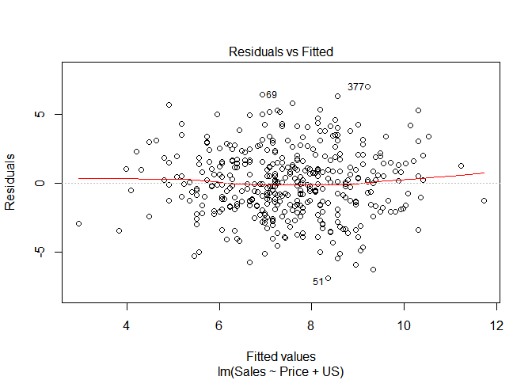<!-- -->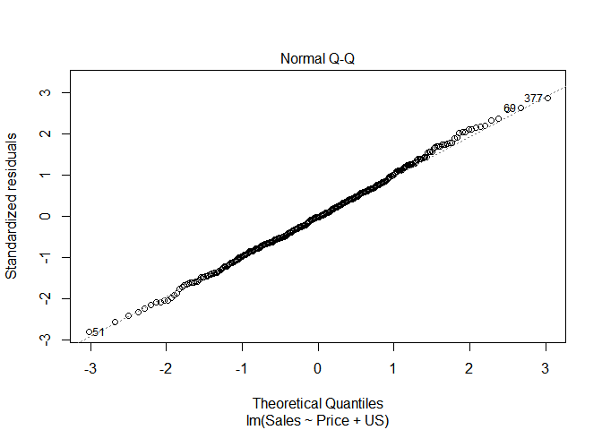<!-- -->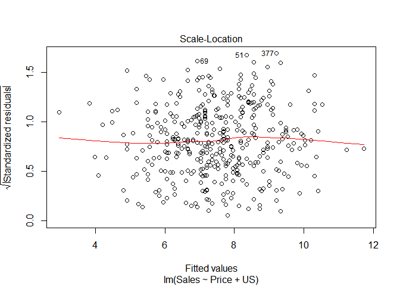<!-- -->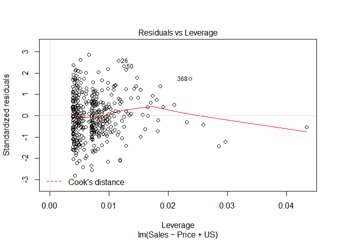<!-- -->
