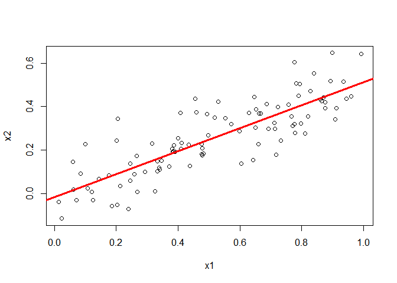

# chapter3-4
Min-Yao  
2018年1月3日  

# 2. Carefully explain the differences between the KNN classifier and KNN regression methods.

> KNN classifier:  Given a positive integer K and a test observation x 0 , the KNN classifier first identifies the K points in the training data that are closest to x 0 , represented by N 0 . It then estimates the conditional probability for class j as the fraction of points in N 0 whose response values equal j. Finally, KNN applies Bayes rule and classifies the test observation x 0 to the class with the largest probability.

> KNN regression:  Given a value for K and a prediction point x 0 , KNN
regression first identifies the K training observations that are closest to
x 0 , represented by N 0 . It then estimates f(x 0 ) using the average of all the training responses in N 0 . 


# 14. This problem focuses on the collinearity problem.
(a) Perform the following commands in R:


```r
set.seed (1)
x1 = runif (100)
x2 = 0.5* x1 + rnorm (100) /10
y=2+2* x1 +0.3* x2+rnorm (100)
```

The last line corresponds to creating a linear model in which y is
a function of x1 and x2. Write out the form of the linear model.
What are the regression coefficients?

> The regression coefficient of x1 is 2. The regression coefficient of x2 is 0.3.

(b) What is the correlation between x1 and x2? Create a scatterplot
displaying the relationship between the variables.


```r
lm.fitx=lm(x2~x1)
summary(lm.fitx)
```

```
## 
## Call:
## lm(formula = x2 ~ x1)
## 
## Residuals:
##       Min        1Q    Median        3Q       Max 
## -0.184978 -0.056222 -0.008707  0.052427  0.251661 
## 
## Coefficients:
##             Estimate Std. Error t value Pr(>|t|)    
## (Intercept) -0.01793    0.02058  -0.871    0.386    
## x1           0.53123    0.03535  15.030   <2e-16 ***
## ---
## Signif. codes:  0 '***' 0.001 '**' 0.01 '*' 0.05 '.' 0.1 ' ' 1
## 
## Residual standard error: 0.09411 on 98 degrees of freedom
## Multiple R-squared:  0.6974,	Adjusted R-squared:  0.6943 
## F-statistic: 225.9 on 1 and 98 DF,  p-value: < 2.2e-16
```

```r
cor(x1,x2)
```

```
## [1] 0.8351212
```

```r
plot(x1,x2)
abline(lm.fitx,lwd=3,col="red")
```

<!-- -->


(c) Using this data, fit a least squares regression to predict y using
x1 and x2. Describe the results obtained. What are
ˆ
β 0 ,
ˆ
β 1 , and
ˆ
β 2 ? How do these relate to the true β 0 , β 1 , and β 2 ? Can you
reject the null hypothesis H 0 : β 1 = 0? How about the null
hypothesis H 0 : β 2 = 0?

(d) Now fit a least squares regression to predict y using only x1.
Comment on your results. Can you reject the null hypothesis
H 0 : β 1 = 0?

(e) Now fit a least squares regression to predict y using only x2.
Comment on your results. Can you reject the null hypothesis
H 0 : β 1 = 0?

(f) Do the results obtained in (c)–(e) contradict each other? Explain
your answer.

(g) Now suppose we obtain one additional observation, which was
unfortunately mismeasured.
> x1=c(x1 , 0.1)
> x2=c(x2 , 0.8)
> y=c(y ,6)
Re-fit the linear models from (c) to (e) using this new data. What
effect does this new observation have on the each of the models?
In each model, is this observation an outlier? A high-leverage
point? Both? Explain your answers.


