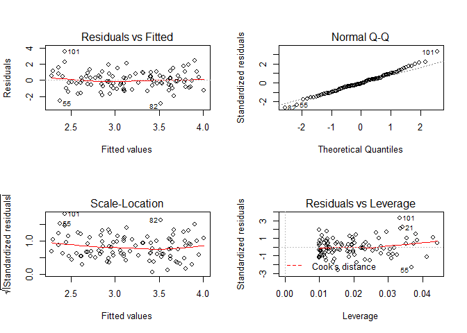

# chapter3-4
Min-Yao  
2018年1月3日  

# 2. Carefully explain the differences between the KNN classifier and KNN regression methods.

> KNN classifier:  Given a positive integer K and a test observation x 0 , the KNN classifier first identifies the K points in the training data that are closest to x 0 , represented by N 0 . It then estimates the conditional probability for class j as the fraction of points in N 0 whose response values equal j. Finally, KNN applies Bayes rule and classifies the test observation x 0 to the class with the largest probability.

> KNN regression:  Given a value for K and a prediction point x 0 , KNN
regression first identifies the K training observations that are closest to
x 0 , represented by N 0 . It then estimates f(x 0 ) using the average of all the training responses in N 0 . 


# 14. This problem focuses on the collinearity problem.
(a) Perform the following commands in R:


```r
set.seed (1)
x1 = runif (100)
x2 = 0.5* x1 + rnorm (100) /10
y = 2+2* x1 +0.3* x2+rnorm (100)
```

The last line corresponds to creating a linear model in which y is
a function of x1 and x2. Write out the form of the linear model.
What are the regression coefficients?

> The regression coefficient of x1 is 2. The regression coefficient of x2 is 0.3.

(b) What is the correlation between x1 and x2? Create a scatterplot
displaying the relationship between the variables.


```r
lm.fitx=lm(x2~x1)
summary(lm.fitx)
```

```
## 
## Call:
## lm(formula = x2 ~ x1)
## 
## Residuals:
##       Min        1Q    Median        3Q       Max 
## -0.184978 -0.056222 -0.008707  0.052427  0.251661 
## 
## Coefficients:
##             Estimate Std. Error t value Pr(>|t|)    
## (Intercept) -0.01793    0.02058  -0.871    0.386    
## x1           0.53123    0.03535  15.030   <2e-16 ***
## ---
## Signif. codes:  0 '***' 0.001 '**' 0.01 '*' 0.05 '.' 0.1 ' ' 1
## 
## Residual standard error: 0.09411 on 98 degrees of freedom
## Multiple R-squared:  0.6974,	Adjusted R-squared:  0.6943 
## F-statistic: 225.9 on 1 and 98 DF,  p-value: < 2.2e-16
```

```r
cor(x1,x2)
```

```
## [1] 0.8351212
```

```r
plot(x1,x2)
abline(lm.fitx,lwd=3,col="red")
```

<!-- -->

(c) Using this data, fit a least squares regression to predict y using
x1 and x2. Describe the results obtained. What are ˆβ 0 , ˆβ 1 , and ˆβ 2 ? How do these relate to the true β 0 , β 1 , and β 2 ? Can you reject the null hypothesis H 0 : β 1 = 0? How about the null hypothesis H 0 : β 2 = 0?


```r
lm.fity=lm(y ~ x1 + x2)
summary(lm.fity)
```

```
## 
## Call:
## lm(formula = y ~ x1 + x2)
## 
## Residuals:
##     Min      1Q  Median      3Q     Max 
## -2.8311 -0.7273 -0.0537  0.6338  2.3359 
## 
## Coefficients:
##             Estimate Std. Error t value Pr(>|t|)    
## (Intercept)   2.1305     0.2319   9.188 7.61e-15 ***
## x1            1.4396     0.7212   1.996   0.0487 *  
## x2            1.0097     1.1337   0.891   0.3754    
## ---
## Signif. codes:  0 '***' 0.001 '**' 0.01 '*' 0.05 '.' 0.1 ' ' 1
## 
## Residual standard error: 1.056 on 97 degrees of freedom
## Multiple R-squared:  0.2088,	Adjusted R-squared:  0.1925 
## F-statistic:  12.8 on 2 and 97 DF,  p-value: 1.164e-05
```

> ˆβ 0 = 2.1305, ˆβ 1 = 1.4396, ˆβ 2 = 1.0097

> Yes, we can reject the null hypothesis H 0 : β 1 = 0, because Pr(>|t|) = 0.0487.

> No, we cannot reject the null hypothesis H 0 : β 2 = 0, because Pr(>|t|) = 0.3754.

(d) Now fit a least squares regression to predict y using only x1.
Comment on your results. Can you reject the null hypothesis
H 0 : β 1 = 0?


```r
lm.fit.y.x1=lm(y ~ x1)
summary(lm.fit.y.x1)
```

```
## 
## Call:
## lm(formula = y ~ x1)
## 
## Residuals:
##      Min       1Q   Median       3Q      Max 
## -2.89495 -0.66874 -0.07785  0.59221  2.45560 
## 
## Coefficients:
##             Estimate Std. Error t value Pr(>|t|)    
## (Intercept)   2.1124     0.2307   9.155 8.27e-15 ***
## x1            1.9759     0.3963   4.986 2.66e-06 ***
## ---
## Signif. codes:  0 '***' 0.001 '**' 0.01 '*' 0.05 '.' 0.1 ' ' 1
## 
## Residual standard error: 1.055 on 98 degrees of freedom
## Multiple R-squared:  0.2024,	Adjusted R-squared:  0.1942 
## F-statistic: 24.86 on 1 and 98 DF,  p-value: 2.661e-06
```

> Yes, we reject the null hypothesis H 0 : β 1 = 0 because Pr(>|t|) = 2.66e-06.

(e) Now fit a least squares regression to predict y using only x2.
Comment on your results. Can you reject the null hypothesis
H 0 : β 1 = 0?


```r
lm.fit.y.x2=lm(y ~ x2)
summary(lm.fit.y.x2)
```

```
## 
## Call:
## lm(formula = y ~ x2)
## 
## Residuals:
##      Min       1Q   Median       3Q      Max 
## -2.62687 -0.75156 -0.03598  0.72383  2.44890 
## 
## Coefficients:
##             Estimate Std. Error t value Pr(>|t|)    
## (Intercept)   2.3899     0.1949   12.26  < 2e-16 ***
## x2            2.8996     0.6330    4.58 1.37e-05 ***
## ---
## Signif. codes:  0 '***' 0.001 '**' 0.01 '*' 0.05 '.' 0.1 ' ' 1
## 
## Residual standard error: 1.072 on 98 degrees of freedom
## Multiple R-squared:  0.1763,	Adjusted R-squared:  0.1679 
## F-statistic: 20.98 on 1 and 98 DF,  p-value: 1.366e-05
```

> Yes, we reject the null hypothesis H 0 : β 2 = 0, because Pr(>|t|) = 1.37e-05.

(f) Do the results obtained in (c)–(e) contradict each other? Explain
your answer.

> Yes, we reject the null hypothesis H 0 : β 2 = 0 in (e), but we cannot reject the null hypothesis H 0 : β 2 = 0 in (c). This may because of the collinearity between x1 and x2, so we calculate their VIF. 

>  The variance inflation factor (VIF) is the ratio of the variance of ˆβ j when fitting the full model divided by the variance of ˆβ j if fit on its own. The smallest possible value for VIF is 1, which indicates the complete absence of collinearity. Typically in practice there is a small amount of collinearity among the predictors. As a rule of thumb, a VIF value that exceeds 5 or 10 indicates a problematic amount of collinearity.


```r
library(car)
vif(lm.fity)
```

```
##       x1       x2 
## 3.304993 3.304993
```


(g) Now suppose we obtain one additional observation, which was
unfortunately mismeasured.


```r
x1=c(x1 , 0.1)
x2=c(x2 , 0.8)
y=c(y ,6)
```

Re-fit the linear models from (c) to (e) using this new data. What
effect does this new observation have on the each of the models?
In each model, is this observation an outlier? A high-leverage
point? Both? Explain your answers.


```r
lm.fitx=lm(x2~x1)
summary(lm.fitx)
```

```
## 
## Call:
## lm(formula = x2 ~ x1)
## 
## Residuals:
##      Min       1Q   Median       3Q      Max 
## -0.20050 -0.06678 -0.01617  0.05271  0.73921 
## 
## Coefficients:
##             Estimate Std. Error t value Pr(>|t|)    
## (Intercept)  0.01202    0.02587   0.465    0.643    
## x1           0.48766    0.04465  10.922   <2e-16 ***
## ---
## Signif. codes:  0 '***' 0.001 '**' 0.01 '*' 0.05 '.' 0.1 ' ' 1
## 
## Residual standard error: 0.1203 on 99 degrees of freedom
## Multiple R-squared:  0.5465,	Adjusted R-squared:  0.5419 
## F-statistic: 119.3 on 1 and 99 DF,  p-value: < 2.2e-16
```

```r
plot(x1,x2)
abline(lm.fitx,lwd=3,col="red")
```

<!-- -->

```r
lm.fity=lm(y ~ x1 + x2)
summary(lm.fity)
```

```
## 
## Call:
## lm(formula = y ~ x1 + x2)
## 
## Residuals:
##      Min       1Q   Median       3Q      Max 
## -2.73348 -0.69318 -0.05263  0.66385  2.30619 
## 
## Coefficients:
##             Estimate Std. Error t value Pr(>|t|)    
## (Intercept)   2.2267     0.2314   9.624 7.91e-16 ***
## x1            0.5394     0.5922   0.911  0.36458    
## x2            2.5146     0.8977   2.801  0.00614 ** 
## ---
## Signif. codes:  0 '***' 0.001 '**' 0.01 '*' 0.05 '.' 0.1 ' ' 1
## 
## Residual standard error: 1.075 on 98 degrees of freedom
## Multiple R-squared:  0.2188,	Adjusted R-squared:  0.2029 
## F-statistic: 13.72 on 2 and 98 DF,  p-value: 5.564e-06
```

```r
par(mfrow=c(2,2))
plot(lm.fity)
```

<!-- -->

```r
lm.fit.y.x1=lm(y ~ x1)
summary(lm.fit.y.x1)
```

```
## 
## Call:
## lm(formula = y ~ x1)
## 
## Residuals:
##     Min      1Q  Median      3Q     Max 
## -2.8897 -0.6556 -0.0909  0.5682  3.5665 
## 
## Coefficients:
##             Estimate Std. Error t value Pr(>|t|)    
## (Intercept)   2.2569     0.2390   9.445 1.78e-15 ***
## x1            1.7657     0.4124   4.282 4.29e-05 ***
## ---
## Signif. codes:  0 '***' 0.001 '**' 0.01 '*' 0.05 '.' 0.1 ' ' 1
## 
## Residual standard error: 1.111 on 99 degrees of freedom
## Multiple R-squared:  0.1562,	Adjusted R-squared:  0.1477 
## F-statistic: 18.33 on 1 and 99 DF,  p-value: 4.295e-05
```

```r
par(mfrow=c(1,1))
plot(x1,y)
abline(lm.fit.y.x1,lwd=3,col="red")
```

<!-- -->

```r
par(mfrow=c(2,2))
plot(lm.fit.y.x1)
```

<!-- -->

```r
lm.fit.y.x2=lm(y ~ x2)
summary(lm.fit.y.x2)
```

```
## 
## Call:
## lm(formula = y ~ x2)
## 
## Residuals:
##      Min       1Q   Median       3Q      Max 
## -2.64729 -0.71021 -0.06899  0.72699  2.38074 
## 
## Coefficients:
##             Estimate Std. Error t value Pr(>|t|)    
## (Intercept)   2.3451     0.1912  12.264  < 2e-16 ***
## x2            3.1190     0.6040   5.164 1.25e-06 ***
## ---
## Signif. codes:  0 '***' 0.001 '**' 0.01 '*' 0.05 '.' 0.1 ' ' 1
## 
## Residual standard error: 1.074 on 99 degrees of freedom
## Multiple R-squared:  0.2122,	Adjusted R-squared:  0.2042 
## F-statistic: 26.66 on 1 and 99 DF,  p-value: 1.253e-06
```

```r
par(mfrow=c(1,1))
plot(x2,y)
abline(lm.fit.y.x2,lwd=3,col="red")
```

<!-- -->

```r
par(mfrow=c(2,2))
plot(lm.fit.y.x2)
```

<!-- -->

> For the `y ~ x1 + x2` model, x1 is not significant (Pr(>|t|)=0.94) but x2 is significant (Pr(>|t|)=1.96e-06). However, for the `y ~ x1` model, x1 is significant (Pr(>|t|)=0.002).

> For the `y ~ x1 + x2` and `y ~ x2` model, this observation is a high-leverage point. For the `y ~ x1` model, this observation is an outlier.

