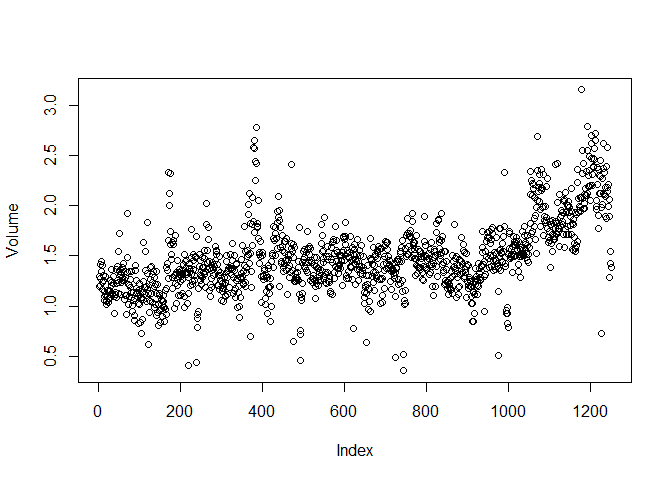
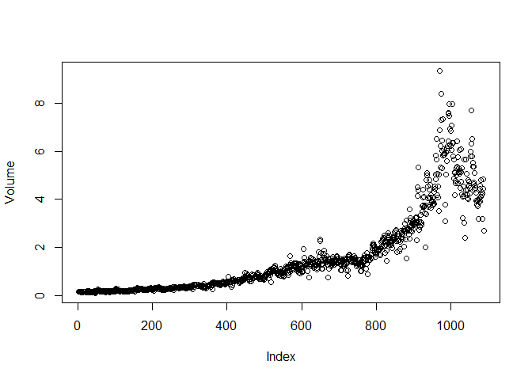

# chapter4-1
Min-Yao  
2018年1月16日  
# Chapter 4 Lab: Logistic Regression, LDA, QDA, and KNN

# The Stock Market Data


```r
library(ISLR)
names(Smarket)
```

```
## [1] "Year"      "Lag1"      "Lag2"      "Lag3"      "Lag4"      "Lag5"     
## [7] "Volume"    "Today"     "Direction"
```

```r
dim(Smarket)
```

```
## [1] 1250    9
```

```r
summary(Smarket)
```

```
##       Year           Lag1                Lag2          
##  Min.   :2001   Min.   :-4.922000   Min.   :-4.922000  
##  1st Qu.:2002   1st Qu.:-0.639500   1st Qu.:-0.639500  
##  Median :2003   Median : 0.039000   Median : 0.039000  
##  Mean   :2003   Mean   : 0.003834   Mean   : 0.003919  
##  3rd Qu.:2004   3rd Qu.: 0.596750   3rd Qu.: 0.596750  
##  Max.   :2005   Max.   : 5.733000   Max.   : 5.733000  
##       Lag3                Lag4                Lag5         
##  Min.   :-4.922000   Min.   :-4.922000   Min.   :-4.92200  
##  1st Qu.:-0.640000   1st Qu.:-0.640000   1st Qu.:-0.64000  
##  Median : 0.038500   Median : 0.038500   Median : 0.03850  
##  Mean   : 0.001716   Mean   : 0.001636   Mean   : 0.00561  
##  3rd Qu.: 0.596750   3rd Qu.: 0.596750   3rd Qu.: 0.59700  
##  Max.   : 5.733000   Max.   : 5.733000   Max.   : 5.73300  
##      Volume           Today           Direction 
##  Min.   :0.3561   Min.   :-4.922000   Down:602  
##  1st Qu.:1.2574   1st Qu.:-0.639500   Up  :648  
##  Median :1.4229   Median : 0.038500             
##  Mean   :1.4783   Mean   : 0.003138             
##  3rd Qu.:1.6417   3rd Qu.: 0.596750             
##  Max.   :3.1525   Max.   : 5.733000
```

```r
pairs(Smarket)
```

<!-- -->

```r
#cor(Smarket)
cor(Smarket[,-9])
```

```
##              Year         Lag1         Lag2         Lag3         Lag4
## Year   1.00000000  0.029699649  0.030596422  0.033194581  0.035688718
## Lag1   0.02969965  1.000000000 -0.026294328 -0.010803402 -0.002985911
## Lag2   0.03059642 -0.026294328  1.000000000 -0.025896670 -0.010853533
## Lag3   0.03319458 -0.010803402 -0.025896670  1.000000000 -0.024051036
## Lag4   0.03568872 -0.002985911 -0.010853533 -0.024051036  1.000000000
## Lag5   0.02978799 -0.005674606 -0.003557949 -0.018808338 -0.027083641
## Volume 0.53900647  0.040909908 -0.043383215 -0.041823686 -0.048414246
## Today  0.03009523 -0.026155045 -0.010250033 -0.002447647 -0.006899527
##                Lag5      Volume        Today
## Year    0.029787995  0.53900647  0.030095229
## Lag1   -0.005674606  0.04090991 -0.026155045
## Lag2   -0.003557949 -0.04338321 -0.010250033
## Lag3   -0.018808338 -0.04182369 -0.002447647
## Lag4   -0.027083641 -0.04841425 -0.006899527
## Lag5    1.000000000 -0.02200231 -0.034860083
## Volume -0.022002315  1.00000000  0.014591823
## Today  -0.034860083  0.01459182  1.000000000
```

```r
attach(Smarket)
plot(Volume)
```

<!-- -->

# Logistic Regression


```r
glm.fits=glm(Direction~Lag1+Lag2+Lag3+Lag4+Lag5+Volume,data=Smarket,family=binomial)
summary(glm.fits)
```

```
## 
## Call:
## glm(formula = Direction ~ Lag1 + Lag2 + Lag3 + Lag4 + Lag5 + 
##     Volume, family = binomial, data = Smarket)
## 
## Deviance Residuals: 
##    Min      1Q  Median      3Q     Max  
## -1.446  -1.203   1.065   1.145   1.326  
## 
## Coefficients:
##              Estimate Std. Error z value Pr(>|z|)
## (Intercept) -0.126000   0.240736  -0.523    0.601
## Lag1        -0.073074   0.050167  -1.457    0.145
## Lag2        -0.042301   0.050086  -0.845    0.398
## Lag3         0.011085   0.049939   0.222    0.824
## Lag4         0.009359   0.049974   0.187    0.851
## Lag5         0.010313   0.049511   0.208    0.835
## Volume       0.135441   0.158360   0.855    0.392
## 
## (Dispersion parameter for binomial family taken to be 1)
## 
##     Null deviance: 1731.2  on 1249  degrees of freedom
## Residual deviance: 1727.6  on 1243  degrees of freedom
## AIC: 1741.6
## 
## Number of Fisher Scoring iterations: 3
```

```r
coef(glm.fits)
```

```
##  (Intercept)         Lag1         Lag2         Lag3         Lag4 
## -0.126000257 -0.073073746 -0.042301344  0.011085108  0.009358938 
##         Lag5       Volume 
##  0.010313068  0.135440659
```

```r
summary(glm.fits)$coef
```

```
##                 Estimate Std. Error    z value  Pr(>|z|)
## (Intercept) -0.126000257 0.24073574 -0.5233966 0.6006983
## Lag1        -0.073073746 0.05016739 -1.4565986 0.1452272
## Lag2        -0.042301344 0.05008605 -0.8445733 0.3983491
## Lag3         0.011085108 0.04993854  0.2219750 0.8243333
## Lag4         0.009358938 0.04997413  0.1872757 0.8514445
## Lag5         0.010313068 0.04951146  0.2082966 0.8349974
## Volume       0.135440659 0.15835970  0.8552723 0.3924004
```

```r
summary(glm.fits)$coef[,4]
```

```
## (Intercept)        Lag1        Lag2        Lag3        Lag4        Lag5 
##   0.6006983   0.1452272   0.3983491   0.8243333   0.8514445   0.8349974 
##      Volume 
##   0.3924004
```


```r
glm.probs=predict(glm.fits,type="response")
glm.probs[1:10]
```

```
##         1         2         3         4         5         6         7 
## 0.5070841 0.4814679 0.4811388 0.5152224 0.5107812 0.5069565 0.4926509 
##         8         9        10 
## 0.5092292 0.5176135 0.4888378
```

```r
contrasts(Direction)
```

```
##      Up
## Down  0
## Up    1
```

```r
glm.pred=rep("Down",1250)
glm.pred[glm.probs>.5]="Up"
table(glm.pred,Direction)
```

```
##         Direction
## glm.pred Down  Up
##     Down  145 141
##     Up    457 507
```

```r
(507+145)/1250
```

```
## [1] 0.5216
```

```r
mean(glm.pred==Direction)
```

```
## [1] 0.5216
```


```r
train=(Year<2005)
Smarket.2005=Smarket[!train,]
dim(Smarket.2005)
```

```
## [1] 252   9
```

```r
Direction.2005=Direction[!train]
```


```r
glm.fits=glm(Direction~Lag1+Lag2+Lag3+Lag4+Lag5+Volume,data=Smarket,family=binomial,subset=train)
glm.probs=predict(glm.fits,Smarket.2005,type="response")
glm.pred=rep("Down",252)
glm.pred[glm.probs>.5]="Up"
table(glm.pred,Direction.2005)
```

```
##         Direction.2005
## glm.pred Down Up
##     Down   77 97
##     Up     34 44
```

```r
mean(glm.pred==Direction.2005)
```

```
## [1] 0.4801587
```

```r
mean(glm.pred!=Direction.2005)
```

```
## [1] 0.5198413
```


```r
glm.fits=glm(Direction~Lag1+Lag2,data=Smarket,family=binomial,subset=train)
glm.probs=predict(glm.fits,Smarket.2005,type="response")
glm.pred=rep("Down",252)
glm.pred[glm.probs>.5]="Up"
table(glm.pred,Direction.2005)
```

```
##         Direction.2005
## glm.pred Down  Up
##     Down   35  35
##     Up     76 106
```

```r
mean(glm.pred==Direction.2005)
```

```
## [1] 0.5595238
```

```r
106/(106+76)
```

```
## [1] 0.5824176
```

```r
predict(glm.fits,newdata=data.frame(Lag1=c(1.2,1.5),Lag2=c(1.1,-0.8)),type="response")
```

```
##         1         2 
## 0.4791462 0.4960939
```

6. Suppose we collect data for a group of students in a statistics class
with variables X 1 = hours studied, X 2 = undergrad GPA, and Y =
receive an A. We fit a logistic regression and produce estimated
coefficient, ˆβ 0 = − 6, ˆβ 1 = 0.05, ˆβ 2 = 1.

(a) Estimate the probability that a student who studies for 40 h and
has an undergrad GPA of 3.5 gets an A in the class.


```r
p = exp(-6+0.05*40+1*3.5) / (1 + exp(-6+0.05*40+1*3.5))
p
```

```
## [1] 0.3775407
```

> probability = 0.3775407

(b) How many hours would the student in part (a) need to study to
have a 50 % chance of getting an A in the class?

`log(p/(1-p)) = ˆβ 0+ β 1*X1 + β 2*X2`


```r
X1 = (log(0.5/(1-0.5)) - (-6) - 1*3.5)/0.05
X1
```

```
## [1] 50
```

> 50 hours

10. This question should be answered using the Weekly data set, which
is part of the ISLR package. This data is similar in nature to the
Smarket data from this chapter’s lab, except that it contains 1, 089
weekly returns for 21 years, from the beginning of 1990 to the end of
2010.
(a) Produce some numerical and graphical summaries of the Weekly
data. Do there appear to be any patterns?


```r
library(ISLR)
names(Weekly)
```

```
## [1] "Year"      "Lag1"      "Lag2"      "Lag3"      "Lag4"      "Lag5"     
## [7] "Volume"    "Today"     "Direction"
```

```r
dim(Weekly)
```

```
## [1] 1089    9
```

```r
summary(Weekly)
```

```
##       Year           Lag1               Lag2               Lag3         
##  Min.   :1990   Min.   :-18.1950   Min.   :-18.1950   Min.   :-18.1950  
##  1st Qu.:1995   1st Qu.: -1.1540   1st Qu.: -1.1540   1st Qu.: -1.1580  
##  Median :2000   Median :  0.2410   Median :  0.2410   Median :  0.2410  
##  Mean   :2000   Mean   :  0.1506   Mean   :  0.1511   Mean   :  0.1472  
##  3rd Qu.:2005   3rd Qu.:  1.4050   3rd Qu.:  1.4090   3rd Qu.:  1.4090  
##  Max.   :2010   Max.   : 12.0260   Max.   : 12.0260   Max.   : 12.0260  
##       Lag4               Lag5              Volume       
##  Min.   :-18.1950   Min.   :-18.1950   Min.   :0.08747  
##  1st Qu.: -1.1580   1st Qu.: -1.1660   1st Qu.:0.33202  
##  Median :  0.2380   Median :  0.2340   Median :1.00268  
##  Mean   :  0.1458   Mean   :  0.1399   Mean   :1.57462  
##  3rd Qu.:  1.4090   3rd Qu.:  1.4050   3rd Qu.:2.05373  
##  Max.   : 12.0260   Max.   : 12.0260   Max.   :9.32821  
##      Today          Direction 
##  Min.   :-18.1950   Down:484  
##  1st Qu.: -1.1540   Up  :605  
##  Median :  0.2410             
##  Mean   :  0.1499             
##  3rd Qu.:  1.4050             
##  Max.   : 12.0260
```

```r
pairs(Weekly)
```

<!-- -->

```r
cor(Weekly[,-9])
```

```
##               Year         Lag1        Lag2        Lag3         Lag4
## Year    1.00000000 -0.032289274 -0.03339001 -0.03000649 -0.031127923
## Lag1   -0.03228927  1.000000000 -0.07485305  0.05863568 -0.071273876
## Lag2   -0.03339001 -0.074853051  1.00000000 -0.07572091  0.058381535
## Lag3   -0.03000649  0.058635682 -0.07572091  1.00000000 -0.075395865
## Lag4   -0.03112792 -0.071273876  0.05838153 -0.07539587  1.000000000
## Lag5   -0.03051910 -0.008183096 -0.07249948  0.06065717 -0.075675027
## Volume  0.84194162 -0.064951313 -0.08551314 -0.06928771 -0.061074617
## Today  -0.03245989 -0.075031842  0.05916672 -0.07124364 -0.007825873
##                Lag5      Volume        Today
## Year   -0.030519101  0.84194162 -0.032459894
## Lag1   -0.008183096 -0.06495131 -0.075031842
## Lag2   -0.072499482 -0.08551314  0.059166717
## Lag3    0.060657175 -0.06928771 -0.071243639
## Lag4   -0.075675027 -0.06107462 -0.007825873
## Lag5    1.000000000 -0.05851741  0.011012698
## Volume -0.058517414  1.00000000 -0.033077783
## Today   0.011012698 -0.03307778  1.000000000
```

```r
attach(Weekly)
```

```
## The following objects are masked from Smarket:
## 
##     Direction, Lag1, Lag2, Lag3, Lag4, Lag5, Today, Volume, Year
```

```r
plot(Volume)
```

<!-- -->

>  Volume is increasing over time but decreasing recently.  In other words, the average number of shares traded daily increased and then decreased.

(b) Use the full data set to perform a logistic regression with
Direction as the response and the five lag variables plus Volume
as predictors. Use the summary function to print the results. Do
any of the predictors appear to be statistically significant? If so,
which ones?


```r
glm.fits.Weekly=glm(Direction~Lag1+Lag2+Lag3+Lag4+Lag5+Volume,data=Weekly,family=binomial)
summary(glm.fits.Weekly)
```

```
## 
## Call:
## glm(formula = Direction ~ Lag1 + Lag2 + Lag3 + Lag4 + Lag5 + 
##     Volume, family = binomial, data = Weekly)
## 
## Deviance Residuals: 
##     Min       1Q   Median       3Q      Max  
## -1.6949  -1.2565   0.9913   1.0849   1.4579  
## 
## Coefficients:
##             Estimate Std. Error z value Pr(>|z|)   
## (Intercept)  0.26686    0.08593   3.106   0.0019 **
## Lag1        -0.04127    0.02641  -1.563   0.1181   
## Lag2         0.05844    0.02686   2.175   0.0296 * 
## Lag3        -0.01606    0.02666  -0.602   0.5469   
## Lag4        -0.02779    0.02646  -1.050   0.2937   
## Lag5        -0.01447    0.02638  -0.549   0.5833   
## Volume      -0.02274    0.03690  -0.616   0.5377   
## ---
## Signif. codes:  0 '***' 0.001 '**' 0.01 '*' 0.05 '.' 0.1 ' ' 1
## 
## (Dispersion parameter for binomial family taken to be 1)
## 
##     Null deviance: 1496.2  on 1088  degrees of freedom
## Residual deviance: 1486.4  on 1082  degrees of freedom
## AIC: 1500.4
## 
## Number of Fisher Scoring iterations: 4
```

```r
coef(glm.fits.Weekly)
```

```
## (Intercept)        Lag1        Lag2        Lag3        Lag4        Lag5 
##  0.26686414 -0.04126894  0.05844168 -0.01606114 -0.02779021 -0.01447206 
##      Volume 
## -0.02274153
```

```r
summary(glm.fits.Weekly)$coef
```

```
##                Estimate Std. Error    z value    Pr(>|z|)
## (Intercept)  0.26686414 0.08592961  3.1056134 0.001898848
## Lag1        -0.04126894 0.02641026 -1.5626099 0.118144368
## Lag2         0.05844168 0.02686499  2.1753839 0.029601361
## Lag3        -0.01606114 0.02666299 -0.6023760 0.546923890
## Lag4        -0.02779021 0.02646332 -1.0501409 0.293653342
## Lag5        -0.01447206 0.02638478 -0.5485006 0.583348244
## Volume      -0.02274153 0.03689812 -0.6163330 0.537674762
```

> Yes, Lag2 appears to be statistically significant.

(c) Compute the confusion matrix and overall fraction of correct
predictions. Explain what the confusion matrix is telling you
about the types of mistakes made by logistic regression.


```r
glm.probs.Weekly=predict(glm.fits.Weekly,type="response")

glm.pred.Weekly=rep("Down",1089)
glm.pred.Weekly[glm.probs.Weekly>.5]="Up"
table(glm.pred.Weekly,Direction)
```

```
##                Direction
## glm.pred.Weekly Down  Up
##            Down   54  48
##            Up    430 557
```

```r
(54+557)/1089
```

```
## [1] 0.5610652
```

```r
mean(glm.pred.Weekly==Direction)
```

```
## [1] 0.5610652
```

> 430 type I error (false positive), 48 type II error (false negative)

(d) Now fit the logistic regression model using a training data period
from 1990 to 2008, with Lag2 as the only predictor. Compute the
confusion matrix and the overall fraction of correct predictions
for the held out data (that is, the data from 2009 and 2010).


```r
train.1990to2008=(Year<2009)
Weekly.2009to2010=Weekly[!train.1990to2008,]
dim(Weekly.2009to2010)
```

```
## [1] 104   9
```

```r
Direction.1990to2008=Direction[!train.1990to2008]

glm.fits.Lag2=glm(Direction~Lag2,data=Weekly,family=binomial,subset=train.1990to2008)

glm.probs=predict(glm.fits.Lag2,Weekly.2009to2010,type="response")
glm.pred=rep("Down",104)
glm.pred[glm.probs>.5]="Up"
table(glm.pred,Direction.1990to2008)
```

```
##         Direction.1990to2008
## glm.pred Down Up
##     Down    9  5
##     Up     34 56
```

```r
mean(glm.pred==Direction.1990to2008)
```

```
## [1] 0.625
```

```r
(9+56)/104
```

```
## [1] 0.625
```

> 62.5%  accuracy rate

11. In this problem, you will develop a model to predict whether a given
car gets high or low gas mileage based on the Auto data set.

(a) Create a binary variable, mpg01, that contains a 1 if mpg contains
a value above its median, and a 0 if mpg contains a value below
its median. You can compute the median using the median()
function. Note you may find it helpful to use the data.frame()
function to create a single data set containing both mpg01 and
the other Auto variables.


```r
library(ISLR)
names(Auto)
```

```
## [1] "mpg"          "cylinders"    "displacement" "horsepower"  
## [5] "weight"       "acceleration" "year"         "origin"      
## [9] "name"
```

```r
dim(Auto)
```

```
## [1] 392   9
```

```r
summary(Auto)
```

```
##       mpg          cylinders      displacement     horsepower   
##  Min.   : 9.00   Min.   :3.000   Min.   : 68.0   Min.   : 46.0  
##  1st Qu.:17.00   1st Qu.:4.000   1st Qu.:105.0   1st Qu.: 75.0  
##  Median :22.75   Median :4.000   Median :151.0   Median : 93.5  
##  Mean   :23.45   Mean   :5.472   Mean   :194.4   Mean   :104.5  
##  3rd Qu.:29.00   3rd Qu.:8.000   3rd Qu.:275.8   3rd Qu.:126.0  
##  Max.   :46.60   Max.   :8.000   Max.   :455.0   Max.   :230.0  
##                                                                 
##      weight      acceleration        year           origin     
##  Min.   :1613   Min.   : 8.00   Min.   :70.00   Min.   :1.000  
##  1st Qu.:2225   1st Qu.:13.78   1st Qu.:73.00   1st Qu.:1.000  
##  Median :2804   Median :15.50   Median :76.00   Median :1.000  
##  Mean   :2978   Mean   :15.54   Mean   :75.98   Mean   :1.577  
##  3rd Qu.:3615   3rd Qu.:17.02   3rd Qu.:79.00   3rd Qu.:2.000  
##  Max.   :5140   Max.   :24.80   Max.   :82.00   Max.   :3.000  
##                                                                
##                  name    
##  amc matador       :  5  
##  ford pinto        :  5  
##  toyota corolla    :  5  
##  amc gremlin       :  4  
##  amc hornet        :  4  
##  chevrolet chevette:  4  
##  (Other)           :365
```

```r
attach(Auto)
median(mpg)
```

```
## [1] 22.75
```

```r
#22.75

mpg01=rep(0,392)
mpg01[mpg>22.75]=1
mpg01
```

```
##   [1] 0 0 0 0 0 0 0 0 0 0 0 0 0 0 1 0 0 0 1 1 1 1 1 1 0 0 0 0 0 1 1 1 0 0 0
##  [36] 0 0 0 0 0 0 0 0 0 0 0 0 0 1 1 1 1 1 1 1 1 1 1 1 0 0 0 0 0 0 0 0 0 0 0
##  [71] 0 0 0 0 0 0 0 0 1 0 1 1 1 1 0 0 0 0 0 0 0 0 0 0 0 0 0 0 0 0 1 1 0 0 0
## [106] 0 0 0 0 0 0 0 0 1 0 0 1 1 0 0 0 1 0 0 0 0 0 1 1 1 1 0 0 0 0 0 0 0 0 1
## [141] 1 1 1 1 1 1 1 1 1 1 0 0 0 0 0 0 0 0 0 0 0 0 0 0 0 1 1 0 1 1 1 1 0 1 0
## [176] 1 1 0 1 1 1 1 1 1 1 0 0 0 0 0 0 1 0 1 1 1 1 0 0 0 0 1 1 1 1 0 0 0 0 0
## [211] 0 0 0 0 1 1 1 1 1 0 0 0 0 0 0 0 0 0 0 0 0 1 1 1 1 1 1 1 1 0 0 0 1 1 1
## [246] 1 1 0 0 0 0 0 0 1 0 0 0 0 0 0 0 0 0 0 1 1 1 1 0 1 1 1 0 0 0 0 1 1 0 0
## [281] 0 0 0 0 0 0 0 0 0 0 0 1 1 1 1 1 1 1 1 1 1 1 1 1 1 1 1 1 1 1 1 1 1 1 0
## [316] 1 1 1 1 1 1 1 1 1 1 1 1 1 1 1 1 1 1 1 1 1 1 1 1 1 1 1 1 1 1 1 1 1 1 1
## [351] 1 1 1 1 1 1 1 1 0 1 0 0 1 1 1 1 1 1 1 1 1 1 1 1 1 1 1 1 1 1 1 1 1 0 1
## [386] 1 1 1 1 1 1 1
```

```r
str(Auto)
```

```
## 'data.frame':	392 obs. of  9 variables:
##  $ mpg         : num  18 15 18 16 17 15 14 14 14 15 ...
##  $ cylinders   : num  8 8 8 8 8 8 8 8 8 8 ...
##  $ displacement: num  307 350 318 304 302 429 454 440 455 390 ...
##  $ horsepower  : num  130 165 150 150 140 198 220 215 225 190 ...
##  $ weight      : num  3504 3693 3436 3433 3449 ...
##  $ acceleration: num  12 11.5 11 12 10.5 10 9 8.5 10 8.5 ...
##  $ year        : num  70 70 70 70 70 70 70 70 70 70 ...
##  $ origin      : num  1 1 1 1 1 1 1 1 1 1 ...
##  $ name        : Factor w/ 304 levels "amc ambassador brougham",..: 49 36 231 14 161 141 54 223 241 2 ...
```

```r
new.Auto <- cbind(Auto, mpg01)
new.Auto
```

```
##      mpg cylinders displacement horsepower weight acceleration year origin
## 1   18.0         8        307.0        130   3504         12.0   70      1
## 2   15.0         8        350.0        165   3693         11.5   70      1
## 3   18.0         8        318.0        150   3436         11.0   70      1
## 4   16.0         8        304.0        150   3433         12.0   70      1
## 5   17.0         8        302.0        140   3449         10.5   70      1
## 6   15.0         8        429.0        198   4341         10.0   70      1
## 7   14.0         8        454.0        220   4354          9.0   70      1
## 8   14.0         8        440.0        215   4312          8.5   70      1
## 9   14.0         8        455.0        225   4425         10.0   70      1
## 10  15.0         8        390.0        190   3850          8.5   70      1
## 11  15.0         8        383.0        170   3563         10.0   70      1
## 12  14.0         8        340.0        160   3609          8.0   70      1
## 13  15.0         8        400.0        150   3761          9.5   70      1
## 14  14.0         8        455.0        225   3086         10.0   70      1
## 15  24.0         4        113.0         95   2372         15.0   70      3
## 16  22.0         6        198.0         95   2833         15.5   70      1
## 17  18.0         6        199.0         97   2774         15.5   70      1
## 18  21.0         6        200.0         85   2587         16.0   70      1
## 19  27.0         4         97.0         88   2130         14.5   70      3
## 20  26.0         4         97.0         46   1835         20.5   70      2
## 21  25.0         4        110.0         87   2672         17.5   70      2
## 22  24.0         4        107.0         90   2430         14.5   70      2
## 23  25.0         4        104.0         95   2375         17.5   70      2
## 24  26.0         4        121.0        113   2234         12.5   70      2
## 25  21.0         6        199.0         90   2648         15.0   70      1
## 26  10.0         8        360.0        215   4615         14.0   70      1
## 27  10.0         8        307.0        200   4376         15.0   70      1
## 28  11.0         8        318.0        210   4382         13.5   70      1
## 29   9.0         8        304.0        193   4732         18.5   70      1
## 30  27.0         4         97.0         88   2130         14.5   71      3
## 31  28.0         4        140.0         90   2264         15.5   71      1
## 32  25.0         4        113.0         95   2228         14.0   71      3
## 34  19.0         6        232.0        100   2634         13.0   71      1
## 35  16.0         6        225.0        105   3439         15.5   71      1
## 36  17.0         6        250.0        100   3329         15.5   71      1
## 37  19.0         6        250.0         88   3302         15.5   71      1
## 38  18.0         6        232.0        100   3288         15.5   71      1
## 39  14.0         8        350.0        165   4209         12.0   71      1
## 40  14.0         8        400.0        175   4464         11.5   71      1
## 41  14.0         8        351.0        153   4154         13.5   71      1
## 42  14.0         8        318.0        150   4096         13.0   71      1
## 43  12.0         8        383.0        180   4955         11.5   71      1
## 44  13.0         8        400.0        170   4746         12.0   71      1
## 45  13.0         8        400.0        175   5140         12.0   71      1
## 46  18.0         6        258.0        110   2962         13.5   71      1
## 47  22.0         4        140.0         72   2408         19.0   71      1
## 48  19.0         6        250.0        100   3282         15.0   71      1
## 49  18.0         6        250.0         88   3139         14.5   71      1
## 50  23.0         4        122.0         86   2220         14.0   71      1
## 51  28.0         4        116.0         90   2123         14.0   71      2
## 52  30.0         4         79.0         70   2074         19.5   71      2
## 53  30.0         4         88.0         76   2065         14.5   71      2
## 54  31.0         4         71.0         65   1773         19.0   71      3
## 55  35.0         4         72.0         69   1613         18.0   71      3
## 56  27.0         4         97.0         60   1834         19.0   71      2
## 57  26.0         4         91.0         70   1955         20.5   71      1
## 58  24.0         4        113.0         95   2278         15.5   72      3
## 59  25.0         4         97.5         80   2126         17.0   72      1
## 60  23.0         4         97.0         54   2254         23.5   72      2
## 61  20.0         4        140.0         90   2408         19.5   72      1
## 62  21.0         4        122.0         86   2226         16.5   72      1
## 63  13.0         8        350.0        165   4274         12.0   72      1
## 64  14.0         8        400.0        175   4385         12.0   72      1
## 65  15.0         8        318.0        150   4135         13.5   72      1
## 66  14.0         8        351.0        153   4129         13.0   72      1
## 67  17.0         8        304.0        150   3672         11.5   72      1
## 68  11.0         8        429.0        208   4633         11.0   72      1
## 69  13.0         8        350.0        155   4502         13.5   72      1
## 70  12.0         8        350.0        160   4456         13.5   72      1
## 71  13.0         8        400.0        190   4422         12.5   72      1
## 72  19.0         3         70.0         97   2330         13.5   72      3
## 73  15.0         8        304.0        150   3892         12.5   72      1
## 74  13.0         8        307.0        130   4098         14.0   72      1
## 75  13.0         8        302.0        140   4294         16.0   72      1
## 76  14.0         8        318.0        150   4077         14.0   72      1
## 77  18.0         4        121.0        112   2933         14.5   72      2
## 78  22.0         4        121.0         76   2511         18.0   72      2
## 79  21.0         4        120.0         87   2979         19.5   72      2
## 80  26.0         4         96.0         69   2189         18.0   72      2
## 81  22.0         4        122.0         86   2395         16.0   72      1
## 82  28.0         4         97.0         92   2288         17.0   72      3
## 83  23.0         4        120.0         97   2506         14.5   72      3
## 84  28.0         4         98.0         80   2164         15.0   72      1
## 85  27.0         4         97.0         88   2100         16.5   72      3
## 86  13.0         8        350.0        175   4100         13.0   73      1
## 87  14.0         8        304.0        150   3672         11.5   73      1
## 88  13.0         8        350.0        145   3988         13.0   73      1
## 89  14.0         8        302.0        137   4042         14.5   73      1
## 90  15.0         8        318.0        150   3777         12.5   73      1
## 91  12.0         8        429.0        198   4952         11.5   73      1
## 92  13.0         8        400.0        150   4464         12.0   73      1
## 93  13.0         8        351.0        158   4363         13.0   73      1
## 94  14.0         8        318.0        150   4237         14.5   73      1
## 95  13.0         8        440.0        215   4735         11.0   73      1
## 96  12.0         8        455.0        225   4951         11.0   73      1
## 97  13.0         8        360.0        175   3821         11.0   73      1
## 98  18.0         6        225.0        105   3121         16.5   73      1
## 99  16.0         6        250.0        100   3278         18.0   73      1
## 100 18.0         6        232.0        100   2945         16.0   73      1
## 101 18.0         6        250.0         88   3021         16.5   73      1
## 102 23.0         6        198.0         95   2904         16.0   73      1
## 103 26.0         4         97.0         46   1950         21.0   73      2
## 104 11.0         8        400.0        150   4997         14.0   73      1
## 105 12.0         8        400.0        167   4906         12.5   73      1
## 106 13.0         8        360.0        170   4654         13.0   73      1
## 107 12.0         8        350.0        180   4499         12.5   73      1
## 108 18.0         6        232.0        100   2789         15.0   73      1
## 109 20.0         4         97.0         88   2279         19.0   73      3
## 110 21.0         4        140.0         72   2401         19.5   73      1
## 111 22.0         4        108.0         94   2379         16.5   73      3
## 112 18.0         3         70.0         90   2124         13.5   73      3
## 113 19.0         4        122.0         85   2310         18.5   73      1
## 114 21.0         6        155.0        107   2472         14.0   73      1
## 115 26.0         4         98.0         90   2265         15.5   73      2
## 116 15.0         8        350.0        145   4082         13.0   73      1
## 117 16.0         8        400.0        230   4278          9.5   73      1
## 118 29.0         4         68.0         49   1867         19.5   73      2
## 119 24.0         4        116.0         75   2158         15.5   73      2
## 120 20.0         4        114.0         91   2582         14.0   73      2
## 121 19.0         4        121.0        112   2868         15.5   73      2
## 122 15.0         8        318.0        150   3399         11.0   73      1
## 123 24.0         4        121.0        110   2660         14.0   73      2
## 124 20.0         6        156.0        122   2807         13.5   73      3
## 125 11.0         8        350.0        180   3664         11.0   73      1
## 126 20.0         6        198.0         95   3102         16.5   74      1
## 128 19.0         6        232.0        100   2901         16.0   74      1
## 129 15.0         6        250.0        100   3336         17.0   74      1
## 130 31.0         4         79.0         67   1950         19.0   74      3
## 131 26.0         4        122.0         80   2451         16.5   74      1
## 132 32.0         4         71.0         65   1836         21.0   74      3
## 133 25.0         4        140.0         75   2542         17.0   74      1
## 134 16.0         6        250.0        100   3781         17.0   74      1
## 135 16.0         6        258.0        110   3632         18.0   74      1
## 136 18.0         6        225.0        105   3613         16.5   74      1
## 137 16.0         8        302.0        140   4141         14.0   74      1
## 138 13.0         8        350.0        150   4699         14.5   74      1
## 139 14.0         8        318.0        150   4457         13.5   74      1
## 140 14.0         8        302.0        140   4638         16.0   74      1
## 141 14.0         8        304.0        150   4257         15.5   74      1
## 142 29.0         4         98.0         83   2219         16.5   74      2
## 143 26.0         4         79.0         67   1963         15.5   74      2
## 144 26.0         4         97.0         78   2300         14.5   74      2
## 145 31.0         4         76.0         52   1649         16.5   74      3
## 146 32.0         4         83.0         61   2003         19.0   74      3
## 147 28.0         4         90.0         75   2125         14.5   74      1
## 148 24.0         4         90.0         75   2108         15.5   74      2
## 149 26.0         4        116.0         75   2246         14.0   74      2
## 150 24.0         4        120.0         97   2489         15.0   74      3
## 151 26.0         4        108.0         93   2391         15.5   74      3
## 152 31.0         4         79.0         67   2000         16.0   74      2
## 153 19.0         6        225.0         95   3264         16.0   75      1
## 154 18.0         6        250.0        105   3459         16.0   75      1
## 155 15.0         6        250.0         72   3432         21.0   75      1
## 156 15.0         6        250.0         72   3158         19.5   75      1
## 157 16.0         8        400.0        170   4668         11.5   75      1
## 158 15.0         8        350.0        145   4440         14.0   75      1
## 159 16.0         8        318.0        150   4498         14.5   75      1
## 160 14.0         8        351.0        148   4657         13.5   75      1
## 161 17.0         6        231.0        110   3907         21.0   75      1
## 162 16.0         6        250.0        105   3897         18.5   75      1
## 163 15.0         6        258.0        110   3730         19.0   75      1
## 164 18.0         6        225.0         95   3785         19.0   75      1
## 165 21.0         6        231.0        110   3039         15.0   75      1
## 166 20.0         8        262.0        110   3221         13.5   75      1
## 167 13.0         8        302.0        129   3169         12.0   75      1
## 168 29.0         4         97.0         75   2171         16.0   75      3
## 169 23.0         4        140.0         83   2639         17.0   75      1
## 170 20.0         6        232.0        100   2914         16.0   75      1
## 171 23.0         4        140.0         78   2592         18.5   75      1
## 172 24.0         4        134.0         96   2702         13.5   75      3
## 173 25.0         4         90.0         71   2223         16.5   75      2
## 174 24.0         4        119.0         97   2545         17.0   75      3
## 175 18.0         6        171.0         97   2984         14.5   75      1
## 176 29.0         4         90.0         70   1937         14.0   75      2
## 177 19.0         6        232.0         90   3211         17.0   75      1
## 178 23.0         4        115.0         95   2694         15.0   75      2
## 179 23.0         4        120.0         88   2957         17.0   75      2
## 180 22.0         4        121.0         98   2945         14.5   75      2
## 181 25.0         4        121.0        115   2671         13.5   75      2
## 182 33.0         4         91.0         53   1795         17.5   75      3
## 183 28.0         4        107.0         86   2464         15.5   76      2
## 184 25.0         4        116.0         81   2220         16.9   76      2
## 185 25.0         4        140.0         92   2572         14.9   76      1
## 186 26.0         4         98.0         79   2255         17.7   76      1
## 187 27.0         4        101.0         83   2202         15.3   76      2
## 188 17.5         8        305.0        140   4215         13.0   76      1
## 189 16.0         8        318.0        150   4190         13.0   76      1
## 190 15.5         8        304.0        120   3962         13.9   76      1
## 191 14.5         8        351.0        152   4215         12.8   76      1
## 192 22.0         6        225.0        100   3233         15.4   76      1
## 193 22.0         6        250.0        105   3353         14.5   76      1
## 194 24.0         6        200.0         81   3012         17.6   76      1
## 195 22.5         6        232.0         90   3085         17.6   76      1
## 196 29.0         4         85.0         52   2035         22.2   76      1
## 197 24.5         4         98.0         60   2164         22.1   76      1
## 198 29.0         4         90.0         70   1937         14.2   76      2
## 199 33.0         4         91.0         53   1795         17.4   76      3
## 200 20.0         6        225.0        100   3651         17.7   76      1
## 201 18.0         6        250.0         78   3574         21.0   76      1
## 202 18.5         6        250.0        110   3645         16.2   76      1
## 203 17.5         6        258.0         95   3193         17.8   76      1
## 204 29.5         4         97.0         71   1825         12.2   76      2
## 205 32.0         4         85.0         70   1990         17.0   76      3
## 206 28.0         4         97.0         75   2155         16.4   76      3
## 207 26.5         4        140.0         72   2565         13.6   76      1
## 208 20.0         4        130.0        102   3150         15.7   76      2
## 209 13.0         8        318.0        150   3940         13.2   76      1
## 210 19.0         4        120.0         88   3270         21.9   76      2
## 211 19.0         6        156.0        108   2930         15.5   76      3
## 212 16.5         6        168.0        120   3820         16.7   76      2
## 213 16.5         8        350.0        180   4380         12.1   76      1
## 214 13.0         8        350.0        145   4055         12.0   76      1
## 215 13.0         8        302.0        130   3870         15.0   76      1
## 216 13.0         8        318.0        150   3755         14.0   76      1
## 217 31.5         4         98.0         68   2045         18.5   77      3
## 218 30.0         4        111.0         80   2155         14.8   77      1
## 219 36.0         4         79.0         58   1825         18.6   77      2
## 220 25.5         4        122.0         96   2300         15.5   77      1
## 221 33.5         4         85.0         70   1945         16.8   77      3
## 222 17.5         8        305.0        145   3880         12.5   77      1
## 223 17.0         8        260.0        110   4060         19.0   77      1
## 224 15.5         8        318.0        145   4140         13.7   77      1
## 225 15.0         8        302.0        130   4295         14.9   77      1
## 226 17.5         6        250.0        110   3520         16.4   77      1
## 227 20.5         6        231.0        105   3425         16.9   77      1
## 228 19.0         6        225.0        100   3630         17.7   77      1
## 229 18.5         6        250.0         98   3525         19.0   77      1
## 230 16.0         8        400.0        180   4220         11.1   77      1
## 231 15.5         8        350.0        170   4165         11.4   77      1
## 232 15.5         8        400.0        190   4325         12.2   77      1
## 233 16.0         8        351.0        149   4335         14.5   77      1
## 234 29.0         4         97.0         78   1940         14.5   77      2
## 235 24.5         4        151.0         88   2740         16.0   77      1
## 236 26.0         4         97.0         75   2265         18.2   77      3
## 237 25.5         4        140.0         89   2755         15.8   77      1
## 238 30.5         4         98.0         63   2051         17.0   77      1
## 239 33.5         4         98.0         83   2075         15.9   77      1
## 240 30.0         4         97.0         67   1985         16.4   77      3
## 241 30.5         4         97.0         78   2190         14.1   77      2
## 242 22.0         6        146.0         97   2815         14.5   77      3
## 243 21.5         4        121.0        110   2600         12.8   77      2
## 244 21.5         3         80.0        110   2720         13.5   77      3
## 245 43.1         4         90.0         48   1985         21.5   78      2
## 246 36.1         4         98.0         66   1800         14.4   78      1
## 247 32.8         4         78.0         52   1985         19.4   78      3
## 248 39.4         4         85.0         70   2070         18.6   78      3
## 249 36.1         4         91.0         60   1800         16.4   78      3
## 250 19.9         8        260.0        110   3365         15.5   78      1
## 251 19.4         8        318.0        140   3735         13.2   78      1
## 252 20.2         8        302.0        139   3570         12.8   78      1
## 253 19.2         6        231.0        105   3535         19.2   78      1
## 254 20.5         6        200.0         95   3155         18.2   78      1
## 255 20.2         6        200.0         85   2965         15.8   78      1
## 256 25.1         4        140.0         88   2720         15.4   78      1
## 257 20.5         6        225.0        100   3430         17.2   78      1
## 258 19.4         6        232.0         90   3210         17.2   78      1
## 259 20.6         6        231.0        105   3380         15.8   78      1
## 260 20.8         6        200.0         85   3070         16.7   78      1
## 261 18.6         6        225.0        110   3620         18.7   78      1
## 262 18.1         6        258.0        120   3410         15.1   78      1
## 263 19.2         8        305.0        145   3425         13.2   78      1
## 264 17.7         6        231.0        165   3445         13.4   78      1
## 265 18.1         8        302.0        139   3205         11.2   78      1
## 266 17.5         8        318.0        140   4080         13.7   78      1
## 267 30.0         4         98.0         68   2155         16.5   78      1
## 268 27.5         4        134.0         95   2560         14.2   78      3
## 269 27.2         4        119.0         97   2300         14.7   78      3
## 270 30.9         4        105.0         75   2230         14.5   78      1
## 271 21.1         4        134.0         95   2515         14.8   78      3
## 272 23.2         4        156.0        105   2745         16.7   78      1
## 273 23.8         4        151.0         85   2855         17.6   78      1
## 274 23.9         4        119.0         97   2405         14.9   78      3
## 275 20.3         5        131.0        103   2830         15.9   78      2
## 276 17.0         6        163.0        125   3140         13.6   78      2
## 277 21.6         4        121.0        115   2795         15.7   78      2
## 278 16.2         6        163.0        133   3410         15.8   78      2
## 279 31.5         4         89.0         71   1990         14.9   78      2
## 280 29.5         4         98.0         68   2135         16.6   78      3
## 281 21.5         6        231.0        115   3245         15.4   79      1
## 282 19.8         6        200.0         85   2990         18.2   79      1
## 283 22.3         4        140.0         88   2890         17.3   79      1
## 284 20.2         6        232.0         90   3265         18.2   79      1
## 285 20.6         6        225.0        110   3360         16.6   79      1
## 286 17.0         8        305.0        130   3840         15.4   79      1
## 287 17.6         8        302.0        129   3725         13.4   79      1
## 288 16.5         8        351.0        138   3955         13.2   79      1
## 289 18.2         8        318.0        135   3830         15.2   79      1
## 290 16.9         8        350.0        155   4360         14.9   79      1
## 291 15.5         8        351.0        142   4054         14.3   79      1
## 292 19.2         8        267.0        125   3605         15.0   79      1
## 293 18.5         8        360.0        150   3940         13.0   79      1
## 294 31.9         4         89.0         71   1925         14.0   79      2
## 295 34.1         4         86.0         65   1975         15.2   79      3
## 296 35.7         4         98.0         80   1915         14.4   79      1
## 297 27.4         4        121.0         80   2670         15.0   79      1
## 298 25.4         5        183.0         77   3530         20.1   79      2
## 299 23.0         8        350.0        125   3900         17.4   79      1
## 300 27.2         4        141.0         71   3190         24.8   79      2
## 301 23.9         8        260.0         90   3420         22.2   79      1
## 302 34.2         4        105.0         70   2200         13.2   79      1
## 303 34.5         4        105.0         70   2150         14.9   79      1
## 304 31.8         4         85.0         65   2020         19.2   79      3
## 305 37.3         4         91.0         69   2130         14.7   79      2
## 306 28.4         4        151.0         90   2670         16.0   79      1
## 307 28.8         6        173.0        115   2595         11.3   79      1
## 308 26.8         6        173.0        115   2700         12.9   79      1
## 309 33.5         4        151.0         90   2556         13.2   79      1
## 310 41.5         4         98.0         76   2144         14.7   80      2
## 311 38.1         4         89.0         60   1968         18.8   80      3
## 312 32.1         4         98.0         70   2120         15.5   80      1
## 313 37.2         4         86.0         65   2019         16.4   80      3
## 314 28.0         4        151.0         90   2678         16.5   80      1
## 315 26.4         4        140.0         88   2870         18.1   80      1
## 316 24.3         4        151.0         90   3003         20.1   80      1
## 317 19.1         6        225.0         90   3381         18.7   80      1
## 318 34.3         4         97.0         78   2188         15.8   80      2
## 319 29.8         4        134.0         90   2711         15.5   80      3
## 320 31.3         4        120.0         75   2542         17.5   80      3
## 321 37.0         4        119.0         92   2434         15.0   80      3
## 322 32.2         4        108.0         75   2265         15.2   80      3
## 323 46.6         4         86.0         65   2110         17.9   80      3
## 324 27.9         4        156.0        105   2800         14.4   80      1
## 325 40.8         4         85.0         65   2110         19.2   80      3
## 326 44.3         4         90.0         48   2085         21.7   80      2
## 327 43.4         4         90.0         48   2335         23.7   80      2
## 328 36.4         5        121.0         67   2950         19.9   80      2
## 329 30.0         4        146.0         67   3250         21.8   80      2
## 330 44.6         4         91.0         67   1850         13.8   80      3
## 332 33.8         4         97.0         67   2145         18.0   80      3
## 333 29.8         4         89.0         62   1845         15.3   80      2
## 334 32.7         6        168.0        132   2910         11.4   80      3
## 335 23.7         3         70.0        100   2420         12.5   80      3
## 336 35.0         4        122.0         88   2500         15.1   80      2
## 338 32.4         4        107.0         72   2290         17.0   80      3
## 339 27.2         4        135.0         84   2490         15.7   81      1
## 340 26.6         4        151.0         84   2635         16.4   81      1
## 341 25.8         4        156.0         92   2620         14.4   81      1
## 342 23.5         6        173.0        110   2725         12.6   81      1
## 343 30.0         4        135.0         84   2385         12.9   81      1
## 344 39.1         4         79.0         58   1755         16.9   81      3
## 345 39.0         4         86.0         64   1875         16.4   81      1
## 346 35.1         4         81.0         60   1760         16.1   81      3
## 347 32.3         4         97.0         67   2065         17.8   81      3
## 348 37.0         4         85.0         65   1975         19.4   81      3
## 349 37.7         4         89.0         62   2050         17.3   81      3
## 350 34.1         4         91.0         68   1985         16.0   81      3
## 351 34.7         4        105.0         63   2215         14.9   81      1
## 352 34.4         4         98.0         65   2045         16.2   81      1
## 353 29.9         4         98.0         65   2380         20.7   81      1
## 354 33.0         4        105.0         74   2190         14.2   81      2
## 356 33.7         4        107.0         75   2210         14.4   81      3
## 357 32.4         4        108.0         75   2350         16.8   81      3
## 358 32.9         4        119.0        100   2615         14.8   81      3
## 359 31.6         4        120.0         74   2635         18.3   81      3
## 360 28.1         4        141.0         80   3230         20.4   81      2
## 361 30.7         6        145.0         76   3160         19.6   81      2
## 362 25.4         6        168.0        116   2900         12.6   81      3
## 363 24.2         6        146.0        120   2930         13.8   81      3
## 364 22.4         6        231.0        110   3415         15.8   81      1
## 365 26.6         8        350.0        105   3725         19.0   81      1
## 366 20.2         6        200.0         88   3060         17.1   81      1
## 367 17.6         6        225.0         85   3465         16.6   81      1
## 368 28.0         4        112.0         88   2605         19.6   82      1
## 369 27.0         4        112.0         88   2640         18.6   82      1
## 370 34.0         4        112.0         88   2395         18.0   82      1
## 371 31.0         4        112.0         85   2575         16.2   82      1
## 372 29.0         4        135.0         84   2525         16.0   82      1
## 373 27.0         4        151.0         90   2735         18.0   82      1
## 374 24.0         4        140.0         92   2865         16.4   82      1
## 375 36.0         4        105.0         74   1980         15.3   82      2
## 376 37.0         4         91.0         68   2025         18.2   82      3
## 377 31.0         4         91.0         68   1970         17.6   82      3
## 378 38.0         4        105.0         63   2125         14.7   82      1
## 379 36.0         4         98.0         70   2125         17.3   82      1
## 380 36.0         4        120.0         88   2160         14.5   82      3
## 381 36.0         4        107.0         75   2205         14.5   82      3
## 382 34.0         4        108.0         70   2245         16.9   82      3
## 383 38.0         4         91.0         67   1965         15.0   82      3
## 384 32.0         4         91.0         67   1965         15.7   82      3
## 385 38.0         4         91.0         67   1995         16.2   82      3
## 386 25.0         6        181.0        110   2945         16.4   82      1
## 387 38.0         6        262.0         85   3015         17.0   82      1
## 388 26.0         4        156.0         92   2585         14.5   82      1
## 389 22.0         6        232.0        112   2835         14.7   82      1
## 390 32.0         4        144.0         96   2665         13.9   82      3
## 391 36.0         4        135.0         84   2370         13.0   82      1
## 392 27.0         4        151.0         90   2950         17.3   82      1
## 393 27.0         4        140.0         86   2790         15.6   82      1
## 394 44.0         4         97.0         52   2130         24.6   82      2
## 395 32.0         4        135.0         84   2295         11.6   82      1
## 396 28.0         4        120.0         79   2625         18.6   82      1
## 397 31.0         4        119.0         82   2720         19.4   82      1
##                                     name mpg01
## 1              chevrolet chevelle malibu     0
## 2                      buick skylark 320     0
## 3                     plymouth satellite     0
## 4                          amc rebel sst     0
## 5                            ford torino     0
## 6                       ford galaxie 500     0
## 7                       chevrolet impala     0
## 8                      plymouth fury iii     0
## 9                       pontiac catalina     0
## 10                    amc ambassador dpl     0
## 11                   dodge challenger se     0
## 12                    plymouth 'cuda 340     0
## 13                 chevrolet monte carlo     0
## 14               buick estate wagon (sw)     0
## 15                 toyota corona mark ii     1
## 16                       plymouth duster     0
## 17                            amc hornet     0
## 18                         ford maverick     0
## 19                          datsun pl510     1
## 20          volkswagen 1131 deluxe sedan     1
## 21                           peugeot 504     1
## 22                           audi 100 ls     1
## 23                              saab 99e     1
## 24                              bmw 2002     1
## 25                           amc gremlin     0
## 26                             ford f250     0
## 27                             chevy c20     0
## 28                            dodge d200     0
## 29                              hi 1200d     0
## 30                          datsun pl510     1
## 31                   chevrolet vega 2300     1
## 32                         toyota corona     1
## 34                           amc gremlin     0
## 35             plymouth satellite custom     0
## 36             chevrolet chevelle malibu     0
## 37                       ford torino 500     0
## 38                           amc matador     0
## 39                      chevrolet impala     0
## 40             pontiac catalina brougham     0
## 41                      ford galaxie 500     0
## 42                     plymouth fury iii     0
## 43                     dodge monaco (sw)     0
## 44              ford country squire (sw)     0
## 45                   pontiac safari (sw)     0
## 46            amc hornet sportabout (sw)     0
## 47                   chevrolet vega (sw)     0
## 48                      pontiac firebird     0
## 49                          ford mustang     0
## 50                    mercury capri 2000     1
## 51                             opel 1900     1
## 52                           peugeot 304     1
## 53                             fiat 124b     1
## 54                   toyota corolla 1200     1
## 55                           datsun 1200     1
## 56                  volkswagen model 111     1
## 57                      plymouth cricket     1
## 58                 toyota corona hardtop     1
## 59                    dodge colt hardtop     1
## 60                     volkswagen type 3     1
## 61                        chevrolet vega     0
## 62                   ford pinto runabout     0
## 63                      chevrolet impala     0
## 64                      pontiac catalina     0
## 65                     plymouth fury iii     0
## 66                      ford galaxie 500     0
## 67                    amc ambassador sst     0
## 68                       mercury marquis     0
## 69                  buick lesabre custom     0
## 70            oldsmobile delta 88 royale     0
## 71                chrysler newport royal     0
## 72                       mazda rx2 coupe     0
## 73                      amc matador (sw)     0
## 74      chevrolet chevelle concours (sw)     0
## 75                 ford gran torino (sw)     0
## 76        plymouth satellite custom (sw)     0
## 77                       volvo 145e (sw)     0
## 78                   volkswagen 411 (sw)     0
## 79                      peugeot 504 (sw)     0
## 80                       renault 12 (sw)     1
## 81                       ford pinto (sw)     0
## 82                       datsun 510 (sw)     1
## 83           toyouta corona mark ii (sw)     1
## 84                       dodge colt (sw)     1
## 85              toyota corolla 1600 (sw)     1
## 86                     buick century 350     0
## 87                           amc matador     0
## 88                      chevrolet malibu     0
## 89                      ford gran torino     0
## 90                  dodge coronet custom     0
## 91              mercury marquis brougham     0
## 92             chevrolet caprice classic     0
## 93                              ford ltd     0
## 94              plymouth fury gran sedan     0
## 95          chrysler new yorker brougham     0
## 96              buick electra 225 custom     0
## 97               amc ambassador brougham     0
## 98                      plymouth valiant     0
## 99                 chevrolet nova custom     0
## 100                           amc hornet     0
## 101                        ford maverick     0
## 102                      plymouth duster     1
## 103              volkswagen super beetle     1
## 104                     chevrolet impala     0
## 105                         ford country     0
## 106               plymouth custom suburb     0
## 107             oldsmobile vista cruiser     0
## 108                          amc gremlin     0
## 109                        toyota carina     0
## 110                       chevrolet vega     0
## 111                           datsun 610     0
## 112                            maxda rx3     0
## 113                           ford pinto     0
## 114                     mercury capri v6     0
## 115                 fiat 124 sport coupe     1
## 116              chevrolet monte carlo s     0
## 117                   pontiac grand prix     0
## 118                             fiat 128     1
## 119                           opel manta     1
## 120                           audi 100ls     0
## 121                          volvo 144ea     0
## 122                    dodge dart custom     0
## 123                            saab 99le     1
## 124                       toyota mark ii     0
## 125                     oldsmobile omega     0
## 126                      plymouth duster     0
## 128                           amc hornet     0
## 129                       chevrolet nova     0
## 130                          datsun b210     1
## 131                           ford pinto     1
## 132                  toyota corolla 1200     1
## 133                       chevrolet vega     1
## 134    chevrolet chevelle malibu classic     0
## 135                          amc matador     0
## 136           plymouth satellite sebring     0
## 137                     ford gran torino     0
## 138             buick century luxus (sw)     0
## 139            dodge coronet custom (sw)     0
## 140                ford gran torino (sw)     0
## 141                     amc matador (sw)     0
## 142                             audi fox     1
## 143                    volkswagen dasher     1
## 144                           opel manta     1
## 145                        toyota corona     1
## 146                           datsun 710     1
## 147                           dodge colt     1
## 148                             fiat 128     1
## 149                          fiat 124 tc     1
## 150                          honda civic     1
## 151                               subaru     1
## 152                            fiat x1.9     1
## 153              plymouth valiant custom     0
## 154                       chevrolet nova     0
## 155                      mercury monarch     0
## 156                        ford maverick     0
## 157                     pontiac catalina     0
## 158                    chevrolet bel air     0
## 159                  plymouth grand fury     0
## 160                             ford ltd     0
## 161                        buick century     0
## 162            chevroelt chevelle malibu     0
## 163                          amc matador     0
## 164                        plymouth fury     0
## 165                        buick skyhawk     0
## 166                  chevrolet monza 2+2     0
## 167                      ford mustang ii     0
## 168                       toyota corolla     1
## 169                           ford pinto     1
## 170                          amc gremlin     0
## 171                        pontiac astro     1
## 172                        toyota corona     1
## 173                    volkswagen dasher     1
## 174                           datsun 710     1
## 175                           ford pinto     0
## 176                    volkswagen rabbit     1
## 177                            amc pacer     0
## 178                           audi 100ls     1
## 179                          peugeot 504     1
## 180                          volvo 244dl     0
## 181                            saab 99le     1
## 182                     honda civic cvcc     1
## 183                             fiat 131     1
## 184                            opel 1900     1
## 185                             capri ii     1
## 186                           dodge colt     1
## 187                         renault 12tl     1
## 188    chevrolet chevelle malibu classic     0
## 189               dodge coronet brougham     0
## 190                          amc matador     0
## 191                     ford gran torino     0
## 192                     plymouth valiant     0
## 193                       chevrolet nova     0
## 194                        ford maverick     1
## 195                           amc hornet     0
## 196                   chevrolet chevette     1
## 197                      chevrolet woody     1
## 198                            vw rabbit     1
## 199                          honda civic     1
## 200                       dodge aspen se     0
## 201                    ford granada ghia     0
## 202                   pontiac ventura sj     0
## 203                        amc pacer d/l     0
## 204                    volkswagen rabbit     1
## 205                         datsun b-210     1
## 206                       toyota corolla     1
## 207                           ford pinto     1
## 208                            volvo 245     0
## 209           plymouth volare premier v8     0
## 210                          peugeot 504     0
## 211                       toyota mark ii     0
## 212                   mercedes-benz 280s     0
## 213                     cadillac seville     0
## 214                            chevy c10     0
## 215                            ford f108     0
## 216                           dodge d100     0
## 217                    honda accord cvcc     1
## 218              buick opel isuzu deluxe     1
## 219                        renault 5 gtl     1
## 220                    plymouth arrow gs     1
## 221                datsun f-10 hatchback     1
## 222            chevrolet caprice classic     0
## 223           oldsmobile cutlass supreme     0
## 224                dodge monaco brougham     0
## 225              mercury cougar brougham     0
## 226                   chevrolet concours     0
## 227                        buick skylark     0
## 228               plymouth volare custom     0
## 229                         ford granada     0
## 230                pontiac grand prix lj     0
## 231         chevrolet monte carlo landau     0
## 232                     chrysler cordoba     0
## 233                     ford thunderbird     0
## 234             volkswagen rabbit custom     1
## 235                pontiac sunbird coupe     1
## 236              toyota corolla liftback     1
## 237                  ford mustang ii 2+2     1
## 238                   chevrolet chevette     1
## 239                       dodge colt m/m     1
## 240                            subaru dl     1
## 241                    volkswagen dasher     1
## 242                           datsun 810     0
## 243                             bmw 320i     0
## 244                           mazda rx-4     0
## 245      volkswagen rabbit custom diesel     1
## 246                          ford fiesta     1
## 247                     mazda glc deluxe     1
## 248                       datsun b210 gx     1
## 249                     honda civic cvcc     1
## 250    oldsmobile cutlass salon brougham     0
## 251                       dodge diplomat     0
## 252                 mercury monarch ghia     0
## 253                   pontiac phoenix lj     0
## 254                     chevrolet malibu     0
## 255                 ford fairmont (auto)     0
## 256                  ford fairmont (man)     1
## 257                      plymouth volare     0
## 258                          amc concord     0
## 259                buick century special     0
## 260                       mercury zephyr     0
## 261                          dodge aspen     0
## 262                      amc concord d/l     0
## 263         chevrolet monte carlo landau     0
## 264      buick regal sport coupe (turbo)     0
## 265                          ford futura     0
## 266                      dodge magnum xe     0
## 267                   chevrolet chevette     1
## 268                        toyota corona     1
## 269                           datsun 510     1
## 270                           dodge omni     1
## 271            toyota celica gt liftback     0
## 272                     plymouth sapporo     1
## 273               oldsmobile starfire sx     1
## 274                        datsun 200-sx     1
## 275                            audi 5000     0
## 276                          volvo 264gl     0
## 277                           saab 99gle     0
## 278                        peugeot 604sl     0
## 279                  volkswagen scirocco     1
## 280                      honda accord lx     1
## 281                    pontiac lemans v6     0
## 282                     mercury zephyr 6     0
## 283                      ford fairmont 4     0
## 284                     amc concord dl 6     0
## 285                        dodge aspen 6     0
## 286            chevrolet caprice classic     0
## 287                      ford ltd landau     0
## 288                mercury grand marquis     0
## 289                      dodge st. regis     0
## 290              buick estate wagon (sw)     0
## 291             ford country squire (sw)     0
## 292        chevrolet malibu classic (sw)     0
## 293 chrysler lebaron town @ country (sw)     0
## 294                     vw rabbit custom     1
## 295                     maxda glc deluxe     1
## 296          dodge colt hatchback custom     1
## 297                        amc spirit dl     1
## 298                   mercedes benz 300d     1
## 299                    cadillac eldorado     1
## 300                          peugeot 504     1
## 301    oldsmobile cutlass salon brougham     1
## 302                     plymouth horizon     1
## 303                 plymouth horizon tc3     1
## 304                           datsun 210     1
## 305                   fiat strada custom     1
## 306                buick skylark limited     1
## 307                   chevrolet citation     1
## 308            oldsmobile omega brougham     1
## 309                      pontiac phoenix     1
## 310                            vw rabbit     1
## 311                toyota corolla tercel     1
## 312                   chevrolet chevette     1
## 313                           datsun 310     1
## 314                   chevrolet citation     1
## 315                        ford fairmont     1
## 316                          amc concord     1
## 317                          dodge aspen     0
## 318                            audi 4000     1
## 319               toyota corona liftback     1
## 320                            mazda 626     1
## 321                 datsun 510 hatchback     1
## 322                       toyota corolla     1
## 323                            mazda glc     1
## 324                           dodge colt     1
## 325                           datsun 210     1
## 326                 vw rabbit c (diesel)     1
## 327                   vw dasher (diesel)     1
## 328                  audi 5000s (diesel)     1
## 329                   mercedes-benz 240d     1
## 330                  honda civic 1500 gl     1
## 332                            subaru dl     1
## 333                     vokswagen rabbit     1
## 334                        datsun 280-zx     1
## 335                        mazda rx-7 gs     1
## 336                    triumph tr7 coupe     1
## 338                         honda accord     1
## 339                     plymouth reliant     1
## 340                        buick skylark     1
## 341               dodge aries wagon (sw)     1
## 342                   chevrolet citation     1
## 343                     plymouth reliant     1
## 344                       toyota starlet     1
## 345                       plymouth champ     1
## 346                     honda civic 1300     1
## 347                               subaru     1
## 348                       datsun 210 mpg     1
## 349                        toyota tercel     1
## 350                          mazda glc 4     1
## 351                   plymouth horizon 4     1
## 352                       ford escort 4w     1
## 353                       ford escort 2h     1
## 354                     volkswagen jetta     1
## 356                        honda prelude     1
## 357                       toyota corolla     1
## 358                         datsun 200sx     1
## 359                            mazda 626     1
## 360            peugeot 505s turbo diesel     1
## 361                         volvo diesel     1
## 362                      toyota cressida     1
## 363                    datsun 810 maxima     1
## 364                        buick century     0
## 365                oldsmobile cutlass ls     1
## 366                      ford granada gl     0
## 367               chrysler lebaron salon     0
## 368                   chevrolet cavalier     1
## 369             chevrolet cavalier wagon     1
## 370            chevrolet cavalier 2-door     1
## 371           pontiac j2000 se hatchback     1
## 372                       dodge aries se     1
## 373                      pontiac phoenix     1
## 374                 ford fairmont futura     1
## 375                  volkswagen rabbit l     1
## 376                   mazda glc custom l     1
## 377                     mazda glc custom     1
## 378               plymouth horizon miser     1
## 379                       mercury lynx l     1
## 380                     nissan stanza xe     1
## 381                         honda accord     1
## 382                       toyota corolla     1
## 383                          honda civic     1
## 384                   honda civic (auto)     1
## 385                        datsun 310 gx     1
## 386                buick century limited     1
## 387    oldsmobile cutlass ciera (diesel)     1
## 388           chrysler lebaron medallion     1
## 389                       ford granada l     0
## 390                     toyota celica gt     1
## 391                    dodge charger 2.2     1
## 392                     chevrolet camaro     1
## 393                      ford mustang gl     1
## 394                            vw pickup     1
## 395                        dodge rampage     1
## 396                          ford ranger     1
## 397                           chevy s-10     1
```

```r
str(new.Auto)
```

```
## 'data.frame':	392 obs. of  10 variables:
##  $ mpg         : num  18 15 18 16 17 15 14 14 14 15 ...
##  $ cylinders   : num  8 8 8 8 8 8 8 8 8 8 ...
##  $ displacement: num  307 350 318 304 302 429 454 440 455 390 ...
##  $ horsepower  : num  130 165 150 150 140 198 220 215 225 190 ...
##  $ weight      : num  3504 3693 3436 3433 3449 ...
##  $ acceleration: num  12 11.5 11 12 10.5 10 9 8.5 10 8.5 ...
##  $ year        : num  70 70 70 70 70 70 70 70 70 70 ...
##  $ origin      : num  1 1 1 1 1 1 1 1 1 1 ...
##  $ name        : Factor w/ 304 levels "amc ambassador brougham",..: 49 36 231 14 161 141 54 223 241 2 ...
##  $ mpg01       : num  0 0 0 0 0 0 0 0 0 0 ...
```


(b) Explore the data graphically in order to investigate the associ-
ation between mpg01 and the other features. Which of the other
features seem most likely to be useful in predicting mpg01? Scat-
terplots and boxplots may be useful tools to answer this ques-
tion. Describe your findings.


```r
summary(new.Auto)
```

```
##       mpg          cylinders      displacement     horsepower   
##  Min.   : 9.00   Min.   :3.000   Min.   : 68.0   Min.   : 46.0  
##  1st Qu.:17.00   1st Qu.:4.000   1st Qu.:105.0   1st Qu.: 75.0  
##  Median :22.75   Median :4.000   Median :151.0   Median : 93.5  
##  Mean   :23.45   Mean   :5.472   Mean   :194.4   Mean   :104.5  
##  3rd Qu.:29.00   3rd Qu.:8.000   3rd Qu.:275.8   3rd Qu.:126.0  
##  Max.   :46.60   Max.   :8.000   Max.   :455.0   Max.   :230.0  
##                                                                 
##      weight      acceleration        year           origin     
##  Min.   :1613   Min.   : 8.00   Min.   :70.00   Min.   :1.000  
##  1st Qu.:2225   1st Qu.:13.78   1st Qu.:73.00   1st Qu.:1.000  
##  Median :2804   Median :15.50   Median :76.00   Median :1.000  
##  Mean   :2978   Mean   :15.54   Mean   :75.98   Mean   :1.577  
##  3rd Qu.:3615   3rd Qu.:17.02   3rd Qu.:79.00   3rd Qu.:2.000  
##  Max.   :5140   Max.   :24.80   Max.   :82.00   Max.   :3.000  
##                                                                
##                  name         mpg01    
##  amc matador       :  5   Min.   :0.0  
##  ford pinto        :  5   1st Qu.:0.0  
##  toyota corolla    :  5   Median :0.5  
##  amc gremlin       :  4   Mean   :0.5  
##  amc hornet        :  4   3rd Qu.:1.0  
##  chevrolet chevette:  4   Max.   :1.0  
##  (Other)           :365
```

```r
pairs(new.Auto)
```

<!-- -->

```r
#cor(new.Auto)
cor(new.Auto[,-9])
```

```
##                     mpg  cylinders displacement horsepower     weight
## mpg           1.0000000 -0.7776175   -0.8051269 -0.7784268 -0.8322442
## cylinders    -0.7776175  1.0000000    0.9508233  0.8429834  0.8975273
## displacement -0.8051269  0.9508233    1.0000000  0.8972570  0.9329944
## horsepower   -0.7784268  0.8429834    0.8972570  1.0000000  0.8645377
## weight       -0.8322442  0.8975273    0.9329944  0.8645377  1.0000000
## acceleration  0.4233285 -0.5046834   -0.5438005 -0.6891955 -0.4168392
## year          0.5805410 -0.3456474   -0.3698552 -0.4163615 -0.3091199
## origin        0.5652088 -0.5689316   -0.6145351 -0.4551715 -0.5850054
## mpg01         0.8369392 -0.7591939   -0.7534766 -0.6670526 -0.7577566
##              acceleration       year     origin      mpg01
## mpg             0.4233285  0.5805410  0.5652088  0.8369392
## cylinders      -0.5046834 -0.3456474 -0.5689316 -0.7591939
## displacement   -0.5438005 -0.3698552 -0.6145351 -0.7534766
## horsepower     -0.6891955 -0.4163615 -0.4551715 -0.6670526
## weight         -0.4168392 -0.3091199 -0.5850054 -0.7577566
## acceleration    1.0000000  0.2903161  0.2127458  0.3468215
## year            0.2903161  1.0000000  0.1815277  0.4299042
## origin          0.2127458  0.1815277  1.0000000  0.5136984
## mpg01           0.3468215  0.4299042  0.5136984  1.0000000
```

```r
glm.fits.new.Auto=glm(mpg01~.-name,data=new.Auto,family=binomial)
```

```
## Warning: glm.fit: algorithm did not converge
```

```
## Warning: glm.fit: fitted probabilities numerically 0 or 1 occurred
```

```r
summary(glm.fits.new.Auto)
```

```
## 
## Call:
## glm(formula = mpg01 ~ . - name, family = binomial, data = new.Auto)
## 
## Deviance Residuals: 
##        Min          1Q      Median          3Q         Max  
## -1.950e-04  -2.100e-08   0.000e+00   2.100e-08   1.996e-04  
## 
## Coefficients:
##                Estimate Std. Error z value Pr(>|z|)
## (Intercept)  -9.794e+02  1.487e+05  -0.007    0.995
## mpg           4.696e+01  5.578e+03   0.008    0.993
## cylinders    -4.444e+00  8.324e+03  -0.001    1.000
## displacement -1.900e-01  2.750e+02  -0.001    0.999
## horsepower    1.531e+00  8.053e+02   0.002    0.998
## weight        6.691e-03  3.055e+01   0.000    1.000
## acceleration  5.988e+00  3.751e+03   0.002    0.999
## year         -3.687e+00  1.534e+03  -0.002    0.998
## origin       -8.622e+00  8.108e+03  -0.001    0.999
## 
## (Dispersion parameter for binomial family taken to be 1)
## 
##     Null deviance: 5.4343e+02  on 391  degrees of freedom
## Residual deviance: 1.7041e-07  on 383  degrees of freedom
## AIC: 18
## 
## Number of Fisher Scoring iterations: 25
```

```r
coef(glm.fits.new.Auto)
```

```
##   (Intercept)           mpg     cylinders  displacement    horsepower 
## -9.793986e+02  4.696377e+01 -4.444419e+00 -1.899592e-01  1.530948e+00 
##        weight  acceleration          year        origin 
##  6.691369e-03  5.987776e+00 -3.687494e+00 -8.621655e+00
```

```r
summary(glm.fits.new.Auto)$coef
```

```
##                   Estimate   Std. Error       z value  Pr(>|z|)
## (Intercept)  -9.793986e+02 148717.05971 -0.0065856507 0.9947454
## mpg           4.696377e+01   5578.30794  0.0084189984 0.9932827
## cylinders    -4.444419e+00   8324.08228 -0.0005339230 0.9995740
## displacement -1.899592e-01    274.96699 -0.0006908438 0.9994488
## horsepower    1.530948e+00    805.27329  0.0019011537 0.9984831
## weight        6.691369e-03     30.55333  0.0002190062 0.9998253
## acceleration  5.987776e+00   3751.36484  0.0015961593 0.9987264
## year         -3.687494e+00   1534.00536 -0.0024038340 0.9980820
## origin       -8.621655e+00   8107.82456 -0.0010633746 0.9991515
```


(c) Split the data into a training set and a test set.


```r
summary(new.Auto)
```

```
##       mpg          cylinders      displacement     horsepower   
##  Min.   : 9.00   Min.   :3.000   Min.   : 68.0   Min.   : 46.0  
##  1st Qu.:17.00   1st Qu.:4.000   1st Qu.:105.0   1st Qu.: 75.0  
##  Median :22.75   Median :4.000   Median :151.0   Median : 93.5  
##  Mean   :23.45   Mean   :5.472   Mean   :194.4   Mean   :104.5  
##  3rd Qu.:29.00   3rd Qu.:8.000   3rd Qu.:275.8   3rd Qu.:126.0  
##  Max.   :46.60   Max.   :8.000   Max.   :455.0   Max.   :230.0  
##                                                                 
##      weight      acceleration        year           origin     
##  Min.   :1613   Min.   : 8.00   Min.   :70.00   Min.   :1.000  
##  1st Qu.:2225   1st Qu.:13.78   1st Qu.:73.00   1st Qu.:1.000  
##  Median :2804   Median :15.50   Median :76.00   Median :1.000  
##  Mean   :2978   Mean   :15.54   Mean   :75.98   Mean   :1.577  
##  3rd Qu.:3615   3rd Qu.:17.02   3rd Qu.:79.00   3rd Qu.:2.000  
##  Max.   :5140   Max.   :24.80   Max.   :82.00   Max.   :3.000  
##                                                                
##                  name         mpg01    
##  amc matador       :  5   Min.   :0.0  
##  ford pinto        :  5   1st Qu.:0.0  
##  toyota corolla    :  5   Median :0.5  
##  amc gremlin       :  4   Mean   :0.5  
##  amc hornet        :  4   3rd Qu.:1.0  
##  chevrolet chevette:  4   Max.   :1.0  
##  (Other)           :365
```

```r
dim(new.Auto)
```

```
## [1] 392  10
```

```r
attach(new.Auto)
```

```
## The following object is masked _by_ .GlobalEnv:
## 
##     mpg01
```

```
## The following objects are masked from Auto:
## 
##     acceleration, cylinders, displacement, horsepower, mpg, name,
##     origin, weight, year
```

```r
train=(cylinders<5)
test = new.Auto[!train,]
dim(test)
```

```
## [1] 189  10
```

```r
summary(test)
```

```
##       mpg          cylinders      displacement     horsepower   
##  Min.   : 9.00   Min.   :5.000   Min.   :121.0   Min.   : 67.0  
##  1st Qu.:14.00   1st Qu.:6.000   1st Qu.:231.0   1st Qu.:100.0  
##  Median :17.00   Median :8.000   Median :302.0   Median :130.0  
##  Mean   :17.36   Mean   :7.074   Mean   :286.2   Mean   :132.2  
##  3rd Qu.:19.40   3rd Qu.:8.000   3rd Qu.:350.0   3rd Qu.:150.0  
##  Max.   :38.00   Max.   :8.000   Max.   :455.0   Max.   :230.0  
##                                                                 
##      weight      acceleration        year           origin     
##  Min.   :2472   Min.   : 8.00   Min.   :70.00   Min.   :1.000  
##  1st Qu.:3211   1st Qu.:12.50   1st Qu.:72.00   1st Qu.:1.000  
##  Median :3645   Median :14.50   Median :75.00   Median :1.000  
##  Mean   :3698   Mean   :14.49   Mean   :74.88   Mean   :1.101  
##  3rd Qu.:4190   3rd Qu.:16.20   3rd Qu.:78.00   3rd Qu.:1.000  
##  Max.   :5140   Max.   :22.20   Max.   :82.00   Max.   :3.000  
##                                                                
##                         name         mpg01        
##  amc matador              :  5   Min.   :0.00000  
##  amc gremlin              :  4   1st Qu.:0.00000  
##  amc hornet               :  4   Median :0.00000  
##  chevrolet impala         :  4   Mean   :0.08466  
##  ford maverick            :  4   3rd Qu.:0.00000  
##  chevrolet caprice classic:  3   Max.   :1.00000  
##  (Other)                  :165
```

```r
training = new.Auto[train,]
dim(training)
```

```
## [1] 203  10
```

```r
summary(training)
```

```
##       mpg          cylinders     displacement     horsepower    
##  Min.   :18.00   Min.   :3.00   Min.   : 68.0   Min.   : 46.00  
##  1st Qu.:25.00   1st Qu.:4.00   1st Qu.: 91.0   1st Qu.: 68.00  
##  Median :28.00   Median :4.00   Median :105.0   Median : 78.00  
##  Mean   :29.11   Mean   :3.98   Mean   :108.9   Mean   : 78.69  
##  3rd Qu.:32.85   3rd Qu.:4.00   3rd Qu.:121.0   3rd Qu.: 90.00  
##  Max.   :46.60   Max.   :4.00   Max.   :156.0   Max.   :115.00  
##                                                                 
##      weight      acceleration        year        origin    
##  Min.   :1613   Min.   :11.60   Min.   :70   Min.   :1.00  
##  1st Qu.:2050   1st Qu.:14.70   1st Qu.:74   1st Qu.:1.00  
##  Median :2234   Median :16.10   Median :77   Median :2.00  
##  Mean   :2307   Mean   :16.52   Mean   :77   Mean   :2.02  
##  3rd Qu.:2562   3rd Qu.:18.00   3rd Qu.:80   3rd Qu.:3.00  
##  Max.   :3270   Max.   :24.80   Max.   :82   Max.   :3.00  
##                                                            
##                  name         mpg01       
##  toyota corolla    :  5   Min.   :0.0000  
##  chevrolet chevette:  4   1st Qu.:1.0000  
##  ford pinto        :  4   Median :1.0000  
##  peugeot 504       :  4   Mean   :0.8867  
##  toyota corona     :  4   3rd Qu.:1.0000  
##  chevrolet vega    :  3   Max.   :1.0000  
##  (Other)           :179
```


(f) Perform logistic regression on the training data in order to pre-
dict mpg01 using the variables that seemed most associated with
mpg01 in (b). What is the test error of the model obtained?


```r
mpg01.test=mpg01[!train]

glm.fits.horsepower=glm(mpg01~horsepower,data=new.Auto,family=binomial,subset=train)

glm.probs=predict(glm.fits.horsepower,test,type="response")

glm.pred=rep("0",189)
glm.pred[glm.probs>0.5]="1"
table(glm.pred,mpg01.test)
```

```
##         mpg01.test
## glm.pred   0   1
##        0 118   8
##        1  55   8
```

```r
mean(glm.pred==mpg01.test)
```

```
## [1] 0.6666667
```

