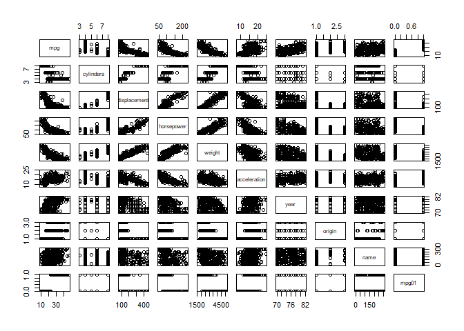

# chapter4-2
Min-Yao  
2018年1月22日  

# Linear Discriminant Analysis


```r
library(ISLR)
library(MASS)
attach(Smarket)
train=(Year<2005)
Smarket.2005=Smarket[!train,]
dim(Smarket.2005)
```

```
## [1] 252   9
```

```r
Direction.2005=Direction[!train]

lda.fit=lda(Direction~Lag1+Lag2,data=Smarket,subset=train)
lda.fit
```

```
## Call:
## lda(Direction ~ Lag1 + Lag2, data = Smarket, subset = train)
## 
## Prior probabilities of groups:
##     Down       Up 
## 0.491984 0.508016 
## 
## Group means:
##             Lag1        Lag2
## Down  0.04279022  0.03389409
## Up   -0.03954635 -0.03132544
## 
## Coefficients of linear discriminants:
##             LD1
## Lag1 -0.6420190
## Lag2 -0.5135293
```

```r
plot(lda.fit)
```

<!-- -->

```r
#Smarket.2005=subset(Smarket, Year==2005)

lda.pred=predict(lda.fit, Smarket.2005)
names(lda.pred)
```

```
## [1] "class"     "posterior" "x"
```

```r
lda.class=lda.pred$class
table(lda.class,Direction.2005)
```

```
##          Direction.2005
## lda.class Down  Up
##      Down   35  35
##      Up     76 106
```

```r
mean(lda.class==Direction.2005)
```

```
## [1] 0.5595238
```

```r
sum(lda.pred$posterior[,1]>=.5)
```

```
## [1] 70
```

```r
sum(lda.pred$posterior[,1]<.5)
```

```
## [1] 182
```

```r
lda.pred$posterior[1:20,1]
```

```
##       999      1000      1001      1002      1003      1004      1005 
## 0.4901792 0.4792185 0.4668185 0.4740011 0.4927877 0.4938562 0.4951016 
##      1006      1007      1008      1009      1010      1011      1012 
## 0.4872861 0.4907013 0.4844026 0.4906963 0.5119988 0.4895152 0.4706761 
##      1013      1014      1015      1016      1017      1018 
## 0.4744593 0.4799583 0.4935775 0.5030894 0.4978806 0.4886331
```

```r
lda.class[1:20]
```

```
##  [1] Up   Up   Up   Up   Up   Up   Up   Up   Up   Up   Up   Down Up   Up  
## [15] Up   Up   Up   Down Up   Up  
## Levels: Down Up
```

```r
sum(lda.pred$posterior[,1]>.9)
```

```
## [1] 0
```

# 10. This question should be answered using the Weekly data set, which
is part of the ISLR package. This data is similar in nature to the
Smarket data from this chapter’s lab, except that it contains 1, 089
weekly returns for 21 years, from the beginning of 1990 to the end of
2010.
# (a) Produce some numerical and graphical summaries of the Weekly
data. Do there appear to be any patterns?


```r
library(ISLR)
names(Weekly)
```

```
## [1] "Year"      "Lag1"      "Lag2"      "Lag3"      "Lag4"      "Lag5"     
## [7] "Volume"    "Today"     "Direction"
```

```r
dim(Weekly)
```

```
## [1] 1089    9
```

```r
summary(Weekly)
```

```
##       Year           Lag1               Lag2               Lag3         
##  Min.   :1990   Min.   :-18.1950   Min.   :-18.1950   Min.   :-18.1950  
##  1st Qu.:1995   1st Qu.: -1.1540   1st Qu.: -1.1540   1st Qu.: -1.1580  
##  Median :2000   Median :  0.2410   Median :  0.2410   Median :  0.2410  
##  Mean   :2000   Mean   :  0.1506   Mean   :  0.1511   Mean   :  0.1472  
##  3rd Qu.:2005   3rd Qu.:  1.4050   3rd Qu.:  1.4090   3rd Qu.:  1.4090  
##  Max.   :2010   Max.   : 12.0260   Max.   : 12.0260   Max.   : 12.0260  
##       Lag4               Lag5              Volume       
##  Min.   :-18.1950   Min.   :-18.1950   Min.   :0.08747  
##  1st Qu.: -1.1580   1st Qu.: -1.1660   1st Qu.:0.33202  
##  Median :  0.2380   Median :  0.2340   Median :1.00268  
##  Mean   :  0.1458   Mean   :  0.1399   Mean   :1.57462  
##  3rd Qu.:  1.4090   3rd Qu.:  1.4050   3rd Qu.:2.05373  
##  Max.   : 12.0260   Max.   : 12.0260   Max.   :9.32821  
##      Today          Direction 
##  Min.   :-18.1950   Down:484  
##  1st Qu.: -1.1540   Up  :605  
##  Median :  0.2410             
##  Mean   :  0.1499             
##  3rd Qu.:  1.4050             
##  Max.   : 12.0260
```

```r
pairs(Weekly)
```

<!-- -->

```r
cor(Weekly[,-9])
```

```
##               Year         Lag1        Lag2        Lag3         Lag4
## Year    1.00000000 -0.032289274 -0.03339001 -0.03000649 -0.031127923
## Lag1   -0.03228927  1.000000000 -0.07485305  0.05863568 -0.071273876
## Lag2   -0.03339001 -0.074853051  1.00000000 -0.07572091  0.058381535
## Lag3   -0.03000649  0.058635682 -0.07572091  1.00000000 -0.075395865
## Lag4   -0.03112792 -0.071273876  0.05838153 -0.07539587  1.000000000
## Lag5   -0.03051910 -0.008183096 -0.07249948  0.06065717 -0.075675027
## Volume  0.84194162 -0.064951313 -0.08551314 -0.06928771 -0.061074617
## Today  -0.03245989 -0.075031842  0.05916672 -0.07124364 -0.007825873
##                Lag5      Volume        Today
## Year   -0.030519101  0.84194162 -0.032459894
## Lag1   -0.008183096 -0.06495131 -0.075031842
## Lag2   -0.072499482 -0.08551314  0.059166717
## Lag3    0.060657175 -0.06928771 -0.071243639
## Lag4   -0.075675027 -0.06107462 -0.007825873
## Lag5    1.000000000 -0.05851741  0.011012698
## Volume -0.058517414  1.00000000 -0.033077783
## Today   0.011012698 -0.03307778  1.000000000
```

```r
attach(Weekly)
```

```
## The following objects are masked from Smarket:
## 
##     Direction, Lag1, Lag2, Lag3, Lag4, Lag5, Today, Volume, Year
```

```r
plot(Volume)
```

<!-- -->

>  Volume is increasing over time but decreasing recently.  In other words, the average number of shares traded daily increased and then decreased.

# (b) Use the full data set to perform a logistic regression with
Direction as the response and the five lag variables plus Volume
as predictors. Use the summary function to print the results. Do
any of the predictors appear to be statistically significant? If so,
which ones?


```r
glm.fits.Weekly=glm(Direction~Lag1+Lag2+Lag3+Lag4+Lag5+Volume,data=Weekly,family=binomial)
summary(glm.fits.Weekly)
```

```
## 
## Call:
## glm(formula = Direction ~ Lag1 + Lag2 + Lag3 + Lag4 + Lag5 + 
##     Volume, family = binomial, data = Weekly)
## 
## Deviance Residuals: 
##     Min       1Q   Median       3Q      Max  
## -1.6949  -1.2565   0.9913   1.0849   1.4579  
## 
## Coefficients:
##             Estimate Std. Error z value Pr(>|z|)   
## (Intercept)  0.26686    0.08593   3.106   0.0019 **
## Lag1        -0.04127    0.02641  -1.563   0.1181   
## Lag2         0.05844    0.02686   2.175   0.0296 * 
## Lag3        -0.01606    0.02666  -0.602   0.5469   
## Lag4        -0.02779    0.02646  -1.050   0.2937   
## Lag5        -0.01447    0.02638  -0.549   0.5833   
## Volume      -0.02274    0.03690  -0.616   0.5377   
## ---
## Signif. codes:  0 '***' 0.001 '**' 0.01 '*' 0.05 '.' 0.1 ' ' 1
## 
## (Dispersion parameter for binomial family taken to be 1)
## 
##     Null deviance: 1496.2  on 1088  degrees of freedom
## Residual deviance: 1486.4  on 1082  degrees of freedom
## AIC: 1500.4
## 
## Number of Fisher Scoring iterations: 4
```

```r
coef(glm.fits.Weekly)
```

```
## (Intercept)        Lag1        Lag2        Lag3        Lag4        Lag5 
##  0.26686414 -0.04126894  0.05844168 -0.01606114 -0.02779021 -0.01447206 
##      Volume 
## -0.02274153
```

```r
summary(glm.fits.Weekly)$coef
```

```
##                Estimate Std. Error    z value    Pr(>|z|)
## (Intercept)  0.26686414 0.08592961  3.1056134 0.001898848
## Lag1        -0.04126894 0.02641026 -1.5626099 0.118144368
## Lag2         0.05844168 0.02686499  2.1753839 0.029601361
## Lag3        -0.01606114 0.02666299 -0.6023760 0.546923890
## Lag4        -0.02779021 0.02646332 -1.0501409 0.293653342
## Lag5        -0.01447206 0.02638478 -0.5485006 0.583348244
## Volume      -0.02274153 0.03689812 -0.6163330 0.537674762
```

> Yes, Lag2 appears to be statistically significant.

# (c) Compute the confusion matrix and overall fraction of correct
predictions. Explain what the confusion matrix is telling you
about the types of mistakes made by logistic regression.


```r
glm.probs.Weekly=predict(glm.fits.Weekly,type="response")

glm.pred.Weekly=rep("Down",1089)
glm.pred.Weekly[glm.probs.Weekly>.5]="Up"
table(glm.pred.Weekly,Direction)
```

```
##                Direction
## glm.pred.Weekly Down  Up
##            Down   54  48
##            Up    430 557
```

```r
(54+557)/1089
```

```
## [1] 0.5610652
```

```r
mean(glm.pred.Weekly==Direction)
```

```
## [1] 0.5610652
```

> 430 type I error (false positive), 48 type II error (false negative)

# (d) Now fit the logistic regression model using a training data period
from 1990 to 2008, with Lag2 as the only predictor. Compute the
confusion matrix and the overall fraction of correct predictions
for the held out data (that is, the data from 2009 and 2010).


```r
train.1990to2008=(Year<2009)
Weekly.2009to2010=Weekly[!train.1990to2008,]
dim(Weekly.2009to2010)
```

```
## [1] 104   9
```

```r
Direction.1990to2008=Direction[!train.1990to2008]

glm.fits.Lag2=glm(Direction~Lag2,data=Weekly,family=binomial,subset=train.1990to2008)

glm.probs=predict(glm.fits.Lag2,Weekly.2009to2010,type="response")
glm.pred=rep("Down",104)
glm.pred[glm.probs>.5]="Up"
table(glm.pred,Direction.1990to2008)
```

```
##         Direction.1990to2008
## glm.pred Down Up
##     Down    9  5
##     Up     34 56
```

```r
mean(glm.pred==Direction.1990to2008)
```

```
## [1] 0.625
```

```r
(9+56)/104
```

```
## [1] 0.625
```

# (e) Repeat (d) using LDA.


> 62.5%  accuracy rate

# 11. In this problem, you will develop a model to predict whether a given car gets high or low gas mileage based on the Auto data set.

# (a) Create a binary variable, mpg01, that contains a 1 if mpg contains
a value above its median, and a 0 if mpg contains a value below
its median. You can compute the median using the median()
function. Note you may find it helpful to use the data.frame()
function to create a single data set containing both mpg01 and
the other Auto variables.


```r
library(ISLR)
names(Auto)
```

```
## [1] "mpg"          "cylinders"    "displacement" "horsepower"  
## [5] "weight"       "acceleration" "year"         "origin"      
## [9] "name"
```

```r
dim(Auto)
```

```
## [1] 392   9
```

```r
summary(Auto)
```

```
##       mpg          cylinders      displacement     horsepower   
##  Min.   : 9.00   Min.   :3.000   Min.   : 68.0   Min.   : 46.0  
##  1st Qu.:17.00   1st Qu.:4.000   1st Qu.:105.0   1st Qu.: 75.0  
##  Median :22.75   Median :4.000   Median :151.0   Median : 93.5  
##  Mean   :23.45   Mean   :5.472   Mean   :194.4   Mean   :104.5  
##  3rd Qu.:29.00   3rd Qu.:8.000   3rd Qu.:275.8   3rd Qu.:126.0  
##  Max.   :46.60   Max.   :8.000   Max.   :455.0   Max.   :230.0  
##                                                                 
##      weight      acceleration        year           origin     
##  Min.   :1613   Min.   : 8.00   Min.   :70.00   Min.   :1.000  
##  1st Qu.:2225   1st Qu.:13.78   1st Qu.:73.00   1st Qu.:1.000  
##  Median :2804   Median :15.50   Median :76.00   Median :1.000  
##  Mean   :2978   Mean   :15.54   Mean   :75.98   Mean   :1.577  
##  3rd Qu.:3615   3rd Qu.:17.02   3rd Qu.:79.00   3rd Qu.:2.000  
##  Max.   :5140   Max.   :24.80   Max.   :82.00   Max.   :3.000  
##                                                                
##                  name    
##  amc matador       :  5  
##  ford pinto        :  5  
##  toyota corolla    :  5  
##  amc gremlin       :  4  
##  amc hornet        :  4  
##  chevrolet chevette:  4  
##  (Other)           :365
```

```r
attach(Auto)
median(mpg)
```

```
## [1] 22.75
```

```r
#22.75

mpg01=rep(0,392)
mpg01[mpg>22.75]=1
mpg01
```

```
##   [1] 0 0 0 0 0 0 0 0 0 0 0 0 0 0 1 0 0 0 1 1 1 1 1 1 0 0 0 0 0 1 1 1 0 0 0
##  [36] 0 0 0 0 0 0 0 0 0 0 0 0 0 1 1 1 1 1 1 1 1 1 1 1 0 0 0 0 0 0 0 0 0 0 0
##  [71] 0 0 0 0 0 0 0 0 1 0 1 1 1 1 0 0 0 0 0 0 0 0 0 0 0 0 0 0 0 0 1 1 0 0 0
## [106] 0 0 0 0 0 0 0 0 1 0 0 1 1 0 0 0 1 0 0 0 0 0 1 1 1 1 0 0 0 0 0 0 0 0 1
## [141] 1 1 1 1 1 1 1 1 1 1 0 0 0 0 0 0 0 0 0 0 0 0 0 0 0 1 1 0 1 1 1 1 0 1 0
## [176] 1 1 0 1 1 1 1 1 1 1 0 0 0 0 0 0 1 0 1 1 1 1 0 0 0 0 1 1 1 1 0 0 0 0 0
## [211] 0 0 0 0 1 1 1 1 1 0 0 0 0 0 0 0 0 0 0 0 0 1 1 1 1 1 1 1 1 0 0 0 1 1 1
## [246] 1 1 0 0 0 0 0 0 1 0 0 0 0 0 0 0 0 0 0 1 1 1 1 0 1 1 1 0 0 0 0 1 1 0 0
## [281] 0 0 0 0 0 0 0 0 0 0 0 1 1 1 1 1 1 1 1 1 1 1 1 1 1 1 1 1 1 1 1 1 1 1 0
## [316] 1 1 1 1 1 1 1 1 1 1 1 1 1 1 1 1 1 1 1 1 1 1 1 1 1 1 1 1 1 1 1 1 1 1 1
## [351] 1 1 1 1 1 1 1 1 0 1 0 0 1 1 1 1 1 1 1 1 1 1 1 1 1 1 1 1 1 1 1 1 1 0 1
## [386] 1 1 1 1 1 1 1
```

```r
str(Auto)
```

```
## 'data.frame':	392 obs. of  9 variables:
##  $ mpg         : num  18 15 18 16 17 15 14 14 14 15 ...
##  $ cylinders   : num  8 8 8 8 8 8 8 8 8 8 ...
##  $ displacement: num  307 350 318 304 302 429 454 440 455 390 ...
##  $ horsepower  : num  130 165 150 150 140 198 220 215 225 190 ...
##  $ weight      : num  3504 3693 3436 3433 3449 ...
##  $ acceleration: num  12 11.5 11 12 10.5 10 9 8.5 10 8.5 ...
##  $ year        : num  70 70 70 70 70 70 70 70 70 70 ...
##  $ origin      : num  1 1 1 1 1 1 1 1 1 1 ...
##  $ name        : Factor w/ 304 levels "amc ambassador brougham",..: 49 36 231 14 161 141 54 223 241 2 ...
```

```r
new.Auto <- cbind(Auto, mpg01)
#new.Auto
str(new.Auto)
```

```
## 'data.frame':	392 obs. of  10 variables:
##  $ mpg         : num  18 15 18 16 17 15 14 14 14 15 ...
##  $ cylinders   : num  8 8 8 8 8 8 8 8 8 8 ...
##  $ displacement: num  307 350 318 304 302 429 454 440 455 390 ...
##  $ horsepower  : num  130 165 150 150 140 198 220 215 225 190 ...
##  $ weight      : num  3504 3693 3436 3433 3449 ...
##  $ acceleration: num  12 11.5 11 12 10.5 10 9 8.5 10 8.5 ...
##  $ year        : num  70 70 70 70 70 70 70 70 70 70 ...
##  $ origin      : num  1 1 1 1 1 1 1 1 1 1 ...
##  $ name        : Factor w/ 304 levels "amc ambassador brougham",..: 49 36 231 14 161 141 54 223 241 2 ...
##  $ mpg01       : num  0 0 0 0 0 0 0 0 0 0 ...
```

# (b) Explore the data graphically in order to investigate the associ-
ation between mpg01 and the other features. Which of the other
features seem most likely to be useful in predicting mpg01? Scat-
terplots and boxplots may be useful tools to answer this ques-
tion. Describe your findings.


```r
summary(new.Auto)
```

```
##       mpg          cylinders      displacement     horsepower   
##  Min.   : 9.00   Min.   :3.000   Min.   : 68.0   Min.   : 46.0  
##  1st Qu.:17.00   1st Qu.:4.000   1st Qu.:105.0   1st Qu.: 75.0  
##  Median :22.75   Median :4.000   Median :151.0   Median : 93.5  
##  Mean   :23.45   Mean   :5.472   Mean   :194.4   Mean   :104.5  
##  3rd Qu.:29.00   3rd Qu.:8.000   3rd Qu.:275.8   3rd Qu.:126.0  
##  Max.   :46.60   Max.   :8.000   Max.   :455.0   Max.   :230.0  
##                                                                 
##      weight      acceleration        year           origin     
##  Min.   :1613   Min.   : 8.00   Min.   :70.00   Min.   :1.000  
##  1st Qu.:2225   1st Qu.:13.78   1st Qu.:73.00   1st Qu.:1.000  
##  Median :2804   Median :15.50   Median :76.00   Median :1.000  
##  Mean   :2978   Mean   :15.54   Mean   :75.98   Mean   :1.577  
##  3rd Qu.:3615   3rd Qu.:17.02   3rd Qu.:79.00   3rd Qu.:2.000  
##  Max.   :5140   Max.   :24.80   Max.   :82.00   Max.   :3.000  
##                                                                
##                  name         mpg01    
##  amc matador       :  5   Min.   :0.0  
##  ford pinto        :  5   1st Qu.:0.0  
##  toyota corolla    :  5   Median :0.5  
##  amc gremlin       :  4   Mean   :0.5  
##  amc hornet        :  4   3rd Qu.:1.0  
##  chevrolet chevette:  4   Max.   :1.0  
##  (Other)           :365
```

```r
pairs(new.Auto)
```

<!-- -->

```r
#cor(new.Auto)
cor(new.Auto[,-9])
```

```
##                     mpg  cylinders displacement horsepower     weight
## mpg           1.0000000 -0.7776175   -0.8051269 -0.7784268 -0.8322442
## cylinders    -0.7776175  1.0000000    0.9508233  0.8429834  0.8975273
## displacement -0.8051269  0.9508233    1.0000000  0.8972570  0.9329944
## horsepower   -0.7784268  0.8429834    0.8972570  1.0000000  0.8645377
## weight       -0.8322442  0.8975273    0.9329944  0.8645377  1.0000000
## acceleration  0.4233285 -0.5046834   -0.5438005 -0.6891955 -0.4168392
## year          0.5805410 -0.3456474   -0.3698552 -0.4163615 -0.3091199
## origin        0.5652088 -0.5689316   -0.6145351 -0.4551715 -0.5850054
## mpg01         0.8369392 -0.7591939   -0.7534766 -0.6670526 -0.7577566
##              acceleration       year     origin      mpg01
## mpg             0.4233285  0.5805410  0.5652088  0.8369392
## cylinders      -0.5046834 -0.3456474 -0.5689316 -0.7591939
## displacement   -0.5438005 -0.3698552 -0.6145351 -0.7534766
## horsepower     -0.6891955 -0.4163615 -0.4551715 -0.6670526
## weight         -0.4168392 -0.3091199 -0.5850054 -0.7577566
## acceleration    1.0000000  0.2903161  0.2127458  0.3468215
## year            0.2903161  1.0000000  0.1815277  0.4299042
## origin          0.2127458  0.1815277  1.0000000  0.5136984
## mpg01           0.3468215  0.4299042  0.5136984  1.0000000
```

```r
glm.fits.new.Auto=glm(mpg01~.-name,data=new.Auto,family=binomial)
```

```
## Warning: glm.fit: algorithm did not converge
```

```
## Warning: glm.fit: fitted probabilities numerically 0 or 1 occurred
```

```r
summary(glm.fits.new.Auto)
```

```
## 
## Call:
## glm(formula = mpg01 ~ . - name, family = binomial, data = new.Auto)
## 
## Deviance Residuals: 
##        Min          1Q      Median          3Q         Max  
## -1.950e-04  -2.100e-08   0.000e+00   2.100e-08   1.996e-04  
## 
## Coefficients:
##                Estimate Std. Error z value Pr(>|z|)
## (Intercept)  -9.794e+02  1.487e+05  -0.007    0.995
## mpg           4.696e+01  5.578e+03   0.008    0.993
## cylinders    -4.444e+00  8.324e+03  -0.001    1.000
## displacement -1.900e-01  2.750e+02  -0.001    0.999
## horsepower    1.531e+00  8.053e+02   0.002    0.998
## weight        6.691e-03  3.055e+01   0.000    1.000
## acceleration  5.988e+00  3.751e+03   0.002    0.999
## year         -3.687e+00  1.534e+03  -0.002    0.998
## origin       -8.622e+00  8.108e+03  -0.001    0.999
## 
## (Dispersion parameter for binomial family taken to be 1)
## 
##     Null deviance: 5.4343e+02  on 391  degrees of freedom
## Residual deviance: 1.7041e-07  on 383  degrees of freedom
## AIC: 18
## 
## Number of Fisher Scoring iterations: 25
```

```r
coef(glm.fits.new.Auto)
```

```
##   (Intercept)           mpg     cylinders  displacement    horsepower 
## -9.793986e+02  4.696377e+01 -4.444419e+00 -1.899592e-01  1.530948e+00 
##        weight  acceleration          year        origin 
##  6.691369e-03  5.987776e+00 -3.687494e+00 -8.621655e+00
```

```r
summary(glm.fits.new.Auto)$coef
```

```
##                   Estimate   Std. Error       z value  Pr(>|z|)
## (Intercept)  -9.793986e+02 148717.05971 -0.0065856507 0.9947454
## mpg           4.696377e+01   5578.30794  0.0084189984 0.9932827
## cylinders    -4.444419e+00   8324.08228 -0.0005339230 0.9995740
## displacement -1.899592e-01    274.96699 -0.0006908438 0.9994488
## horsepower    1.530948e+00    805.27329  0.0019011537 0.9984831
## weight        6.691369e-03     30.55333  0.0002190062 0.9998253
## acceleration  5.987776e+00   3751.36484  0.0015961593 0.9987264
## year         -3.687494e+00   1534.00536 -0.0024038340 0.9980820
## origin       -8.621655e+00   8107.82456 -0.0010633746 0.9991515
```

# (c) Split the data into a training set and a test set.


```r
summary(new.Auto)
```

```
##       mpg          cylinders      displacement     horsepower   
##  Min.   : 9.00   Min.   :3.000   Min.   : 68.0   Min.   : 46.0  
##  1st Qu.:17.00   1st Qu.:4.000   1st Qu.:105.0   1st Qu.: 75.0  
##  Median :22.75   Median :4.000   Median :151.0   Median : 93.5  
##  Mean   :23.45   Mean   :5.472   Mean   :194.4   Mean   :104.5  
##  3rd Qu.:29.00   3rd Qu.:8.000   3rd Qu.:275.8   3rd Qu.:126.0  
##  Max.   :46.60   Max.   :8.000   Max.   :455.0   Max.   :230.0  
##                                                                 
##      weight      acceleration        year           origin     
##  Min.   :1613   Min.   : 8.00   Min.   :70.00   Min.   :1.000  
##  1st Qu.:2225   1st Qu.:13.78   1st Qu.:73.00   1st Qu.:1.000  
##  Median :2804   Median :15.50   Median :76.00   Median :1.000  
##  Mean   :2978   Mean   :15.54   Mean   :75.98   Mean   :1.577  
##  3rd Qu.:3615   3rd Qu.:17.02   3rd Qu.:79.00   3rd Qu.:2.000  
##  Max.   :5140   Max.   :24.80   Max.   :82.00   Max.   :3.000  
##                                                                
##                  name         mpg01    
##  amc matador       :  5   Min.   :0.0  
##  ford pinto        :  5   1st Qu.:0.0  
##  toyota corolla    :  5   Median :0.5  
##  amc gremlin       :  4   Mean   :0.5  
##  amc hornet        :  4   3rd Qu.:1.0  
##  chevrolet chevette:  4   Max.   :1.0  
##  (Other)           :365
```

```r
dim(new.Auto)
```

```
## [1] 392  10
```

```r
attach(new.Auto)
```

```
## The following object is masked _by_ .GlobalEnv:
## 
##     mpg01
```

```
## The following objects are masked from Auto:
## 
##     acceleration, cylinders, displacement, horsepower, mpg, name,
##     origin, weight, year
```

```r
train=(cylinders<5)
test = new.Auto[!train,]
dim(test)
```

```
## [1] 189  10
```

```r
summary(test)
```

```
##       mpg          cylinders      displacement     horsepower   
##  Min.   : 9.00   Min.   :5.000   Min.   :121.0   Min.   : 67.0  
##  1st Qu.:14.00   1st Qu.:6.000   1st Qu.:231.0   1st Qu.:100.0  
##  Median :17.00   Median :8.000   Median :302.0   Median :130.0  
##  Mean   :17.36   Mean   :7.074   Mean   :286.2   Mean   :132.2  
##  3rd Qu.:19.40   3rd Qu.:8.000   3rd Qu.:350.0   3rd Qu.:150.0  
##  Max.   :38.00   Max.   :8.000   Max.   :455.0   Max.   :230.0  
##                                                                 
##      weight      acceleration        year           origin     
##  Min.   :2472   Min.   : 8.00   Min.   :70.00   Min.   :1.000  
##  1st Qu.:3211   1st Qu.:12.50   1st Qu.:72.00   1st Qu.:1.000  
##  Median :3645   Median :14.50   Median :75.00   Median :1.000  
##  Mean   :3698   Mean   :14.49   Mean   :74.88   Mean   :1.101  
##  3rd Qu.:4190   3rd Qu.:16.20   3rd Qu.:78.00   3rd Qu.:1.000  
##  Max.   :5140   Max.   :22.20   Max.   :82.00   Max.   :3.000  
##                                                                
##                         name         mpg01        
##  amc matador              :  5   Min.   :0.00000  
##  amc gremlin              :  4   1st Qu.:0.00000  
##  amc hornet               :  4   Median :0.00000  
##  chevrolet impala         :  4   Mean   :0.08466  
##  ford maverick            :  4   3rd Qu.:0.00000  
##  chevrolet caprice classic:  3   Max.   :1.00000  
##  (Other)                  :165
```

```r
training = new.Auto[train,]
dim(training)
```

```
## [1] 203  10
```

```r
summary(training)
```

```
##       mpg          cylinders     displacement     horsepower    
##  Min.   :18.00   Min.   :3.00   Min.   : 68.0   Min.   : 46.00  
##  1st Qu.:25.00   1st Qu.:4.00   1st Qu.: 91.0   1st Qu.: 68.00  
##  Median :28.00   Median :4.00   Median :105.0   Median : 78.00  
##  Mean   :29.11   Mean   :3.98   Mean   :108.9   Mean   : 78.69  
##  3rd Qu.:32.85   3rd Qu.:4.00   3rd Qu.:121.0   3rd Qu.: 90.00  
##  Max.   :46.60   Max.   :4.00   Max.   :156.0   Max.   :115.00  
##                                                                 
##      weight      acceleration        year        origin    
##  Min.   :1613   Min.   :11.60   Min.   :70   Min.   :1.00  
##  1st Qu.:2050   1st Qu.:14.70   1st Qu.:74   1st Qu.:1.00  
##  Median :2234   Median :16.10   Median :77   Median :2.00  
##  Mean   :2307   Mean   :16.52   Mean   :77   Mean   :2.02  
##  3rd Qu.:2562   3rd Qu.:18.00   3rd Qu.:80   3rd Qu.:3.00  
##  Max.   :3270   Max.   :24.80   Max.   :82   Max.   :3.00  
##                                                            
##                  name         mpg01       
##  toyota corolla    :  5   Min.   :0.0000  
##  chevrolet chevette:  4   1st Qu.:1.0000  
##  ford pinto        :  4   Median :1.0000  
##  peugeot 504       :  4   Mean   :0.8867  
##  toyota corona     :  4   3rd Qu.:1.0000  
##  chevrolet vega    :  3   Max.   :1.0000  
##  (Other)           :179
```

# (d) Perform LDA on the training data in order to predict mpg01
using the variables that seemed most associated with mpg01 in
(b). What is the test error of the model obtained?


# (f) Perform logistic regression on the training data in order to pre-
dict mpg01 using the variables that seemed most associated with
mpg01 in (b). What is the test error of the model obtained?


```r
mpg01.test=mpg01[!train]

glm.fits.horsepower=glm(mpg01~horsepower,data=new.Auto,family=binomial,subset=train)

glm.probs=predict(glm.fits.horsepower,test,type="response")

glm.pred=rep("0",189)
glm.pred[glm.probs>0.5]="1"
table(glm.pred,mpg01.test)
```

```
##         mpg01.test
## glm.pred   0   1
##        0 118   8
##        1  55   8
```

```r
mean(glm.pred==mpg01.test)
```

```
## [1] 0.6666667
```
