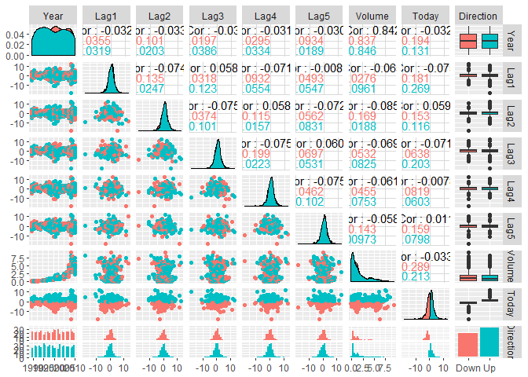
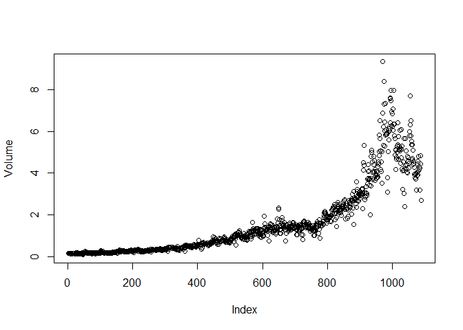
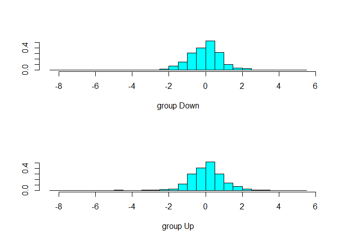
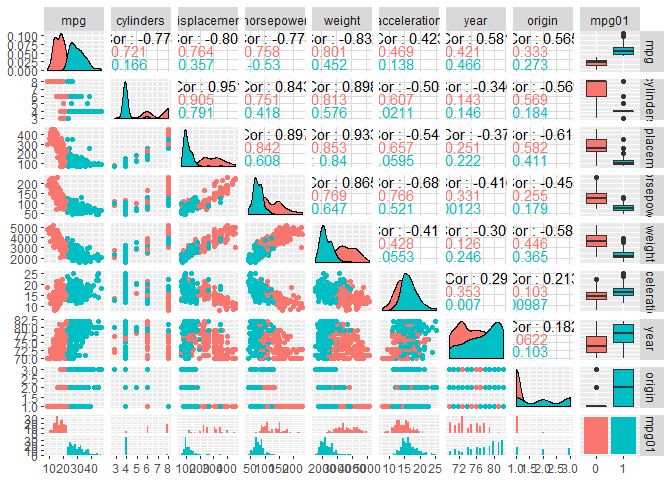
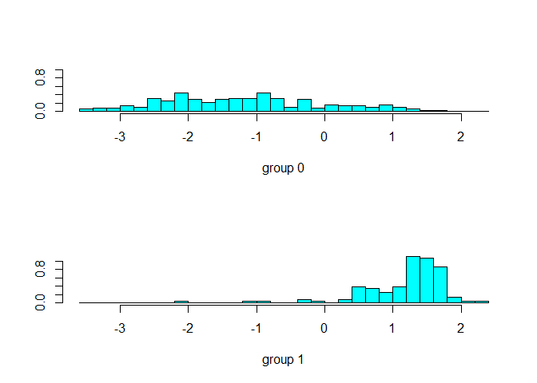
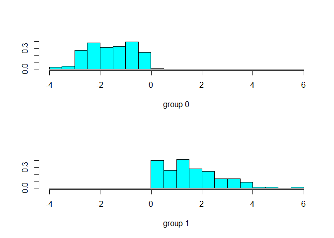
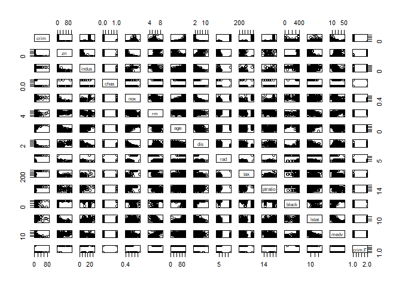
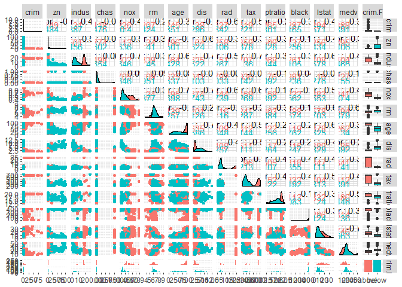
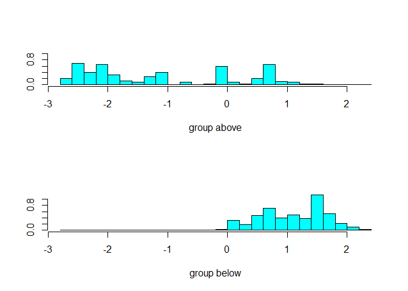

# chapter4-3
Min-Yao  
2018年1月29日  
# Linear Discriminant Analysis


```r
library(ISLR)
library(MASS)
attach(Smarket)
train=(Year<2005)
Smarket.2005=Smarket[!train,]
dim(Smarket.2005)
```

```
## [1] 252   9
```

```r
Direction.2005=Direction[!train]

lda.fit=lda(Direction~Lag1+Lag2,data=Smarket,subset=train)
lda.fit
```

```
## Call:
## lda(Direction ~ Lag1 + Lag2, data = Smarket, subset = train)
## 
## Prior probabilities of groups:
##     Down       Up 
## 0.491984 0.508016 
## 
## Group means:
##             Lag1        Lag2
## Down  0.04279022  0.03389409
## Up   -0.03954635 -0.03132544
## 
## Coefficients of linear discriminants:
##             LD1
## Lag1 -0.6420190
## Lag2 -0.5135293
```

```r
plot(lda.fit)
```

<!-- -->

```r
#Smarket.2005=subset(Smarket, Year==2005)

lda.pred=predict(lda.fit, Smarket.2005)
names(lda.pred)
```

```
## [1] "class"     "posterior" "x"
```

```r
lda.class=lda.pred$class
table(lda.class,Direction.2005)
```

```
##          Direction.2005
## lda.class Down  Up
##      Down   35  35
##      Up     76 106
```

```r
mean(lda.class==Direction.2005)
```

```
## [1] 0.5595238
```

```r
sum(lda.pred$posterior[,1]>=.5)
```

```
## [1] 70
```

```r
sum(lda.pred$posterior[,1]<.5)
```

```
## [1] 182
```

```r
lda.pred$posterior[1:20,1]
```

```
##       999      1000      1001      1002      1003      1004      1005 
## 0.4901792 0.4792185 0.4668185 0.4740011 0.4927877 0.4938562 0.4951016 
##      1006      1007      1008      1009      1010      1011      1012 
## 0.4872861 0.4907013 0.4844026 0.4906963 0.5119988 0.4895152 0.4706761 
##      1013      1014      1015      1016      1017      1018 
## 0.4744593 0.4799583 0.4935775 0.5030894 0.4978806 0.4886331
```

```r
lda.class[1:20]
```

```
##  [1] Up   Up   Up   Up   Up   Up   Up   Up   Up   Up   Up   Down Up   Up  
## [15] Up   Up   Up   Down Up   Up  
## Levels: Down Up
```

```r
sum(lda.pred$posterior[,1]>.9)
```

```
## [1] 0
```

# Quadratic Discriminant Analysis


```r
qda.fit=qda(Direction~Lag1+Lag2,data=Smarket,subset=train)
qda.fit
```

```
## Call:
## qda(Direction ~ Lag1 + Lag2, data = Smarket, subset = train)
## 
## Prior probabilities of groups:
##     Down       Up 
## 0.491984 0.508016 
## 
## Group means:
##             Lag1        Lag2
## Down  0.04279022  0.03389409
## Up   -0.03954635 -0.03132544
```

```r
qda.class=predict(qda.fit,Smarket.2005)$class
table(qda.class,Direction.2005)
```

```
##          Direction.2005
## qda.class Down  Up
##      Down   30  20
##      Up     81 121
```

```r
mean(qda.class==Direction.2005)
```

```
## [1] 0.5992063
```

# K-Nearest Neighbors


```r
library(class)
train.X=cbind(Lag1,Lag2)[train,]
test.X=cbind(Lag1,Lag2)[!train,]
train.Direction=Direction[train]
#?knn
set.seed(1)
knn.pred=knn(train.X,test.X,train.Direction,k=1)
table(knn.pred,Direction.2005)
```

```
##         Direction.2005
## knn.pred Down Up
##     Down   43 58
##     Up     68 83
```

```r
mean(knn.pred==Direction.2005)
```

```
## [1] 0.5
```

```r
(83+43)/252
```

```
## [1] 0.5
```

```r
knn.pred=knn(train.X,test.X,train.Direction,k=3)
table(knn.pred,Direction.2005)
```

```
##         Direction.2005
## knn.pred Down Up
##     Down   48 54
##     Up     63 87
```

```r
mean(knn.pred==Direction.2005)
```

```
## [1] 0.5357143
```

# An Application to Caravan Insurance Data


```r
dim(Caravan)
```

```
## [1] 5822   86
```

```r
attach(Caravan)
summary(Purchase)
```

```
##   No  Yes 
## 5474  348
```

```r
348/5822
```

```
## [1] 0.05977327
```


```r
standardized.X=scale(Caravan[,-86])
var(Caravan[,1])
```

```
## [1] 165.0378
```

```r
var(Caravan[,2])
```

```
## [1] 0.1647078
```

```r
var(standardized.X[,1])
```

```
## [1] 1
```

```r
var(standardized.X[,2])
```

```
## [1] 1
```

```r
test=1:1000
```


```r
train.X=standardized.X[-test,]
test.X=standardized.X[test,]
train.Y=Purchase[-test]
test.Y=Purchase[test]
set.seed(1)
knn.pred=knn(train.X,test.X,train.Y,k=1)
mean(test.Y!=knn.pred)
```

```
## [1] 0.118
```

```r
mean(test.Y!="No")
```

```
## [1] 0.059
```


```r
table(knn.pred,test.Y)
```

```
##         test.Y
## knn.pred  No Yes
##      No  873  50
##      Yes  68   9
```

```r
9/(68+9)
```

```
## [1] 0.1168831
```

```r
knn.pred=knn(train.X,test.X,train.Y,k=3)
table(knn.pred,test.Y)
```

```
##         test.Y
## knn.pred  No Yes
##      No  920  54
##      Yes  21   5
```

```r
5/26
```

```
## [1] 0.1923077
```

```r
knn.pred=knn(train.X,test.X,train.Y,k=5)
table(knn.pred,test.Y)
```

```
##         test.Y
## knn.pred  No Yes
##      No  930  55
##      Yes  11   4
```

```r
4/15
```

```
## [1] 0.2666667
```


```r
glm.fits=glm(Purchase~.,data=Caravan,family=binomial,subset=-test)
```

```
## Warning: glm.fit: fitted probabilities numerically 0 or 1 occurred
```

```r
glm.probs=predict(glm.fits,Caravan[test,],type="response")
glm.pred=rep("No",1000)
glm.pred[glm.probs>.5]="Yes"
table(glm.pred,test.Y)
```

```
##         test.Y
## glm.pred  No Yes
##      No  934  59
##      Yes   7   0
```

```r
glm.pred=rep("No",1000)
glm.pred[glm.probs>.25]="Yes"
table(glm.pred,test.Y)
```

```
##         test.Y
## glm.pred  No Yes
##      No  919  48
##      Yes  22  11
```

```r
11/(22+11)
```

```
## [1] 0.3333333
```


# 5. We now examine the differences between LDA and QDA.
##(a) If the Bayes decision boundary is linear, do we expect LDA or QDA to perform better on the training set? On the test set?

> If the Bayes decision boundary is linear, LDA more accurately
approximates this boundary than does QDA on the test set. The QDA decision boundary is inferior, because it suffers from higher variance without a corresponding decrease in bias. However, QDA may perform better on the training set by overfitting.

## (b) If the Bayes decision boundary is non-linear, do we expect LDA or QDA to perform better on the training set? On the test set?

> If the Bayes decision boundary is non-linear, QDA more accurately approximates this boundary than does LDA on both the training set and the test set.

## (c) In general, as the sample size n increases, do we expect the test prediction accuracy of QDA relative to LDA to improve, decline, or be unchanged? Why?

> Roughly speaking, LDA tends to be a better bet than QDA if there are relatively few training observations and so reducing variance is crucial. In contrast, QDA is recommended if the training set is very large, so that the variance of the classifier is not a major concern, or if the assumption of a common covariance matrix for the K classes is clearly
untenable.

## (d) True or False: Even if the Bayes decision boundary for a given problem is linear, we will probably achieve a superior test error rate using QDA rather than LDA because QDA is flexible enough to model a linear decision boundary. Justify your answer.

> False. If the Bayes decision boundary for a given problem is linear, the QDA decision boundary is inferior, because it suffers from higher variance without a corresponding decrease in bias.  

# 8. Suppose that we take a data set, divide it into equally-sized training and test sets, and then try out two different classification procedures. First we use logistic regression and get an error rate of 20 % on the training data and 30 % on the test data. Next we use 1-nearest neighbors (i.e. K = 1) and get an average error rate (averaged over both test and training data sets) of 18 %. Based on these results, which method should we prefer to use for classification of new observations? Why?

> We prefer to use logistic regression for classification of new observations, because using 1-nearest neighbors (i.e. K = 1), we should get an error rate of 0 % on the training data, which indicates that we get an error rate of 36 % on the test data.

# 9. This problem has to do with odds.
## (a) On average, what fraction of people with an odds of 0.37 of defaulting on their credit card payment will in fact default?

p(X)/1-p(x) = 0.37
p(x) = 0.37- 0.37*p(x)
1.37*p(x) = 0.37
p(x) = 0.37/1.37


```r
0.37/1.37
```

```
## [1] 0.270073
```

> 0.270073

## (b) Suppose that an individual has a 16 % chance of defaulting on her credit card payment. What are the odds that she will default?


```r
0.16/(1-0.16)
```

```
## [1] 0.1904762
```

> odds = 0.1904762

# 10. This question should be answered using the Weekly data set, which is part of the ISLR package. This data is similar in nature to the Smarket data from this chapter’s lab, except that it contains 1, 089 weekly returns for 21 years, from the beginning of 1990 to the end of 2010.
## (a) Produce some numerical and graphical summaries of the Weekly data. Do there appear to be any patterns?


```r
library(ISLR)
names(Weekly)
```

```
## [1] "Year"      "Lag1"      "Lag2"      "Lag3"      "Lag4"      "Lag5"     
## [7] "Volume"    "Today"     "Direction"
```

```r
dim(Weekly)
```

```
## [1] 1089    9
```

```r
summary(Weekly)
```

```
##       Year           Lag1               Lag2               Lag3         
##  Min.   :1990   Min.   :-18.1950   Min.   :-18.1950   Min.   :-18.1950  
##  1st Qu.:1995   1st Qu.: -1.1540   1st Qu.: -1.1540   1st Qu.: -1.1580  
##  Median :2000   Median :  0.2410   Median :  0.2410   Median :  0.2410  
##  Mean   :2000   Mean   :  0.1506   Mean   :  0.1511   Mean   :  0.1472  
##  3rd Qu.:2005   3rd Qu.:  1.4050   3rd Qu.:  1.4090   3rd Qu.:  1.4090  
##  Max.   :2010   Max.   : 12.0260   Max.   : 12.0260   Max.   : 12.0260  
##       Lag4               Lag5              Volume       
##  Min.   :-18.1950   Min.   :-18.1950   Min.   :0.08747  
##  1st Qu.: -1.1580   1st Qu.: -1.1660   1st Qu.:0.33202  
##  Median :  0.2380   Median :  0.2340   Median :1.00268  
##  Mean   :  0.1458   Mean   :  0.1399   Mean   :1.57462  
##  3rd Qu.:  1.4090   3rd Qu.:  1.4050   3rd Qu.:2.05373  
##  Max.   : 12.0260   Max.   : 12.0260   Max.   :9.32821  
##      Today          Direction 
##  Min.   :-18.1950   Down:484  
##  1st Qu.: -1.1540   Up  :605  
##  Median :  0.2410             
##  Mean   :  0.1499             
##  3rd Qu.:  1.4050             
##  Max.   : 12.0260
```

```r
pairs(Weekly)

library(GGally)
```

<!-- -->

```r
library(ggplot2)
ggpairs(Weekly, aes(colour = Direction))
```

```
## `stat_bin()` using `bins = 30`. Pick better value with `binwidth`.
## `stat_bin()` using `bins = 30`. Pick better value with `binwidth`.
## `stat_bin()` using `bins = 30`. Pick better value with `binwidth`.
## `stat_bin()` using `bins = 30`. Pick better value with `binwidth`.
## `stat_bin()` using `bins = 30`. Pick better value with `binwidth`.
## `stat_bin()` using `bins = 30`. Pick better value with `binwidth`.
## `stat_bin()` using `bins = 30`. Pick better value with `binwidth`.
## `stat_bin()` using `bins = 30`. Pick better value with `binwidth`.
```

<!-- -->

```r
cor(Weekly[,-9])
```

```
##               Year         Lag1        Lag2        Lag3         Lag4
## Year    1.00000000 -0.032289274 -0.03339001 -0.03000649 -0.031127923
## Lag1   -0.03228927  1.000000000 -0.07485305  0.05863568 -0.071273876
## Lag2   -0.03339001 -0.074853051  1.00000000 -0.07572091  0.058381535
## Lag3   -0.03000649  0.058635682 -0.07572091  1.00000000 -0.075395865
## Lag4   -0.03112792 -0.071273876  0.05838153 -0.07539587  1.000000000
## Lag5   -0.03051910 -0.008183096 -0.07249948  0.06065717 -0.075675027
## Volume  0.84194162 -0.064951313 -0.08551314 -0.06928771 -0.061074617
## Today  -0.03245989 -0.075031842  0.05916672 -0.07124364 -0.007825873
##                Lag5      Volume        Today
## Year   -0.030519101  0.84194162 -0.032459894
## Lag1   -0.008183096 -0.06495131 -0.075031842
## Lag2   -0.072499482 -0.08551314  0.059166717
## Lag3    0.060657175 -0.06928771 -0.071243639
## Lag4   -0.075675027 -0.06107462 -0.007825873
## Lag5    1.000000000 -0.05851741  0.011012698
## Volume -0.058517414  1.00000000 -0.033077783
## Today   0.011012698 -0.03307778  1.000000000
```

```r
attach(Weekly)
```

```
## The following objects are masked from Smarket:
## 
##     Direction, Lag1, Lag2, Lag3, Lag4, Lag5, Today, Volume, Year
```

```r
plot(Volume)
```

<!-- -->

>  Volume is increasing over time but decreasing recently.  In other words, the average number of shares traded daily increased and then decreased.

## (b) Use the full data set to perform a logistic regression with Direction as the response and the five lag variables plus Volume as predictors. Use the summary function to print the results. Do any of the predictors appear to be statistically significant? If so, which ones?


```r
glm.fits.Weekly=glm(Direction~Lag1+Lag2+Lag3+Lag4+Lag5+Volume,data=Weekly,family=binomial)
summary(glm.fits.Weekly)
```

```
## 
## Call:
## glm(formula = Direction ~ Lag1 + Lag2 + Lag3 + Lag4 + Lag5 + 
##     Volume, family = binomial, data = Weekly)
## 
## Deviance Residuals: 
##     Min       1Q   Median       3Q      Max  
## -1.6949  -1.2565   0.9913   1.0849   1.4579  
## 
## Coefficients:
##             Estimate Std. Error z value Pr(>|z|)   
## (Intercept)  0.26686    0.08593   3.106   0.0019 **
## Lag1        -0.04127    0.02641  -1.563   0.1181   
## Lag2         0.05844    0.02686   2.175   0.0296 * 
## Lag3        -0.01606    0.02666  -0.602   0.5469   
## Lag4        -0.02779    0.02646  -1.050   0.2937   
## Lag5        -0.01447    0.02638  -0.549   0.5833   
## Volume      -0.02274    0.03690  -0.616   0.5377   
## ---
## Signif. codes:  0 '***' 0.001 '**' 0.01 '*' 0.05 '.' 0.1 ' ' 1
## 
## (Dispersion parameter for binomial family taken to be 1)
## 
##     Null deviance: 1496.2  on 1088  degrees of freedom
## Residual deviance: 1486.4  on 1082  degrees of freedom
## AIC: 1500.4
## 
## Number of Fisher Scoring iterations: 4
```

```r
coef(glm.fits.Weekly)
```

```
## (Intercept)        Lag1        Lag2        Lag3        Lag4        Lag5 
##  0.26686414 -0.04126894  0.05844168 -0.01606114 -0.02779021 -0.01447206 
##      Volume 
## -0.02274153
```

```r
summary(glm.fits.Weekly)$coef
```

```
##                Estimate Std. Error    z value    Pr(>|z|)
## (Intercept)  0.26686414 0.08592961  3.1056134 0.001898848
## Lag1        -0.04126894 0.02641026 -1.5626099 0.118144368
## Lag2         0.05844168 0.02686499  2.1753839 0.029601361
## Lag3        -0.01606114 0.02666299 -0.6023760 0.546923890
## Lag4        -0.02779021 0.02646332 -1.0501409 0.293653342
## Lag5        -0.01447206 0.02638478 -0.5485006 0.583348244
## Volume      -0.02274153 0.03689812 -0.6163330 0.537674762
```

> Yes, Lag2 appears to be statistically significant.

## (c) Compute the confusion matrix and overall fraction of correct predictions. Explain what the confusion matrix is telling you about the types of mistakes made by logistic regression.


```r
glm.probs.Weekly=predict(glm.fits.Weekly,type="response")

glm.pred.Weekly=rep("Down",1089)
glm.pred.Weekly[glm.probs.Weekly>.5]="Up"
table(glm.pred.Weekly,Direction)
```

```
##                Direction
## glm.pred.Weekly Down  Up
##            Down   54  48
##            Up    430 557
```

```r
(54+557)/1089
```

```
## [1] 0.5610652
```

```r
mean(glm.pred.Weekly==Direction)
```

```
## [1] 0.5610652
```

> 430 type I error (false positive), 48 type II error (false negative)

## (d) Now fit the logistic regression model using a training data period from 1990 to 2008, with Lag2 as the only predictor. Compute the confusion matrix and the overall fraction of correct predictions for the held out data (that is, the data from 2009 and 2010).


```r
train.1990to2008=(Year<2009)
Weekly.1990to2008=Weekly[train.1990to2008,]
Weekly.2009to2010=Weekly[!train.1990to2008,]
dim(Weekly.2009to2010)
```

```
## [1] 104   9
```

```r
Direction.2009=Direction[!train.1990to2008]

glm.fits.Lag2=glm(Direction~Lag2,data=Weekly,family=binomial,subset=train.1990to2008)

glm.probs=predict(glm.fits.Lag2,Weekly.2009to2010,type="response")

glm.pred=rep("Down",104)
glm.pred[glm.probs>.5]="Up"
table(glm.pred,Direction.2009)
```

```
##         Direction.2009
## glm.pred Down Up
##     Down    9  5
##     Up     34 56
```

```r
mean(glm.pred==Direction.2009)
```

```
## [1] 0.625
```

```r
(9+56)/104
```

```
## [1] 0.625
```

> 62.5%  accuracy rate

## (e) Repeat (d) using LDA.


```r
lda.fit.train=lda(Direction~Lag2,data=Weekly,subset=train.1990to2008)
lda.fit.train
```

```
## Call:
## lda(Direction ~ Lag2, data = Weekly, subset = train.1990to2008)
## 
## Prior probabilities of groups:
##      Down        Up 
## 0.4477157 0.5522843 
## 
## Group means:
##             Lag2
## Down -0.03568254
## Up    0.26036581
## 
## Coefficients of linear discriminants:
##            LD1
## Lag2 0.4414162
```

```r
plot(lda.fit.train)
```

<!-- -->

```r
lda.pred.test=predict(lda.fit.train, Weekly.2009to2010)
names(lda.pred.test)
```

```
## [1] "class"     "posterior" "x"
```

```r
lda.class=lda.pred.test$class
table(lda.class,Direction.2009)
```

```
##          Direction.2009
## lda.class Down Up
##      Down    9  5
##      Up     34 56
```

```r
mean(lda.class==Direction.2009)
```

```
## [1] 0.625
```

> the same 62.5%  accuracy rate

##(f) Repeat (d) using QDA.


```r
qda.fit.train=qda(Direction~Lag2,data=Weekly,subset=train.1990to2008)
qda.fit.train
```

```
## Call:
## qda(Direction ~ Lag2, data = Weekly, subset = train.1990to2008)
## 
## Prior probabilities of groups:
##      Down        Up 
## 0.4477157 0.5522843 
## 
## Group means:
##             Lag2
## Down -0.03568254
## Up    0.26036581
```

```r
qda.class=predict(qda.fit.train,Weekly.2009to2010)$class
table(qda.class,Direction.2009)
```

```
##          Direction.2009
## qda.class Down Up
##      Down    0  0
##      Up     43 61
```

```r
mean(qda.class==Direction.2009)
```

```
## [1] 0.5865385
```

> 58.6 % accuracy rate, lower than LDA

## (g) Repeat (d) using KNN with K = 1.


```r
library(class)
train.X=data.frame(Weekly.1990to2008[,"Lag2"])
test.X=data.frame(Weekly.2009to2010[,"Lag2"])
train.Direction=Weekly.1990to2008$Direction

set.seed(2)
knn.pred=knn(train.X,test.X,train.Direction,k=1)
table(knn.pred,Direction.2009)
```

```
##         Direction.2009
## knn.pred Down Up
##     Down   21 30
##     Up     22 31
```

```r
mean(knn.pred==Direction.2009)
```

```
## [1] 0.5
```

> K=1, 50% accuracy rate

## (h) Which of these methods appears to provide the best results on this data?

> Logistic regression and LDA

## (i) Experiment with different combinations of predictors, including possible transformations and interactions, for each of the methods. Report the variables, method, and associated confusion matrix that appears to provide the best results on the held out data. Note that you should also experiment with values for K in the KNN classifier.


```r
knn.pred=knn(train.X,test.X,train.Direction,k=3)
table(knn.pred,Direction.2009)
```

```
##         Direction.2009
## knn.pred Down Up
##     Down   16 19
##     Up     27 42
```

```r
mean(knn.pred==Direction.2009)
```

```
## [1] 0.5576923
```

> K=3, 55.8% accuracy rate

# 11. In this problem, you will develop a model to predict whether a given car gets high or low gas mileage based on the Auto data set.

## (a) Create a binary variable, mpg01, that contains a 1 if mpg contains a value above its median, and a 0 if mpg contains a value below its median. You can compute the median using the median() function. Note you may find it helpful to use the data.frame() function to create a single data set containing both mpg01 and the other Auto variables.


```r
library(ISLR)
names(Auto)
```

```
## [1] "mpg"          "cylinders"    "displacement" "horsepower"  
## [5] "weight"       "acceleration" "year"         "origin"      
## [9] "name"
```

```r
dim(Auto)
```

```
## [1] 392   9
```

```r
summary(Auto)
```

```
##       mpg          cylinders      displacement     horsepower   
##  Min.   : 9.00   Min.   :3.000   Min.   : 68.0   Min.   : 46.0  
##  1st Qu.:17.00   1st Qu.:4.000   1st Qu.:105.0   1st Qu.: 75.0  
##  Median :22.75   Median :4.000   Median :151.0   Median : 93.5  
##  Mean   :23.45   Mean   :5.472   Mean   :194.4   Mean   :104.5  
##  3rd Qu.:29.00   3rd Qu.:8.000   3rd Qu.:275.8   3rd Qu.:126.0  
##  Max.   :46.60   Max.   :8.000   Max.   :455.0   Max.   :230.0  
##                                                                 
##      weight      acceleration        year           origin     
##  Min.   :1613   Min.   : 8.00   Min.   :70.00   Min.   :1.000  
##  1st Qu.:2225   1st Qu.:13.78   1st Qu.:73.00   1st Qu.:1.000  
##  Median :2804   Median :15.50   Median :76.00   Median :1.000  
##  Mean   :2978   Mean   :15.54   Mean   :75.98   Mean   :1.577  
##  3rd Qu.:3615   3rd Qu.:17.02   3rd Qu.:79.00   3rd Qu.:2.000  
##  Max.   :5140   Max.   :24.80   Max.   :82.00   Max.   :3.000  
##                                                                
##                  name    
##  amc matador       :  5  
##  ford pinto        :  5  
##  toyota corolla    :  5  
##  amc gremlin       :  4  
##  amc hornet        :  4  
##  chevrolet chevette:  4  
##  (Other)           :365
```

```r
attach(Auto)
```

```
## The following object is masked from package:ggplot2:
## 
##     mpg
```

```r
median(mpg)
```

```
## [1] 22.75
```

```r
#22.75

mpg01=rep(0,392)
mpg01[mpg>22.75]=1
summary(mpg01)
```

```
##    Min. 1st Qu.  Median    Mean 3rd Qu.    Max. 
##     0.0     0.0     0.5     0.5     1.0     1.0
```

```r
str(Auto)
```

```
## 'data.frame':	392 obs. of  9 variables:
##  $ mpg         : num  18 15 18 16 17 15 14 14 14 15 ...
##  $ cylinders   : num  8 8 8 8 8 8 8 8 8 8 ...
##  $ displacement: num  307 350 318 304 302 429 454 440 455 390 ...
##  $ horsepower  : num  130 165 150 150 140 198 220 215 225 190 ...
##  $ weight      : num  3504 3693 3436 3433 3449 ...
##  $ acceleration: num  12 11.5 11 12 10.5 10 9 8.5 10 8.5 ...
##  $ year        : num  70 70 70 70 70 70 70 70 70 70 ...
##  $ origin      : num  1 1 1 1 1 1 1 1 1 1 ...
##  $ name        : Factor w/ 304 levels "amc ambassador brougham",..: 49 36 231 14 161 141 54 223 241 2 ...
```

```r
new.Auto <- cbind(Auto, mpg01)
#new.Auto
str(new.Auto)
```

```
## 'data.frame':	392 obs. of  10 variables:
##  $ mpg         : num  18 15 18 16 17 15 14 14 14 15 ...
##  $ cylinders   : num  8 8 8 8 8 8 8 8 8 8 ...
##  $ displacement: num  307 350 318 304 302 429 454 440 455 390 ...
##  $ horsepower  : num  130 165 150 150 140 198 220 215 225 190 ...
##  $ weight      : num  3504 3693 3436 3433 3449 ...
##  $ acceleration: num  12 11.5 11 12 10.5 10 9 8.5 10 8.5 ...
##  $ year        : num  70 70 70 70 70 70 70 70 70 70 ...
##  $ origin      : num  1 1 1 1 1 1 1 1 1 1 ...
##  $ name        : Factor w/ 304 levels "amc ambassador brougham",..: 49 36 231 14 161 141 54 223 241 2 ...
##  $ mpg01       : num  0 0 0 0 0 0 0 0 0 0 ...
```

## (b) Explore the data graphically in order to investigate the association between mpg01 and the other features. Which of the other features seem most likely to be useful in predicting mpg01? Scatterplots and boxplots may be useful tools to answer this question. Describe your findings.


```r
summary(new.Auto)
```

```
##       mpg          cylinders      displacement     horsepower   
##  Min.   : 9.00   Min.   :3.000   Min.   : 68.0   Min.   : 46.0  
##  1st Qu.:17.00   1st Qu.:4.000   1st Qu.:105.0   1st Qu.: 75.0  
##  Median :22.75   Median :4.000   Median :151.0   Median : 93.5  
##  Mean   :23.45   Mean   :5.472   Mean   :194.4   Mean   :104.5  
##  3rd Qu.:29.00   3rd Qu.:8.000   3rd Qu.:275.8   3rd Qu.:126.0  
##  Max.   :46.60   Max.   :8.000   Max.   :455.0   Max.   :230.0  
##                                                                 
##      weight      acceleration        year           origin     
##  Min.   :1613   Min.   : 8.00   Min.   :70.00   Min.   :1.000  
##  1st Qu.:2225   1st Qu.:13.78   1st Qu.:73.00   1st Qu.:1.000  
##  Median :2804   Median :15.50   Median :76.00   Median :1.000  
##  Mean   :2978   Mean   :15.54   Mean   :75.98   Mean   :1.577  
##  3rd Qu.:3615   3rd Qu.:17.02   3rd Qu.:79.00   3rd Qu.:2.000  
##  Max.   :5140   Max.   :24.80   Max.   :82.00   Max.   :3.000  
##                                                                
##                  name         mpg01    
##  amc matador       :  5   Min.   :0.0  
##  ford pinto        :  5   1st Qu.:0.0  
##  toyota corolla    :  5   Median :0.5  
##  amc gremlin       :  4   Mean   :0.5  
##  amc hornet        :  4   3rd Qu.:1.0  
##  chevrolet chevette:  4   Max.   :1.0  
##  (Other)           :365
```

```r
pairs(new.Auto)
```

<!-- -->

```r
mpg01=rep(0,392)
mpg01[mpg>22.75]="1"
summary(mpg01)
```

```
##    Length     Class      Mode 
##       392 character character
```

```r
new.Auto.F <- cbind(Auto, mpg01)
str(new.Auto.F)
```

```
## 'data.frame':	392 obs. of  10 variables:
##  $ mpg         : num  18 15 18 16 17 15 14 14 14 15 ...
##  $ cylinders   : num  8 8 8 8 8 8 8 8 8 8 ...
##  $ displacement: num  307 350 318 304 302 429 454 440 455 390 ...
##  $ horsepower  : num  130 165 150 150 140 198 220 215 225 190 ...
##  $ weight      : num  3504 3693 3436 3433 3449 ...
##  $ acceleration: num  12 11.5 11 12 10.5 10 9 8.5 10 8.5 ...
##  $ year        : num  70 70 70 70 70 70 70 70 70 70 ...
##  $ origin      : num  1 1 1 1 1 1 1 1 1 1 ...
##  $ name        : Factor w/ 304 levels "amc ambassador brougham",..: 49 36 231 14 161 141 54 223 241 2 ...
##  $ mpg01       : Factor w/ 2 levels "0","1": 1 1 1 1 1 1 1 1 1 1 ...
```

```r
ggpairs(new.Auto.F[,-9], aes(colour = mpg01))
```

```
## `stat_bin()` using `bins = 30`. Pick better value with `binwidth`.
## `stat_bin()` using `bins = 30`. Pick better value with `binwidth`.
## `stat_bin()` using `bins = 30`. Pick better value with `binwidth`.
## `stat_bin()` using `bins = 30`. Pick better value with `binwidth`.
## `stat_bin()` using `bins = 30`. Pick better value with `binwidth`.
## `stat_bin()` using `bins = 30`. Pick better value with `binwidth`.
## `stat_bin()` using `bins = 30`. Pick better value with `binwidth`.
## `stat_bin()` using `bins = 30`. Pick better value with `binwidth`.
```

<!-- -->

```r
#cor(new.Auto)
cor(new.Auto[,-9])
```

```
##                     mpg  cylinders displacement horsepower     weight
## mpg           1.0000000 -0.7776175   -0.8051269 -0.7784268 -0.8322442
## cylinders    -0.7776175  1.0000000    0.9508233  0.8429834  0.8975273
## displacement -0.8051269  0.9508233    1.0000000  0.8972570  0.9329944
## horsepower   -0.7784268  0.8429834    0.8972570  1.0000000  0.8645377
## weight       -0.8322442  0.8975273    0.9329944  0.8645377  1.0000000
## acceleration  0.4233285 -0.5046834   -0.5438005 -0.6891955 -0.4168392
## year          0.5805410 -0.3456474   -0.3698552 -0.4163615 -0.3091199
## origin        0.5652088 -0.5689316   -0.6145351 -0.4551715 -0.5850054
## mpg01         0.8369392 -0.7591939   -0.7534766 -0.6670526 -0.7577566
##              acceleration       year     origin      mpg01
## mpg             0.4233285  0.5805410  0.5652088  0.8369392
## cylinders      -0.5046834 -0.3456474 -0.5689316 -0.7591939
## displacement   -0.5438005 -0.3698552 -0.6145351 -0.7534766
## horsepower     -0.6891955 -0.4163615 -0.4551715 -0.6670526
## weight         -0.4168392 -0.3091199 -0.5850054 -0.7577566
## acceleration    1.0000000  0.2903161  0.2127458  0.3468215
## year            0.2903161  1.0000000  0.1815277  0.4299042
## origin          0.2127458  0.1815277  1.0000000  0.5136984
## mpg01           0.3468215  0.4299042  0.5136984  1.0000000
```

```r
glm.fits.new.Auto=glm(mpg01~.-name,data=new.Auto,family=binomial)
```

```
## Warning: glm.fit: algorithm did not converge
```

```
## Warning: glm.fit: fitted probabilities numerically 0 or 1 occurred
```

```r
summary(glm.fits.new.Auto)
```

```
## 
## Call:
## glm(formula = mpg01 ~ . - name, family = binomial, data = new.Auto)
## 
## Deviance Residuals: 
##        Min          1Q      Median          3Q         Max  
## -1.950e-04  -2.100e-08   0.000e+00   2.100e-08   1.996e-04  
## 
## Coefficients:
##                Estimate Std. Error z value Pr(>|z|)
## (Intercept)  -9.794e+02  1.487e+05  -0.007    0.995
## mpg           4.696e+01  5.578e+03   0.008    0.993
## cylinders    -4.444e+00  8.324e+03  -0.001    1.000
## displacement -1.900e-01  2.750e+02  -0.001    0.999
## horsepower    1.531e+00  8.053e+02   0.002    0.998
## weight        6.691e-03  3.055e+01   0.000    1.000
## acceleration  5.988e+00  3.751e+03   0.002    0.999
## year         -3.687e+00  1.534e+03  -0.002    0.998
## origin       -8.622e+00  8.108e+03  -0.001    0.999
## 
## (Dispersion parameter for binomial family taken to be 1)
## 
##     Null deviance: 5.4343e+02  on 391  degrees of freedom
## Residual deviance: 1.7041e-07  on 383  degrees of freedom
## AIC: 18
## 
## Number of Fisher Scoring iterations: 25
```

```r
coef(glm.fits.new.Auto)
```

```
##   (Intercept)           mpg     cylinders  displacement    horsepower 
## -9.793986e+02  4.696377e+01 -4.444419e+00 -1.899592e-01  1.530948e+00 
##        weight  acceleration          year        origin 
##  6.691369e-03  5.987776e+00 -3.687494e+00 -8.621655e+00
```

```r
summary(glm.fits.new.Auto)$coef
```

```
##                   Estimate   Std. Error       z value  Pr(>|z|)
## (Intercept)  -9.793986e+02 148717.05971 -0.0065856507 0.9947454
## mpg           4.696377e+01   5578.30794  0.0084189984 0.9932827
## cylinders    -4.444419e+00   8324.08228 -0.0005339230 0.9995740
## displacement -1.899592e-01    274.96699 -0.0006908438 0.9994488
## horsepower    1.530948e+00    805.27329  0.0019011537 0.9984831
## weight        6.691369e-03     30.55333  0.0002190062 0.9998253
## acceleration  5.987776e+00   3751.36484  0.0015961593 0.9987264
## year         -3.687494e+00   1534.00536 -0.0024038340 0.9980820
## origin       -8.621655e+00   8107.82456 -0.0010633746 0.9991515
```

> Except mpg, horsepower seem most likely to be useful in predicting mpg01, and displacement, acceleration, weight may also be useful in predicting mpg01.

## (c) Split the data into a training set and a test set.


```r
summary(new.Auto)
```

```
##       mpg          cylinders      displacement     horsepower   
##  Min.   : 9.00   Min.   :3.000   Min.   : 68.0   Min.   : 46.0  
##  1st Qu.:17.00   1st Qu.:4.000   1st Qu.:105.0   1st Qu.: 75.0  
##  Median :22.75   Median :4.000   Median :151.0   Median : 93.5  
##  Mean   :23.45   Mean   :5.472   Mean   :194.4   Mean   :104.5  
##  3rd Qu.:29.00   3rd Qu.:8.000   3rd Qu.:275.8   3rd Qu.:126.0  
##  Max.   :46.60   Max.   :8.000   Max.   :455.0   Max.   :230.0  
##                                                                 
##      weight      acceleration        year           origin     
##  Min.   :1613   Min.   : 8.00   Min.   :70.00   Min.   :1.000  
##  1st Qu.:2225   1st Qu.:13.78   1st Qu.:73.00   1st Qu.:1.000  
##  Median :2804   Median :15.50   Median :76.00   Median :1.000  
##  Mean   :2978   Mean   :15.54   Mean   :75.98   Mean   :1.577  
##  3rd Qu.:3615   3rd Qu.:17.02   3rd Qu.:79.00   3rd Qu.:2.000  
##  Max.   :5140   Max.   :24.80   Max.   :82.00   Max.   :3.000  
##                                                                
##                  name         mpg01    
##  amc matador       :  5   Min.   :0.0  
##  ford pinto        :  5   1st Qu.:0.0  
##  toyota corolla    :  5   Median :0.5  
##  amc gremlin       :  4   Mean   :0.5  
##  amc hornet        :  4   3rd Qu.:1.0  
##  chevrolet chevette:  4   Max.   :1.0  
##  (Other)           :365
```

```r
dim(new.Auto)
```

```
## [1] 392  10
```

```r
attach(new.Auto)
```

```
## The following object is masked _by_ .GlobalEnv:
## 
##     mpg01
```

```
## The following objects are masked from Auto:
## 
##     acceleration, cylinders, displacement, horsepower, mpg, name,
##     origin, weight, year
```

```
## The following object is masked from package:ggplot2:
## 
##     mpg
```

```r
train=(year<80)
test = new.Auto[!train,]
dim(test)
```

```
## [1] 85 10
```

```r
summary(test)
```

```
##       mpg          cylinders      displacement     horsepower    
##  Min.   :17.60   Min.   :3.000   Min.   : 70.0   Min.   : 48.00  
##  1st Qu.:27.20   1st Qu.:4.000   1st Qu.: 97.0   1st Qu.: 67.00  
##  Median :32.10   Median :4.000   Median :112.0   Median : 78.00  
##  Mean   :31.98   Mean   :4.329   Mean   :127.1   Mean   : 80.06  
##  3rd Qu.:36.00   3rd Qu.:4.000   3rd Qu.:145.0   3rd Qu.: 90.00  
##  Max.   :46.60   Max.   :8.000   Max.   :350.0   Max.   :132.00  
##                                                                  
##      weight      acceleration        year           origin     
##  Min.   :1755   Min.   :11.40   Min.   :80.00   Min.   :1.000  
##  1st Qu.:2120   1st Qu.:14.90   1st Qu.:80.00   1st Qu.:1.000  
##  Median :2395   Median :16.40   Median :81.00   Median :2.000  
##  Mean   :2468   Mean   :16.61   Mean   :81.04   Mean   :1.953  
##  3rd Qu.:2735   3rd Qu.:18.00   3rd Qu.:82.00   3rd Qu.:3.000  
##  Max.   :3725   Max.   :24.60   Max.   :82.00   Max.   :3.000  
##                                                                
##                  name        mpg01       
##  toyota corolla    : 3   Min.   :0.0000  
##  chevrolet citation: 2   1st Qu.:1.0000  
##  honda accord      : 2   Median :1.0000  
##  mazda 626         : 2   Mean   :0.9412  
##  plymouth reliant  : 2   3rd Qu.:1.0000  
##  amc concord       : 1   Max.   :1.0000  
##  (Other)           :73
```

```r
training = new.Auto[train,]
dim(training)
```

```
## [1] 307  10
```

```r
summary(training)
```

```
##       mpg          cylinders      displacement     horsepower   
##  Min.   : 9.00   Min.   :3.000   Min.   : 68.0   Min.   : 46.0  
##  1st Qu.:16.00   1st Qu.:4.000   1st Qu.:112.0   1st Qu.: 83.0  
##  Median :20.00   Median :6.000   Median :200.0   Median :100.0  
##  Mean   :21.08   Mean   :5.788   Mean   :213.1   Mean   :111.2  
##  3rd Qu.:26.00   3rd Qu.:8.000   3rd Qu.:305.0   3rd Qu.:141.0  
##  Max.   :43.10   Max.   :8.000   Max.   :455.0   Max.   :230.0  
##                                                                 
##      weight      acceleration        year           origin     
##  Min.   :1613   Min.   : 8.00   Min.   :70.00   Min.   :1.000  
##  1st Qu.:2284   1st Qu.:13.50   1st Qu.:72.00   1st Qu.:1.000  
##  Median :3070   Median :15.00   Median :75.00   Median :1.000  
##  Mean   :3119   Mean   :15.25   Mean   :74.58   Mean   :1.472  
##  3rd Qu.:3835   3rd Qu.:16.95   3rd Qu.:77.00   3rd Qu.:2.000  
##  Max.   :5140   Max.   :24.80   Max.   :79.00   Max.   :3.000  
##                                                                
##                name         mpg01       
##  amc matador     :  5   Min.   :0.0000  
##  ford pinto      :  5   1st Qu.:0.0000  
##  amc gremlin     :  4   Median :0.0000  
##  amc hornet      :  4   Mean   :0.3779  
##  chevrolet impala:  4   3rd Qu.:1.0000  
##  ford maverick   :  4   Max.   :1.0000  
##  (Other)         :281
```

```r
mpg01.test=mpg01[!train]
```

## (d) Perform LDA on the training data in order to predict mpg01 using the variables that seemed most associated with mpg01 in (b). What is the test error of the model obtained?


```r
lda.fit.hwd=lda(mpg01~horsepower+weight+displacement,data=new.Auto,subset=train)
lda.fit.hwd
```

```
## Call:
## lda(mpg01 ~ horsepower + weight + displacement, data = new.Auto, 
##     subset = train)
## 
## Prior probabilities of groups:
##         0         1 
## 0.6221498 0.3778502 
## 
## Group means:
##   horsepower   weight displacement
## 0   130.9791 3630.592     274.4817
## 1    78.7069 2275.664     111.9095
## 
## Coefficients of linear discriminants:
##                       LD1
## horsepower    0.008048494
## weight       -0.001274017
## displacement -0.006517617
```

```r
plot(lda.fit.hwd)
```

<!-- -->

```r
lda.pred.hwd=predict(lda.fit.hwd, test)
names(lda.fit.hwd)
```

```
##  [1] "prior"   "counts"  "means"   "scaling" "lev"     "svd"     "N"      
##  [8] "call"    "terms"   "xlevels"
```

```r
lda.class.hwd=lda.pred.hwd$class
table(lda.class.hwd,mpg01.test)
```

```
##              mpg01.test
## lda.class.hwd  0  1
##             0  5  9
##             1  0 71
```

```r
mean(lda.class.hwd==mpg01.test)
```

```
## [1] 0.8941176
```

```r
test_error=1-mean(lda.class.hwd==mpg01.test)
test_error
```

```
## [1] 0.1058824
```

```r
#

lda.fit.mpg=lda(mpg01~mpg,data=new.Auto,subset=train)
lda.fit.mpg
```

```
## Call:
## lda(mpg01 ~ mpg, data = new.Auto, subset = train)
## 
## Prior probabilities of groups:
##         0         1 
## 0.6221498 0.3778502 
## 
## Group means:
##        mpg
## 0 16.83455
## 1 28.08190
## 
## Coefficients of linear discriminants:
##           LD1
## mpg 0.2859802
```

```r
plot(lda.fit.mpg)
```

<!-- -->

```r
lda.pred.mpg=predict(lda.fit.mpg, test)
names(lda.pred.mpg)
```

```
## [1] "class"     "posterior" "x"
```

```r
lda.class.mpg=lda.pred.mpg$class
table(lda.class.mpg,mpg01.test)
```

```
##              mpg01.test
## lda.class.mpg  0  1
##             0  5  0
##             1  0 80
```

```r
mean(lda.class.mpg==mpg01.test)
```

```
## [1] 1
```

```r
test_error=1-mean(lda.class.mpg==mpg01.test)
test_error
```

```
## [1] 0
```

> Using horsepower+weight+displacement, test error = 0.1058824

> Using mpg, test error = 0

## (f) Perform logistic regression on the training data in order to predict mpg01 using the variables that seemed most associated with mpg01 in (b). What is the test error of the model obtained?


```r
glm.fits.hwd=glm(mpg01~horsepower+weight+displacement,data=new.Auto,family=binomial,subset=train)

glm.probs=predict(glm.fits.hwd,test,type="response")

dim(test)
```

```
## [1] 85 10
```

```r
glm.pred=rep("0",85)
glm.pred[glm.probs>0.5]="1"
table(glm.pred,mpg01.test)
```

```
##         mpg01.test
## glm.pred  0  1
##        0  5 15
##        1  0 65
```

```r
mean(glm.pred==mpg01.test)
```

```
## [1] 0.8235294
```

```r
test_error=1-mean(glm.pred==mpg01.test)
test_error
```

```
## [1] 0.1764706
```

```r
#

glm.fits.mpg=glm(mpg01~mpg,data=new.Auto,family=binomial,subset=train)
```

```
## Warning: glm.fit: algorithm did not converge
```

```
## Warning: glm.fit: fitted probabilities numerically 0 or 1 occurred
```

```r
glm.probs=predict(glm.fits.mpg,test,type="response")

dim(test)
```

```
## [1] 85 10
```

```r
glm.pred=rep("0",85)
glm.pred[glm.probs>0.5]="1"
table(glm.pred,mpg01.test)
```

```
##         mpg01.test
## glm.pred  0  1
##        0  5  0
##        1  0 80
```

```r
mean(glm.pred==mpg01.test)
```

```
## [1] 1
```

```r
test_error=1-mean(glm.pred==mpg01.test)
test_error
```

```
## [1] 0
```

> Using horsepower+weight+displacement, test error = 0.1764706

> Using mpg, test error = 0

## (g) Perform KNN on the training data, with several values of K, in order to predict mpg01. Use only the variables that seemed most associated with mpg01 in (b). What test errors do you obtain? Which value of K seems to perform the best on this data set?


```r
library(class)
train.01=cbind(horsepower,weight,displacement)[train,]
test.01=cbind(horsepower,weight,displacement)[!train,]
train.Direction.01=training$mpg01

set.seed(1)
knn.pred.01=knn(train.01,test.01,train.Direction.01,k=1)
table(knn.pred.01,mpg01.test)
```

```
##            mpg01.test
## knn.pred.01  0  1
##           0  5 17
##           1  0 63
```

```r
mean(knn.pred.01==mpg01.test)
```

```
## [1] 0.8
```

```r
test_error=1-mean(knn.pred.01==mpg01.test)
test_error
```

```
## [1] 0.2
```

```r
knn.pred.01.2=knn(train.01,test.01,train.Direction.01,k=2)
table(knn.pred.01.2,mpg01.test)
```

```
##              mpg01.test
## knn.pred.01.2  0  1
##             0  5 19
##             1  0 61
```

```r
mean(knn.pred.01.2==mpg01.test)
```

```
## [1] 0.7764706
```

```r
test_error=1-mean(knn.pred.01.2==mpg01.test)
test_error
```

```
## [1] 0.2235294
```

```r
knn.pred.01.3=knn(train.01,test.01,train.Direction.01,k=3)
table(knn.pred.01.3,mpg01.test)
```

```
##              mpg01.test
## knn.pred.01.3  0  1
##             0  5 22
##             1  0 58
```

```r
mean(knn.pred.01.3==mpg01.test)
```

```
## [1] 0.7411765
```

```r
test_error=1-mean(knn.pred.01.3==mpg01.test)
test_error
```

```
## [1] 0.2588235
```

```r
knn.pred.01.5=knn(train.01,test.01,train.Direction.01,k=5)
table(knn.pred.01.5,mpg01.test)
```

```
##              mpg01.test
## knn.pred.01.5  0  1
##             0  5 19
##             1  0 61
```

```r
mean(knn.pred.01.5==mpg01.test)
```

```
## [1] 0.7764706
```

```r
test_error=1-mean(knn.pred.01.5==mpg01.test)
test_error
```

```
## [1] 0.2235294
```

```r
knn.pred.01.10=knn(train.01,test.01,train.Direction.01,k=10)
table(knn.pred.01.10,mpg01.test)
```

```
##               mpg01.test
## knn.pred.01.10  0  1
##              0  5 18
##              1  0 62
```

```r
mean(knn.pred.01.10==mpg01.test)
```

```
## [1] 0.7882353
```

```r
test_error=1-mean(knn.pred.01.10==mpg01.test)
test_error
```

```
## [1] 0.2117647
```

> K=1, seems to perform the best on this data set. test error = 0.2

## 13. Using the Boston data set, fit classification models in order to predict whether a given suburb has a crime rate above or below the median. Explore logistic regression, LDA, and KNN models using various subsets of the predictors. Describe your findings.


```r
attach (Boston)
summary(Boston)
```

```
##       crim                zn             indus            chas        
##  Min.   : 0.00632   Min.   :  0.00   Min.   : 0.46   Min.   :0.00000  
##  1st Qu.: 0.08204   1st Qu.:  0.00   1st Qu.: 5.19   1st Qu.:0.00000  
##  Median : 0.25651   Median :  0.00   Median : 9.69   Median :0.00000  
##  Mean   : 3.61352   Mean   : 11.36   Mean   :11.14   Mean   :0.06917  
##  3rd Qu.: 3.67708   3rd Qu.: 12.50   3rd Qu.:18.10   3rd Qu.:0.00000  
##  Max.   :88.97620   Max.   :100.00   Max.   :27.74   Max.   :1.00000  
##       nox               rm             age              dis        
##  Min.   :0.3850   Min.   :3.561   Min.   :  2.90   Min.   : 1.130  
##  1st Qu.:0.4490   1st Qu.:5.886   1st Qu.: 45.02   1st Qu.: 2.100  
##  Median :0.5380   Median :6.208   Median : 77.50   Median : 3.207  
##  Mean   :0.5547   Mean   :6.285   Mean   : 68.57   Mean   : 3.795  
##  3rd Qu.:0.6240   3rd Qu.:6.623   3rd Qu.: 94.08   3rd Qu.: 5.188  
##  Max.   :0.8710   Max.   :8.780   Max.   :100.00   Max.   :12.127  
##       rad              tax           ptratio          black       
##  Min.   : 1.000   Min.   :187.0   Min.   :12.60   Min.   :  0.32  
##  1st Qu.: 4.000   1st Qu.:279.0   1st Qu.:17.40   1st Qu.:375.38  
##  Median : 5.000   Median :330.0   Median :19.05   Median :391.44  
##  Mean   : 9.549   Mean   :408.2   Mean   :18.46   Mean   :356.67  
##  3rd Qu.:24.000   3rd Qu.:666.0   3rd Qu.:20.20   3rd Qu.:396.23  
##  Max.   :24.000   Max.   :711.0   Max.   :22.00   Max.   :396.90  
##      lstat            medv      
##  Min.   : 1.73   Min.   : 5.00  
##  1st Qu.: 6.95   1st Qu.:17.02  
##  Median :11.36   Median :21.20  
##  Mean   :12.65   Mean   :22.53  
##  3rd Qu.:16.95   3rd Qu.:25.00  
##  Max.   :37.97   Max.   :50.00
```

```r
dim(Boston)
```

```
## [1] 506  14
```

```r
names(Boston)
```

```
##  [1] "crim"    "zn"      "indus"   "chas"    "nox"     "rm"      "age"    
##  [8] "dis"     "rad"     "tax"     "ptratio" "black"   "lstat"   "medv"
```

```r
median(crim)
```

```
## [1] 0.25651
```

```r
crim.F=rep("below",506)
crim.F[crim>0.25651]="above"
summary(crim.F)
```

```
##    Length     Class      Mode 
##       506 character character
```

```r
str(Boston)
```

```
## 'data.frame':	506 obs. of  14 variables:
##  $ crim   : num  0.00632 0.02731 0.02729 0.03237 0.06905 ...
##  $ zn     : num  18 0 0 0 0 0 12.5 12.5 12.5 12.5 ...
##  $ indus  : num  2.31 7.07 7.07 2.18 2.18 2.18 7.87 7.87 7.87 7.87 ...
##  $ chas   : int  0 0 0 0 0 0 0 0 0 0 ...
##  $ nox    : num  0.538 0.469 0.469 0.458 0.458 0.458 0.524 0.524 0.524 0.524 ...
##  $ rm     : num  6.58 6.42 7.18 7 7.15 ...
##  $ age    : num  65.2 78.9 61.1 45.8 54.2 58.7 66.6 96.1 100 85.9 ...
##  $ dis    : num  4.09 4.97 4.97 6.06 6.06 ...
##  $ rad    : int  1 2 2 3 3 3 5 5 5 5 ...
##  $ tax    : num  296 242 242 222 222 222 311 311 311 311 ...
##  $ ptratio: num  15.3 17.8 17.8 18.7 18.7 18.7 15.2 15.2 15.2 15.2 ...
##  $ black  : num  397 397 393 395 397 ...
##  $ lstat  : num  4.98 9.14 4.03 2.94 5.33 ...
##  $ medv   : num  24 21.6 34.7 33.4 36.2 28.7 22.9 27.1 16.5 18.9 ...
```

```r
new.Boston <- cbind(Boston, crim.F)
str(new.Boston)
```

```
## 'data.frame':	506 obs. of  15 variables:
##  $ crim   : num  0.00632 0.02731 0.02729 0.03237 0.06905 ...
##  $ zn     : num  18 0 0 0 0 0 12.5 12.5 12.5 12.5 ...
##  $ indus  : num  2.31 7.07 7.07 2.18 2.18 2.18 7.87 7.87 7.87 7.87 ...
##  $ chas   : int  0 0 0 0 0 0 0 0 0 0 ...
##  $ nox    : num  0.538 0.469 0.469 0.458 0.458 0.458 0.524 0.524 0.524 0.524 ...
##  $ rm     : num  6.58 6.42 7.18 7 7.15 ...
##  $ age    : num  65.2 78.9 61.1 45.8 54.2 58.7 66.6 96.1 100 85.9 ...
##  $ dis    : num  4.09 4.97 4.97 6.06 6.06 ...
##  $ rad    : int  1 2 2 3 3 3 5 5 5 5 ...
##  $ tax    : num  296 242 242 222 222 222 311 311 311 311 ...
##  $ ptratio: num  15.3 17.8 17.8 18.7 18.7 18.7 15.2 15.2 15.2 15.2 ...
##  $ black  : num  397 397 393 395 397 ...
##  $ lstat  : num  4.98 9.14 4.03 2.94 5.33 ...
##  $ medv   : num  24 21.6 34.7 33.4 36.2 28.7 22.9 27.1 16.5 18.9 ...
##  $ crim.F : Factor w/ 2 levels "above","below": 2 2 2 2 2 2 2 2 2 2 ...
```

```r
summary(new.Boston)
```

```
##       crim                zn             indus            chas        
##  Min.   : 0.00632   Min.   :  0.00   Min.   : 0.46   Min.   :0.00000  
##  1st Qu.: 0.08204   1st Qu.:  0.00   1st Qu.: 5.19   1st Qu.:0.00000  
##  Median : 0.25651   Median :  0.00   Median : 9.69   Median :0.00000  
##  Mean   : 3.61352   Mean   : 11.36   Mean   :11.14   Mean   :0.06917  
##  3rd Qu.: 3.67708   3rd Qu.: 12.50   3rd Qu.:18.10   3rd Qu.:0.00000  
##  Max.   :88.97620   Max.   :100.00   Max.   :27.74   Max.   :1.00000  
##       nox               rm             age              dis        
##  Min.   :0.3850   Min.   :3.561   Min.   :  2.90   Min.   : 1.130  
##  1st Qu.:0.4490   1st Qu.:5.886   1st Qu.: 45.02   1st Qu.: 2.100  
##  Median :0.5380   Median :6.208   Median : 77.50   Median : 3.207  
##  Mean   :0.5547   Mean   :6.285   Mean   : 68.57   Mean   : 3.795  
##  3rd Qu.:0.6240   3rd Qu.:6.623   3rd Qu.: 94.08   3rd Qu.: 5.188  
##  Max.   :0.8710   Max.   :8.780   Max.   :100.00   Max.   :12.127  
##       rad              tax           ptratio          black       
##  Min.   : 1.000   Min.   :187.0   Min.   :12.60   Min.   :  0.32  
##  1st Qu.: 4.000   1st Qu.:279.0   1st Qu.:17.40   1st Qu.:375.38  
##  Median : 5.000   Median :330.0   Median :19.05   Median :391.44  
##  Mean   : 9.549   Mean   :408.2   Mean   :18.46   Mean   :356.67  
##  3rd Qu.:24.000   3rd Qu.:666.0   3rd Qu.:20.20   3rd Qu.:396.23  
##  Max.   :24.000   Max.   :711.0   Max.   :22.00   Max.   :396.90  
##      lstat            medv         crim.F   
##  Min.   : 1.73   Min.   : 5.00   above:253  
##  1st Qu.: 6.95   1st Qu.:17.02   below:253  
##  Median :11.36   Median :21.20              
##  Mean   :12.65   Mean   :22.53              
##  3rd Qu.:16.95   3rd Qu.:25.00              
##  Max.   :37.97   Max.   :50.00
```


```r
pairs(new.Boston)
```

<!-- -->

```r
ggpairs(new.Boston, aes(colour = crim.F))
```

```
## `stat_bin()` using `bins = 30`. Pick better value with `binwidth`.
## `stat_bin()` using `bins = 30`. Pick better value with `binwidth`.
## `stat_bin()` using `bins = 30`. Pick better value with `binwidth`.
## `stat_bin()` using `bins = 30`. Pick better value with `binwidth`.
## `stat_bin()` using `bins = 30`. Pick better value with `binwidth`.
## `stat_bin()` using `bins = 30`. Pick better value with `binwidth`.
## `stat_bin()` using `bins = 30`. Pick better value with `binwidth`.
## `stat_bin()` using `bins = 30`. Pick better value with `binwidth`.
## `stat_bin()` using `bins = 30`. Pick better value with `binwidth`.
## `stat_bin()` using `bins = 30`. Pick better value with `binwidth`.
## `stat_bin()` using `bins = 30`. Pick better value with `binwidth`.
## `stat_bin()` using `bins = 30`. Pick better value with `binwidth`.
## `stat_bin()` using `bins = 30`. Pick better value with `binwidth`.
## `stat_bin()` using `bins = 30`. Pick better value with `binwidth`.
```

<!-- -->


```r
glm.fits.nB=glm(crim.F~.-crim,data=new.Boston,family=binomial)
summary(glm.fits.nB)
```

```
## 
## Call:
## glm(formula = crim.F ~ . - crim, family = binomial, data = new.Boston)
## 
## Deviance Residuals: 
##     Min       1Q   Median       3Q      Max  
## -3.4239  -0.0023   0.0004   0.1585   2.3946  
## 
## Coefficients:
##               Estimate Std. Error z value Pr(>|z|)    
## (Intercept)  34.103704   6.530014   5.223 1.76e-07 ***
## zn            0.079918   0.033731   2.369  0.01782 *  
## indus         0.059389   0.043722   1.358  0.17436    
## chas         -0.785327   0.728930  -1.077  0.28132    
## nox         -48.523782   7.396497  -6.560 5.37e-11 ***
## rm            0.425596   0.701104   0.607  0.54383    
## age          -0.022172   0.012221  -1.814  0.06963 .  
## dis          -0.691400   0.218308  -3.167  0.00154 ** 
## rad          -0.656465   0.152452  -4.306 1.66e-05 ***
## tax           0.006412   0.002689   2.385  0.01709 *  
## ptratio      -0.368716   0.122136  -3.019  0.00254 ** 
## black         0.013524   0.006536   2.069  0.03853 *  
## lstat        -0.043862   0.048981  -0.895  0.37052    
## medv         -0.167130   0.066940  -2.497  0.01254 *  
## ---
## Signif. codes:  0 '***' 0.001 '**' 0.01 '*' 0.05 '.' 0.1 ' ' 1
## 
## (Dispersion parameter for binomial family taken to be 1)
## 
##     Null deviance: 701.46  on 505  degrees of freedom
## Residual deviance: 211.93  on 492  degrees of freedom
## AIC: 239.93
## 
## Number of Fisher Scoring iterations: 9
```


```r
summary(new.Boston)
```

```
##       crim                zn             indus            chas        
##  Min.   : 0.00632   Min.   :  0.00   Min.   : 0.46   Min.   :0.00000  
##  1st Qu.: 0.08204   1st Qu.:  0.00   1st Qu.: 5.19   1st Qu.:0.00000  
##  Median : 0.25651   Median :  0.00   Median : 9.69   Median :0.00000  
##  Mean   : 3.61352   Mean   : 11.36   Mean   :11.14   Mean   :0.06917  
##  3rd Qu.: 3.67708   3rd Qu.: 12.50   3rd Qu.:18.10   3rd Qu.:0.00000  
##  Max.   :88.97620   Max.   :100.00   Max.   :27.74   Max.   :1.00000  
##       nox               rm             age              dis        
##  Min.   :0.3850   Min.   :3.561   Min.   :  2.90   Min.   : 1.130  
##  1st Qu.:0.4490   1st Qu.:5.886   1st Qu.: 45.02   1st Qu.: 2.100  
##  Median :0.5380   Median :6.208   Median : 77.50   Median : 3.207  
##  Mean   :0.5547   Mean   :6.285   Mean   : 68.57   Mean   : 3.795  
##  3rd Qu.:0.6240   3rd Qu.:6.623   3rd Qu.: 94.08   3rd Qu.: 5.188  
##  Max.   :0.8710   Max.   :8.780   Max.   :100.00   Max.   :12.127  
##       rad              tax           ptratio          black       
##  Min.   : 1.000   Min.   :187.0   Min.   :12.60   Min.   :  0.32  
##  1st Qu.: 4.000   1st Qu.:279.0   1st Qu.:17.40   1st Qu.:375.38  
##  Median : 5.000   Median :330.0   Median :19.05   Median :391.44  
##  Mean   : 9.549   Mean   :408.2   Mean   :18.46   Mean   :356.67  
##  3rd Qu.:24.000   3rd Qu.:666.0   3rd Qu.:20.20   3rd Qu.:396.23  
##  Max.   :24.000   Max.   :711.0   Max.   :22.00   Max.   :396.90  
##      lstat            medv         crim.F   
##  Min.   : 1.73   Min.   : 5.00   above:253  
##  1st Qu.: 6.95   1st Qu.:17.02   below:253  
##  Median :11.36   Median :21.20              
##  Mean   :12.65   Mean   :22.53              
##  3rd Qu.:16.95   3rd Qu.:25.00              
##  Max.   :37.97   Max.   :50.00
```

```r
dim(new.Boston)
```

```
## [1] 506  15
```

```r
attach(new.Boston)
```

```
## The following object is masked _by_ .GlobalEnv:
## 
##     crim.F
```

```
## The following objects are masked from Boston:
## 
##     age, black, chas, crim, dis, indus, lstat, medv, nox, ptratio,
##     rad, rm, tax, zn
```

```r
train=(rm<6.5)
test = new.Boston[!train,]
dim(test)
```

```
## [1] 152  15
```

```r
summary(test)
```

```
##       crim                zn             indus             chas        
##  Min.   : 0.00632   Min.   :  0.00   Min.   : 0.460   Min.   :0.00000  
##  1st Qu.: 0.04615   1st Qu.:  0.00   1st Qu.: 2.930   1st Qu.:0.00000  
##  Median : 0.10046   Median :  8.75   Median : 4.940   Median :0.00000  
##  Mean   : 2.17212   Mean   : 24.16   Mean   : 7.323   Mean   :0.09868  
##  3rd Qu.: 0.58664   3rd Qu.: 40.00   3rd Qu.: 9.900   3rd Qu.:0.00000  
##  Max.   :88.97620   Max.   :100.00   Max.   :19.580   Max.   :1.00000  
##       nox               rm             age              dis        
##  Min.   :0.3940   Min.   :6.510   Min.   :  2.90   Min.   : 1.202  
##  1st Qu.:0.4345   1st Qu.:6.682   1st Qu.: 33.42   1st Qu.: 2.524  
##  Median :0.4880   Median :6.941   Median : 61.80   Median : 3.652  
##  Mean   :0.5117   Mean   :7.083   Mean   : 59.74   Mean   : 4.325  
##  3rd Qu.:0.5750   3rd Qu.:7.293   3rd Qu.: 86.60   3rd Qu.: 5.904  
##  Max.   :0.8710   Max.   :8.780   Max.   :100.00   Max.   :12.127  
##       rad              tax           ptratio          black       
##  Min.   : 1.000   Min.   :187.0   Min.   :12.60   Min.   :  0.32  
##  1st Qu.: 3.000   1st Qu.:255.8   1st Qu.:15.28   1st Qu.:383.66  
##  Median : 5.000   Median :302.0   Median :17.60   Median :391.96  
##  Mean   : 7.592   Mean   :351.0   Mean   :17.28   Mean   :368.33  
##  3rd Qu.: 8.000   3rd Qu.:398.0   3rd Qu.:19.02   3rd Qu.:395.58  
##  Max.   :24.000   Max.   :666.0   Max.   :21.00   Max.   :396.90  
##      lstat             medv         crim.F  
##  Min.   : 1.730   Min.   : 7.50   above:60  
##  1st Qu.: 4.433   1st Qu.:24.48   below:92  
##  Median : 5.900   Median :30.40             
##  Mean   : 7.450   Mean   :31.06             
##  3rd Qu.: 8.227   3rd Qu.:36.12             
##  Max.   :25.790   Max.   :50.00
```

```r
training = new.Boston[train,]
dim(training)
```

```
## [1] 354  15
```

```r
summary(training)
```

```
##       crim                zn             indus            chas       
##  Min.   : 0.01096   Min.   : 0.000   Min.   : 0.74   Min.   :0.0000  
##  1st Qu.: 0.11445   1st Qu.: 0.000   1st Qu.: 6.96   1st Qu.:0.0000  
##  Median : 0.33014   Median : 0.000   Median :10.81   Median :0.0000  
##  Mean   : 4.23243   Mean   : 5.869   Mean   :12.77   Mean   :0.0565  
##  3rd Qu.: 4.79396   3rd Qu.: 0.000   3rd Qu.:18.10   3rd Qu.:0.0000  
##  Max.   :73.53410   Max.   :85.000   Max.   :27.74   Max.   :1.0000  
##       nox               rm             age              dis        
##  Min.   :0.3850   Min.   :3.561   Min.   :  6.00   Min.   : 1.130  
##  1st Qu.:0.4890   1st Qu.:5.784   1st Qu.: 52.35   1st Qu.: 1.979  
##  Median :0.5470   Median :6.008   Median : 83.45   Median : 2.799  
##  Mean   :0.5732   Mean   :5.942   Mean   : 72.37   Mean   : 3.567  
##  3rd Qu.:0.6580   3rd Qu.:6.230   3rd Qu.: 95.40   3rd Qu.: 4.701  
##  Max.   :0.8710   Max.   :6.495   Max.   :100.00   Max.   :10.710  
##       rad             tax           ptratio          black       
##  Min.   : 1.00   Min.   :188.0   Min.   :13.00   Min.   :  2.52  
##  1st Qu.: 4.00   1st Qu.:296.0   1st Qu.:17.90   1st Qu.:369.11  
##  Median : 5.00   Median :391.0   Median :19.65   Median :391.34  
##  Mean   :10.39   Mean   :432.8   Mean   :18.96   Mean   :351.67  
##  3rd Qu.:24.00   3rd Qu.:666.0   3rd Qu.:20.20   3rd Qu.:396.90  
##  Max.   :24.00   Max.   :711.0   Max.   :22.00   Max.   :396.90  
##      lstat             medv         crim.F   
##  Min.   : 3.260   Min.   : 5.00   above:193  
##  1st Qu.: 9.902   1st Qu.:15.32   below:161  
##  Median :13.630   Median :19.50              
##  Mean   :14.887   Mean   :18.87              
##  3rd Qu.:18.115   3rd Qu.:22.20              
##  Max.   :37.970   Max.   :50.00
```

```r
crim.F.test=crim.F[!train]
summary(crim.F.test)
```

```
##    Length     Class      Mode 
##       152 character character
```


```r
lda.fit.nB=lda(crim.F~nox+rad,data=new.Boston,subset=train)
lda.fit.nB
```

```
## Call:
## lda(crim.F ~ nox + rad, data = new.Boston, subset = train)
## 
## Prior probabilities of groups:
##     above     below 
## 0.5451977 0.4548023 
## 
## Group means:
##             nox       rad
## above 0.6481399 15.440415
## below 0.4833031  4.335404
## 
## Coefficients of linear discriminants:
##             LD1
## nox -8.95079875
## rad -0.06727636
```

```r
plot(lda.fit.nB)
```

<!-- -->

```r
lda.pred.nB=predict(lda.fit.nB, test)
names(lda.pred.nB)
```

```
## [1] "class"     "posterior" "x"
```

```r
lda.class.nB=lda.pred.nB$class
table(lda.class.nB,crim.F.test)
```

```
##             crim.F.test
## lda.class.nB above below
##        above    39     0
##        below    21    92
```

```r
mean(lda.class.nB==crim.F.test)
```

```
## [1] 0.8618421
```

```r
test_error=1-mean(lda.class.nB==crim.F.test)
test_error
```

```
## [1] 0.1381579
```


```r
glm.fits.nB=glm(crim.F~nox+rad,data=new.Boston,family=binomial,subset=train)

glm.probs=predict(glm.fits.nB,test,type="response")

dim(test)
```

```
## [1] 152  15
```

```r
glm.pred=rep("above",152)
glm.pred[glm.probs>0.5]="below"
table(glm.pred,crim.F.test)
```

```
##         crim.F.test
## glm.pred above below
##    above    41     1
##    below    19    91
```

```r
mean(glm.pred==crim.F.test)
```

```
## [1] 0.8684211
```

```r
test_error=1-mean(glm.pred==crim.F.test)
test_error
```

```
## [1] 0.1315789
```


```r
library(class)
train.nB=cbind(nox,rad)[train,]
test.nB=cbind(nox,rad)[!train,]
train.Direction.nB=training$crim.F

set.seed(1)
knn.pred.nB=knn(train.nB,test.nB,train.Direction.nB,k=1)
table(knn.pred.nB,crim.F.test)
```

```
##            crim.F.test
## knn.pred.nB above below
##       above    57     2
##       below     3    90
```

```r
mean(knn.pred.nB==crim.F.test)
```

```
## [1] 0.9671053
```

```r
test_error=1-mean(knn.pred.nB==crim.F.test)
test_error
```

```
## [1] 0.03289474
```

> KNN seems to perform the best on this data set
