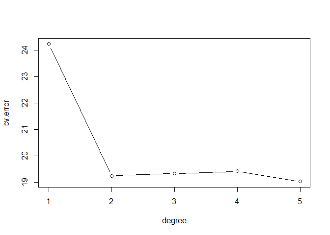
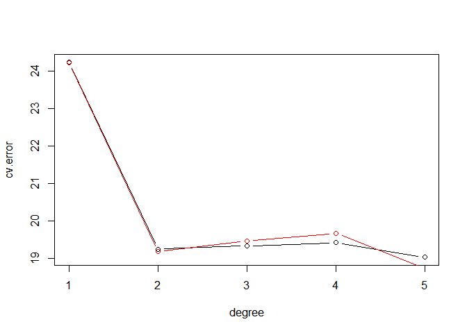
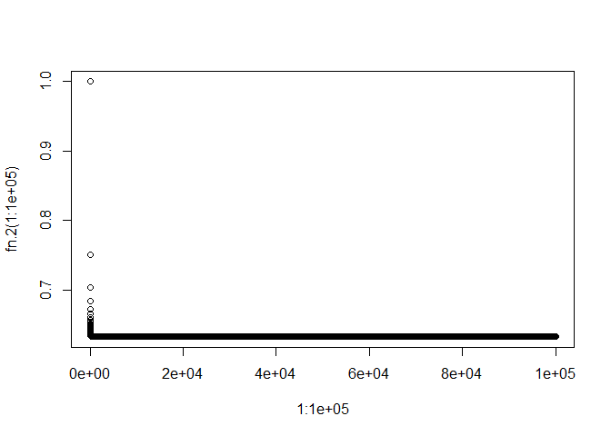

# chapter5-2
Min-Yao  
2018年2月11日  


# Chaper 5 Lab: Cross-Validation and the Bootstrap

# The Validation Set Approach


```r
library(ISLR)
set.seed(1)
train=sample(392,196)
lm.fit=lm(mpg~horsepower,data=Auto,subset=train)
attach(Auto)
mean((mpg-predict(lm.fit,Auto))[-train]^2)
```

```
## [1] 26.14142
```

```r
lm.fit2=lm(mpg~poly(horsepower,2),data=Auto,subset=train)
mean((mpg-predict(lm.fit2,Auto))[-train]^2)
```

```
## [1] 19.82259
```

```r
lm.fit3=lm(mpg~poly(horsepower,3),data=Auto,subset=train)
mean((mpg-predict(lm.fit3,Auto))[-train]^2)
```

```
## [1] 19.78252
```

```r
set.seed(2)
train=sample(392,196)
lm.fit=lm(mpg~horsepower,subset=train)
mean((mpg-predict(lm.fit,Auto))[-train]^2)
```

```
## [1] 23.29559
```

```r
lm.fit2=lm(mpg~poly(horsepower,2),data=Auto,subset=train)
mean((mpg-predict(lm.fit2,Auto))[-train]^2)
```

```
## [1] 18.90124
```

```r
lm.fit3=lm(mpg~poly(horsepower,3),data=Auto,subset=train)
mean((mpg-predict(lm.fit3,Auto))[-train]^2)
```

```
## [1] 19.2574
```

# Leave-One-Out Cross-Validation


```r
glm.fit=glm(mpg~horsepower,data=Auto)
coef(glm.fit)
```

```
## (Intercept)  horsepower 
##  39.9358610  -0.1578447
```

```r
lm.fit=lm(mpg~horsepower,data=Auto)
coef(lm.fit)
```

```
## (Intercept)  horsepower 
##  39.9358610  -0.1578447
```

```r
library(boot)
glm.fit=glm(mpg~horsepower,data=Auto)
cv.err=cv.glm(Auto,glm.fit)
cv.err$delta
```

```
## [1] 24.23151 24.23114
```

```r
cv.error=rep(0,5)
for (i in 1:5){
 glm.fit=glm(mpg~poly(horsepower,i),data=Auto)
 cv.error[i]=cv.glm(Auto,glm.fit)$delta[1]
 }
cv.error
```

```
## [1] 24.23151 19.24821 19.33498 19.42443 19.03321
```

```r
##LOOCV
glm.fit=glm(mpg~horsepower,data=Auto)
cv.glm(Auto,glm.fit)$delta
```

```
## [1] 24.23151 24.23114
```

```r
##formula 5.2
loocv=function(fit){
  h=lm.influence(fit)$h
  mean((residuals(fit)/(1-h))^2)
}

## try it out
loocv(glm.fit)
```

```
## [1] 24.23151
```

```r
cv.error=rep(0,5)
degree=1:5
for(d in degree){
  glm.fit=glm(mpg~poly(horsepower,d),data=Auto)
  cv.error[d]=loocv(glm.fit)
}
plot(degree,cv.error,type = "b")
```

<!-- -->

# k-Fold Cross-Validation


```r
set.seed(17)
cv.error.10=rep(0,10)
for (i in 1:10){
 glm.fit=glm(mpg~poly(horsepower,i),data=Auto)
 cv.error.10[i]=cv.glm(Auto,glm.fit,K=10)$delta[1]
 }
cv.error.10
```

```
##  [1] 24.20520 19.18924 19.30662 19.33799 18.87911 19.02103 18.89609
##  [8] 19.71201 18.95140 19.50196
```

```r
#lab
cv.error10=rep(0,5)
for (i in 1:5){
 glm.fit=glm(mpg~poly(horsepower,i),data=Auto)
 cv.error10[i]=cv.glm(Auto,glm.fit,K=10)$delta[1]
 }
cv.error10
```

```
## [1] 24.22415 19.18132 19.46048 19.67076 18.72933
```

```r
plot(degree,cv.error,type = "b")
lines(degree,cv.error10,type = "b", col="red")
```

<!-- -->

# The Bootstrap


```r
alpha.fn=function(data,index){
 X=data$X[index]
 Y=data$Y[index]
 return((var(Y)-cov(X,Y))/(var(X)+var(Y)-2*cov(X,Y)))
 }
alpha.fn(Portfolio,1:100)
```

```
## [1] 0.5758321
```

```r
set.seed(1)
alpha.fn(Portfolio,sample(100,100,replace=T))
```

```
## [1] 0.5963833
```

```r
boot(Portfolio,alpha.fn,R=1000)
```

```
## 
## ORDINARY NONPARAMETRIC BOOTSTRAP
## 
## 
## Call:
## boot(data = Portfolio, statistic = alpha.fn, R = 1000)
## 
## 
## Bootstrap Statistics :
##      original        bias    std. error
## t1* 0.5758321 -7.315422e-05  0.08861826
```

# Estimating the Accuracy of a Linear Regression Model


```r
boot.fn=function(data,index)
 return(coef(lm(mpg~horsepower,data=data,subset=index)))
boot.fn(Auto,1:392)
```

```
## (Intercept)  horsepower 
##  39.9358610  -0.1578447
```

```r
set.seed(1)
boot.fn(Auto,sample(392,392,replace=T))
```

```
## (Intercept)  horsepower 
##  38.7387134  -0.1481952
```

```r
boot.fn(Auto,sample(392,392,replace=T))
```

```
## (Intercept)  horsepower 
##  40.0383086  -0.1596104
```

```r
boot(Auto,boot.fn,1000)
```

```
## 
## ORDINARY NONPARAMETRIC BOOTSTRAP
## 
## 
## Call:
## boot(data = Auto, statistic = boot.fn, R = 1000)
## 
## 
## Bootstrap Statistics :
##       original      bias    std. error
## t1* 39.9358610  0.02972191 0.860007896
## t2* -0.1578447 -0.00030823 0.007404467
```

```r
summary(lm(mpg~horsepower,data=Auto))$coef
```

```
##               Estimate  Std. Error   t value      Pr(>|t|)
## (Intercept) 39.9358610 0.717498656  55.65984 1.220362e-187
## horsepower  -0.1578447 0.006445501 -24.48914  7.031989e-81
```

```r
boot.fn=function(data,index)
 coefficients(lm(mpg~horsepower+I(horsepower^2),data=data,subset=index))
set.seed(1)
boot(Auto,boot.fn,1000)
```

```
## 
## ORDINARY NONPARAMETRIC BOOTSTRAP
## 
## 
## Call:
## boot(data = Auto, statistic = boot.fn, R = 1000)
## 
## 
## Bootstrap Statistics :
##         original        bias     std. error
## t1* 56.900099702  6.098115e-03 2.0944855842
## t2* -0.466189630 -1.777108e-04 0.0334123802
## t3*  0.001230536  1.324315e-06 0.0001208339
```

```r
summary(lm(mpg~horsepower+I(horsepower^2),data=Auto))$coef
```

```
##                     Estimate   Std. Error   t value      Pr(>|t|)
## (Intercept)     56.900099702 1.8004268063  31.60367 1.740911e-109
## horsepower      -0.466189630 0.0311246171 -14.97816  2.289429e-40
## I(horsepower^2)  0.001230536 0.0001220759  10.08009  2.196340e-21
```

# 2. We will now derive the probability that a given observation is part of a bootstrap sample. Suppose that we obtain a bootstrap sample from a set of n observations.

## (a) What is the probability that the first bootstrap observation is not the jth observation from the original sample? Justify your answer.

> the probability is (n-1)/n

## (b) What is the probability that the second bootstrap observation is not the jth observation from the original sample?

> the probability is (n-1)/n, because the sampling is performed with replacement, which means that the replacement same observation can occur more than once in the bootstrap data set.

## (c) Argue that the probability that the jth observation is not in the bootstrap sample is (1 − 1/n)^n

>  By generating n simulated data sets from tha data, the probability that the jth observation is not in the bootstrap sample is `(1 − 1/n)*(1 − 1/n)*(1 − 1/n)*...= (1 − 1/n)^n`

## (d) When n = 5, what is the probability that the jth observation is in the bootstrap sample?

> 1-(1 − 1/n)^n


```r
fn.2=function(n){
  1-(1-1/n)^n
}
fn.2(5)
```

```
## [1] 0.67232
```


## (e) When n = 100, what is the probability that the jth observation is in the bootstrap sample?

> 1-(1 − 1/n)^n


```r
fn.2(100)
```

```
## [1] 0.6339677
```


## (f) When n = 10, 000, what is the probability that the jth observation is in the bootstrap sample?

> 1-(1 − 1/n)^n


```r
fn.2(10000)
```

```
## [1] 0.632139
```


## (g) Create a plot that displays, for each integer value of n from 1 to 100, 000, the probability that the jth observation is in the bootstrap sample. Comment on what you observe.


```r
plot(1:100000, fn.2(1:100000))
```

<!-- -->


## (h) We will now investigate numerically the probability that a bootstrap sample of size n = 100 contains the jth observation. Here j = 4. We repeatedly create bootstrap samples, and each time we record whether or not the fourth observation is contained in the bootstrap sample.


```r
store=rep(NA,10000)
for (i in 1:10000) {
store [i]= sum(sample(1:100, rep =TRUE)==4)>0
}
mean(store)
```

```
## [1] 0.6418
```
Comment on the results obtained.

> about 63%, almost the same as previous results

# 4. Suppose that we use some statistical learning method to make a prediction for the response Y for a particular value of the predictor X. Carefully describe how we might estimate the standard deviation of our prediction.

> We can use bootstrap. To estimate the standard deviation of our prediction, we repeated the process of simulating 100 paired observations of X and Y, 1,000 times. The sampling is performed with replacement, which means that the replacement same observation can occur more than once in the bootstrap data set.

# 6. We continue to consider the use of a logistic regression model to predict the probability of default using income and balance on the Default data set. In particular, we will now compute estimates for the standard errors of the income and balance logistic regression coefficients in two different ways: (1) using the bootstrap, and (2) using the standard formula for computing the standard errors in the glm() function. Do not forget to set a random seed before beginning your analysis.

## (a) Using the summary() and glm() functions, determine the estimated standard errors for the coefficients associated with income and balance in a multiple logistic regression model that uses both predictors.


```r
library(ISLR)
set.seed(1)
summary(Default)
```

```
##  default    student       balance           income     
##  No :9667   No :7056   Min.   :   0.0   Min.   :  772  
##  Yes: 333   Yes:2944   1st Qu.: 481.7   1st Qu.:21340  
##                        Median : 823.6   Median :34553  
##                        Mean   : 835.4   Mean   :33517  
##                        3rd Qu.:1166.3   3rd Qu.:43808  
##                        Max.   :2654.3   Max.   :73554
```

```r
dim(Default)
```

```
## [1] 10000     4
```

```r
glm.6a<-glm(default~income+balance,data=Default,family=binomial)
summary(glm.6a)
```

```
## 
## Call:
## glm(formula = default ~ income + balance, family = binomial, 
##     data = Default)
## 
## Deviance Residuals: 
##     Min       1Q   Median       3Q      Max  
## -2.4725  -0.1444  -0.0574  -0.0211   3.7245  
## 
## Coefficients:
##               Estimate Std. Error z value Pr(>|z|)    
## (Intercept) -1.154e+01  4.348e-01 -26.545  < 2e-16 ***
## income       2.081e-05  4.985e-06   4.174 2.99e-05 ***
## balance      5.647e-03  2.274e-04  24.836  < 2e-16 ***
## ---
## Signif. codes:  0 '***' 0.001 '**' 0.01 '*' 0.05 '.' 0.1 ' ' 1
## 
## (Dispersion parameter for binomial family taken to be 1)
## 
##     Null deviance: 2920.6  on 9999  degrees of freedom
## Residual deviance: 1579.0  on 9997  degrees of freedom
## AIC: 1585
## 
## Number of Fisher Scoring iterations: 8
```


## (b) Write a function, boot.fn(), that takes as input the Default data set as well as an index of the observations, and that outputs the coefficient estimates for income and balance in the multiple logistic regression model.


```r
boot.fn=function(data,index)
 return(coef(glm(default~income+balance,data=data,family=binomial,subset=index)))
set.seed(1)
boot.fn(Default,1:10000)
```

```
##   (Intercept)        income       balance 
## -1.154047e+01  2.080898e-05  5.647103e-03
```

```r
boot.fn(Default,sample(10000,10000,replace=T))
```

```
##   (Intercept)        income       balance 
## -1.115930e+01  2.134762e-05  5.419225e-03
```


## (c) Use the boot() function together with your boot.fn() function to estimate the standard errors of the logistic regression coefficients for income and balance.


```r
library(boot)
#?boot
boot(Default,boot.fn,1000)
```

```
## 
## ORDINARY NONPARAMETRIC BOOTSTRAP
## 
## 
## Call:
## boot(data = Default, statistic = boot.fn, R = 1000)
## 
## 
## Bootstrap Statistics :
##          original        bias     std. error
## t1* -1.154047e+01 -8.648704e-03 4.240313e-01
## t2*  2.080898e-05  5.360985e-08 4.588898e-06
## t3*  5.647103e-03  2.800720e-06 2.268846e-04
```

```r
summary(glm.6a)$coef
```

```
##                  Estimate   Std. Error    z value      Pr(>|z|)
## (Intercept) -1.154047e+01 4.347564e-01 -26.544680 2.958355e-155
## income       2.080898e-05 4.985167e-06   4.174178  2.990638e-05
## balance      5.647103e-03 2.273731e-04  24.836280 3.638120e-136
```

## (d) Comment on the estimated standard errors obtained using the glm() function and using your bootstrap function.

> Since this model provides a good fit to the data, there is a good correspondence between the bootstrap estimates and the standard estimates.

> The standard formulas rely on certain assumptions: (1) they
depend on the unknown parameter σ^2 , the noise variance.(2) the xi are fixed, and all the variability comes from the variation in the errors Ei.

> The bootstrap approach does not rely on any of these assumptions, and so it is likely giving a more accurate estimate of the standard errors than is the summary() function.


# 9. We will now consider the Boston housing data set, from the MASS library.

## (a) Based on this data set, provide an estimate for the population mean of medv. Call this estimate ˆμ.


```r
library(MASS)
summary(Boston)
```

```
##       crim                zn             indus            chas        
##  Min.   : 0.00632   Min.   :  0.00   Min.   : 0.46   Min.   :0.00000  
##  1st Qu.: 0.08204   1st Qu.:  0.00   1st Qu.: 5.19   1st Qu.:0.00000  
##  Median : 0.25651   Median :  0.00   Median : 9.69   Median :0.00000  
##  Mean   : 3.61352   Mean   : 11.36   Mean   :11.14   Mean   :0.06917  
##  3rd Qu.: 3.67708   3rd Qu.: 12.50   3rd Qu.:18.10   3rd Qu.:0.00000  
##  Max.   :88.97620   Max.   :100.00   Max.   :27.74   Max.   :1.00000  
##       nox               rm             age              dis        
##  Min.   :0.3850   Min.   :3.561   Min.   :  2.90   Min.   : 1.130  
##  1st Qu.:0.4490   1st Qu.:5.886   1st Qu.: 45.02   1st Qu.: 2.100  
##  Median :0.5380   Median :6.208   Median : 77.50   Median : 3.207  
##  Mean   :0.5547   Mean   :6.285   Mean   : 68.57   Mean   : 3.795  
##  3rd Qu.:0.6240   3rd Qu.:6.623   3rd Qu.: 94.08   3rd Qu.: 5.188  
##  Max.   :0.8710   Max.   :8.780   Max.   :100.00   Max.   :12.127  
##       rad              tax           ptratio          black       
##  Min.   : 1.000   Min.   :187.0   Min.   :12.60   Min.   :  0.32  
##  1st Qu.: 4.000   1st Qu.:279.0   1st Qu.:17.40   1st Qu.:375.38  
##  Median : 5.000   Median :330.0   Median :19.05   Median :391.44  
##  Mean   : 9.549   Mean   :408.2   Mean   :18.46   Mean   :356.67  
##  3rd Qu.:24.000   3rd Qu.:666.0   3rd Qu.:20.20   3rd Qu.:396.23  
##  Max.   :24.000   Max.   :711.0   Max.   :22.00   Max.   :396.90  
##      lstat            medv      
##  Min.   : 1.73   Min.   : 5.00  
##  1st Qu.: 6.95   1st Qu.:17.02  
##  Median :11.36   Median :21.20  
##  Mean   :12.65   Mean   :22.53  
##  3rd Qu.:16.95   3rd Qu.:25.00  
##  Max.   :37.97   Max.   :50.00
```

```r
mu.9a<-mean(Boston$medv)
mu.9a
```

```
## [1] 22.53281
```


## (b) Provide an estimate of the standard error of ˆμ. Interpret this result.
Hint: We can compute the standard error of the sample mean by dividing the sample standard deviation by the square root of the number of observations.


```r
dim(Boston)
```

```
## [1] 506  14
```

```r
nrow(Boston)
```

```
## [1] 506
```

```r
standard.error<-sd(Boston$medv)/sqrt(nrow(Boston))
standard.error
```

```
## [1] 0.4088611
```


## (c) Now estimate the standard error of ˆμ using the bootstrap. How does this compare to your answer from (b)?


```r
set.seed(1)
boot.fn=function(data,index)
 mean(data[index])
boot.9c<-boot(Boston$medv,boot.fn,1000)
boot.9c
```

```
## 
## ORDINARY NONPARAMETRIC BOOTSTRAP
## 
## 
## Call:
## boot(data = Boston$medv, statistic = boot.fn, R = 1000)
## 
## 
## Bootstrap Statistics :
##     original      bias    std. error
## t1* 22.53281 0.008517589   0.4119374
```

>  these are somewhat different from the estimates obtained using the bootstrap.

## (d) Based on your bootstrap estimate from (c), provide a 95 % confidence interval for the mean of medv. Compare it to the results obtained using t.test(Boston$medv).
Hint: You can approximate a 95 % confidence interval using the formula [ˆμ − 2SE(ˆμ), ˆμ + 2SE(ˆμ)].


```r
#?boot
sd(boot.9c$t)
```

```
## [1] 0.4119374
```

```r
nrow(boot.9c$t)
```

```
## [1] 1000
```

```r
SE<-sd(boot.9c$t)/sqrt(nrow(boot.9c$t))
SE
```

```
## [1] 0.01302661
```

```r
mu.9a
```

```
## [1] 22.53281
```

```r
lowinterval=mu.9a-2*SE
lowinterval
```

```
## [1] 22.50675
```

```r
highinterval=mu.9a+2*SE
highinterval
```

```
## [1] 22.55886
```

```r
t.test(Boston$medv)
```

```
## 
## 	One Sample t-test
## 
## data:  Boston$medv
## t = 55.111, df = 505, p-value < 2.2e-16
## alternative hypothesis: true mean is not equal to 0
## 95 percent confidence interval:
##  21.72953 23.33608
## sample estimates:
## mean of x 
##  22.53281
```


## (e) Based on this data set, provide an estimate, ˆμ med , for the median value of medv in the population.


```r
mu.med=median(Boston$medv)
mu.med
```

```
## [1] 21.2
```


## (f) We now would like to estimate the standard error of ˆμ med . Unfortunately, there is no simple formula for computing the standard error of the median. Instead, estimate the standard error of the median using the bootstrap. Comment on your findings.


```r
set.seed(1)
boot.fn=function(data,index)
 median(data[index])
boot.9f<-boot(Boston$medv,boot.fn,1000)
boot.9f
```

```
## 
## ORDINARY NONPARAMETRIC BOOTSTRAP
## 
## 
## Call:
## boot(data = Boston$medv, statistic = boot.fn, R = 1000)
## 
## 
## Bootstrap Statistics :
##     original   bias    std. error
## t1*     21.2 -0.01615   0.3801002
```


## (g) Based on this data set, provide an estimate for the tenth percentile of medv in Boston suburbs. Call this quantity ˆμ 0.1 . (You can use the quantile() function.)


```r
#?quantile
mu.0.1=quantile(Boston$medv,0.1)
mu.0.1
```

```
##   10% 
## 12.75
```


## (h) Use the bootstrap to estimate the standard error of ˆμ 0.1 . Comment on your findings.


```r
set.seed(1)
boot.fn=function(data,index)
 quantile(data[index],0.1)
boot.9h<-boot(Boston$medv,boot.fn,1000)
boot.9h
```

```
## 
## ORDINARY NONPARAMETRIC BOOTSTRAP
## 
## 
## Call:
## boot(data = Boston$medv, statistic = boot.fn, R = 1000)
## 
## 
## Bootstrap Statistics :
##     original  bias    std. error
## t1*    12.75 0.01005    0.505056
```

