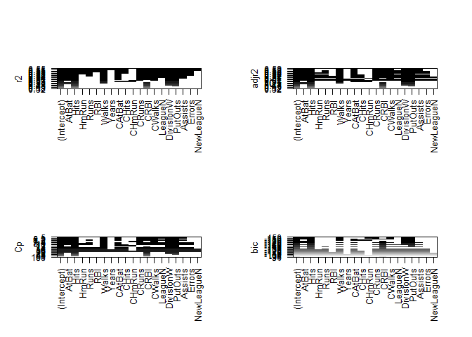

# chapter6-1
Min-Yao  
2018年2月18日  

# Chapter 6 Lab 1: Subset Selection Methods

# Best Subset Selection


```r
library(ISLR)
fix(Hitters)
names(Hitters)
```

```
##  [1] "AtBat"     "Hits"      "HmRun"     "Runs"      "RBI"      
##  [6] "Walks"     "Years"     "CAtBat"    "CHits"     "CHmRun"   
## [11] "CRuns"     "CRBI"      "CWalks"    "League"    "Division" 
## [16] "PutOuts"   "Assists"   "Errors"    "Salary"    "NewLeague"
```

```r
dim(Hitters)
```

```
## [1] 322  20
```

```r
sum(is.na(Hitters$Salary))
```

```
## [1] 59
```

```r
Hitters=na.omit(Hitters)
dim(Hitters)
```

```
## [1] 263  20
```

```r
sum(is.na(Hitters))
```

```
## [1] 0
```

```r
library(leaps)
regfit.full=regsubsets(Salary~.,Hitters)
summary(regfit.full)
```

```
## Subset selection object
## Call: regsubsets.formula(Salary ~ ., Hitters)
## 19 Variables  (and intercept)
##            Forced in Forced out
## AtBat          FALSE      FALSE
## Hits           FALSE      FALSE
## HmRun          FALSE      FALSE
## Runs           FALSE      FALSE
## RBI            FALSE      FALSE
## Walks          FALSE      FALSE
## Years          FALSE      FALSE
## CAtBat         FALSE      FALSE
## CHits          FALSE      FALSE
## CHmRun         FALSE      FALSE
## CRuns          FALSE      FALSE
## CRBI           FALSE      FALSE
## CWalks         FALSE      FALSE
## LeagueN        FALSE      FALSE
## DivisionW      FALSE      FALSE
## PutOuts        FALSE      FALSE
## Assists        FALSE      FALSE
## Errors         FALSE      FALSE
## NewLeagueN     FALSE      FALSE
## 1 subsets of each size up to 8
## Selection Algorithm: exhaustive
##          AtBat Hits HmRun Runs RBI Walks Years CAtBat CHits CHmRun CRuns
## 1  ( 1 ) " "   " "  " "   " "  " " " "   " "   " "    " "   " "    " "  
## 2  ( 1 ) " "   "*"  " "   " "  " " " "   " "   " "    " "   " "    " "  
## 3  ( 1 ) " "   "*"  " "   " "  " " " "   " "   " "    " "   " "    " "  
## 4  ( 1 ) " "   "*"  " "   " "  " " " "   " "   " "    " "   " "    " "  
## 5  ( 1 ) "*"   "*"  " "   " "  " " " "   " "   " "    " "   " "    " "  
## 6  ( 1 ) "*"   "*"  " "   " "  " " "*"   " "   " "    " "   " "    " "  
## 7  ( 1 ) " "   "*"  " "   " "  " " "*"   " "   "*"    "*"   "*"    " "  
## 8  ( 1 ) "*"   "*"  " "   " "  " " "*"   " "   " "    " "   "*"    "*"  
##          CRBI CWalks LeagueN DivisionW PutOuts Assists Errors NewLeagueN
## 1  ( 1 ) "*"  " "    " "     " "       " "     " "     " "    " "       
## 2  ( 1 ) "*"  " "    " "     " "       " "     " "     " "    " "       
## 3  ( 1 ) "*"  " "    " "     " "       "*"     " "     " "    " "       
## 4  ( 1 ) "*"  " "    " "     "*"       "*"     " "     " "    " "       
## 5  ( 1 ) "*"  " "    " "     "*"       "*"     " "     " "    " "       
## 6  ( 1 ) "*"  " "    " "     "*"       "*"     " "     " "    " "       
## 7  ( 1 ) " "  " "    " "     "*"       "*"     " "     " "    " "       
## 8  ( 1 ) " "  "*"    " "     "*"       "*"     " "     " "    " "
```

```r
regfit.full=regsubsets(Salary~.,data=Hitters,nvmax=19)
reg.summary=summary(regfit.full)
names(reg.summary)
```

```
## [1] "which"  "rsq"    "rss"    "adjr2"  "cp"     "bic"    "outmat" "obj"
```

```r
reg.summary$rsq
```

```
##  [1] 0.3214501 0.4252237 0.4514294 0.4754067 0.4908036 0.5087146 0.5141227
##  [8] 0.5285569 0.5346124 0.5404950 0.5426153 0.5436302 0.5444570 0.5452164
## [15] 0.5454692 0.5457656 0.5459518 0.5460945 0.5461159
```

```r
par(mfrow=c(2,2))
plot(reg.summary$rss,xlab="Number of Variables",ylab="RSS",type="l")
plot(reg.summary$adjr2,xlab="Number of Variables",ylab="Adjusted RSq",type="l")
which.max(reg.summary$adjr2)
```

```
## [1] 11
```

```r
points(11,reg.summary$adjr2[11], col="red",cex=2,pch=20)
plot(reg.summary$cp,xlab="Number of Variables",ylab="Cp",type='l')
which.min(reg.summary$cp)
```

```
## [1] 10
```

```r
points(10,reg.summary$cp[10],col="red",cex=2,pch=20)
which.min(reg.summary$bic)
```

```
## [1] 6
```

```r
plot(reg.summary$bic,xlab="Number of Variables",ylab="BIC",type='l')
points(6,reg.summary$bic[6],col="red",cex=2,pch=20)
```

<!-- -->

```r
plot(regfit.full,scale="r2")
plot(regfit.full,scale="adjr2")
plot(regfit.full,scale="Cp")
plot(regfit.full,scale="bic")
```

<!-- -->

```r
coef(regfit.full,6)
```

```
##  (Intercept)        AtBat         Hits        Walks         CRBI 
##   91.5117981   -1.8685892    7.6043976    3.6976468    0.6430169 
##    DivisionW      PutOuts 
## -122.9515338    0.2643076
```


# Forward and Backward Stepwise Selection


```r
regfit.fwd=regsubsets(Salary~.,data=Hitters,nvmax=19,method="forward")
summary(regfit.fwd)
```

```
## Subset selection object
## Call: regsubsets.formula(Salary ~ ., data = Hitters, nvmax = 19, method = "forward")
## 19 Variables  (and intercept)
##            Forced in Forced out
## AtBat          FALSE      FALSE
## Hits           FALSE      FALSE
## HmRun          FALSE      FALSE
## Runs           FALSE      FALSE
## RBI            FALSE      FALSE
## Walks          FALSE      FALSE
## Years          FALSE      FALSE
## CAtBat         FALSE      FALSE
## CHits          FALSE      FALSE
## CHmRun         FALSE      FALSE
## CRuns          FALSE      FALSE
## CRBI           FALSE      FALSE
## CWalks         FALSE      FALSE
## LeagueN        FALSE      FALSE
## DivisionW      FALSE      FALSE
## PutOuts        FALSE      FALSE
## Assists        FALSE      FALSE
## Errors         FALSE      FALSE
## NewLeagueN     FALSE      FALSE
## 1 subsets of each size up to 19
## Selection Algorithm: forward
##           AtBat Hits HmRun Runs RBI Walks Years CAtBat CHits CHmRun CRuns
## 1  ( 1 )  " "   " "  " "   " "  " " " "   " "   " "    " "   " "    " "  
## 2  ( 1 )  " "   "*"  " "   " "  " " " "   " "   " "    " "   " "    " "  
## 3  ( 1 )  " "   "*"  " "   " "  " " " "   " "   " "    " "   " "    " "  
## 4  ( 1 )  " "   "*"  " "   " "  " " " "   " "   " "    " "   " "    " "  
## 5  ( 1 )  "*"   "*"  " "   " "  " " " "   " "   " "    " "   " "    " "  
## 6  ( 1 )  "*"   "*"  " "   " "  " " "*"   " "   " "    " "   " "    " "  
## 7  ( 1 )  "*"   "*"  " "   " "  " " "*"   " "   " "    " "   " "    " "  
## 8  ( 1 )  "*"   "*"  " "   " "  " " "*"   " "   " "    " "   " "    "*"  
## 9  ( 1 )  "*"   "*"  " "   " "  " " "*"   " "   "*"    " "   " "    "*"  
## 10  ( 1 ) "*"   "*"  " "   " "  " " "*"   " "   "*"    " "   " "    "*"  
## 11  ( 1 ) "*"   "*"  " "   " "  " " "*"   " "   "*"    " "   " "    "*"  
## 12  ( 1 ) "*"   "*"  " "   "*"  " " "*"   " "   "*"    " "   " "    "*"  
## 13  ( 1 ) "*"   "*"  " "   "*"  " " "*"   " "   "*"    " "   " "    "*"  
## 14  ( 1 ) "*"   "*"  "*"   "*"  " " "*"   " "   "*"    " "   " "    "*"  
## 15  ( 1 ) "*"   "*"  "*"   "*"  " " "*"   " "   "*"    "*"   " "    "*"  
## 16  ( 1 ) "*"   "*"  "*"   "*"  "*" "*"   " "   "*"    "*"   " "    "*"  
## 17  ( 1 ) "*"   "*"  "*"   "*"  "*" "*"   " "   "*"    "*"   " "    "*"  
## 18  ( 1 ) "*"   "*"  "*"   "*"  "*" "*"   "*"   "*"    "*"   " "    "*"  
## 19  ( 1 ) "*"   "*"  "*"   "*"  "*" "*"   "*"   "*"    "*"   "*"    "*"  
##           CRBI CWalks LeagueN DivisionW PutOuts Assists Errors NewLeagueN
## 1  ( 1 )  "*"  " "    " "     " "       " "     " "     " "    " "       
## 2  ( 1 )  "*"  " "    " "     " "       " "     " "     " "    " "       
## 3  ( 1 )  "*"  " "    " "     " "       "*"     " "     " "    " "       
## 4  ( 1 )  "*"  " "    " "     "*"       "*"     " "     " "    " "       
## 5  ( 1 )  "*"  " "    " "     "*"       "*"     " "     " "    " "       
## 6  ( 1 )  "*"  " "    " "     "*"       "*"     " "     " "    " "       
## 7  ( 1 )  "*"  "*"    " "     "*"       "*"     " "     " "    " "       
## 8  ( 1 )  "*"  "*"    " "     "*"       "*"     " "     " "    " "       
## 9  ( 1 )  "*"  "*"    " "     "*"       "*"     " "     " "    " "       
## 10  ( 1 ) "*"  "*"    " "     "*"       "*"     "*"     " "    " "       
## 11  ( 1 ) "*"  "*"    "*"     "*"       "*"     "*"     " "    " "       
## 12  ( 1 ) "*"  "*"    "*"     "*"       "*"     "*"     " "    " "       
## 13  ( 1 ) "*"  "*"    "*"     "*"       "*"     "*"     "*"    " "       
## 14  ( 1 ) "*"  "*"    "*"     "*"       "*"     "*"     "*"    " "       
## 15  ( 1 ) "*"  "*"    "*"     "*"       "*"     "*"     "*"    " "       
## 16  ( 1 ) "*"  "*"    "*"     "*"       "*"     "*"     "*"    " "       
## 17  ( 1 ) "*"  "*"    "*"     "*"       "*"     "*"     "*"    "*"       
## 18  ( 1 ) "*"  "*"    "*"     "*"       "*"     "*"     "*"    "*"       
## 19  ( 1 ) "*"  "*"    "*"     "*"       "*"     "*"     "*"    "*"
```

```r
regfit.bwd=regsubsets(Salary~.,data=Hitters,nvmax=19,method="backward")
summary(regfit.bwd)
```

```
## Subset selection object
## Call: regsubsets.formula(Salary ~ ., data = Hitters, nvmax = 19, method = "backward")
## 19 Variables  (and intercept)
##            Forced in Forced out
## AtBat          FALSE      FALSE
## Hits           FALSE      FALSE
## HmRun          FALSE      FALSE
## Runs           FALSE      FALSE
## RBI            FALSE      FALSE
## Walks          FALSE      FALSE
## Years          FALSE      FALSE
## CAtBat         FALSE      FALSE
## CHits          FALSE      FALSE
## CHmRun         FALSE      FALSE
## CRuns          FALSE      FALSE
## CRBI           FALSE      FALSE
## CWalks         FALSE      FALSE
## LeagueN        FALSE      FALSE
## DivisionW      FALSE      FALSE
## PutOuts        FALSE      FALSE
## Assists        FALSE      FALSE
## Errors         FALSE      FALSE
## NewLeagueN     FALSE      FALSE
## 1 subsets of each size up to 19
## Selection Algorithm: backward
##           AtBat Hits HmRun Runs RBI Walks Years CAtBat CHits CHmRun CRuns
## 1  ( 1 )  " "   " "  " "   " "  " " " "   " "   " "    " "   " "    "*"  
## 2  ( 1 )  " "   "*"  " "   " "  " " " "   " "   " "    " "   " "    "*"  
## 3  ( 1 )  " "   "*"  " "   " "  " " " "   " "   " "    " "   " "    "*"  
## 4  ( 1 )  "*"   "*"  " "   " "  " " " "   " "   " "    " "   " "    "*"  
## 5  ( 1 )  "*"   "*"  " "   " "  " " "*"   " "   " "    " "   " "    "*"  
## 6  ( 1 )  "*"   "*"  " "   " "  " " "*"   " "   " "    " "   " "    "*"  
## 7  ( 1 )  "*"   "*"  " "   " "  " " "*"   " "   " "    " "   " "    "*"  
## 8  ( 1 )  "*"   "*"  " "   " "  " " "*"   " "   " "    " "   " "    "*"  
## 9  ( 1 )  "*"   "*"  " "   " "  " " "*"   " "   "*"    " "   " "    "*"  
## 10  ( 1 ) "*"   "*"  " "   " "  " " "*"   " "   "*"    " "   " "    "*"  
## 11  ( 1 ) "*"   "*"  " "   " "  " " "*"   " "   "*"    " "   " "    "*"  
## 12  ( 1 ) "*"   "*"  " "   "*"  " " "*"   " "   "*"    " "   " "    "*"  
## 13  ( 1 ) "*"   "*"  " "   "*"  " " "*"   " "   "*"    " "   " "    "*"  
## 14  ( 1 ) "*"   "*"  "*"   "*"  " " "*"   " "   "*"    " "   " "    "*"  
## 15  ( 1 ) "*"   "*"  "*"   "*"  " " "*"   " "   "*"    "*"   " "    "*"  
## 16  ( 1 ) "*"   "*"  "*"   "*"  "*" "*"   " "   "*"    "*"   " "    "*"  
## 17  ( 1 ) "*"   "*"  "*"   "*"  "*" "*"   " "   "*"    "*"   " "    "*"  
## 18  ( 1 ) "*"   "*"  "*"   "*"  "*" "*"   "*"   "*"    "*"   " "    "*"  
## 19  ( 1 ) "*"   "*"  "*"   "*"  "*" "*"   "*"   "*"    "*"   "*"    "*"  
##           CRBI CWalks LeagueN DivisionW PutOuts Assists Errors NewLeagueN
## 1  ( 1 )  " "  " "    " "     " "       " "     " "     " "    " "       
## 2  ( 1 )  " "  " "    " "     " "       " "     " "     " "    " "       
## 3  ( 1 )  " "  " "    " "     " "       "*"     " "     " "    " "       
## 4  ( 1 )  " "  " "    " "     " "       "*"     " "     " "    " "       
## 5  ( 1 )  " "  " "    " "     " "       "*"     " "     " "    " "       
## 6  ( 1 )  " "  " "    " "     "*"       "*"     " "     " "    " "       
## 7  ( 1 )  " "  "*"    " "     "*"       "*"     " "     " "    " "       
## 8  ( 1 )  "*"  "*"    " "     "*"       "*"     " "     " "    " "       
## 9  ( 1 )  "*"  "*"    " "     "*"       "*"     " "     " "    " "       
## 10  ( 1 ) "*"  "*"    " "     "*"       "*"     "*"     " "    " "       
## 11  ( 1 ) "*"  "*"    "*"     "*"       "*"     "*"     " "    " "       
## 12  ( 1 ) "*"  "*"    "*"     "*"       "*"     "*"     " "    " "       
## 13  ( 1 ) "*"  "*"    "*"     "*"       "*"     "*"     "*"    " "       
## 14  ( 1 ) "*"  "*"    "*"     "*"       "*"     "*"     "*"    " "       
## 15  ( 1 ) "*"  "*"    "*"     "*"       "*"     "*"     "*"    " "       
## 16  ( 1 ) "*"  "*"    "*"     "*"       "*"     "*"     "*"    " "       
## 17  ( 1 ) "*"  "*"    "*"     "*"       "*"     "*"     "*"    "*"       
## 18  ( 1 ) "*"  "*"    "*"     "*"       "*"     "*"     "*"    "*"       
## 19  ( 1 ) "*"  "*"    "*"     "*"       "*"     "*"     "*"    "*"
```

```r
coef(regfit.full,7)
```

```
##  (Intercept)         Hits        Walks       CAtBat        CHits 
##   79.4509472    1.2833513    3.2274264   -0.3752350    1.4957073 
##       CHmRun    DivisionW      PutOuts 
##    1.4420538 -129.9866432    0.2366813
```

```r
coef(regfit.fwd,7)
```

```
##  (Intercept)        AtBat         Hits        Walks         CRBI 
##  109.7873062   -1.9588851    7.4498772    4.9131401    0.8537622 
##       CWalks    DivisionW      PutOuts 
##   -0.3053070 -127.1223928    0.2533404
```

```r
coef(regfit.bwd,7)
```

```
##  (Intercept)        AtBat         Hits        Walks        CRuns 
##  105.6487488   -1.9762838    6.7574914    6.0558691    1.1293095 
##       CWalks    DivisionW      PutOuts 
##   -0.7163346 -116.1692169    0.3028847
```

# 1. We perform best subset, forward stepwise, and backward stepwise selection on a single data set. For each approach, we obtain p + 1 models, containing 0, 1, 2, . . . , p predictors. Explain your answers:

## (a) Which of the three models with k predictors has the smallest training RSS?

## (b) Which of the three models with k predictors has the smallest test RSS?

## (c) True or False:

### i. The predictors in the k-variable model identified by forward stepwise are a subset of the predictors in the (k+1)-variable model identified by forward stepwise selection.

### ii. The predictors in the k-variable model identified by backward stepwise are a subset of the predictors in the (k + 1)-variable model identified by backward stepwise selection.

### iii. The predictors in the k-variable model identified by back-ward stepwise are a subset of the predictors in the (k + 1)-variable model identified by forward stepwise selection.

### iv. The predictors in the k-variable model identified by forward stepwise are a subset of the predictors in the (k+1)-variable model identified by backward stepwise selection.

### v. The predictors in the k-variable model identified by best subset are a subset of the predictors in the (k + 1)-variable model identified by best subset selection.

# 8. In this exercise, we will generate simulated data, and will then use this data to perform best subset selection.
## (a) Use the rnorm() function to generate a predictor X of length n = 100, as well as a noise vector E of length n = 100.

## (b) Generate a response vector Y of length n = 100 according to the model Y = β 0 + β 1 X + β 2 X^2 + β 3 X^3 + E, where β 0 , β 1 , β 2 , and β 3 are constants of your choice.

## (c) Use the regsubsets() function to perform best subset selection in order to choose the best model containing the predictors X, X^2, . . . , X^10. What is the best model obtained according to Cp , BIC, and adjusted R 2 ? Show some plots to provide evidence for your answer, and report the coefficients of the best model obtained. Note you will need to use the data.frame() function to create a single data set containing both X and Y.

## (d) Repeat (c), using forward stepwise selection and also using backwards stepwise selection. How does your answer compare to the results in (c)?

## (e) Now fit a lasso model to the simulated data, again using X, X^2 , . . . , X^10 as predictors. Use cross-validation to select the optimal value of λ. Create plots of the cross-validation error as a function of λ. Report the resulting coefficient estimates, and discuss the results obtained.

## (f) Now generate a response vector Y according to the model Y = β 0 + β 7 X^7 + E, and perform best subset selection and the lasso. Discuss the results obtained.
