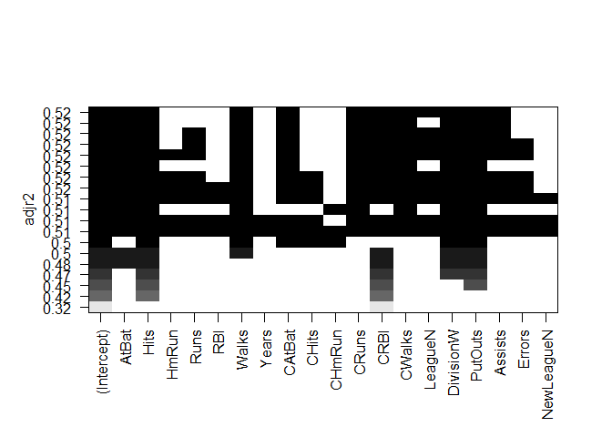
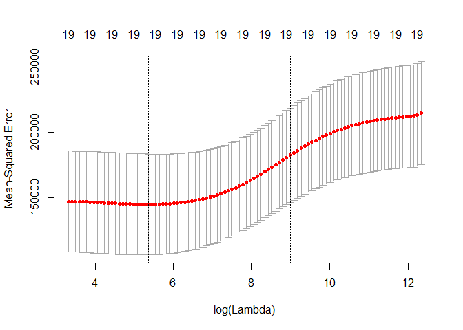
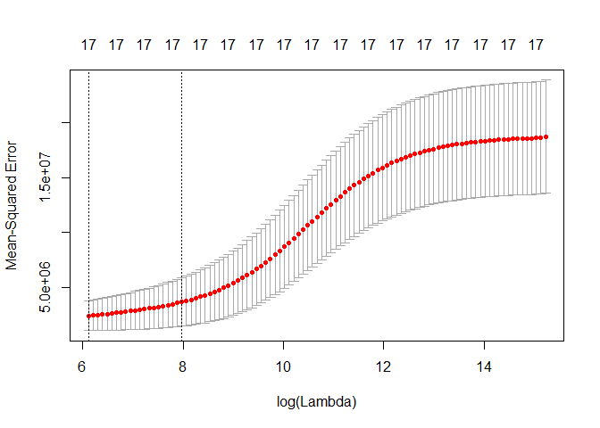

# chapter6-2
Min-Yao  
2018年2月24日  

# Chapter 6 Lab 1: Subset Selection Methods

# Best Subset Selection


```r
library(ISLR)
#fix(Hitters)
names(Hitters)
```

```
##  [1] "AtBat"     "Hits"      "HmRun"     "Runs"      "RBI"      
##  [6] "Walks"     "Years"     "CAtBat"    "CHits"     "CHmRun"   
## [11] "CRuns"     "CRBI"      "CWalks"    "League"    "Division" 
## [16] "PutOuts"   "Assists"   "Errors"    "Salary"    "NewLeague"
```

```r
dim(Hitters)
```

```
## [1] 322  20
```

```r
sum(is.na(Hitters$Salary))
```

```
## [1] 59
```

```r
Hitters=na.omit(Hitters)
dim(Hitters)
```

```
## [1] 263  20
```

```r
sum(is.na(Hitters))
```

```
## [1] 0
```

```r
library(leaps)
regfit.full=regsubsets(Salary~.,Hitters)
summary(regfit.full)
```

```
## Subset selection object
## Call: regsubsets.formula(Salary ~ ., Hitters)
## 19 Variables  (and intercept)
##            Forced in Forced out
## AtBat          FALSE      FALSE
## Hits           FALSE      FALSE
## HmRun          FALSE      FALSE
## Runs           FALSE      FALSE
## RBI            FALSE      FALSE
## Walks          FALSE      FALSE
## Years          FALSE      FALSE
## CAtBat         FALSE      FALSE
## CHits          FALSE      FALSE
## CHmRun         FALSE      FALSE
## CRuns          FALSE      FALSE
## CRBI           FALSE      FALSE
## CWalks         FALSE      FALSE
## LeagueN        FALSE      FALSE
## DivisionW      FALSE      FALSE
## PutOuts        FALSE      FALSE
## Assists        FALSE      FALSE
## Errors         FALSE      FALSE
## NewLeagueN     FALSE      FALSE
## 1 subsets of each size up to 8
## Selection Algorithm: exhaustive
##          AtBat Hits HmRun Runs RBI Walks Years CAtBat CHits CHmRun CRuns
## 1  ( 1 ) " "   " "  " "   " "  " " " "   " "   " "    " "   " "    " "  
## 2  ( 1 ) " "   "*"  " "   " "  " " " "   " "   " "    " "   " "    " "  
## 3  ( 1 ) " "   "*"  " "   " "  " " " "   " "   " "    " "   " "    " "  
## 4  ( 1 ) " "   "*"  " "   " "  " " " "   " "   " "    " "   " "    " "  
## 5  ( 1 ) "*"   "*"  " "   " "  " " " "   " "   " "    " "   " "    " "  
## 6  ( 1 ) "*"   "*"  " "   " "  " " "*"   " "   " "    " "   " "    " "  
## 7  ( 1 ) " "   "*"  " "   " "  " " "*"   " "   "*"    "*"   "*"    " "  
## 8  ( 1 ) "*"   "*"  " "   " "  " " "*"   " "   " "    " "   "*"    "*"  
##          CRBI CWalks LeagueN DivisionW PutOuts Assists Errors NewLeagueN
## 1  ( 1 ) "*"  " "    " "     " "       " "     " "     " "    " "       
## 2  ( 1 ) "*"  " "    " "     " "       " "     " "     " "    " "       
## 3  ( 1 ) "*"  " "    " "     " "       "*"     " "     " "    " "       
## 4  ( 1 ) "*"  " "    " "     "*"       "*"     " "     " "    " "       
## 5  ( 1 ) "*"  " "    " "     "*"       "*"     " "     " "    " "       
## 6  ( 1 ) "*"  " "    " "     "*"       "*"     " "     " "    " "       
## 7  ( 1 ) " "  " "    " "     "*"       "*"     " "     " "    " "       
## 8  ( 1 ) " "  "*"    " "     "*"       "*"     " "     " "    " "
```

```r
regfit.full=regsubsets(Salary~.,data=Hitters,nvmax=19)
reg.summary=summary(regfit.full)
names(reg.summary)
```

```
## [1] "which"  "rsq"    "rss"    "adjr2"  "cp"     "bic"    "outmat" "obj"
```

```r
reg.summary$rsq
```

```
##  [1] 0.3214501 0.4252237 0.4514294 0.4754067 0.4908036 0.5087146 0.5141227
##  [8] 0.5285569 0.5346124 0.5404950 0.5426153 0.5436302 0.5444570 0.5452164
## [15] 0.5454692 0.5457656 0.5459518 0.5460945 0.5461159
```

```r
#par(mfrow=c(2,2))
plot(reg.summary$rss,xlab="Number of Variables",ylab="RSS",type="l")
```

<!-- -->

```r
plot(reg.summary$adjr2,xlab="Number of Variables",ylab="Adjusted RSq",type="l")
which.max(reg.summary$adjr2)
```

```
## [1] 11
```

```r
points(11,reg.summary$adjr2[11], col="red",cex=2,pch=20)
```

<!-- -->

```r
plot(reg.summary$cp,xlab="Number of Variables",ylab="Cp",type='l')
which.min(reg.summary$cp)
```

```
## [1] 10
```

```r
points(10,reg.summary$cp[10],col="red",cex=2,pch=20)
```

<!-- -->

```r
which.min(reg.summary$bic)
```

```
## [1] 6
```

```r
plot(reg.summary$bic,xlab="Number of Variables",ylab="BIC",type='l')
points(6,reg.summary$bic[6],col="red",cex=2,pch=20)
```

<!-- -->

```r
#?plot.regsubsets
plot(regfit.full,scale="r2")
```

<!-- -->

```r
plot(regfit.full,scale="adjr2")
```

<!-- -->

```r
plot(regfit.full,scale="Cp")
```

<!-- -->

```r
plot(regfit.full,scale="bic")
```

<!-- -->

```r
coef(regfit.full,6)
```

```
##  (Intercept)        AtBat         Hits        Walks         CRBI 
##   91.5117981   -1.8685892    7.6043976    3.6976468    0.6430169 
##    DivisionW      PutOuts 
## -122.9515338    0.2643076
```

# Forward and Backward Stepwise Selection


```r
regfit.fwd=regsubsets(Salary~.,data=Hitters,nvmax=19,method="forward")
summary(regfit.fwd)
```

```
## Subset selection object
## Call: regsubsets.formula(Salary ~ ., data = Hitters, nvmax = 19, method = "forward")
## 19 Variables  (and intercept)
##            Forced in Forced out
## AtBat          FALSE      FALSE
## Hits           FALSE      FALSE
## HmRun          FALSE      FALSE
## Runs           FALSE      FALSE
## RBI            FALSE      FALSE
## Walks          FALSE      FALSE
## Years          FALSE      FALSE
## CAtBat         FALSE      FALSE
## CHits          FALSE      FALSE
## CHmRun         FALSE      FALSE
## CRuns          FALSE      FALSE
## CRBI           FALSE      FALSE
## CWalks         FALSE      FALSE
## LeagueN        FALSE      FALSE
## DivisionW      FALSE      FALSE
## PutOuts        FALSE      FALSE
## Assists        FALSE      FALSE
## Errors         FALSE      FALSE
## NewLeagueN     FALSE      FALSE
## 1 subsets of each size up to 19
## Selection Algorithm: forward
##           AtBat Hits HmRun Runs RBI Walks Years CAtBat CHits CHmRun CRuns
## 1  ( 1 )  " "   " "  " "   " "  " " " "   " "   " "    " "   " "    " "  
## 2  ( 1 )  " "   "*"  " "   " "  " " " "   " "   " "    " "   " "    " "  
## 3  ( 1 )  " "   "*"  " "   " "  " " " "   " "   " "    " "   " "    " "  
## 4  ( 1 )  " "   "*"  " "   " "  " " " "   " "   " "    " "   " "    " "  
## 5  ( 1 )  "*"   "*"  " "   " "  " " " "   " "   " "    " "   " "    " "  
## 6  ( 1 )  "*"   "*"  " "   " "  " " "*"   " "   " "    " "   " "    " "  
## 7  ( 1 )  "*"   "*"  " "   " "  " " "*"   " "   " "    " "   " "    " "  
## 8  ( 1 )  "*"   "*"  " "   " "  " " "*"   " "   " "    " "   " "    "*"  
## 9  ( 1 )  "*"   "*"  " "   " "  " " "*"   " "   "*"    " "   " "    "*"  
## 10  ( 1 ) "*"   "*"  " "   " "  " " "*"   " "   "*"    " "   " "    "*"  
## 11  ( 1 ) "*"   "*"  " "   " "  " " "*"   " "   "*"    " "   " "    "*"  
## 12  ( 1 ) "*"   "*"  " "   "*"  " " "*"   " "   "*"    " "   " "    "*"  
## 13  ( 1 ) "*"   "*"  " "   "*"  " " "*"   " "   "*"    " "   " "    "*"  
## 14  ( 1 ) "*"   "*"  "*"   "*"  " " "*"   " "   "*"    " "   " "    "*"  
## 15  ( 1 ) "*"   "*"  "*"   "*"  " " "*"   " "   "*"    "*"   " "    "*"  
## 16  ( 1 ) "*"   "*"  "*"   "*"  "*" "*"   " "   "*"    "*"   " "    "*"  
## 17  ( 1 ) "*"   "*"  "*"   "*"  "*" "*"   " "   "*"    "*"   " "    "*"  
## 18  ( 1 ) "*"   "*"  "*"   "*"  "*" "*"   "*"   "*"    "*"   " "    "*"  
## 19  ( 1 ) "*"   "*"  "*"   "*"  "*" "*"   "*"   "*"    "*"   "*"    "*"  
##           CRBI CWalks LeagueN DivisionW PutOuts Assists Errors NewLeagueN
## 1  ( 1 )  "*"  " "    " "     " "       " "     " "     " "    " "       
## 2  ( 1 )  "*"  " "    " "     " "       " "     " "     " "    " "       
## 3  ( 1 )  "*"  " "    " "     " "       "*"     " "     " "    " "       
## 4  ( 1 )  "*"  " "    " "     "*"       "*"     " "     " "    " "       
## 5  ( 1 )  "*"  " "    " "     "*"       "*"     " "     " "    " "       
## 6  ( 1 )  "*"  " "    " "     "*"       "*"     " "     " "    " "       
## 7  ( 1 )  "*"  "*"    " "     "*"       "*"     " "     " "    " "       
## 8  ( 1 )  "*"  "*"    " "     "*"       "*"     " "     " "    " "       
## 9  ( 1 )  "*"  "*"    " "     "*"       "*"     " "     " "    " "       
## 10  ( 1 ) "*"  "*"    " "     "*"       "*"     "*"     " "    " "       
## 11  ( 1 ) "*"  "*"    "*"     "*"       "*"     "*"     " "    " "       
## 12  ( 1 ) "*"  "*"    "*"     "*"       "*"     "*"     " "    " "       
## 13  ( 1 ) "*"  "*"    "*"     "*"       "*"     "*"     "*"    " "       
## 14  ( 1 ) "*"  "*"    "*"     "*"       "*"     "*"     "*"    " "       
## 15  ( 1 ) "*"  "*"    "*"     "*"       "*"     "*"     "*"    " "       
## 16  ( 1 ) "*"  "*"    "*"     "*"       "*"     "*"     "*"    " "       
## 17  ( 1 ) "*"  "*"    "*"     "*"       "*"     "*"     "*"    "*"       
## 18  ( 1 ) "*"  "*"    "*"     "*"       "*"     "*"     "*"    "*"       
## 19  ( 1 ) "*"  "*"    "*"     "*"       "*"     "*"     "*"    "*"
```

```r
regfit.bwd=regsubsets(Salary~.,data=Hitters,nvmax=19,method="backward")
summary(regfit.bwd)
```

```
## Subset selection object
## Call: regsubsets.formula(Salary ~ ., data = Hitters, nvmax = 19, method = "backward")
## 19 Variables  (and intercept)
##            Forced in Forced out
## AtBat          FALSE      FALSE
## Hits           FALSE      FALSE
## HmRun          FALSE      FALSE
## Runs           FALSE      FALSE
## RBI            FALSE      FALSE
## Walks          FALSE      FALSE
## Years          FALSE      FALSE
## CAtBat         FALSE      FALSE
## CHits          FALSE      FALSE
## CHmRun         FALSE      FALSE
## CRuns          FALSE      FALSE
## CRBI           FALSE      FALSE
## CWalks         FALSE      FALSE
## LeagueN        FALSE      FALSE
## DivisionW      FALSE      FALSE
## PutOuts        FALSE      FALSE
## Assists        FALSE      FALSE
## Errors         FALSE      FALSE
## NewLeagueN     FALSE      FALSE
## 1 subsets of each size up to 19
## Selection Algorithm: backward
##           AtBat Hits HmRun Runs RBI Walks Years CAtBat CHits CHmRun CRuns
## 1  ( 1 )  " "   " "  " "   " "  " " " "   " "   " "    " "   " "    "*"  
## 2  ( 1 )  " "   "*"  " "   " "  " " " "   " "   " "    " "   " "    "*"  
## 3  ( 1 )  " "   "*"  " "   " "  " " " "   " "   " "    " "   " "    "*"  
## 4  ( 1 )  "*"   "*"  " "   " "  " " " "   " "   " "    " "   " "    "*"  
## 5  ( 1 )  "*"   "*"  " "   " "  " " "*"   " "   " "    " "   " "    "*"  
## 6  ( 1 )  "*"   "*"  " "   " "  " " "*"   " "   " "    " "   " "    "*"  
## 7  ( 1 )  "*"   "*"  " "   " "  " " "*"   " "   " "    " "   " "    "*"  
## 8  ( 1 )  "*"   "*"  " "   " "  " " "*"   " "   " "    " "   " "    "*"  
## 9  ( 1 )  "*"   "*"  " "   " "  " " "*"   " "   "*"    " "   " "    "*"  
## 10  ( 1 ) "*"   "*"  " "   " "  " " "*"   " "   "*"    " "   " "    "*"  
## 11  ( 1 ) "*"   "*"  " "   " "  " " "*"   " "   "*"    " "   " "    "*"  
## 12  ( 1 ) "*"   "*"  " "   "*"  " " "*"   " "   "*"    " "   " "    "*"  
## 13  ( 1 ) "*"   "*"  " "   "*"  " " "*"   " "   "*"    " "   " "    "*"  
## 14  ( 1 ) "*"   "*"  "*"   "*"  " " "*"   " "   "*"    " "   " "    "*"  
## 15  ( 1 ) "*"   "*"  "*"   "*"  " " "*"   " "   "*"    "*"   " "    "*"  
## 16  ( 1 ) "*"   "*"  "*"   "*"  "*" "*"   " "   "*"    "*"   " "    "*"  
## 17  ( 1 ) "*"   "*"  "*"   "*"  "*" "*"   " "   "*"    "*"   " "    "*"  
## 18  ( 1 ) "*"   "*"  "*"   "*"  "*" "*"   "*"   "*"    "*"   " "    "*"  
## 19  ( 1 ) "*"   "*"  "*"   "*"  "*" "*"   "*"   "*"    "*"   "*"    "*"  
##           CRBI CWalks LeagueN DivisionW PutOuts Assists Errors NewLeagueN
## 1  ( 1 )  " "  " "    " "     " "       " "     " "     " "    " "       
## 2  ( 1 )  " "  " "    " "     " "       " "     " "     " "    " "       
## 3  ( 1 )  " "  " "    " "     " "       "*"     " "     " "    " "       
## 4  ( 1 )  " "  " "    " "     " "       "*"     " "     " "    " "       
## 5  ( 1 )  " "  " "    " "     " "       "*"     " "     " "    " "       
## 6  ( 1 )  " "  " "    " "     "*"       "*"     " "     " "    " "       
## 7  ( 1 )  " "  "*"    " "     "*"       "*"     " "     " "    " "       
## 8  ( 1 )  "*"  "*"    " "     "*"       "*"     " "     " "    " "       
## 9  ( 1 )  "*"  "*"    " "     "*"       "*"     " "     " "    " "       
## 10  ( 1 ) "*"  "*"    " "     "*"       "*"     "*"     " "    " "       
## 11  ( 1 ) "*"  "*"    "*"     "*"       "*"     "*"     " "    " "       
## 12  ( 1 ) "*"  "*"    "*"     "*"       "*"     "*"     " "    " "       
## 13  ( 1 ) "*"  "*"    "*"     "*"       "*"     "*"     "*"    " "       
## 14  ( 1 ) "*"  "*"    "*"     "*"       "*"     "*"     "*"    " "       
## 15  ( 1 ) "*"  "*"    "*"     "*"       "*"     "*"     "*"    " "       
## 16  ( 1 ) "*"  "*"    "*"     "*"       "*"     "*"     "*"    " "       
## 17  ( 1 ) "*"  "*"    "*"     "*"       "*"     "*"     "*"    "*"       
## 18  ( 1 ) "*"  "*"    "*"     "*"       "*"     "*"     "*"    "*"       
## 19  ( 1 ) "*"  "*"    "*"     "*"       "*"     "*"     "*"    "*"
```

```r
coef(regfit.full,7)
```

```
##  (Intercept)         Hits        Walks       CAtBat        CHits 
##   79.4509472    1.2833513    3.2274264   -0.3752350    1.4957073 
##       CHmRun    DivisionW      PutOuts 
##    1.4420538 -129.9866432    0.2366813
```

```r
coef(regfit.fwd,7)
```

```
##  (Intercept)        AtBat         Hits        Walks         CRBI 
##  109.7873062   -1.9588851    7.4498772    4.9131401    0.8537622 
##       CWalks    DivisionW      PutOuts 
##   -0.3053070 -127.1223928    0.2533404
```

```r
coef(regfit.bwd,7)
```

```
##  (Intercept)        AtBat         Hits        Walks        CRuns 
##  105.6487488   -1.9762838    6.7574914    6.0558691    1.1293095 
##       CWalks    DivisionW      PutOuts 
##   -0.7163346 -116.1692169    0.3028847
```

# Choosing Among Models


```r
set.seed(1)
train=sample(c(TRUE,FALSE), nrow(Hitters),rep=TRUE)
test=(!train)

regfit.best=regsubsets(Salary~.,data=Hitters[train,],nvmax=19)
test.mat=model.matrix(Salary~.,data=Hitters[test,])

val.errors=rep(NA,19)
for(i in 1:19){
   coefi=coef(regfit.best,id=i)
   pred=test.mat[,names(coefi)]%*%coefi
   val.errors[i]=mean((Hitters$Salary[test]-pred)^2)
}

val.errors
```

```
##  [1] 220968.0 169157.1 178518.2 163426.1 168418.1 171270.6 162377.1
##  [8] 157909.3 154055.7 148162.1 151156.4 151742.5 152214.5 157358.7
## [15] 158541.4 158743.3 159972.7 159859.8 160105.6
```

```r
which.min(val.errors)
```

```
## [1] 10
```

```r
coef(regfit.best,10)
```

```
## (Intercept)       AtBat        Hits       Walks      CAtBat       CHits 
## -80.2751499  -1.4683816   7.1625314   3.6430345  -0.1855698   1.1053238 
##      CHmRun      CWalks     LeagueN   DivisionW     PutOuts 
##   1.3844863  -0.7483170  84.5576103 -53.0289658   0.2381662
```


```r
predict.regsubsets=function(object,newdata,id,...){
  form=as.formula(object$call[[2]])
  mat=model.matrix(form,newdata)
  coefi=coef(object,id=id)
  xvars=names(coefi)
  mat[,xvars]%*%coefi
  }

regfit.best=regsubsets(Salary~.,data=Hitters,nvmax=19)
coef(regfit.best,10)
```

```
##  (Intercept)        AtBat         Hits        Walks       CAtBat 
##  162.5354420   -2.1686501    6.9180175    5.7732246   -0.1300798 
##        CRuns         CRBI       CWalks    DivisionW      PutOuts 
##    1.4082490    0.7743122   -0.8308264 -112.3800575    0.2973726 
##      Assists 
##    0.2831680
```


```r
k=10
set.seed(1)
folds=sample(1:k,nrow(Hitters),replace=TRUE)
cv.errors=matrix(NA,k,19, dimnames=list(NULL, paste(1:19)))

for(j in 1:k){
  best.fit=regsubsets(Salary~.,data=Hitters[folds!=j,],nvmax=19)
  for(i in 1:19){
    pred=predict.regsubsets(best.fit,Hitters[folds==j,],id=i)
    cv.errors[j,i]=mean((Hitters$Salary[folds==j]-pred)^2)
    }
}

mean.cv.errors=apply(cv.errors,2,mean)
mean.cv.errors
```

```
##        1        2        3        4        5        6        7        8 
## 160093.5 140196.8 153117.0 151159.3 146841.3 138302.6 144346.2 130207.7 
##        9       10       11       12       13       14       15       16 
## 129459.6 125334.7 125153.8 128273.5 133461.0 133974.6 131825.7 131882.8 
##       17       18       19 
## 132750.9 133096.2 132804.7
```

```r
par(mfrow=c(1,1))
plot(mean.cv.errors,type='b')
```

<!-- -->

```r
reg.best=regsubsets(Salary~.,data=Hitters, nvmax=19)
coef(reg.best,11)
```

```
##  (Intercept)        AtBat         Hits        Walks       CAtBat 
##  135.7512195   -2.1277482    6.9236994    5.6202755   -0.1389914 
##        CRuns         CRBI       CWalks      LeagueN    DivisionW 
##    1.4553310    0.7852528   -0.8228559   43.1116152 -111.1460252 
##      PutOuts      Assists 
##    0.2894087    0.2688277
```

# Chapter 6 Lab 2: Ridge Regression and the Lasso


```r
x=model.matrix(Salary~.,Hitters)[,-1]
y=Hitters$Salary
```

# Ridge Regression


```r
library(glmnet)
```

```
## Loading required package: Matrix
```

```
## Loading required package: foreach
```

```
## Loaded glmnet 2.0-13
```

```r
grid=10^seq(10,-2,length=100)
ridge.mod=glmnet(x,y,alpha=0,lambda=grid)

dim(coef(ridge.mod))
```

```
## [1]  20 100
```

```r
ridge.mod$lambda[50]
```

```
## [1] 11497.57
```

```r
coef(ridge.mod)[,50]
```

```
##   (Intercept)         AtBat          Hits         HmRun          Runs 
## 407.356050200   0.036957182   0.138180344   0.524629976   0.230701523 
##           RBI         Walks         Years        CAtBat         CHits 
##   0.239841459   0.289618741   1.107702929   0.003131815   0.011653637 
##        CHmRun         CRuns          CRBI        CWalks       LeagueN 
##   0.087545670   0.023379882   0.024138320   0.025015421   0.085028114 
##     DivisionW       PutOuts       Assists        Errors    NewLeagueN 
##  -6.215440973   0.016482577   0.002612988  -0.020502690   0.301433531
```

```r
sqrt(sum(coef(ridge.mod)[-1,50]^2))
```

```
## [1] 6.360612
```

```r
ridge.mod$lambda[60]
```

```
## [1] 705.4802
```

```r
coef(ridge.mod)[,60]
```

```
##  (Intercept)        AtBat         Hits        HmRun         Runs 
##  54.32519950   0.11211115   0.65622409   1.17980910   0.93769713 
##          RBI        Walks        Years       CAtBat        CHits 
##   0.84718546   1.31987948   2.59640425   0.01083413   0.04674557 
##       CHmRun        CRuns         CRBI       CWalks      LeagueN 
##   0.33777318   0.09355528   0.09780402   0.07189612  13.68370191 
##    DivisionW      PutOuts      Assists       Errors   NewLeagueN 
## -54.65877750   0.11852289   0.01606037  -0.70358655   8.61181213
```

```r
sqrt(sum(coef(ridge.mod)[-1,60]^2))
```

```
## [1] 57.11001
```

```r
predict(ridge.mod,s=50,type="coefficients")[1:20,]
```

```
##   (Intercept)         AtBat          Hits         HmRun          Runs 
##  4.876610e+01 -3.580999e-01  1.969359e+00 -1.278248e+00  1.145892e+00 
##           RBI         Walks         Years        CAtBat         CHits 
##  8.038292e-01  2.716186e+00 -6.218319e+00  5.447837e-03  1.064895e-01 
##        CHmRun         CRuns          CRBI        CWalks       LeagueN 
##  6.244860e-01  2.214985e-01  2.186914e-01 -1.500245e-01  4.592589e+01 
##     DivisionW       PutOuts       Assists        Errors    NewLeagueN 
## -1.182011e+02  2.502322e-01  1.215665e-01 -3.278600e+00 -9.496680e+00
```


```r
set.seed(1)
train=sample(1:nrow(x), nrow(x)/2)
test=(-train)
y.test=y[test]

ridge.mod=glmnet(x[train,],y[train],alpha=0,lambda=grid, thresh=1e-12)
ridge.pred=predict(ridge.mod,s=4,newx=x[test,])
mean((ridge.pred-y.test)^2)
```

```
## [1] 101036.8
```

```r
mean((mean(y[train])-y.test)^2)
```

```
## [1] 193253.1
```

```r
ridge.pred=predict(ridge.mod,s=1e10,newx=x[test,])
mean((ridge.pred-y.test)^2)
```

```
## [1] 193253.1
```

```r
ridge.pred=predict(ridge.mod,s=0,newx=x[test,])
mean((ridge.pred-y.test)^2)
```

```
## [1] 114723.6
```

```r
lm(y~x, subset=train)
```

```
## 
## Call:
## lm(formula = y ~ x, subset = train)
## 
## Coefficients:
## (Intercept)       xAtBat        xHits       xHmRun        xRuns  
##   299.42849     -2.54027      8.36682     11.64512     -9.09923  
##        xRBI       xWalks       xYears      xCAtBat       xCHits  
##     2.44105      9.23440    -22.93673     -0.18154     -0.11598  
##     xCHmRun       xCRuns        xCRBI      xCWalks     xLeagueN  
##    -1.33888      3.32838      0.07536     -1.07841     59.76065  
##  xDivisionW     xPutOuts     xAssists      xErrors  xNewLeagueN  
##   -98.86233      0.34087      0.34165     -0.64207     -0.67442
```

```r
predict(ridge.mod,s=0,type="coefficients")[1:20,]
```

```
##  (Intercept)        AtBat         Hits        HmRun         Runs 
## 299.44467220  -2.53538355   8.33585019  11.59830815  -9.05971371 
##          RBI        Walks        Years       CAtBat        CHits 
##   2.45326546   9.21776006 -22.98239583  -0.18191651  -0.10565688 
##       CHmRun        CRuns         CRBI       CWalks      LeagueN 
##  -1.31721358   3.31152519   0.06590689  -1.07244477  59.75587273 
##    DivisionW      PutOuts      Assists       Errors   NewLeagueN 
## -98.94393005   0.34083276   0.34155445  -0.65312471  -0.65882930
```


```r
set.seed(1)
cv.out=cv.glmnet(x[train,],y[train],alpha=0)
plot(cv.out)
```

<!-- -->

```r
bestlam=cv.out$lambda.min
bestlam
```

```
## [1] 211.7416
```

```r
ridge.pred=predict(ridge.mod,s=bestlam,newx=x[test,])
mean((ridge.pred-y.test)^2)
```

```
## [1] 96015.51
```

```r
out=glmnet(x,y,alpha=0)
predict(out,type="coefficients",s=bestlam)[1:20,]
```

```
##  (Intercept)        AtBat         Hits        HmRun         Runs 
##   9.88487157   0.03143991   1.00882875   0.13927624   1.11320781 
##          RBI        Walks        Years       CAtBat        CHits 
##   0.87318990   1.80410229   0.13074381   0.01113978   0.06489843 
##       CHmRun        CRuns         CRBI       CWalks      LeagueN 
##   0.45158546   0.12900049   0.13737712   0.02908572  27.18227535 
##    DivisionW      PutOuts      Assists       Errors   NewLeagueN 
## -91.63411299   0.19149252   0.04254536  -1.81244470   7.21208390
```

# 3. Suppose we estimate the regression coefficients in a linear regression model by minimizing

for a particular value of s. For parts (a) through (e), indicate which
of i. through v. is correct. Justify your answer.

## (a) As we increase s from 0, the training RSS will:

> iv. Steadily decrease.

## (b) Repeat (a) for test RSS.

> ii. Decrease initially, and then eventually start increasing in a U shape.

## (c) Repeat (a) for variance.

> iii. Steadily increase.

## (d) Repeat (a) for (squared) bias.

> iv. Steadily decrease.

## (e) Repeat (a) for the irreducible error.

> v. Remain constant.

# 4. Suppose we estimate the regression coefficients in a linear regression model by minimizing

for a particular value of λ. For parts (a) through (e), indicate which
of i. through v. is correct. Justify your answer.

## (a) As we increase λ from 0, the training RSS will:

> iii. Steadily increase.

>  as λ → ∞ , the impact of the shrinkage penalty grows, and the ridge regression coefficient estimates will approach zero. 

## (b) Repeat (a) for test RSS.

>  i. Increase initially, and then eventually start decreasing in an inverted U shape.

>  as λ → ∞ , the impact of the shrinkage penalty grows, and the ridge regression coefficient estimates will approach zero. 

## (c) Repeat (a) for variance.

>  iv. Steadily decrease.

## (d) Repeat (a) for (squared) bias.

> iii. Steadily increase.

## (e) Repeat (a) for the irreducible error.

> v. Remain constant.

# 5. It is well-known that ridge regression tends to give similar coefficient values to correlated variables, whereas the lasso may give quite different coefficient values to correlated variables. We will now explore this property in a very simple setting. Suppose that n = 2, p = 2, x 11 = x 12 , x 21 = x 22 . Furthermore, suppose that y 1 +y 2 = 0 and x 11 +x 21 = 0 and x 12 +x 22 = 0, so that the estimate for the intercept in a least squares, ridge regression, or lasso model is zero: ˆβ 0 = 0.

## (a) Write out the ridge regression optimization problem in this setting.

## (b) Argue that in this setting, the ridge coefficient estimates satisfy ˆβ 1 =ˆβ 2 .

# 9. In this exercise, we will predict the number of applications received using the other variables in the College data set.

## (a) Split the data set into a training set and a test set.


```r
summary(College)
```

```
##  Private        Apps           Accept          Enroll       Top10perc    
##  No :212   Min.   :   81   Min.   :   72   Min.   :  35   Min.   : 1.00  
##  Yes:565   1st Qu.:  776   1st Qu.:  604   1st Qu.: 242   1st Qu.:15.00  
##            Median : 1558   Median : 1110   Median : 434   Median :23.00  
##            Mean   : 3002   Mean   : 2019   Mean   : 780   Mean   :27.56  
##            3rd Qu.: 3624   3rd Qu.: 2424   3rd Qu.: 902   3rd Qu.:35.00  
##            Max.   :48094   Max.   :26330   Max.   :6392   Max.   :96.00  
##    Top25perc      F.Undergrad     P.Undergrad         Outstate    
##  Min.   :  9.0   Min.   :  139   Min.   :    1.0   Min.   : 2340  
##  1st Qu.: 41.0   1st Qu.:  992   1st Qu.:   95.0   1st Qu.: 7320  
##  Median : 54.0   Median : 1707   Median :  353.0   Median : 9990  
##  Mean   : 55.8   Mean   : 3700   Mean   :  855.3   Mean   :10441  
##  3rd Qu.: 69.0   3rd Qu.: 4005   3rd Qu.:  967.0   3rd Qu.:12925  
##  Max.   :100.0   Max.   :31643   Max.   :21836.0   Max.   :21700  
##    Room.Board       Books           Personal         PhD        
##  Min.   :1780   Min.   :  96.0   Min.   : 250   Min.   :  8.00  
##  1st Qu.:3597   1st Qu.: 470.0   1st Qu.: 850   1st Qu.: 62.00  
##  Median :4200   Median : 500.0   Median :1200   Median : 75.00  
##  Mean   :4358   Mean   : 549.4   Mean   :1341   Mean   : 72.66  
##  3rd Qu.:5050   3rd Qu.: 600.0   3rd Qu.:1700   3rd Qu.: 85.00  
##  Max.   :8124   Max.   :2340.0   Max.   :6800   Max.   :103.00  
##     Terminal       S.F.Ratio      perc.alumni        Expend     
##  Min.   : 24.0   Min.   : 2.50   Min.   : 0.00   Min.   : 3186  
##  1st Qu.: 71.0   1st Qu.:11.50   1st Qu.:13.00   1st Qu.: 6751  
##  Median : 82.0   Median :13.60   Median :21.00   Median : 8377  
##  Mean   : 79.7   Mean   :14.09   Mean   :22.74   Mean   : 9660  
##  3rd Qu.: 92.0   3rd Qu.:16.50   3rd Qu.:31.00   3rd Qu.:10830  
##  Max.   :100.0   Max.   :39.80   Max.   :64.00   Max.   :56233  
##    Grad.Rate     
##  Min.   : 10.00  
##  1st Qu.: 53.00  
##  Median : 65.00  
##  Mean   : 65.46  
##  3rd Qu.: 78.00  
##  Max.   :118.00
```

```r
?College
```

```
## starting httpd help server ...
```

```
##  done
```

```r
x=model.matrix(Apps~.,College)[,-1]
y=College$Apps
set.seed(1)
train=sample(1:nrow(x), nrow(x)/2)
test=(-train)
y.test=y[test]

#set.seed(1)
#train=sample(1:nrow(College), nrow(College)/2)
#test=(-train)
#College.test=College[test]
```


## (b) Fit a linear model using least squares on the training set, and report the test error obtained.


```r
lm.fit=lm(y~x, subset=train)
mean((College$Apps-predict(lm.fit,College))[-train]^2)
```

```
## [1] 1108531
```

> test MSE = 1108531

## (c) Fit a ridge regression model on the training set, with λ chosen by cross-validation. Report the test error obtained.


```r
library(glmnet)
grid=10^seq(10,-2,length=100)
ridge.mod=glmnet(x,y,alpha=0,lambda=grid)

dim(coef(ridge.mod))
```

```
## [1]  18 100
```

```r
ridge.mod=glmnet(x[train,],y[train],alpha=0,lambda=grid, thresh=1e-12)

set.seed(1)
cv.out=cv.glmnet(x[train,],y[train],alpha=0)
plot(cv.out)
```

<!-- -->

```r
bestlam=cv.out$lambda.min
bestlam
```

```
## [1] 450.7435
```

```r
ridge.pred=predict(ridge.mod,s=bestlam,newx=x[test,])
mean((ridge.pred-y.test)^2)
```

```
## [1] 1037308
```

> test MSE = 1037308
