# chapter6-4
Min-Yao  
2018年3月12日  

# Chapter 6 Lab 1: Subset Selection Methods

# Best Subset Selection


```r
library(ISLR)
#fix(Hitters)
names(Hitters)
```

```
##  [1] "AtBat"     "Hits"      "HmRun"     "Runs"      "RBI"      
##  [6] "Walks"     "Years"     "CAtBat"    "CHits"     "CHmRun"   
## [11] "CRuns"     "CRBI"      "CWalks"    "League"    "Division" 
## [16] "PutOuts"   "Assists"   "Errors"    "Salary"    "NewLeague"
```

```r
dim(Hitters)
```

```
## [1] 322  20
```

```r
sum(is.na(Hitters$Salary))
```

```
## [1] 59
```

```r
Hitters=na.omit(Hitters)
dim(Hitters)
```

```
## [1] 263  20
```

```r
sum(is.na(Hitters))
```

```
## [1] 0
```

```r
library(leaps)
regfit.full=regsubsets(Salary~.,Hitters)
summary(regfit.full)
```

```
## Subset selection object
## Call: regsubsets.formula(Salary ~ ., Hitters)
## 19 Variables  (and intercept)
##            Forced in Forced out
## AtBat          FALSE      FALSE
## Hits           FALSE      FALSE
## HmRun          FALSE      FALSE
## Runs           FALSE      FALSE
## RBI            FALSE      FALSE
## Walks          FALSE      FALSE
## Years          FALSE      FALSE
## CAtBat         FALSE      FALSE
## CHits          FALSE      FALSE
## CHmRun         FALSE      FALSE
## CRuns          FALSE      FALSE
## CRBI           FALSE      FALSE
## CWalks         FALSE      FALSE
## LeagueN        FALSE      FALSE
## DivisionW      FALSE      FALSE
## PutOuts        FALSE      FALSE
## Assists        FALSE      FALSE
## Errors         FALSE      FALSE
## NewLeagueN     FALSE      FALSE
## 1 subsets of each size up to 8
## Selection Algorithm: exhaustive
##          AtBat Hits HmRun Runs RBI Walks Years CAtBat CHits CHmRun CRuns
## 1  ( 1 ) " "   " "  " "   " "  " " " "   " "   " "    " "   " "    " "  
## 2  ( 1 ) " "   "*"  " "   " "  " " " "   " "   " "    " "   " "    " "  
## 3  ( 1 ) " "   "*"  " "   " "  " " " "   " "   " "    " "   " "    " "  
## 4  ( 1 ) " "   "*"  " "   " "  " " " "   " "   " "    " "   " "    " "  
## 5  ( 1 ) "*"   "*"  " "   " "  " " " "   " "   " "    " "   " "    " "  
## 6  ( 1 ) "*"   "*"  " "   " "  " " "*"   " "   " "    " "   " "    " "  
## 7  ( 1 ) " "   "*"  " "   " "  " " "*"   " "   "*"    "*"   "*"    " "  
## 8  ( 1 ) "*"   "*"  " "   " "  " " "*"   " "   " "    " "   "*"    "*"  
##          CRBI CWalks LeagueN DivisionW PutOuts Assists Errors NewLeagueN
## 1  ( 1 ) "*"  " "    " "     " "       " "     " "     " "    " "       
## 2  ( 1 ) "*"  " "    " "     " "       " "     " "     " "    " "       
## 3  ( 1 ) "*"  " "    " "     " "       "*"     " "     " "    " "       
## 4  ( 1 ) "*"  " "    " "     "*"       "*"     " "     " "    " "       
## 5  ( 1 ) "*"  " "    " "     "*"       "*"     " "     " "    " "       
## 6  ( 1 ) "*"  " "    " "     "*"       "*"     " "     " "    " "       
## 7  ( 1 ) " "  " "    " "     "*"       "*"     " "     " "    " "       
## 8  ( 1 ) " "  "*"    " "     "*"       "*"     " "     " "    " "
```

```r
regfit.full=regsubsets(Salary~.,data=Hitters,nvmax=19)
reg.summary=summary(regfit.full)
names(reg.summary)
```

```
## [1] "which"  "rsq"    "rss"    "adjr2"  "cp"     "bic"    "outmat" "obj"
```

```r
reg.summary$rsq
```

```
##  [1] 0.3214501 0.4252237 0.4514294 0.4754067 0.4908036 0.5087146 0.5141227
##  [8] 0.5285569 0.5346124 0.5404950 0.5426153 0.5436302 0.5444570 0.5452164
## [15] 0.5454692 0.5457656 0.5459518 0.5460945 0.5461159
```

```r
#par(mfrow=c(2,2))
plot(reg.summary$rss,xlab="Number of Variables",ylab="RSS",type="l")
```

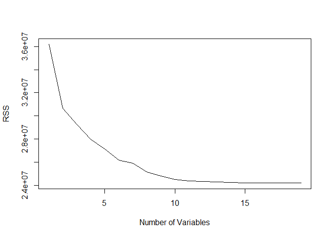<!-- -->

```r
plot(reg.summary$adjr2,xlab="Number of Variables",ylab="Adjusted RSq",type="l")
which.max(reg.summary$adjr2)
```

```
## [1] 11
```

```r
points(11,reg.summary$adjr2[11], col="red",cex=2,pch=20)
```

<!-- -->

```r
plot(reg.summary$cp,xlab="Number of Variables",ylab="Cp",type='l')
which.min(reg.summary$cp)
```

```
## [1] 10
```

```r
points(10,reg.summary$cp[10],col="red",cex=2,pch=20)
```

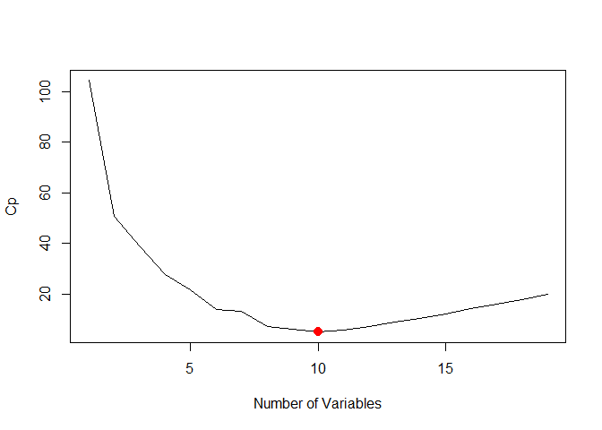<!-- -->

```r
which.min(reg.summary$bic)
```

```
## [1] 6
```

```r
plot(reg.summary$bic,xlab="Number of Variables",ylab="BIC",type='l')
points(6,reg.summary$bic[6],col="red",cex=2,pch=20)
```

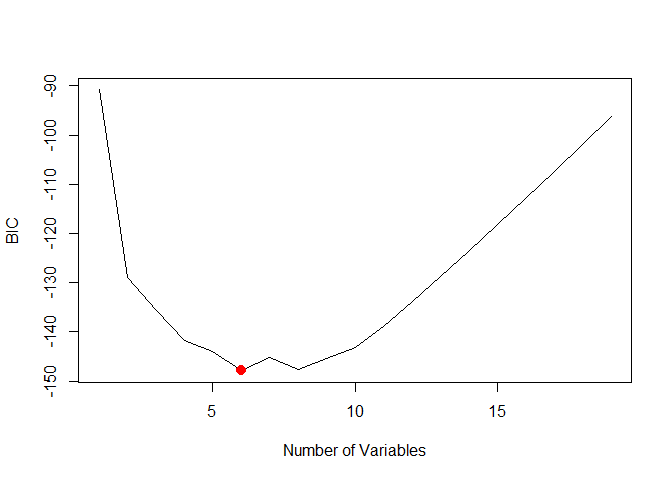<!-- -->

```r
#?plot.regsubsets
plot(regfit.full,scale="r2")
```

<!-- -->

```r
plot(regfit.full,scale="adjr2")
```

<!-- -->

```r
plot(regfit.full,scale="Cp")
```

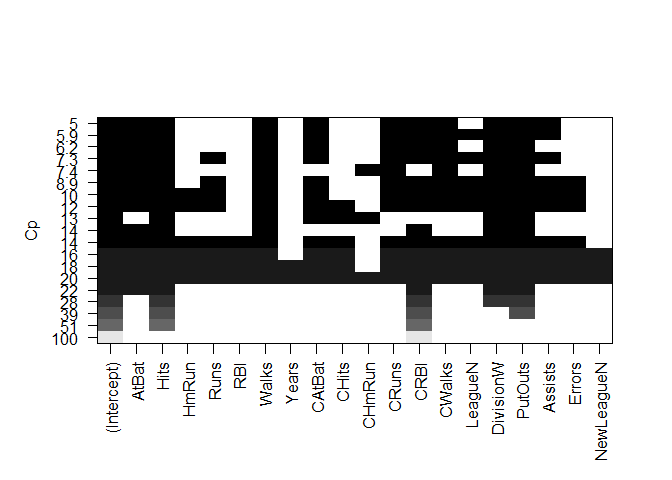<!-- -->

```r
plot(regfit.full,scale="bic")
```

<!-- -->

```r
coef(regfit.full,6)
```

```
##  (Intercept)        AtBat         Hits        Walks         CRBI 
##   91.5117981   -1.8685892    7.6043976    3.6976468    0.6430169 
##    DivisionW      PutOuts 
## -122.9515338    0.2643076
```

# Forward and Backward Stepwise Selection


```r
regfit.fwd=regsubsets(Salary~.,data=Hitters,nvmax=19,method="forward")
summary(regfit.fwd)
```

```
## Subset selection object
## Call: regsubsets.formula(Salary ~ ., data = Hitters, nvmax = 19, method = "forward")
## 19 Variables  (and intercept)
##            Forced in Forced out
## AtBat          FALSE      FALSE
## Hits           FALSE      FALSE
## HmRun          FALSE      FALSE
## Runs           FALSE      FALSE
## RBI            FALSE      FALSE
## Walks          FALSE      FALSE
## Years          FALSE      FALSE
## CAtBat         FALSE      FALSE
## CHits          FALSE      FALSE
## CHmRun         FALSE      FALSE
## CRuns          FALSE      FALSE
## CRBI           FALSE      FALSE
## CWalks         FALSE      FALSE
## LeagueN        FALSE      FALSE
## DivisionW      FALSE      FALSE
## PutOuts        FALSE      FALSE
## Assists        FALSE      FALSE
## Errors         FALSE      FALSE
## NewLeagueN     FALSE      FALSE
## 1 subsets of each size up to 19
## Selection Algorithm: forward
##           AtBat Hits HmRun Runs RBI Walks Years CAtBat CHits CHmRun CRuns
## 1  ( 1 )  " "   " "  " "   " "  " " " "   " "   " "    " "   " "    " "  
## 2  ( 1 )  " "   "*"  " "   " "  " " " "   " "   " "    " "   " "    " "  
## 3  ( 1 )  " "   "*"  " "   " "  " " " "   " "   " "    " "   " "    " "  
## 4  ( 1 )  " "   "*"  " "   " "  " " " "   " "   " "    " "   " "    " "  
## 5  ( 1 )  "*"   "*"  " "   " "  " " " "   " "   " "    " "   " "    " "  
## 6  ( 1 )  "*"   "*"  " "   " "  " " "*"   " "   " "    " "   " "    " "  
## 7  ( 1 )  "*"   "*"  " "   " "  " " "*"   " "   " "    " "   " "    " "  
## 8  ( 1 )  "*"   "*"  " "   " "  " " "*"   " "   " "    " "   " "    "*"  
## 9  ( 1 )  "*"   "*"  " "   " "  " " "*"   " "   "*"    " "   " "    "*"  
## 10  ( 1 ) "*"   "*"  " "   " "  " " "*"   " "   "*"    " "   " "    "*"  
## 11  ( 1 ) "*"   "*"  " "   " "  " " "*"   " "   "*"    " "   " "    "*"  
## 12  ( 1 ) "*"   "*"  " "   "*"  " " "*"   " "   "*"    " "   " "    "*"  
## 13  ( 1 ) "*"   "*"  " "   "*"  " " "*"   " "   "*"    " "   " "    "*"  
## 14  ( 1 ) "*"   "*"  "*"   "*"  " " "*"   " "   "*"    " "   " "    "*"  
## 15  ( 1 ) "*"   "*"  "*"   "*"  " " "*"   " "   "*"    "*"   " "    "*"  
## 16  ( 1 ) "*"   "*"  "*"   "*"  "*" "*"   " "   "*"    "*"   " "    "*"  
## 17  ( 1 ) "*"   "*"  "*"   "*"  "*" "*"   " "   "*"    "*"   " "    "*"  
## 18  ( 1 ) "*"   "*"  "*"   "*"  "*" "*"   "*"   "*"    "*"   " "    "*"  
## 19  ( 1 ) "*"   "*"  "*"   "*"  "*" "*"   "*"   "*"    "*"   "*"    "*"  
##           CRBI CWalks LeagueN DivisionW PutOuts Assists Errors NewLeagueN
## 1  ( 1 )  "*"  " "    " "     " "       " "     " "     " "    " "       
## 2  ( 1 )  "*"  " "    " "     " "       " "     " "     " "    " "       
## 3  ( 1 )  "*"  " "    " "     " "       "*"     " "     " "    " "       
## 4  ( 1 )  "*"  " "    " "     "*"       "*"     " "     " "    " "       
## 5  ( 1 )  "*"  " "    " "     "*"       "*"     " "     " "    " "       
## 6  ( 1 )  "*"  " "    " "     "*"       "*"     " "     " "    " "       
## 7  ( 1 )  "*"  "*"    " "     "*"       "*"     " "     " "    " "       
## 8  ( 1 )  "*"  "*"    " "     "*"       "*"     " "     " "    " "       
## 9  ( 1 )  "*"  "*"    " "     "*"       "*"     " "     " "    " "       
## 10  ( 1 ) "*"  "*"    " "     "*"       "*"     "*"     " "    " "       
## 11  ( 1 ) "*"  "*"    "*"     "*"       "*"     "*"     " "    " "       
## 12  ( 1 ) "*"  "*"    "*"     "*"       "*"     "*"     " "    " "       
## 13  ( 1 ) "*"  "*"    "*"     "*"       "*"     "*"     "*"    " "       
## 14  ( 1 ) "*"  "*"    "*"     "*"       "*"     "*"     "*"    " "       
## 15  ( 1 ) "*"  "*"    "*"     "*"       "*"     "*"     "*"    " "       
## 16  ( 1 ) "*"  "*"    "*"     "*"       "*"     "*"     "*"    " "       
## 17  ( 1 ) "*"  "*"    "*"     "*"       "*"     "*"     "*"    "*"       
## 18  ( 1 ) "*"  "*"    "*"     "*"       "*"     "*"     "*"    "*"       
## 19  ( 1 ) "*"  "*"    "*"     "*"       "*"     "*"     "*"    "*"
```

```r
regfit.bwd=regsubsets(Salary~.,data=Hitters,nvmax=19,method="backward")
summary(regfit.bwd)
```

```
## Subset selection object
## Call: regsubsets.formula(Salary ~ ., data = Hitters, nvmax = 19, method = "backward")
## 19 Variables  (and intercept)
##            Forced in Forced out
## AtBat          FALSE      FALSE
## Hits           FALSE      FALSE
## HmRun          FALSE      FALSE
## Runs           FALSE      FALSE
## RBI            FALSE      FALSE
## Walks          FALSE      FALSE
## Years          FALSE      FALSE
## CAtBat         FALSE      FALSE
## CHits          FALSE      FALSE
## CHmRun         FALSE      FALSE
## CRuns          FALSE      FALSE
## CRBI           FALSE      FALSE
## CWalks         FALSE      FALSE
## LeagueN        FALSE      FALSE
## DivisionW      FALSE      FALSE
## PutOuts        FALSE      FALSE
## Assists        FALSE      FALSE
## Errors         FALSE      FALSE
## NewLeagueN     FALSE      FALSE
## 1 subsets of each size up to 19
## Selection Algorithm: backward
##           AtBat Hits HmRun Runs RBI Walks Years CAtBat CHits CHmRun CRuns
## 1  ( 1 )  " "   " "  " "   " "  " " " "   " "   " "    " "   " "    "*"  
## 2  ( 1 )  " "   "*"  " "   " "  " " " "   " "   " "    " "   " "    "*"  
## 3  ( 1 )  " "   "*"  " "   " "  " " " "   " "   " "    " "   " "    "*"  
## 4  ( 1 )  "*"   "*"  " "   " "  " " " "   " "   " "    " "   " "    "*"  
## 5  ( 1 )  "*"   "*"  " "   " "  " " "*"   " "   " "    " "   " "    "*"  
## 6  ( 1 )  "*"   "*"  " "   " "  " " "*"   " "   " "    " "   " "    "*"  
## 7  ( 1 )  "*"   "*"  " "   " "  " " "*"   " "   " "    " "   " "    "*"  
## 8  ( 1 )  "*"   "*"  " "   " "  " " "*"   " "   " "    " "   " "    "*"  
## 9  ( 1 )  "*"   "*"  " "   " "  " " "*"   " "   "*"    " "   " "    "*"  
## 10  ( 1 ) "*"   "*"  " "   " "  " " "*"   " "   "*"    " "   " "    "*"  
## 11  ( 1 ) "*"   "*"  " "   " "  " " "*"   " "   "*"    " "   " "    "*"  
## 12  ( 1 ) "*"   "*"  " "   "*"  " " "*"   " "   "*"    " "   " "    "*"  
## 13  ( 1 ) "*"   "*"  " "   "*"  " " "*"   " "   "*"    " "   " "    "*"  
## 14  ( 1 ) "*"   "*"  "*"   "*"  " " "*"   " "   "*"    " "   " "    "*"  
## 15  ( 1 ) "*"   "*"  "*"   "*"  " " "*"   " "   "*"    "*"   " "    "*"  
## 16  ( 1 ) "*"   "*"  "*"   "*"  "*" "*"   " "   "*"    "*"   " "    "*"  
## 17  ( 1 ) "*"   "*"  "*"   "*"  "*" "*"   " "   "*"    "*"   " "    "*"  
## 18  ( 1 ) "*"   "*"  "*"   "*"  "*" "*"   "*"   "*"    "*"   " "    "*"  
## 19  ( 1 ) "*"   "*"  "*"   "*"  "*" "*"   "*"   "*"    "*"   "*"    "*"  
##           CRBI CWalks LeagueN DivisionW PutOuts Assists Errors NewLeagueN
## 1  ( 1 )  " "  " "    " "     " "       " "     " "     " "    " "       
## 2  ( 1 )  " "  " "    " "     " "       " "     " "     " "    " "       
## 3  ( 1 )  " "  " "    " "     " "       "*"     " "     " "    " "       
## 4  ( 1 )  " "  " "    " "     " "       "*"     " "     " "    " "       
## 5  ( 1 )  " "  " "    " "     " "       "*"     " "     " "    " "       
## 6  ( 1 )  " "  " "    " "     "*"       "*"     " "     " "    " "       
## 7  ( 1 )  " "  "*"    " "     "*"       "*"     " "     " "    " "       
## 8  ( 1 )  "*"  "*"    " "     "*"       "*"     " "     " "    " "       
## 9  ( 1 )  "*"  "*"    " "     "*"       "*"     " "     " "    " "       
## 10  ( 1 ) "*"  "*"    " "     "*"       "*"     "*"     " "    " "       
## 11  ( 1 ) "*"  "*"    "*"     "*"       "*"     "*"     " "    " "       
## 12  ( 1 ) "*"  "*"    "*"     "*"       "*"     "*"     " "    " "       
## 13  ( 1 ) "*"  "*"    "*"     "*"       "*"     "*"     "*"    " "       
## 14  ( 1 ) "*"  "*"    "*"     "*"       "*"     "*"     "*"    " "       
## 15  ( 1 ) "*"  "*"    "*"     "*"       "*"     "*"     "*"    " "       
## 16  ( 1 ) "*"  "*"    "*"     "*"       "*"     "*"     "*"    " "       
## 17  ( 1 ) "*"  "*"    "*"     "*"       "*"     "*"     "*"    "*"       
## 18  ( 1 ) "*"  "*"    "*"     "*"       "*"     "*"     "*"    "*"       
## 19  ( 1 ) "*"  "*"    "*"     "*"       "*"     "*"     "*"    "*"
```

```r
coef(regfit.full,7)
```

```
##  (Intercept)         Hits        Walks       CAtBat        CHits 
##   79.4509472    1.2833513    3.2274264   -0.3752350    1.4957073 
##       CHmRun    DivisionW      PutOuts 
##    1.4420538 -129.9866432    0.2366813
```

```r
coef(regfit.fwd,7)
```

```
##  (Intercept)        AtBat         Hits        Walks         CRBI 
##  109.7873062   -1.9588851    7.4498772    4.9131401    0.8537622 
##       CWalks    DivisionW      PutOuts 
##   -0.3053070 -127.1223928    0.2533404
```

```r
coef(regfit.bwd,7)
```

```
##  (Intercept)        AtBat         Hits        Walks        CRuns 
##  105.6487488   -1.9762838    6.7574914    6.0558691    1.1293095 
##       CWalks    DivisionW      PutOuts 
##   -0.7163346 -116.1692169    0.3028847
```

# Choosing Among Models


```r
set.seed(1)
train=sample(c(TRUE,FALSE), nrow(Hitters),rep=TRUE)
test=(!train)

regfit.best=regsubsets(Salary~.,data=Hitters[train,],nvmax=19)
test.mat=model.matrix(Salary~.,data=Hitters[test,])

val.errors=rep(NA,19)
for(i in 1:19){
   coefi=coef(regfit.best,id=i)
   pred=test.mat[,names(coefi)]%*%coefi
   val.errors[i]=mean((Hitters$Salary[test]-pred)^2)
}

val.errors
```

```
##  [1] 220968.0 169157.1 178518.2 163426.1 168418.1 171270.6 162377.1
##  [8] 157909.3 154055.7 148162.1 151156.4 151742.5 152214.5 157358.7
## [15] 158541.4 158743.3 159972.7 159859.8 160105.6
```

```r
which.min(val.errors)
```

```
## [1] 10
```

```r
coef(regfit.best,10)
```

```
## (Intercept)       AtBat        Hits       Walks      CAtBat       CHits 
## -80.2751499  -1.4683816   7.1625314   3.6430345  -0.1855698   1.1053238 
##      CHmRun      CWalks     LeagueN   DivisionW     PutOuts 
##   1.3844863  -0.7483170  84.5576103 -53.0289658   0.2381662
```


```r
predict.regsubsets=function(object,newdata,id,...){
  form=as.formula(object$call[[2]])
  mat=model.matrix(form,newdata)
  coefi=coef(object,id=id)
  xvars=names(coefi)
  mat[,xvars]%*%coefi
  }

regfit.best=regsubsets(Salary~.,data=Hitters,nvmax=19)
coef(regfit.best,10)
```

```
##  (Intercept)        AtBat         Hits        Walks       CAtBat 
##  162.5354420   -2.1686501    6.9180175    5.7732246   -0.1300798 
##        CRuns         CRBI       CWalks    DivisionW      PutOuts 
##    1.4082490    0.7743122   -0.8308264 -112.3800575    0.2973726 
##      Assists 
##    0.2831680
```


```r
k=10
set.seed(1)
folds=sample(1:k,nrow(Hitters),replace=TRUE)
cv.errors=matrix(NA,k,19, dimnames=list(NULL, paste(1:19)))

for(j in 1:k){
  best.fit=regsubsets(Salary~.,data=Hitters[folds!=j,],nvmax=19)
  for(i in 1:19){
    pred=predict.regsubsets(best.fit,Hitters[folds==j,],id=i)
    cv.errors[j,i]=mean((Hitters$Salary[folds==j]-pred)^2)
    }
}

mean.cv.errors=apply(cv.errors,2,mean)
mean.cv.errors
```

```
##        1        2        3        4        5        6        7        8 
## 160093.5 140196.8 153117.0 151159.3 146841.3 138302.6 144346.2 130207.7 
##        9       10       11       12       13       14       15       16 
## 129459.6 125334.7 125153.8 128273.5 133461.0 133974.6 131825.7 131882.8 
##       17       18       19 
## 132750.9 133096.2 132804.7
```

```r
par(mfrow=c(1,1))
plot(mean.cv.errors,type='b')
```

<!-- -->

```r
reg.best=regsubsets(Salary~.,data=Hitters, nvmax=19)
coef(reg.best,11)
```

```
##  (Intercept)        AtBat         Hits        Walks       CAtBat 
##  135.7512195   -2.1277482    6.9236994    5.6202755   -0.1389914 
##        CRuns         CRBI       CWalks      LeagueN    DivisionW 
##    1.4553310    0.7852528   -0.8228559   43.1116152 -111.1460252 
##      PutOuts      Assists 
##    0.2894087    0.2688277
```

# Chapter 6 Lab 2: Ridge Regression and the Lasso


```r
x=model.matrix(Salary~.,Hitters)[,-1]
y=Hitters$Salary
```

# Ridge Regression


```r
library(glmnet)
```

```
## Loading required package: Matrix
```

```
## Loading required package: foreach
```

```
## Loaded glmnet 2.0-13
```

```r
grid=10^seq(10,-2,length=100)
ridge.mod=glmnet(x,y,alpha=0,lambda=grid)

dim(coef(ridge.mod))
```

```
## [1]  20 100
```

```r
ridge.mod$lambda[50]
```

```
## [1] 11497.57
```

```r
coef(ridge.mod)[,50]
```

```
##   (Intercept)         AtBat          Hits         HmRun          Runs 
## 407.356050200   0.036957182   0.138180344   0.524629976   0.230701523 
##           RBI         Walks         Years        CAtBat         CHits 
##   0.239841459   0.289618741   1.107702929   0.003131815   0.011653637 
##        CHmRun         CRuns          CRBI        CWalks       LeagueN 
##   0.087545670   0.023379882   0.024138320   0.025015421   0.085028114 
##     DivisionW       PutOuts       Assists        Errors    NewLeagueN 
##  -6.215440973   0.016482577   0.002612988  -0.020502690   0.301433531
```

```r
sqrt(sum(coef(ridge.mod)[-1,50]^2))
```

```
## [1] 6.360612
```

```r
ridge.mod$lambda[60]
```

```
## [1] 705.4802
```

```r
coef(ridge.mod)[,60]
```

```
##  (Intercept)        AtBat         Hits        HmRun         Runs 
##  54.32519950   0.11211115   0.65622409   1.17980910   0.93769713 
##          RBI        Walks        Years       CAtBat        CHits 
##   0.84718546   1.31987948   2.59640425   0.01083413   0.04674557 
##       CHmRun        CRuns         CRBI       CWalks      LeagueN 
##   0.33777318   0.09355528   0.09780402   0.07189612  13.68370191 
##    DivisionW      PutOuts      Assists       Errors   NewLeagueN 
## -54.65877750   0.11852289   0.01606037  -0.70358655   8.61181213
```

```r
sqrt(sum(coef(ridge.mod)[-1,60]^2))
```

```
## [1] 57.11001
```

```r
predict(ridge.mod,s=50,type="coefficients")[1:20,]
```

```
##   (Intercept)         AtBat          Hits         HmRun          Runs 
##  4.876610e+01 -3.580999e-01  1.969359e+00 -1.278248e+00  1.145892e+00 
##           RBI         Walks         Years        CAtBat         CHits 
##  8.038292e-01  2.716186e+00 -6.218319e+00  5.447837e-03  1.064895e-01 
##        CHmRun         CRuns          CRBI        CWalks       LeagueN 
##  6.244860e-01  2.214985e-01  2.186914e-01 -1.500245e-01  4.592589e+01 
##     DivisionW       PutOuts       Assists        Errors    NewLeagueN 
## -1.182011e+02  2.502322e-01  1.215665e-01 -3.278600e+00 -9.496680e+00
```


```r
set.seed(1)
train=sample(1:nrow(x), nrow(x)/2)
test=(-train)
y.test=y[test]

ridge.mod=glmnet(x[train,],y[train],alpha=0,lambda=grid, thresh=1e-12)
ridge.pred=predict(ridge.mod,s=4,newx=x[test,])
mean((ridge.pred-y.test)^2)
```

```
## [1] 101036.8
```

```r
mean((mean(y[train])-y.test)^2)
```

```
## [1] 193253.1
```

```r
ridge.pred=predict(ridge.mod,s=1e10,newx=x[test,])
mean((ridge.pred-y.test)^2)
```

```
## [1] 193253.1
```

```r
ridge.pred=predict(ridge.mod,s=0,newx=x[test,])
mean((ridge.pred-y.test)^2)
```

```
## [1] 114723.6
```

```r
lm(y~x, subset=train)
```

```
## 
## Call:
## lm(formula = y ~ x, subset = train)
## 
## Coefficients:
## (Intercept)       xAtBat        xHits       xHmRun        xRuns  
##   299.42849     -2.54027      8.36682     11.64512     -9.09923  
##        xRBI       xWalks       xYears      xCAtBat       xCHits  
##     2.44105      9.23440    -22.93673     -0.18154     -0.11598  
##     xCHmRun       xCRuns        xCRBI      xCWalks     xLeagueN  
##    -1.33888      3.32838      0.07536     -1.07841     59.76065  
##  xDivisionW     xPutOuts     xAssists      xErrors  xNewLeagueN  
##   -98.86233      0.34087      0.34165     -0.64207     -0.67442
```

```r
predict(ridge.mod,s=0,type="coefficients")[1:20,]
```

```
##  (Intercept)        AtBat         Hits        HmRun         Runs 
## 299.44467220  -2.53538355   8.33585019  11.59830815  -9.05971371 
##          RBI        Walks        Years       CAtBat        CHits 
##   2.45326546   9.21776006 -22.98239583  -0.18191651  -0.10565688 
##       CHmRun        CRuns         CRBI       CWalks      LeagueN 
##  -1.31721358   3.31152519   0.06590689  -1.07244477  59.75587273 
##    DivisionW      PutOuts      Assists       Errors   NewLeagueN 
## -98.94393005   0.34083276   0.34155445  -0.65312471  -0.65882930
```


```r
set.seed(1)
cv.out=cv.glmnet(x[train,],y[train],alpha=0)
plot(cv.out)
```

<!-- -->

```r
bestlam=cv.out$lambda.min
bestlam
```

```
## [1] 211.7416
```

```r
ridge.pred=predict(ridge.mod,s=bestlam,newx=x[test,])
mean((ridge.pred-y.test)^2)
```

```
## [1] 96015.51
```

```r
out=glmnet(x,y,alpha=0)
predict(out,type="coefficients",s=bestlam)[1:20,]
```

```
##  (Intercept)        AtBat         Hits        HmRun         Runs 
##   9.88487157   0.03143991   1.00882875   0.13927624   1.11320781 
##          RBI        Walks        Years       CAtBat        CHits 
##   0.87318990   1.80410229   0.13074381   0.01113978   0.06489843 
##       CHmRun        CRuns         CRBI       CWalks      LeagueN 
##   0.45158546   0.12900049   0.13737712   0.02908572  27.18227535 
##    DivisionW      PutOuts      Assists       Errors   NewLeagueN 
## -91.63411299   0.19149252   0.04254536  -1.81244470   7.21208390
```

# The Lasso


```r
lasso.mod=glmnet(x[train,],y[train],alpha=1,lambda=grid)
plot(lasso.mod)
```

<!-- -->

```r
set.seed(1)
cv.out=cv.glmnet(x[train,],y[train],alpha=1)
plot(cv.out)
```

<!-- -->

```r
bestlam=cv.out$lambda.min
lasso.pred=predict(lasso.mod,s=bestlam,newx=x[test,])
mean((lasso.pred-y.test)^2)
```

```
## [1] 100743.4
```

```r
out=glmnet(x,y,alpha=1,lambda=grid)
lasso.coef=predict(out,type="coefficients",s=bestlam)[1:20,]
lasso.coef
```

```
##  (Intercept)        AtBat         Hits        HmRun         Runs 
##   18.5394844    0.0000000    1.8735390    0.0000000    0.0000000 
##          RBI        Walks        Years       CAtBat        CHits 
##    0.0000000    2.2178444    0.0000000    0.0000000    0.0000000 
##       CHmRun        CRuns         CRBI       CWalks      LeagueN 
##    0.0000000    0.2071252    0.4130132    0.0000000    3.2666677 
##    DivisionW      PutOuts      Assists       Errors   NewLeagueN 
## -103.4845458    0.2204284    0.0000000    0.0000000    0.0000000
```

```r
lasso.coef[lasso.coef!=0]
```

```
##  (Intercept)         Hits        Walks        CRuns         CRBI 
##   18.5394844    1.8735390    2.2178444    0.2071252    0.4130132 
##      LeagueN    DivisionW      PutOuts 
##    3.2666677 -103.4845458    0.2204284
```


# Chapter 6 Lab 3: PCR and PLS Regression

# Principal Components Regression


```r
library(pls)
```

```
## 
## Attaching package: 'pls'
```

```
## The following object is masked from 'package:stats':
## 
##     loadings
```

```r
set.seed(2)
pcr.fit=pcr(Salary~., data=Hitters,scale=TRUE,validation="CV")

summary(pcr.fit)
```

```
## Data: 	X dimension: 263 19 
## 	Y dimension: 263 1
## Fit method: svdpc
## Number of components considered: 19
## 
## VALIDATION: RMSEP
## Cross-validated using 10 random segments.
##        (Intercept)  1 comps  2 comps  3 comps  4 comps  5 comps  6 comps
## CV             452    348.9    352.2    353.5    352.8    350.1    349.1
## adjCV          452    348.7    351.8    352.9    352.1    349.3    348.0
##        7 comps  8 comps  9 comps  10 comps  11 comps  12 comps  13 comps
## CV       349.6    350.9    352.9     353.8     355.0     356.2     363.5
## adjCV    348.5    349.8    351.6     352.3     353.4     354.5     361.6
##        14 comps  15 comps  16 comps  17 comps  18 comps  19 comps
## CV        355.2     357.4     347.6     350.1     349.2     352.6
## adjCV     352.8     355.2     345.5     347.6     346.7     349.8
## 
## TRAINING: % variance explained
##         1 comps  2 comps  3 comps  4 comps  5 comps  6 comps  7 comps
## X         38.31    60.16    70.84    79.03    84.29    88.63    92.26
## Salary    40.63    41.58    42.17    43.22    44.90    46.48    46.69
##         8 comps  9 comps  10 comps  11 comps  12 comps  13 comps  14 comps
## X         94.96    96.28     97.26     97.98     98.65     99.15     99.47
## Salary    46.75    46.86     47.76     47.82     47.85     48.10     50.40
##         15 comps  16 comps  17 comps  18 comps  19 comps
## X          99.75     99.89     99.97     99.99    100.00
## Salary     50.55     53.01     53.85     54.61     54.61
```

```r
validationplot(pcr.fit,val.type="MSEP")
```

<!-- -->

```r
set.seed(1)
pcr.fit=pcr(Salary~., data=Hitters,subset=train,scale=TRUE, validation="CV")
validationplot(pcr.fit,val.type="MSEP")
```

<!-- -->

```r
pcr.pred=predict(pcr.fit,x[test,],ncomp=7)
mean((pcr.pred-y.test)^2)
```

```
## [1] 96556.22
```

```r
pcr.fit=pcr(y~x,scale=TRUE,ncomp=7)
summary(pcr.fit)
```

```
## Data: 	X dimension: 263 19 
## 	Y dimension: 263 1
## Fit method: svdpc
## Number of components considered: 7
## TRAINING: % variance explained
##    1 comps  2 comps  3 comps  4 comps  5 comps  6 comps  7 comps
## X    38.31    60.16    70.84    79.03    84.29    88.63    92.26
## y    40.63    41.58    42.17    43.22    44.90    46.48    46.69
```


# Partial Least Squares


```r
set.seed(1)
pls.fit=plsr(Salary~., data=Hitters,subset=train,scale=TRUE, validation="CV")
summary(pls.fit)
```

```
## Data: 	X dimension: 131 19 
## 	Y dimension: 131 1
## Fit method: kernelpls
## Number of components considered: 19
## 
## VALIDATION: RMSEP
## Cross-validated using 10 random segments.
##        (Intercept)  1 comps  2 comps  3 comps  4 comps  5 comps  6 comps
## CV           464.6    394.2    391.5    393.1    395.0    415.0    424.0
## adjCV        464.6    393.4    390.2    391.1    392.9    411.5    418.8
##        7 comps  8 comps  9 comps  10 comps  11 comps  12 comps  13 comps
## CV       424.5    415.8    404.6     407.1     412.0     414.4     410.3
## adjCV    418.9    411.4    400.7     402.2     407.2     409.3     405.6
##        14 comps  15 comps  16 comps  17 comps  18 comps  19 comps
## CV        406.2     408.6     410.5     408.8     407.8     410.2
## adjCV     401.8     403.9     405.6     404.1     403.2     405.5
## 
## TRAINING: % variance explained
##         1 comps  2 comps  3 comps  4 comps  5 comps  6 comps  7 comps
## X         38.12    53.46    66.05    74.49    79.33    84.56    87.09
## Salary    33.58    38.96    41.57    42.43    44.04    45.59    47.05
##         8 comps  9 comps  10 comps  11 comps  12 comps  13 comps  14 comps
## X         90.74    92.55     93.94     97.23     97.88     98.35     98.85
## Salary    47.53    48.42     49.68     50.04     50.54     50.78     50.92
##         15 comps  16 comps  17 comps  18 comps  19 comps
## X          99.11     99.43     99.78     99.99    100.00
## Salary     51.04     51.11     51.15     51.16     51.18
```

```r
validationplot(pls.fit,val.type="MSEP")
```

<!-- -->

```r
pls.pred=predict(pls.fit,x[test,],ncomp=2)
mean((pls.pred-y.test)^2)
```

```
## [1] 101417.5
```

```r
pls.fit=plsr(Salary~., data=Hitters,scale=TRUE,ncomp=2)
summary(pls.fit)
```

```
## Data: 	X dimension: 263 19 
## 	Y dimension: 263 1
## Fit method: kernelpls
## Number of components considered: 2
## TRAINING: % variance explained
##         1 comps  2 comps
## X         38.08    51.03
## Salary    43.05    46.40
```

# 9. In this exercise, we will predict the number of applications received using the other variables in the College data set.

## (a) Split the data set into a training set and a test set.


```r
summary(College)
```

```
##  Private        Apps           Accept          Enroll       Top10perc    
##  No :212   Min.   :   81   Min.   :   72   Min.   :  35   Min.   : 1.00  
##  Yes:565   1st Qu.:  776   1st Qu.:  604   1st Qu.: 242   1st Qu.:15.00  
##            Median : 1558   Median : 1110   Median : 434   Median :23.00  
##            Mean   : 3002   Mean   : 2019   Mean   : 780   Mean   :27.56  
##            3rd Qu.: 3624   3rd Qu.: 2424   3rd Qu.: 902   3rd Qu.:35.00  
##            Max.   :48094   Max.   :26330   Max.   :6392   Max.   :96.00  
##    Top25perc      F.Undergrad     P.Undergrad         Outstate    
##  Min.   :  9.0   Min.   :  139   Min.   :    1.0   Min.   : 2340  
##  1st Qu.: 41.0   1st Qu.:  992   1st Qu.:   95.0   1st Qu.: 7320  
##  Median : 54.0   Median : 1707   Median :  353.0   Median : 9990  
##  Mean   : 55.8   Mean   : 3700   Mean   :  855.3   Mean   :10441  
##  3rd Qu.: 69.0   3rd Qu.: 4005   3rd Qu.:  967.0   3rd Qu.:12925  
##  Max.   :100.0   Max.   :31643   Max.   :21836.0   Max.   :21700  
##    Room.Board       Books           Personal         PhD        
##  Min.   :1780   Min.   :  96.0   Min.   : 250   Min.   :  8.00  
##  1st Qu.:3597   1st Qu.: 470.0   1st Qu.: 850   1st Qu.: 62.00  
##  Median :4200   Median : 500.0   Median :1200   Median : 75.00  
##  Mean   :4358   Mean   : 549.4   Mean   :1341   Mean   : 72.66  
##  3rd Qu.:5050   3rd Qu.: 600.0   3rd Qu.:1700   3rd Qu.: 85.00  
##  Max.   :8124   Max.   :2340.0   Max.   :6800   Max.   :103.00  
##     Terminal       S.F.Ratio      perc.alumni        Expend     
##  Min.   : 24.0   Min.   : 2.50   Min.   : 0.00   Min.   : 3186  
##  1st Qu.: 71.0   1st Qu.:11.50   1st Qu.:13.00   1st Qu.: 6751  
##  Median : 82.0   Median :13.60   Median :21.00   Median : 8377  
##  Mean   : 79.7   Mean   :14.09   Mean   :22.74   Mean   : 9660  
##  3rd Qu.: 92.0   3rd Qu.:16.50   3rd Qu.:31.00   3rd Qu.:10830  
##  Max.   :100.0   Max.   :39.80   Max.   :64.00   Max.   :56233  
##    Grad.Rate     
##  Min.   : 10.00  
##  1st Qu.: 53.00  
##  Median : 65.00  
##  Mean   : 65.46  
##  3rd Qu.: 78.00  
##  Max.   :118.00
```

```r
dim(College)
```

```
## [1] 777  18
```

```r
#?College

x=model.matrix(Apps~.,College)[,-1]
y=College$Apps
set.seed(1)
train=sample(1:nrow(x), nrow(x)/2)
test=(-train)
y.test=y[test]

#set.seed(1)
#train=sample(1:nrow(College), nrow(College)/2)
#test=(-train)
#College.test=College[test]
```

## (b) Fit a linear model using least squares on the training set, and report the test error obtained.


```r
lm.fit=lm(y~x, subset=train)
mean((College$Apps-predict(lm.fit,College))[-train]^2)
```

```
## [1] 1108531
```

> test MSE = 1108531

## (c) Fit a ridge regression model on the training set, with λ chosen by cross-validation. Report the test error obtained.


```r
library(glmnet)
grid=10^seq(10,-2,length=100)

ridge.mod=glmnet(x,y,alpha=0,lambda=grid)

dim(coef(ridge.mod))
```

```
## [1]  18 100
```

```r
ridge.mod=glmnet(x[train,],y[train],alpha=0,lambda=grid, thresh=1e-12)

set.seed(1)
cv.out=cv.glmnet(x[train,],y[train],alpha=0)
plot(cv.out)
```

<!-- -->

```r
bestlam=cv.out$lambda.min
bestlam
```

```
## [1] 450.7435
```

```r
ridge.pred=predict(ridge.mod,s=bestlam,newx=x[test,])
mean((ridge.pred-y.test)^2)
```

```
## [1] 1037308
```

> test MSE = 1037308

## (d) Fit a lasso model on the training set, with λ chosen by cross-validation. Report the test error obtained, along with the number of non-zero coefficient estimates.


```r
# lasso
library(glmnet)

lasso.mod=glmnet(x[train,],y[train],alpha=1,lambda=grid)
plot(lasso.mod)
```

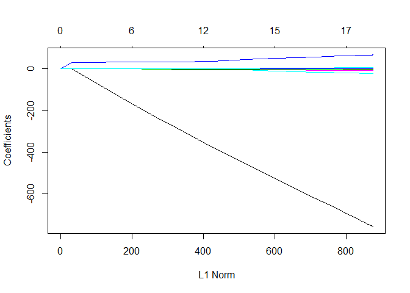<!-- -->

```r
set.seed(1)
cv.out=cv.glmnet(x[train,],y[train],alpha=1)
plot(cv.out)
```

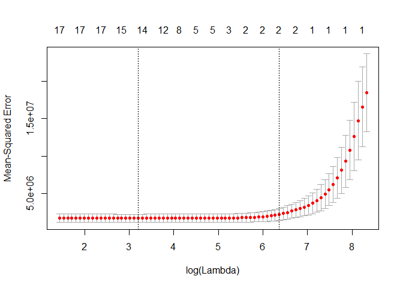<!-- -->

```r
bestlam=cv.out$lambda.min
lasso.pred=predict(lasso.mod,s=bestlam,newx=x[test,])
mean((lasso.pred-y.test)^2)
```

```
## [1] 1032128
```

```r
out=glmnet(x,y,alpha=1,lambda=grid)
lasso.coef=predict(out,type="coefficients",s=bestlam)[1:18,]
lasso.coef
```

```
##   (Intercept)    PrivateYes        Accept        Enroll     Top10perc 
## -6.321166e+02 -4.088980e+02  1.437087e+00 -1.418240e-01  3.146071e+01 
##     Top25perc   F.Undergrad   P.Undergrad      Outstate    Room.Board 
## -8.818529e-01  0.000000e+00  1.488050e-02 -5.348474e-02  1.206366e-01 
##         Books      Personal           PhD      Terminal     S.F.Ratio 
##  0.000000e+00  6.054932e-05 -5.127428e+00 -3.370371e+00  2.739664e+00 
##   perc.alumni        Expend     Grad.Rate 
## -1.038499e+00  6.839807e-02  4.706478e+00
```

```r
lasso.coef[lasso.coef!=0]
```

```
##   (Intercept)    PrivateYes        Accept        Enroll     Top10perc 
## -6.321166e+02 -4.088980e+02  1.437087e+00 -1.418240e-01  3.146071e+01 
##     Top25perc   P.Undergrad      Outstate    Room.Board      Personal 
## -8.818529e-01  1.488050e-02 -5.348474e-02  1.206366e-01  6.054932e-05 
##           PhD      Terminal     S.F.Ratio   perc.alumni        Expend 
## -5.127428e+00 -3.370371e+00  2.739664e+00 -1.038499e+00  6.839807e-02 
##     Grad.Rate 
##  4.706478e+00
```

> test MSE = 1032128

## (e) Fit a PCR model on the training set, with M chosen by cross-validation. Report the test error obtained, along with the value of M selected by cross-validation.


```r
library(pls)

set.seed(1)
pcr.fit=pcr(y~x,subset=train,scale=TRUE, validation="CV")
validationplot(pcr.fit,val.type="MSEP")
```

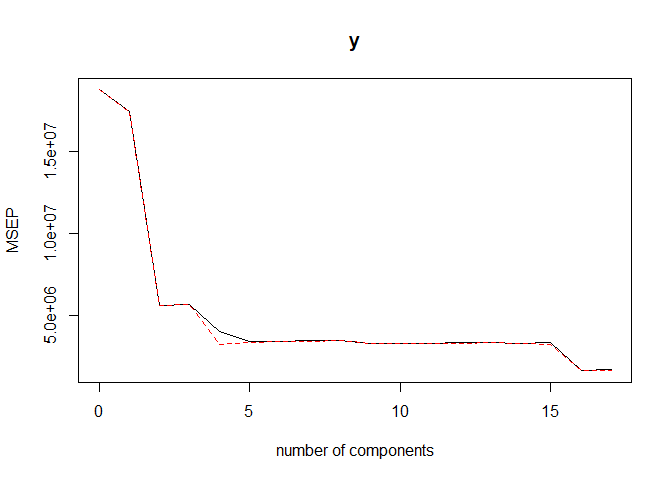<!-- -->

```r
summary(pcr.fit)
```

```
## Data: 	X dimension: 388 17 
## 	Y dimension: 388 1
## Fit method: svdpc
## Number of components considered: 17
## 
## VALIDATION: RMSEP
## Cross-validated using 10 random segments.
##        (Intercept)  1 comps  2 comps  3 comps  4 comps  5 comps  6 comps
## CV            4335     4179     2364     2374     1996     1844     1845
## adjCV         4335     4182     2360     2374     1788     1831     1838
##        7 comps  8 comps  9 comps  10 comps  11 comps  12 comps  13 comps
## CV        1850     1863     1809      1809      1812      1815      1825
## adjCV     1844     1857     1801      1800      1804      1808      1817
##        14 comps  15 comps  16 comps  17 comps
## CV         1810      1823      1273      1281
## adjCV      1806      1789      1260      1268
## 
## TRAINING: % variance explained
##    1 comps  2 comps  3 comps  4 comps  5 comps  6 comps  7 comps  8 comps
## X   31.216    57.68    64.73    70.55    76.33    81.30    85.01    88.40
## y    6.976    71.47    71.58    83.32    83.44    83.45    83.46    83.47
##    9 comps  10 comps  11 comps  12 comps  13 comps  14 comps  15 comps
## X    91.16     93.36     95.38     96.94     97.96     98.76     99.40
## y    84.53     84.86     84.98     84.98     84.99     85.24     90.87
##    16 comps  17 comps
## X     99.87    100.00
## y     93.93     93.97
```

```r
pcr.pred=predict(pcr.fit,x[test,],ncomp=16)
mean((pcr.pred-y.test)^2)
```

```
## [1] 1166897
```

```r
pcr.fit=pcr(y~x,scale=TRUE,ncomp=16)
summary(pcr.fit)
```

```
## Data: 	X dimension: 777 17 
## 	Y dimension: 777 1
## Fit method: svdpc
## Number of components considered: 16
## TRAINING: % variance explained
##    1 comps  2 comps  3 comps  4 comps  5 comps  6 comps  7 comps  8 comps
## X   31.670    57.30    64.30    69.90    75.39    80.38    83.99    87.40
## y    2.316    73.06    73.07    82.08    84.08    84.11    84.32    85.18
##    9 comps  10 comps  11 comps  12 comps  13 comps  14 comps  15 comps
## X    90.50     92.91     95.01     96.81      97.9     98.75     99.36
## y    85.88     86.06     86.06     86.10      86.1     86.13     90.32
##    16 comps
## X     99.84
## y     92.52
```

> MSE = 1166897

## (f) Fit a PLS model on the training set, with M chosen by cross-validation. Report the test error obtained, along with the value of M selected by cross-validation.


```r
set.seed(1)
pls.fit=plsr(y~x,subset=train,scale=TRUE, validation="CV")
summary(pls.fit)
```

```
## Data: 	X dimension: 388 17 
## 	Y dimension: 388 1
## Fit method: kernelpls
## Number of components considered: 17
## 
## VALIDATION: RMSEP
## Cross-validated using 10 random segments.
##        (Intercept)  1 comps  2 comps  3 comps  4 comps  5 comps  6 comps
## CV            4335     2176     1893     1725     1613     1406     1312
## adjCV         4335     2171     1884     1715     1578     1375     1295
##        7 comps  8 comps  9 comps  10 comps  11 comps  12 comps  13 comps
## CV        1297     1285     1280      1278      1279      1282      1281
## adjCV     1281     1271     1267      1265      1266      1269      1268
##        14 comps  15 comps  16 comps  17 comps
## CV         1281      1281      1281      1281
## adjCV      1267      1267      1268      1268
## 
## TRAINING: % variance explained
##    1 comps  2 comps  3 comps  4 comps  5 comps  6 comps  7 comps  8 comps
## X    26.91    43.08    63.26    65.16    68.50    73.75    76.10    79.03
## y    76.64    83.93    87.14    91.90    93.49    93.85    93.91    93.94
##    9 comps  10 comps  11 comps  12 comps  13 comps  14 comps  15 comps
## X    81.76     85.41     89.03     91.38     93.31     95.43     97.41
## y    93.96     93.96     93.96     93.97     93.97     93.97     93.97
##    16 comps  17 comps
## X     98.78    100.00
## y     93.97     93.97
```

```r
validationplot(pls.fit,val.type="MSEP")
```

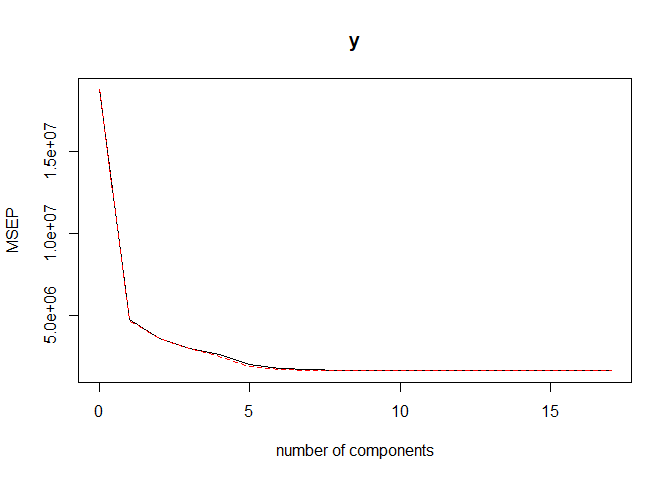<!-- -->

```r
pls.pred=predict(pls.fit,x[test,],ncomp=10)
mean((pls.pred-y.test)^2)
```

```
## [1] 1134531
```

```r
pls.fit=plsr(Salary~., data=Hitters,scale=TRUE,ncomp=10)
summary(pls.fit)
```

```
## Data: 	X dimension: 263 19 
## 	Y dimension: 263 1
## Fit method: kernelpls
## Number of components considered: 10
## TRAINING: % variance explained
##         1 comps  2 comps  3 comps  4 comps  5 comps  6 comps  7 comps
## X         38.08    51.03    65.98    73.93    78.63    84.26    88.17
## Salary    43.05    46.40    47.72    48.71    50.53    51.66    52.34
##         8 comps  9 comps  10 comps
## X         90.12    92.92     95.00
## Salary    53.26    53.52     53.77
```

> MSE = 1134531

## (g) Comment on the results obtained. How accurately can we predict the number of college applications received? Is there much difference among the test errors resulting from these five approaches?

> linear model using least squares test MSE = 1108531

> ridge regression model test MSE = 1037308

> lasso model test MSE = 1032128

> PCR model test MSE = 1166897

> PLS model test MSE = 1134531

> We see that PCR & PLS does not perform as well as the two shrinkage methods in this example. PCR will tend to do well in cases when the first few principal components are sufficient to capture most of the variation in the predictors as well as the relationship with the response.

> The lasso yields sparse models. So, the lasso will perform better when the response is a function of only a relatively small number of predictors.

# 11. We will now try to predict per capita crime rate in the Boston data set.

## (a) Try out some of the regression methods explored in this chapter, such as best subset selection, the lasso, ridge regression, and PCR. Present and discuss results for the approaches that you consider.


```r
library(MASS)
summary(Boston)
```

```
##       crim                zn             indus            chas        
##  Min.   : 0.00632   Min.   :  0.00   Min.   : 0.46   Min.   :0.00000  
##  1st Qu.: 0.08204   1st Qu.:  0.00   1st Qu.: 5.19   1st Qu.:0.00000  
##  Median : 0.25651   Median :  0.00   Median : 9.69   Median :0.00000  
##  Mean   : 3.61352   Mean   : 11.36   Mean   :11.14   Mean   :0.06917  
##  3rd Qu.: 3.67708   3rd Qu.: 12.50   3rd Qu.:18.10   3rd Qu.:0.00000  
##  Max.   :88.97620   Max.   :100.00   Max.   :27.74   Max.   :1.00000  
##       nox               rm             age              dis        
##  Min.   :0.3850   Min.   :3.561   Min.   :  2.90   Min.   : 1.130  
##  1st Qu.:0.4490   1st Qu.:5.886   1st Qu.: 45.02   1st Qu.: 2.100  
##  Median :0.5380   Median :6.208   Median : 77.50   Median : 3.207  
##  Mean   :0.5547   Mean   :6.285   Mean   : 68.57   Mean   : 3.795  
##  3rd Qu.:0.6240   3rd Qu.:6.623   3rd Qu.: 94.08   3rd Qu.: 5.188  
##  Max.   :0.8710   Max.   :8.780   Max.   :100.00   Max.   :12.127  
##       rad              tax           ptratio          black       
##  Min.   : 1.000   Min.   :187.0   Min.   :12.60   Min.   :  0.32  
##  1st Qu.: 4.000   1st Qu.:279.0   1st Qu.:17.40   1st Qu.:375.38  
##  Median : 5.000   Median :330.0   Median :19.05   Median :391.44  
##  Mean   : 9.549   Mean   :408.2   Mean   :18.46   Mean   :356.67  
##  3rd Qu.:24.000   3rd Qu.:666.0   3rd Qu.:20.20   3rd Qu.:396.23  
##  Max.   :24.000   Max.   :711.0   Max.   :22.00   Max.   :396.90  
##      lstat            medv      
##  Min.   : 1.73   Min.   : 5.00  
##  1st Qu.: 6.95   1st Qu.:17.02  
##  Median :11.36   Median :21.20  
##  Mean   :12.65   Mean   :22.53  
##  3rd Qu.:16.95   3rd Qu.:25.00  
##  Max.   :37.97   Max.   :50.00
```

```r
# best subset selection

library(leaps)

regfit.full=regsubsets(crim~.,Boston,nvmax = 13)
summary(regfit.full)
```

```
## Subset selection object
## Call: regsubsets.formula(crim ~ ., Boston, nvmax = 13)
## 13 Variables  (and intercept)
##         Forced in Forced out
## zn          FALSE      FALSE
## indus       FALSE      FALSE
## chas        FALSE      FALSE
## nox         FALSE      FALSE
## rm          FALSE      FALSE
## age         FALSE      FALSE
## dis         FALSE      FALSE
## rad         FALSE      FALSE
## tax         FALSE      FALSE
## ptratio     FALSE      FALSE
## black       FALSE      FALSE
## lstat       FALSE      FALSE
## medv        FALSE      FALSE
## 1 subsets of each size up to 13
## Selection Algorithm: exhaustive
##           zn  indus chas nox rm  age dis rad tax ptratio black lstat medv
## 1  ( 1 )  " " " "   " "  " " " " " " " " "*" " " " "     " "   " "   " " 
## 2  ( 1 )  " " " "   " "  " " " " " " " " "*" " " " "     " "   "*"   " " 
## 3  ( 1 )  " " " "   " "  " " " " " " " " "*" " " " "     "*"   "*"   " " 
## 4  ( 1 )  "*" " "   " "  " " " " " " "*" "*" " " " "     " "   " "   "*" 
## 5  ( 1 )  "*" " "   " "  " " " " " " "*" "*" " " " "     "*"   " "   "*" 
## 6  ( 1 )  "*" " "   " "  "*" " " " " "*" "*" " " " "     "*"   " "   "*" 
## 7  ( 1 )  "*" " "   " "  "*" " " " " "*" "*" " " "*"     "*"   " "   "*" 
## 8  ( 1 )  "*" " "   " "  "*" " " " " "*" "*" " " "*"     "*"   "*"   "*" 
## 9  ( 1 )  "*" "*"   " "  "*" " " " " "*" "*" " " "*"     "*"   "*"   "*" 
## 10  ( 1 ) "*" "*"   " "  "*" "*" " " "*" "*" " " "*"     "*"   "*"   "*" 
## 11  ( 1 ) "*" "*"   " "  "*" "*" " " "*" "*" "*" "*"     "*"   "*"   "*" 
## 12  ( 1 ) "*" "*"   "*"  "*" "*" " " "*" "*" "*" "*"     "*"   "*"   "*" 
## 13  ( 1 ) "*" "*"   "*"  "*" "*" "*" "*" "*" "*" "*"     "*"   "*"   "*"
```

```r
plot(regfit.full,scale="r2")
```

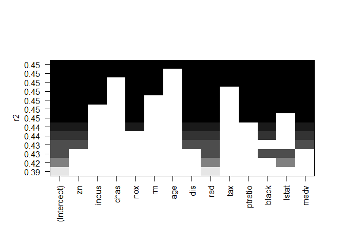<!-- -->

```r
plot(regfit.full,scale="adjr2")
```

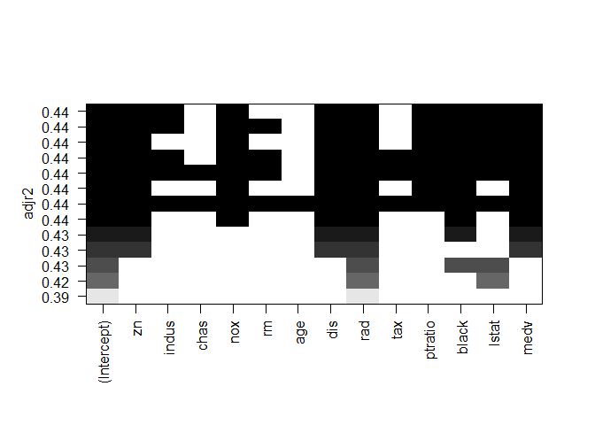<!-- -->

```r
plot(regfit.full,scale="Cp")
```

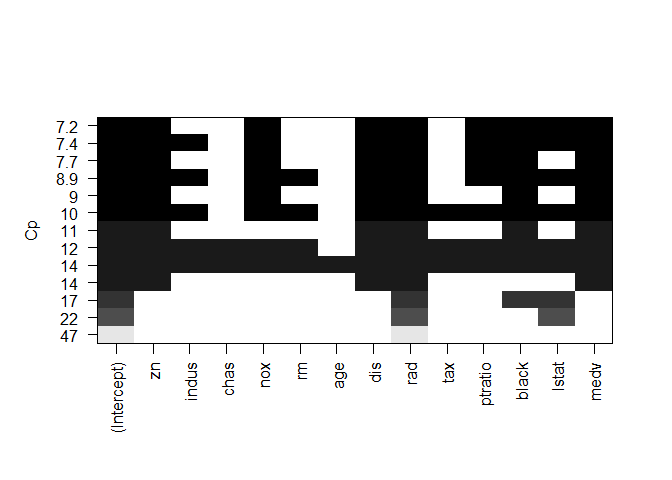<!-- -->

```r
plot(regfit.full,scale="bic")
```

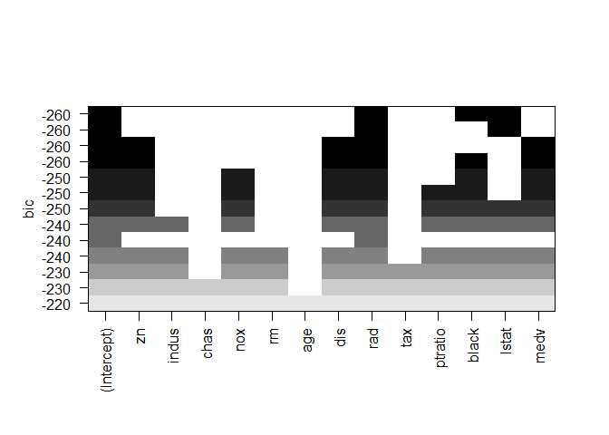<!-- -->

```r
reg.summary=summary(regfit.full)
plot(reg.summary$rss,xlab="Number of Variables",ylab="RSS",type="l")
```

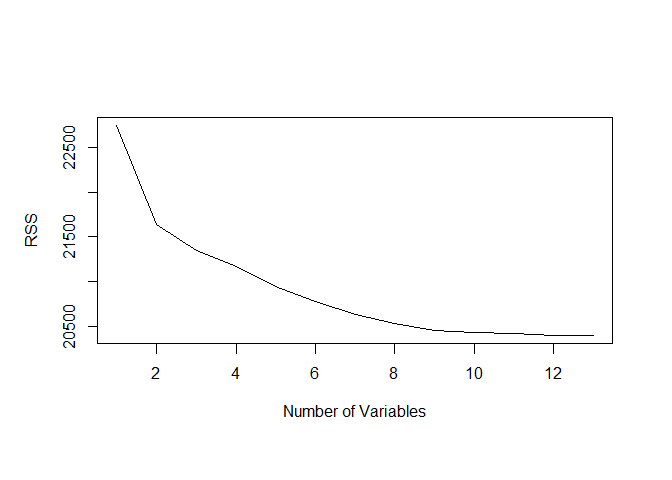<!-- -->

```r
plot(reg.summary$cp,xlab="Number of Variables",ylab="Cp",type='l')
which.min(reg.summary$cp)
```

```
## [1] 8
```

```r
points(which.min(reg.summary$cp),reg.summary$cp[which.min(reg.summary$cp)],col="red",cex=2,pch=20)
```

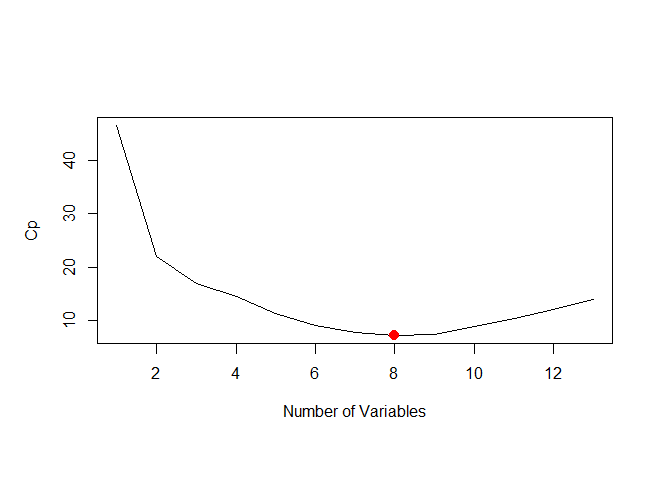<!-- -->

```r
plot(reg.summary$bic,xlab="Number of Variables",ylab="bic",type='l')
which.min(reg.summary$bic)
```

```
## [1] 3
```

```r
points(which.min(reg.summary$bic),reg.summary$bic[which.min(reg.summary$bic)],col="red",cex=2,pch=20)
```

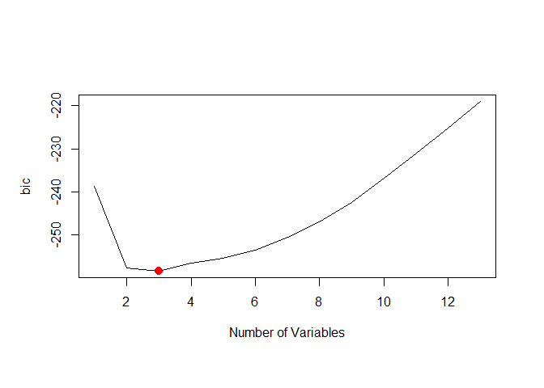<!-- -->

```r
plot(reg.summary$adjr2,xlab="Number of Variables",ylab="Adjusted RSq",type="l")
which.max(reg.summary$adjr2)
```

```
## [1] 9
```

```r
points(which.max(reg.summary$adjr2),reg.summary$adjr2[which.max(reg.summary$adjr2)], col="red",cex=2,pch=20)
```

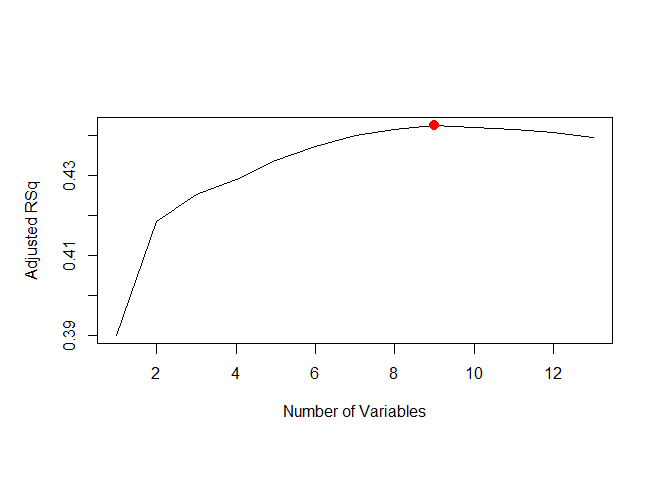<!-- -->

```r
coef(regfit.full,9)
```

```
##   (Intercept)            zn         indus           nox           dis 
##  19.124636156   0.042788127  -0.099385948 -10.466490364  -1.002597606 
##           rad       ptratio         black         lstat          medv 
##   0.539503547  -0.270835584  -0.008003761   0.117805932  -0.180593877
```

```r
coef(regfit.full,8)
```

```
##   (Intercept)            zn           nox           dis           rad 
##  19.683127801   0.043293393 -12.753707757  -0.918318253   0.532616533 
##       ptratio         black         lstat          medv 
##  -0.310540942  -0.007922426   0.110173124  -0.174207166
```

```r
coef(regfit.full,3)
```

```
##  (Intercept)          rad        black        lstat 
## -0.372585457  0.488172386 -0.009471639  0.213595700
```

```r
# the lasso
library(glmnet)

grid=10^seq(10,-2,length=100)

x=model.matrix(crim~.,Boston)[,-1]
y=Boston$crim

set.seed(1)
train=sample(1:nrow(x), nrow(x)/2)
test=(-train)
y.test=y[test]

lasso.mod=glmnet(x[train,],y[train],alpha=1,lambda=grid)
plot(lasso.mod)
```

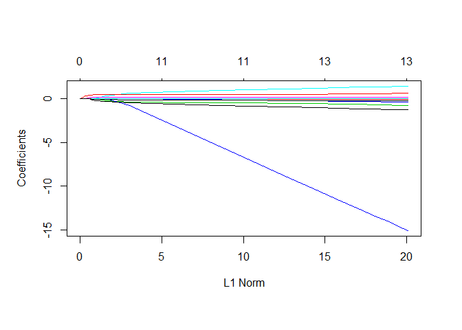<!-- -->

```r
set.seed(1)
cv.out=cv.glmnet(x[train,],y[train],alpha=1)
plot(cv.out)
```

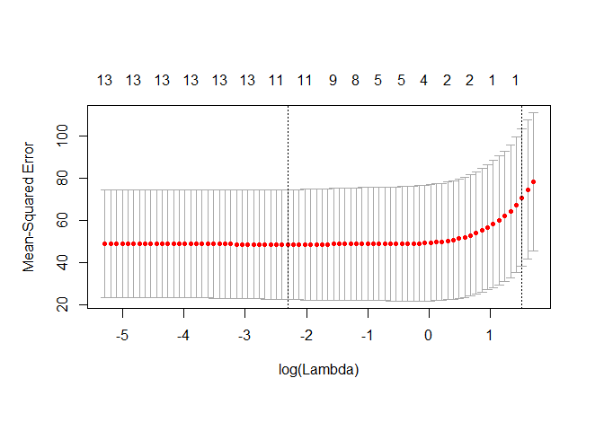<!-- -->

```r
bestlam=cv.out$lambda.min
bestlam
```

```
## [1] 0.09979553
```

```r
lasso.pred=predict(lasso.mod,s=bestlam,newx=x[test,])
mean((lasso.pred-y.test)^2)
```

```
## [1] 38.3096
```

```r
out=glmnet(x,y,alpha=1,lambda=grid)
lasso.coef=predict(out,type="coefficients",s=bestlam)[1:11,]
lasso.coef
```

```
## (Intercept)          zn       indus        chas         nox          rm 
##  9.26270091  0.03135641 -0.05102314 -0.51264890 -3.75545166  0.04132004 
##         age         dis         rad         tax     ptratio 
##  0.00000000 -0.60070039  0.49479389  0.00000000 -0.10750998
```

```r
lasso.coef[lasso.coef!=0]
```

```
## (Intercept)          zn       indus        chas         nox          rm 
##  9.26270091  0.03135641 -0.05102314 -0.51264890 -3.75545166  0.04132004 
##         dis         rad     ptratio 
## -0.60070039  0.49479389 -0.10750998
```

```r
# ridge regression
library(glmnet)

ridge.mod=glmnet(x[train,],y[train],alpha=0,lambda=grid, thresh=1e-12)

set.seed(1)
cv.out=cv.glmnet(x[train,],y[train],alpha=0)
plot(cv.out)
```

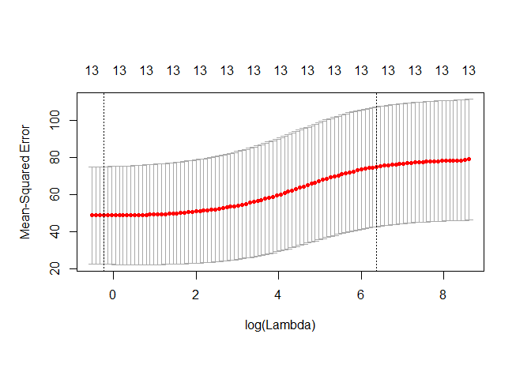<!-- -->

```r
bestlam=cv.out$lambda.min
bestlam
```

```
## [1] 0.7908625
```

```r
ridge.pred=predict(ridge.mod,s=bestlam,newx=x[test,])
mean((ridge.pred-y.test)^2)
```

```
## [1] 38.36587
```

```r
out=glmnet(x,y,alpha=0,lambda=grid)
ridge.coef=predict(out,type="coefficients",s=bestlam)[1:11,]
ridge.coef
```

```
##  (Intercept)           zn        indus         chas          nox 
##  7.210622046  0.030124939 -0.076009134 -0.747210720 -4.150965154 
##           rm          age          dis          rad          tax 
##  0.304997445  0.002373218 -0.623135506  0.387204976  0.004545079 
##      ptratio 
## -0.101347676
```

```r
# PCR

library(pls)

set.seed(1)
pcr.fit=pcr(y~x,subset=train,scale=TRUE, validation="CV")
validationplot(pcr.fit,val.type="MSEP")
```

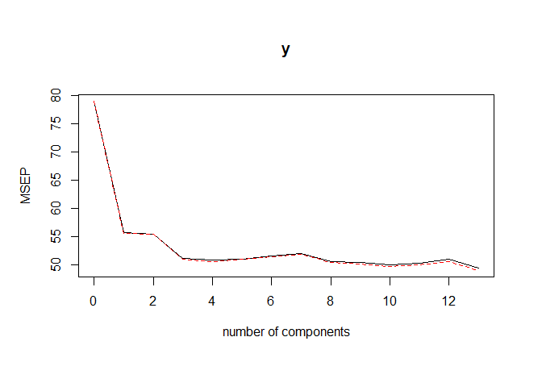<!-- -->

```r
summary(pcr.fit)
```

```
## Data: 	X dimension: 253 13 
## 	Y dimension: 253 1
## Fit method: svdpc
## Number of components considered: 13
## 
## VALIDATION: RMSEP
## Cross-validated using 10 random segments.
##        (Intercept)  1 comps  2 comps  3 comps  4 comps  5 comps  6 comps
## CV           8.892    7.459    7.444    7.146    7.128    7.143    7.181
## adjCV        8.892    7.456    7.440    7.140    7.113    7.136    7.170
##        7 comps  8 comps  9 comps  10 comps  11 comps  12 comps  13 comps
## CV       7.209    7.108    7.097     7.065     7.086     7.137     7.025
## adjCV    7.196    7.099    7.075     7.045     7.066     7.112     7.000
## 
## TRAINING: % variance explained
##    1 comps  2 comps  3 comps  4 comps  5 comps  6 comps  7 comps  8 comps
## X    49.04    60.72    69.75    76.49    83.02    88.40    91.73    93.77
## y    30.39    30.93    36.63    37.31    37.35    37.98    38.85    39.94
##    9 comps  10 comps  11 comps  12 comps  13 comps
## X    95.73     97.36     98.62     99.57    100.00
## y    41.89     42.73     42.73     43.55     45.48
```

```r
pcr.pred=predict(pcr.fit,x[test,],ncomp=12)
mean((pcr.pred-y.test)^2)
```

```
## [1] 39.40753
```

```r
pcr.fit=pcr(y~x,scale=TRUE,ncomp=12)
summary(pcr.fit)
```

```
## Data: 	X dimension: 506 13 
## 	Y dimension: 506 1
## Fit method: svdpc
## Number of components considered: 12
## TRAINING: % variance explained
##    1 comps  2 comps  3 comps  4 comps  5 comps  6 comps  7 comps  8 comps
## X    47.70    60.36    69.67    76.45    82.99    88.00    91.14    93.45
## y    30.69    30.87    39.27    39.61    39.61    39.86    40.14    42.47
##    9 comps  10 comps  11 comps  12 comps
## X    95.40     97.04     98.46     99.52
## y    42.55     42.78     43.04     44.13
```

> best subset selection,
Cp: 8; bic: 3; Adjusted RSq: 9

  (Intercept)            zn         indus           nox           dis 
 19.124636156   0.042788127  -0.099385948 -10.466490364  -1.002597606 
          rad       ptratio         black         lstat          medv 
  0.539503547  -0.270835584  -0.008003761   0.117805932  -0.180593877 
  (Intercept)            zn           nox           dis           rad 
 19.683127801   0.043293393 -12.753707757  -0.918318253   0.532616533 
      ptratio         black         lstat          medv 
 -0.310540942  -0.007922426   0.110173124  -0.174207166 
 (Intercept)          rad        black        lstat 
-0.372585457  0.488172386 -0.009471639  0.213595700 

> lasso: 8 test MSE = 38.3096

(Intercept)          zn       indus        chas         nox          rm 
 9.26270091  0.03135641 -0.05102314 -0.51264890 -3.75545166  0.04132004 
        dis         rad     ptratio 
-0.60070039  0.49479389 -0.10750998 


> ridge regression test MSE = 38.86819

 (Intercept)           zn        indus         chas          nox           rm 
14.776826098  0.041373639 -0.074977442 -0.733273998 -9.003406341  0.413309117 
         age          dis          rad          tax      ptratio 
 0.001260395 -0.915381715  0.537911180 -0.001370858 -0.234996727 


> PCR test MSE = 38.36587

## (b) Propose a model (or set of models) that seem to perform well on this data set, and justify your answer. Make sure that you are evaluating model performance using validation set error, cross-validation, or some other reasonable alternative, as opposed to using training error.


```r
# Choosing Among Models
# validation set approach

set.seed(1)
train=sample(c(TRUE,FALSE), nrow(Boston),rep=TRUE)
test=(!train)

regfit.best=regsubsets(crim~.,Boston[train,],nvmax = 13)
summary(regfit.best)
```

```
## Subset selection object
## Call: regsubsets.formula(crim ~ ., Boston[train, ], nvmax = 13)
## 13 Variables  (and intercept)
##         Forced in Forced out
## zn          FALSE      FALSE
## indus       FALSE      FALSE
## chas        FALSE      FALSE
## nox         FALSE      FALSE
## rm          FALSE      FALSE
## age         FALSE      FALSE
## dis         FALSE      FALSE
## rad         FALSE      FALSE
## tax         FALSE      FALSE
## ptratio     FALSE      FALSE
## black       FALSE      FALSE
## lstat       FALSE      FALSE
## medv        FALSE      FALSE
## 1 subsets of each size up to 13
## Selection Algorithm: exhaustive
##           zn  indus chas nox rm  age dis rad tax ptratio black lstat medv
## 1  ( 1 )  " " " "   " "  " " " " " " " " "*" " " " "     " "   " "   " " 
## 2  ( 1 )  " " " "   " "  " " " " " " " " "*" " " " "     " "   "*"   " " 
## 3  ( 1 )  " " " "   " "  " " "*" " " " " "*" " " " "     " "   " "   "*" 
## 4  ( 1 )  " " " "   " "  " " "*" " " " " "*" " " " "     " "   "*"   "*" 
## 5  ( 1 )  "*" " "   " "  " " "*" " " "*" "*" " " " "     " "   " "   "*" 
## 6  ( 1 )  "*" " "   " "  " " "*" " " "*" "*" " " " "     " "   "*"   "*" 
## 7  ( 1 )  "*" " "   " "  " " "*" " " "*" "*" " " " "     "*"   "*"   "*" 
## 8  ( 1 )  "*" " "   " "  " " "*" "*" "*" "*" " " " "     "*"   "*"   "*" 
## 9  ( 1 )  "*" " "   " "  " " "*" "*" "*" "*" " " "*"     "*"   "*"   "*" 
## 10  ( 1 ) "*" " "   " "  "*" "*" "*" "*" "*" " " "*"     "*"   "*"   "*" 
## 11  ( 1 ) "*" " "   " "  "*" "*" "*" "*" "*" "*" "*"     "*"   "*"   "*" 
## 12  ( 1 ) "*" " "   "*"  "*" "*" "*" "*" "*" "*" "*"     "*"   "*"   "*" 
## 13  ( 1 ) "*" "*"   "*"  "*" "*" "*" "*" "*" "*" "*"     "*"   "*"   "*"
```

```r
test.mat=model.matrix(crim~.,Boston[test,])

val.errors=rep(NA,13)
for(i in 1:13){
   coefi=coef(regfit.best,id=i)
   pred=test.mat[,names(coefi)]%*%coefi
   val.errors[i]=mean((Boston$crim[test]-pred)^2)
}

val.errors
```

```
##  [1] 58.50445 55.89099 57.93484 57.69696 56.87287 56.80141 59.49510
##  [8] 60.34830 60.42652 59.60702 59.38341 59.30440 59.36511
```

```r
which.min(val.errors)
```

```
## [1] 2
```

```r
coef(regfit.best,2)
```

```
## (Intercept)         rad       lstat 
##  -3.7604819   0.4750033   0.2041807
```

```r
# best model has 2 variables

# make a predict function
predict.regsubsets=function(object,newdata,id,...){
  form=as.formula(object$call[[2]])
  mat=model.matrix(form,newdata)
  coefi=coef(object,id=id)
  xvars=names(coefi)
  mat[,xvars]%*%coefi
  }

regfit.best=regsubsets(crim~.,Boston,nvmax=13)
coef(regfit.best,2)
```

```
## (Intercept)         rad       lstat 
##  -4.3814053   0.5228128   0.2372846
```

```r
# Cross validation

k=10
set.seed(1)
folds=sample(1:k,nrow(Boston),replace=TRUE)
cv.errors=matrix(NA,k,13, dimnames=list(NULL, paste(1:13)))

for(j in 1:k){
  best.fit=regsubsets(crim~.,data=Boston[folds!=j,],nvmax=13)
  for(i in 1:13){
    pred=predict.regsubsets(best.fit,Boston[folds==j,],id=i)
    cv.errors[j,i]=mean((Boston$crim[folds==j]-pred)^2)
    }
}

mean.cv.errors=apply(cv.errors,2,mean)
mean.cv.errors
```

```
##        1        2        3        4        5        6        7        8 
## 43.79995 42.64344 42.98910 42.53276 42.45726 42.39477 41.76549 41.82720 
##        9       10       11       12       13 
## 41.15964 41.21315 41.27749 41.03457 41.06013
```

```r
par(mfrow=c(1,1))
plot(mean.cv.errors,type='b')
```

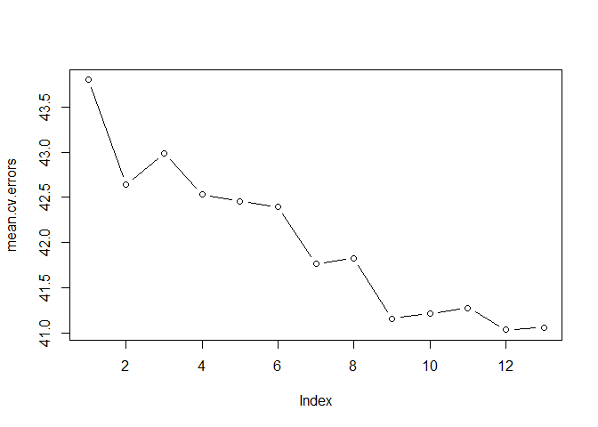<!-- -->

```r
reg.best=regsubsets(crim~.,data=Boston, nvmax=13)
coef(reg.best,12)
```

```
##   (Intercept)            zn         indus          chas           nox 
##  16.985713928   0.044673247  -0.063848469  -0.744367726 -10.202169211 
##            rm           dis           rad           tax       ptratio 
##   0.439588002  -0.993556631   0.587660185  -0.003767546  -0.269948860 
##         black         lstat          medv 
##  -0.007518904   0.128120290  -0.198877768
```

```r
coef(reg.best,9)
```

```
##   (Intercept)            zn         indus           nox           dis 
##  19.124636156   0.042788127  -0.099385948 -10.466490364  -1.002597606 
##           rad       ptratio         black         lstat          medv 
##   0.539503547  -0.270835584  -0.008003761   0.117805932  -0.180593877
```

> best model by validation set approach

(Intercept)         rad       lstat 
 -4.3814053   0.5228128   0.2372846 
 
> best model by Cross validation

> 12 v

  (Intercept)            zn         indus          chas           nox 
 16.985713928   0.044673247  -0.063848469  -0.744367726 -10.202169211 
           rm           dis           rad           tax       ptratio 
  0.439588002  -0.993556631   0.587660185  -0.003767546  -0.269948860 
        black         lstat          medv 
 -0.007518904   0.128120290  -0.198877768 
 
> 9 v

   (Intercept)            zn         indus           nox           dis 
 19.124636156   0.042788127  -0.099385948 -10.466490364  -1.002597606 
          rad       ptratio         black         lstat          medv 
  0.539503547  -0.270835584  -0.008003761   0.117805932  -0.180593877 

## (c) Does your chosen model involve all of the features in the data set? Why or why not?

> No
