# chapter7-1
Min-Yao  
2018年3月19日  

# Chapter 7 Lab: Non-linear Modeling


```r
library(ISLR)
attach(Wage)
```

# Polynomial Regression and Step Functions


```r
fit=lm(wage~poly(age,4),data=Wage)
summary(fit)
```

```
## 
## Call:
## lm(formula = wage ~ poly(age, 4), data = Wage)
## 
## Residuals:
##     Min      1Q  Median      3Q     Max 
## -98.707 -24.626  -4.993  15.217 203.693 
## 
## Coefficients:
##                Estimate Std. Error t value Pr(>|t|)    
## (Intercept)    111.7036     0.7287 153.283  < 2e-16 ***
## poly(age, 4)1  447.0679    39.9148  11.201  < 2e-16 ***
## poly(age, 4)2 -478.3158    39.9148 -11.983  < 2e-16 ***
## poly(age, 4)3  125.5217    39.9148   3.145  0.00168 ** 
## poly(age, 4)4  -77.9112    39.9148  -1.952  0.05104 .  
## ---
## Signif. codes:  0 '***' 0.001 '**' 0.01 '*' 0.05 '.' 0.1 ' ' 1
## 
## Residual standard error: 39.91 on 2995 degrees of freedom
## Multiple R-squared:  0.08626,	Adjusted R-squared:  0.08504 
## F-statistic: 70.69 on 4 and 2995 DF,  p-value: < 2.2e-16
```

```r
coef(summary(fit))
```

```
##                 Estimate Std. Error    t value     Pr(>|t|)
## (Intercept)    111.70361  0.7287409 153.283015 0.000000e+00
## poly(age, 4)1  447.06785 39.9147851  11.200558 1.484604e-28
## poly(age, 4)2 -478.31581 39.9147851 -11.983424 2.355831e-32
## poly(age, 4)3  125.52169 39.9147851   3.144742 1.678622e-03
## poly(age, 4)4  -77.91118 39.9147851  -1.951938 5.103865e-02
```


```r
fit2=lm(wage~poly(age,4,raw=T),data=Wage)
coef(summary(fit2))
```

```
##                             Estimate   Std. Error   t value     Pr(>|t|)
## (Intercept)            -1.841542e+02 6.004038e+01 -3.067172 0.0021802539
## poly(age, 4, raw = T)1  2.124552e+01 5.886748e+00  3.609042 0.0003123618
## poly(age, 4, raw = T)2 -5.638593e-01 2.061083e-01 -2.735743 0.0062606446
## poly(age, 4, raw = T)3  6.810688e-03 3.065931e-03  2.221409 0.0263977518
## poly(age, 4, raw = T)4 -3.203830e-05 1.641359e-05 -1.951938 0.0510386498
```

```r
fit2a=lm(wage~age+I(age^2)+I(age^3)+I(age^4),data=Wage)
summary(fit2a)
```

```
## 
## Call:
## lm(formula = wage ~ age + I(age^2) + I(age^3) + I(age^4), data = Wage)
## 
## Residuals:
##     Min      1Q  Median      3Q     Max 
## -98.707 -24.626  -4.993  15.217 203.693 
## 
## Coefficients:
##               Estimate Std. Error t value Pr(>|t|)    
## (Intercept) -1.842e+02  6.004e+01  -3.067 0.002180 ** 
## age          2.125e+01  5.887e+00   3.609 0.000312 ***
## I(age^2)    -5.639e-01  2.061e-01  -2.736 0.006261 ** 
## I(age^3)     6.811e-03  3.066e-03   2.221 0.026398 *  
## I(age^4)    -3.204e-05  1.641e-05  -1.952 0.051039 .  
## ---
## Signif. codes:  0 '***' 0.001 '**' 0.01 '*' 0.05 '.' 0.1 ' ' 1
## 
## Residual standard error: 39.91 on 2995 degrees of freedom
## Multiple R-squared:  0.08626,	Adjusted R-squared:  0.08504 
## F-statistic: 70.69 on 4 and 2995 DF,  p-value: < 2.2e-16
```

```r
coef(fit2a)
```

```
##   (Intercept)           age      I(age^2)      I(age^3)      I(age^4) 
## -1.841542e+02  2.124552e+01 -5.638593e-01  6.810688e-03 -3.203830e-05
```

```r
plot(fitted(fit2),fitted(fit2a))
```

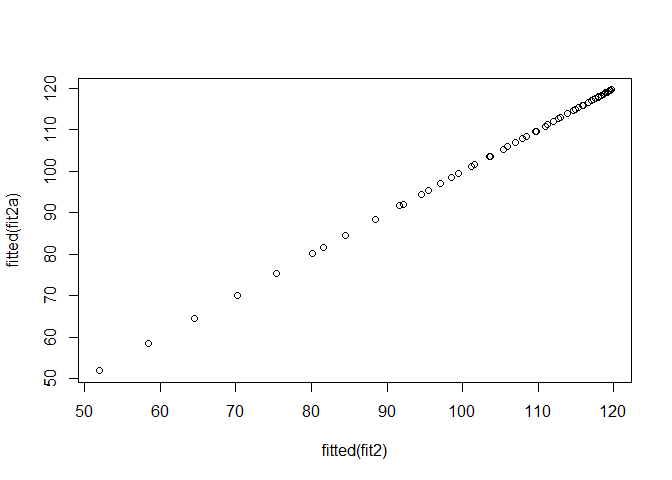<!-- -->

```r
fit2b=lm(wage~cbind(age,age^2,age^3,age^4),data=Wage)
summary(fit2b)
```

```
## 
## Call:
## lm(formula = wage ~ cbind(age, age^2, age^3, age^4), data = Wage)
## 
## Residuals:
##     Min      1Q  Median      3Q     Max 
## -98.707 -24.626  -4.993  15.217 203.693 
## 
## Coefficients:
##                                      Estimate Std. Error t value Pr(>|t|)
## (Intercept)                        -1.842e+02  6.004e+01  -3.067 0.002180
## cbind(age, age^2, age^3, age^4)age  2.125e+01  5.887e+00   3.609 0.000312
## cbind(age, age^2, age^3, age^4)    -5.639e-01  2.061e-01  -2.736 0.006261
## cbind(age, age^2, age^3, age^4)     6.811e-03  3.066e-03   2.221 0.026398
## cbind(age, age^2, age^3, age^4)    -3.204e-05  1.641e-05  -1.952 0.051039
##                                       
## (Intercept)                        ** 
## cbind(age, age^2, age^3, age^4)age ***
## cbind(age, age^2, age^3, age^4)    ** 
## cbind(age, age^2, age^3, age^4)    *  
## cbind(age, age^2, age^3, age^4)    .  
## ---
## Signif. codes:  0 '***' 0.001 '**' 0.01 '*' 0.05 '.' 0.1 ' ' 1
## 
## Residual standard error: 39.91 on 2995 degrees of freedom
## Multiple R-squared:  0.08626,	Adjusted R-squared:  0.08504 
## F-statistic: 70.69 on 4 and 2995 DF,  p-value: < 2.2e-16
```


```r
agelims=range(age)
age.grid=seq(from=agelims[1],to=agelims[2]) #min to  max (add 1 each time)
preds=predict(fit,newdata=list(age=age.grid),se=TRUE)# add SE
se.bands=cbind(preds$fit+2*preds$se.fit,preds$fit-2*preds$se.fit)

#par(mfrow=c(1,2),mar=c(4.5,4.5,1,1),oma=c(0,0,4,0))
plot(age,wage,xlim=agelims,cex=.5,col="darkgrey")
title("Degree-4 Polynomial",outer=T)
lines(age.grid,preds$fit,lwd=2,col="blue")
matlines(age.grid,se.bands,lwd=1,col="blue",lty=3)
```

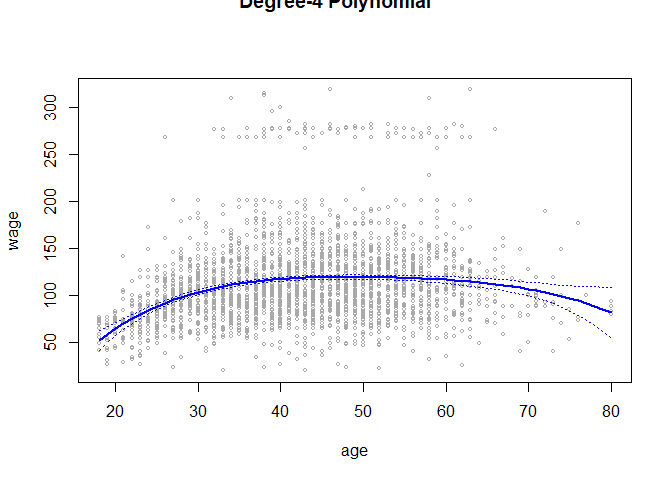<!-- -->

```r
preds2=predict(fit2,newdata=list(age=age.grid),se=TRUE)
max(abs(preds$fit-preds2$fit))
```

```
## [1] 7.81597e-11
```


```r
fit.1=lm(wage~age,data=Wage)
fit.2=lm(wage~poly(age,2),data=Wage)
fit.3=lm(wage~poly(age,3),data=Wage)
fit.4=lm(wage~poly(age,4),data=Wage)
fit.5=lm(wage~poly(age,5),data=Wage)
anova(fit.1,fit.2,fit.3,fit.4,fit.5)
```

```
## Analysis of Variance Table
## 
## Model 1: wage ~ age
## Model 2: wage ~ poly(age, 2)
## Model 3: wage ~ poly(age, 3)
## Model 4: wage ~ poly(age, 4)
## Model 5: wage ~ poly(age, 5)
##   Res.Df     RSS Df Sum of Sq        F    Pr(>F)    
## 1   2998 5022216                                    
## 2   2997 4793430  1    228786 143.5931 < 2.2e-16 ***
## 3   2996 4777674  1     15756   9.8888  0.001679 ** 
## 4   2995 4771604  1      6070   3.8098  0.051046 .  
## 5   2994 4770322  1      1283   0.8050  0.369682    
## ---
## Signif. codes:  0 '***' 0.001 '**' 0.01 '*' 0.05 '.' 0.1 ' ' 1
```

```r
coef(summary(fit.5))
```

```
##                 Estimate Std. Error     t value     Pr(>|t|)
## (Intercept)    111.70361  0.7287647 153.2780243 0.000000e+00
## poly(age, 5)1  447.06785 39.9160847  11.2001930 1.491111e-28
## poly(age, 5)2 -478.31581 39.9160847 -11.9830341 2.367734e-32
## poly(age, 5)3  125.52169 39.9160847   3.1446392 1.679213e-03
## poly(age, 5)4  -77.91118 39.9160847  -1.9518743 5.104623e-02
## poly(age, 5)5  -35.81289 39.9160847  -0.8972045 3.696820e-01
```

```r
(-11.983)^2
```

```
## [1] 143.5923
```

```r
fit.1=lm(wage~education+age,data=Wage)
fit.2=lm(wage~education+poly(age,2),data=Wage)
fit.3=lm(wage~education+poly(age,3),data=Wage)
anova(fit.1,fit.2,fit.3)
```

```
## Analysis of Variance Table
## 
## Model 1: wage ~ education + age
## Model 2: wage ~ education + poly(age, 2)
## Model 3: wage ~ education + poly(age, 3)
##   Res.Df     RSS Df Sum of Sq        F Pr(>F)    
## 1   2994 3867992                                 
## 2   2993 3725395  1    142597 114.6969 <2e-16 ***
## 3   2992 3719809  1      5587   4.4936 0.0341 *  
## ---
## Signif. codes:  0 '***' 0.001 '**' 0.01 '*' 0.05 '.' 0.1 ' ' 1
```


```r
#lab from video
fit=glm(I(wage>250)~poly(age,3),data=Wage,family=binomial)
summary(fit)
```

```
## 
## Call:
## glm(formula = I(wage > 250) ~ poly(age, 3), family = binomial, 
##     data = Wage)
## 
## Deviance Residuals: 
##     Min       1Q   Median       3Q      Max  
## -0.2808  -0.2736  -0.2487  -0.1758   3.2868  
## 
## Coefficients:
##               Estimate Std. Error z value Pr(>|z|)    
## (Intercept)    -3.8486     0.1597 -24.100  < 2e-16 ***
## poly(age, 3)1  37.8846    11.4818   3.300 0.000968 ***
## poly(age, 3)2 -29.5129    10.5626  -2.794 0.005205 ** 
## poly(age, 3)3   9.7966     8.9990   1.089 0.276317    
## ---
## Signif. codes:  0 '***' 0.001 '**' 0.01 '*' 0.05 '.' 0.1 ' ' 1
## 
## (Dispersion parameter for binomial family taken to be 1)
## 
##     Null deviance: 730.53  on 2999  degrees of freedom
## Residual deviance: 707.92  on 2996  degrees of freedom
## AIC: 715.92
## 
## Number of Fisher Scoring iterations: 8
```

```r
preds=predict(fit,newdata=list(age=age.grid),se=T)
se.bands = preds$fit + cbind(fit=0, lower=-2*preds$se, upper=2*preds$se)
se.bands[1:5,]
```

```
##         fit      lower     upper
## 1 -7.664756 -10.759826 -4.569686
## 2 -7.324776 -10.106699 -4.542852
## 3 -7.001732  -9.492821 -4.510643
## 4 -6.695229  -8.917158 -4.473300
## 5 -6.404868  -8.378691 -4.431045
```

$$p=\frac{e^eta}{1+e^eta}.$$

```r
#lab from video
prob.bands=exp(se.bands)/(1+exp(se.bands))
matplot(age.grid, prob.bands, col = "blue", lwd = c(2,1,1),lty = c(1,2,2),type = "l",ylim = c(0,.1))
points(jitter(age),I(wage>250)/10,pch="|",cex=.5)
```

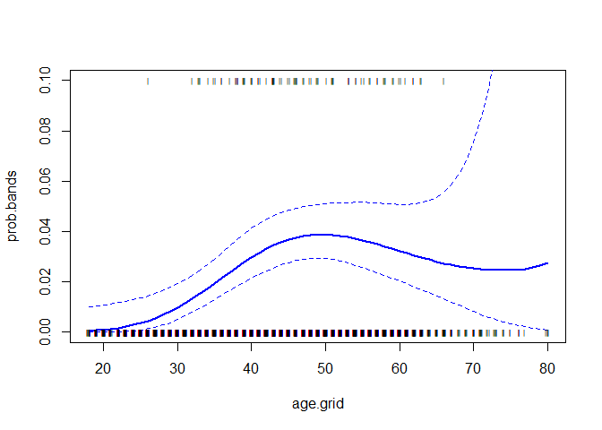<!-- -->


```r
fit=glm(I(wage>250)~poly(age,4),data=Wage,family=binomial)
preds=predict(fit,newdata=list(age=age.grid),se=T)

pfit=exp(preds$fit)/(1+exp(preds$fit))
se.bands.logit = cbind(preds$fit+2*preds$se.fit, preds$fit-2*preds$se.fit)
se.bands = exp(se.bands.logit)/(1+exp(se.bands.logit))

preds=predict(fit,newdata=list(age=age.grid),type="response",se=T)

plot(age,I(wage>250),xlim=agelims,type="n",ylim=c(0,.2))
points(jitter(age), I((wage>250)/5),cex=.5,pch="|",col="darkgrey")
lines(age.grid,pfit,lwd=2, col="blue")
matlines(age.grid,se.bands,lwd=1,col="blue",lty=3)
```

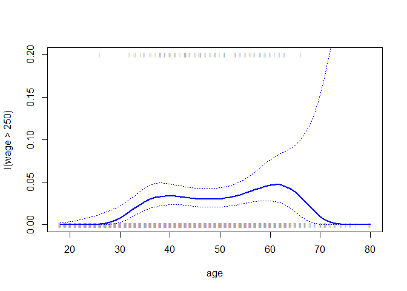<!-- -->

```r
table(cut(age,4))
```

```
## 
## (17.9,33.5]   (33.5,49]   (49,64.5] (64.5,80.1] 
##         750        1399         779          72
```

```r
fit=lm(wage~cut(age,4),data=Wage)
coef(summary(fit))
```

```
##                         Estimate Std. Error   t value     Pr(>|t|)
## (Intercept)            94.158392   1.476069 63.789970 0.000000e+00
## cut(age, 4)(33.5,49]   24.053491   1.829431 13.148074 1.982315e-38
## cut(age, 4)(49,64.5]   23.664559   2.067958 11.443444 1.040750e-29
## cut(age, 4)(64.5,80.1]  7.640592   4.987424  1.531972 1.256350e-01
```

# Splines


```r
library(splines)
fit=lm(wage~bs(age,knots=c(25,40,60)),data=Wage)
pred=predict(fit,newdata=list(age=age.grid),se=T)
summary(fit)
```

```
## 
## Call:
## lm(formula = wage ~ bs(age, knots = c(25, 40, 60)), data = Wage)
## 
## Residuals:
##     Min      1Q  Median      3Q     Max 
## -98.832 -24.537  -5.049  15.209 203.207 
## 
## Coefficients:
##                                 Estimate Std. Error t value Pr(>|t|)    
## (Intercept)                       60.494      9.460   6.394 1.86e-10 ***
## bs(age, knots = c(25, 40, 60))1    3.980     12.538   0.317 0.750899    
## bs(age, knots = c(25, 40, 60))2   44.631      9.626   4.636 3.70e-06 ***
## bs(age, knots = c(25, 40, 60))3   62.839     10.755   5.843 5.69e-09 ***
## bs(age, knots = c(25, 40, 60))4   55.991     10.706   5.230 1.81e-07 ***
## bs(age, knots = c(25, 40, 60))5   50.688     14.402   3.520 0.000439 ***
## bs(age, knots = c(25, 40, 60))6   16.606     19.126   0.868 0.385338    
## ---
## Signif. codes:  0 '***' 0.001 '**' 0.01 '*' 0.05 '.' 0.1 ' ' 1
## 
## Residual standard error: 39.92 on 2993 degrees of freedom
## Multiple R-squared:  0.08642,	Adjusted R-squared:  0.08459 
## F-statistic: 47.19 on 6 and 2993 DF,  p-value: < 2.2e-16
```

```r
plot(age,wage,col="gray")

lines(age.grid,pred$fit,lwd=2)
#abline(v=c(25,40,60),lty=2,col="darkgreen")
lines(age.grid,pred$fit+2*pred$se,lty="dashed")
lines(age.grid,pred$fit-2*pred$se,lty="dashed")


dim(bs(age,knots=c(25,40,60)))
```

```
## [1] 3000    6
```

```r
dim(bs(age,df=6))
```

```
## [1] 3000    6
```

```r
attr(bs(age,df=6),"knots")
```

```
##   25%   50%   75% 
## 33.75 42.00 51.00
```

```r
fit2=lm(wage~ns(age,df=4),data=Wage)
pred2=predict(fit2,newdata=list(age=age.grid),se=T)
lines(age.grid, pred2$fit,col="red",lwd=2)
```

<!-- -->

# 6. In this exercise, you will further analyze the Wage data set considered throughout this chapter. 

## (a) Perform polynomial regression to predict wage using age. Use cross-validation to select the optimal degree d for the polynomial. What degree was chosen, and how does this compare to the results of hypothesis testing using ANOVA? Make a plot of the resulting polynomial fit to the data.


```r
# ANOVA
fit.1=lm(wage~age,data=Wage)
fit.2=lm(wage~poly(age,2),data=Wage)
fit.3=lm(wage~poly(age,3),data=Wage)
fit.4=lm(wage~poly(age,4),data=Wage)
fit.5=lm(wage~poly(age,5),data=Wage)
anova(fit.1,fit.2,fit.3,fit.4,fit.5)
```

```
## Analysis of Variance Table
## 
## Model 1: wage ~ age
## Model 2: wage ~ poly(age, 2)
## Model 3: wage ~ poly(age, 3)
## Model 4: wage ~ poly(age, 4)
## Model 5: wage ~ poly(age, 5)
##   Res.Df     RSS Df Sum of Sq        F    Pr(>F)    
## 1   2998 5022216                                    
## 2   2997 4793430  1    228786 143.5931 < 2.2e-16 ***
## 3   2996 4777674  1     15756   9.8888  0.001679 ** 
## 4   2995 4771604  1      6070   3.8098  0.051046 .  
## 5   2994 4770322  1      1283   0.8050  0.369682    
## ---
## Signif. codes:  0 '***' 0.001 '**' 0.01 '*' 0.05 '.' 0.1 ' ' 1
```

```r
# cross-validation

library(boot)

##formula 5.2
loocv=function(fit){
  h=lm.influence(fit)$h
  mean((residuals(fit)/(1-h))^2)
}

set.seed(1)
cv.error=rep(0,10)
degree=1:10
for(d in degree){
  glm.fit=glm(wage~poly(age,d),data=Wage)
  cv.error[d]=loocv(glm.fit)
}
plot(degree,cv.error,type = "b")

cv.error10=rep(0,10)
for (i in 1:10){
 glm.fit=glm(wage~poly(age,i),data=Wage)
 cv.error10[i]=cv.glm(Wage,glm.fit,K=10)$delta[1]
 }
cv.error10
```

```
##  [1] 1675.837 1601.012 1598.801 1594.217 1594.625 1594.888 1595.500
##  [8] 1595.436 1596.335 1595.835
```

```r
plot(degree,cv.error,type = "b")
lines(degree,cv.error10,type = "b", col="red")
```

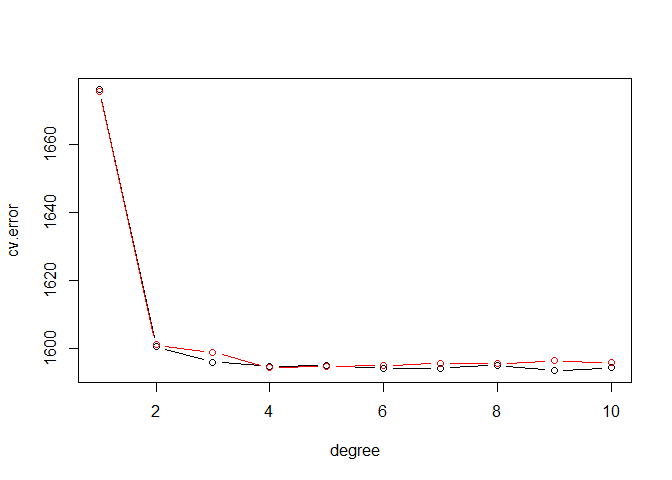<!-- -->

> ANOVA: degree=3; cross-validation: degree=4 lowest


```r
fit=lm(wage~poly(age,4),data=Wage)
summary(fit)
```

```
## 
## Call:
## lm(formula = wage ~ poly(age, 4), data = Wage)
## 
## Residuals:
##     Min      1Q  Median      3Q     Max 
## -98.707 -24.626  -4.993  15.217 203.693 
## 
## Coefficients:
##                Estimate Std. Error t value Pr(>|t|)    
## (Intercept)    111.7036     0.7287 153.283  < 2e-16 ***
## poly(age, 4)1  447.0679    39.9148  11.201  < 2e-16 ***
## poly(age, 4)2 -478.3158    39.9148 -11.983  < 2e-16 ***
## poly(age, 4)3  125.5217    39.9148   3.145  0.00168 ** 
## poly(age, 4)4  -77.9112    39.9148  -1.952  0.05104 .  
## ---
## Signif. codes:  0 '***' 0.001 '**' 0.01 '*' 0.05 '.' 0.1 ' ' 1
## 
## Residual standard error: 39.91 on 2995 degrees of freedom
## Multiple R-squared:  0.08626,	Adjusted R-squared:  0.08504 
## F-statistic: 70.69 on 4 and 2995 DF,  p-value: < 2.2e-16
```

```r
agelims=range(age)
age.grid=seq(from=agelims[1],to=agelims[2]) #min to  max (add 1 each time)
preds=predict(fit,newdata=list(age=age.grid),se=TRUE)# add SE
se.bands=cbind(preds$fit+2*preds$se.fit,preds$fit-2*preds$se.fit)

plot(age,wage,xlim=agelims,cex=.5,col="darkgrey")
title("Degree-4 Polynomial",outer=T)
lines(age.grid,preds$fit,lwd=2,col="blue")
matlines(age.grid,se.bands,lwd=1,col="blue",lty=3)
```

<!-- -->


## (b) Fit a step function to predict wage using age, and perform cross-validation to choose the optimal number of cuts. Make a plot of the fit obtained.


```r
set.seed(1)
cut.cv.error10=rep(0,10)
for (i in 2:10){
 Wage$age.cut <- cut(Wage$age, i) 
 glm.fit=glm(wage~age.cut,data=Wage)
 cut.cv.error10[i]=cv.glm(Wage,glm.fit,K=10)$delta[1]
 }
cut.cv.error10
```

```
##  [1]    0.000 1733.968 1683.398 1639.253 1631.339 1623.162 1612.098
##  [8] 1600.689 1611.707 1605.738
```

```r
plot(degree[-1],cut.cv.error10[-1],type = "b")
```

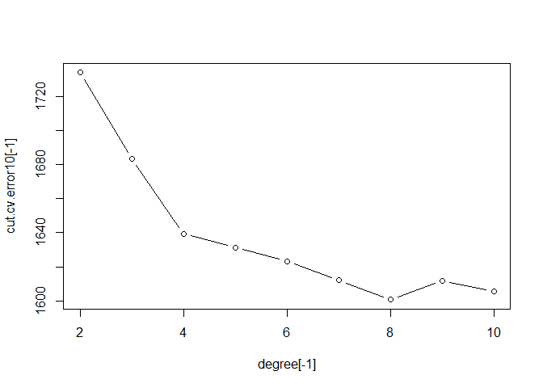<!-- -->


```r
plot(wage ~ age, data = Wage, col = "darkgrey")
fit <- lm(wage ~ cut(age, 8), data = Wage)
coef(summary(fit))
```

```
##                        Estimate Std. Error   t value      Pr(>|t|)
## (Intercept)            76.28175   2.629812 29.006542 3.110596e-163
## cut(age, 8)(25.8,33.5] 25.83329   3.161343  8.171618  4.440913e-16
## cut(age, 8)(33.5,41.2] 40.22568   3.049065 13.192791  1.136044e-38
## cut(age, 8)(41.2,49]   43.50112   3.018341 14.412262  1.406253e-45
## cut(age, 8)(49,56.8]   40.13583   3.176792 12.634076  1.098741e-35
## cut(age, 8)(56.8,64.5] 44.10243   3.564299 12.373380  2.481643e-34
## cut(age, 8)(64.5,72.2] 28.94825   6.041576  4.791505  1.736008e-06
## cut(age, 8)(72.2,80.1] 15.22418   9.781110  1.556488  1.196978e-01
```

```r
preds <- predict(fit, data.frame(age = age.grid))
lines(age.grid, preds, col = "blue", lwd = 2)
```

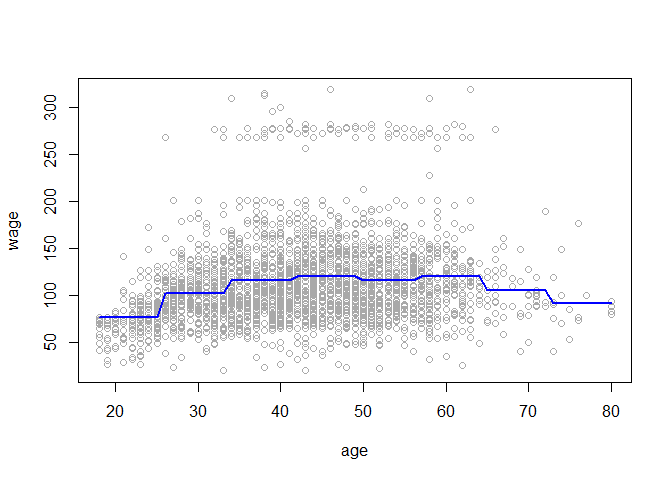<!-- -->


# 7. The Wage data set contains a number of other features not explored in this chapter, such as marital status (maritl), job class (jobclass), and others. Explore the relationships between some of these other predictors and wage, and use non-linear fitting techniques in order to fit flexible models to the data. Create plots of the results obtained, and write a summary of your findings.


```r
summary(Wage)
```

```
##       year           age                     maritl           race     
##  Min.   :2003   Min.   :18.00   1. Never Married: 648   1. White:2480  
##  1st Qu.:2004   1st Qu.:33.75   2. Married      :2074   2. Black: 293  
##  Median :2006   Median :42.00   3. Widowed      :  19   3. Asian: 190  
##  Mean   :2006   Mean   :42.41   4. Divorced     : 204   4. Other:  37  
##  3rd Qu.:2008   3rd Qu.:51.00   5. Separated    :  55                  
##  Max.   :2009   Max.   :80.00                                          
##                                                                        
##               education                     region    
##  1. < HS Grad      :268   2. Middle Atlantic   :3000  
##  2. HS Grad        :971   1. New England       :   0  
##  3. Some College   :650   3. East North Central:   0  
##  4. College Grad   :685   4. West North Central:   0  
##  5. Advanced Degree:426   5. South Atlantic    :   0  
##                           6. East South Central:   0  
##                           (Other)              :   0  
##            jobclass               health      health_ins      logwage     
##  1. Industrial :1544   1. <=Good     : 858   1. Yes:2083   Min.   :3.000  
##  2. Information:1456   2. >=Very Good:2142   2. No : 917   1st Qu.:4.447  
##                                                            Median :4.653  
##                                                            Mean   :4.654  
##                                                            3rd Qu.:4.857  
##                                                            Max.   :5.763  
##                                                                           
##       wage               age.cut   
##  Min.   : 20.09   (42.8,49]  :640  
##  1st Qu.: 85.38   (36.6,42.8]:542  
##  Median :104.92   (30.4,36.6]:445  
##  Mean   :111.70   (49,55.2]  :441  
##  3rd Qu.:128.68   (24.2,30.4]:347  
##  Max.   :318.34   (55.2,61.4]:270  
##                   (Other)    :315
```

```r
library(ggplot2)
library(GGally)
ggpairs(Wage)
```

```
## `stat_bin()` using `bins = 30`. Pick better value with `binwidth`.
## `stat_bin()` using `bins = 30`. Pick better value with `binwidth`.
## `stat_bin()` using `bins = 30`. Pick better value with `binwidth`.
## `stat_bin()` using `bins = 30`. Pick better value with `binwidth`.
## `stat_bin()` using `bins = 30`. Pick better value with `binwidth`.
## `stat_bin()` using `bins = 30`. Pick better value with `binwidth`.
## `stat_bin()` using `bins = 30`. Pick better value with `binwidth`.
## `stat_bin()` using `bins = 30`. Pick better value with `binwidth`.
## `stat_bin()` using `bins = 30`. Pick better value with `binwidth`.
## `stat_bin()` using `bins = 30`. Pick better value with `binwidth`.
## `stat_bin()` using `bins = 30`. Pick better value with `binwidth`.
## `stat_bin()` using `bins = 30`. Pick better value with `binwidth`.
## `stat_bin()` using `bins = 30`. Pick better value with `binwidth`.
## `stat_bin()` using `bins = 30`. Pick better value with `binwidth`.
## `stat_bin()` using `bins = 30`. Pick better value with `binwidth`.
## `stat_bin()` using `bins = 30`. Pick better value with `binwidth`.
## `stat_bin()` using `bins = 30`. Pick better value with `binwidth`.
## `stat_bin()` using `bins = 30`. Pick better value with `binwidth`.
## `stat_bin()` using `bins = 30`. Pick better value with `binwidth`.
## `stat_bin()` using `bins = 30`. Pick better value with `binwidth`.
## `stat_bin()` using `bins = 30`. Pick better value with `binwidth`.
## `stat_bin()` using `bins = 30`. Pick better value with `binwidth`.
## `stat_bin()` using `bins = 30`. Pick better value with `binwidth`.
## `stat_bin()` using `bins = 30`. Pick better value with `binwidth`.
## `stat_bin()` using `bins = 30`. Pick better value with `binwidth`.
## `stat_bin()` using `bins = 30`. Pick better value with `binwidth`.
## `stat_bin()` using `bins = 30`. Pick better value with `binwidth`.
## `stat_bin()` using `bins = 30`. Pick better value with `binwidth`.
## `stat_bin()` using `bins = 30`. Pick better value with `binwidth`.
## `stat_bin()` using `bins = 30`. Pick better value with `binwidth`.
## `stat_bin()` using `bins = 30`. Pick better value with `binwidth`.
## `stat_bin()` using `bins = 30`. Pick better value with `binwidth`.
```

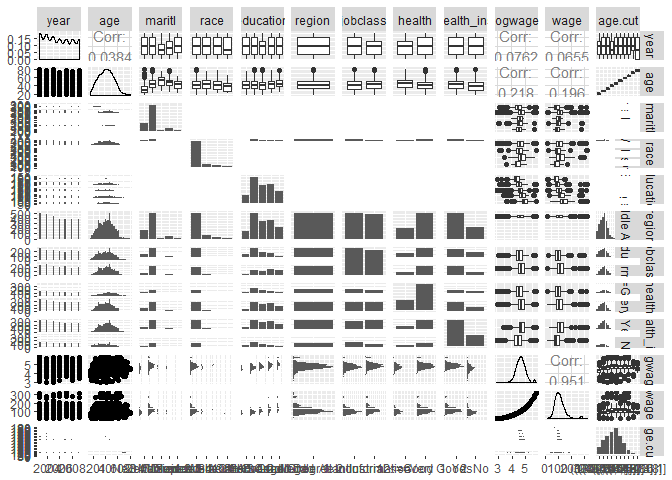<!-- -->


```r
fit.a=lm(wage~maritl,data=Wage)
fit.b=lm(wage~maritl+race,data=Wage)
fit.c=lm(wage~maritl+race+education,data=Wage)
fit.d=lm(wage~maritl+race+education+poly(age, 4),data=Wage)
anova(fit.a,fit.b,fit.c,fit.d)
```

```
## Analysis of Variance Table
## 
## Model 1: wage ~ maritl
## Model 2: wage ~ maritl + race
## Model 3: wage ~ maritl + race + education
## Model 4: wage ~ maritl + race + education + poly(age, 4)
##   Res.Df     RSS Df Sum of Sq        F    Pr(>F)    
## 1   2995 4858941                                    
## 2   2992 4822776  3     36165   9.9442 1.604e-06 ***
## 3   2988 3729846  4   1092930 225.3888 < 2.2e-16 ***
## 4   2984 3617421  4    112425  23.1848 < 2.2e-16 ***
## ---
## Signif. codes:  0 '***' 0.001 '**' 0.01 '*' 0.05 '.' 0.1 ' ' 1
```

```r
summary(fit.d)
```

```
## 
## Call:
## lm(formula = wage ~ maritl + race + education + poly(age, 4), 
##     data = Wage)
## 
## Residuals:
##      Min       1Q   Median       3Q      Max 
## -116.772  -19.432   -3.044   14.594  215.622 
## 
## Coefficients:
##                              Estimate Std. Error t value Pr(>|t|)    
## (Intercept)                   77.1645     2.6422  29.205  < 2e-16 ***
## maritl2. Married              13.3786     1.8656   7.171 9.33e-13 ***
## maritl3. Widowed              -0.3139     8.2050  -0.038   0.9695    
## maritl4. Divorced             -0.2209     3.0198  -0.073   0.9417    
## maritl5. Separated             7.4455     5.0039   1.488   0.1369    
## race2. Black                  -4.0739     2.1839  -1.865   0.0622 .  
## race3. Asian                  -4.0023     2.6654  -1.502   0.1333    
## race4. Other                  -7.0979     5.8012  -1.224   0.2212    
## education2. HS Grad           10.6773     2.4151   4.421 1.02e-05 ***
## education3. Some College      23.3626     2.5457   9.177  < 2e-16 ***
## education4. College Grad      37.6612     2.5382  14.838  < 2e-16 ***
## education5. Advanced Degree   61.9177     2.7620  22.417  < 2e-16 ***
## poly(age, 4)1                255.7806    39.9108   6.409 1.70e-10 ***
## poly(age, 4)2               -296.8379    36.9178  -8.040 1.28e-15 ***
## poly(age, 4)3                 40.6294    35.3124   1.151   0.2500    
## poly(age, 4)4                  4.4368    35.0090   0.127   0.8992    
## ---
## Signif. codes:  0 '***' 0.001 '**' 0.01 '*' 0.05 '.' 0.1 ' ' 1
## 
## Residual standard error: 34.82 on 2984 degrees of freedom
## Multiple R-squared:  0.3073,	Adjusted R-squared:  0.3038 
## F-statistic: 88.25 on 15 and 2984 DF,  p-value: < 2.2e-16
```


# 8. Fit some of the non-linear models investigated in this chapter to the Auto data set. Is there evidence for non-linear relationships in this data set? Create some informative plots to justify your answer.


```r
summary(Auto)
```

```
##       mpg          cylinders      displacement     horsepower   
##  Min.   : 9.00   Min.   :3.000   Min.   : 68.0   Min.   : 46.0  
##  1st Qu.:17.00   1st Qu.:4.000   1st Qu.:105.0   1st Qu.: 75.0  
##  Median :22.75   Median :4.000   Median :151.0   Median : 93.5  
##  Mean   :23.45   Mean   :5.472   Mean   :194.4   Mean   :104.5  
##  3rd Qu.:29.00   3rd Qu.:8.000   3rd Qu.:275.8   3rd Qu.:126.0  
##  Max.   :46.60   Max.   :8.000   Max.   :455.0   Max.   :230.0  
##                                                                 
##      weight      acceleration        year           origin     
##  Min.   :1613   Min.   : 8.00   Min.   :70.00   Min.   :1.000  
##  1st Qu.:2225   1st Qu.:13.78   1st Qu.:73.00   1st Qu.:1.000  
##  Median :2804   Median :15.50   Median :76.00   Median :1.000  
##  Mean   :2978   Mean   :15.54   Mean   :75.98   Mean   :1.577  
##  3rd Qu.:3615   3rd Qu.:17.02   3rd Qu.:79.00   3rd Qu.:2.000  
##  Max.   :5140   Max.   :24.80   Max.   :82.00   Max.   :3.000  
##                                                                
##                  name    
##  amc matador       :  5  
##  ford pinto        :  5  
##  toyota corolla    :  5  
##  amc gremlin       :  4  
##  amc hornet        :  4  
##  chevrolet chevette:  4  
##  (Other)           :365
```

```r
library(ggplot2)
library(GGally)
ggpairs(Auto[-9])
```

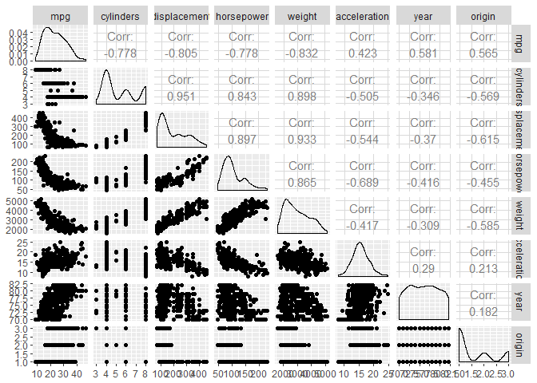<!-- -->


```r
fit.1=lm(mpg~poly(displacement,4),data=Auto)
summary(fit.1)
```

```
## 
## Call:
## lm(formula = mpg ~ poly(displacement, 4), data = Auto)
## 
## Residuals:
##      Min       1Q   Median       3Q      Max 
## -15.7755  -2.3666  -0.2723   2.1005  20.4053 
## 
## Coefficients:
##                         Estimate Std. Error t value Pr(>|t|)    
## (Intercept)              23.4459     0.2207 106.217  < 2e-16 ***
## poly(displacement, 4)1 -124.2585     4.3704 -28.432  < 2e-16 ***
## poly(displacement, 4)2   31.0895     4.3704   7.114  5.5e-12 ***
## poly(displacement, 4)3   -4.4655     4.3704  -1.022    0.308    
## poly(displacement, 4)4    0.7747     4.3704   0.177    0.859    
## ---
## Signif. codes:  0 '***' 0.001 '**' 0.01 '*' 0.05 '.' 0.1 ' ' 1
## 
## Residual standard error: 4.37 on 387 degrees of freedom
## Multiple R-squared:  0.6897,	Adjusted R-squared:  0.6865 
## F-statistic:   215 on 4 and 387 DF,  p-value: < 2.2e-16
```

```r
fit.1=lm(mpg~poly(displacement,2),data=Auto)
summary(fit.1)
```

```
## 
## Call:
## lm(formula = mpg ~ poly(displacement, 2), data = Auto)
## 
## Residuals:
##      Min       1Q   Median       3Q      Max 
## -15.2165  -2.2404  -0.2508   2.1094  20.5158 
## 
## Coefficients:
##                         Estimate Std. Error t value Pr(>|t|)    
## (Intercept)              23.4459     0.2205 106.343  < 2e-16 ***
## poly(displacement, 2)1 -124.2585     4.3652 -28.466  < 2e-16 ***
## poly(displacement, 2)2   31.0895     4.3652   7.122 5.17e-12 ***
## ---
## Signif. codes:  0 '***' 0.001 '**' 0.01 '*' 0.05 '.' 0.1 ' ' 1
## 
## Residual standard error: 4.365 on 389 degrees of freedom
## Multiple R-squared:  0.6888,	Adjusted R-squared:  0.6872 
## F-statistic: 430.5 on 2 and 389 DF,  p-value: < 2.2e-16
```

```r
displacementlims=range(Auto$displacement)
displacement.grid=seq(from=displacementlims[1],to=displacementlims[2])
preds=predict(fit.1,newdata=list(displacement=displacement.grid),se=TRUE)
se.bands=cbind(preds$fit+2*preds$se.fit,preds$fit-2*preds$se.fit)
plot(Auto$displacement,Auto$mpg,xlim=displacementlims,cex=.5,col="darkgrey")
title("Degree-2 Polynomial",outer=T)
lines(displacement.grid,preds$fit,lwd=2,col="blue")
matlines(displacement.grid,se.bands,lwd=1,col="blue",lty=3)
```

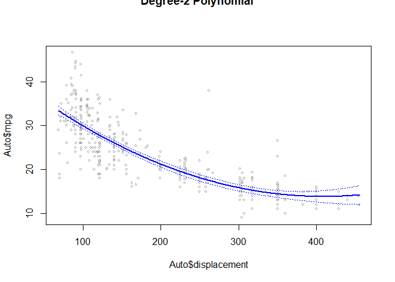<!-- -->

```r
fit.2=lm(mpg~poly(horsepower,4),data=Auto)
summary(fit.2)
```

```
## 
## Call:
## lm(formula = mpg ~ poly(horsepower, 4), data = Auto)
## 
## Residuals:
##      Min       1Q   Median       3Q      Max 
## -14.8820  -2.5802  -0.1682   2.2100  16.1434 
## 
## Coefficients:
##                       Estimate Std. Error t value Pr(>|t|)    
## (Intercept)            23.4459     0.2209 106.161   <2e-16 ***
## poly(horsepower, 4)1 -120.1377     4.3727 -27.475   <2e-16 ***
## poly(horsepower, 4)2   44.0895     4.3727  10.083   <2e-16 ***
## poly(horsepower, 4)3   -3.9488     4.3727  -0.903    0.367    
## poly(horsepower, 4)4   -5.1878     4.3727  -1.186    0.236    
## ---
## Signif. codes:  0 '***' 0.001 '**' 0.01 '*' 0.05 '.' 0.1 ' ' 1
## 
## Residual standard error: 4.373 on 387 degrees of freedom
## Multiple R-squared:  0.6893,	Adjusted R-squared:  0.6861 
## F-statistic: 214.7 on 4 and 387 DF,  p-value: < 2.2e-16
```

```r
fit.2=lm(mpg~poly(horsepower,2),data=Auto)
summary(fit.2)
```

```
## 
## Call:
## lm(formula = mpg ~ poly(horsepower, 2), data = Auto)
## 
## Residuals:
##      Min       1Q   Median       3Q      Max 
## -14.7135  -2.5943  -0.0859   2.2868  15.8961 
## 
## Coefficients:
##                       Estimate Std. Error t value Pr(>|t|)    
## (Intercept)            23.4459     0.2209  106.13   <2e-16 ***
## poly(horsepower, 2)1 -120.1377     4.3739  -27.47   <2e-16 ***
## poly(horsepower, 2)2   44.0895     4.3739   10.08   <2e-16 ***
## ---
## Signif. codes:  0 '***' 0.001 '**' 0.01 '*' 0.05 '.' 0.1 ' ' 1
## 
## Residual standard error: 4.374 on 389 degrees of freedom
## Multiple R-squared:  0.6876,	Adjusted R-squared:  0.686 
## F-statistic:   428 on 2 and 389 DF,  p-value: < 2.2e-16
```

```r
horsepowerlims=range(Auto$horsepower)
horsepower.grid=seq(from=horsepowerlims[1],to=horsepowerlims[2])
preds=predict(fit.2,newdata=list(horsepower=horsepower.grid),se=TRUE)
se.bands=cbind(preds$fit+2*preds$se.fit,preds$fit-2*preds$se.fit)
plot(Auto$horsepower,Auto$mpg,xlim=horsepowerlims,cex=.5,col="darkgrey")
title("Degree-2 Polynomial",outer=T)
lines(horsepower.grid,preds$fit,lwd=2,col="blue")
matlines(horsepower.grid,se.bands,lwd=1,col="blue",lty=3)
```

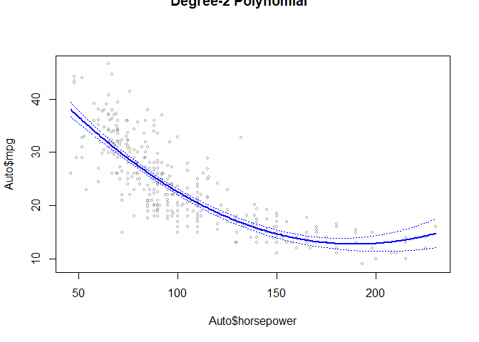<!-- -->

```r
fit.3=lm(mpg~poly(weight,4),data=Auto)
summary(fit.3)
```

```
## 
## Call:
## lm(formula = mpg ~ poly(weight, 4), data = Auto)
## 
## Residuals:
##      Min       1Q   Median       3Q      Max 
## -12.7233  -2.7179  -0.4254   1.9112  16.1935 
## 
## Coefficients:
##                   Estimate Std. Error t value Pr(>|t|)    
## (Intercept)        23.4459     0.2114 110.930  < 2e-16 ***
## poly(weight, 4)1 -128.4436     4.1847 -30.694  < 2e-16 ***
## poly(weight, 4)2   23.1589     4.1847   5.534 5.77e-08 ***
## poly(weight, 4)3    0.2204     4.1847   0.053    0.958    
## poly(weight, 4)4   -2.8079     4.1847  -0.671    0.503    
## ---
## Signif. codes:  0 '***' 0.001 '**' 0.01 '*' 0.05 '.' 0.1 ' ' 1
## 
## Residual standard error: 4.185 on 387 degrees of freedom
## Multiple R-squared:  0.7155,	Adjusted R-squared:  0.7125 
## F-statistic: 243.3 on 4 and 387 DF,  p-value: < 2.2e-16
```

```r
fit.3=lm(mpg~poly(weight,2),data=Auto)
summary(fit.3)
```

```
## 
## Call:
## lm(formula = mpg ~ poly(weight, 2), data = Auto)
## 
## Residuals:
##      Min       1Q   Median       3Q      Max 
## -12.6246  -2.7134  -0.3485   1.8267  16.0866 
## 
## Coefficients:
##                   Estimate Std. Error t value Pr(>|t|)    
## (Intercept)        23.4459     0.2109 111.151  < 2e-16 ***
## poly(weight, 2)1 -128.4436     4.1763 -30.755  < 2e-16 ***
## poly(weight, 2)2   23.1589     4.1763   5.545 5.43e-08 ***
## ---
## Signif. codes:  0 '***' 0.001 '**' 0.01 '*' 0.05 '.' 0.1 ' ' 1
## 
## Residual standard error: 4.176 on 389 degrees of freedom
## Multiple R-squared:  0.7151,	Adjusted R-squared:  0.7137 
## F-statistic: 488.3 on 2 and 389 DF,  p-value: < 2.2e-16
```

```r
weightlims=range(Auto$weight)
weight.grid=seq(from=weightlims[1],to=weightlims[2])
preds=predict(fit.3,newdata=list(weight=weight.grid),se=TRUE)
se.bands=cbind(preds$fit+2*preds$se.fit,preds$fit-2*preds$se.fit)
plot(Auto$weight,Auto$mpg,xlim=weightlims,cex=.5,col="darkgrey")
title("Degree-2 Polynomial",outer=T)
lines(weight.grid,preds$fit,lwd=2,col="blue")
matlines(weight.grid,se.bands,lwd=1,col="blue",lty=3)
```

<!-- -->

```r
fit.4=lm(mpg~poly(displacement,2)+poly(horsepower,2)+poly(weight,2),data=Auto)
summary(fit.4)
```

```
## 
## Call:
## lm(formula = mpg ~ poly(displacement, 2) + poly(horsepower, 2) + 
##     poly(weight, 2), data = Auto)
## 
## Residuals:
##      Min       1Q   Median       3Q      Max 
## -11.7507  -2.1972  -0.2779   2.0043  15.4606 
## 
## Coefficients:
##                        Estimate Std. Error t value Pr(>|t|)    
## (Intercept)             23.4459     0.1973 118.822  < 2e-16 ***
## poly(displacement, 2)1 -20.1433    12.7914  -1.575  0.11613    
## poly(displacement, 2)2  17.7385     7.5018   2.365  0.01855 *  
## poly(horsepower, 2)1   -59.3958    10.2600  -5.789 1.47e-08 ***
## poly(horsepower, 2)2    15.7790     5.7277   2.755  0.00615 ** 
## poly(weight, 2)1       -53.4821    12.6177  -4.239 2.82e-05 ***
## poly(weight, 2)2         8.1038     5.8596   1.383  0.16747    
## ---
## Signif. codes:  0 '***' 0.001 '**' 0.01 '*' 0.05 '.' 0.1 ' ' 1
## 
## Residual standard error: 3.907 on 385 degrees of freedom
## Multiple R-squared:  0.7533,	Adjusted R-squared:  0.7495 
## F-statistic: 195.9 on 6 and 385 DF,  p-value: < 2.2e-16
```


# 9. This question uses the variables dis (the weighted mean of distances to five Boston employment centers) and nox (nitrogen oxides concentration in parts per 10 million) from the Boston data. We will treat dis as the predictor and nox as the response.

## (a) Use the poly() function to fit a cubic polynomial regression to predict nox using dis. Report the regression output, and plot the resulting data and polynomial fits.


```r
library(MASS)
summary(Boston)
```

```
##       crim                zn             indus            chas        
##  Min.   : 0.00632   Min.   :  0.00   Min.   : 0.46   Min.   :0.00000  
##  1st Qu.: 0.08204   1st Qu.:  0.00   1st Qu.: 5.19   1st Qu.:0.00000  
##  Median : 0.25651   Median :  0.00   Median : 9.69   Median :0.00000  
##  Mean   : 3.61352   Mean   : 11.36   Mean   :11.14   Mean   :0.06917  
##  3rd Qu.: 3.67708   3rd Qu.: 12.50   3rd Qu.:18.10   3rd Qu.:0.00000  
##  Max.   :88.97620   Max.   :100.00   Max.   :27.74   Max.   :1.00000  
##       nox               rm             age              dis        
##  Min.   :0.3850   Min.   :3.561   Min.   :  2.90   Min.   : 1.130  
##  1st Qu.:0.4490   1st Qu.:5.886   1st Qu.: 45.02   1st Qu.: 2.100  
##  Median :0.5380   Median :6.208   Median : 77.50   Median : 3.207  
##  Mean   :0.5547   Mean   :6.285   Mean   : 68.57   Mean   : 3.795  
##  3rd Qu.:0.6240   3rd Qu.:6.623   3rd Qu.: 94.08   3rd Qu.: 5.188  
##  Max.   :0.8710   Max.   :8.780   Max.   :100.00   Max.   :12.127  
##       rad              tax           ptratio          black       
##  Min.   : 1.000   Min.   :187.0   Min.   :12.60   Min.   :  0.32  
##  1st Qu.: 4.000   1st Qu.:279.0   1st Qu.:17.40   1st Qu.:375.38  
##  Median : 5.000   Median :330.0   Median :19.05   Median :391.44  
##  Mean   : 9.549   Mean   :408.2   Mean   :18.46   Mean   :356.67  
##  3rd Qu.:24.000   3rd Qu.:666.0   3rd Qu.:20.20   3rd Qu.:396.23  
##  Max.   :24.000   Max.   :711.0   Max.   :22.00   Max.   :396.90  
##      lstat            medv      
##  Min.   : 1.73   Min.   : 5.00  
##  1st Qu.: 6.95   1st Qu.:17.02  
##  Median :11.36   Median :21.20  
##  Mean   :12.65   Mean   :22.53  
##  3rd Qu.:16.95   3rd Qu.:25.00  
##  Max.   :37.97   Max.   :50.00
```

```r
fit.1=lm(nox~poly(dis,3),data=Boston)
summary(fit.1)
```

```
## 
## Call:
## lm(formula = nox ~ poly(dis, 3), data = Boston)
## 
## Residuals:
##       Min        1Q    Median        3Q       Max 
## -0.121130 -0.040619 -0.009738  0.023385  0.194904 
## 
## Coefficients:
##                Estimate Std. Error t value Pr(>|t|)    
## (Intercept)    0.554695   0.002759 201.021  < 2e-16 ***
## poly(dis, 3)1 -2.003096   0.062071 -32.271  < 2e-16 ***
## poly(dis, 3)2  0.856330   0.062071  13.796  < 2e-16 ***
## poly(dis, 3)3 -0.318049   0.062071  -5.124 4.27e-07 ***
## ---
## Signif. codes:  0 '***' 0.001 '**' 0.01 '*' 0.05 '.' 0.1 ' ' 1
## 
## Residual standard error: 0.06207 on 502 degrees of freedom
## Multiple R-squared:  0.7148,	Adjusted R-squared:  0.7131 
## F-statistic: 419.3 on 3 and 502 DF,  p-value: < 2.2e-16
```

```r
dislims=range(Boston$dis)
dis.grid=seq(from=dislims[1],to=dislims[2])
preds=predict(fit.1,newdata=list(dis=dis.grid),se=TRUE)
se.bands=cbind(preds$fit+2*preds$se.fit,preds$fit-2*preds$se.fit)
plot(Boston$dis,Boston$nox,xlim=dislims,cex=.5,col="darkgrey")
title("Degree-3 Polynomial",outer=T)
lines(dis.grid,preds$fit,lwd=2,col="blue")
matlines(dis.grid,se.bands,lwd=1,col="blue",lty=3)
```

<!-- -->


## (b) Plot the polynomial fits for a range of different polynomial degrees (say, from 1 to 10), and report the associated residual sum of squares.


```r
plot(Boston$dis,Boston$nox,xlim=dislims,cex=.5,col="darkgrey")
title("Polynomial",outer=T)
for (i in 1:10){
  fit.1=lm(nox~poly(dis,i),data=Boston)
  preds=predict(fit.1,newdata=list(dis=dis.grid),se=TRUE)
  lines(dis.grid,preds$fit,lwd=2,col=26+i)
  print(summary(fit.1))
 }
```

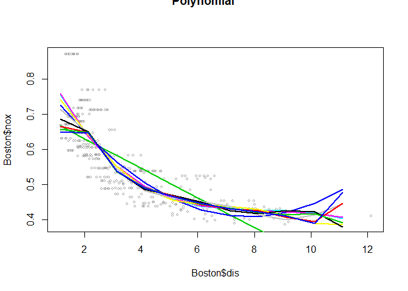<!-- -->

```
## 
## Call:
## lm(formula = nox ~ poly(dis, i), data = Boston)
## 
## Residuals:
##      Min       1Q   Median       3Q      Max 
## -0.12239 -0.05212 -0.01257  0.04391  0.23041 
## 
## Coefficients:
##               Estimate Std. Error t value Pr(>|t|)    
## (Intercept)   0.554695   0.003295  168.35   <2e-16 ***
## poly(dis, i) -2.003096   0.074116  -27.03   <2e-16 ***
## ---
## Signif. codes:  0 '***' 0.001 '**' 0.01 '*' 0.05 '.' 0.1 ' ' 1
## 
## Residual standard error: 0.07412 on 504 degrees of freedom
## Multiple R-squared:  0.5917,	Adjusted R-squared:  0.5909 
## F-statistic: 730.4 on 1 and 504 DF,  p-value: < 2.2e-16
## 
## 
## Call:
## lm(formula = nox ~ poly(dis, i), data = Boston)
## 
## Residuals:
##       Min        1Q    Median        3Q       Max 
## -0.129559 -0.044514 -0.007753  0.025778  0.201882 
## 
## Coefficients:
##                Estimate Std. Error t value Pr(>|t|)    
## (Intercept)    0.554695   0.002828  196.16   <2e-16 ***
## poly(dis, i)1 -2.003096   0.063610  -31.49   <2e-16 ***
## poly(dis, i)2  0.856330   0.063610   13.46   <2e-16 ***
## ---
## Signif. codes:  0 '***' 0.001 '**' 0.01 '*' 0.05 '.' 0.1 ' ' 1
## 
## Residual standard error: 0.06361 on 503 degrees of freedom
## Multiple R-squared:  0.6999,	Adjusted R-squared:  0.6987 
## F-statistic: 586.4 on 2 and 503 DF,  p-value: < 2.2e-16
## 
## 
## Call:
## lm(formula = nox ~ poly(dis, i), data = Boston)
## 
## Residuals:
##       Min        1Q    Median        3Q       Max 
## -0.121130 -0.040619 -0.009738  0.023385  0.194904 
## 
## Coefficients:
##                Estimate Std. Error t value Pr(>|t|)    
## (Intercept)    0.554695   0.002759 201.021  < 2e-16 ***
## poly(dis, i)1 -2.003096   0.062071 -32.271  < 2e-16 ***
## poly(dis, i)2  0.856330   0.062071  13.796  < 2e-16 ***
## poly(dis, i)3 -0.318049   0.062071  -5.124 4.27e-07 ***
## ---
## Signif. codes:  0 '***' 0.001 '**' 0.01 '*' 0.05 '.' 0.1 ' ' 1
## 
## Residual standard error: 0.06207 on 502 degrees of freedom
## Multiple R-squared:  0.7148,	Adjusted R-squared:  0.7131 
## F-statistic: 419.3 on 3 and 502 DF,  p-value: < 2.2e-16
## 
## 
## Call:
## lm(formula = nox ~ poly(dis, i), data = Boston)
## 
## Residuals:
##      Min       1Q   Median       3Q      Max 
## -0.12295 -0.04089 -0.01073  0.02290  0.19471 
## 
## Coefficients:
##                Estimate Std. Error t value Pr(>|t|)    
## (Intercept)    0.554695   0.002761  200.88  < 2e-16 ***
## poly(dis, i)1 -2.003096   0.062115  -32.25  < 2e-16 ***
## poly(dis, i)2  0.856330   0.062115   13.79  < 2e-16 ***
## poly(dis, i)3 -0.318049   0.062115   -5.12 4.36e-07 ***
## poly(dis, i)4  0.033547   0.062115    0.54    0.589    
## ---
## Signif. codes:  0 '***' 0.001 '**' 0.01 '*' 0.05 '.' 0.1 ' ' 1
## 
## Residual standard error: 0.06211 on 501 degrees of freedom
## Multiple R-squared:  0.7149,	Adjusted R-squared:  0.7127 
## F-statistic: 314.1 on 4 and 501 DF,  p-value: < 2.2e-16
## 
## 
## Call:
## lm(formula = nox ~ poly(dis, i), data = Boston)
## 
## Residuals:
##       Min        1Q    Median        3Q       Max 
## -0.123244 -0.040417 -0.008737  0.024004  0.193135 
## 
## Coefficients:
##                Estimate Std. Error t value Pr(>|t|)    
## (Intercept)    0.554695   0.002751 201.603  < 2e-16 ***
## poly(dis, i)1 -2.003096   0.061892 -32.365  < 2e-16 ***
## poly(dis, i)2  0.856330   0.061892  13.836  < 2e-16 ***
## poly(dis, i)3 -0.318049   0.061892  -5.139 3.97e-07 ***
## poly(dis, i)4  0.033547   0.061892   0.542   0.5880    
## poly(dis, i)5  0.133009   0.061892   2.149   0.0321 *  
## ---
## Signif. codes:  0 '***' 0.001 '**' 0.01 '*' 0.05 '.' 0.1 ' ' 1
## 
## Residual standard error: 0.06189 on 500 degrees of freedom
## Multiple R-squared:  0.7175,	Adjusted R-squared:  0.7147 
## F-statistic:   254 on 5 and 500 DF,  p-value: < 2.2e-16
## 
## 
## Call:
## lm(formula = nox ~ poly(dis, i), data = Boston)
## 
## Residuals:
##      Min       1Q   Median       3Q      Max 
## -0.12946 -0.03989 -0.01006  0.02729  0.18797 
## 
## Coefficients:
##                Estimate Std. Error t value Pr(>|t|)    
## (Intercept)    0.554695   0.002727 203.377  < 2e-16 ***
## poly(dis, i)1 -2.003096   0.061352 -32.649  < 2e-16 ***
## poly(dis, i)2  0.856330   0.061352  13.958  < 2e-16 ***
## poly(dis, i)3 -0.318049   0.061352  -5.184 3.16e-07 ***
## poly(dis, i)4  0.033547   0.061352   0.547  0.58477    
## poly(dis, i)5  0.133009   0.061352   2.168  0.03063 *  
## poly(dis, i)6 -0.192439   0.061352  -3.137  0.00181 ** 
## ---
## Signif. codes:  0 '***' 0.001 '**' 0.01 '*' 0.05 '.' 0.1 ' ' 1
## 
## Residual standard error: 0.06135 on 499 degrees of freedom
## Multiple R-squared:  0.723,	Adjusted R-squared:  0.7197 
## F-statistic: 217.1 on 6 and 499 DF,  p-value: < 2.2e-16
## 
## 
## Call:
## lm(formula = nox ~ poly(dis, i), data = Boston)
## 
## Residuals:
##       Min        1Q    Median        3Q       Max 
## -0.132762 -0.038635 -0.009287  0.025604  0.192399 
## 
## Coefficients:
##                Estimate Std. Error t value Pr(>|t|)    
## (Intercept)    0.554695   0.002709 204.748  < 2e-16 ***
## poly(dis, i)1 -2.003096   0.060941 -32.869  < 2e-16 ***
## poly(dis, i)2  0.856330   0.060941  14.052  < 2e-16 ***
## poly(dis, i)3 -0.318049   0.060941  -5.219 2.65e-07 ***
## poly(dis, i)4  0.033547   0.060941   0.550  0.58224    
## poly(dis, i)5  0.133009   0.060941   2.183  0.02953 *  
## poly(dis, i)6 -0.192439   0.060941  -3.158  0.00169 ** 
## poly(dis, i)7  0.169628   0.060941   2.783  0.00558 ** 
## ---
## Signif. codes:  0 '***' 0.001 '**' 0.01 '*' 0.05 '.' 0.1 ' ' 1
## 
## Residual standard error: 0.06094 on 498 degrees of freedom
## Multiple R-squared:  0.7273,	Adjusted R-squared:  0.7234 
## F-statistic: 189.7 on 7 and 498 DF,  p-value: < 2.2e-16
## 
## 
## Call:
## lm(formula = nox ~ poly(dis, i), data = Boston)
## 
## Residuals:
##       Min        1Q    Median        3Q       Max 
## -0.132328 -0.037459 -0.008615  0.023667  0.197200 
## 
## Coefficients:
##                Estimate Std. Error t value Pr(>|t|)    
## (Intercept)    0.554695   0.002702 205.312  < 2e-16 ***
## poly(dis, i)1 -2.003096   0.060774 -32.960  < 2e-16 ***
## poly(dis, i)2  0.856330   0.060774  14.091  < 2e-16 ***
## poly(dis, i)3 -0.318049   0.060774  -5.233 2.46e-07 ***
## poly(dis, i)4  0.033547   0.060774   0.552  0.58120    
## poly(dis, i)5  0.133009   0.060774   2.189  0.02909 *  
## poly(dis, i)6 -0.192439   0.060774  -3.166  0.00164 ** 
## poly(dis, i)7  0.169628   0.060774   2.791  0.00545 ** 
## poly(dis, i)8 -0.117703   0.060774  -1.937  0.05334 .  
## ---
## Signif. codes:  0 '***' 0.001 '**' 0.01 '*' 0.05 '.' 0.1 ' ' 1
## 
## Residual standard error: 0.06077 on 497 degrees of freedom
## Multiple R-squared:  0.7293,	Adjusted R-squared:  0.7249 
## F-statistic: 167.4 on 8 and 497 DF,  p-value: < 2.2e-16
## 
## 
## Call:
## lm(formula = nox ~ poly(dis, i), data = Boston)
## 
## Residuals:
##       Min        1Q    Median        3Q       Max 
## -0.131023 -0.038220 -0.009488  0.023747  0.197784 
## 
## Coefficients:
##                Estimate Std. Error t value Pr(>|t|)    
## (Intercept)    0.554695   0.002703 205.234  < 2e-16 ***
## poly(dis, i)1 -2.003096   0.060797 -32.947  < 2e-16 ***
## poly(dis, i)2  0.856330   0.060797  14.085  < 2e-16 ***
## poly(dis, i)3 -0.318049   0.060797  -5.231 2.49e-07 ***
## poly(dis, i)4  0.033547   0.060797   0.552  0.58134    
## poly(dis, i)5  0.133009   0.060797   2.188  0.02915 *  
## poly(dis, i)6 -0.192439   0.060797  -3.165  0.00164 ** 
## poly(dis, i)7  0.169628   0.060797   2.790  0.00547 ** 
## poly(dis, i)8 -0.117703   0.060797  -1.936  0.05343 .  
## poly(dis, i)9  0.047947   0.060797   0.789  0.43070    
## ---
## Signif. codes:  0 '***' 0.001 '**' 0.01 '*' 0.05 '.' 0.1 ' ' 1
## 
## Residual standard error: 0.0608 on 496 degrees of freedom
## Multiple R-squared:  0.7296,	Adjusted R-squared:  0.7247 
## F-statistic: 148.7 on 9 and 496 DF,  p-value: < 2.2e-16
## 
## 
## Call:
## lm(formula = nox ~ poly(dis, i), data = Boston)
## 
## Residuals:
##      Min       1Q   Median       3Q      Max 
## -0.12978 -0.03816 -0.01015  0.02420  0.19694 
## 
## Coefficients:
##                 Estimate Std. Error t value Pr(>|t|)    
## (Intercept)     0.554695   0.002705 205.092  < 2e-16 ***
## poly(dis, i)1  -2.003096   0.060839 -32.925  < 2e-16 ***
## poly(dis, i)2   0.856330   0.060839  14.075  < 2e-16 ***
## poly(dis, i)3  -0.318049   0.060839  -5.228 2.54e-07 ***
## poly(dis, i)4   0.033547   0.060839   0.551  0.58161    
## poly(dis, i)5   0.133009   0.060839   2.186  0.02926 *  
## poly(dis, i)6  -0.192439   0.060839  -3.163  0.00166 ** 
## poly(dis, i)7   0.169628   0.060839   2.788  0.00550 ** 
## poly(dis, i)8  -0.117703   0.060839  -1.935  0.05360 .  
## poly(dis, i)9   0.047947   0.060839   0.788  0.43102    
## poly(dis, i)10 -0.034054   0.060839  -0.560  0.57591    
## ---
## Signif. codes:  0 '***' 0.001 '**' 0.01 '*' 0.05 '.' 0.1 ' ' 1
## 
## Residual standard error: 0.06084 on 495 degrees of freedom
## Multiple R-squared:  0.7298,	Adjusted R-squared:  0.7243 
## F-statistic: 133.7 on 10 and 495 DF,  p-value: < 2.2e-16
```


## (c) Perform cross-validation or another approach to select the optimal degree for the polynomial, and explain your results.


```r
# cross-validation

library(boot)
set.seed(1)
cv.error=rep(0,10)
degree=1:10
for(d in degree){
  glm.fit=glm(nox~poly(dis,d),data=Boston)
  cv.error[d]=loocv(glm.fit)
}
cv.error
```

```
##  [1] 0.005523868 0.004079449 0.003874762 0.003887521 0.004164865
##  [6] 0.005384278 0.011068782 0.008121397 0.017616356 0.004430276
```

```r
plot(degree,cv.error,type = "b")

cv.error10=rep(0,10)
for (i in 1:10){
 glm.fit=glm(nox~poly(dis,i),data=Boston)
 cv.error10[i]=cv.glm(Boston,glm.fit,K=10)$delta[1]
 }
cv.error10
```

```
##  [1] 0.005536329 0.004077147 0.003899587 0.003862127 0.004298590
##  [6] 0.005095283 0.013680327 0.005284520 0.013355413 0.004148996
```

```r
plot(degree,cv.error,type = "b")
lines(degree,cv.error10,type = "b", col="red")
```

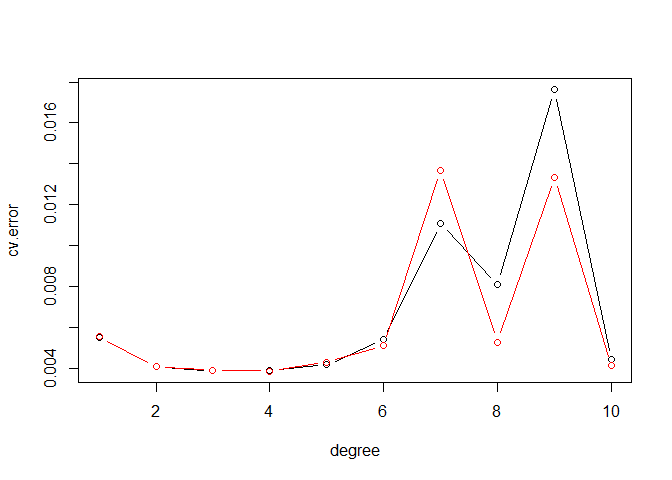<!-- -->

> optimal degree = 4

## (d) Use the bs() function to fit a regression spline to predict nox using dis. Report the output for the fit using four degrees of freedom. How did you choose the knots? Plot the resulting fit.


```r
library(splines)
fit=lm(nox~bs(dis,knots=c(3,5,7)),data=Boston)
pred=predict(fit,newdata=list(dis=dis.grid),se=T)
summary(fit)
```

```
## 
## Call:
## lm(formula = nox ~ bs(dis, knots = c(3, 5, 7)), data = Boston)
## 
## Residuals:
##      Min       1Q   Median       3Q      Max 
## -0.13394 -0.03823 -0.00945  0.02613  0.19095 
## 
## Coefficients:
##                              Estimate Std. Error t value Pr(>|t|)    
## (Intercept)                   0.70087    0.01668  42.020  < 2e-16 ***
## bs(dis, knots = c(3, 5, 7))1  0.02864    0.02809   1.019    0.308    
## bs(dis, knots = c(3, 5, 7))2 -0.21802    0.01807 -12.065  < 2e-16 ***
## bs(dis, knots = c(3, 5, 7))3 -0.21995    0.02471  -8.901  < 2e-16 ***
## bs(dis, knots = c(3, 5, 7))4 -0.31010    0.03045 -10.184  < 2e-16 ***
## bs(dis, knots = c(3, 5, 7))5 -0.27291    0.05526  -4.939 1.07e-06 ***
## bs(dis, knots = c(3, 5, 7))6 -0.29709    0.05755  -5.163 3.52e-07 ***
## ---
## Signif. codes:  0 '***' 0.001 '**' 0.01 '*' 0.05 '.' 0.1 ' ' 1
## 
## Residual standard error: 0.061 on 499 degrees of freedom
## Multiple R-squared:  0.7262,	Adjusted R-squared:  0.7229 
## F-statistic: 220.5 on 6 and 499 DF,  p-value: < 2.2e-16
```

```r
plot(Boston$dis,Boston$nox,col="gray")
lines(dis.grid,pred$fit,lwd=2)
lines(dis.grid,pred$fit+2*pred$se,lty="dashed")
lines(dis.grid,pred$fit-2*pred$se,lty="dashed")

dim(bs(Boston$dis,knots=c(3,5,7)))
```

```
## [1] 506   6
```

```r
dim(bs(Boston$dis,df=6))
```

```
## [1] 506   6
```

```r
attr(bs(Boston$dis,df=6),"knots")
```

```
##      25%      50%      75% 
## 2.100175 3.207450 5.188425
```

```r
fit2=lm(nox~ns(dis,df=4),data=Boston)
pred2=predict(fit2,newdata=list(dis=dis.grid),se=T)
lines(dis.grid, pred2$fit,col="red",lwd=2)
```

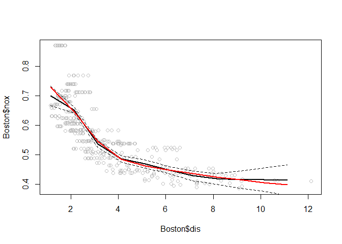<!-- -->


## (e) Now fit a regression spline for a range of degrees of freedom, and plot the resulting fits and report the resulting RSS. Describe the results obtained.


```r
plot(Boston$dis,Boston$nox,col="gray")
for (i in 1:10){
  fit2=lm(nox~ns(dis,df=i),data=Boston)
  pred2=predict(fit2,newdata=list(dis=dis.grid),se=T)
  lines(dis.grid, pred2$fit,col=1+i,lwd=2)
  print(summary(fit2))
 }
```

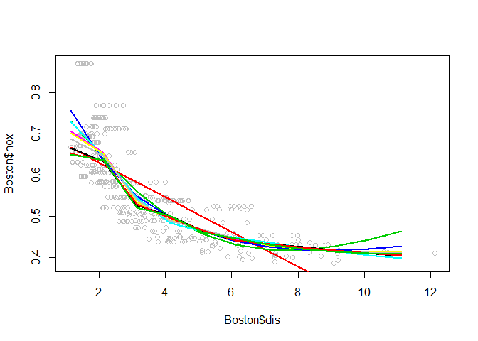<!-- -->

```
## 
## Call:
## lm(formula = nox ~ ns(dis, df = i), data = Boston)
## 
## Residuals:
##      Min       1Q   Median       3Q      Max 
## -0.12239 -0.05212 -0.01257  0.04391  0.23041 
## 
## Coefficients:
##                  Estimate Std. Error t value Pr(>|t|)    
## (Intercept)      0.667526   0.005318  125.51   <2e-16 ***
## ns(dis, df = i) -0.580591   0.021482  -27.03   <2e-16 ***
## ---
## Signif. codes:  0 '***' 0.001 '**' 0.01 '*' 0.05 '.' 0.1 ' ' 1
## 
## Residual standard error: 0.07412 on 504 degrees of freedom
## Multiple R-squared:  0.5917,	Adjusted R-squared:  0.5909 
## F-statistic: 730.4 on 1 and 504 DF,  p-value: < 2.2e-16
## 
## 
## Call:
## lm(formula = nox ~ ns(dis, df = i), data = Boston)
## 
## Residuals:
##      Min       1Q   Median       3Q      Max 
## -0.12243 -0.04211 -0.01018  0.02439  0.19834 
## 
## Coefficients:
##                   Estimate Std. Error t value Pr(>|t|)    
## (Intercept)       0.730781   0.006324 115.552  < 2e-16 ***
## ns(dis, df = i)1 -0.557735   0.015975 -34.912  < 2e-16 ***
## ns(dis, df = i)2 -0.109238   0.024247  -4.505 8.26e-06 ***
## ---
## Signif. codes:  0 '***' 0.001 '**' 0.01 '*' 0.05 '.' 0.1 ' ' 1
## 
## Residual standard error: 0.06265 on 503 degrees of freedom
## Multiple R-squared:  0.7088,	Adjusted R-squared:  0.7076 
## F-statistic: 612.2 on 2 and 503 DF,  p-value: < 2.2e-16
## 
## 
## Call:
## lm(formula = nox ~ ns(dis, df = i), data = Boston)
## 
## Residuals:
##      Min       1Q   Median       3Q      Max 
## -0.12479 -0.04153 -0.01073  0.02384  0.19341 
## 
## Coefficients:
##                   Estimate Std. Error t value Pr(>|t|)    
## (Intercept)       0.758407   0.009798  77.406   <2e-16 ***
## ns(dis, df = i)1 -0.298767   0.014701 -20.323   <2e-16 ***
## ns(dis, df = i)2 -0.507556   0.026528 -19.133   <2e-16 ***
## ns(dis, df = i)3 -0.232845   0.027248  -8.545   <2e-16 ***
## ---
## Signif. codes:  0 '***' 0.001 '**' 0.01 '*' 0.05 '.' 0.1 ' ' 1
## 
## Residual standard error: 0.06201 on 502 degrees of freedom
## Multiple R-squared:  0.7153,	Adjusted R-squared:  0.7136 
## F-statistic: 420.4 on 3 and 502 DF,  p-value: < 2.2e-16
## 
## 
## Call:
## lm(formula = nox ~ ns(dis, df = i), data = Boston)
## 
## Residuals:
##      Min       1Q   Median       3Q      Max 
## -0.12940 -0.04073 -0.00805  0.02494  0.19059 
## 
## Coefficients:
##                  Estimate Std. Error t value Pr(>|t|)    
## (Intercept)       0.73032    0.01276   57.23   <2e-16 ***
## ns(dis, df = i)1 -0.24312    0.01373  -17.70   <2e-16 ***
## ns(dis, df = i)2 -0.27001    0.01724  -15.67   <2e-16 ***
## ns(dis, df = i)3 -0.38799    0.03179  -12.21   <2e-16 ***
## ns(dis, df = i)4 -0.30464    0.03105   -9.81   <2e-16 ***
## ---
## Signif. codes:  0 '***' 0.001 '**' 0.01 '*' 0.05 '.' 0.1 ' ' 1
## 
## Residual standard error: 0.06135 on 501 degrees of freedom
## Multiple R-squared:  0.7219,	Adjusted R-squared:  0.7197 
## F-statistic: 325.1 on 4 and 501 DF,  p-value: < 2.2e-16
## 
## 
## Call:
## lm(formula = nox ~ ns(dis, df = i), data = Boston)
## 
## Residuals:
##       Min        1Q    Median        3Q       Max 
## -0.135970 -0.039500 -0.007689  0.025767  0.198373 
## 
## Coefficients:
##                  Estimate Std. Error t value Pr(>|t|)    
## (Intercept)       0.70702    0.01541  45.868  < 2e-16 ***
## ns(dis, df = i)1 -0.16858    0.01631 -10.335  < 2e-16 ***
## ns(dis, df = i)2 -0.21583    0.02003 -10.775  < 2e-16 ***
## ns(dis, df = i)3 -0.29232    0.01857 -15.740  < 2e-16 ***
## ns(dis, df = i)4 -0.30425    0.03826  -7.952 1.23e-14 ***
## ns(dis, df = i)5 -0.29475    0.03282  -8.980  < 2e-16 ***
## ---
## Signif. codes:  0 '***' 0.001 '**' 0.01 '*' 0.05 '.' 0.1 ' ' 1
## 
## Residual standard error: 0.061 on 500 degrees of freedom
## Multiple R-squared:  0.7257,	Adjusted R-squared:  0.7229 
## F-statistic: 264.5 on 5 and 500 DF,  p-value: < 2.2e-16
## 
## 
## Call:
## lm(formula = nox ~ ns(dis, df = i), data = Boston)
## 
## Residuals:
##       Min        1Q    Median        3Q       Max 
## -0.135007 -0.039356 -0.006573  0.024535  0.196108 
## 
## Coefficients:
##                  Estimate Std. Error t value Pr(>|t|)    
## (Intercept)       0.70205    0.01744  40.263  < 2e-16 ***
## ns(dis, df = i)1 -0.10413    0.01807  -5.764 1.44e-08 ***
## ns(dis, df = i)2 -0.19401    0.02354  -8.242 1.50e-15 ***
## ns(dis, df = i)3 -0.21955    0.02053 -10.694  < 2e-16 ***
## ns(dis, df = i)4 -0.29707    0.02070 -14.352  < 2e-16 ***
## ns(dis, df = i)5 -0.28848    0.04286  -6.731 4.63e-11 ***
## ns(dis, df = i)6 -0.29134    0.03528  -8.258 1.33e-15 ***
## ---
## Signif. codes:  0 '***' 0.001 '**' 0.01 '*' 0.05 '.' 0.1 ' ' 1
## 
## Residual standard error: 0.06096 on 499 degrees of freedom
## Multiple R-squared:  0.7266,	Adjusted R-squared:  0.7233 
## F-statistic:   221 on 6 and 499 DF,  p-value: < 2.2e-16
## 
## 
## Call:
## lm(formula = nox ~ ns(dis, df = i), data = Boston)
## 
## Residuals:
##       Min        1Q    Median        3Q       Max 
## -0.130881 -0.038032 -0.008759  0.023295  0.195629 
## 
## Coefficients:
##                  Estimate Std. Error t value Pr(>|t|)    
## (Intercept)       0.68808    0.01927  35.698  < 2e-16 ***
## ns(dis, df = i)1 -0.06610    0.01972  -3.352 0.000864 ***
## ns(dis, df = i)2 -0.13239    0.02664  -4.970 9.23e-07 ***
## ns(dis, df = i)3 -0.19265    0.02292  -8.404 4.56e-16 ***
## ns(dis, df = i)4 -0.21669    0.02348  -9.228  < 2e-16 ***
## ns(dis, df = i)5 -0.29244    0.02214 -13.206  < 2e-16 ***
## ns(dis, df = i)6 -0.24900    0.04751  -5.241 2.36e-07 ***
## ns(dis, df = i)7 -0.29436    0.03683  -7.992 9.31e-15 ***
## ---
## Signif. codes:  0 '***' 0.001 '**' 0.01 '*' 0.05 '.' 0.1 ' ' 1
## 
## Residual standard error: 0.06093 on 498 degrees of freedom
## Multiple R-squared:  0.7274,	Adjusted R-squared:  0.7236 
## F-statistic: 189.8 on 7 and 498 DF,  p-value: < 2.2e-16
## 
## 
## Call:
## lm(formula = nox ~ ns(dis, df = i), data = Boston)
## 
## Residuals:
##      Min       1Q   Median       3Q      Max 
## -0.12236 -0.03763 -0.01004  0.02598  0.18138 
## 
## Coefficients:
##                  Estimate Std. Error t value Pr(>|t|)    
## (Intercept)       0.66532    0.02039  32.626  < 2e-16 ***
## ns(dis, df = i)1 -0.05253    0.02072  -2.535 0.011538 *  
## ns(dis, df = i)2 -0.03614    0.02759  -1.310 0.190908    
## ns(dis, df = i)3 -0.18734    0.02542  -7.370 7.15e-13 ***
## ns(dis, df = i)4 -0.14547    0.02609  -5.576 4.05e-08 ***
## ns(dis, df = i)5 -0.21794    0.02394  -9.103  < 2e-16 ***
## ns(dis, df = i)6 -0.27271    0.02275 -11.986  < 2e-16 ***
## ns(dis, df = i)7 -0.18165    0.05047  -3.599 0.000352 ***
## ns(dis, df = i)8 -0.31209    0.03779  -8.258 1.34e-15 ***
## ---
## Signif. codes:  0 '***' 0.001 '**' 0.01 '*' 0.05 '.' 0.1 ' ' 1
## 
## Residual standard error: 0.06014 on 497 degrees of freedom
## Multiple R-squared:  0.7349,	Adjusted R-squared:  0.7306 
## F-statistic: 172.2 on 8 and 497 DF,  p-value: < 2.2e-16
## 
## 
## Call:
## lm(formula = nox ~ ns(dis, df = i), data = Boston)
## 
## Residuals:
##      Min       1Q   Median       3Q      Max 
## -0.12392 -0.03841 -0.01082  0.02597  0.18975 
## 
## Coefficients:
##                   Estimate Std. Error t value Pr(>|t|)    
## (Intercept)       0.651271   0.022044  29.544  < 2e-16 ***
## ns(dis, df = i)1 -0.028663   0.022476  -1.275  0.20282    
## ns(dis, df = i)2 -0.009686   0.028958  -0.334  0.73815    
## ns(dis, df = i)3 -0.116489   0.027493  -4.237 2.70e-05 ***
## ns(dis, df = i)4 -0.153761   0.028514  -5.392 1.08e-07 ***
## ns(dis, df = i)5 -0.153731   0.027423  -5.606 3.44e-08 ***
## ns(dis, df = i)6 -0.204356   0.025862  -7.902 1.79e-14 ***
## ns(dis, df = i)7 -0.272753   0.024066 -11.334  < 2e-16 ***
## ns(dis, df = i)8 -0.144922   0.054075  -2.680  0.00761 ** 
## ns(dis, df = i)9 -0.306935   0.038925  -7.885 2.01e-14 ***
## ---
## Signif. codes:  0 '***' 0.001 '**' 0.01 '*' 0.05 '.' 0.1 ' ' 1
## 
## Residual standard error: 0.06022 on 496 degrees of freedom
## Multiple R-squared:  0.7348,	Adjusted R-squared:   0.73 
## F-statistic: 152.7 on 9 and 496 DF,  p-value: < 2.2e-16
## 
## 
## Call:
## lm(formula = nox ~ ns(dis, df = i), data = Boston)
## 
## Residuals:
##      Min       1Q   Median       3Q      Max 
## -0.12449 -0.03680 -0.01056  0.02845  0.18279 
## 
## Coefficients:
##                    Estimate Std. Error t value Pr(>|t|)    
## (Intercept)        0.649468   0.023046  28.181  < 2e-16 ***
## ns(dis, df = i)1  -0.002651   0.023672  -0.112   0.9109    
## ns(dis, df = i)2  -0.023128   0.030272  -0.764   0.4452    
## ns(dis, df = i)3  -0.044172   0.028361  -1.557   0.1200    
## ns(dis, df = i)4  -0.172901   0.031302  -5.524 5.37e-08 ***
## ns(dis, df = i)5  -0.123554   0.028573  -4.324 1.85e-05 ***
## ns(dis, df = i)6  -0.186867   0.029503  -6.334 5.38e-10 ***
## ns(dis, df = i)7  -0.194390   0.026954  -7.212 2.08e-12 ***
## ns(dis, df = i)8  -0.282927   0.025216 -11.220  < 2e-16 ***
## ns(dis, df = i)9  -0.144506   0.056568  -2.555   0.0109 *  
## ns(dis, df = i)10 -0.293839   0.040002  -7.346 8.50e-13 ***
## ---
## Signif. codes:  0 '***' 0.001 '**' 0.01 '*' 0.05 '.' 0.1 ' ' 1
## 
## Residual standard error: 0.06012 on 495 degrees of freedom
## Multiple R-squared:  0.7361,	Adjusted R-squared:  0.7308 
## F-statistic: 138.1 on 10 and 495 DF,  p-value: < 2.2e-16
```


## (f) Perform cross-validation or another approach in order to select the best degrees of freedom for a regression spline on this data. Describe your results.


```r
# cross-validation

library(boot)
cv.error10=rep(0,10)
for (i in 1:10){
 glm.fit=glm(nox~ns(dis,df=i),data=Boston)
 cv.error10[i]=cv.glm(Boston,glm.fit,K=10)$delta[1]
 }
cv.error10
```

```
##  [1] 0.005517223 0.003935884 0.003872909 0.003798333 0.003744197
##  [6] 0.003780566 0.003739332 0.003668721 0.003709754 0.003681901
```

```r
plot(degree,cv.error10,type = "b", col="red")
```

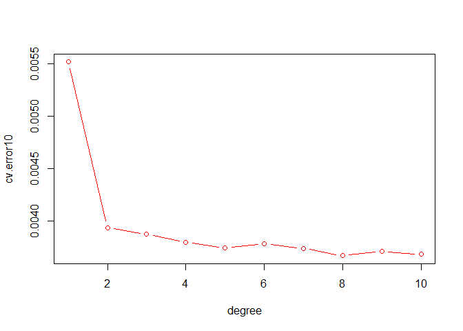<!-- -->

> the best degrees of freedom for a regression spline on this data = 8
