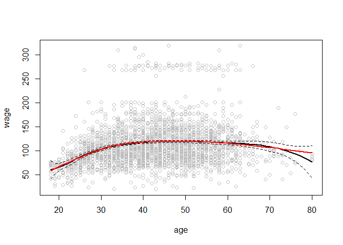

# chapter7-1
Min-Yao  
2018年3月19日  

# Chapter 7 Lab: Non-linear Modeling


```r
library(ISLR)
attach(Wage)
```

# Polynomial Regression and Step Functions


```r
fit=lm(wage~poly(age,4),data=Wage)
summary(fit)
```

```
## 
## Call:
## lm(formula = wage ~ poly(age, 4), data = Wage)
## 
## Residuals:
##     Min      1Q  Median      3Q     Max 
## -98.707 -24.626  -4.993  15.217 203.693 
## 
## Coefficients:
##                Estimate Std. Error t value Pr(>|t|)    
## (Intercept)    111.7036     0.7287 153.283  < 2e-16 ***
## poly(age, 4)1  447.0679    39.9148  11.201  < 2e-16 ***
## poly(age, 4)2 -478.3158    39.9148 -11.983  < 2e-16 ***
## poly(age, 4)3  125.5217    39.9148   3.145  0.00168 ** 
## poly(age, 4)4  -77.9112    39.9148  -1.952  0.05104 .  
## ---
## Signif. codes:  0 '***' 0.001 '**' 0.01 '*' 0.05 '.' 0.1 ' ' 1
## 
## Residual standard error: 39.91 on 2995 degrees of freedom
## Multiple R-squared:  0.08626,	Adjusted R-squared:  0.08504 
## F-statistic: 70.69 on 4 and 2995 DF,  p-value: < 2.2e-16
```

```r
coef(summary(fit))
```

```
##                 Estimate Std. Error    t value     Pr(>|t|)
## (Intercept)    111.70361  0.7287409 153.283015 0.000000e+00
## poly(age, 4)1  447.06785 39.9147851  11.200558 1.484604e-28
## poly(age, 4)2 -478.31581 39.9147851 -11.983424 2.355831e-32
## poly(age, 4)3  125.52169 39.9147851   3.144742 1.678622e-03
## poly(age, 4)4  -77.91118 39.9147851  -1.951938 5.103865e-02
```


```r
fit2=lm(wage~poly(age,4,raw=T),data=Wage)
coef(summary(fit2))
```

```
##                             Estimate   Std. Error   t value     Pr(>|t|)
## (Intercept)            -1.841542e+02 6.004038e+01 -3.067172 0.0021802539
## poly(age, 4, raw = T)1  2.124552e+01 5.886748e+00  3.609042 0.0003123618
## poly(age, 4, raw = T)2 -5.638593e-01 2.061083e-01 -2.735743 0.0062606446
## poly(age, 4, raw = T)3  6.810688e-03 3.065931e-03  2.221409 0.0263977518
## poly(age, 4, raw = T)4 -3.203830e-05 1.641359e-05 -1.951938 0.0510386498
```

```r
fit2a=lm(wage~age+I(age^2)+I(age^3)+I(age^4),data=Wage)
summary(fit2a)
```

```
## 
## Call:
## lm(formula = wage ~ age + I(age^2) + I(age^3) + I(age^4), data = Wage)
## 
## Residuals:
##     Min      1Q  Median      3Q     Max 
## -98.707 -24.626  -4.993  15.217 203.693 
## 
## Coefficients:
##               Estimate Std. Error t value Pr(>|t|)    
## (Intercept) -1.842e+02  6.004e+01  -3.067 0.002180 ** 
## age          2.125e+01  5.887e+00   3.609 0.000312 ***
## I(age^2)    -5.639e-01  2.061e-01  -2.736 0.006261 ** 
## I(age^3)     6.811e-03  3.066e-03   2.221 0.026398 *  
## I(age^4)    -3.204e-05  1.641e-05  -1.952 0.051039 .  
## ---
## Signif. codes:  0 '***' 0.001 '**' 0.01 '*' 0.05 '.' 0.1 ' ' 1
## 
## Residual standard error: 39.91 on 2995 degrees of freedom
## Multiple R-squared:  0.08626,	Adjusted R-squared:  0.08504 
## F-statistic: 70.69 on 4 and 2995 DF,  p-value: < 2.2e-16
```

```r
coef(fit2a)
```

```
##   (Intercept)           age      I(age^2)      I(age^3)      I(age^4) 
## -1.841542e+02  2.124552e+01 -5.638593e-01  6.810688e-03 -3.203830e-05
```

```r
plot(fitted(fit2),fitted(fit2a))
```

<!-- -->

```r
fit2b=lm(wage~cbind(age,age^2,age^3,age^4),data=Wage)
summary(fit2b)
```

```
## 
## Call:
## lm(formula = wage ~ cbind(age, age^2, age^3, age^4), data = Wage)
## 
## Residuals:
##     Min      1Q  Median      3Q     Max 
## -98.707 -24.626  -4.993  15.217 203.693 
## 
## Coefficients:
##                                      Estimate Std. Error t value Pr(>|t|)
## (Intercept)                        -1.842e+02  6.004e+01  -3.067 0.002180
## cbind(age, age^2, age^3, age^4)age  2.125e+01  5.887e+00   3.609 0.000312
## cbind(age, age^2, age^3, age^4)    -5.639e-01  2.061e-01  -2.736 0.006261
## cbind(age, age^2, age^3, age^4)     6.811e-03  3.066e-03   2.221 0.026398
## cbind(age, age^2, age^3, age^4)    -3.204e-05  1.641e-05  -1.952 0.051039
##                                       
## (Intercept)                        ** 
## cbind(age, age^2, age^3, age^4)age ***
## cbind(age, age^2, age^3, age^4)    ** 
## cbind(age, age^2, age^3, age^4)    *  
## cbind(age, age^2, age^3, age^4)    .  
## ---
## Signif. codes:  0 '***' 0.001 '**' 0.01 '*' 0.05 '.' 0.1 ' ' 1
## 
## Residual standard error: 39.91 on 2995 degrees of freedom
## Multiple R-squared:  0.08626,	Adjusted R-squared:  0.08504 
## F-statistic: 70.69 on 4 and 2995 DF,  p-value: < 2.2e-16
```


```r
agelims=range(age)
age.grid=seq(from=agelims[1],to=agelims[2]) #min to  max (add 1 each time)
preds=predict(fit,newdata=list(age=age.grid),se=TRUE)# add SE
se.bands=cbind(preds$fit+2*preds$se.fit,preds$fit-2*preds$se.fit)

par(mfrow=c(1,2),mar=c(4.5,4.5,1,1),oma=c(0,0,4,0))
plot(age,wage,xlim=agelims,cex=.5,col="darkgrey")
title("Degree-4 Polynomial",outer=T)
lines(age.grid,preds$fit,lwd=2,col="blue")
matlines(age.grid,se.bands,lwd=1,col="blue",lty=3)

preds2=predict(fit2,newdata=list(age=age.grid),se=TRUE)
max(abs(preds$fit-preds2$fit))
```

```
## [1] 7.81597e-11
```

<!-- -->


```r
fit.1=lm(wage~age,data=Wage)
fit.2=lm(wage~poly(age,2),data=Wage)
fit.3=lm(wage~poly(age,3),data=Wage)
fit.4=lm(wage~poly(age,4),data=Wage)
fit.5=lm(wage~poly(age,5),data=Wage)
anova(fit.1,fit.2,fit.3,fit.4,fit.5)
```

```
## Analysis of Variance Table
## 
## Model 1: wage ~ age
## Model 2: wage ~ poly(age, 2)
## Model 3: wage ~ poly(age, 3)
## Model 4: wage ~ poly(age, 4)
## Model 5: wage ~ poly(age, 5)
##   Res.Df     RSS Df Sum of Sq        F    Pr(>F)    
## 1   2998 5022216                                    
## 2   2997 4793430  1    228786 143.5931 < 2.2e-16 ***
## 3   2996 4777674  1     15756   9.8888  0.001679 ** 
## 4   2995 4771604  1      6070   3.8098  0.051046 .  
## 5   2994 4770322  1      1283   0.8050  0.369682    
## ---
## Signif. codes:  0 '***' 0.001 '**' 0.01 '*' 0.05 '.' 0.1 ' ' 1
```

```r
coef(summary(fit.5))
```

```
##                 Estimate Std. Error     t value     Pr(>|t|)
## (Intercept)    111.70361  0.7287647 153.2780243 0.000000e+00
## poly(age, 5)1  447.06785 39.9160847  11.2001930 1.491111e-28
## poly(age, 5)2 -478.31581 39.9160847 -11.9830341 2.367734e-32
## poly(age, 5)3  125.52169 39.9160847   3.1446392 1.679213e-03
## poly(age, 5)4  -77.91118 39.9160847  -1.9518743 5.104623e-02
## poly(age, 5)5  -35.81289 39.9160847  -0.8972045 3.696820e-01
```

```r
(-11.983)^2
```

```
## [1] 143.5923
```

```r
fit.1=lm(wage~education+age,data=Wage)
fit.2=lm(wage~education+poly(age,2),data=Wage)
fit.3=lm(wage~education+poly(age,3),data=Wage)
anova(fit.1,fit.2,fit.3)
```

```
## Analysis of Variance Table
## 
## Model 1: wage ~ education + age
## Model 2: wage ~ education + poly(age, 2)
## Model 3: wage ~ education + poly(age, 3)
##   Res.Df     RSS Df Sum of Sq        F Pr(>F)    
## 1   2994 3867992                                 
## 2   2993 3725395  1    142597 114.6969 <2e-16 ***
## 3   2992 3719809  1      5587   4.4936 0.0341 *  
## ---
## Signif. codes:  0 '***' 0.001 '**' 0.01 '*' 0.05 '.' 0.1 ' ' 1
```


```r
#lab from video
fit=glm(I(wage>250)~poly(age,3),data=Wage,family=binomial)
summary(fit)
```

```
## 
## Call:
## glm(formula = I(wage > 250) ~ poly(age, 3), family = binomial, 
##     data = Wage)
## 
## Deviance Residuals: 
##     Min       1Q   Median       3Q      Max  
## -0.2808  -0.2736  -0.2487  -0.1758   3.2868  
## 
## Coefficients:
##               Estimate Std. Error z value Pr(>|z|)    
## (Intercept)    -3.8486     0.1597 -24.100  < 2e-16 ***
## poly(age, 3)1  37.8846    11.4818   3.300 0.000968 ***
## poly(age, 3)2 -29.5129    10.5626  -2.794 0.005205 ** 
## poly(age, 3)3   9.7966     8.9990   1.089 0.276317    
## ---
## Signif. codes:  0 '***' 0.001 '**' 0.01 '*' 0.05 '.' 0.1 ' ' 1
## 
## (Dispersion parameter for binomial family taken to be 1)
## 
##     Null deviance: 730.53  on 2999  degrees of freedom
## Residual deviance: 707.92  on 2996  degrees of freedom
## AIC: 715.92
## 
## Number of Fisher Scoring iterations: 8
```

```r
preds=predict(fit,newdata=list(age=age.grid),se=T)
se.bands = preds$fit + cbind(fit=0, lower=-2*preds$se, upper=2*preds$se)
se.bands[1:5,]
```

```
##         fit      lower     upper
## 1 -7.664756 -10.759826 -4.569686
## 2 -7.324776 -10.106699 -4.542852
## 3 -7.001732  -9.492821 -4.510643
## 4 -6.695229  -8.917158 -4.473300
## 5 -6.404868  -8.378691 -4.431045
```

$$p=\frac{e^eta}{1+e^eta}.$$

```r
#lab from video
prob.bands=exp(se.bands)/(1+exp(se.bands))
matplot(age.grid, prob.bands, col = "blue", lwd = c(2,1,1),lty = c(1,2,2),type = "l",ylim = c(0,.1))
points(jitter(age),I(wage>250)/10,pch="|",cex=.5)
```

<!-- -->


```r
fit=glm(I(wage>250)~poly(age,4),data=Wage,family=binomial)
preds=predict(fit,newdata=list(age=age.grid),se=T)

pfit=exp(preds$fit)/(1+exp(preds$fit))
se.bands.logit = cbind(preds$fit+2*preds$se.fit, preds$fit-2*preds$se.fit)
se.bands = exp(se.bands.logit)/(1+exp(se.bands.logit))

preds=predict(fit,newdata=list(age=age.grid),type="response",se=T)

plot(age,I(wage>250),xlim=agelims,type="n",ylim=c(0,.2))
points(jitter(age), I((wage>250)/5),cex=.5,pch="|",col="darkgrey")
lines(age.grid,pfit,lwd=2, col="blue")
matlines(age.grid,se.bands,lwd=1,col="blue",lty=3)
```

<!-- -->

```r
table(cut(age,4))
```

```
## 
## (17.9,33.5]   (33.5,49]   (49,64.5] (64.5,80.1] 
##         750        1399         779          72
```

```r
fit=lm(wage~cut(age,4),data=Wage)
coef(summary(fit))
```

```
##                         Estimate Std. Error   t value     Pr(>|t|)
## (Intercept)            94.158392   1.476069 63.789970 0.000000e+00
## cut(age, 4)(33.5,49]   24.053491   1.829431 13.148074 1.982315e-38
## cut(age, 4)(49,64.5]   23.664559   2.067958 11.443444 1.040750e-29
## cut(age, 4)(64.5,80.1]  7.640592   4.987424  1.531972 1.256350e-01
```

# Splines


```r
library(splines)
fit=lm(wage~bs(age,knots=c(25,40,60)),data=Wage)
pred=predict(fit,newdata=list(age=age.grid),se=T)
summary(fit)
```

```
## 
## Call:
## lm(formula = wage ~ bs(age, knots = c(25, 40, 60)), data = Wage)
## 
## Residuals:
##     Min      1Q  Median      3Q     Max 
## -98.832 -24.537  -5.049  15.209 203.207 
## 
## Coefficients:
##                                 Estimate Std. Error t value Pr(>|t|)    
## (Intercept)                       60.494      9.460   6.394 1.86e-10 ***
## bs(age, knots = c(25, 40, 60))1    3.980     12.538   0.317 0.750899    
## bs(age, knots = c(25, 40, 60))2   44.631      9.626   4.636 3.70e-06 ***
## bs(age, knots = c(25, 40, 60))3   62.839     10.755   5.843 5.69e-09 ***
## bs(age, knots = c(25, 40, 60))4   55.991     10.706   5.230 1.81e-07 ***
## bs(age, knots = c(25, 40, 60))5   50.688     14.402   3.520 0.000439 ***
## bs(age, knots = c(25, 40, 60))6   16.606     19.126   0.868 0.385338    
## ---
## Signif. codes:  0 '***' 0.001 '**' 0.01 '*' 0.05 '.' 0.1 ' ' 1
## 
## Residual standard error: 39.92 on 2993 degrees of freedom
## Multiple R-squared:  0.08642,	Adjusted R-squared:  0.08459 
## F-statistic: 47.19 on 6 and 2993 DF,  p-value: < 2.2e-16
```

```r
plot(age,wage,col="gray")

lines(age.grid,pred$fit,lwd=2)
#abline(v=c(25,40,60),lty=2,col="darkgreen")
lines(age.grid,pred$fit+2*pred$se,lty="dashed")
lines(age.grid,pred$fit-2*pred$se,lty="dashed")


dim(bs(age,knots=c(25,40,60)))
```

```
## [1] 3000    6
```

```r
dim(bs(age,df=6))
```

```
## [1] 3000    6
```

```r
attr(bs(age,df=6),"knots")
```

```
##   25%   50%   75% 
## 33.75 42.00 51.00
```

```r
fit2=lm(wage~ns(age,df=4),data=Wage)
pred2=predict(fit2,newdata=list(age=age.grid),se=T)
lines(age.grid, pred2$fit,col="red",lwd=2)
```

<!-- -->

# 6. In this exercise, you will further analyze the Wage data set considered throughout this chapter. 

## (a) Perform polynomial regression to predict wage using age. Use cross-validation to select the optimal degree d for the polynomial. What degree was chosen, and how does this compare to the results of hypothesis testing using ANOVA? Make a plot of the resulting polynomial fit to the data.

## (b) Fit a step function to predict wage using age, and perform cross-validation to choose the optimal number of cuts. Make a plot of the fit obtained.

# 7. The Wage data set contains a number of other features not explored in this chapter, such as marital status (maritl), job class (jobclass), and others. Explore the relationships between some of these other predictors and wage, and use non-linear fitting techniques in order to fit flexible models to the data. Create plots of the results obtained, and write a summary of your findings.

# 8. Fit some of the non-linear models investigated in this chapter to the Auto data set. Is there evidence for non-linear relationships in this data set? Create some informative plots to justify your answer.

# 9. This question uses the variables dis (the weighted mean of distances to five Boston employment centers) and nox (nitrogen oxides concentration in parts per 10 million) from the Boston data. We will treat dis as the predictor and nox as the response.

## (a) Use the poly() function to fit a cubic polynomial regression to predict nox using dis. Report the regression output, and plot the resulting data and polynomial fits.

## (b) Plot the polynomial fits for a range of different polynomial degrees (say, from 1 to 10), and report the associated residual sum of squares.

## (c) Perform cross-validation or another approach to select the optimal degree for the polynomial, and explain your results.

## (d) Use the bs() function to fit a regression spline to predict nox using dis. Report the output for the fit using four degrees of freedom. How did you choose the knots? Plot the resulting fit.

## (e) Now fit a regression spline for a range of degrees of freedom, and plot the resulting fits and report the resulting RSS. Describe the results obtained.

## (f) Perform cross-validation or another approach in order to select the best degrees of freedom for a regression spline on this data. Describe your results.
