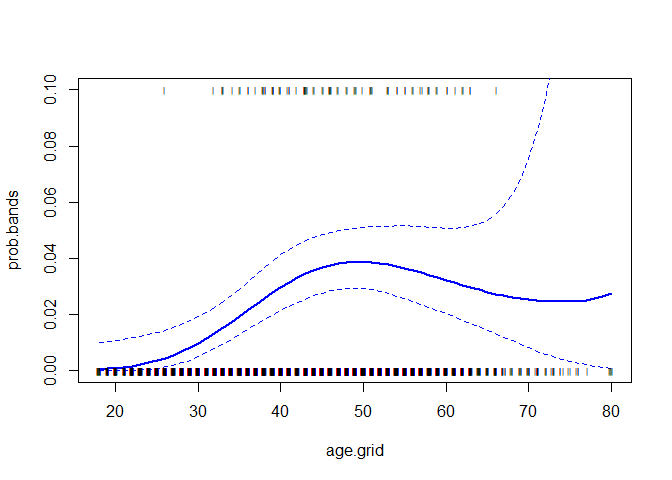
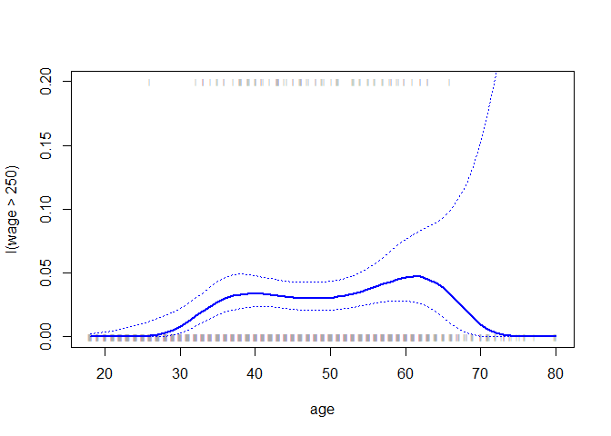
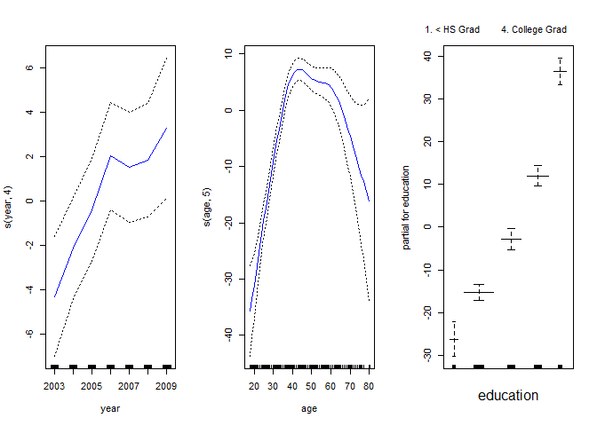
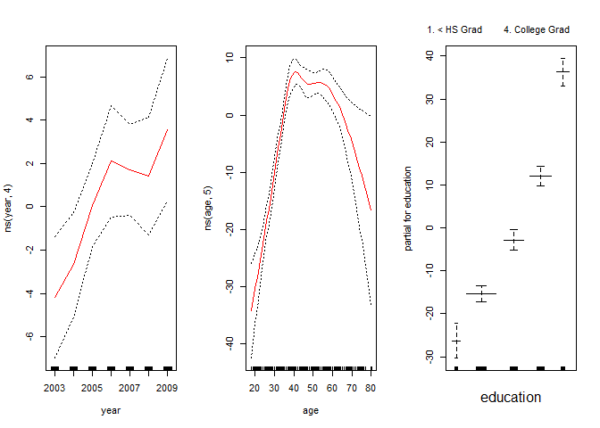
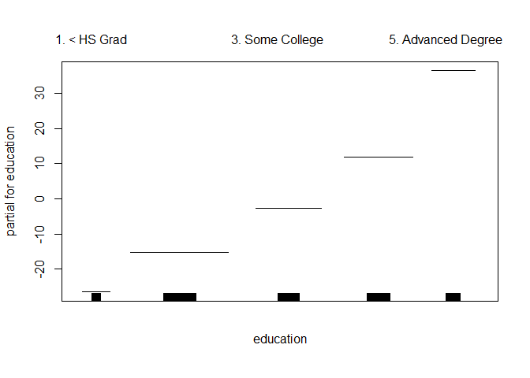
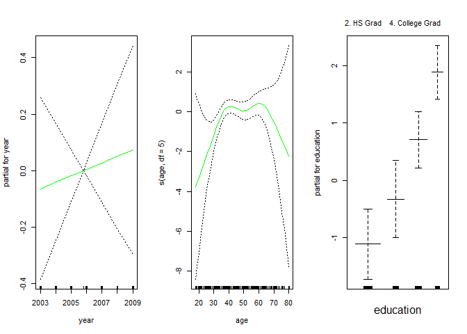
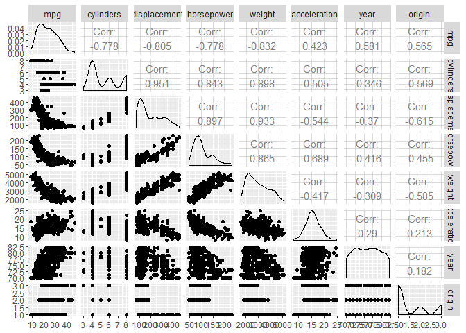
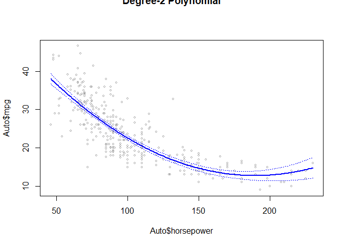

# Chapter 7 Lab: Non-linear Modeling


```r
library(ISLR)
attach(Wage)
```

# Polynomial Regression and Step Functions


```r
fit=lm(wage~poly(age,4),data=Wage)
summary(fit)
```

```
## 
## Call:
## lm(formula = wage ~ poly(age, 4), data = Wage)
## 
## Residuals:
##     Min      1Q  Median      3Q     Max 
## -98.707 -24.626  -4.993  15.217 203.693 
## 
## Coefficients:
##                Estimate Std. Error t value Pr(>|t|)    
## (Intercept)    111.7036     0.7287 153.283  < 2e-16 ***
## poly(age, 4)1  447.0679    39.9148  11.201  < 2e-16 ***
## poly(age, 4)2 -478.3158    39.9148 -11.983  < 2e-16 ***
## poly(age, 4)3  125.5217    39.9148   3.145  0.00168 ** 
## poly(age, 4)4  -77.9112    39.9148  -1.952  0.05104 .  
## ---
## Signif. codes:  0 '***' 0.001 '**' 0.01 '*' 0.05 '.' 0.1 ' ' 1
## 
## Residual standard error: 39.91 on 2995 degrees of freedom
## Multiple R-squared:  0.08626,	Adjusted R-squared:  0.08504 
## F-statistic: 70.69 on 4 and 2995 DF,  p-value: < 2.2e-16
```

```r
coef(summary(fit))
```

```
##                 Estimate Std. Error    t value     Pr(>|t|)
## (Intercept)    111.70361  0.7287409 153.283015 0.000000e+00
## poly(age, 4)1  447.06785 39.9147851  11.200558 1.484604e-28
## poly(age, 4)2 -478.31581 39.9147851 -11.983424 2.355831e-32
## poly(age, 4)3  125.52169 39.9147851   3.144742 1.678622e-03
## poly(age, 4)4  -77.91118 39.9147851  -1.951938 5.103865e-02
```


```r
fit2=lm(wage~poly(age,4,raw=T),data=Wage)
coef(summary(fit2))
```

```
##                             Estimate   Std. Error   t value     Pr(>|t|)
## (Intercept)            -1.841542e+02 6.004038e+01 -3.067172 0.0021802539
## poly(age, 4, raw = T)1  2.124552e+01 5.886748e+00  3.609042 0.0003123618
## poly(age, 4, raw = T)2 -5.638593e-01 2.061083e-01 -2.735743 0.0062606446
## poly(age, 4, raw = T)3  6.810688e-03 3.065931e-03  2.221409 0.0263977518
## poly(age, 4, raw = T)4 -3.203830e-05 1.641359e-05 -1.951938 0.0510386498
```

```r
fit2a=lm(wage~age+I(age^2)+I(age^3)+I(age^4),data=Wage)
summary(fit2a)
```

```
## 
## Call:
## lm(formula = wage ~ age + I(age^2) + I(age^3) + I(age^4), data = Wage)
## 
## Residuals:
##     Min      1Q  Median      3Q     Max 
## -98.707 -24.626  -4.993  15.217 203.693 
## 
## Coefficients:
##               Estimate Std. Error t value Pr(>|t|)    
## (Intercept) -1.842e+02  6.004e+01  -3.067 0.002180 ** 
## age          2.125e+01  5.887e+00   3.609 0.000312 ***
## I(age^2)    -5.639e-01  2.061e-01  -2.736 0.006261 ** 
## I(age^3)     6.811e-03  3.066e-03   2.221 0.026398 *  
## I(age^4)    -3.204e-05  1.641e-05  -1.952 0.051039 .  
## ---
## Signif. codes:  0 '***' 0.001 '**' 0.01 '*' 0.05 '.' 0.1 ' ' 1
## 
## Residual standard error: 39.91 on 2995 degrees of freedom
## Multiple R-squared:  0.08626,	Adjusted R-squared:  0.08504 
## F-statistic: 70.69 on 4 and 2995 DF,  p-value: < 2.2e-16
```

```r
coef(fit2a)
```

```
##   (Intercept)           age      I(age^2)      I(age^3)      I(age^4) 
## -1.841542e+02  2.124552e+01 -5.638593e-01  6.810688e-03 -3.203830e-05
```

```r
plot(fitted(fit2),fitted(fit2a))
```

<!-- -->

```r
fit2b=lm(wage~cbind(age,age^2,age^3,age^4),data=Wage)
summary(fit2b)
```

```
## 
## Call:
## lm(formula = wage ~ cbind(age, age^2, age^3, age^4), data = Wage)
## 
## Residuals:
##     Min      1Q  Median      3Q     Max 
## -98.707 -24.626  -4.993  15.217 203.693 
## 
## Coefficients:
##                                      Estimate Std. Error t value Pr(>|t|)
## (Intercept)                        -1.842e+02  6.004e+01  -3.067 0.002180
## cbind(age, age^2, age^3, age^4)age  2.125e+01  5.887e+00   3.609 0.000312
## cbind(age, age^2, age^3, age^4)    -5.639e-01  2.061e-01  -2.736 0.006261
## cbind(age, age^2, age^3, age^4)     6.811e-03  3.066e-03   2.221 0.026398
## cbind(age, age^2, age^3, age^4)    -3.204e-05  1.641e-05  -1.952 0.051039
##                                       
## (Intercept)                        ** 
## cbind(age, age^2, age^3, age^4)age ***
## cbind(age, age^2, age^3, age^4)    ** 
## cbind(age, age^2, age^3, age^4)    *  
## cbind(age, age^2, age^3, age^4)    .  
## ---
## Signif. codes:  0 '***' 0.001 '**' 0.01 '*' 0.05 '.' 0.1 ' ' 1
## 
## Residual standard error: 39.91 on 2995 degrees of freedom
## Multiple R-squared:  0.08626,	Adjusted R-squared:  0.08504 
## F-statistic: 70.69 on 4 and 2995 DF,  p-value: < 2.2e-16
```


```r
agelims=range(age)
age.grid=seq(from=agelims[1],to=agelims[2]) #min to  max (add 1 each time)
preds=predict(fit,newdata=list(age=age.grid),se=TRUE)# add SE
se.bands=cbind(preds$fit+2*preds$se.fit,preds$fit-2*preds$se.fit)

#par(mfrow=c(1,2),mar=c(4.5,4.5,1,1),oma=c(0,0,4,0))
plot(age,wage,xlim=agelims,cex=.5,col="darkgrey")
title("Degree-4 Polynomial",outer=T)
lines(age.grid,preds$fit,lwd=2,col="blue")
matlines(age.grid,se.bands,lwd=1,col="blue",lty=3)
```

<!-- -->

```r
preds2=predict(fit2,newdata=list(age=age.grid),se=TRUE)
max(abs(preds$fit-preds2$fit))
```

```
## [1] 7.81597e-11
```


```r
fit.1=lm(wage~age,data=Wage)
fit.2=lm(wage~poly(age,2),data=Wage)
fit.3=lm(wage~poly(age,3),data=Wage)
fit.4=lm(wage~poly(age,4),data=Wage)
fit.5=lm(wage~poly(age,5),data=Wage)
anova(fit.1,fit.2,fit.3,fit.4,fit.5)
```

```
## Analysis of Variance Table
## 
## Model 1: wage ~ age
## Model 2: wage ~ poly(age, 2)
## Model 3: wage ~ poly(age, 3)
## Model 4: wage ~ poly(age, 4)
## Model 5: wage ~ poly(age, 5)
##   Res.Df     RSS Df Sum of Sq        F    Pr(>F)    
## 1   2998 5022216                                    
## 2   2997 4793430  1    228786 143.5931 < 2.2e-16 ***
## 3   2996 4777674  1     15756   9.8888  0.001679 ** 
## 4   2995 4771604  1      6070   3.8098  0.051046 .  
## 5   2994 4770322  1      1283   0.8050  0.369682    
## ---
## Signif. codes:  0 '***' 0.001 '**' 0.01 '*' 0.05 '.' 0.1 ' ' 1
```

```r
coef(summary(fit.5))
```

```
##                 Estimate Std. Error     t value     Pr(>|t|)
## (Intercept)    111.70361  0.7287647 153.2780243 0.000000e+00
## poly(age, 5)1  447.06785 39.9160847  11.2001930 1.491111e-28
## poly(age, 5)2 -478.31581 39.9160847 -11.9830341 2.367734e-32
## poly(age, 5)3  125.52169 39.9160847   3.1446392 1.679213e-03
## poly(age, 5)4  -77.91118 39.9160847  -1.9518743 5.104623e-02
## poly(age, 5)5  -35.81289 39.9160847  -0.8972045 3.696820e-01
```

```r
(-11.983)^2
```

```
## [1] 143.5923
```

```r
fit.1=lm(wage~education+age,data=Wage)
fit.2=lm(wage~education+poly(age,2),data=Wage)
fit.3=lm(wage~education+poly(age,3),data=Wage)
anova(fit.1,fit.2,fit.3)
```

```
## Analysis of Variance Table
## 
## Model 1: wage ~ education + age
## Model 2: wage ~ education + poly(age, 2)
## Model 3: wage ~ education + poly(age, 3)
##   Res.Df     RSS Df Sum of Sq        F Pr(>F)    
## 1   2994 3867992                                 
## 2   2993 3725395  1    142597 114.6969 <2e-16 ***
## 3   2992 3719809  1      5587   4.4936 0.0341 *  
## ---
## Signif. codes:  0 '***' 0.001 '**' 0.01 '*' 0.05 '.' 0.1 ' ' 1
```


```r
#lab from video
fit=glm(I(wage>250)~poly(age,3),data=Wage,family=binomial)
summary(fit)
```

```
## 
## Call:
## glm(formula = I(wage > 250) ~ poly(age, 3), family = binomial, 
##     data = Wage)
## 
## Deviance Residuals: 
##     Min       1Q   Median       3Q      Max  
## -0.2808  -0.2736  -0.2487  -0.1758   3.2868  
## 
## Coefficients:
##               Estimate Std. Error z value Pr(>|z|)    
## (Intercept)    -3.8486     0.1597 -24.100  < 2e-16 ***
## poly(age, 3)1  37.8846    11.4818   3.300 0.000968 ***
## poly(age, 3)2 -29.5129    10.5626  -2.794 0.005205 ** 
## poly(age, 3)3   9.7966     8.9990   1.089 0.276317    
## ---
## Signif. codes:  0 '***' 0.001 '**' 0.01 '*' 0.05 '.' 0.1 ' ' 1
## 
## (Dispersion parameter for binomial family taken to be 1)
## 
##     Null deviance: 730.53  on 2999  degrees of freedom
## Residual deviance: 707.92  on 2996  degrees of freedom
## AIC: 715.92
## 
## Number of Fisher Scoring iterations: 8
```

```r
preds=predict(fit,newdata=list(age=age.grid),se=T)
se.bands = preds$fit + cbind(fit=0, lower=-2*preds$se, upper=2*preds$se)
se.bands[1:5,]
```

```
##         fit      lower     upper
## 1 -7.664756 -10.759826 -4.569686
## 2 -7.324776 -10.106699 -4.542852
## 3 -7.001732  -9.492821 -4.510643
## 4 -6.695229  -8.917158 -4.473300
## 5 -6.404868  -8.378691 -4.431045
```

$$p=\frac{e^eta}{1+e^eta}.$$


```r
#lab from video
prob.bands=exp(se.bands)/(1+exp(se.bands))
matplot(age.grid, prob.bands, col = "blue", lwd = c(2,1,1),lty = c(1,2,2),type = "l",ylim = c(0,.1))
points(jitter(age),I(wage>250)/10,pch="|",cex=.5)
```

<!-- -->


```r
fit=glm(I(wage>250)~poly(age,4),data=Wage,family=binomial)
preds=predict(fit,newdata=list(age=age.grid),se=T)

pfit=exp(preds$fit)/(1+exp(preds$fit))
se.bands.logit = cbind(preds$fit+2*preds$se.fit, preds$fit-2*preds$se.fit)
se.bands = exp(se.bands.logit)/(1+exp(se.bands.logit))

preds=predict(fit,newdata=list(age=age.grid),type="response",se=T)

plot(age,I(wage>250),xlim=agelims,type="n",ylim=c(0,.2))
points(jitter(age), I((wage>250)/5),cex=.5,pch="|",col="darkgrey")
lines(age.grid,pfit,lwd=2, col="blue")
matlines(age.grid,se.bands,lwd=1,col="blue",lty=3)
```

<!-- -->

```r
table(cut(age,4))
```

```
## 
## (17.9,33.5]   (33.5,49]   (49,64.5] (64.5,80.1] 
##         750        1399         779          72
```

```r
fit=lm(wage~cut(age,4),data=Wage)
coef(summary(fit))
```

```
##                         Estimate Std. Error   t value     Pr(>|t|)
## (Intercept)            94.158392   1.476069 63.789970 0.000000e+00
## cut(age, 4)(33.5,49]   24.053491   1.829431 13.148074 1.982315e-38
## cut(age, 4)(49,64.5]   23.664559   2.067958 11.443444 1.040750e-29
## cut(age, 4)(64.5,80.1]  7.640592   4.987424  1.531972 1.256350e-01
```

# Splines


```r
library(splines)
fit=lm(wage~bs(age,knots=c(25,40,60)),data=Wage)
pred=predict(fit,newdata=list(age=age.grid),se=T)
summary(fit)
```

```
## 
## Call:
## lm(formula = wage ~ bs(age, knots = c(25, 40, 60)), data = Wage)
## 
## Residuals:
##     Min      1Q  Median      3Q     Max 
## -98.832 -24.537  -5.049  15.209 203.207 
## 
## Coefficients:
##                                 Estimate Std. Error t value Pr(>|t|)    
## (Intercept)                       60.494      9.460   6.394 1.86e-10 ***
## bs(age, knots = c(25, 40, 60))1    3.980     12.538   0.317 0.750899    
## bs(age, knots = c(25, 40, 60))2   44.631      9.626   4.636 3.70e-06 ***
## bs(age, knots = c(25, 40, 60))3   62.839     10.755   5.843 5.69e-09 ***
## bs(age, knots = c(25, 40, 60))4   55.991     10.706   5.230 1.81e-07 ***
## bs(age, knots = c(25, 40, 60))5   50.688     14.402   3.520 0.000439 ***
## bs(age, knots = c(25, 40, 60))6   16.606     19.126   0.868 0.385338    
## ---
## Signif. codes:  0 '***' 0.001 '**' 0.01 '*' 0.05 '.' 0.1 ' ' 1
## 
## Residual standard error: 39.92 on 2993 degrees of freedom
## Multiple R-squared:  0.08642,	Adjusted R-squared:  0.08459 
## F-statistic: 47.19 on 6 and 2993 DF,  p-value: < 2.2e-16
```

```r
plot(age,wage,col="gray")

lines(age.grid,pred$fit,lwd=2)
#abline(v=c(25,40,60),lty=2,col="darkgreen")
lines(age.grid,pred$fit+2*pred$se,lty="dashed")
lines(age.grid,pred$fit-2*pred$se,lty="dashed")


dim(bs(age,knots=c(25,40,60)))
```

```
## [1] 3000    6
```

```r
dim(bs(age,df=6))
```

```
## [1] 3000    6
```

```r
attr(bs(age,df=6),"knots")
```

```
##   25%   50%   75% 
## 33.75 42.00 51.00
```

```r
fit2=lm(wage~ns(age,df=4),data=Wage)
pred2=predict(fit2,newdata=list(age=age.grid),se=T)
lines(age.grid, pred2$fit,col="red",lwd=2)
```

<!-- -->

```r
# Smooth Splines

plot(age,wage,xlim=agelims,cex=.5,col="darkgrey")
title("Smoothing Spline")
fit=smooth.spline(age,wage,df=16)
fit2=smooth.spline(age,wage,cv=TRUE)
```

```
## Warning in smooth.spline(age, wage, cv = TRUE): cross-validation with non-
## unique 'x' values seems doubtful
```

```r
fit2$df
```

```
## [1] 6.794596
```

```r
lines(fit,col="red",lwd=2)
lines(fit2,col="blue",lwd=2)
legend("topright",legend=c("16 DF","6.8 DF"),col=c("red","blue"),lty=1,lwd=2,cex=.8)
```

<!-- -->

```r
plot(age,wage,xlim=agelims,cex=.5,col="darkgrey")
title("Local Regression")
fit=loess(wage~age,span=.2,data=Wage)
fit2=loess(wage~age,span=.5,data=Wage)
lines(age.grid,predict(fit,data.frame(age=age.grid)),col="red",lwd=2)
lines(age.grid,predict(fit2,data.frame(age=age.grid)),col="blue",lwd=2)
legend("topright",legend=c("Span=0.2","Span=0.5"),col=c("red","blue"),lty=1,lwd=2,cex=.8)
```

<!-- -->

# GAMs


```r
library(mgcv)
```

```
## Loading required package: nlme
```

```
## This is mgcv 1.8-23. For overview type 'help("mgcv-package")'.
```

```r
library(gam)
```

```
## Loading required package: foreach
```

```
## Loaded gam 1.15
```

```
## 
## Attaching package: 'gam'
```

```
## The following objects are masked from 'package:mgcv':
## 
##     gam, gam.control, gam.fit, s
```

```r
summary(Wage)
```

```
##       year           age                     maritl           race     
##  Min.   :2003   Min.   :18.00   1. Never Married: 648   1. White:2480  
##  1st Qu.:2004   1st Qu.:33.75   2. Married      :2074   2. Black: 293  
##  Median :2006   Median :42.00   3. Widowed      :  19   3. Asian: 190  
##  Mean   :2006   Mean   :42.41   4. Divorced     : 204   4. Other:  37  
##  3rd Qu.:2008   3rd Qu.:51.00   5. Separated    :  55                  
##  Max.   :2009   Max.   :80.00                                          
##                                                                        
##               education                     region    
##  1. < HS Grad      :268   2. Middle Atlantic   :3000  
##  2. HS Grad        :971   1. New England       :   0  
##  3. Some College   :650   3. East North Central:   0  
##  4. College Grad   :685   4. West North Central:   0  
##  5. Advanced Degree:426   5. South Atlantic    :   0  
##                           6. East South Central:   0  
##                           (Other)              :   0  
##            jobclass               health      health_ins      logwage     
##  1. Industrial :1544   1. <=Good     : 858   1. Yes:2083   Min.   :3.000  
##  2. Information:1456   2. >=Very Good:2142   2. No : 917   1st Qu.:4.447  
##                                                            Median :4.653  
##                                                            Mean   :4.654  
##                                                            3rd Qu.:4.857  
##                                                            Max.   :5.763  
##                                                                           
##       wage       
##  Min.   : 20.09  
##  1st Qu.: 85.38  
##  Median :104.92  
##  Mean   :111.70  
##  3rd Qu.:128.68  
##  Max.   :318.34  
## 
```

```r
gam1<-lm(wage~ns(year,4)+ns(age,5)+education,data=Wage)
gam.m3<-gam(wage~s(year,4)+s(age,5)+education,data=Wage)

#?s
par(mfrow=c(1,3))
plot(gam.m3,se=TRUE,col="blue")
```

<!-- -->

```r
plot.Gam(gam1, se=TRUE, col="red")
```

<!-- -->

```r
gam.m1=gam(wage~s(age,5)+education,data=Wage)
gam.m2=gam(wage~year+s(age,5)+education,data=Wage)
anova(gam.m1,gam.m2,gam.m3,test="F")
```

```
## Analysis of Deviance Table
## 
## Model 1: wage ~ s(age, 5) + education
## Model 2: wage ~ year + s(age, 5) + education
## Model 3: wage ~ s(year, 4) + s(age, 5) + education
##   Resid. Df Resid. Dev Df Deviance       F    Pr(>F)    
## 1      2990    3711731                                  
## 2      2989    3693842  1  17889.2 14.4771 0.0001447 ***
## 3      2986    3689770  3   4071.1  1.0982 0.3485661    
## ---
## Signif. codes:  0 '***' 0.001 '**' 0.01 '*' 0.05 '.' 0.1 ' ' 1
```

```r
summary(gam.m3)
```

```
## 
## Call: gam(formula = wage ~ s(year, 4) + s(age, 5) + education, data = Wage)
## Deviance Residuals:
##     Min      1Q  Median      3Q     Max 
## -119.43  -19.70   -3.33   14.17  213.48 
## 
## (Dispersion Parameter for gaussian family taken to be 1235.69)
## 
##     Null Deviance: 5222086 on 2999 degrees of freedom
## Residual Deviance: 3689770 on 2986 degrees of freedom
## AIC: 29887.75 
## 
## Number of Local Scoring Iterations: 2 
## 
## Anova for Parametric Effects
##              Df  Sum Sq Mean Sq F value    Pr(>F)    
## s(year, 4)    1   27162   27162  21.981 2.877e-06 ***
## s(age, 5)     1  195338  195338 158.081 < 2.2e-16 ***
## education     4 1069726  267432 216.423 < 2.2e-16 ***
## Residuals  2986 3689770    1236                      
## ---
## Signif. codes:  0 '***' 0.001 '**' 0.01 '*' 0.05 '.' 0.1 ' ' 1
## 
## Anova for Nonparametric Effects
##             Npar Df Npar F  Pr(F)    
## (Intercept)                          
## s(year, 4)        3  1.086 0.3537    
## s(age, 5)         4 32.380 <2e-16 ***
## education                            
## ---
## Signif. codes:  0 '***' 0.001 '**' 0.01 '*' 0.05 '.' 0.1 ' ' 1
```

```r
preds=predict(gam.m2,newdata=Wage)

#local 

gam.lo=gam(wage~s(year,df=4)+lo(age,span=0.7)+education,data=Wage)
plot.Gam(gam.lo, se=TRUE, col="green")
```

<!-- -->

```r
gam.lo.i=gam(wage~lo(year,age,span=0.5)+education,data=Wage)
```

```
## Warning in lo.wam(x, z, wz, fit$smooth, which, fit$smooth.frame,
## bf.maxit, : liv too small. (Discovered by lowesd)
```

```
## Warning in lo.wam(x, z, wz, fit$smooth, which, fit$smooth.frame,
## bf.maxit, : lv too small. (Discovered by lowesd)
```

```
## Warning in lo.wam(x, z, wz, fit$smooth, which, fit$smooth.frame,
## bf.maxit, : liv too small. (Discovered by lowesd)
```

```
## Warning in lo.wam(x, z, wz, fit$smooth, which, fit$smooth.frame,
## bf.maxit, : lv too small. (Discovered by lowesd)
```

```r
library(akima)
par(mfrow=c(1,1))
plot(gam.lo.i)
```

<!-- --><!-- -->

```r
gam.lr=gam(I(wage>250)~year+s(age,df=5)+education,family=binomial,data=Wage)
par(mfrow=c(1,3))
plot(gam.lr,se=T,col="green")
```

<!-- -->

```r
table(education,I(wage>250))
```

```
##                     
## education            FALSE TRUE
##   1. < HS Grad         268    0
##   2. HS Grad           966    5
##   3. Some College      643    7
##   4. College Grad      663   22
##   5. Advanced Degree   381   45
```

```r
gam.lr.s=gam(I(wage>250)~year+s(age,df=5)+education,family=binomial,data=Wage,subset=(education!="1. < HS Grad"))
plot(gam.lr.s,se=T,col="green")
```

<!-- -->


----------------------------------------------------------------------------------

# 7. The Wage data set contains a number of other features not explored in this chapter, such as marital status (maritl), job class (jobclass), and others. Explore the relationships between some of these other predictors and wage, and use non-linear fitting techniques in order to fit flexible models to the data. Create plots of the results obtained, and write a summary of your findings.


```r
summary(Wage)
```

```
##       year           age                     maritl           race     
##  Min.   :2003   Min.   :18.00   1. Never Married: 648   1. White:2480  
##  1st Qu.:2004   1st Qu.:33.75   2. Married      :2074   2. Black: 293  
##  Median :2006   Median :42.00   3. Widowed      :  19   3. Asian: 190  
##  Mean   :2006   Mean   :42.41   4. Divorced     : 204   4. Other:  37  
##  3rd Qu.:2008   3rd Qu.:51.00   5. Separated    :  55                  
##  Max.   :2009   Max.   :80.00                                          
##                                                                        
##               education                     region    
##  1. < HS Grad      :268   2. Middle Atlantic   :3000  
##  2. HS Grad        :971   1. New England       :   0  
##  3. Some College   :650   3. East North Central:   0  
##  4. College Grad   :685   4. West North Central:   0  
##  5. Advanced Degree:426   5. South Atlantic    :   0  
##                           6. East South Central:   0  
##                           (Other)              :   0  
##            jobclass               health      health_ins      logwage     
##  1. Industrial :1544   1. <=Good     : 858   1. Yes:2083   Min.   :3.000  
##  2. Information:1456   2. >=Very Good:2142   2. No : 917   1st Qu.:4.447  
##                                                            Median :4.653  
##                                                            Mean   :4.654  
##                                                            3rd Qu.:4.857  
##                                                            Max.   :5.763  
##                                                                           
##       wage       
##  Min.   : 20.09  
##  1st Qu.: 85.38  
##  Median :104.92  
##  Mean   :111.70  
##  3rd Qu.:128.68  
##  Max.   :318.34  
## 
```

```r
library(ggplot2)
library(GGally)
ggpairs(Wage)
```

```
## `stat_bin()` using `bins = 30`. Pick better value with `binwidth`.
## `stat_bin()` using `bins = 30`. Pick better value with `binwidth`.
## `stat_bin()` using `bins = 30`. Pick better value with `binwidth`.
## `stat_bin()` using `bins = 30`. Pick better value with `binwidth`.
## `stat_bin()` using `bins = 30`. Pick better value with `binwidth`.
## `stat_bin()` using `bins = 30`. Pick better value with `binwidth`.
## `stat_bin()` using `bins = 30`. Pick better value with `binwidth`.
## `stat_bin()` using `bins = 30`. Pick better value with `binwidth`.
## `stat_bin()` using `bins = 30`. Pick better value with `binwidth`.
## `stat_bin()` using `bins = 30`. Pick better value with `binwidth`.
## `stat_bin()` using `bins = 30`. Pick better value with `binwidth`.
## `stat_bin()` using `bins = 30`. Pick better value with `binwidth`.
## `stat_bin()` using `bins = 30`. Pick better value with `binwidth`.
## `stat_bin()` using `bins = 30`. Pick better value with `binwidth`.
## `stat_bin()` using `bins = 30`. Pick better value with `binwidth`.
## `stat_bin()` using `bins = 30`. Pick better value with `binwidth`.
## `stat_bin()` using `bins = 30`. Pick better value with `binwidth`.
## `stat_bin()` using `bins = 30`. Pick better value with `binwidth`.
## `stat_bin()` using `bins = 30`. Pick better value with `binwidth`.
## `stat_bin()` using `bins = 30`. Pick better value with `binwidth`.
## `stat_bin()` using `bins = 30`. Pick better value with `binwidth`.
## `stat_bin()` using `bins = 30`. Pick better value with `binwidth`.
## `stat_bin()` using `bins = 30`. Pick better value with `binwidth`.
## `stat_bin()` using `bins = 30`. Pick better value with `binwidth`.
## `stat_bin()` using `bins = 30`. Pick better value with `binwidth`.
## `stat_bin()` using `bins = 30`. Pick better value with `binwidth`.
## `stat_bin()` using `bins = 30`. Pick better value with `binwidth`.
## `stat_bin()` using `bins = 30`. Pick better value with `binwidth`.
```

<!-- -->


```r
fit.a=lm(wage~maritl,data=Wage)
fit.b=lm(wage~maritl+race,data=Wage)
fit.c=lm(wage~maritl+race+education,data=Wage)
fit.d=lm(wage~maritl+race+education+poly(age, 4),data=Wage)
anova(fit.a,fit.b,fit.c,fit.d)
```

```
## Analysis of Variance Table
## 
## Model 1: wage ~ maritl
## Model 2: wage ~ maritl + race
## Model 3: wage ~ maritl + race + education
## Model 4: wage ~ maritl + race + education + poly(age, 4)
##   Res.Df     RSS Df Sum of Sq        F    Pr(>F)    
## 1   2995 4858941                                    
## 2   2992 4822776  3     36165   9.9442 1.604e-06 ***
## 3   2988 3729846  4   1092930 225.3888 < 2.2e-16 ***
## 4   2984 3617421  4    112425  23.1848 < 2.2e-16 ***
## ---
## Signif. codes:  0 '***' 0.001 '**' 0.01 '*' 0.05 '.' 0.1 ' ' 1
```

```r
summary(fit.d)
```

```
## 
## Call:
## lm(formula = wage ~ maritl + race + education + poly(age, 4), 
##     data = Wage)
## 
## Residuals:
##      Min       1Q   Median       3Q      Max 
## -116.772  -19.432   -3.044   14.594  215.622 
## 
## Coefficients:
##                              Estimate Std. Error t value Pr(>|t|)    
## (Intercept)                   77.1645     2.6422  29.205  < 2e-16 ***
## maritl2. Married              13.3786     1.8656   7.171 9.33e-13 ***
## maritl3. Widowed              -0.3139     8.2050  -0.038   0.9695    
## maritl4. Divorced             -0.2209     3.0198  -0.073   0.9417    
## maritl5. Separated             7.4455     5.0039   1.488   0.1369    
## race2. Black                  -4.0739     2.1839  -1.865   0.0622 .  
## race3. Asian                  -4.0023     2.6654  -1.502   0.1333    
## race4. Other                  -7.0979     5.8012  -1.224   0.2212    
## education2. HS Grad           10.6773     2.4151   4.421 1.02e-05 ***
## education3. Some College      23.3626     2.5457   9.177  < 2e-16 ***
## education4. College Grad      37.6612     2.5382  14.838  < 2e-16 ***
## education5. Advanced Degree   61.9177     2.7620  22.417  < 2e-16 ***
## poly(age, 4)1                255.7806    39.9108   6.409 1.70e-10 ***
## poly(age, 4)2               -296.8379    36.9178  -8.040 1.28e-15 ***
## poly(age, 4)3                 40.6294    35.3124   1.151   0.2500    
## poly(age, 4)4                  4.4368    35.0090   0.127   0.8992    
## ---
## Signif. codes:  0 '***' 0.001 '**' 0.01 '*' 0.05 '.' 0.1 ' ' 1
## 
## Residual standard error: 34.82 on 2984 degrees of freedom
## Multiple R-squared:  0.3073,	Adjusted R-squared:  0.3038 
## F-statistic: 88.25 on 15 and 2984 DF,  p-value: < 2.2e-16
```


# 8. Fit some of the non-linear models investigated in this chapter to the Auto data set. Is there evidence for non-linear relationships in this data set? Create some informative plots to justify your answer.


```r
summary(Auto)
```

```
##       mpg          cylinders      displacement     horsepower   
##  Min.   : 9.00   Min.   :3.000   Min.   : 68.0   Min.   : 46.0  
##  1st Qu.:17.00   1st Qu.:4.000   1st Qu.:105.0   1st Qu.: 75.0  
##  Median :22.75   Median :4.000   Median :151.0   Median : 93.5  
##  Mean   :23.45   Mean   :5.472   Mean   :194.4   Mean   :104.5  
##  3rd Qu.:29.00   3rd Qu.:8.000   3rd Qu.:275.8   3rd Qu.:126.0  
##  Max.   :46.60   Max.   :8.000   Max.   :455.0   Max.   :230.0  
##                                                                 
##      weight      acceleration        year           origin     
##  Min.   :1613   Min.   : 8.00   Min.   :70.00   Min.   :1.000  
##  1st Qu.:2225   1st Qu.:13.78   1st Qu.:73.00   1st Qu.:1.000  
##  Median :2804   Median :15.50   Median :76.00   Median :1.000  
##  Mean   :2978   Mean   :15.54   Mean   :75.98   Mean   :1.577  
##  3rd Qu.:3615   3rd Qu.:17.02   3rd Qu.:79.00   3rd Qu.:2.000  
##  Max.   :5140   Max.   :24.80   Max.   :82.00   Max.   :3.000  
##                                                                
##                  name    
##  amc matador       :  5  
##  ford pinto        :  5  
##  toyota corolla    :  5  
##  amc gremlin       :  4  
##  amc hornet        :  4  
##  chevrolet chevette:  4  
##  (Other)           :365
```

```r
library(ggplot2)
library(GGally)
ggpairs(Auto[-9])
```

<!-- -->


```r
fit.1=lm(mpg~poly(displacement,4),data=Auto)
summary(fit.1)
```

```
## 
## Call:
## lm(formula = mpg ~ poly(displacement, 4), data = Auto)
## 
## Residuals:
##      Min       1Q   Median       3Q      Max 
## -15.7755  -2.3666  -0.2723   2.1005  20.4053 
## 
## Coefficients:
##                         Estimate Std. Error t value Pr(>|t|)    
## (Intercept)              23.4459     0.2207 106.217  < 2e-16 ***
## poly(displacement, 4)1 -124.2585     4.3704 -28.432  < 2e-16 ***
## poly(displacement, 4)2   31.0895     4.3704   7.114  5.5e-12 ***
## poly(displacement, 4)3   -4.4655     4.3704  -1.022    0.308    
## poly(displacement, 4)4    0.7747     4.3704   0.177    0.859    
## ---
## Signif. codes:  0 '***' 0.001 '**' 0.01 '*' 0.05 '.' 0.1 ' ' 1
## 
## Residual standard error: 4.37 on 387 degrees of freedom
## Multiple R-squared:  0.6897,	Adjusted R-squared:  0.6865 
## F-statistic:   215 on 4 and 387 DF,  p-value: < 2.2e-16
```

```r
fit.1=lm(mpg~poly(displacement,2),data=Auto)
summary(fit.1)
```

```
## 
## Call:
## lm(formula = mpg ~ poly(displacement, 2), data = Auto)
## 
## Residuals:
##      Min       1Q   Median       3Q      Max 
## -15.2165  -2.2404  -0.2508   2.1094  20.5158 
## 
## Coefficients:
##                         Estimate Std. Error t value Pr(>|t|)    
## (Intercept)              23.4459     0.2205 106.343  < 2e-16 ***
## poly(displacement, 2)1 -124.2585     4.3652 -28.466  < 2e-16 ***
## poly(displacement, 2)2   31.0895     4.3652   7.122 5.17e-12 ***
## ---
## Signif. codes:  0 '***' 0.001 '**' 0.01 '*' 0.05 '.' 0.1 ' ' 1
## 
## Residual standard error: 4.365 on 389 degrees of freedom
## Multiple R-squared:  0.6888,	Adjusted R-squared:  0.6872 
## F-statistic: 430.5 on 2 and 389 DF,  p-value: < 2.2e-16
```

```r
displacementlims=range(Auto$displacement)
displacement.grid=seq(from=displacementlims[1],to=displacementlims[2])
preds=predict(fit.1,newdata=list(displacement=displacement.grid),se=TRUE)
se.bands=cbind(preds$fit+2*preds$se.fit,preds$fit-2*preds$se.fit)
plot(Auto$displacement,Auto$mpg,xlim=displacementlims,cex=.5,col="darkgrey")
title("Degree-2 Polynomial",outer=T)
lines(displacement.grid,preds$fit,lwd=2,col="blue")
matlines(displacement.grid,se.bands,lwd=1,col="blue",lty=3)
```

<!-- -->

```r
fit.2=lm(mpg~poly(horsepower,4),data=Auto)
summary(fit.2)
```

```
## 
## Call:
## lm(formula = mpg ~ poly(horsepower, 4), data = Auto)
## 
## Residuals:
##      Min       1Q   Median       3Q      Max 
## -14.8820  -2.5802  -0.1682   2.2100  16.1434 
## 
## Coefficients:
##                       Estimate Std. Error t value Pr(>|t|)    
## (Intercept)            23.4459     0.2209 106.161   <2e-16 ***
## poly(horsepower, 4)1 -120.1377     4.3727 -27.475   <2e-16 ***
## poly(horsepower, 4)2   44.0895     4.3727  10.083   <2e-16 ***
## poly(horsepower, 4)3   -3.9488     4.3727  -0.903    0.367    
## poly(horsepower, 4)4   -5.1878     4.3727  -1.186    0.236    
## ---
## Signif. codes:  0 '***' 0.001 '**' 0.01 '*' 0.05 '.' 0.1 ' ' 1
## 
## Residual standard error: 4.373 on 387 degrees of freedom
## Multiple R-squared:  0.6893,	Adjusted R-squared:  0.6861 
## F-statistic: 214.7 on 4 and 387 DF,  p-value: < 2.2e-16
```

```r
fit.2=lm(mpg~poly(horsepower,2),data=Auto)
summary(fit.2)
```

```
## 
## Call:
## lm(formula = mpg ~ poly(horsepower, 2), data = Auto)
## 
## Residuals:
##      Min       1Q   Median       3Q      Max 
## -14.7135  -2.5943  -0.0859   2.2868  15.8961 
## 
## Coefficients:
##                       Estimate Std. Error t value Pr(>|t|)    
## (Intercept)            23.4459     0.2209  106.13   <2e-16 ***
## poly(horsepower, 2)1 -120.1377     4.3739  -27.47   <2e-16 ***
## poly(horsepower, 2)2   44.0895     4.3739   10.08   <2e-16 ***
## ---
## Signif. codes:  0 '***' 0.001 '**' 0.01 '*' 0.05 '.' 0.1 ' ' 1
## 
## Residual standard error: 4.374 on 389 degrees of freedom
## Multiple R-squared:  0.6876,	Adjusted R-squared:  0.686 
## F-statistic:   428 on 2 and 389 DF,  p-value: < 2.2e-16
```

```r
horsepowerlims=range(Auto$horsepower)
horsepower.grid=seq(from=horsepowerlims[1],to=horsepowerlims[2])
preds=predict(fit.2,newdata=list(horsepower=horsepower.grid),se=TRUE)
se.bands=cbind(preds$fit+2*preds$se.fit,preds$fit-2*preds$se.fit)
plot(Auto$horsepower,Auto$mpg,xlim=horsepowerlims,cex=.5,col="darkgrey")
title("Degree-2 Polynomial",outer=T)
lines(horsepower.grid,preds$fit,lwd=2,col="blue")
matlines(horsepower.grid,se.bands,lwd=1,col="blue",lty=3)
```

<!-- -->

```r
fit.3=lm(mpg~poly(weight,4),data=Auto)
summary(fit.3)
```

```
## 
## Call:
## lm(formula = mpg ~ poly(weight, 4), data = Auto)
## 
## Residuals:
##      Min       1Q   Median       3Q      Max 
## -12.7233  -2.7179  -0.4254   1.9112  16.1935 
## 
## Coefficients:
##                   Estimate Std. Error t value Pr(>|t|)    
## (Intercept)        23.4459     0.2114 110.930  < 2e-16 ***
## poly(weight, 4)1 -128.4436     4.1847 -30.694  < 2e-16 ***
## poly(weight, 4)2   23.1589     4.1847   5.534 5.77e-08 ***
## poly(weight, 4)3    0.2204     4.1847   0.053    0.958    
## poly(weight, 4)4   -2.8079     4.1847  -0.671    0.503    
## ---
## Signif. codes:  0 '***' 0.001 '**' 0.01 '*' 0.05 '.' 0.1 ' ' 1
## 
## Residual standard error: 4.185 on 387 degrees of freedom
## Multiple R-squared:  0.7155,	Adjusted R-squared:  0.7125 
## F-statistic: 243.3 on 4 and 387 DF,  p-value: < 2.2e-16
```

```r
fit.3=lm(mpg~poly(weight,2),data=Auto)
summary(fit.3)
```

```
## 
## Call:
## lm(formula = mpg ~ poly(weight, 2), data = Auto)
## 
## Residuals:
##      Min       1Q   Median       3Q      Max 
## -12.6246  -2.7134  -0.3485   1.8267  16.0866 
## 
## Coefficients:
##                   Estimate Std. Error t value Pr(>|t|)    
## (Intercept)        23.4459     0.2109 111.151  < 2e-16 ***
## poly(weight, 2)1 -128.4436     4.1763 -30.755  < 2e-16 ***
## poly(weight, 2)2   23.1589     4.1763   5.545 5.43e-08 ***
## ---
## Signif. codes:  0 '***' 0.001 '**' 0.01 '*' 0.05 '.' 0.1 ' ' 1
## 
## Residual standard error: 4.176 on 389 degrees of freedom
## Multiple R-squared:  0.7151,	Adjusted R-squared:  0.7137 
## F-statistic: 488.3 on 2 and 389 DF,  p-value: < 2.2e-16
```

```r
weightlims=range(Auto$weight)
weight.grid=seq(from=weightlims[1],to=weightlims[2])
preds=predict(fit.3,newdata=list(weight=weight.grid),se=TRUE)
se.bands=cbind(preds$fit+2*preds$se.fit,preds$fit-2*preds$se.fit)
plot(Auto$weight,Auto$mpg,xlim=weightlims,cex=.5,col="darkgrey")
title("Degree-2 Polynomial",outer=T)
lines(weight.grid,preds$fit,lwd=2,col="blue")
matlines(weight.grid,se.bands,lwd=1,col="blue",lty=3)
```

<!-- -->

```r
fit.4=lm(mpg~poly(displacement,2)+poly(horsepower,2)+poly(weight,2),data=Auto)
summary(fit.4)
```

```
## 
## Call:
## lm(formula = mpg ~ poly(displacement, 2) + poly(horsepower, 2) + 
##     poly(weight, 2), data = Auto)
## 
## Residuals:
##      Min       1Q   Median       3Q      Max 
## -11.7507  -2.1972  -0.2779   2.0043  15.4606 
## 
## Coefficients:
##                        Estimate Std. Error t value Pr(>|t|)    
## (Intercept)             23.4459     0.1973 118.822  < 2e-16 ***
## poly(displacement, 2)1 -20.1433    12.7914  -1.575  0.11613    
## poly(displacement, 2)2  17.7385     7.5018   2.365  0.01855 *  
## poly(horsepower, 2)1   -59.3958    10.2600  -5.789 1.47e-08 ***
## poly(horsepower, 2)2    15.7790     5.7277   2.755  0.00615 ** 
## poly(weight, 2)1       -53.4821    12.6177  -4.239 2.82e-05 ***
## poly(weight, 2)2         8.1038     5.8596   1.383  0.16747    
## ---
## Signif. codes:  0 '***' 0.001 '**' 0.01 '*' 0.05 '.' 0.1 ' ' 1
## 
## Residual standard error: 3.907 on 385 degrees of freedom
## Multiple R-squared:  0.7533,	Adjusted R-squared:  0.7495 
## F-statistic: 195.9 on 6 and 385 DF,  p-value: < 2.2e-16
```

# 10. This question relates to the College data set.

## (a) Split the data into a training set and a test set. Using out-of-state tuition as the response and the other variables as the predictors, perform forward stepwise selection on the training set in order to identify a satisfactory model that uses just a subset of the predictors.

## (b) Fit a GAM on the training data, using out-of-state tuition as the response and the features selected in the previous step as the predictors. Plot the results, and explain your findings. 

## (c) Evaluate the model obtained on the test set, and explain the results obtained.

## (d) For which variables, if any, is there evidence of a non-linear relationship with the response?
