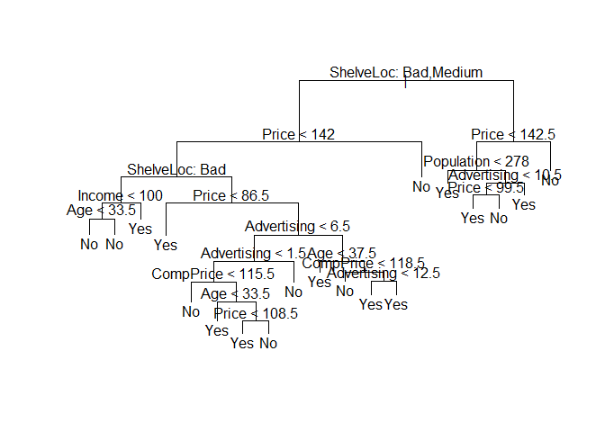
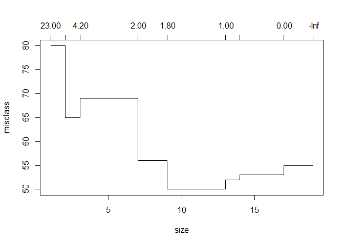
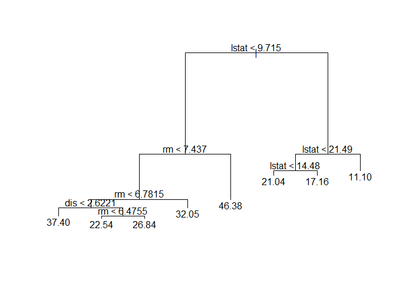
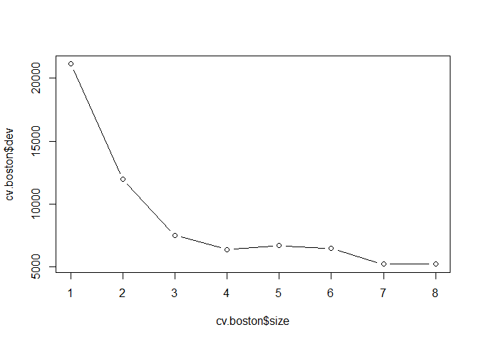

# Chapter 8 Lab: Decision Trees

# Fitting Classification Trees


```r
library(tree)
library(ISLR)
attach(Carseats)
# lab video
hist(Sales)
```

<!-- -->

```r
#
High=ifelse(Sales<=8,"No","Yes")
Carseats=data.frame(Carseats,High)

tree.carseats=tree(High~.-Sales,Carseats)
summary(tree.carseats)
```

```
## 
## Classification tree:
## tree(formula = High ~ . - Sales, data = Carseats)
## Variables actually used in tree construction:
## [1] "ShelveLoc"   "Price"       "Income"      "CompPrice"   "Population" 
## [6] "Advertising" "Age"         "US"         
## Number of terminal nodes:  27 
## Residual mean deviance:  0.4575 = 170.7 / 373 
## Misclassification error rate: 0.09 = 36 / 400
```

```r
plot(tree.carseats);text(tree.carseats,pretty=0)
```

<!-- -->

```r
tree.carseats
```

```
## node), split, n, deviance, yval, (yprob)
##       * denotes terminal node
## 
##   1) root 400 541.500 No ( 0.59000 0.41000 )  
##     2) ShelveLoc: Bad,Medium 315 390.600 No ( 0.68889 0.31111 )  
##       4) Price < 92.5 46  56.530 Yes ( 0.30435 0.69565 )  
##         8) Income < 57 10  12.220 No ( 0.70000 0.30000 )  
##          16) CompPrice < 110.5 5   0.000 No ( 1.00000 0.00000 ) *
##          17) CompPrice > 110.5 5   6.730 Yes ( 0.40000 0.60000 ) *
##         9) Income > 57 36  35.470 Yes ( 0.19444 0.80556 )  
##          18) Population < 207.5 16  21.170 Yes ( 0.37500 0.62500 ) *
##          19) Population > 207.5 20   7.941 Yes ( 0.05000 0.95000 ) *
##       5) Price > 92.5 269 299.800 No ( 0.75465 0.24535 )  
##        10) Advertising < 13.5 224 213.200 No ( 0.81696 0.18304 )  
##          20) CompPrice < 124.5 96  44.890 No ( 0.93750 0.06250 )  
##            40) Price < 106.5 38  33.150 No ( 0.84211 0.15789 )  
##              80) Population < 177 12  16.300 No ( 0.58333 0.41667 )  
##               160) Income < 60.5 6   0.000 No ( 1.00000 0.00000 ) *
##               161) Income > 60.5 6   5.407 Yes ( 0.16667 0.83333 ) *
##              81) Population > 177 26   8.477 No ( 0.96154 0.03846 ) *
##            41) Price > 106.5 58   0.000 No ( 1.00000 0.00000 ) *
##          21) CompPrice > 124.5 128 150.200 No ( 0.72656 0.27344 )  
##            42) Price < 122.5 51  70.680 Yes ( 0.49020 0.50980 )  
##              84) ShelveLoc: Bad 11   6.702 No ( 0.90909 0.09091 ) *
##              85) ShelveLoc: Medium 40  52.930 Yes ( 0.37500 0.62500 )  
##               170) Price < 109.5 16   7.481 Yes ( 0.06250 0.93750 ) *
##               171) Price > 109.5 24  32.600 No ( 0.58333 0.41667 )  
##                 342) Age < 49.5 13  16.050 Yes ( 0.30769 0.69231 ) *
##                 343) Age > 49.5 11   6.702 No ( 0.90909 0.09091 ) *
##            43) Price > 122.5 77  55.540 No ( 0.88312 0.11688 )  
##              86) CompPrice < 147.5 58  17.400 No ( 0.96552 0.03448 ) *
##              87) CompPrice > 147.5 19  25.010 No ( 0.63158 0.36842 )  
##               174) Price < 147 12  16.300 Yes ( 0.41667 0.58333 )  
##                 348) CompPrice < 152.5 7   5.742 Yes ( 0.14286 0.85714 ) *
##                 349) CompPrice > 152.5 5   5.004 No ( 0.80000 0.20000 ) *
##               175) Price > 147 7   0.000 No ( 1.00000 0.00000 ) *
##        11) Advertising > 13.5 45  61.830 Yes ( 0.44444 0.55556 )  
##          22) Age < 54.5 25  25.020 Yes ( 0.20000 0.80000 )  
##            44) CompPrice < 130.5 14  18.250 Yes ( 0.35714 0.64286 )  
##              88) Income < 100 9  12.370 No ( 0.55556 0.44444 ) *
##              89) Income > 100 5   0.000 Yes ( 0.00000 1.00000 ) *
##            45) CompPrice > 130.5 11   0.000 Yes ( 0.00000 1.00000 ) *
##          23) Age > 54.5 20  22.490 No ( 0.75000 0.25000 )  
##            46) CompPrice < 122.5 10   0.000 No ( 1.00000 0.00000 ) *
##            47) CompPrice > 122.5 10  13.860 No ( 0.50000 0.50000 )  
##              94) Price < 125 5   0.000 Yes ( 0.00000 1.00000 ) *
##              95) Price > 125 5   0.000 No ( 1.00000 0.00000 ) *
##     3) ShelveLoc: Good 85  90.330 Yes ( 0.22353 0.77647 )  
##       6) Price < 135 68  49.260 Yes ( 0.11765 0.88235 )  
##        12) US: No 17  22.070 Yes ( 0.35294 0.64706 )  
##          24) Price < 109 8   0.000 Yes ( 0.00000 1.00000 ) *
##          25) Price > 109 9  11.460 No ( 0.66667 0.33333 ) *
##        13) US: Yes 51  16.880 Yes ( 0.03922 0.96078 ) *
##       7) Price > 135 17  22.070 No ( 0.64706 0.35294 )  
##        14) Income < 46 6   0.000 No ( 1.00000 0.00000 ) *
##        15) Income > 46 11  15.160 Yes ( 0.45455 0.54545 ) *
```

```r
set.seed(2)
train=sample(1:nrow(Carseats), 200)
Carseats.test=Carseats[-train,]
High.test=High[-train]
tree.carseats=tree(High~.-Sales,Carseats,subset=train)
#video
plot(tree.carseats);text(tree.carseats,pretty=0)
```

<!-- -->

```r
#

tree.pred=predict(tree.carseats,Carseats.test,type="class")
#video
with(Carseats[-train,],table(tree.pred,High))
```

```
##          High
## tree.pred No Yes
##       No  86  27
##       Yes 30  57
```

```r
#
table(tree.pred,High.test)
```

```
##          High.test
## tree.pred No Yes
##       No  86  27
##       Yes 30  57
```

```r
(86+57)/200
```

```
## [1] 0.715
```

```r
set.seed(3)
cv.carseats=cv.tree(tree.carseats,FUN=prune.misclass)
names(cv.carseats)
```

```
## [1] "size"   "dev"    "k"      "method"
```

```r
cv.carseats
```

```
## $size
## [1] 19 17 14 13  9  7  3  2  1
## 
## $dev
## [1] 55 55 53 52 50 56 69 65 80
## 
## $k
## [1]       -Inf  0.0000000  0.6666667  1.0000000  1.7500000  2.0000000
## [7]  4.2500000  5.0000000 23.0000000
## 
## $method
## [1] "misclass"
## 
## attr(,"class")
## [1] "prune"         "tree.sequence"
```

```r
#video
plot(cv.carseats)
```

<!-- -->

```r
#

par(mfrow=c(1,2))
plot(cv.carseats$size,cv.carseats$dev,type="b")
plot(cv.carseats$k,cv.carseats$dev,type="b")
```

<!-- -->

```r
prune.carseats=prune.misclass(tree.carseats,best=9)
plot(prune.carseats);text(prune.carseats,pretty=0)

#evaluate in test
tree.pred=predict(prune.carseats,Carseats.test,type="class")
table(tree.pred,High.test)
```

```
##          High.test
## tree.pred No Yes
##       No  94  24
##       Yes 22  60
```

```r
(94+60)/200
```

```
## [1] 0.77
```

```r
prune.carseats=prune.misclass(tree.carseats,best=15)
plot(prune.carseats);text(prune.carseats,pretty=0)
```

<!-- -->

```r
tree.pred=predict(prune.carseats,Carseats.test,type="class")
table(tree.pred,High.test)
```

```
##          High.test
## tree.pred No Yes
##       No  86  22
##       Yes 30  62
```

```r
(86+62)/200
```

```
## [1] 0.74
```

# Fitting Regression Trees


```r
library(MASS)
set.seed(1)
train = sample(1:nrow(Boston), nrow(Boston)/2)
tree.boston=tree(medv~.,Boston,subset=train)
summary(tree.boston)
```

```
## 
## Regression tree:
## tree(formula = medv ~ ., data = Boston, subset = train)
## Variables actually used in tree construction:
## [1] "lstat" "rm"    "dis"  
## Number of terminal nodes:  8 
## Residual mean deviance:  12.65 = 3099 / 245 
## Distribution of residuals:
##      Min.   1st Qu.    Median      Mean   3rd Qu.      Max. 
## -14.10000  -2.04200  -0.05357   0.00000   1.96000  12.60000
```

```r
plot(tree.boston);text(tree.boston,pretty=0)
```

<!-- -->

```r
cv.boston=cv.tree(tree.boston)
plot(cv.boston$size,cv.boston$dev,type='b')
```

<!-- -->

```r
prune.boston=prune.tree(tree.boston,best=5)
plot(prune.boston);text(prune.boston,pretty=0)
```

<!-- -->

```r
yhat=predict(tree.boston,newdata=Boston[-train,])
boston.test=Boston[-train,"medv"]
plot(yhat,boston.test)
abline(0,1)
```

<!-- -->

```r
mean((yhat-boston.test)^2)
```

```
## [1] 25.04559
```

# 1. Draw an example (of your own invention) of a partition of two-dimensional feature space that could result from recursive binary splitting. Your example should contain at least six regions. Draw a decision tree corresponding to this partition. Be sure to label all aspects of your figures, including the regions R 1 , R 2 , . . ., the cutpoints t 1 , t 2 , . . ., and so forth.
Hint: Your result should look something like Figures 8.1 and 8.2.

# 3. Consider the Gini index, classification error, and entropy in a simple classification setting with two classes. Create a single plot that displays each of these quantities as a function of ˆp m1 . The x-axis should display ˆp m1 , ranging from 0 to 1, and the y-axis should display the value of the Gini index, classification error, and entropy. 
Hint: In a setting with two classes, ˆp m1 = 1 − ˆp m2 . You could make this plot by hand, but it will be much easier to make in R.

# 8. In the lab, a classification tree was applied to the Carseats data set after converting Sales into a qualitative response variable. Now we will seek to predict Sales using regression trees and related approaches, treating the response as a quantitative variable. 
## (a) Split the data set into a training set and a test set.

## (b) Fit a regression tree to the training set. Plot the tree, and interpret the results. What test MSE do you obtain?

## (c) Use cross-validation in order to determine the optimal level of tree complexity. Does pruning the tree improve the test MSE?

# 9. This problem involves the OJ data set which is part of the ISLR package.

## (a) Create a training set containing a random sample of 800 observations, and a test set containing the remaining observations.

## (b) Fit a tree to the training data, with Purchase as the response and the other variables as predictors. Use the summary() function to produce summary statistics about the tree, and describe the results obtained. What is the training error rate? How many terminal nodes does the tree have?

## (c) Type in the name of the tree object in order to get a detailed text output. Pick one of the terminal nodes, and interpret the information displayed.

## (d) Create a plot of the tree, and interpret the results.

## (e) Predict the response on the test data, and produce a confusion matrix comparing the test labels to the predicted test labels. What is the test error rate?

## (f) Apply the cv.tree() function to the training set in order to determine the optimal tree size.

## (g) Produce a plot with tree size on the x-axis and cross-validated classification error rate on the y-axis.

## (h) Which tree size corresponds to the lowest cross-validated classification error rate?

## (i) Produce a pruned tree corresponding to the optimal tree size obtained using cross-validation. If cross-validation does not lead to selection of a pruned tree, then create a pruned tree with five terminal nodes.

## (j) Compare the training error rates between the pruned and un-pruned trees. Which is higher?

## (k) Compare the test error rates between the pruned and unpruned trees. Which is higher?
