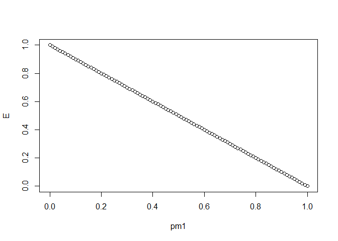
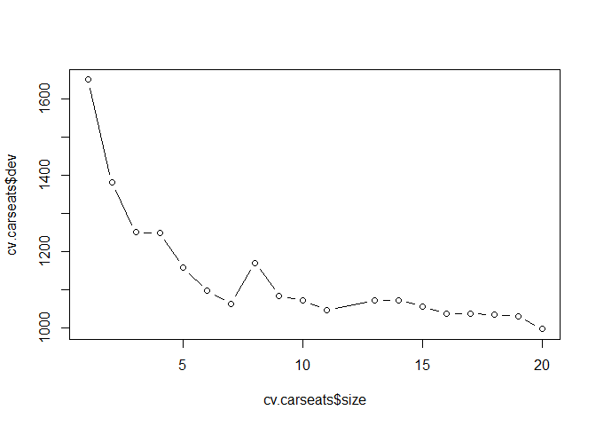

# Chapter 8 Lab: Decision Trees

# Fitting Classification Trees


```r
library(tree)
library(ISLR)
attach(Carseats)
# lab video
hist(Sales)
```

<!-- -->

```r
#
High=ifelse(Sales<=8,"No","Yes")
Carseats=data.frame(Carseats,High)

tree.carseats=tree(High~.-Sales,Carseats)
summary(tree.carseats)
```

```
## 
## Classification tree:
## tree(formula = High ~ . - Sales, data = Carseats)
## Variables actually used in tree construction:
## [1] "ShelveLoc"   "Price"       "Income"      "CompPrice"   "Population" 
## [6] "Advertising" "Age"         "US"         
## Number of terminal nodes:  27 
## Residual mean deviance:  0.4575 = 170.7 / 373 
## Misclassification error rate: 0.09 = 36 / 400
```

```r
plot(tree.carseats);text(tree.carseats,pretty=0)
```

<!-- -->

```r
tree.carseats
```

```
## node), split, n, deviance, yval, (yprob)
##       * denotes terminal node
## 
##   1) root 400 541.500 No ( 0.59000 0.41000 )  
##     2) ShelveLoc: Bad,Medium 315 390.600 No ( 0.68889 0.31111 )  
##       4) Price < 92.5 46  56.530 Yes ( 0.30435 0.69565 )  
##         8) Income < 57 10  12.220 No ( 0.70000 0.30000 )  
##          16) CompPrice < 110.5 5   0.000 No ( 1.00000 0.00000 ) *
##          17) CompPrice > 110.5 5   6.730 Yes ( 0.40000 0.60000 ) *
##         9) Income > 57 36  35.470 Yes ( 0.19444 0.80556 )  
##          18) Population < 207.5 16  21.170 Yes ( 0.37500 0.62500 ) *
##          19) Population > 207.5 20   7.941 Yes ( 0.05000 0.95000 ) *
##       5) Price > 92.5 269 299.800 No ( 0.75465 0.24535 )  
##        10) Advertising < 13.5 224 213.200 No ( 0.81696 0.18304 )  
##          20) CompPrice < 124.5 96  44.890 No ( 0.93750 0.06250 )  
##            40) Price < 106.5 38  33.150 No ( 0.84211 0.15789 )  
##              80) Population < 177 12  16.300 No ( 0.58333 0.41667 )  
##               160) Income < 60.5 6   0.000 No ( 1.00000 0.00000 ) *
##               161) Income > 60.5 6   5.407 Yes ( 0.16667 0.83333 ) *
##              81) Population > 177 26   8.477 No ( 0.96154 0.03846 ) *
##            41) Price > 106.5 58   0.000 No ( 1.00000 0.00000 ) *
##          21) CompPrice > 124.5 128 150.200 No ( 0.72656 0.27344 )  
##            42) Price < 122.5 51  70.680 Yes ( 0.49020 0.50980 )  
##              84) ShelveLoc: Bad 11   6.702 No ( 0.90909 0.09091 ) *
##              85) ShelveLoc: Medium 40  52.930 Yes ( 0.37500 0.62500 )  
##               170) Price < 109.5 16   7.481 Yes ( 0.06250 0.93750 ) *
##               171) Price > 109.5 24  32.600 No ( 0.58333 0.41667 )  
##                 342) Age < 49.5 13  16.050 Yes ( 0.30769 0.69231 ) *
##                 343) Age > 49.5 11   6.702 No ( 0.90909 0.09091 ) *
##            43) Price > 122.5 77  55.540 No ( 0.88312 0.11688 )  
##              86) CompPrice < 147.5 58  17.400 No ( 0.96552 0.03448 ) *
##              87) CompPrice > 147.5 19  25.010 No ( 0.63158 0.36842 )  
##               174) Price < 147 12  16.300 Yes ( 0.41667 0.58333 )  
##                 348) CompPrice < 152.5 7   5.742 Yes ( 0.14286 0.85714 ) *
##                 349) CompPrice > 152.5 5   5.004 No ( 0.80000 0.20000 ) *
##               175) Price > 147 7   0.000 No ( 1.00000 0.00000 ) *
##        11) Advertising > 13.5 45  61.830 Yes ( 0.44444 0.55556 )  
##          22) Age < 54.5 25  25.020 Yes ( 0.20000 0.80000 )  
##            44) CompPrice < 130.5 14  18.250 Yes ( 0.35714 0.64286 )  
##              88) Income < 100 9  12.370 No ( 0.55556 0.44444 ) *
##              89) Income > 100 5   0.000 Yes ( 0.00000 1.00000 ) *
##            45) CompPrice > 130.5 11   0.000 Yes ( 0.00000 1.00000 ) *
##          23) Age > 54.5 20  22.490 No ( 0.75000 0.25000 )  
##            46) CompPrice < 122.5 10   0.000 No ( 1.00000 0.00000 ) *
##            47) CompPrice > 122.5 10  13.860 No ( 0.50000 0.50000 )  
##              94) Price < 125 5   0.000 Yes ( 0.00000 1.00000 ) *
##              95) Price > 125 5   0.000 No ( 1.00000 0.00000 ) *
##     3) ShelveLoc: Good 85  90.330 Yes ( 0.22353 0.77647 )  
##       6) Price < 135 68  49.260 Yes ( 0.11765 0.88235 )  
##        12) US: No 17  22.070 Yes ( 0.35294 0.64706 )  
##          24) Price < 109 8   0.000 Yes ( 0.00000 1.00000 ) *
##          25) Price > 109 9  11.460 No ( 0.66667 0.33333 ) *
##        13) US: Yes 51  16.880 Yes ( 0.03922 0.96078 ) *
##       7) Price > 135 17  22.070 No ( 0.64706 0.35294 )  
##        14) Income < 46 6   0.000 No ( 1.00000 0.00000 ) *
##        15) Income > 46 11  15.160 Yes ( 0.45455 0.54545 ) *
```

```r
set.seed(2)
train=sample(1:nrow(Carseats), 200)
Carseats.test=Carseats[-train,]
High.test=High[-train]
tree.carseats=tree(High~.-Sales,Carseats,subset=train)
#video
plot(tree.carseats);text(tree.carseats,pretty=0)
```

<!-- -->

```r
#

tree.pred=predict(tree.carseats,Carseats.test,type="class")
#video
with(Carseats[-train,],table(tree.pred,High))
```

```
##          High
## tree.pred No Yes
##       No  86  27
##       Yes 30  57
```

```r
#
table(tree.pred,High.test)
```

```
##          High.test
## tree.pred No Yes
##       No  86  27
##       Yes 30  57
```

```r
(86+57)/200
```

```
## [1] 0.715
```

```r
set.seed(3)
cv.carseats=cv.tree(tree.carseats,FUN=prune.misclass)
names(cv.carseats)
```

```
## [1] "size"   "dev"    "k"      "method"
```

```r
cv.carseats
```

```
## $size
## [1] 19 17 14 13  9  7  3  2  1
## 
## $dev
## [1] 55 55 53 52 50 56 69 65 80
## 
## $k
## [1]       -Inf  0.0000000  0.6666667  1.0000000  1.7500000  2.0000000
## [7]  4.2500000  5.0000000 23.0000000
## 
## $method
## [1] "misclass"
## 
## attr(,"class")
## [1] "prune"         "tree.sequence"
```

```r
#video
plot(cv.carseats)
```

<!-- -->

```r
#

par(mfrow=c(1,2))
plot(cv.carseats$size,cv.carseats$dev,type="b")
plot(cv.carseats$k,cv.carseats$dev,type="b")
```

<!-- -->

```r
prune.carseats=prune.misclass(tree.carseats,best=9)
plot(prune.carseats);text(prune.carseats,pretty=0)

#evaluate in test
tree.pred=predict(prune.carseats,Carseats.test,type="class")
table(tree.pred,High.test)
```

```
##          High.test
## tree.pred No Yes
##       No  94  24
##       Yes 22  60
```

```r
(94+60)/200
```

```
## [1] 0.77
```

```r
prune.carseats=prune.misclass(tree.carseats,best=15)
plot(prune.carseats);text(prune.carseats,pretty=0)
```

<!-- -->

```r
tree.pred=predict(prune.carseats,Carseats.test,type="class")
table(tree.pred,High.test)
```

```
##          High.test
## tree.pred No Yes
##       No  86  22
##       Yes 30  62
```

```r
(86+62)/200
```

```
## [1] 0.74
```

# Fitting Regression Trees


```r
library(MASS)
set.seed(1)
train = sample(1:nrow(Boston), nrow(Boston)/2)
tree.boston=tree(medv~.,Boston,subset=train)
summary(tree.boston)
```

```
## 
## Regression tree:
## tree(formula = medv ~ ., data = Boston, subset = train)
## Variables actually used in tree construction:
## [1] "lstat" "rm"    "dis"  
## Number of terminal nodes:  8 
## Residual mean deviance:  12.65 = 3099 / 245 
## Distribution of residuals:
##      Min.   1st Qu.    Median      Mean   3rd Qu.      Max. 
## -14.10000  -2.04200  -0.05357   0.00000   1.96000  12.60000
```

```r
plot(tree.boston);text(tree.boston,pretty=0)
```

<!-- -->

```r
cv.boston=cv.tree(tree.boston)
plot(cv.boston$size,cv.boston$dev,type='b')
```

<!-- -->

```r
prune.boston=prune.tree(tree.boston,best=5)
plot(prune.boston);text(prune.boston,pretty=0)
```

<!-- -->

```r
yhat=predict(tree.boston,newdata=Boston[-train,])
boston.test=Boston[-train,"medv"]
plot(yhat,boston.test)
abline(0,1)
```

<!-- -->

```r
mean((yhat-boston.test)^2)
```

```
## [1] 25.04559
```

# 1. Draw an example (of your own invention) of a partition of two-dimensional feature space that could result from recursive binary splitting. Your example should contain at least six regions. Draw a decision tree corresponding to this partition. Be sure to label all aspects of your figures, including the regions R 1 , R 2 , . . ., the cutpoints t 1 , t 2 , . . ., and so forth.
Hint: Your result should look something like Figures 8.1 and 8.2.

> in the tree for Q1 floder

# 3. Consider the Gini index, classification error, and entropy in a simple classification setting with two classes. Create a single plot that displays each of these quantities as a function of ˆp m1 . The x-axis should display ˆp m1 , ranging from 0 to 1, and the y-axis should display the value of the Gini index, classification error, and entropy. 
Hint: In a setting with two classes, ˆp m1 = 1 − ˆp m2 . You could make this plot by hand, but it will be much easier to make in R.


```r
pm1=seq(0,1,by=0.01)
E=1-pm1
plot(pm1,E)
```

<!-- -->

```r
G=pm1*(1-pm1)*2
plot(pm1,G)
```

<!-- -->

```r
D=-((pm1*log10(pm1))+((1-pm1)*log10(1-pm1)))
plot(pm1,D)
```

<!-- -->


# 8. In the lab, a classification tree was applied to the Carseats data set after converting Sales into a qualitative response variable. Now we will seek to predict Sales using regression trees and related approaches, treating the response as a quantitative variable. 

## (a) Split the data set into a training set and a test set.


```r
summary(Carseats)
```

```
##      Sales          CompPrice       Income        Advertising    
##  Min.   : 0.000   Min.   : 77   Min.   : 21.00   Min.   : 0.000  
##  1st Qu.: 5.390   1st Qu.:115   1st Qu.: 42.75   1st Qu.: 0.000  
##  Median : 7.490   Median :125   Median : 69.00   Median : 5.000  
##  Mean   : 7.496   Mean   :125   Mean   : 68.66   Mean   : 6.635  
##  3rd Qu.: 9.320   3rd Qu.:135   3rd Qu.: 91.00   3rd Qu.:12.000  
##  Max.   :16.270   Max.   :175   Max.   :120.00   Max.   :29.000  
##    Population        Price        ShelveLoc        Age       
##  Min.   : 10.0   Min.   : 24.0   Bad   : 96   Min.   :25.00  
##  1st Qu.:139.0   1st Qu.:100.0   Good  : 85   1st Qu.:39.75  
##  Median :272.0   Median :117.0   Medium:219   Median :54.50  
##  Mean   :264.8   Mean   :115.8                Mean   :53.32  
##  3rd Qu.:398.5   3rd Qu.:131.0                3rd Qu.:66.00  
##  Max.   :509.0   Max.   :191.0                Max.   :80.00  
##    Education    Urban       US       High    
##  Min.   :10.0   No :118   No :142   No :236  
##  1st Qu.:12.0   Yes:282   Yes:258   Yes:164  
##  Median :14.0                                
##  Mean   :13.9                                
##  3rd Qu.:16.0                                
##  Max.   :18.0
```

```r
set.seed(10)
train=sample(1:nrow(Carseats), 200)
Carseats.test=Carseats[-train,]
Carseats.train=Carseats[train,]
summary(Carseats.test)
```

```
##      Sales          CompPrice         Income        Advertising    
##  Min.   : 0.160   Min.   : 77.0   Min.   : 21.00   Min.   : 0.000  
##  1st Qu.: 5.577   1st Qu.:116.0   1st Qu.: 42.75   1st Qu.: 0.000  
##  Median : 7.415   Median :125.5   Median : 67.00   Median : 5.500  
##  Mean   : 7.503   Mean   :125.4   Mean   : 66.25   Mean   : 6.735  
##  3rd Qu.: 9.320   3rd Qu.:135.0   3rd Qu.: 87.25   3rd Qu.:12.000  
##  Max.   :15.630   Max.   :159.0   Max.   :119.00   Max.   :26.000  
##    Population        Price        ShelveLoc        Age       
##  Min.   : 13.0   Min.   : 24.0   Bad   : 49   Min.   :25.00  
##  1st Qu.:150.2   1st Qu.:101.0   Good  : 39   1st Qu.:41.00  
##  Median :270.5   Median :118.5   Medium:112   Median :54.00  
##  Mean   :263.6   Mean   :115.8                Mean   :53.31  
##  3rd Qu.:376.2   3rd Qu.:131.2                3rd Qu.:65.00  
##  Max.   :509.0   Max.   :171.0                Max.   :80.00  
##    Education     Urban       US       High    
##  Min.   :10.00   No : 51   No : 73   No :120  
##  1st Qu.:12.00   Yes:149   Yes:127   Yes: 80  
##  Median :14.00                                
##  Mean   :13.85                                
##  3rd Qu.:16.00                                
##  Max.   :18.00
```

```r
summary(Carseats.train)
```

```
##      Sales          CompPrice         Income        Advertising    
##  Min.   : 0.000   Min.   : 85.0   Min.   : 21.00   Min.   : 0.000  
##  1st Qu.: 5.322   1st Qu.:114.8   1st Qu.: 43.50   1st Qu.: 0.000  
##  Median : 7.535   Median :124.0   Median : 72.50   Median : 5.000  
##  Mean   : 7.489   Mean   :124.6   Mean   : 71.07   Mean   : 6.535  
##  3rd Qu.: 9.335   3rd Qu.:135.0   3rd Qu.: 93.00   3rd Qu.:11.250  
##  Max.   :16.270   Max.   :175.0   Max.   :120.00   Max.   :29.000  
##    Population        Price        ShelveLoc        Age       
##  Min.   : 10.0   Min.   : 54.0   Bad   : 47   Min.   :25.00  
##  1st Qu.:125.0   1st Qu.: 99.0   Good  : 46   1st Qu.:38.00  
##  Median :277.5   Median :116.0   Medium:107   Median :55.00  
##  Mean   :266.1   Mean   :115.8                Mean   :53.34  
##  3rd Qu.:407.0   3rd Qu.:130.0                3rd Qu.:67.00  
##  Max.   :508.0   Max.   :191.0                Max.   :80.00  
##    Education     Urban       US       High    
##  Min.   :10.00   No : 67   No : 69   No :116  
##  1st Qu.:12.00   Yes:133   Yes:131   Yes: 84  
##  Median :14.00                                
##  Mean   :13.95                                
##  3rd Qu.:16.00                                
##  Max.   :18.00
```

## (b) Fit a regression tree to the training set. Plot the tree, and interpret the results. What test MSE do you obtain?


```r
tree.carseats=tree(Sales~.-High,Carseats,subset=train)
summary(tree.carseats)
```

```
## 
## Regression tree:
## tree(formula = Sales ~ . - High, data = Carseats, subset = train)
## Variables actually used in tree construction:
## [1] "ShelveLoc"   "Price"       "CompPrice"   "Income"      "Age"        
## [6] "Education"   "Advertising" "Population"  "US"         
## Number of terminal nodes:  20 
## Residual mean deviance:  2.463 = 443.3 / 180 
## Distribution of residuals:
##     Min.  1st Qu.   Median     Mean  3rd Qu.     Max. 
## -3.76200 -0.97300 -0.01446  0.00000  0.99810  4.21600
```

```r
plot(tree.carseats);text(tree.carseats,pretty=0)
```

<!-- -->

```r
yhat=predict(tree.carseats,newdata=Carseats.test)
Sales.test=Carseats.test$Sales
plot(yhat,Sales.test)
abline(0,1)
```

<!-- -->

```r
mean((yhat-Sales.test)^2)
```

```
## [1] 4.94415
```

> MSE = 4.94415

## (c) Use cross-validation in order to determine the optimal level of tree complexity. Does pruning the tree improve the test MSE?


```r
cv.carseats=cv.tree(tree.carseats)
cv.carseats
```

```
## $size
##  [1] 20 19 18 17 16 15 14 13 11 10  9  8  7  6  5  4  3  2  1
## 
## $dev
##  [1]  997.5515 1031.4919 1035.5002 1038.2937 1037.9359 1056.8796 1072.7320
##  [8] 1072.7320 1047.9463 1072.2939 1084.8207 1170.8523 1064.1563 1097.1183
## [15] 1157.8819 1248.9363 1250.8952 1380.6619 1649.9659
## 
## $k
##  [1]      -Inf  17.78881  17.88696  18.05873  18.14444  22.99173  23.36162
##  [8]  24.06703  26.05337  28.03038  30.28544  43.00558  52.20374  54.65375
## [15]  76.41667  95.21592  98.65456 167.19459 361.36124
## 
## $method
## [1] "deviance"
## 
## attr(,"class")
## [1] "prune"         "tree.sequence"
```

```r
plot(cv.carseats$size,cv.carseats$dev,type='b')
```

<!-- -->

```r
prune.carseats=prune.tree(tree.carseats,best=7)
plot(prune.carseats);text(prune.carseats,pretty=0)
```

<!-- -->

```r
yhat=predict(prune.carseats,newdata=Carseats.test)
Sales.test=Carseats.test$Sales
plot(yhat,Sales.test)
abline(0,1)
```

<!-- -->

```r
mean((yhat-Sales.test)^2)
```

```
## [1] 4.419579
```

> MSE = 4.419579, better

# 9. This problem involves the OJ data set which is part of the ISLR package.


```r
library(ISLR)
summary(OJ)
```

```
##  Purchase WeekofPurchase     StoreID        PriceCH         PriceMM     
##  CH:653   Min.   :227.0   Min.   :1.00   Min.   :1.690   Min.   :1.690  
##  MM:417   1st Qu.:240.0   1st Qu.:2.00   1st Qu.:1.790   1st Qu.:1.990  
##           Median :257.0   Median :3.00   Median :1.860   Median :2.090  
##           Mean   :254.4   Mean   :3.96   Mean   :1.867   Mean   :2.085  
##           3rd Qu.:268.0   3rd Qu.:7.00   3rd Qu.:1.990   3rd Qu.:2.180  
##           Max.   :278.0   Max.   :7.00   Max.   :2.090   Max.   :2.290  
##      DiscCH            DiscMM         SpecialCH        SpecialMM     
##  Min.   :0.00000   Min.   :0.0000   Min.   :0.0000   Min.   :0.0000  
##  1st Qu.:0.00000   1st Qu.:0.0000   1st Qu.:0.0000   1st Qu.:0.0000  
##  Median :0.00000   Median :0.0000   Median :0.0000   Median :0.0000  
##  Mean   :0.05186   Mean   :0.1234   Mean   :0.1477   Mean   :0.1617  
##  3rd Qu.:0.00000   3rd Qu.:0.2300   3rd Qu.:0.0000   3rd Qu.:0.0000  
##  Max.   :0.50000   Max.   :0.8000   Max.   :1.0000   Max.   :1.0000  
##     LoyalCH          SalePriceMM     SalePriceCH      PriceDiff      
##  Min.   :0.000011   Min.   :1.190   Min.   :1.390   Min.   :-0.6700  
##  1st Qu.:0.325257   1st Qu.:1.690   1st Qu.:1.750   1st Qu.: 0.0000  
##  Median :0.600000   Median :2.090   Median :1.860   Median : 0.2300  
##  Mean   :0.565782   Mean   :1.962   Mean   :1.816   Mean   : 0.1465  
##  3rd Qu.:0.850873   3rd Qu.:2.130   3rd Qu.:1.890   3rd Qu.: 0.3200  
##  Max.   :0.999947   Max.   :2.290   Max.   :2.090   Max.   : 0.6400  
##  Store7      PctDiscMM        PctDiscCH       ListPriceDiff  
##  No :714   Min.   :0.0000   Min.   :0.00000   Min.   :0.000  
##  Yes:356   1st Qu.:0.0000   1st Qu.:0.00000   1st Qu.:0.140  
##            Median :0.0000   Median :0.00000   Median :0.240  
##            Mean   :0.0593   Mean   :0.02731   Mean   :0.218  
##            3rd Qu.:0.1127   3rd Qu.:0.00000   3rd Qu.:0.300  
##            Max.   :0.4020   Max.   :0.25269   Max.   :0.440  
##      STORE      
##  Min.   :0.000  
##  1st Qu.:0.000  
##  Median :2.000  
##  Mean   :1.631  
##  3rd Qu.:3.000  
##  Max.   :4.000
```

## (a) Create a training set containing a random sample of 800 observations, and a test set containing the remaining observations.


```r
set.seed(10)
train=sample(1:nrow(OJ), 800)
OJ.test=OJ[-train,]
OJ.train=OJ[train,]
summary(OJ.test)
```

```
##  Purchase WeekofPurchase     StoreID         PriceCH         PriceMM     
##  CH:177   Min.   :227.0   Min.   :1.000   Min.   :1.690   Min.   :1.690  
##  MM: 93   1st Qu.:238.0   1st Qu.:2.000   1st Qu.:1.790   1st Qu.:1.990  
##           Median :254.0   Median :3.000   Median :1.860   Median :2.090  
##           Mean   :253.3   Mean   :3.804   Mean   :1.862   Mean   :2.077  
##           3rd Qu.:268.0   3rd Qu.:7.000   3rd Qu.:1.990   3rd Qu.:2.180  
##           Max.   :278.0   Max.   :7.000   Max.   :2.090   Max.   :2.290  
##      DiscCH            DiscMM         SpecialCH        SpecialMM     
##  Min.   :0.00000   Min.   :0.0000   Min.   :0.0000   Min.   :0.0000  
##  1st Qu.:0.00000   1st Qu.:0.0000   1st Qu.:0.0000   1st Qu.:0.0000  
##  Median :0.00000   Median :0.0000   Median :0.0000   Median :0.0000  
##  Mean   :0.04374   Mean   :0.1053   Mean   :0.1259   Mean   :0.1481  
##  3rd Qu.:0.00000   3rd Qu.:0.0600   3rd Qu.:0.0000   3rd Qu.:0.0000  
##  Max.   :0.50000   Max.   :0.8000   Max.   :1.0000   Max.   :1.0000  
##     LoyalCH          SalePriceMM     SalePriceCH      PriceDiff      
##  Min.   :0.000011   Min.   :1.190   Min.   :1.390   Min.   :-0.6700  
##  1st Qu.:0.400000   1st Qu.:1.690   1st Qu.:1.750   1st Qu.: 0.0000  
##  Median :0.600000   Median :2.090   Median :1.860   Median : 0.2400  
##  Mean   :0.593359   Mean   :1.972   Mean   :1.818   Mean   : 0.1541  
##  3rd Qu.:0.888618   3rd Qu.:2.130   3rd Qu.:1.890   3rd Qu.: 0.3150  
##  Max.   :0.999226   Max.   :2.290   Max.   :2.090   Max.   : 0.6400  
##  Store7      PctDiscMM         PctDiscCH       ListPriceDiff   
##  No :185   Min.   :0.00000   Min.   :0.00000   Min.   :0.0000  
##  Yes: 85   1st Qu.:0.00000   1st Qu.:0.00000   1st Qu.:0.1300  
##            Median :0.00000   Median :0.00000   Median :0.2400  
##            Mean   :0.05107   Mean   :0.02288   Mean   :0.2156  
##            3rd Qu.:0.02752   3rd Qu.:0.00000   3rd Qu.:0.3000  
##            Max.   :0.40201   Max.   :0.25269   Max.   :0.4400  
##      STORE    
##  Min.   :0.0  
##  1st Qu.:0.0  
##  Median :1.0  
##  Mean   :1.6  
##  3rd Qu.:3.0  
##  Max.   :4.0
```

```r
summary(OJ.train)
```

```
##  Purchase WeekofPurchase     StoreID         PriceCH         PriceMM     
##  CH:476   Min.   :227.0   Min.   :1.000   Min.   :1.690   Min.   :1.690  
##  MM:324   1st Qu.:240.0   1st Qu.:2.000   1st Qu.:1.790   1st Qu.:2.090  
##           Median :257.0   Median :3.000   Median :1.860   Median :2.130  
##           Mean   :254.7   Mean   :4.013   Mean   :1.869   Mean   :2.088  
##           3rd Qu.:268.0   3rd Qu.:7.000   3rd Qu.:1.990   3rd Qu.:2.180  
##           Max.   :278.0   Max.   :7.000   Max.   :2.090   Max.   :2.290  
##      DiscCH           DiscMM         SpecialCH       SpecialMM     
##  Min.   :0.0000   Min.   :0.0000   Min.   :0.000   Min.   :0.0000  
##  1st Qu.:0.0000   1st Qu.:0.0000   1st Qu.:0.000   1st Qu.:0.0000  
##  Median :0.0000   Median :0.0000   Median :0.000   Median :0.0000  
##  Mean   :0.0546   Mean   :0.1295   Mean   :0.155   Mean   :0.1663  
##  3rd Qu.:0.0000   3rd Qu.:0.2400   3rd Qu.:0.000   3rd Qu.:0.0000  
##  Max.   :0.5000   Max.   :0.8000   Max.   :1.000   Max.   :1.0000  
##     LoyalCH          SalePriceMM     SalePriceCH      PriceDiff      
##  Min.   :0.000014   Min.   :1.190   Min.   :1.390   Min.   :-0.6700  
##  1st Qu.:0.320000   1st Qu.:1.690   1st Qu.:1.750   1st Qu.: 0.0000  
##  Median :0.587902   Median :2.090   Median :1.860   Median : 0.2300  
##  Mean   :0.556475   Mean   :1.959   Mean   :1.815   Mean   : 0.1439  
##  3rd Qu.:0.836160   3rd Qu.:2.143   3rd Qu.:1.890   3rd Qu.: 0.3200  
##  Max.   :0.999947   Max.   :2.290   Max.   :2.090   Max.   : 0.6400  
##  Store7      PctDiscMM         PctDiscCH       ListPriceDiff   
##  No :529   Min.   :0.00000   Min.   :0.00000   Min.   :0.0000  
##  Yes:271   1st Qu.:0.00000   1st Qu.:0.00000   1st Qu.:0.1400  
##            Median :0.00000   Median :0.00000   Median :0.2400  
##            Mean   :0.06207   Mean   :0.02881   Mean   :0.2188  
##            3rd Qu.:0.11834   3rd Qu.:0.00000   3rd Qu.:0.3000  
##            Max.   :0.40201   Max.   :0.25269   Max.   :0.4400  
##      STORE      
##  Min.   :0.000  
##  1st Qu.:0.000  
##  Median :2.000  
##  Mean   :1.641  
##  3rd Qu.:3.000  
##  Max.   :4.000
```

```r
dim(OJ)
```

```
## [1] 1070   18
```

```r
dim(OJ.test)
```

```
## [1] 270  18
```

```r
dim(OJ.train)
```

```
## [1] 800  18
```

## (b) Fit a tree to the training data, with Purchase as the response and the other variables as predictors. Use the summary() function to produce summary statistics about the tree, and describe the results obtained. What is the training error rate? How many terminal nodes does the tree have?


```r
tree.OJ=tree(Purchase~.,OJ,subset=train)
summary(tree.OJ)
```

```
## 
## Classification tree:
## tree(formula = Purchase ~ ., data = OJ, subset = train)
## Variables actually used in tree construction:
## [1] "LoyalCH"   "SpecialCH" "PriceDiff"
## Number of terminal nodes:  7 
## Residual mean deviance:  0.7936 = 629.3 / 793 
## Misclassification error rate: 0.1625 = 130 / 800
```

> Number of terminal nodes:  7

> Misclassification error rate: 0.1625

## (c) Type in the name of the tree object in order to get a detailed text output. Pick one of the terminal nodes, and interpret the information displayed.


```r
tree.OJ
```

```
## node), split, n, deviance, yval, (yprob)
##       * denotes terminal node
## 
##  1) root 800 1080.000 CH ( 0.59500 0.40500 )  
##    2) LoyalCH < 0.450956 290  295.700 MM ( 0.20690 0.79310 )  
##      4) LoyalCH < 0.276142 172  119.500 MM ( 0.11047 0.88953 ) *
##      5) LoyalCH > 0.276142 118  152.400 MM ( 0.34746 0.65254 )  
##       10) SpecialCH < 0.5 104  125.000 MM ( 0.28846 0.71154 ) *
##       11) SpecialCH > 0.5 14   14.550 CH ( 0.78571 0.21429 ) *
##    3) LoyalCH > 0.450956 510  487.400 CH ( 0.81569 0.18431 )  
##      6) LoyalCH < 0.764572 258  321.100 CH ( 0.68605 0.31395 )  
##       12) PriceDiff < 0.05 87  119.200 MM ( 0.43678 0.56322 )  
##         24) PriceDiff < -0.34 18    7.724 MM ( 0.05556 0.94444 ) *
##         25) PriceDiff > -0.34 69   95.290 CH ( 0.53623 0.46377 ) *
##       13) PriceDiff > 0.05 171  164.900 CH ( 0.81287 0.18713 ) *
##      7) LoyalCH > 0.764572 252  102.400 CH ( 0.94841 0.05159 ) *
```

```r
?OJ
```

```
## starting httpd help server ... done
```

> 4) LoyalCH < 0.276142 172  119.500 MM ( 0.11047 0.88953 ) *

> when customer brand loyalty for Citrus Hill is less than 0.276142, 88.953% customer purchased Minute Maid Orange Juice and 11.047% customer purchased Citrus Hill.

## (d) Create a plot of the tree, and interpret the results.


```r
plot(tree.OJ);text(tree.OJ,pretty=0)
```

<!-- -->

> Customer brand loyalty for CH (LoyalCH) and Sale price of MM less sale price of CH (PriceDiff) are important.

## (e) Predict the response on the test data, and produce a confusion matrix comparing the test labels to the predicted test labels. What is the test error rate?


```r
tree.pred=predict(tree.OJ,OJ.test,type="class")
purchase.test=OJ.test$Purchase
table(tree.pred,purchase.test)
```

```
##          purchase.test
## tree.pred  CH  MM
##        CH 155  27
##        MM  22  66
```

```r
(155+66)/270
```

```
## [1] 0.8185185
```

```r
1-((155+66)/270)
```

```
## [1] 0.1814815
```

> the test error rate = 18.1%

## (f) Apply the cv.tree() function to the training set in order to determine the optimal tree size.


```r
cv.OJ=cv.tree(tree.OJ,FUN=prune.misclass)
names(cv.OJ)
```

```
## [1] "size"   "dev"    "k"      "method"
```

```r
cv.OJ
```

```
## $size
## [1] 7 5 4 2 1
## 
## $dev
## [1] 150 152 162 162 324
## 
## $k
## [1]  -Inf   4.0   5.0   5.5 170.0
## 
## $method
## [1] "misclass"
## 
## attr(,"class")
## [1] "prune"         "tree.sequence"
```

```r
plot(cv.OJ)
```

<!-- -->


## (g) Produce a plot with tree size on the x-axis and cross-validated classification error rate on the y-axis.


```r
plot(cv.OJ$size,cv.OJ$dev,type="b")
```

<!-- -->


## (h) Which tree size corresponds to the lowest cross-validated classification error rate?

> size 5 orresponds to the lowest cross-validated classification error rate

## (i) Produce a pruned tree corresponding to the optimal tree size obtained using cross-validation. If cross-validation does not lead to selection of a pruned tree, then create a pruned tree with five terminal nodes.


```r
prune.OJ=prune.misclass(tree.OJ,best=5)
plot(prune.OJ);text(prune.OJ,pretty=0)
```

<!-- -->

## (j) Compare the training error rates between the pruned and un-pruned trees. Which is higher?


```r
summary(tree.OJ)
```

```
## 
## Classification tree:
## tree(formula = Purchase ~ ., data = OJ, subset = train)
## Variables actually used in tree construction:
## [1] "LoyalCH"   "SpecialCH" "PriceDiff"
## Number of terminal nodes:  7 
## Residual mean deviance:  0.7936 = 629.3 / 793 
## Misclassification error rate: 0.1625 = 130 / 800
```

```r
summary(prune.OJ)
```

```
## 
## Classification tree:
## snip.tree(tree = tree.OJ, nodes = 2L)
## Variables actually used in tree construction:
## [1] "LoyalCH"   "PriceDiff"
## Number of terminal nodes:  5 
## Residual mean deviance:  0.8377 = 666 / 795 
## Misclassification error rate: 0.1725 = 138 / 800
```

> the training error rates of the pruned trees is higher

## (k) Compare the test error rates between the pruned and unpruned trees. Which is higher?


```r
tree.pred=predict(tree.OJ,OJ.test,type="class")
table(tree.pred,purchase.test)
```

```
##          purchase.test
## tree.pred  CH  MM
##        CH 155  27
##        MM  22  66
```

```r
(155+66)/270
```

```
## [1] 0.8185185
```

```r
1-((155+66)/270)
```

```
## [1] 0.1814815
```

```r
prune.pred=predict(prune.OJ,OJ.test,type="class")
table(prune.pred,purchase.test)
```

```
##           purchase.test
## prune.pred  CH  MM
##         CH 151  25
##         MM  26  68
```

```r
(151+68)/270
```

```
## [1] 0.8111111
```

```r
1-((151+68)/270)
```

```
## [1] 0.1888889
```

> the test error rates of the pruned trees is higher, but almost the same
