# Chapter 8 Lab: Decision Trees

# Fitting Classification Trees


```r
library(tree)
library(ISLR)
attach(Carseats)
# lab video
hist(Sales)
```

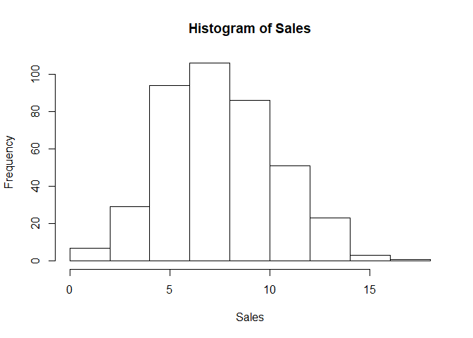<!-- -->

```r
#
High=ifelse(Sales<=8,"No","Yes")
Carseats=data.frame(Carseats,High)

tree.carseats=tree(High~.-Sales,Carseats)
summary(tree.carseats)
```

```
## 
## Classification tree:
## tree(formula = High ~ . - Sales, data = Carseats)
## Variables actually used in tree construction:
## [1] "ShelveLoc"   "Price"       "Income"      "CompPrice"   "Population" 
## [6] "Advertising" "Age"         "US"         
## Number of terminal nodes:  27 
## Residual mean deviance:  0.4575 = 170.7 / 373 
## Misclassification error rate: 0.09 = 36 / 400
```

```r
plot(tree.carseats);text(tree.carseats,pretty=0)
```

<!-- -->

```r
tree.carseats
```

```
## node), split, n, deviance, yval, (yprob)
##       * denotes terminal node
## 
##   1) root 400 541.500 No ( 0.59000 0.41000 )  
##     2) ShelveLoc: Bad,Medium 315 390.600 No ( 0.68889 0.31111 )  
##       4) Price < 92.5 46  56.530 Yes ( 0.30435 0.69565 )  
##         8) Income < 57 10  12.220 No ( 0.70000 0.30000 )  
##          16) CompPrice < 110.5 5   0.000 No ( 1.00000 0.00000 ) *
##          17) CompPrice > 110.5 5   6.730 Yes ( 0.40000 0.60000 ) *
##         9) Income > 57 36  35.470 Yes ( 0.19444 0.80556 )  
##          18) Population < 207.5 16  21.170 Yes ( 0.37500 0.62500 ) *
##          19) Population > 207.5 20   7.941 Yes ( 0.05000 0.95000 ) *
##       5) Price > 92.5 269 299.800 No ( 0.75465 0.24535 )  
##        10) Advertising < 13.5 224 213.200 No ( 0.81696 0.18304 )  
##          20) CompPrice < 124.5 96  44.890 No ( 0.93750 0.06250 )  
##            40) Price < 106.5 38  33.150 No ( 0.84211 0.15789 )  
##              80) Population < 177 12  16.300 No ( 0.58333 0.41667 )  
##               160) Income < 60.5 6   0.000 No ( 1.00000 0.00000 ) *
##               161) Income > 60.5 6   5.407 Yes ( 0.16667 0.83333 ) *
##              81) Population > 177 26   8.477 No ( 0.96154 0.03846 ) *
##            41) Price > 106.5 58   0.000 No ( 1.00000 0.00000 ) *
##          21) CompPrice > 124.5 128 150.200 No ( 0.72656 0.27344 )  
##            42) Price < 122.5 51  70.680 Yes ( 0.49020 0.50980 )  
##              84) ShelveLoc: Bad 11   6.702 No ( 0.90909 0.09091 ) *
##              85) ShelveLoc: Medium 40  52.930 Yes ( 0.37500 0.62500 )  
##               170) Price < 109.5 16   7.481 Yes ( 0.06250 0.93750 ) *
##               171) Price > 109.5 24  32.600 No ( 0.58333 0.41667 )  
##                 342) Age < 49.5 13  16.050 Yes ( 0.30769 0.69231 ) *
##                 343) Age > 49.5 11   6.702 No ( 0.90909 0.09091 ) *
##            43) Price > 122.5 77  55.540 No ( 0.88312 0.11688 )  
##              86) CompPrice < 147.5 58  17.400 No ( 0.96552 0.03448 ) *
##              87) CompPrice > 147.5 19  25.010 No ( 0.63158 0.36842 )  
##               174) Price < 147 12  16.300 Yes ( 0.41667 0.58333 )  
##                 348) CompPrice < 152.5 7   5.742 Yes ( 0.14286 0.85714 ) *
##                 349) CompPrice > 152.5 5   5.004 No ( 0.80000 0.20000 ) *
##               175) Price > 147 7   0.000 No ( 1.00000 0.00000 ) *
##        11) Advertising > 13.5 45  61.830 Yes ( 0.44444 0.55556 )  
##          22) Age < 54.5 25  25.020 Yes ( 0.20000 0.80000 )  
##            44) CompPrice < 130.5 14  18.250 Yes ( 0.35714 0.64286 )  
##              88) Income < 100 9  12.370 No ( 0.55556 0.44444 ) *
##              89) Income > 100 5   0.000 Yes ( 0.00000 1.00000 ) *
##            45) CompPrice > 130.5 11   0.000 Yes ( 0.00000 1.00000 ) *
##          23) Age > 54.5 20  22.490 No ( 0.75000 0.25000 )  
##            46) CompPrice < 122.5 10   0.000 No ( 1.00000 0.00000 ) *
##            47) CompPrice > 122.5 10  13.860 No ( 0.50000 0.50000 )  
##              94) Price < 125 5   0.000 Yes ( 0.00000 1.00000 ) *
##              95) Price > 125 5   0.000 No ( 1.00000 0.00000 ) *
##     3) ShelveLoc: Good 85  90.330 Yes ( 0.22353 0.77647 )  
##       6) Price < 135 68  49.260 Yes ( 0.11765 0.88235 )  
##        12) US: No 17  22.070 Yes ( 0.35294 0.64706 )  
##          24) Price < 109 8   0.000 Yes ( 0.00000 1.00000 ) *
##          25) Price > 109 9  11.460 No ( 0.66667 0.33333 ) *
##        13) US: Yes 51  16.880 Yes ( 0.03922 0.96078 ) *
##       7) Price > 135 17  22.070 No ( 0.64706 0.35294 )  
##        14) Income < 46 6   0.000 No ( 1.00000 0.00000 ) *
##        15) Income > 46 11  15.160 Yes ( 0.45455 0.54545 ) *
```

```r
set.seed(2)
train=sample(1:nrow(Carseats), 200)
Carseats.test=Carseats[-train,]
High.test=High[-train]
tree.carseats=tree(High~.-Sales,Carseats,subset=train)
#video
plot(tree.carseats);text(tree.carseats,pretty=0)
```

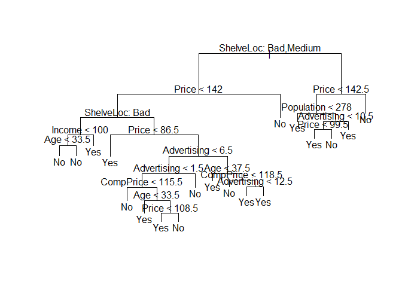<!-- -->

```r
#

tree.pred=predict(tree.carseats,Carseats.test,type="class")
#video
with(Carseats[-train,],table(tree.pred,High))
```

```
##          High
## tree.pred No Yes
##       No  86  27
##       Yes 30  57
```

```r
#
table(tree.pred,High.test)
```

```
##          High.test
## tree.pred No Yes
##       No  86  27
##       Yes 30  57
```

```r
(86+57)/200
```

```
## [1] 0.715
```

```r
set.seed(3)
cv.carseats=cv.tree(tree.carseats,FUN=prune.misclass)
names(cv.carseats)
```

```
## [1] "size"   "dev"    "k"      "method"
```

```r
cv.carseats
```

```
## $size
## [1] 19 17 14 13  9  7  3  2  1
## 
## $dev
## [1] 55 55 53 52 50 56 69 65 80
## 
## $k
## [1]       -Inf  0.0000000  0.6666667  1.0000000  1.7500000  2.0000000
## [7]  4.2500000  5.0000000 23.0000000
## 
## $method
## [1] "misclass"
## 
## attr(,"class")
## [1] "prune"         "tree.sequence"
```

```r
#video
plot(cv.carseats)
```

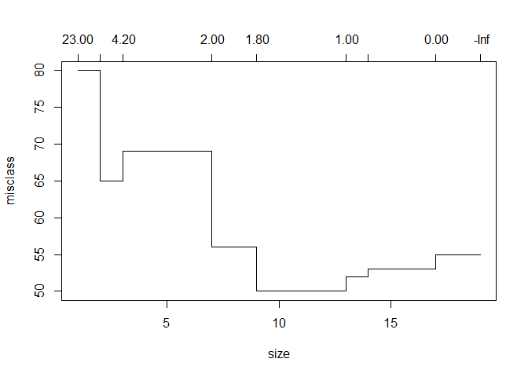<!-- -->

```r
#

par(mfrow=c(1,2))
plot(cv.carseats$size,cv.carseats$dev,type="b")
plot(cv.carseats$k,cv.carseats$dev,type="b")
```

<!-- -->

```r
prune.carseats=prune.misclass(tree.carseats,best=9)
plot(prune.carseats);text(prune.carseats,pretty=0)

#evaluate in test
tree.pred=predict(prune.carseats,Carseats.test,type="class")
table(tree.pred,High.test)
```

```
##          High.test
## tree.pred No Yes
##       No  94  24
##       Yes 22  60
```

```r
(94+60)/200
```

```
## [1] 0.77
```

```r
prune.carseats=prune.misclass(tree.carseats,best=15)
plot(prune.carseats);text(prune.carseats,pretty=0)
```

<!-- -->

```r
tree.pred=predict(prune.carseats,Carseats.test,type="class")
table(tree.pred,High.test)
```

```
##          High.test
## tree.pred No Yes
##       No  86  22
##       Yes 30  62
```

```r
(86+62)/200
```

```
## [1] 0.74
```

# Fitting Regression Trees


```r
library(MASS)
set.seed(1)
train = sample(1:nrow(Boston), nrow(Boston)/2)
tree.boston=tree(medv~.,Boston,subset=train)
summary(tree.boston)
```

```
## 
## Regression tree:
## tree(formula = medv ~ ., data = Boston, subset = train)
## Variables actually used in tree construction:
## [1] "lstat" "rm"    "dis"  
## Number of terminal nodes:  8 
## Residual mean deviance:  12.65 = 3099 / 245 
## Distribution of residuals:
##      Min.   1st Qu.    Median      Mean   3rd Qu.      Max. 
## -14.10000  -2.04200  -0.05357   0.00000   1.96000  12.60000
```

```r
plot(tree.boston);text(tree.boston,pretty=0)
```

<!-- -->

```r
cv.boston=cv.tree(tree.boston)
plot(cv.boston$size,cv.boston$dev,type='b')
```

<!-- -->

```r
prune.boston=prune.tree(tree.boston,best=5)
plot(prune.boston);text(prune.boston,pretty=0)
```

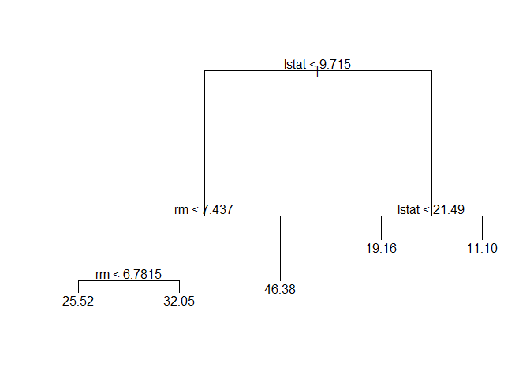<!-- -->

```r
yhat=predict(tree.boston,newdata=Boston[-train,])
boston.test=Boston[-train,"medv"]
plot(yhat,boston.test)
abline(0,1)
```

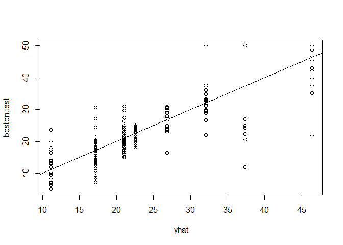<!-- -->

```r
mean((yhat-boston.test)^2)
```

```
## [1] 25.04559
```

# Bagging and Random Forests


```r
library(MASS)
library(randomForest)
```

```
## randomForest 4.6-14
```

```
## Type rfNews() to see new features/changes/bug fixes.
```

```r
#
dim(Boston)
```

```
## [1] 506  14
```

```r
#
set.seed(1)
train = sample(1:nrow(Boston), nrow(Boston)/2)
#
obb.err=double(13)
test.err=double(13)
for(mtry in 1:13){
  fit=randomForest(medv~.,data=Boston,subset=train,mtry=mtry,ntree=400)
  obb.err[mtry]=fit$mse[400]
  pred=predict(fit,Boston[-train,])
  test.err[mtry]=with(Boston[-train,],mean((medv-pred)^2))
  cat(mtry," ")
}
```

```
## 1  2  3  4  5  6  7  8  9  10  11  12  13
```

```r
matplot(1:mtry,cbind(test.err,obb.err),pch = 19,col = c("red","blue"),type = "b",ylab = "Mean squared errors")
legend("topright",legend = c("Test","OOB"),pch = 19,col = c("red","blue"))
```

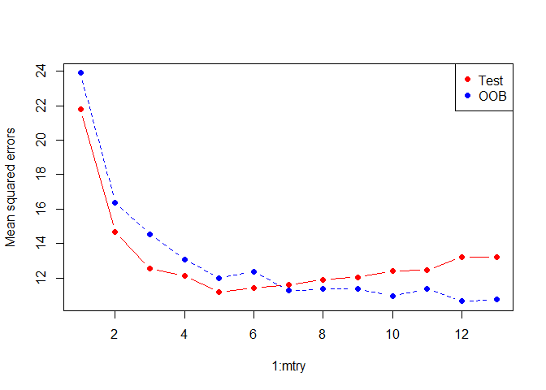<!-- -->

```r
#
bag.boston=randomForest(medv~.,data=Boston,subset=train,mtry=13,importance=TRUE)
bag.boston
```

```
## 
## Call:
##  randomForest(formula = medv ~ ., data = Boston, mtry = 13, importance = TRUE,      subset = train) 
##                Type of random forest: regression
##                      Number of trees: 500
## No. of variables tried at each split: 13
## 
##           Mean of squared residuals: 10.31237
##                     % Var explained: 87.51
```

```r
yhat.bag = predict(bag.boston,newdata=Boston[-train,])
plot(yhat.bag, boston.test)
abline(0,1)
```

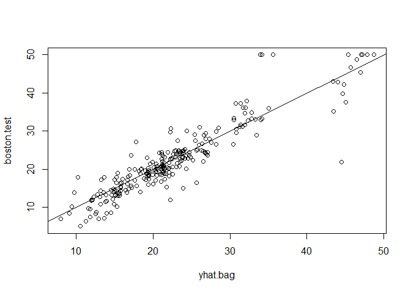<!-- -->

```r
mean((yhat.bag-boston.test)^2)
```

```
## [1] 13.26379
```

```r
bag.boston=randomForest(medv~.,data=Boston,subset=train,mtry=13,ntree=25)
yhat.bag = predict(bag.boston,newdata=Boston[-train,])
mean((yhat.bag-boston.test)^2)
```

```
## [1] 15.20602
```

```r
set.seed(1)
rf.boston=randomForest(medv~.,data=Boston,subset=train,mtry=6,importance=TRUE)
yhat.rf = predict(rf.boston,newdata=Boston[-train,])
mean((yhat.rf-boston.test)^2)
```

```
## [1] 11.66454
```

```r
importance(rf.boston)
```

```
##           %IncMSE IncNodePurity
## crim    12.132320     986.50338
## zn       1.955579      57.96945
## indus    9.069302     882.78261
## chas     2.210835      45.22941
## nox     11.104823    1044.33776
## rm      31.784033    6359.31971
## age     10.962684     516.82969
## dis     15.015236    1224.11605
## rad      4.118011      95.94586
## tax      8.587932     502.96719
## ptratio 12.503896     830.77523
## black    6.702609     341.30361
## lstat   30.695224    7505.73936
```

```r
varImpPlot(rf.boston)
```

<!-- -->

# Boosting


```r
library(gbm)
```

```
## Loading required package: survival
```

```
## Loading required package: lattice
```

```
## Loading required package: splines
```

```
## Loading required package: parallel
```

```
## Loaded gbm 2.1.3
```

```r
#
boost.boston.v=gbm(medv~.,data=Boston[train,],distribution="gaussian",n.trees=10000,shrinkage = 0.01,interaction.depth=4)
summary(boost.boston.v)
```

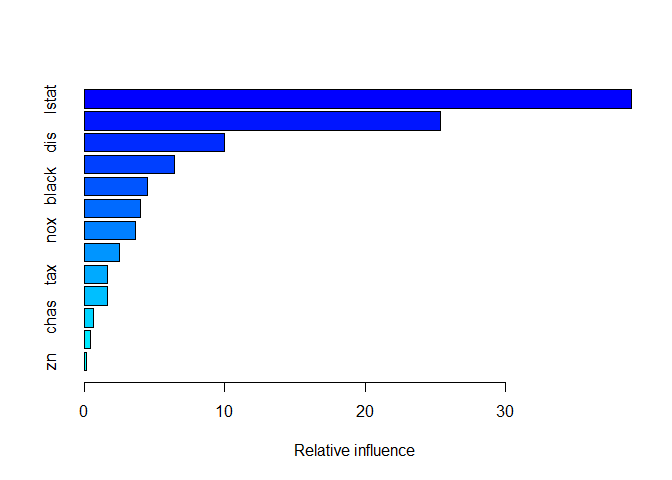<!-- -->

```
##             var    rel.inf
## lstat     lstat 38.9726171
## rm           rm 25.3463087
## dis         dis  9.9651290
## crim       crim  6.4526734
## black     black  4.5367354
## age         age  3.9985809
## nox         nox  3.6256050
## ptratio ptratio  2.5123317
## tax         tax  1.6797030
## indus     indus  1.6485092
## chas       chas  0.6820674
## rad         rad  0.4499396
## zn           zn  0.1297996
```

```r
plot(boost.boston.v,i="lstat")
```

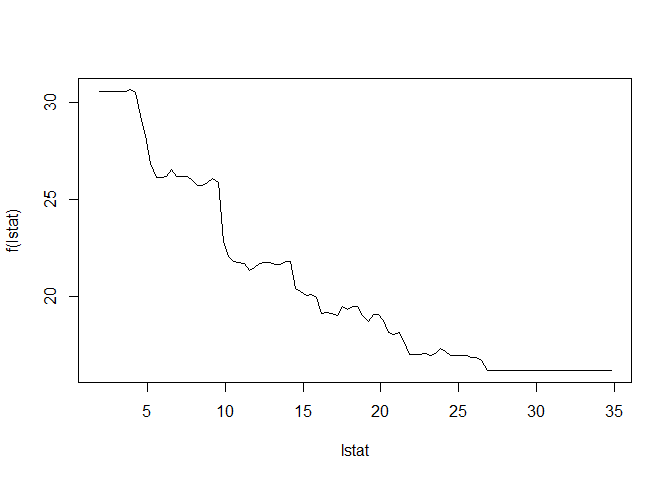<!-- -->

```r
plot(boost.boston.v,i="rm")
```

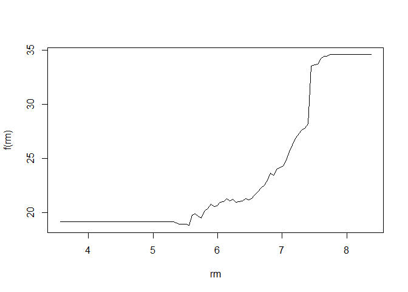<!-- -->

```r
#
set.seed(1)
boost.boston=gbm(medv~.,data=Boston[train,],distribution="gaussian",n.trees=5000,interaction.depth=4)
summary(boost.boston)
```

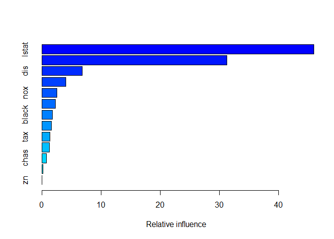<!-- -->

```
##             var    rel.inf
## lstat     lstat 45.9627334
## rm           rm 31.2238187
## dis         dis  6.8087398
## crim       crim  4.0743784
## nox         nox  2.5605001
## ptratio ptratio  2.2748652
## black     black  1.7971159
## age         age  1.6488532
## tax         tax  1.3595005
## indus     indus  1.2705924
## chas       chas  0.8014323
## rad         rad  0.2026619
## zn           zn  0.0148083
```

```r
par(mfrow=c(1,2))
plot(boost.boston,i="rm")
plot(boost.boston,i="lstat")
```

<!-- -->

```r
yhat.boost=predict(boost.boston,newdata=Boston[-train,],n.trees=5000)
mean((yhat.boost-boston.test)^2)
```

```
## [1] 11.84434
```

```r
boost.boston=gbm(medv~.,data=Boston[train,],distribution="gaussian",n.trees=5000,interaction.depth=4,shrinkage=0.2,verbose=F)
yhat.boost=predict(boost.boston,newdata=Boston[-train,],n.trees=5000)
mean((yhat.boost-boston.test)^2)
```

```
## [1] 11.51109
```

```r
#
n.trees=seq(from=100,to=10000,by=100)
predmat=predict(boost.boston,newdata=Boston[-train,],n.trees=n.trees)
```

```
## Warning in predict.gbm(boost.boston, newdata = Boston[-train, ], n.trees
## = n.trees): Number of trees not specified or exceeded number fit so far.
## Using 100 200 300 400 500 600 700 800 900 1000 1100 1200 1300 1400 1500
## 1600 1700 1800 1900 2000 2100 2200 2300 2400 2500 2600 2700 2800 2900 3000
## 3100 3200 3300 3400 3500 3600 3700 3800 3900 4000 4100 4200 4300 4400 4500
## 4600 4700 4800 4900 5000 5000 5000 5000 5000 5000 5000 5000 5000 5000 5000
## 5000 5000 5000 5000 5000 5000 5000 5000 5000 5000 5000 5000 5000 5000 5000
## 5000 5000 5000 5000 5000 5000 5000 5000 5000 5000 5000 5000 5000 5000 5000
## 5000 5000 5000 5000 5000 5000 5000 5000 5000 5000.
```

```r
dim(predmat)
```

```
## [1] 253 100
```

```r
berr=with(Boston[-train,],apply((predmat-medv)^2,2,mean))
plot(n.trees,berr,pch=19,ylab = "Mean squared errors",xlab = "# Trees",main =" Bossting Test Error")
abline(h=min(test.err),col="red")

matplot(1:mtry,cbind(test.err,obb.err),pch = 19,col = c("red","blue"),type = "b",ylab = "Mean squared errors")
legend("topright",legend = c("Test","OOB"),pch = 19,col = c("red","blue"))
abline(h=min(test.err),col="red")
```

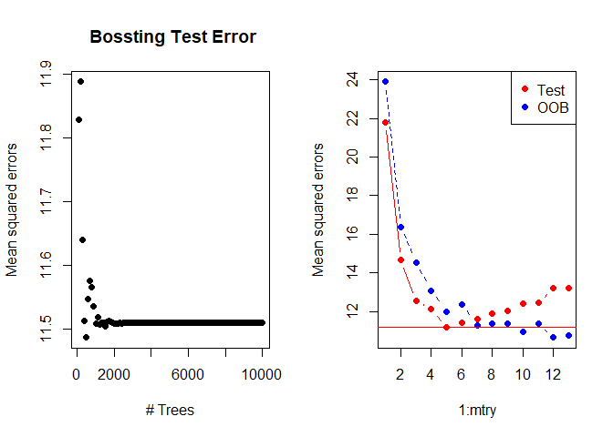<!-- -->

```r
#
```

# 5. Suppose we produce ten bootstrapped samples from a data set containing red and green classes. We then apply a classification tree to each bootstrapped sample and, for a specific value of X, produce 10 estimates of P (Class is Red | X): 
0.1, 0.15, 0.2, 0.2, 0.55, 0.6, 0.6, 0.65, 0.7, and 0.75.

There are two common ways to combine these results together into a
single class prediction. One is the majority vote approach discussed in
this chapter. The second approach is to classify based on the average
probability. In this example, what is the final classification under each
of these two approaches?

# 7. In the lab, we applied random forests to the Boston data using mtry=6 and using ntree=25 and ntree=500. Create a plot displaying the test error resulting from random forests on this data set for a more comprehensive range of values for mtry and ntree. You can model your plot after Figure 8.10. Describe the results obtained.

# 8. In the lab, a classification tree was applied to the Carseats data set after converting Sales into a qualitative response variable. Now we will seek to predict Sales using regression trees and related approaches, treating the response as a quantitative variable. 

## (a) Split the data set into a training set and a test set.


```r
summary(Carseats)
```

```
##      Sales          CompPrice       Income        Advertising    
##  Min.   : 0.000   Min.   : 77   Min.   : 21.00   Min.   : 0.000  
##  1st Qu.: 5.390   1st Qu.:115   1st Qu.: 42.75   1st Qu.: 0.000  
##  Median : 7.490   Median :125   Median : 69.00   Median : 5.000  
##  Mean   : 7.496   Mean   :125   Mean   : 68.66   Mean   : 6.635  
##  3rd Qu.: 9.320   3rd Qu.:135   3rd Qu.: 91.00   3rd Qu.:12.000  
##  Max.   :16.270   Max.   :175   Max.   :120.00   Max.   :29.000  
##    Population        Price        ShelveLoc        Age       
##  Min.   : 10.0   Min.   : 24.0   Bad   : 96   Min.   :25.00  
##  1st Qu.:139.0   1st Qu.:100.0   Good  : 85   1st Qu.:39.75  
##  Median :272.0   Median :117.0   Medium:219   Median :54.50  
##  Mean   :264.8   Mean   :115.8                Mean   :53.32  
##  3rd Qu.:398.5   3rd Qu.:131.0                3rd Qu.:66.00  
##  Max.   :509.0   Max.   :191.0                Max.   :80.00  
##    Education    Urban       US       High    
##  Min.   :10.0   No :118   No :142   No :236  
##  1st Qu.:12.0   Yes:282   Yes:258   Yes:164  
##  Median :14.0                                
##  Mean   :13.9                                
##  3rd Qu.:16.0                                
##  Max.   :18.0
```

```r
set.seed(10)
train=sample(1:nrow(Carseats), 200)
Carseats.test=Carseats[-train,]
Carseats.train=Carseats[train,]
summary(Carseats.test)
```

```
##      Sales          CompPrice         Income        Advertising    
##  Min.   : 0.160   Min.   : 77.0   Min.   : 21.00   Min.   : 0.000  
##  1st Qu.: 5.577   1st Qu.:116.0   1st Qu.: 42.75   1st Qu.: 0.000  
##  Median : 7.415   Median :125.5   Median : 67.00   Median : 5.500  
##  Mean   : 7.503   Mean   :125.4   Mean   : 66.25   Mean   : 6.735  
##  3rd Qu.: 9.320   3rd Qu.:135.0   3rd Qu.: 87.25   3rd Qu.:12.000  
##  Max.   :15.630   Max.   :159.0   Max.   :119.00   Max.   :26.000  
##    Population        Price        ShelveLoc        Age       
##  Min.   : 13.0   Min.   : 24.0   Bad   : 49   Min.   :25.00  
##  1st Qu.:150.2   1st Qu.:101.0   Good  : 39   1st Qu.:41.00  
##  Median :270.5   Median :118.5   Medium:112   Median :54.00  
##  Mean   :263.6   Mean   :115.8                Mean   :53.31  
##  3rd Qu.:376.2   3rd Qu.:131.2                3rd Qu.:65.00  
##  Max.   :509.0   Max.   :171.0                Max.   :80.00  
##    Education     Urban       US       High    
##  Min.   :10.00   No : 51   No : 73   No :120  
##  1st Qu.:12.00   Yes:149   Yes:127   Yes: 80  
##  Median :14.00                                
##  Mean   :13.85                                
##  3rd Qu.:16.00                                
##  Max.   :18.00
```

```r
summary(Carseats.train)
```

```
##      Sales          CompPrice         Income        Advertising    
##  Min.   : 0.000   Min.   : 85.0   Min.   : 21.00   Min.   : 0.000  
##  1st Qu.: 5.322   1st Qu.:114.8   1st Qu.: 43.50   1st Qu.: 0.000  
##  Median : 7.535   Median :124.0   Median : 72.50   Median : 5.000  
##  Mean   : 7.489   Mean   :124.6   Mean   : 71.07   Mean   : 6.535  
##  3rd Qu.: 9.335   3rd Qu.:135.0   3rd Qu.: 93.00   3rd Qu.:11.250  
##  Max.   :16.270   Max.   :175.0   Max.   :120.00   Max.   :29.000  
##    Population        Price        ShelveLoc        Age       
##  Min.   : 10.0   Min.   : 54.0   Bad   : 47   Min.   :25.00  
##  1st Qu.:125.0   1st Qu.: 99.0   Good  : 46   1st Qu.:38.00  
##  Median :277.5   Median :116.0   Medium:107   Median :55.00  
##  Mean   :266.1   Mean   :115.8                Mean   :53.34  
##  3rd Qu.:407.0   3rd Qu.:130.0                3rd Qu.:67.00  
##  Max.   :508.0   Max.   :191.0                Max.   :80.00  
##    Education     Urban       US       High    
##  Min.   :10.00   No : 67   No : 69   No :116  
##  1st Qu.:12.00   Yes:133   Yes:131   Yes: 84  
##  Median :14.00                                
##  Mean   :13.95                                
##  3rd Qu.:16.00                                
##  Max.   :18.00
```

## (b) Fit a regression tree to the training set. Plot the tree, and interpret the results. What test MSE do you obtain?


```r
tree.carseats=tree(Sales~.-High,Carseats,subset=train)
summary(tree.carseats)
```

```
## 
## Regression tree:
## tree(formula = Sales ~ . - High, data = Carseats, subset = train)
## Variables actually used in tree construction:
## [1] "ShelveLoc"   "Price"       "CompPrice"   "Income"      "Age"        
## [6] "Education"   "Advertising" "Population"  "US"         
## Number of terminal nodes:  20 
## Residual mean deviance:  2.463 = 443.3 / 180 
## Distribution of residuals:
##     Min.  1st Qu.   Median     Mean  3rd Qu.     Max. 
## -3.76200 -0.97300 -0.01446  0.00000  0.99810  4.21600
```

```r
plot(tree.carseats);text(tree.carseats,pretty=0)
```

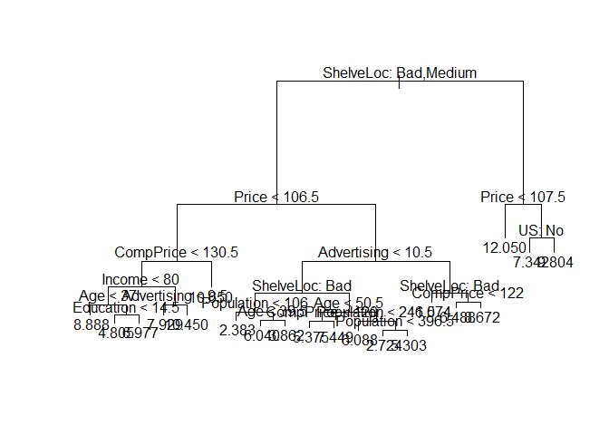<!-- -->

```r
yhat=predict(tree.carseats,newdata=Carseats.test)
Sales.test=Carseats.test$Sales
plot(yhat,Sales.test)
abline(0,1)
```

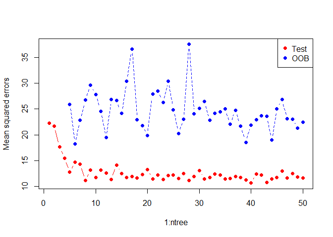<!-- -->

```r
mean((yhat-Sales.test)^2)
```

```
## [1] 4.94415
```

> MSE = 4.94415

## (c) Use cross-validation in order to determine the optimal level of tree complexity. Does pruning the tree improve the test MSE?


```r
cv.carseats=cv.tree(tree.carseats)
cv.carseats
```

```
## $size
##  [1] 20 19 18 17 16 15 14 13 11 10  9  8  7  6  5  4  3  2  1
## 
## $dev
##  [1]  997.5515 1031.4919 1035.5002 1038.2937 1037.9359 1056.8796 1072.7320
##  [8] 1072.7320 1047.9463 1072.2939 1084.8207 1170.8523 1064.1563 1097.1183
## [15] 1157.8819 1248.9363 1250.8952 1380.6619 1649.9659
## 
## $k
##  [1]      -Inf  17.78881  17.88696  18.05873  18.14444  22.99173  23.36162
##  [8]  24.06703  26.05337  28.03038  30.28544  43.00558  52.20374  54.65375
## [15]  76.41667  95.21592  98.65456 167.19459 361.36124
## 
## $method
## [1] "deviance"
## 
## attr(,"class")
## [1] "prune"         "tree.sequence"
```

```r
plot(cv.carseats$size,cv.carseats$dev,type='b')
```

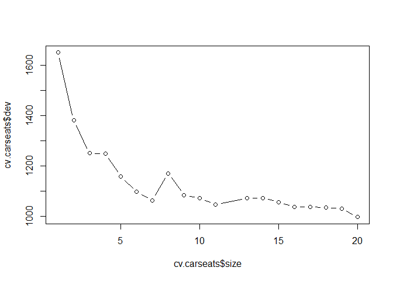<!-- -->

```r
prune.carseats=prune.tree(tree.carseats,best=7)
plot(prune.carseats);text(prune.carseats,pretty=0)
```

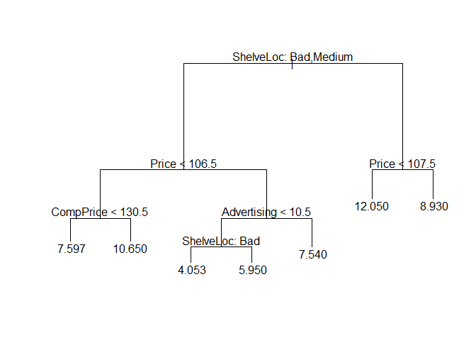<!-- -->

```r
yhat=predict(prune.carseats,newdata=Carseats.test)
Sales.test=Carseats.test$Sales
plot(yhat,Sales.test)
abline(0,1)
```

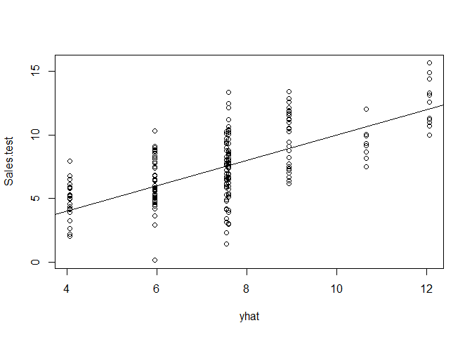<!-- -->

```r
mean((yhat-Sales.test)^2)
```

```
## [1] 4.419579
```

> MSE = 4.419579, better

# 10. We now use boosting to predict Salary in the Hitters data set.

## (a) Remove the observations for whom the salary information is unknown, and then log-transform the salaries.

## (b) Create a training set consisting of the first 200 observations, and a test set consisting of the remaining observations.

## (c) Perform boosting on the training set with 1,000 trees for a range of values of the shrinkage parameter λ. Produce a plot with different shrinkage values on the x-axis and the corresponding training set MSE on the y-axis.

## (d) Produce a plot with different shrinkage values on the x-axis and the corresponding test set MSE on the y-axis.

## (e) Compare the test MSE of boosting to the test MSE that results from applying two of the regression approaches seen in Chapters 3 and 6.

## (f) Which variables appear to be the most important predictors in the boosted model?

## (g) Now apply bagging to the training set. What is the test set MSE for this approach?

# 11. This question uses the Caravan data set.

## (a) Create a training set consisting of the first 1,000 observations, and a test set consisting of the remaining observations.

## (b) Fit a boosting model to the training set with Purchase as the response and the other variables as predictors. Use 1,000 trees, and a shrinkage value of 0.01. Which predictors appear to be the most important?

## (c) Use the boosting model to predict the response on the test data. Predict that a person will make a purchase if the estimated probability of purchase is greater than 20 %. Form a confusion matrix. What fraction of the people predicted to make a purchase do in fact make one? How does this compare with the results obtained from applying KNN or logistic regression to this data set?

# 12. Apply boosting, bagging, and random forests to a data set of your choice. Be sure to fit the models on a training set and to evaluate their performance on a test set. How accurate are the results compared to simple methods like linear or logistic regression? Which of these approaches yields the best performance?
