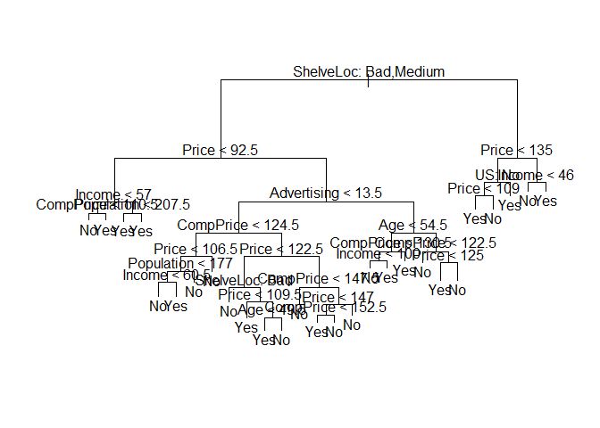
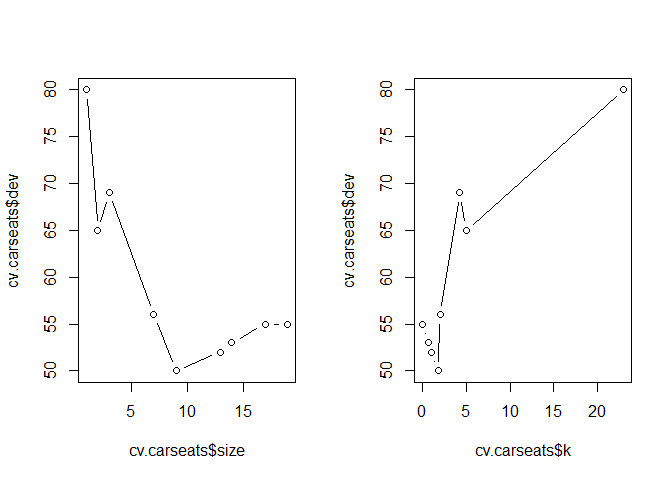
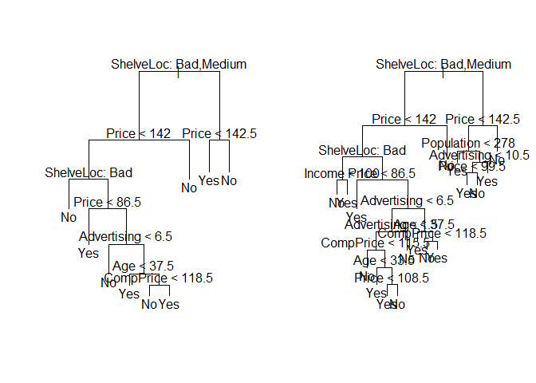
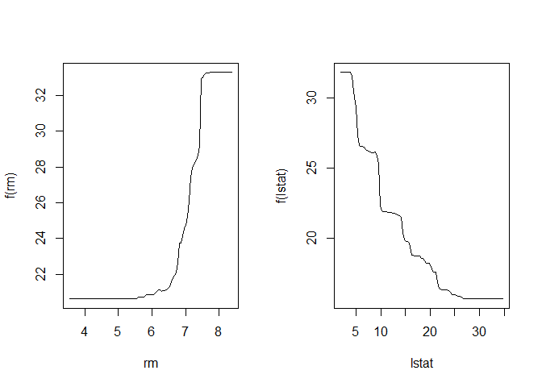

# Chapter 8 Lab: Decision Trees

# Fitting Classification Trees


```r
library(tree)
library(ISLR)
attach(Carseats)
# lab video
hist(Sales)
```

<!-- -->

```r
#
High=ifelse(Sales<=8,"No","Yes")
Carseats=data.frame(Carseats,High)

tree.carseats=tree(High~.-Sales,Carseats)
summary(tree.carseats)
```

```
## 
## Classification tree:
## tree(formula = High ~ . - Sales, data = Carseats)
## Variables actually used in tree construction:
## [1] "ShelveLoc"   "Price"       "Income"      "CompPrice"   "Population" 
## [6] "Advertising" "Age"         "US"         
## Number of terminal nodes:  27 
## Residual mean deviance:  0.4575 = 170.7 / 373 
## Misclassification error rate: 0.09 = 36 / 400
```

```r
plot(tree.carseats);text(tree.carseats,pretty=0)
```

<!-- -->

```r
tree.carseats
```

```
## node), split, n, deviance, yval, (yprob)
##       * denotes terminal node
## 
##   1) root 400 541.500 No ( 0.59000 0.41000 )  
##     2) ShelveLoc: Bad,Medium 315 390.600 No ( 0.68889 0.31111 )  
##       4) Price < 92.5 46  56.530 Yes ( 0.30435 0.69565 )  
##         8) Income < 57 10  12.220 No ( 0.70000 0.30000 )  
##          16) CompPrice < 110.5 5   0.000 No ( 1.00000 0.00000 ) *
##          17) CompPrice > 110.5 5   6.730 Yes ( 0.40000 0.60000 ) *
##         9) Income > 57 36  35.470 Yes ( 0.19444 0.80556 )  
##          18) Population < 207.5 16  21.170 Yes ( 0.37500 0.62500 ) *
##          19) Population > 207.5 20   7.941 Yes ( 0.05000 0.95000 ) *
##       5) Price > 92.5 269 299.800 No ( 0.75465 0.24535 )  
##        10) Advertising < 13.5 224 213.200 No ( 0.81696 0.18304 )  
##          20) CompPrice < 124.5 96  44.890 No ( 0.93750 0.06250 )  
##            40) Price < 106.5 38  33.150 No ( 0.84211 0.15789 )  
##              80) Population < 177 12  16.300 No ( 0.58333 0.41667 )  
##               160) Income < 60.5 6   0.000 No ( 1.00000 0.00000 ) *
##               161) Income > 60.5 6   5.407 Yes ( 0.16667 0.83333 ) *
##              81) Population > 177 26   8.477 No ( 0.96154 0.03846 ) *
##            41) Price > 106.5 58   0.000 No ( 1.00000 0.00000 ) *
##          21) CompPrice > 124.5 128 150.200 No ( 0.72656 0.27344 )  
##            42) Price < 122.5 51  70.680 Yes ( 0.49020 0.50980 )  
##              84) ShelveLoc: Bad 11   6.702 No ( 0.90909 0.09091 ) *
##              85) ShelveLoc: Medium 40  52.930 Yes ( 0.37500 0.62500 )  
##               170) Price < 109.5 16   7.481 Yes ( 0.06250 0.93750 ) *
##               171) Price > 109.5 24  32.600 No ( 0.58333 0.41667 )  
##                 342) Age < 49.5 13  16.050 Yes ( 0.30769 0.69231 ) *
##                 343) Age > 49.5 11   6.702 No ( 0.90909 0.09091 ) *
##            43) Price > 122.5 77  55.540 No ( 0.88312 0.11688 )  
##              86) CompPrice < 147.5 58  17.400 No ( 0.96552 0.03448 ) *
##              87) CompPrice > 147.5 19  25.010 No ( 0.63158 0.36842 )  
##               174) Price < 147 12  16.300 Yes ( 0.41667 0.58333 )  
##                 348) CompPrice < 152.5 7   5.742 Yes ( 0.14286 0.85714 ) *
##                 349) CompPrice > 152.5 5   5.004 No ( 0.80000 0.20000 ) *
##               175) Price > 147 7   0.000 No ( 1.00000 0.00000 ) *
##        11) Advertising > 13.5 45  61.830 Yes ( 0.44444 0.55556 )  
##          22) Age < 54.5 25  25.020 Yes ( 0.20000 0.80000 )  
##            44) CompPrice < 130.5 14  18.250 Yes ( 0.35714 0.64286 )  
##              88) Income < 100 9  12.370 No ( 0.55556 0.44444 ) *
##              89) Income > 100 5   0.000 Yes ( 0.00000 1.00000 ) *
##            45) CompPrice > 130.5 11   0.000 Yes ( 0.00000 1.00000 ) *
##          23) Age > 54.5 20  22.490 No ( 0.75000 0.25000 )  
##            46) CompPrice < 122.5 10   0.000 No ( 1.00000 0.00000 ) *
##            47) CompPrice > 122.5 10  13.860 No ( 0.50000 0.50000 )  
##              94) Price < 125 5   0.000 Yes ( 0.00000 1.00000 ) *
##              95) Price > 125 5   0.000 No ( 1.00000 0.00000 ) *
##     3) ShelveLoc: Good 85  90.330 Yes ( 0.22353 0.77647 )  
##       6) Price < 135 68  49.260 Yes ( 0.11765 0.88235 )  
##        12) US: No 17  22.070 Yes ( 0.35294 0.64706 )  
##          24) Price < 109 8   0.000 Yes ( 0.00000 1.00000 ) *
##          25) Price > 109 9  11.460 No ( 0.66667 0.33333 ) *
##        13) US: Yes 51  16.880 Yes ( 0.03922 0.96078 ) *
##       7) Price > 135 17  22.070 No ( 0.64706 0.35294 )  
##        14) Income < 46 6   0.000 No ( 1.00000 0.00000 ) *
##        15) Income > 46 11  15.160 Yes ( 0.45455 0.54545 ) *
```

```r
set.seed(2)
train=sample(1:nrow(Carseats), 200)
Carseats.test=Carseats[-train,]
High.test=High[-train]
tree.carseats=tree(High~.-Sales,Carseats,subset=train)
#video
plot(tree.carseats);text(tree.carseats,pretty=0)
```

<!-- -->

```r
#

tree.pred=predict(tree.carseats,Carseats.test,type="class")
#video
with(Carseats[-train,],table(tree.pred,High))
```

```
##          High
## tree.pred No Yes
##       No  86  27
##       Yes 30  57
```

```r
#
table(tree.pred,High.test)
```

```
##          High.test
## tree.pred No Yes
##       No  86  27
##       Yes 30  57
```

```r
(86+57)/200
```

```
## [1] 0.715
```

```r
set.seed(3)
cv.carseats=cv.tree(tree.carseats,FUN=prune.misclass)
names(cv.carseats)
```

```
## [1] "size"   "dev"    "k"      "method"
```

```r
cv.carseats
```

```
## $size
## [1] 19 17 14 13  9  7  3  2  1
## 
## $dev
## [1] 55 55 53 52 50 56 69 65 80
## 
## $k
## [1]       -Inf  0.0000000  0.6666667  1.0000000  1.7500000  2.0000000
## [7]  4.2500000  5.0000000 23.0000000
## 
## $method
## [1] "misclass"
## 
## attr(,"class")
## [1] "prune"         "tree.sequence"
```

```r
#video
plot(cv.carseats)
```

<!-- -->

```r
#

par(mfrow=c(1,2))
plot(cv.carseats$size,cv.carseats$dev,type="b")
plot(cv.carseats$k,cv.carseats$dev,type="b")
```

<!-- -->

```r
prune.carseats=prune.misclass(tree.carseats,best=9)
plot(prune.carseats);text(prune.carseats,pretty=0)

#evaluate in test
tree.pred=predict(prune.carseats,Carseats.test,type="class")
table(tree.pred,High.test)
```

```
##          High.test
## tree.pred No Yes
##       No  94  24
##       Yes 22  60
```

```r
(94+60)/200
```

```
## [1] 0.77
```

```r
prune.carseats=prune.misclass(tree.carseats,best=15)
plot(prune.carseats);text(prune.carseats,pretty=0)
```

<!-- -->

```r
tree.pred=predict(prune.carseats,Carseats.test,type="class")
table(tree.pred,High.test)
```

```
##          High.test
## tree.pred No Yes
##       No  86  22
##       Yes 30  62
```

```r
(86+62)/200
```

```
## [1] 0.74
```

# Fitting Regression Trees


```r
library(MASS)
set.seed(1)
train = sample(1:nrow(Boston), nrow(Boston)/2)
tree.boston=tree(medv~.,Boston,subset=train)
summary(tree.boston)
```

```
## 
## Regression tree:
## tree(formula = medv ~ ., data = Boston, subset = train)
## Variables actually used in tree construction:
## [1] "lstat" "rm"    "dis"  
## Number of terminal nodes:  8 
## Residual mean deviance:  12.65 = 3099 / 245 
## Distribution of residuals:
##      Min.   1st Qu.    Median      Mean   3rd Qu.      Max. 
## -14.10000  -2.04200  -0.05357   0.00000   1.96000  12.60000
```

```r
plot(tree.boston);text(tree.boston,pretty=0)
```

<!-- -->

```r
cv.boston=cv.tree(tree.boston)
plot(cv.boston$size,cv.boston$dev,type='b')
```

<!-- -->

```r
prune.boston=prune.tree(tree.boston,best=5)
plot(prune.boston);text(prune.boston,pretty=0)
```

<!-- -->

```r
yhat=predict(tree.boston,newdata=Boston[-train,])
boston.test=Boston[-train,"medv"]
plot(yhat,boston.test)
abline(0,1)
```

<!-- -->

```r
mean((yhat-boston.test)^2)
```

```
## [1] 25.04559
```

# Bagging and Random Forests


```r
library(MASS)
library(randomForest)
```

```
## randomForest 4.6-14
```

```
## Type rfNews() to see new features/changes/bug fixes.
```

```r
#
dim(Boston)
```

```
## [1] 506  14
```

```r
#
set.seed(1)
train = sample(1:nrow(Boston), nrow(Boston)/2)
#
obb.err=double(13)
test.err=double(13)
for(mtry in 1:13){
  fit=randomForest(medv~.,data=Boston,subset=train,mtry=mtry,ntree=400)
  obb.err[mtry]=fit$mse[400]
  pred=predict(fit,Boston[-train,])
  test.err[mtry]=with(Boston[-train,],mean((medv-pred)^2))
  cat(mtry," ")
}
```

```
## 1  2  3  4  5  6  7  8  9  10  11  12  13
```

```r
matplot(1:mtry,cbind(test.err,obb.err),pch = 19,col = c("red","blue"),type = "b",ylab = "Mean squared errors")
legend("topright",legend = c("Test","OOB"),pch = 19,col = c("red","blue"))
```

<!-- -->

```r
#

bag.boston=randomForest(medv~.,data=Boston,subset=train,mtry=13,importance=TRUE)
bag.boston
```

```
## 
## Call:
##  randomForest(formula = medv ~ ., data = Boston, mtry = 13, importance = TRUE,      subset = train) 
##                Type of random forest: regression
##                      Number of trees: 500
## No. of variables tried at each split: 13
## 
##           Mean of squared residuals: 10.31237
##                     % Var explained: 87.51
```

```r
yhat.bag = predict(bag.boston,newdata=Boston[-train,])
plot(yhat.bag, boston.test)
abline(0,1)
```

<!-- -->

```r
mean((yhat.bag-boston.test)^2)
```

```
## [1] 13.26379
```

```r
bag.boston=randomForest(medv~.,data=Boston,subset=train,mtry=13,ntree=25)
yhat.bag = predict(bag.boston,newdata=Boston[-train,])
mean((yhat.bag-boston.test)^2)
```

```
## [1] 15.20602
```

```r
set.seed(1)
rf.boston=randomForest(medv~.,data=Boston,subset=train,mtry=6,importance=TRUE)
yhat.rf = predict(rf.boston,newdata=Boston[-train,])
mean((yhat.rf-boston.test)^2)
```

```
## [1] 11.66454
```

```r
importance(rf.boston)
```

```
##           %IncMSE IncNodePurity
## crim    12.132320     986.50338
## zn       1.955579      57.96945
## indus    9.069302     882.78261
## chas     2.210835      45.22941
## nox     11.104823    1044.33776
## rm      31.784033    6359.31971
## age     10.962684     516.82969
## dis     15.015236    1224.11605
## rad      4.118011      95.94586
## tax      8.587932     502.96719
## ptratio 12.503896     830.77523
## black    6.702609     341.30361
## lstat   30.695224    7505.73936
```

```r
varImpPlot(rf.boston)
```

<!-- -->

# Boosting


```r
library(gbm)
```

```
## Loading required package: survival
```

```
## Loading required package: lattice
```

```
## Loading required package: splines
```

```
## Loading required package: parallel
```

```
## Loaded gbm 2.1.3
```

```r
#
boost.boston.v=gbm(medv~.,data=Boston[train,],distribution="gaussian",n.trees=10000,shrinkage = 0.01,interaction.depth=4)
summary(boost.boston.v)
```

<!-- -->

```
##             var    rel.inf
## lstat     lstat 38.9726171
## rm           rm 25.3463087
## dis         dis  9.9651290
## crim       crim  6.4526734
## black     black  4.5367354
## age         age  3.9985809
## nox         nox  3.6256050
## ptratio ptratio  2.5123317
## tax         tax  1.6797030
## indus     indus  1.6485092
## chas       chas  0.6820674
## rad         rad  0.4499396
## zn           zn  0.1297996
```

```r
plot(boost.boston.v,i="lstat")
```

<!-- -->

```r
plot(boost.boston.v,i="rm")
```

<!-- -->

```r
#

set.seed(1)
boost.boston=gbm(medv~.,data=Boston[train,],distribution="gaussian",n.trees=5000,interaction.depth=4)
summary(boost.boston)
```

<!-- -->

```
##             var    rel.inf
## lstat     lstat 45.9627334
## rm           rm 31.2238187
## dis         dis  6.8087398
## crim       crim  4.0743784
## nox         nox  2.5605001
## ptratio ptratio  2.2748652
## black     black  1.7971159
## age         age  1.6488532
## tax         tax  1.3595005
## indus     indus  1.2705924
## chas       chas  0.8014323
## rad         rad  0.2026619
## zn           zn  0.0148083
```

```r
par(mfrow=c(1,2))
plot(boost.boston,i="rm")
plot(boost.boston,i="lstat")
```

<!-- -->

```r
yhat.boost=predict(boost.boston,newdata=Boston[-train,],n.trees=5000)
mean((yhat.boost-boston.test)^2)
```

```
## [1] 11.84434
```

```r
boost.boston=gbm(medv~.,data=Boston[train,],distribution="gaussian",n.trees=5000,interaction.depth=4,shrinkage=0.2,verbose=F)
yhat.boost=predict(boost.boston,newdata=Boston[-train,],n.trees=5000)
mean((yhat.boost-boston.test)^2)
```

```
## [1] 11.51109
```

```r
#
n.trees=seq(from=100,to=10000,by=100)
predmat=predict(boost.boston,newdata=Boston[-train,],n.trees=n.trees)
```

```
## Warning in predict.gbm(boost.boston, newdata = Boston[-train, ], n.trees
## = n.trees): Number of trees not specified or exceeded number fit so far.
## Using 100 200 300 400 500 600 700 800 900 1000 1100 1200 1300 1400 1500
## 1600 1700 1800 1900 2000 2100 2200 2300 2400 2500 2600 2700 2800 2900 3000
## 3100 3200 3300 3400 3500 3600 3700 3800 3900 4000 4100 4200 4300 4400 4500
## 4600 4700 4800 4900 5000 5000 5000 5000 5000 5000 5000 5000 5000 5000 5000
## 5000 5000 5000 5000 5000 5000 5000 5000 5000 5000 5000 5000 5000 5000 5000
## 5000 5000 5000 5000 5000 5000 5000 5000 5000 5000 5000 5000 5000 5000 5000
## 5000 5000 5000 5000 5000 5000 5000 5000 5000 5000.
```

```r
dim(predmat)
```

```
## [1] 253 100
```

```r
berr=with(Boston[-train,],apply((predmat-medv)^2,2,mean))
plot(n.trees,berr,pch=19,ylab = "Mean squared errors",xlab = "# Trees",main =" Bossting Test Error")
abline(h=min(test.err),col="red")

matplot(1:mtry,cbind(test.err,obb.err),pch = 19,col = c("red","blue"),type = "b",ylab = "Mean squared errors")
legend("topright",legend = c("Test","OOB"),pch = 19,col = c("red","blue"))
abline(h=min(test.err),col="red")
```

<!-- -->

```r
#
```

# 5. Suppose we produce ten bootstrapped samples from a data set containing red and green classes. We then apply a classification tree to each bootstrapped sample and, for a specific value of X, produce 10 estimates of P (Class is Red | X): 
0.1, 0.15, 0.2, 0.2, 0.55, 0.6, 0.6, 0.65, 0.7, and 0.75.

There are two common ways to combine these results together into a
single class prediction. One is the majority vote approach discussed in
this chapter. The second approach is to classify based on the average
probability. In this example, what is the final classification under each
of these two approaches?


```r
# The second approach
X=c(0.1, 0.15, 0.2, 0.2, 0.55, 0.6, 0.6, 0.65, 0.7, 0.75)
sum(X)/10
```

```
## [1] 0.45
```

> By the first approach (if classification is the goal), the final classification is red.
> By the second approach (if regression is the goal), the final classification is green.

# 7. In the lab, we applied random forests to the Boston data using mtry=6 and using ntree=25 and ntree=500. Create a plot displaying the test error resulting from random forests on this data set for a more comprehensive range of values for mtry and ntree. You can model your plot after Figure 8.10. Describe the results obtained.


```r
library(MASS)
library(randomForest)
dim(Boston)
```

```
## [1] 506  14
```

```r
set.seed(1)
train = sample(1:nrow(Boston), nrow(Boston)/2)
#mtry
obb.err=double(13)
test.err=double(13)
for(mtry in 1:13){
  fit=randomForest(medv~.,data=Boston,subset=train,mtry=mtry,ntree=400)
  obb.err[mtry]=fit$mse[400]
  pred=predict(fit,Boston[-train,])
  test.err[mtry]=with(Boston[-train,],mean((medv-pred)^2))
  cat(mtry," ")
}
```

```
## 1  2  3  4  5  6  7  8  9  10  11  12  13
```

```r
matplot(1:mtry,cbind(test.err,obb.err),pch = 19,col = c("red","blue"),type = "b",ylab = "Mean squared errors")
legend("topright",legend = c("Test","OOB"),pch = 19,col = c("red","blue"))
```

<!-- -->

```r
#
#ntree
obb.err2=double(10)
test.err2=double(10)
for(ntree in 1:50){
  fit=randomForest(medv~.,data=Boston,subset=train,mtry=5,ntree=ntree)
  obb.err2[ntree]=fit$mse[5]
  pred2=predict(fit,Boston[-train,])
  test.err2[ntree]=with(Boston[-train,],mean((medv-pred2)^2))
  cat(ntree," ")
}
```

```
## 1  2  3  4  5  6  7  8  9  10  11  12  13  14  15  16  17  18  19  20  21  22  23  24  25  26  27  28  29  30  31  32  33  34  35  36  37  38  39  40  41  42  43  44  45  46  47  48  49  50
```

```r
matplot(1:ntree,cbind(test.err2,obb.err2),pch = 19,col = c("red","blue"),type = "b",ylab = "Mean squared errors")
legend("topright",legend = c("Test","OOB"),pch = 19,col = c("red","blue"))
```

<!-- -->

```r
#
```


# 8. In the lab, a classification tree was applied to the Carseats data set after converting Sales into a qualitative response variable. Now we will seek to predict Sales using regression trees and related approaches, treating the response as a quantitative variable. 

## (a) Split the data set into a training set and a test set.


```r
summary(Carseats)
```

```
##      Sales          CompPrice       Income        Advertising    
##  Min.   : 0.000   Min.   : 77   Min.   : 21.00   Min.   : 0.000  
##  1st Qu.: 5.390   1st Qu.:115   1st Qu.: 42.75   1st Qu.: 0.000  
##  Median : 7.490   Median :125   Median : 69.00   Median : 5.000  
##  Mean   : 7.496   Mean   :125   Mean   : 68.66   Mean   : 6.635  
##  3rd Qu.: 9.320   3rd Qu.:135   3rd Qu.: 91.00   3rd Qu.:12.000  
##  Max.   :16.270   Max.   :175   Max.   :120.00   Max.   :29.000  
##    Population        Price        ShelveLoc        Age       
##  Min.   : 10.0   Min.   : 24.0   Bad   : 96   Min.   :25.00  
##  1st Qu.:139.0   1st Qu.:100.0   Good  : 85   1st Qu.:39.75  
##  Median :272.0   Median :117.0   Medium:219   Median :54.50  
##  Mean   :264.8   Mean   :115.8                Mean   :53.32  
##  3rd Qu.:398.5   3rd Qu.:131.0                3rd Qu.:66.00  
##  Max.   :509.0   Max.   :191.0                Max.   :80.00  
##    Education    Urban       US       High    
##  Min.   :10.0   No :118   No :142   No :236  
##  1st Qu.:12.0   Yes:282   Yes:258   Yes:164  
##  Median :14.0                                
##  Mean   :13.9                                
##  3rd Qu.:16.0                                
##  Max.   :18.0
```

```r
set.seed(10)
train=sample(1:nrow(Carseats), 200)
Carseats.test=Carseats[-train,]
Carseats.train=Carseats[train,]
summary(Carseats.test)
```

```
##      Sales          CompPrice         Income        Advertising    
##  Min.   : 0.160   Min.   : 77.0   Min.   : 21.00   Min.   : 0.000  
##  1st Qu.: 5.577   1st Qu.:116.0   1st Qu.: 42.75   1st Qu.: 0.000  
##  Median : 7.415   Median :125.5   Median : 67.00   Median : 5.500  
##  Mean   : 7.503   Mean   :125.4   Mean   : 66.25   Mean   : 6.735  
##  3rd Qu.: 9.320   3rd Qu.:135.0   3rd Qu.: 87.25   3rd Qu.:12.000  
##  Max.   :15.630   Max.   :159.0   Max.   :119.00   Max.   :26.000  
##    Population        Price        ShelveLoc        Age       
##  Min.   : 13.0   Min.   : 24.0   Bad   : 49   Min.   :25.00  
##  1st Qu.:150.2   1st Qu.:101.0   Good  : 39   1st Qu.:41.00  
##  Median :270.5   Median :118.5   Medium:112   Median :54.00  
##  Mean   :263.6   Mean   :115.8                Mean   :53.31  
##  3rd Qu.:376.2   3rd Qu.:131.2                3rd Qu.:65.00  
##  Max.   :509.0   Max.   :171.0                Max.   :80.00  
##    Education     Urban       US       High    
##  Min.   :10.00   No : 51   No : 73   No :120  
##  1st Qu.:12.00   Yes:149   Yes:127   Yes: 80  
##  Median :14.00                                
##  Mean   :13.85                                
##  3rd Qu.:16.00                                
##  Max.   :18.00
```

```r
summary(Carseats.train)
```

```
##      Sales          CompPrice         Income        Advertising    
##  Min.   : 0.000   Min.   : 85.0   Min.   : 21.00   Min.   : 0.000  
##  1st Qu.: 5.322   1st Qu.:114.8   1st Qu.: 43.50   1st Qu.: 0.000  
##  Median : 7.535   Median :124.0   Median : 72.50   Median : 5.000  
##  Mean   : 7.489   Mean   :124.6   Mean   : 71.07   Mean   : 6.535  
##  3rd Qu.: 9.335   3rd Qu.:135.0   3rd Qu.: 93.00   3rd Qu.:11.250  
##  Max.   :16.270   Max.   :175.0   Max.   :120.00   Max.   :29.000  
##    Population        Price        ShelveLoc        Age       
##  Min.   : 10.0   Min.   : 54.0   Bad   : 47   Min.   :25.00  
##  1st Qu.:125.0   1st Qu.: 99.0   Good  : 46   1st Qu.:38.00  
##  Median :277.5   Median :116.0   Medium:107   Median :55.00  
##  Mean   :266.1   Mean   :115.8                Mean   :53.34  
##  3rd Qu.:407.0   3rd Qu.:130.0                3rd Qu.:67.00  
##  Max.   :508.0   Max.   :191.0                Max.   :80.00  
##    Education     Urban       US       High    
##  Min.   :10.00   No : 67   No : 69   No :116  
##  1st Qu.:12.00   Yes:133   Yes:131   Yes: 84  
##  Median :14.00                                
##  Mean   :13.95                                
##  3rd Qu.:16.00                                
##  Max.   :18.00
```

## (b) Fit a regression tree to the training set. Plot the tree, and interpret the results. What test MSE do you obtain?


```r
tree.carseats=tree(Sales~.-High,Carseats,subset=train)
summary(tree.carseats)
```

```
## 
## Regression tree:
## tree(formula = Sales ~ . - High, data = Carseats, subset = train)
## Variables actually used in tree construction:
## [1] "ShelveLoc"   "Price"       "CompPrice"   "Income"      "Age"        
## [6] "Education"   "Advertising" "Population"  "US"         
## Number of terminal nodes:  20 
## Residual mean deviance:  2.463 = 443.3 / 180 
## Distribution of residuals:
##     Min.  1st Qu.   Median     Mean  3rd Qu.     Max. 
## -3.76200 -0.97300 -0.01446  0.00000  0.99810  4.21600
```

```r
plot(tree.carseats);text(tree.carseats,pretty=0)
```

<!-- -->

```r
yhat=predict(tree.carseats,newdata=Carseats.test)
Sales.test=Carseats.test$Sales
plot(yhat,Sales.test)
abline(0,1)
```

<!-- -->

```r
mean((yhat-Sales.test)^2)
```

```
## [1] 4.94415
```

> MSE = 4.94415

## (c) Use cross-validation in order to determine the optimal level of tree complexity. Does pruning the tree improve the test MSE?


```r
cv.carseats=cv.tree(tree.carseats)
cv.carseats
```

```
## $size
##  [1] 20 19 18 17 16 15 14 13 11 10  9  8  7  6  5  4  3  2  1
## 
## $dev
##  [1]  997.5515 1031.4919 1035.5002 1038.2937 1037.9359 1056.8796 1072.7320
##  [8] 1072.7320 1047.9463 1072.2939 1084.8207 1170.8523 1064.1563 1097.1183
## [15] 1157.8819 1248.9363 1250.8952 1380.6619 1649.9659
## 
## $k
##  [1]      -Inf  17.78881  17.88696  18.05873  18.14444  22.99173  23.36162
##  [8]  24.06703  26.05337  28.03038  30.28544  43.00558  52.20374  54.65375
## [15]  76.41667  95.21592  98.65456 167.19459 361.36124
## 
## $method
## [1] "deviance"
## 
## attr(,"class")
## [1] "prune"         "tree.sequence"
```

```r
plot(cv.carseats$size,cv.carseats$dev,type='b')
```

<!-- -->

```r
prune.carseats=prune.tree(tree.carseats,best=7)
plot(prune.carseats);text(prune.carseats,pretty=0)
```

<!-- -->

```r
yhat=predict(prune.carseats,newdata=Carseats.test)
Sales.test=Carseats.test$Sales
plot(yhat,Sales.test)
abline(0,1)
```

<!-- -->

```r
mean((yhat-Sales.test)^2)
```

```
## [1] 4.419579
```

> MSE = 4.419579, better

## (d) Use the bagging approach in order to analyze this data. What test MSE do you obtain? Use the importance() function to determine which variables are most important.


```r
set.seed(1)
rf.carseats=randomForest(Sales~.-High,data=Carseats.train,mtry=10,importance=TRUE)
yhat.rf=predict(rf.carseats,newdata=Carseats.test)
mean((yhat.rf-Sales.test)^2)
```

```
## [1] 2.250674
```

```r
importance(rf.carseats)
```

```
##                %IncMSE IncNodePurity
## CompPrice   20.4199056    157.984440
## Income       8.7650043    103.320300
## Advertising 23.1513675    187.914517
## Population   1.3360011     61.047517
## Price       48.7851374    462.533517
## ShelveLoc   50.4473695    435.938666
## Age          9.6626995    113.959640
## Education    3.8671822     52.845173
## Urban       -0.5692085      6.574594
## US           1.9598781     12.023973
```

```r
varImpPlot(rf.carseats)
```

<!-- -->


## (e) Use random forests to analyze this data. What test MSE do you obtain? Use the importance() function to determine which variables are most important. Describe the effect of m, the number of variables considered at each split, on the error rate obtained.


```r
set.seed(1)
rf.carseats=randomForest(Sales~.-High,data=Carseats.train,importance=TRUE)
yhat.rf=predict(rf.carseats,newdata=Carseats.test)
mean((yhat.rf-Sales.test)^2)
```

```
## [1] 2.922907
```

```r
importance(rf.carseats)
```

```
##                %IncMSE IncNodePurity
## CompPrice    9.2817931     139.03194
## Income       4.9926014     152.43563
## Advertising 16.2341682     177.60728
## Population  -1.2015607     109.93106
## Price       31.4315990     370.72587
## ShelveLoc   35.7355118     324.37787
## Age          7.0462353     161.81154
## Education   -0.8271390      69.74261
## Urban        0.2101922      14.18596
## US           2.9645852      21.82999
```

```r
varImpPlot(rf.carseats)
```

<!-- -->


# 10. We now use boosting to predict Salary in the Hitters data set.

## (a) Remove the observations for whom the salary information is unknown, and then log-transform the salaries.


```r
library(ISLR)
summary(Hitters)
```

```
##      AtBat            Hits         HmRun            Runs       
##  Min.   : 16.0   Min.   :  1   Min.   : 0.00   Min.   :  0.00  
##  1st Qu.:255.2   1st Qu.: 64   1st Qu.: 4.00   1st Qu.: 30.25  
##  Median :379.5   Median : 96   Median : 8.00   Median : 48.00  
##  Mean   :380.9   Mean   :101   Mean   :10.77   Mean   : 50.91  
##  3rd Qu.:512.0   3rd Qu.:137   3rd Qu.:16.00   3rd Qu.: 69.00  
##  Max.   :687.0   Max.   :238   Max.   :40.00   Max.   :130.00  
##                                                                
##       RBI             Walks            Years            CAtBat       
##  Min.   :  0.00   Min.   :  0.00   Min.   : 1.000   Min.   :   19.0  
##  1st Qu.: 28.00   1st Qu.: 22.00   1st Qu.: 4.000   1st Qu.:  816.8  
##  Median : 44.00   Median : 35.00   Median : 6.000   Median : 1928.0  
##  Mean   : 48.03   Mean   : 38.74   Mean   : 7.444   Mean   : 2648.7  
##  3rd Qu.: 64.75   3rd Qu.: 53.00   3rd Qu.:11.000   3rd Qu.: 3924.2  
##  Max.   :121.00   Max.   :105.00   Max.   :24.000   Max.   :14053.0  
##                                                                      
##      CHits            CHmRun           CRuns             CRBI        
##  Min.   :   4.0   Min.   :  0.00   Min.   :   1.0   Min.   :   0.00  
##  1st Qu.: 209.0   1st Qu.: 14.00   1st Qu.: 100.2   1st Qu.:  88.75  
##  Median : 508.0   Median : 37.50   Median : 247.0   Median : 220.50  
##  Mean   : 717.6   Mean   : 69.49   Mean   : 358.8   Mean   : 330.12  
##  3rd Qu.:1059.2   3rd Qu.: 90.00   3rd Qu.: 526.2   3rd Qu.: 426.25  
##  Max.   :4256.0   Max.   :548.00   Max.   :2165.0   Max.   :1659.00  
##                                                                      
##      CWalks        League  Division    PutOuts          Assists     
##  Min.   :   0.00   A:175   E:157    Min.   :   0.0   Min.   :  0.0  
##  1st Qu.:  67.25   N:147   W:165    1st Qu.: 109.2   1st Qu.:  7.0  
##  Median : 170.50                    Median : 212.0   Median : 39.5  
##  Mean   : 260.24                    Mean   : 288.9   Mean   :106.9  
##  3rd Qu.: 339.25                    3rd Qu.: 325.0   3rd Qu.:166.0  
##  Max.   :1566.00                    Max.   :1378.0   Max.   :492.0  
##                                                                     
##      Errors          Salary       NewLeague
##  Min.   : 0.00   Min.   :  67.5   A:176    
##  1st Qu.: 3.00   1st Qu.: 190.0   N:146    
##  Median : 6.00   Median : 425.0            
##  Mean   : 8.04   Mean   : 535.9            
##  3rd Qu.:11.00   3rd Qu.: 750.0            
##  Max.   :32.00   Max.   :2460.0            
##                  NA's   :59
```

```r
new.Hitters=na.omit(Hitters)
summary(new.Hitters)
```

```
##      AtBat            Hits           HmRun            Runs       
##  Min.   : 19.0   Min.   :  1.0   Min.   : 0.00   Min.   :  0.00  
##  1st Qu.:282.5   1st Qu.: 71.5   1st Qu.: 5.00   1st Qu.: 33.50  
##  Median :413.0   Median :103.0   Median : 9.00   Median : 52.00  
##  Mean   :403.6   Mean   :107.8   Mean   :11.62   Mean   : 54.75  
##  3rd Qu.:526.0   3rd Qu.:141.5   3rd Qu.:18.00   3rd Qu.: 73.00  
##  Max.   :687.0   Max.   :238.0   Max.   :40.00   Max.   :130.00  
##       RBI             Walks            Years            CAtBat       
##  Min.   :  0.00   Min.   :  0.00   Min.   : 1.000   Min.   :   19.0  
##  1st Qu.: 30.00   1st Qu.: 23.00   1st Qu.: 4.000   1st Qu.:  842.5  
##  Median : 47.00   Median : 37.00   Median : 6.000   Median : 1931.0  
##  Mean   : 51.49   Mean   : 41.11   Mean   : 7.312   Mean   : 2657.5  
##  3rd Qu.: 71.00   3rd Qu.: 57.00   3rd Qu.:10.000   3rd Qu.: 3890.5  
##  Max.   :121.00   Max.   :105.00   Max.   :24.000   Max.   :14053.0  
##      CHits            CHmRun           CRuns             CRBI       
##  Min.   :   4.0   Min.   :  0.00   Min.   :   2.0   Min.   :   3.0  
##  1st Qu.: 212.0   1st Qu.: 15.00   1st Qu.: 105.5   1st Qu.:  95.0  
##  Median : 516.0   Median : 40.00   Median : 250.0   Median : 230.0  
##  Mean   : 722.2   Mean   : 69.24   Mean   : 361.2   Mean   : 330.4  
##  3rd Qu.:1054.0   3rd Qu.: 92.50   3rd Qu.: 497.5   3rd Qu.: 424.5  
##  Max.   :4256.0   Max.   :548.00   Max.   :2165.0   Max.   :1659.0  
##      CWalks       League  Division    PutOuts          Assists     
##  Min.   :   1.0   A:139   E:129    Min.   :   0.0   Min.   :  0.0  
##  1st Qu.:  71.0   N:124   W:134    1st Qu.: 113.5   1st Qu.:  8.0  
##  Median : 174.0                    Median : 224.0   Median : 45.0  
##  Mean   : 260.3                    Mean   : 290.7   Mean   :118.8  
##  3rd Qu.: 328.5                    3rd Qu.: 322.5   3rd Qu.:192.0  
##  Max.   :1566.0                    Max.   :1377.0   Max.   :492.0  
##      Errors           Salary       NewLeague
##  Min.   : 0.000   Min.   :  67.5   A:141    
##  1st Qu.: 3.000   1st Qu.: 190.0   N:122    
##  Median : 7.000   Median : 425.0            
##  Mean   : 8.593   Mean   : 535.9            
##  3rd Qu.:13.000   3rd Qu.: 750.0            
##  Max.   :32.000   Max.   :2460.0
```

```r
logSalary=log(new.Hitters$Salary)
new.Hitters2=data.frame(new.Hitters,logSalary)
summary(new.Hitters2)
```

```
##      AtBat            Hits           HmRun            Runs       
##  Min.   : 19.0   Min.   :  1.0   Min.   : 0.00   Min.   :  0.00  
##  1st Qu.:282.5   1st Qu.: 71.5   1st Qu.: 5.00   1st Qu.: 33.50  
##  Median :413.0   Median :103.0   Median : 9.00   Median : 52.00  
##  Mean   :403.6   Mean   :107.8   Mean   :11.62   Mean   : 54.75  
##  3rd Qu.:526.0   3rd Qu.:141.5   3rd Qu.:18.00   3rd Qu.: 73.00  
##  Max.   :687.0   Max.   :238.0   Max.   :40.00   Max.   :130.00  
##       RBI             Walks            Years            CAtBat       
##  Min.   :  0.00   Min.   :  0.00   Min.   : 1.000   Min.   :   19.0  
##  1st Qu.: 30.00   1st Qu.: 23.00   1st Qu.: 4.000   1st Qu.:  842.5  
##  Median : 47.00   Median : 37.00   Median : 6.000   Median : 1931.0  
##  Mean   : 51.49   Mean   : 41.11   Mean   : 7.312   Mean   : 2657.5  
##  3rd Qu.: 71.00   3rd Qu.: 57.00   3rd Qu.:10.000   3rd Qu.: 3890.5  
##  Max.   :121.00   Max.   :105.00   Max.   :24.000   Max.   :14053.0  
##      CHits            CHmRun           CRuns             CRBI       
##  Min.   :   4.0   Min.   :  0.00   Min.   :   2.0   Min.   :   3.0  
##  1st Qu.: 212.0   1st Qu.: 15.00   1st Qu.: 105.5   1st Qu.:  95.0  
##  Median : 516.0   Median : 40.00   Median : 250.0   Median : 230.0  
##  Mean   : 722.2   Mean   : 69.24   Mean   : 361.2   Mean   : 330.4  
##  3rd Qu.:1054.0   3rd Qu.: 92.50   3rd Qu.: 497.5   3rd Qu.: 424.5  
##  Max.   :4256.0   Max.   :548.00   Max.   :2165.0   Max.   :1659.0  
##      CWalks       League  Division    PutOuts          Assists     
##  Min.   :   1.0   A:139   E:129    Min.   :   0.0   Min.   :  0.0  
##  1st Qu.:  71.0   N:124   W:134    1st Qu.: 113.5   1st Qu.:  8.0  
##  Median : 174.0                    Median : 224.0   Median : 45.0  
##  Mean   : 260.3                    Mean   : 290.7   Mean   :118.8  
##  3rd Qu.: 328.5                    3rd Qu.: 322.5   3rd Qu.:192.0  
##  Max.   :1566.0                    Max.   :1377.0   Max.   :492.0  
##      Errors           Salary       NewLeague   logSalary    
##  Min.   : 0.000   Min.   :  67.5   A:141     Min.   :4.212  
##  1st Qu.: 3.000   1st Qu.: 190.0   N:122     1st Qu.:5.247  
##  Median : 7.000   Median : 425.0             Median :6.052  
##  Mean   : 8.593   Mean   : 535.9             Mean   :5.927  
##  3rd Qu.:13.000   3rd Qu.: 750.0             3rd Qu.:6.620  
##  Max.   :32.000   Max.   :2460.0             Max.   :7.808
```


## (b) Create a training set consisting of the first 200 observations, and a test set consisting of the remaining observations.


```r
dim(new.Hitters2)
```

```
## [1] 263  21
```

```r
new.hitters.train=new.Hitters2[1:200,]
new.hitters.test=new.Hitters2[201:nrow(new.Hitters2),]
dim(new.hitters.train)
```

```
## [1] 200  21
```

```r
dim(new.hitters.test)
```

```
## [1] 63 21
```


## (c) Perform boosting on the training set with 1,000 trees for a range of values of the shrinkage parameter λ. Produce a plot with different shrinkage values on the x-axis and the corresponding training set MSE on the y-axis.


```r
library(gbm)
shrinkage=seq(0.001,0.2,0.001)
train.err=double(200)
test.err=double(200)
for(s in shrinkage){
  boost.hitters=gbm(logSalary~.-Salary, data=new.hitters.train, distribution="gaussian", n.trees=1000, shrinkage=s)
  yhat.boost=predict(boost.hitters, newdata=new.hitters.test, n.trees=1000)
  train.err[s*1000] <- mean((boost.hitters$train.error)^2)
  test.err[s*1000] <- mean((yhat.boost-new.hitters.test$logSalary)^2)
}
plot(data.frame(shrinkage,train.err),type = "b",ylab = "Mean squared errors")
```

<!-- -->


## (d) Produce a plot with different shrinkage values on the x-axis and the corresponding test set MSE on the y-axis.


```r
plot(data.frame(shrinkage,test.err),type = "l",ylab = "Mean squared errors")
```

<!-- -->


## (e) Compare the test MSE of boosting to the test MSE that results from applying two of the regression approaches seen in Chapters 3 and 6.


```r
set.seed(1)
boost.hitters=gbm(logSalary~.-Salary, data=new.hitters.train, distribution="gaussian", n.trees=1000, shrinkage=0.01)
yhat.boost <- predict(boost.hitters, newdata=new.hitters.test, n.trees = 1000)
mean((yhat.boost - new.hitters.test$logSalary)^2)
```

```
## [1] 0.2803223
```

```r
hitters.lm=lm(logSalary ~ .-Salary, data=new.hitters.train)
yhat.lm=predict(hitters.lm, newdata=new.hitters.test)
mean((yhat.lm - new.hitters.test$logSalary)^2)
```

```
## [1] 0.4917959
```


## (f) Which variables appear to be the most important predictors in the boosted model?


```r
summary(boost.hitters)
```

<!-- -->

```
##                 var    rel.inf
## CAtBat       CAtBat 27.3054217
## CHits         CHits 11.1342066
## CRBI           CRBI 10.4738117
## CWalks       CWalks  8.5854670
## CRuns         CRuns  7.9895047
## Years         Years  6.1452125
## CHmRun       CHmRun  5.7226448
## Hits           Hits  4.7410655
## Walks         Walks  3.9378531
## RBI             RBI  3.6359708
## PutOuts     PutOuts  2.9766872
## AtBat         AtBat  2.0255320
## HmRun         HmRun  1.4556220
## Errors       Errors  1.2362298
## Runs           Runs  0.9874552
## Assists     Assists  0.8528629
## Division   Division  0.5232692
## NewLeague NewLeague  0.1488451
## League       League  0.1223383
```


## (g) Now apply bagging to the training set. What is the test set MSE for this approach?


```r
library(randomForest)
dim(new.hitters.train)
```

```
## [1] 200  21
```

```r
bag.hitters=randomForest(logSalary~.-Salary, data=new.hitters.train, mtry = 19, importance = TRUE)
yhat.bag=predict(bag.hitters, newdata=new.hitters.test)
mean((yhat.bag-new.hitters.test$logSalary)^2)
```

```
## [1] 0.2291558
```

```r
importance(bag.hitters)
```

```
##              %IncMSE IncNodePurity
## AtBat     10.6894273     7.5685193
## Hits       8.7218826     4.3285810
## HmRun      2.4883643     1.4422836
## Runs       2.9541817     3.2372411
## RBI        3.0885520     3.2627338
## Walks     10.2876058     7.3734641
## Years     11.4369034     1.8685740
## CAtBat    34.9292453    84.8497925
## CHits      8.3050003    12.1753813
## CHmRun    11.0675100     4.8725825
## CRuns     12.1271533    11.6831791
## CRBI      11.4076584     9.2394258
## CWalks     5.9008280     6.4417680
## League    -2.0342049     0.1191828
## Division  -2.4813658     0.1939507
## PutOuts    1.5690627     2.7279423
## Assists   -0.8374132     1.4812270
## Errors     1.0804031     1.2713468
## NewLeague  1.9472873     0.1883526
```

```r
varImpPlot(bag.hitters)
```

<!-- -->

# 11. This question uses the Caravan data set.

## (a) Create a training set consisting of the first 1,000 observations, and a test set consisting of the remaining observations.

```r
summary(Caravan)
```

```
##     MOSTYPE         MAANTHUI         MGEMOMV         MGEMLEEF    
##  Min.   : 1.00   Min.   : 1.000   Min.   :1.000   Min.   :1.000  
##  1st Qu.:10.00   1st Qu.: 1.000   1st Qu.:2.000   1st Qu.:2.000  
##  Median :30.00   Median : 1.000   Median :3.000   Median :3.000  
##  Mean   :24.25   Mean   : 1.111   Mean   :2.679   Mean   :2.991  
##  3rd Qu.:35.00   3rd Qu.: 1.000   3rd Qu.:3.000   3rd Qu.:3.000  
##  Max.   :41.00   Max.   :10.000   Max.   :5.000   Max.   :6.000  
##     MOSHOOFD          MGODRK           MGODPR          MGODOV    
##  Min.   : 1.000   Min.   :0.0000   Min.   :0.000   Min.   :0.00  
##  1st Qu.: 3.000   1st Qu.:0.0000   1st Qu.:4.000   1st Qu.:0.00  
##  Median : 7.000   Median :0.0000   Median :5.000   Median :1.00  
##  Mean   : 5.774   Mean   :0.6965   Mean   :4.627   Mean   :1.07  
##  3rd Qu.: 8.000   3rd Qu.:1.0000   3rd Qu.:6.000   3rd Qu.:2.00  
##  Max.   :10.000   Max.   :9.0000   Max.   :9.000   Max.   :5.00  
##      MGODGE          MRELGE          MRELSA           MRELOV    
##  Min.   :0.000   Min.   :0.000   Min.   :0.0000   Min.   :0.00  
##  1st Qu.:2.000   1st Qu.:5.000   1st Qu.:0.0000   1st Qu.:1.00  
##  Median :3.000   Median :6.000   Median :1.0000   Median :2.00  
##  Mean   :3.259   Mean   :6.183   Mean   :0.8835   Mean   :2.29  
##  3rd Qu.:4.000   3rd Qu.:7.000   3rd Qu.:1.0000   3rd Qu.:3.00  
##  Max.   :9.000   Max.   :9.000   Max.   :7.0000   Max.   :9.00  
##     MFALLEEN        MFGEKIND       MFWEKIND      MOPLHOOG    
##  Min.   :0.000   Min.   :0.00   Min.   :0.0   Min.   :0.000  
##  1st Qu.:0.000   1st Qu.:2.00   1st Qu.:3.0   1st Qu.:0.000  
##  Median :2.000   Median :3.00   Median :4.0   Median :1.000  
##  Mean   :1.888   Mean   :3.23   Mean   :4.3   Mean   :1.461  
##  3rd Qu.:3.000   3rd Qu.:4.00   3rd Qu.:6.0   3rd Qu.:2.000  
##  Max.   :9.000   Max.   :9.00   Max.   :9.0   Max.   :9.000  
##     MOPLMIDD        MOPLLAAG        MBERHOOG        MBERZELF    
##  Min.   :0.000   Min.   :0.000   Min.   :0.000   Min.   :0.000  
##  1st Qu.:2.000   1st Qu.:3.000   1st Qu.:0.000   1st Qu.:0.000  
##  Median :3.000   Median :5.000   Median :2.000   Median :0.000  
##  Mean   :3.351   Mean   :4.572   Mean   :1.895   Mean   :0.398  
##  3rd Qu.:4.000   3rd Qu.:6.000   3rd Qu.:3.000   3rd Qu.:1.000  
##  Max.   :9.000   Max.   :9.000   Max.   :9.000   Max.   :5.000  
##     MBERBOER         MBERMIDD        MBERARBG       MBERARBO    
##  Min.   :0.0000   Min.   :0.000   Min.   :0.00   Min.   :0.000  
##  1st Qu.:0.0000   1st Qu.:2.000   1st Qu.:1.00   1st Qu.:1.000  
##  Median :0.0000   Median :3.000   Median :2.00   Median :2.000  
##  Mean   :0.5223   Mean   :2.899   Mean   :2.22   Mean   :2.306  
##  3rd Qu.:1.0000   3rd Qu.:4.000   3rd Qu.:3.00   3rd Qu.:3.000  
##  Max.   :9.0000   Max.   :9.000   Max.   :9.00   Max.   :9.000  
##       MSKA           MSKB1           MSKB2            MSKC      
##  Min.   :0.000   Min.   :0.000   Min.   :0.000   Min.   :0.000  
##  1st Qu.:0.000   1st Qu.:1.000   1st Qu.:1.000   1st Qu.:2.000  
##  Median :1.000   Median :2.000   Median :2.000   Median :4.000  
##  Mean   :1.621   Mean   :1.607   Mean   :2.203   Mean   :3.759  
##  3rd Qu.:2.000   3rd Qu.:2.000   3rd Qu.:3.000   3rd Qu.:5.000  
##  Max.   :9.000   Max.   :9.000   Max.   :9.000   Max.   :9.000  
##       MSKD           MHHUUR          MHKOOP          MAUT1     
##  Min.   :0.000   Min.   :0.000   Min.   :0.000   Min.   :0.00  
##  1st Qu.:0.000   1st Qu.:2.000   1st Qu.:2.000   1st Qu.:5.00  
##  Median :1.000   Median :4.000   Median :5.000   Median :6.00  
##  Mean   :1.067   Mean   :4.237   Mean   :4.772   Mean   :6.04  
##  3rd Qu.:2.000   3rd Qu.:7.000   3rd Qu.:7.000   3rd Qu.:7.00  
##  Max.   :9.000   Max.   :9.000   Max.   :9.000   Max.   :9.00  
##      MAUT2           MAUT0          MZFONDS          MZPART     
##  Min.   :0.000   Min.   :0.000   Min.   :0.000   Min.   :0.000  
##  1st Qu.:0.000   1st Qu.:1.000   1st Qu.:5.000   1st Qu.:1.000  
##  Median :1.000   Median :2.000   Median :7.000   Median :2.000  
##  Mean   :1.316   Mean   :1.959   Mean   :6.277   Mean   :2.729  
##  3rd Qu.:2.000   3rd Qu.:3.000   3rd Qu.:8.000   3rd Qu.:4.000  
##  Max.   :7.000   Max.   :9.000   Max.   :9.000   Max.   :9.000  
##     MINKM30         MINK3045        MINK4575        MINK7512     
##  Min.   :0.000   Min.   :0.000   Min.   :0.000   Min.   :0.0000  
##  1st Qu.:1.000   1st Qu.:2.000   1st Qu.:1.000   1st Qu.:0.0000  
##  Median :2.000   Median :4.000   Median :3.000   Median :0.0000  
##  Mean   :2.574   Mean   :3.536   Mean   :2.731   Mean   :0.7961  
##  3rd Qu.:4.000   3rd Qu.:5.000   3rd Qu.:4.000   3rd Qu.:1.0000  
##  Max.   :9.000   Max.   :9.000   Max.   :9.000   Max.   :9.0000  
##     MINK123M         MINKGEM         MKOOPKLA        PWAPART      
##  Min.   :0.0000   Min.   :0.000   Min.   :1.000   Min.   :0.0000  
##  1st Qu.:0.0000   1st Qu.:3.000   1st Qu.:3.000   1st Qu.:0.0000  
##  Median :0.0000   Median :4.000   Median :4.000   Median :0.0000  
##  Mean   :0.2027   Mean   :3.784   Mean   :4.236   Mean   :0.7712  
##  3rd Qu.:0.0000   3rd Qu.:4.000   3rd Qu.:6.000   3rd Qu.:2.0000  
##  Max.   :9.0000   Max.   :9.000   Max.   :8.000   Max.   :3.0000  
##     PWABEDR           PWALAND           PPERSAUT       PBESAUT       
##  Min.   :0.00000   Min.   :0.00000   Min.   :0.00   Min.   :0.00000  
##  1st Qu.:0.00000   1st Qu.:0.00000   1st Qu.:0.00   1st Qu.:0.00000  
##  Median :0.00000   Median :0.00000   Median :5.00   Median :0.00000  
##  Mean   :0.04002   Mean   :0.07162   Mean   :2.97   Mean   :0.04827  
##  3rd Qu.:0.00000   3rd Qu.:0.00000   3rd Qu.:6.00   3rd Qu.:0.00000  
##  Max.   :6.00000   Max.   :4.00000   Max.   :8.00   Max.   :7.00000  
##     PMOTSCO          PVRAAUT            PAANHANG          PTRACTOR      
##  Min.   :0.0000   Min.   :0.000000   Min.   :0.00000   Min.   :0.00000  
##  1st Qu.:0.0000   1st Qu.:0.000000   1st Qu.:0.00000   1st Qu.:0.00000  
##  Median :0.0000   Median :0.000000   Median :0.00000   Median :0.00000  
##  Mean   :0.1754   Mean   :0.009447   Mean   :0.02096   Mean   :0.09258  
##  3rd Qu.:0.0000   3rd Qu.:0.000000   3rd Qu.:0.00000   3rd Qu.:0.00000  
##  Max.   :7.0000   Max.   :9.000000   Max.   :5.00000   Max.   :6.00000  
##      PWERKT            PBROM           PLEVEN          PPERSONG      
##  Min.   :0.00000   Min.   :0.000   Min.   :0.0000   Min.   :0.00000  
##  1st Qu.:0.00000   1st Qu.:0.000   1st Qu.:0.0000   1st Qu.:0.00000  
##  Median :0.00000   Median :0.000   Median :0.0000   Median :0.00000  
##  Mean   :0.01305   Mean   :0.215   Mean   :0.1948   Mean   :0.01374  
##  3rd Qu.:0.00000   3rd Qu.:0.000   3rd Qu.:0.0000   3rd Qu.:0.00000  
##  Max.   :6.00000   Max.   :6.000   Max.   :9.0000   Max.   :6.00000  
##     PGEZONG           PWAOREG            PBRAND         PZEILPL         
##  Min.   :0.00000   Min.   :0.00000   Min.   :0.000   Min.   :0.0000000  
##  1st Qu.:0.00000   1st Qu.:0.00000   1st Qu.:0.000   1st Qu.:0.0000000  
##  Median :0.00000   Median :0.00000   Median :2.000   Median :0.0000000  
##  Mean   :0.01529   Mean   :0.02353   Mean   :1.828   Mean   :0.0008588  
##  3rd Qu.:0.00000   3rd Qu.:0.00000   3rd Qu.:4.000   3rd Qu.:0.0000000  
##  Max.   :3.00000   Max.   :7.00000   Max.   :8.000   Max.   :3.0000000  
##     PPLEZIER           PFIETS           PINBOED           PBYSTAND      
##  Min.   :0.00000   Min.   :0.00000   Min.   :0.00000   Min.   :0.00000  
##  1st Qu.:0.00000   1st Qu.:0.00000   1st Qu.:0.00000   1st Qu.:0.00000  
##  Median :0.00000   Median :0.00000   Median :0.00000   Median :0.00000  
##  Mean   :0.01889   Mean   :0.02525   Mean   :0.01563   Mean   :0.04758  
##  3rd Qu.:0.00000   3rd Qu.:0.00000   3rd Qu.:0.00000   3rd Qu.:0.00000  
##  Max.   :6.00000   Max.   :1.00000   Max.   :6.00000   Max.   :5.00000  
##     AWAPART         AWABEDR           AWALAND           APERSAUT     
##  Min.   :0.000   Min.   :0.00000   Min.   :0.00000   Min.   :0.0000  
##  1st Qu.:0.000   1st Qu.:0.00000   1st Qu.:0.00000   1st Qu.:0.0000  
##  Median :0.000   Median :0.00000   Median :0.00000   Median :1.0000  
##  Mean   :0.403   Mean   :0.01477   Mean   :0.02061   Mean   :0.5622  
##  3rd Qu.:1.000   3rd Qu.:0.00000   3rd Qu.:0.00000   3rd Qu.:1.0000  
##  Max.   :2.000   Max.   :5.00000   Max.   :1.00000   Max.   :7.0000  
##     ABESAUT           AMOTSCO           AVRAAUT            AAANHANG      
##  Min.   :0.00000   Min.   :0.00000   Min.   :0.000000   Min.   :0.00000  
##  1st Qu.:0.00000   1st Qu.:0.00000   1st Qu.:0.000000   1st Qu.:0.00000  
##  Median :0.00000   Median :0.00000   Median :0.000000   Median :0.00000  
##  Mean   :0.01048   Mean   :0.04105   Mean   :0.002233   Mean   :0.01254  
##  3rd Qu.:0.00000   3rd Qu.:0.00000   3rd Qu.:0.000000   3rd Qu.:0.00000  
##  Max.   :4.00000   Max.   :8.00000   Max.   :3.000000   Max.   :3.00000  
##     ATRACTOR           AWERKT             ABROM             ALEVEN       
##  Min.   :0.00000   Min.   :0.000000   Min.   :0.00000   Min.   :0.00000  
##  1st Qu.:0.00000   1st Qu.:0.000000   1st Qu.:0.00000   1st Qu.:0.00000  
##  Median :0.00000   Median :0.000000   Median :0.00000   Median :0.00000  
##  Mean   :0.03367   Mean   :0.006183   Mean   :0.07042   Mean   :0.07661  
##  3rd Qu.:0.00000   3rd Qu.:0.000000   3rd Qu.:0.00000   3rd Qu.:0.00000  
##  Max.   :4.00000   Max.   :6.000000   Max.   :2.00000   Max.   :8.00000  
##     APERSONG           AGEZONG            AWAOREG             ABRAND      
##  Min.   :0.000000   Min.   :0.000000   Min.   :0.000000   Min.   :0.0000  
##  1st Qu.:0.000000   1st Qu.:0.000000   1st Qu.:0.000000   1st Qu.:0.0000  
##  Median :0.000000   Median :0.000000   Median :0.000000   Median :1.0000  
##  Mean   :0.005325   Mean   :0.006527   Mean   :0.004638   Mean   :0.5701  
##  3rd Qu.:0.000000   3rd Qu.:0.000000   3rd Qu.:0.000000   3rd Qu.:1.0000  
##  Max.   :1.000000   Max.   :1.000000   Max.   :2.000000   Max.   :7.0000  
##     AZEILPL             APLEZIER            AFIETS       
##  Min.   :0.0000000   Min.   :0.000000   Min.   :0.00000  
##  1st Qu.:0.0000000   1st Qu.:0.000000   1st Qu.:0.00000  
##  Median :0.0000000   Median :0.000000   Median :0.00000  
##  Mean   :0.0005153   Mean   :0.006012   Mean   :0.03178  
##  3rd Qu.:0.0000000   3rd Qu.:0.000000   3rd Qu.:0.00000  
##  Max.   :1.0000000   Max.   :2.000000   Max.   :3.00000  
##     AINBOED            ABYSTAND       Purchase  
##  Min.   :0.000000   Min.   :0.00000   No :5474  
##  1st Qu.:0.000000   1st Qu.:0.00000   Yes: 348  
##  Median :0.000000   Median :0.00000             
##  Mean   :0.007901   Mean   :0.01426             
##  3rd Qu.:0.000000   3rd Qu.:0.00000             
##  Max.   :2.000000   Max.   :2.00000
```

```r
dim(Caravan)
```

```
## [1] 5822   86
```

```r
?ifelse
```

```
## starting httpd help server ... done
```

```r
Caravan$Purchase=ifelse(Caravan$Purchase == "Yes", 1, 0)
Caravan.train=Caravan[1:1000,]
Caravan.test=Caravan[1001:nrow(Caravan),]
dim(Caravan.train)
```

```
## [1] 1000   86
```

```r
dim(Caravan.test)
```

```
## [1] 4822   86
```

## (b) Fit a boosting model to the training set with Purchase as the response and the other variables as predictors. Use 1,000 trees, and a shrinkage value of 0.01. Which predictors appear to be the most important?

```r
set.seed(1)
boost.Caravan=gbm(Purchase~.,data=Caravan.train,distribution="bernoulli",shrinkage=0.01,n.trees = 1000)
```

```
## Warning in gbm.fit(x, y, offset = offset, distribution = distribution, w =
## w, : variable 50: PVRAAUT has no variation.
```

```
## Warning in gbm.fit(x, y, offset = offset, distribution = distribution, w =
## w, : variable 71: AVRAAUT has no variation.
```

```r
summary(boost.Caravan)
```

<!-- -->

```
##               var     rel.inf
## PPERSAUT PPERSAUT 14.63504779
## MKOOPKLA MKOOPKLA  9.47091649
## MOPLHOOG MOPLHOOG  7.31457416
## MBERMIDD MBERMIDD  6.08651965
## PBRAND     PBRAND  4.66766122
## MGODGE     MGODGE  4.49463264
## ABRAND     ABRAND  4.32427755
## MINK3045 MINK3045  4.17590619
## MOSTYPE   MOSTYPE  2.86402583
## PWAPART   PWAPART  2.78191075
## MAUT1       MAUT1  2.61929152
## MBERARBG MBERARBG  2.10480508
## MSKA         MSKA  2.10185152
## MAUT2       MAUT2  2.02172510
## MSKC         MSKC  1.98684345
## MINKGEM   MINKGEM  1.92122708
## MGODPR     MGODPR  1.91777542
## MBERHOOG MBERHOOG  1.80710618
## MGODOV     MGODOV  1.78693913
## PBYSTAND PBYSTAND  1.57279593
## MSKB1       MSKB1  1.43551401
## MFWEKIND MFWEKIND  1.37264255
## MRELGE     MRELGE  1.20805179
## MOPLMIDD MOPLMIDD  0.93791970
## MINK7512 MINK7512  0.92590720
## MINK4575 MINK4575  0.91745993
## MGODRK     MGODRK  0.90765539
## MFGEKIND MFGEKIND  0.85745374
## MZPART     MZPART  0.82531066
## MRELOV     MRELOV  0.80731252
## MINKM30   MINKM30  0.74126812
## MHKOOP     MHKOOP  0.73690793
## MZFONDS   MZFONDS  0.71638323
## MAUT0       MAUT0  0.71388052
## MHHUUR     MHHUUR  0.59287247
## APERSAUT APERSAUT  0.58056986
## MOSHOOFD MOSHOOFD  0.58029563
## MSKB2       MSKB2  0.53885275
## PLEVEN     PLEVEN  0.53052444
## MINK123M MINK123M  0.50660603
## MBERARBO MBERARBO  0.48596479
## MGEMOMV   MGEMOMV  0.47614792
## PMOTSCO   PMOTSCO  0.46163590
## MSKD         MSKD  0.39735297
## MBERBOER MBERBOER  0.36417546
## MGEMLEEF MGEMLEEF  0.26166240
## MFALLEEN MFALLEEN  0.21448118
## MBERZELF MBERZELF  0.15906143
## MOPLLAAG MOPLLAAG  0.05263665
## MAANTHUI MAANTHUI  0.03766014
## MRELSA     MRELSA  0.00000000
## PWABEDR   PWABEDR  0.00000000
## PWALAND   PWALAND  0.00000000
## PBESAUT   PBESAUT  0.00000000
## PVRAAUT   PVRAAUT  0.00000000
## PAANHANG PAANHANG  0.00000000
## PTRACTOR PTRACTOR  0.00000000
## PWERKT     PWERKT  0.00000000
## PBROM       PBROM  0.00000000
## PPERSONG PPERSONG  0.00000000
## PGEZONG   PGEZONG  0.00000000
## PWAOREG   PWAOREG  0.00000000
## PZEILPL   PZEILPL  0.00000000
## PPLEZIER PPLEZIER  0.00000000
## PFIETS     PFIETS  0.00000000
## PINBOED   PINBOED  0.00000000
## AWAPART   AWAPART  0.00000000
## AWABEDR   AWABEDR  0.00000000
## AWALAND   AWALAND  0.00000000
## ABESAUT   ABESAUT  0.00000000
## AMOTSCO   AMOTSCO  0.00000000
## AVRAAUT   AVRAAUT  0.00000000
## AAANHANG AAANHANG  0.00000000
## ATRACTOR ATRACTOR  0.00000000
## AWERKT     AWERKT  0.00000000
## ABROM       ABROM  0.00000000
## ALEVEN     ALEVEN  0.00000000
## APERSONG APERSONG  0.00000000
## AGEZONG   AGEZONG  0.00000000
## AWAOREG   AWAOREG  0.00000000
## AZEILPL   AZEILPL  0.00000000
## APLEZIER APLEZIER  0.00000000
## AFIETS     AFIETS  0.00000000
## AINBOED   AINBOED  0.00000000
## ABYSTAND ABYSTAND  0.00000000
```

> PPERSAUT is the most important.

## (c) Use the boosting model to predict the response on the test data. Predict that a person will make a purchase if the estimated probability of purchase is greater than 20 %. Form a confusion matrix. What fraction of the people predicted to make a purchase do in fact make one? How does this compare with the results obtained from applying KNN or logistic regression to this data set?


```r
preds.boost=predict(boost.Caravan,newdata=Caravan.test,n.trees = 1000,type = "response")
preds.boost=ifelse(preds.boost > 0.2, "yes", "no")
table(Caravan.test$Purchase, preds.boost)
```

```
##    preds.boost
##       no  yes
##   0 4410  123
##   1  256   33
```

```r
(4410+33)/4822
```

```
## [1] 0.9214019
```

```r
33/(123+33)
```

```
## [1] 0.2115385
```

```r
#logistic regression
Caravan.logi=glm(Purchase~ ., data = Caravan.train, family = "binomial")
```

```
## Warning: glm.fit: fitted probabilities numerically 0 or 1 occurred
```

```r
preds.logi=predict(Caravan.logi, newdata=Caravan.test, type = "response")
```

```
## Warning in predict.lm(object, newdata, se.fit, scale = 1, type =
## ifelse(type == : prediction from a rank-deficient fit may be misleading
```

```r
preds.logi=ifelse(preds.logi > .2, "yes", "no")
table(Caravan.test$Purchase, preds.logi)
```

```
##    preds.logi
##       no  yes
##   0 4183  350
##   1  231   58
```

```r
(4183+58)/4822
```

```
## [1] 0.8795106
```

```r
58/(350+58)
```

```
## [1] 0.1421569
```

# 12. Apply boosting, bagging, and random forests to a data set of your choice. Be sure to fit the models on a training set and to evaluate their performance on a test set. How accurate are the results compared to simple methods like linear or logistic regression? Which of these approaches yields the best performance?

## Bagging and Random Forests


```r
# Bagging and Random Forests
library(MASS)
library(randomForest)
#
dim(Boston)
```

```
## [1] 506  14
```

```r
#
set.seed(1)
train = sample(1:nrow(Boston), nrow(Boston)/2)
#
obb.err=double(13)
test.err=double(13)
for(mtry in 1:13){
  fit=randomForest(medv~.,data=Boston,subset=train,mtry=mtry,ntree=400)
  obb.err[mtry]=fit$mse[400]
  pred=predict(fit,Boston[-train,])
  test.err[mtry]=with(Boston[-train,],mean((medv-pred)^2))
  cat(mtry," ")
}
```

```
## 1  2  3  4  5  6  7  8  9  10  11  12  13
```

```r
matplot(1:mtry,cbind(test.err,obb.err),pch = 19,col = c("red","blue"),type = "b",ylab = "Mean squared errors")
legend("topright",legend = c("Test","OOB"),pch = 19,col = c("red","blue"))
```

<!-- -->

```r
#

bag.boston=randomForest(medv~.,data=Boston,subset=train,mtry=13,importance=TRUE)
bag.boston
```

```
## 
## Call:
##  randomForest(formula = medv ~ ., data = Boston, mtry = 13, importance = TRUE,      subset = train) 
##                Type of random forest: regression
##                      Number of trees: 500
## No. of variables tried at each split: 13
## 
##           Mean of squared residuals: 10.31237
##                     % Var explained: 87.51
```

```r
yhat.bag = predict(bag.boston,newdata=Boston[-train,])
plot(yhat.bag, boston.test)
abline(0,1)
```

<!-- -->

```r
mean((yhat.bag-boston.test)^2)
```

```
## [1] 13.26379
```

```r
bag.boston=randomForest(medv~.,data=Boston,subset=train,mtry=13,ntree=25)
yhat.bag = predict(bag.boston,newdata=Boston[-train,])
mean((yhat.bag-boston.test)^2)
```

```
## [1] 15.20602
```

```r
set.seed(1)
rf.boston=randomForest(medv~.,data=Boston,subset=train,mtry=6,importance=TRUE)
yhat.rf = predict(rf.boston,newdata=Boston[-train,])
mean((yhat.rf-boston.test)^2)
```

```
## [1] 11.66454
```

```r
importance(rf.boston)
```

```
##           %IncMSE IncNodePurity
## crim    12.132320     986.50338
## zn       1.955579      57.96945
## indus    9.069302     882.78261
## chas     2.210835      45.22941
## nox     11.104823    1044.33776
## rm      31.784033    6359.31971
## age     10.962684     516.82969
## dis     15.015236    1224.11605
## rad      4.118011      95.94586
## tax      8.587932     502.96719
## ptratio 12.503896     830.77523
## black    6.702609     341.30361
## lstat   30.695224    7505.73936
```

```r
varImpPlot(rf.boston)
```

<!-- -->

## Boosting


```r
library(gbm)
#
boost.boston.v=gbm(medv~.,data=Boston[train,],distribution="gaussian",n.trees=10000,shrinkage = 0.01,interaction.depth=4)
summary(boost.boston.v)
```

<!-- -->

```
##             var    rel.inf
## lstat     lstat 38.9726171
## rm           rm 25.3463087
## dis         dis  9.9651290
## crim       crim  6.4526734
## black     black  4.5367354
## age         age  3.9985809
## nox         nox  3.6256050
## ptratio ptratio  2.5123317
## tax         tax  1.6797030
## indus     indus  1.6485092
## chas       chas  0.6820674
## rad         rad  0.4499396
## zn           zn  0.1297996
```

```r
plot(boost.boston.v,i="lstat")
```

<!-- -->

```r
plot(boost.boston.v,i="rm")
```

<!-- -->

```r
#

set.seed(1)
boost.boston=gbm(medv~.,data=Boston[train,],distribution="gaussian",n.trees=5000,interaction.depth=4)
summary(boost.boston)
```

<!-- -->

```
##             var    rel.inf
## lstat     lstat 45.9627334
## rm           rm 31.2238187
## dis         dis  6.8087398
## crim       crim  4.0743784
## nox         nox  2.5605001
## ptratio ptratio  2.2748652
## black     black  1.7971159
## age         age  1.6488532
## tax         tax  1.3595005
## indus     indus  1.2705924
## chas       chas  0.8014323
## rad         rad  0.2026619
## zn           zn  0.0148083
```

```r
par(mfrow=c(1,2))
plot(boost.boston,i="rm")
plot(boost.boston,i="lstat")
```

<!-- -->

```r
yhat.boost=predict(boost.boston,newdata=Boston[-train,],n.trees=5000)
mean((yhat.boost-boston.test)^2)
```

```
## [1] 11.84434
```

```r
boost.boston=gbm(medv~.,data=Boston[train,],distribution="gaussian",n.trees=5000,interaction.depth=4,shrinkage=0.2,verbose=F)
yhat.boost=predict(boost.boston,newdata=Boston[-train,],n.trees=5000)
mean((yhat.boost-boston.test)^2)
```

```
## [1] 11.51109
```

```r
#
n.trees=seq(from=100,to=10000,by=100)
predmat=predict(boost.boston,newdata=Boston[-train,],n.trees=n.trees)
```

```
## Warning in predict.gbm(boost.boston, newdata = Boston[-train, ], n.trees
## = n.trees): Number of trees not specified or exceeded number fit so far.
## Using 100 200 300 400 500 600 700 800 900 1000 1100 1200 1300 1400 1500
## 1600 1700 1800 1900 2000 2100 2200 2300 2400 2500 2600 2700 2800 2900 3000
## 3100 3200 3300 3400 3500 3600 3700 3800 3900 4000 4100 4200 4300 4400 4500
## 4600 4700 4800 4900 5000 5000 5000 5000 5000 5000 5000 5000 5000 5000 5000
## 5000 5000 5000 5000 5000 5000 5000 5000 5000 5000 5000 5000 5000 5000 5000
## 5000 5000 5000 5000 5000 5000 5000 5000 5000 5000 5000 5000 5000 5000 5000
## 5000 5000 5000 5000 5000 5000 5000 5000 5000 5000.
```

```r
dim(predmat)
```

```
## [1] 253 100
```

```r
berr=with(Boston[-train,],apply((predmat-medv)^2,2,mean))
plot(n.trees,berr,pch=19,ylab = "Mean squared errors",xlab = "# Trees",main =" Bossting Test Error")
abline(h=min(test.err),col="red")

matplot(1:mtry,cbind(test.err,obb.err),pch = 19,col = c("red","blue"),type = "b",ylab = "Mean squared errors")
legend("topright",legend = c("Test","OOB"),pch = 19,col = c("red","blue"))
abline(h=min(test.err),col="red")
```

<!-- -->

```r
#
```


#logistic regression


```r
#logistic regression
Boston.logi=glm(medv~ ., data=Boston, subset=train)
preds.logi=predict(Boston.logi,newdata=Boston[-train,], type = "response")
mean((preds.logi-boston.test)^2)
```

```
## [1] 26.28676
```


> Boosting yields the best performance
