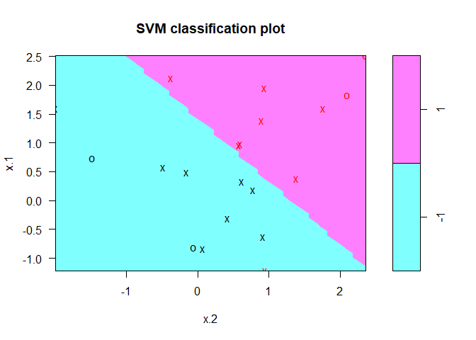
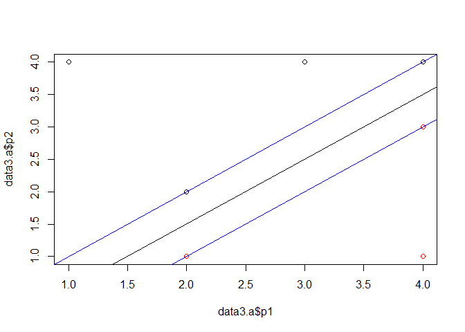

# Chapter 9 Lab: Support Vector Machines

# Support Vector Classifier


```r
#video
set.seed(10111)
x=matrix(rnorm(40),20,2)
y=rep(c(-1,1),c(10,10))
x[y==1,]=x[y==1,] + 1
plot(x, col=y+3,pch=19)
```

<!-- -->


```r
library(e1071)
dat=data.frame(x,y=as.factor(y))
svmfit=svm(y~., data=dat, kernel="linear", cost=10,scale=FALSE)
print(svmfit)
```

```
## 
## Call:
## svm(formula = y ~ ., data = dat, kernel = "linear", cost = 10, 
##     scale = FALSE)
## 
## 
## Parameters:
##    SVM-Type:  C-classification 
##  SVM-Kernel:  linear 
##        cost:  10 
##       gamma:  0.5 
## 
## Number of Support Vectors:  6
```

```r
plot(svmfit, dat)
```

<!-- -->


```r
make.grid=function(x,n=75){
  grange=apply(x,2,range)
  x1=seq(from=grange[1,1],to=grange[2,1],length=n)
  x2=seq(from=grange[1,2],to=grange[2,2],length=n)
  expand.grid(X1=x1,X2=x2)
}
xgrid=make.grid(x)
ygrid=predict(svmfit,xgrid)
plot(xgrid,col=c("red","blue")[as.numeric(ygrid)],pch=20,cex=.2)
points(x,col=y+3,pch=19)
points(x[svmfit$index,],pch=5,cex=2)
```

<!-- -->


```r
beta=drop(t(svmfit$coefs)%*%x[svmfit$index,])
beta0=svmfit$rho
plot(xgrid,col=c("red","blue")[as.numeric(ygrid)],pch=20,cex=.2)
points(x,col=y+3,pch=19)
points(x[svmfit$index,],pch=5,cex=2)
abline(beta0/beta[2],-beta[1]/beta[2])
abline((beta0-1)/beta[2],-beta[1]/beta[2],lty=2)
abline((beta0+1)/beta[2],-beta[1]/beta[2],lty=2)
```

<!-- -->

```r
#
```


```r
set.seed(1)
x=matrix(rnorm(20*2), ncol=2)
y=c(rep(-1,10), rep(1,10))
x[y==1,]=x[y==1,] + 1
plot(x, col=(3-y))
```

<!-- -->


```r
dat=data.frame(x=x, y=as.factor(y))
library(e1071)
svmfit=svm(y~., data=dat, kernel="linear", cost=10,scale=FALSE)
plot(svmfit, dat)
```

<!-- -->


```r
svmfit$index
```

```
## [1]  1  2  5  7 14 16 17
```

```r
summary(svmfit)
```

```
## 
## Call:
## svm(formula = y ~ ., data = dat, kernel = "linear", cost = 10, 
##     scale = FALSE)
## 
## 
## Parameters:
##    SVM-Type:  C-classification 
##  SVM-Kernel:  linear 
##        cost:  10 
##       gamma:  0.5 
## 
## Number of Support Vectors:  7
## 
##  ( 4 3 )
## 
## 
## Number of Classes:  2 
## 
## Levels: 
##  -1 1
```

```r
svmfit=svm(y~., data=dat, kernel="linear", cost=0.1,scale=FALSE)
plot(svmfit, dat)
```

<!-- -->

```r
svmfit$index
```

```
##  [1]  1  2  3  4  5  7  9 10 12 13 14 15 16 17 18 20
```


```r
set.seed(1)
tune.out=tune(svm,y~.,data=dat,kernel="linear",ranges=list(cost=c(0.001, 0.01, 0.1, 1,5,10,100)))
summary(tune.out)
```

```
## 
## Parameter tuning of 'svm':
## 
## - sampling method: 10-fold cross validation 
## 
## - best parameters:
##  cost
##   0.1
## 
## - best performance: 0.1 
## 
## - Detailed performance results:
##    cost error dispersion
## 1 1e-03  0.70  0.4216370
## 2 1e-02  0.70  0.4216370
## 3 1e-01  0.10  0.2108185
## 4 1e+00  0.15  0.2415229
## 5 5e+00  0.15  0.2415229
## 6 1e+01  0.15  0.2415229
## 7 1e+02  0.15  0.2415229
```


```r
bestmod=tune.out$best.model
summary(bestmod)
```

```
## 
## Call:
## best.tune(method = svm, train.x = y ~ ., data = dat, ranges = list(cost = c(0.001, 
##     0.01, 0.1, 1, 5, 10, 100)), kernel = "linear")
## 
## 
## Parameters:
##    SVM-Type:  C-classification 
##  SVM-Kernel:  linear 
##        cost:  0.1 
##       gamma:  0.5 
## 
## Number of Support Vectors:  16
## 
##  ( 8 8 )
## 
## 
## Number of Classes:  2 
## 
## Levels: 
##  -1 1
```


```r
xtest=matrix(rnorm(20*2), ncol=2)
ytest=sample(c(-1,1), 20, rep=TRUE)
xtest[ytest==1,]=xtest[ytest==1,] + 1
testdat=data.frame(x=xtest, y=as.factor(ytest))
```


```r
ypred=predict(bestmod,testdat)
table(predict=ypred, truth=testdat$y)
```

```
##        truth
## predict -1  1
##      -1 11  1
##      1   0  8
```


```r
svmfit=svm(y~., data=dat, kernel="linear", cost=.01,scale=FALSE)
ypred=predict(svmfit,testdat)
table(predict=ypred, truth=testdat$y)
```

```
##        truth
## predict -1  1
##      -1 11  2
##      1   0  7
```


```r
x[y==1,]=x[y==1,]+0.5
plot(x, col=(y+5)/2, pch=19)
```

<!-- -->


```r
dat=data.frame(x=x,y=as.factor(y))
svmfit=svm(y~., data=dat, kernel="linear", cost=1e5)
summary(svmfit)
```

```
## 
## Call:
## svm(formula = y ~ ., data = dat, kernel = "linear", cost = 1e+05)
## 
## 
## Parameters:
##    SVM-Type:  C-classification 
##  SVM-Kernel:  linear 
##        cost:  1e+05 
##       gamma:  0.5 
## 
## Number of Support Vectors:  3
## 
##  ( 1 2 )
## 
## 
## Number of Classes:  2 
## 
## Levels: 
##  -1 1
```

```r
plot(svmfit, dat)
```

<!-- -->

```r
svmfit=svm(y~., data=dat, kernel="linear", cost=1)
summary(svmfit)
```

```
## 
## Call:
## svm(formula = y ~ ., data = dat, kernel = "linear", cost = 1)
## 
## 
## Parameters:
##    SVM-Type:  C-classification 
##  SVM-Kernel:  linear 
##        cost:  1 
##       gamma:  0.5 
## 
## Number of Support Vectors:  7
## 
##  ( 4 3 )
## 
## 
## Number of Classes:  2 
## 
## Levels: 
##  -1 1
```

```r
plot(svmfit,dat)
```

<!-- -->


# 9.7 Exercises
## Conceptual
## 1. This problem involves hyperplanes in two dimensions.
### (a) Sketch the hyperplane 1 + 3X 1 − X 2 = 0. Indicate the set of points for which 1 + 3X 1 − X 2 > 0, as well as the set of points for which 1 + 3X 1 − X 2 < 0.

1 + 3*X1 − X2 = 0
X2 = 1 + 3*X1
when X1 = 0, X2 = 1
when X1 = 1, X2 = 4


```r
make.grid=function(x,n=75){
  grange=apply(x,2,range)
  x1=seq(from=grange[1,1],to=grange[2,1],length=n)
  x2=seq(from=grange[1,2],to=grange[2,2],length=n)
  expand.grid(X1=x1,X2=x2)
}
xgrid=make.grid(x)
ygrid=as.factor(ifelse((1 + 3*xgrid$X1 - xgrid$X2) < 0, -1, 1))
plot(xgrid,col=c("red","blue")[as.numeric(ygrid)],pch=20,cex=.2)
abline(1,3)
```

<!-- -->


### (b) On the same plot, sketch the hyperplane − 2 + X 1 + 2X 2 = 0. Indicate the set of points for which − 2 + X 1 + 2X 2 > 0, as well as the set of points for which − 2 + X 1 + 2X 2 < 0.

− 2 + X1 + 2*X2 = 0
X1 = 2 - 2*X2
when X1 = 0, X2 = 1
when X1 = 1, X2 = 1/2


```r
make.grid=function(x,n=75){
  grange=apply(x,2,range)
  x1=seq(from=grange[1,1],to=grange[2,1],length=n)
  x2=seq(from=grange[1,2],to=grange[2,2],length=n)
  expand.grid(X1=x1,X2=x2)
}
xgrid=make.grid(x)
ygrid=as.factor(ifelse((-2 + xgrid$X1 + 2*xgrid$X2) < 0, -1, 1))
plot(xgrid,col=c("red","blue")[as.numeric(ygrid)],pch=20,cex=.2)
abline(1,-1/2)
```

<!-- -->


## 3. Here we explore the maximal margin classifier on a toy data set.
### (a) We are given n = 7 observations in p = 2 dimensions. For each observation, there is an associated class label. Sketch the observations.


```r
p1=c(3,2,4,1,2,4,4)
p2=c(4,2,4,4,1,3,1)
p1
```

```
## [1] 3 2 4 1 2 4 4
```

```r
p2
```

```
## [1] 4 2 4 4 1 3 1
```

```r
label=c(rep(1,4),rep(2,3))
data3.a=data.frame(p1,p2,label)
plot(data3.a$p1,data3.a$p2, col = data3.a$label)
```

<!-- -->


### (b) Sketch the optimal separating hyperplane, and provide the equation for this hyperplane (of the form (9.1)).


```r
library(e1071)
data3.b=data.frame(p1,p2,label=as.factor(label))
svmfit=svm(label~., data=data3.b, kernel="linear", cost=10,scale=FALSE)
summary(svmfit)
```

```
## 
## Call:
## svm(formula = label ~ ., data = data3.b, kernel = "linear", cost = 10, 
##     scale = FALSE)
## 
## 
## Parameters:
##    SVM-Type:  C-classification 
##  SVM-Kernel:  linear 
##        cost:  10 
##       gamma:  0.5 
## 
## Number of Support Vectors:  3
## 
##  ( 2 1 )
## 
## 
## Number of Classes:  2 
## 
## Levels: 
##  1 2
```

```r
print(svmfit)
```

```
## 
## Call:
## svm(formula = label ~ ., data = data3.b, kernel = "linear", cost = 10, 
##     scale = FALSE)
## 
## 
## Parameters:
##    SVM-Type:  C-classification 
##  SVM-Kernel:  linear 
##        cost:  10 
##       gamma:  0.5 
## 
## Number of Support Vectors:  3
```

```r
plot(svmfit, data3.b)
```

<!-- -->

```r
plot(data3.a$p1,data3.a$p2, col = data3.a$label)
```

<!-- -->

`β 0 + β 1*X1 + β 2*X2 = 0`
use (2,2) and (4,4) 
we know slope = 1
and use (4,3)
we know y-intercept = -1/2
`-1/2 + X1 - X2 = 0`


```r
plot(data3.a$p1,data3.a$p2, col = data3.a$label)
abline(-1/2,1)
```

<!-- -->


### (c) Describe the classification rule for the maximal margin classifier. It should be something along the lines of “Classify to Red if β 0 + β 1 X 1 + β 2 X 2 > 0, and classify to Blue otherwise.” Provide the values for β 0 , β 1 , and β 2 .

> -1/2 + X1 - X2 = 0
β 0 = -1/2
β 1 = 1
β 2 = -1

> Classify to Blue if -1/2 + X1 - X2 > 0, and classify to Red otherwise.

### (d) On your sketch, indicate the margin for the maximal margin hyperplane.


```r
plot(data3.a$p1,data3.a$p2, col = data3.a$label)
abline(-1/2,1)
abline(0,1, col = "Blue")
abline(-1,1, col = "Blue")
```

<!-- -->


### (e) Indicate the support vectors for the maximal margin classifier.


```r
svmfit=svm(label~., data=data3.b, kernel="linear", cost=10,scale=FALSE)
summary(svmfit)
```

```
## 
## Call:
## svm(formula = label ~ ., data = data3.b, kernel = "linear", cost = 10, 
##     scale = FALSE)
## 
## 
## Parameters:
##    SVM-Type:  C-classification 
##  SVM-Kernel:  linear 
##        cost:  10 
##       gamma:  0.5 
## 
## Number of Support Vectors:  3
## 
##  ( 2 1 )
## 
## 
## Number of Classes:  2 
## 
## Levels: 
##  1 2
```

```r
print(svmfit)
```

```
## 
## Call:
## svm(formula = label ~ ., data = data3.b, kernel = "linear", cost = 10, 
##     scale = FALSE)
## 
## 
## Parameters:
##    SVM-Type:  C-classification 
##  SVM-Kernel:  linear 
##        cost:  10 
##       gamma:  0.5 
## 
## Number of Support Vectors:  3
```

```r
plot(svmfit, data3.b)
```

<!-- -->

```r
svmfit$index
```

```
## [1] 2 3 6
```

```r
plot(data3.a$p1,data3.a$p2, col = data3.a$label)
abline(-1/2,1)
abline(0,1, col = "Blue")
abline(-1,1, col = "Blue")
points(data3.a$p1[svmfit$index],data3.a$p2[svmfit$index],pch=5,cex=2)
```

<!-- -->


### (f) Argue that a slight movement of the seventh observation would not affect the maximal margin hyperplane.


```r
data3.a
```

```
##   p1 p2 label
## 1  3  4     1
## 2  2  2     1
## 3  4  4     1
## 4  1  4     1
## 5  2  1     2
## 6  4  3     2
## 7  4  1     2
```

```r
p1=c(3,2,4,1,2,4,5)
p2=c(4,2,4,4,1,3,0)
label=c(rep(1,4),rep(2,3))
data3.f=data.frame(p1,p2,label)
data3.f
```

```
##   p1 p2 label
## 1  3  4     1
## 2  2  2     1
## 3  4  4     1
## 4  1  4     1
## 5  2  1     2
## 6  4  3     2
## 7  5  0     2
```

```r
data3.f2=data.frame(p1,p2,label=as.factor(label))
svmfit=svm(label~., data=data3.f2, kernel="linear", cost=10,scale=FALSE)
summary(svmfit)
```

```
## 
## Call:
## svm(formula = label ~ ., data = data3.f2, kernel = "linear", 
##     cost = 10, scale = FALSE)
## 
## 
## Parameters:
##    SVM-Type:  C-classification 
##  SVM-Kernel:  linear 
##        cost:  10 
##       gamma:  0.5 
## 
## Number of Support Vectors:  3
## 
##  ( 2 1 )
## 
## 
## Number of Classes:  2 
## 
## Levels: 
##  1 2
```

```r
print(svmfit)
```

```
## 
## Call:
## svm(formula = label ~ ., data = data3.f2, kernel = "linear", 
##     cost = 10, scale = FALSE)
## 
## 
## Parameters:
##    SVM-Type:  C-classification 
##  SVM-Kernel:  linear 
##        cost:  10 
##       gamma:  0.5 
## 
## Number of Support Vectors:  3
```

```r
plot(svmfit, data3.f)
```

<!-- -->

```r
plot(data3.f$p1,data3.f$p2, col = data3.f$label)
abline(-1/2,1)
abline(0,1, col = "Blue")
abline(-1,1, col = "Blue")
points(data3.f2$p1[svmfit$index],data3.f2$p2[svmfit$index],pch=5,cex=2)
```

<!-- -->


### (g) Sketch a hyperplane that is not the optimal separating hyperplane, and provide the equation for this hyperplane.


```r
plot(data3.a$p1,data3.a$p2, col = data3.a$label)
abline(-1/2,1)
abline(-1/2,0.9,col = "Blue")
```

<!-- -->


### (h) Draw an additional observation on the plot so that the two classes are no longer separable by a hyperplane.


```r
p1=c(3,2,4,1,2,4,4,3)
p2=c(4,2,4,4,1,3,1,3.5)
label=c(rep(1,4),rep(2,4))
data3.h=data.frame(p1,p2,label)

plot(data3.h$p1,data3.h$p2, col = data3.h$label)
abline(-1/2,1)
abline(0,1, col = "Blue")
abline(-1,1, col = "Blue")
```

<!-- -->

## Applied
## 6. At the end of Section 9.6.1, it is claimed that in the case of data that is just barely linearly separable, a support vector classifier with a small value of cost that misclassifies a couple of training observations may perform better on test data than one with a huge value of cost that does not misclassify any training observations. You will now investigate this claim.

### (a) Generate two-class data with p = 2 in such a way that the classes are just barely linearly separable.


```r
set.seed(11)
x=matrix(rnorm(40),20,2)
y=rep(c(-1,1),c(10,10))
x[y==1,]=x[y==1,] + 1
plot(x, col=y+3,pch=19)
```

<!-- -->

```r
data6.a = data.frame(x=x, y=as.factor(y))
```


### (b) Compute the cross-validation error rates for support vector classifiers with a range of cost values. How many training errors are misclassified for each value of cost considered, and how does this relate to the cross-validation errors obtained?


```r
set.seed(11)
tune.out=tune(svm, y~., data=data6.a, kernel="linear", ranges=list(cost=c(0.1,1,10,100,1000)))
summary(tune.out)
```

```
## 
## Parameter tuning of 'svm':
## 
## - sampling method: 10-fold cross validation 
## 
## - best parameters:
##  cost
##    10
## 
## - best performance: 0.25 
## 
## - Detailed performance results:
##    cost error dispersion
## 1 1e-01  0.30  0.3496029
## 2 1e+00  0.30  0.3496029
## 3 1e+01  0.25  0.3535534
## 4 1e+02  0.25  0.3535534
## 5 1e+03  0.25  0.3535534
```

```r
bestmod=tune.out$best.model
summary(bestmod)
```

```
## 
## Call:
## best.tune(method = svm, train.x = y ~ ., data = data6.a, ranges = list(cost = c(0.1, 
##     1, 10, 100, 1000)), kernel = "linear")
## 
## 
## Parameters:
##    SVM-Type:  C-classification 
##  SVM-Kernel:  linear 
##        cost:  10 
##       gamma:  0.5 
## 
## Number of Support Vectors:  11
## 
##  ( 6 5 )
## 
## 
## Number of Classes:  2 
## 
## Levels: 
##  -1 1
```


### (c) Generate an appropriate test data set, and compute the test errors corresponding to each of the values of cost considered. Which value of cost leads to the fewest test errors, and how does this compare to the values of cost that yield the fewest training errors and the fewest cross-validation errors?


```r
plot(x, col=y+3,pch=19)
```

<!-- -->

```r
set.seed(111)
xtest=matrix(rnorm(40),20,2)
ytest=rep(c(-1,1),c(10,10))
xtest[ytest==1,]=xtest[ytest==1,] + 1
plot(xtest, col=ytest+3,pch=19)
```

<!-- -->

```r
testdat=data.frame(x=xtest, y=as.factor(ytest))
```


```r
ypred=predict(bestmod,testdat)
table(predict=ypred, truth=testdat$y)
```

```
##        truth
## predict -1 1
##      -1  5 2
##      1   5 8
```


```r
cost=c(0.1,1,10,100,1000)
for(cost in cost){
  svmfit=svm(y~., data=data6.a, kernel = "linear", cost = cost, scale=FALSE)
  ypred=predict(svmfit,testdat)
  print(table(predict=ypred,truth=testdat$y))
}
```

```
##        truth
## predict -1 1
##      -1  7 4
##      1   3 6
##        truth
## predict -1 1
##      -1  7 5
##      1   3 5
##        truth
## predict -1 1
##      -1  5 2
##      1   5 8
##        truth
## predict -1 1
##      -1  5 2
##      1   5 8
##        truth
## predict -1 1
##      -1  5 2
##      1   5 8
```

### (d) Discuss your results.

> In this case, cost=c(10,100,1000) perform the same. cost=0.1 perform as good as cost=10, but they have different results.

## 7. In this problem, you will use support vector approaches in order to predict whether a given car gets high or low gas mileage based on the Auto data set.

### (a) Create a binary variable that takes on a 1 for cars with gas mileage above the median, and a 0 for cars with gas mileage below the median.


```r
library(ISLR)
summary(Auto)
```

```
##       mpg          cylinders      displacement     horsepower   
##  Min.   : 9.00   Min.   :3.000   Min.   : 68.0   Min.   : 46.0  
##  1st Qu.:17.00   1st Qu.:4.000   1st Qu.:105.0   1st Qu.: 75.0  
##  Median :22.75   Median :4.000   Median :151.0   Median : 93.5  
##  Mean   :23.45   Mean   :5.472   Mean   :194.4   Mean   :104.5  
##  3rd Qu.:29.00   3rd Qu.:8.000   3rd Qu.:275.8   3rd Qu.:126.0  
##  Max.   :46.60   Max.   :8.000   Max.   :455.0   Max.   :230.0  
##                                                                 
##      weight      acceleration        year           origin     
##  Min.   :1613   Min.   : 8.00   Min.   :70.00   Min.   :1.000  
##  1st Qu.:2225   1st Qu.:13.78   1st Qu.:73.00   1st Qu.:1.000  
##  Median :2804   Median :15.50   Median :76.00   Median :1.000  
##  Mean   :2978   Mean   :15.54   Mean   :75.98   Mean   :1.577  
##  3rd Qu.:3615   3rd Qu.:17.02   3rd Qu.:79.00   3rd Qu.:2.000  
##  Max.   :5140   Max.   :24.80   Max.   :82.00   Max.   :3.000  
##                                                                
##                  name    
##  amc matador       :  5  
##  ford pinto        :  5  
##  toyota corolla    :  5  
##  amc gremlin       :  4  
##  amc hornet        :  4  
##  chevrolet chevette:  4  
##  (Other)           :365
```

```r
#?Auto
Auto$BI=as.factor(ifelse(Auto$mpg>22.75, 1, 0))
summary(Auto)
```

```
##       mpg          cylinders      displacement     horsepower   
##  Min.   : 9.00   Min.   :3.000   Min.   : 68.0   Min.   : 46.0  
##  1st Qu.:17.00   1st Qu.:4.000   1st Qu.:105.0   1st Qu.: 75.0  
##  Median :22.75   Median :4.000   Median :151.0   Median : 93.5  
##  Mean   :23.45   Mean   :5.472   Mean   :194.4   Mean   :104.5  
##  3rd Qu.:29.00   3rd Qu.:8.000   3rd Qu.:275.8   3rd Qu.:126.0  
##  Max.   :46.60   Max.   :8.000   Max.   :455.0   Max.   :230.0  
##                                                                 
##      weight      acceleration        year           origin     
##  Min.   :1613   Min.   : 8.00   Min.   :70.00   Min.   :1.000  
##  1st Qu.:2225   1st Qu.:13.78   1st Qu.:73.00   1st Qu.:1.000  
##  Median :2804   Median :15.50   Median :76.00   Median :1.000  
##  Mean   :2978   Mean   :15.54   Mean   :75.98   Mean   :1.577  
##  3rd Qu.:3615   3rd Qu.:17.02   3rd Qu.:79.00   3rd Qu.:2.000  
##  Max.   :5140   Max.   :24.80   Max.   :82.00   Max.   :3.000  
##                                                                
##                  name     BI     
##  amc matador       :  5   0:196  
##  ford pinto        :  5   1:196  
##  toyota corolla    :  5          
##  amc gremlin       :  4          
##  amc hornet        :  4          
##  chevrolet chevette:  4          
##  (Other)           :365
```


### (b) Fit a support vector classifier to the data with various values of cost, in order to predict whether a car gets high or low gas mileage. Report the cross-validation errors associated with different values of this parameter. Comment on your results.


```r
set.seed(11)
tune.out=tune(svm, BI~., data=Auto, kernel="linear", ranges=list(cost=c(0.1,1,10,100,1000)))
summary(tune.out)
```

```
## 
## Parameter tuning of 'svm':
## 
## - sampling method: 10-fold cross validation 
## 
## - best parameters:
##  cost
##     1
## 
## - best performance: 0.01025641 
## 
## - Detailed performance results:
##    cost      error dispersion
## 1 1e-01 0.03833333 0.03027982
## 2 1e+00 0.01025641 0.01792836
## 3 1e+01 0.01794872 0.02110955
## 4 1e+02 0.03070513 0.03153205
## 5 1e+03 0.03070513 0.03153205
```

```r
bestmod=tune.out$best.model
summary(bestmod)
```

```
## 
## Call:
## best.tune(method = svm, train.x = BI ~ ., data = Auto, ranges = list(cost = c(0.1, 
##     1, 10, 100, 1000)), kernel = "linear")
## 
## 
## Parameters:
##    SVM-Type:  C-classification 
##  SVM-Kernel:  linear 
##        cost:  1 
##       gamma:  0.003205128 
## 
## Number of Support Vectors:  56
## 
##  ( 26 30 )
## 
## 
## Number of Classes:  2 
## 
## Levels: 
##  0 1
```


## 8. This problem involves the OJ data set which is part of the ISLR package.
### (a) Create a training set containing a random sample of 800 observations, and a test set containing the remaining observations.


```r
summary(OJ)
```

```
##  Purchase WeekofPurchase     StoreID        PriceCH         PriceMM     
##  CH:653   Min.   :227.0   Min.   :1.00   Min.   :1.690   Min.   :1.690  
##  MM:417   1st Qu.:240.0   1st Qu.:2.00   1st Qu.:1.790   1st Qu.:1.990  
##           Median :257.0   Median :3.00   Median :1.860   Median :2.090  
##           Mean   :254.4   Mean   :3.96   Mean   :1.867   Mean   :2.085  
##           3rd Qu.:268.0   3rd Qu.:7.00   3rd Qu.:1.990   3rd Qu.:2.180  
##           Max.   :278.0   Max.   :7.00   Max.   :2.090   Max.   :2.290  
##      DiscCH            DiscMM         SpecialCH        SpecialMM     
##  Min.   :0.00000   Min.   :0.0000   Min.   :0.0000   Min.   :0.0000  
##  1st Qu.:0.00000   1st Qu.:0.0000   1st Qu.:0.0000   1st Qu.:0.0000  
##  Median :0.00000   Median :0.0000   Median :0.0000   Median :0.0000  
##  Mean   :0.05186   Mean   :0.1234   Mean   :0.1477   Mean   :0.1617  
##  3rd Qu.:0.00000   3rd Qu.:0.2300   3rd Qu.:0.0000   3rd Qu.:0.0000  
##  Max.   :0.50000   Max.   :0.8000   Max.   :1.0000   Max.   :1.0000  
##     LoyalCH          SalePriceMM     SalePriceCH      PriceDiff      
##  Min.   :0.000011   Min.   :1.190   Min.   :1.390   Min.   :-0.6700  
##  1st Qu.:0.325257   1st Qu.:1.690   1st Qu.:1.750   1st Qu.: 0.0000  
##  Median :0.600000   Median :2.090   Median :1.860   Median : 0.2300  
##  Mean   :0.565782   Mean   :1.962   Mean   :1.816   Mean   : 0.1465  
##  3rd Qu.:0.850873   3rd Qu.:2.130   3rd Qu.:1.890   3rd Qu.: 0.3200  
##  Max.   :0.999947   Max.   :2.290   Max.   :2.090   Max.   : 0.6400  
##  Store7      PctDiscMM        PctDiscCH       ListPriceDiff  
##  No :714   Min.   :0.0000   Min.   :0.00000   Min.   :0.000  
##  Yes:356   1st Qu.:0.0000   1st Qu.:0.00000   1st Qu.:0.140  
##            Median :0.0000   Median :0.00000   Median :0.240  
##            Mean   :0.0593   Mean   :0.02731   Mean   :0.218  
##            3rd Qu.:0.1127   3rd Qu.:0.00000   3rd Qu.:0.300  
##            Max.   :0.4020   Max.   :0.25269   Max.   :0.440  
##      STORE      
##  Min.   :0.000  
##  1st Qu.:0.000  
##  Median :2.000  
##  Mean   :1.631  
##  3rd Qu.:3.000  
##  Max.   :4.000
```

```r
dim(OJ)
```

```
## [1] 1070   18
```

```r
set.seed(1)
train=sample(1:nrow(OJ), 800, replace = F)
traindata=OJ[train,]
testdata=OJ[-train,]
summary(traindata)
```

```
##  Purchase WeekofPurchase     StoreID         PriceCH         PriceMM     
##  CH:494   Min.   :227.0   Min.   :1.000   Min.   :1.690   Min.   :1.690  
##  MM:306   1st Qu.:240.0   1st Qu.:2.000   1st Qu.:1.790   1st Qu.:1.990  
##           Median :257.0   Median :3.000   Median :1.860   Median :2.090  
##           Mean   :254.5   Mean   :3.914   Mean   :1.867   Mean   :2.083  
##           3rd Qu.:269.0   3rd Qu.:7.000   3rd Qu.:1.990   3rd Qu.:2.180  
##           Max.   :278.0   Max.   :7.000   Max.   :2.090   Max.   :2.290  
##      DiscCH            DiscMM         SpecialCH        SpecialMM     
##  Min.   :0.00000   Min.   :0.0000   Min.   :0.0000   Min.   :0.0000  
##  1st Qu.:0.00000   1st Qu.:0.0000   1st Qu.:0.0000   1st Qu.:0.0000  
##  Median :0.00000   Median :0.0000   Median :0.0000   Median :0.0000  
##  Mean   :0.05304   Mean   :0.1199   Mean   :0.1425   Mean   :0.1625  
##  3rd Qu.:0.00000   3rd Qu.:0.2100   3rd Qu.:0.0000   3rd Qu.:0.0000  
##  Max.   :0.50000   Max.   :0.8000   Max.   :1.0000   Max.   :1.0000  
##     LoyalCH          SalePriceMM     SalePriceCH      PriceDiff      
##  Min.   :0.000011   Min.   :1.190   Min.   :1.390   Min.   :-0.6700  
##  1st Qu.:0.320000   1st Qu.:1.690   1st Qu.:1.750   1st Qu.: 0.0000  
##  Median :0.600000   Median :2.090   Median :1.860   Median : 0.2300  
##  Mean   :0.571341   Mean   :1.963   Mean   :1.814   Mean   : 0.1489  
##  3rd Qu.:0.868928   3rd Qu.:2.130   3rd Qu.:1.890   3rd Qu.: 0.3200  
##  Max.   :0.999934   Max.   :2.290   Max.   :2.090   Max.   : 0.6400  
##  Store7      PctDiscMM        PctDiscCH       ListPriceDiff   
##  No :540   Min.   :0.0000   Min.   :0.00000   Min.   :0.0000  
##  Yes:260   1st Qu.:0.0000   1st Qu.:0.00000   1st Qu.:0.1300  
##            Median :0.0000   Median :0.00000   Median :0.2400  
##            Mean   :0.0577   Mean   :0.02795   Mean   :0.2158  
##            3rd Qu.:0.1127   3rd Qu.:0.00000   3rd Qu.:0.3000  
##            Max.   :0.4020   Max.   :0.25269   Max.   :0.4400  
##      STORE      
##  Min.   :0.000  
##  1st Qu.:0.000  
##  Median :2.000  
##  Mean   :1.639  
##  3rd Qu.:3.000  
##  Max.   :4.000
```

```r
dim(traindata)
```

```
## [1] 800  18
```

```r
summary(testdata)
```

```
##  Purchase WeekofPurchase     StoreID         PriceCH         PriceMM     
##  CH:159   Min.   :227.0   Min.   :1.000   Min.   :1.690   Min.   :1.690  
##  MM:111   1st Qu.:239.0   1st Qu.:2.000   1st Qu.:1.790   1st Qu.:2.090  
##           Median :256.0   Median :3.000   Median :1.860   Median :2.110  
##           Mean   :254.1   Mean   :4.096   Mean   :1.869   Mean   :2.093  
##           3rd Qu.:267.0   3rd Qu.:7.000   3rd Qu.:1.990   3rd Qu.:2.180  
##           Max.   :278.0   Max.   :7.000   Max.   :2.090   Max.   :2.290  
##      DiscCH            DiscMM         SpecialCH       SpecialMM     
##  Min.   :0.00000   Min.   :0.0000   Min.   :0.000   Min.   :0.0000  
##  1st Qu.:0.00000   1st Qu.:0.0000   1st Qu.:0.000   1st Qu.:0.0000  
##  Median :0.00000   Median :0.0000   Median :0.000   Median :0.0000  
##  Mean   :0.04837   Mean   :0.1336   Mean   :0.163   Mean   :0.1593  
##  3rd Qu.:0.00000   3rd Qu.:0.2300   3rd Qu.:0.000   3rd Qu.:0.0000  
##  Max.   :0.50000   Max.   :0.8000   Max.   :1.000   Max.   :1.0000  
##     LoyalCH          SalePriceMM     SalePriceCH     PriceDiff      
##  Min.   :0.000022   Min.   :1.190   Min.   :1.39   Min.   :-0.6700  
##  1st Qu.:0.384219   1st Qu.:1.690   1st Qu.:1.75   1st Qu.: 0.0000  
##  Median :0.577943   Median :2.090   Median :1.86   Median : 0.2400  
##  Mean   :0.549313   Mean   :1.960   Mean   :1.82   Mean   : 0.1392  
##  3rd Qu.:0.792074   3rd Qu.:2.167   3rd Qu.:1.89   3rd Qu.: 0.3150  
##  Max.   :0.999947   Max.   :2.290   Max.   :2.06   Max.   : 0.6400  
##  Store7      PctDiscMM         PctDiscCH       ListPriceDiff   
##  No :174   Min.   :0.00000   Min.   :0.00000   Min.   :0.0000  
##  Yes: 96   1st Qu.:0.00000   1st Qu.:0.00000   1st Qu.:0.1700  
##            Median :0.00000   Median :0.00000   Median :0.2400  
##            Mean   :0.06403   Mean   :0.02542   Mean   :0.2244  
##            3rd Qu.:0.11268   3rd Qu.:0.00000   3rd Qu.:0.3000  
##            Max.   :0.40201   Max.   :0.25269   Max.   :0.4400  
##      STORE      
##  Min.   :0.000  
##  1st Qu.:0.000  
##  Median :2.000  
##  Mean   :1.607  
##  3rd Qu.:3.000  
##  Max.   :4.000
```

```r
dim(testdata)
```

```
## [1] 270  18
```


### (b) Fit a support vector classifier to the training data using cost=0.01, with Purchase as the response and the other variables as predictors. Use the summary() function to produce summary statistics, and describe the results obtained.


```r
svmfit=svm(Purchase~.,data=traindata, kernel = "linear", cost = 0.01, scale=FALSE)
summary(svmfit)
```

```
## 
## Call:
## svm(formula = Purchase ~ ., data = traindata, kernel = "linear", 
##     cost = 0.01, scale = FALSE)
## 
## 
## Parameters:
##    SVM-Type:  C-classification 
##  SVM-Kernel:  linear 
##        cost:  0.01 
##       gamma:  0.05555556 
## 
## Number of Support Vectors:  615
## 
##  ( 306 309 )
## 
## 
## Number of Classes:  2 
## 
## Levels: 
##  CH MM
```


### (c) What are the training and test error rates?


```r
# training
pred=predict(svmfit,traindata)
table(predict=pred, truth=traindata$Purchase)
```

```
##        truth
## predict  CH  MM
##      CH 473 189
##      MM  21 117
```

```r
(1-(473+117)/800)*100
```

```
## [1] 26.25
```

```r
# test
pred=predict(svmfit,testdata)
table(predict=pred, truth=testdata$Purchase)
```

```
##        truth
## predict  CH  MM
##      CH 156  68
##      MM   3  43
```

```r
(1-(156+43)/270)*100
```

```
## [1] 26.2963
```


### (d) Use the tune() function to select an optimal cost. Consider values in the range 0.01 to 10.


```r
set.seed(11)
tune.out=tune(svm, Purchase~., data=traindata, kernel="linear", ranges=list(cost=c(0.01,0.1,1,10)))
summary(tune.out)
```

```
## 
## Parameter tuning of 'svm':
## 
## - sampling method: 10-fold cross validation 
## 
## - best parameters:
##  cost
##   0.1
## 
## - best performance: 0.16875 
## 
## - Detailed performance results:
##    cost   error dispersion
## 1  0.01 0.16875 0.03019037
## 2  0.10 0.16875 0.02144923
## 3  1.00 0.17000 0.02220485
## 4 10.00 0.17250 0.02993047
```

```r
bestmod=tune.out$best.model
summary(bestmod)
```

```
## 
## Call:
## best.tune(method = svm, train.x = Purchase ~ ., data = traindata, 
##     ranges = list(cost = c(0.01, 0.1, 1, 10)), kernel = "linear")
## 
## 
## Parameters:
##    SVM-Type:  C-classification 
##  SVM-Kernel:  linear 
##        cost:  0.1 
##       gamma:  0.05555556 
## 
## Number of Support Vectors:  343
## 
##  ( 171 172 )
## 
## 
## Number of Classes:  2 
## 
## Levels: 
##  CH MM
```


### (e) Compute the training and test error rates using this new value for cost.


```r
# training
pred=predict(bestmod,traindata)
table(predict=pred, truth=traindata$Purchase)
```

```
##        truth
## predict  CH  MM
##      CH 438  71
##      MM  56 235
```

```r
(1-(438+235)/800)*100
```

```
## [1] 15.875
```

```r
# test
pred=predict(bestmod,testdata)
table(predict=pred, truth=testdata$Purchase)
```

```
##        truth
## predict  CH  MM
##      CH 140  32
##      MM  19  79
```

```r
(1-(140+79)/270)*100
```

```
## [1] 18.88889
```

> better!
