# from video


```r
library(e1071)
# data are not abailable, so I use data from Lab
#video
set.seed(10111)
x=matrix(rnorm(40),20,2)
y=rep(c(-1,1),c(10,10))
x[y==1,]=x[y==1,] + 1
plot(x, col=y+3,pch=19)
```

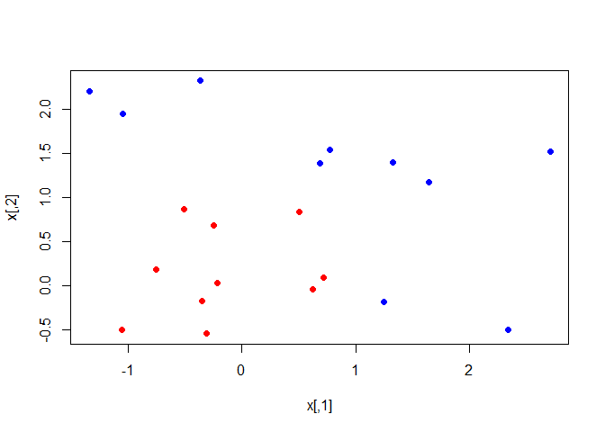<!-- -->

```r
dat=data.frame(x,y=as.factor(y))
names(dat)
```

```
## [1] "X1" "X2" "y"
```

```r
make.grid=function(x,n=75){
  grange=apply(x,2,range)
  x1=seq(from=grange[1,1],to=grange[2,1],length=n)
  x2=seq(from=grange[1,2],to=grange[2,2],length=n)
  expand.grid(X1=x1,X2=x2)
}

fit=svm(factor(y)~., data=dat, scale=FALSE,  kernel="radial",cost=5)
xgrid=make.grid(x)
ygrid=predict(fit,xgrid)
plot(xgrid,col=as.numeric(ygrid),pch=20,cex=.2)
points(x,col=y+1,pch=19)
```

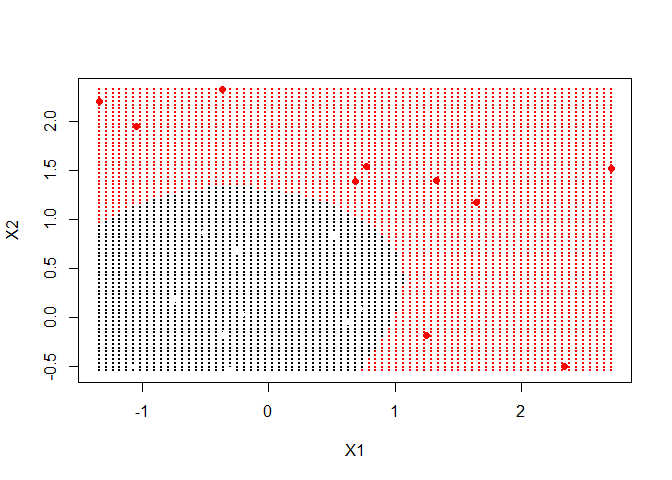<!-- -->

```r
func=predict(fit,xgrid,decision.values = TRUE)
func=attributes(func)$decision
xgrid=make.grid(x)
ygrid=predict(fit,xgrid)
plot(xgrid,col=as.numeric(ygrid),pch=20,cex=.2)
points(x,col=y+1,pch=19)
```

<!-- -->

```r
xgrid
```

```
##               X1           X2
## 1    -1.34063790 -0.540007410
## 2    -1.28595725 -0.540007410
## 3    -1.23127659 -0.540007410
## 4    -1.17659594 -0.540007410
## 5    -1.12191528 -0.540007410
## 6    -1.06723463 -0.540007410
## 7    -1.01255398 -0.540007410
## 8    -0.95787332 -0.540007410
## 9    -0.90319267 -0.540007410
## 10   -0.84851201 -0.540007410
## 11   -0.79383136 -0.540007410
## 12   -0.73915070 -0.540007410
## 13   -0.68447005 -0.540007410
## 14   -0.62978940 -0.540007410
## 15   -0.57510874 -0.540007410
## 16   -0.52042809 -0.540007410
## 17   -0.46574743 -0.540007410
## 18   -0.41106678 -0.540007410
## 19   -0.35638613 -0.540007410
## 20   -0.30170547 -0.540007410
## 21   -0.24702482 -0.540007410
## 22   -0.19234416 -0.540007410
## 23   -0.13766351 -0.540007410
## 24   -0.08298285 -0.540007410
## 25   -0.02830220 -0.540007410
## 26    0.02637845 -0.540007410
## 27    0.08105911 -0.540007410
## 28    0.13573976 -0.540007410
## 29    0.19042042 -0.540007410
## 30    0.24510107 -0.540007410
## 31    0.29978173 -0.540007410
## 32    0.35446238 -0.540007410
## 33    0.40914303 -0.540007410
## 34    0.46382369 -0.540007410
## 35    0.51850434 -0.540007410
## 36    0.57318500 -0.540007410
## 37    0.62786565 -0.540007410
## 38    0.68254630 -0.540007410
## 39    0.73722696 -0.540007410
## 40    0.79190761 -0.540007410
## 41    0.84658827 -0.540007410
## 42    0.90126892 -0.540007410
## 43    0.95594958 -0.540007410
## 44    1.01063023 -0.540007410
## 45    1.06531088 -0.540007410
## 46    1.11999154 -0.540007410
## 47    1.17467219 -0.540007410
## 48    1.22935285 -0.540007410
## 49    1.28403350 -0.540007410
## 50    1.33871416 -0.540007410
## 51    1.39339481 -0.540007410
## 52    1.44807546 -0.540007410
## 53    1.50275612 -0.540007410
## 54    1.55743677 -0.540007410
## 55    1.61211743 -0.540007410
## 56    1.66679808 -0.540007410
## 57    1.72147873 -0.540007410
## 58    1.77615939 -0.540007410
## 59    1.83084004 -0.540007410
## 60    1.88552070 -0.540007410
## 61    1.94020135 -0.540007410
## 62    1.99488201 -0.540007410
## 63    2.04956266 -0.540007410
## 64    2.10424331 -0.540007410
## 65    2.15892397 -0.540007410
## 66    2.21360462 -0.540007410
## 67    2.26828528 -0.540007410
## 68    2.32296593 -0.540007410
## 69    2.37764659 -0.540007410
## 70    2.43232724 -0.540007410
## 71    2.48700789 -0.540007410
## 72    2.54168855 -0.540007410
## 73    2.59636920 -0.540007410
## 74    2.65104986 -0.540007410
## 75    2.70573051 -0.540007410
## 76   -1.34063790 -0.501313458
## 77   -1.28595725 -0.501313458
## 78   -1.23127659 -0.501313458
## 79   -1.17659594 -0.501313458
## 80   -1.12191528 -0.501313458
## 81   -1.06723463 -0.501313458
## 82   -1.01255398 -0.501313458
## 83   -0.95787332 -0.501313458
## 84   -0.90319267 -0.501313458
## 85   -0.84851201 -0.501313458
## 86   -0.79383136 -0.501313458
## 87   -0.73915070 -0.501313458
## 88   -0.68447005 -0.501313458
## 89   -0.62978940 -0.501313458
## 90   -0.57510874 -0.501313458
## 91   -0.52042809 -0.501313458
## 92   -0.46574743 -0.501313458
## 93   -0.41106678 -0.501313458
## 94   -0.35638613 -0.501313458
## 95   -0.30170547 -0.501313458
## 96   -0.24702482 -0.501313458
## 97   -0.19234416 -0.501313458
## 98   -0.13766351 -0.501313458
## 99   -0.08298285 -0.501313458
## 100  -0.02830220 -0.501313458
## 101   0.02637845 -0.501313458
## 102   0.08105911 -0.501313458
## 103   0.13573976 -0.501313458
## 104   0.19042042 -0.501313458
## 105   0.24510107 -0.501313458
## 106   0.29978173 -0.501313458
## 107   0.35446238 -0.501313458
## 108   0.40914303 -0.501313458
## 109   0.46382369 -0.501313458
## 110   0.51850434 -0.501313458
## 111   0.57318500 -0.501313458
## 112   0.62786565 -0.501313458
## 113   0.68254630 -0.501313458
## 114   0.73722696 -0.501313458
## 115   0.79190761 -0.501313458
## 116   0.84658827 -0.501313458
## 117   0.90126892 -0.501313458
## 118   0.95594958 -0.501313458
## 119   1.01063023 -0.501313458
## 120   1.06531088 -0.501313458
## 121   1.11999154 -0.501313458
## 122   1.17467219 -0.501313458
## 123   1.22935285 -0.501313458
## 124   1.28403350 -0.501313458
## 125   1.33871416 -0.501313458
## 126   1.39339481 -0.501313458
## 127   1.44807546 -0.501313458
## 128   1.50275612 -0.501313458
## 129   1.55743677 -0.501313458
## 130   1.61211743 -0.501313458
## 131   1.66679808 -0.501313458
## 132   1.72147873 -0.501313458
## 133   1.77615939 -0.501313458
## 134   1.83084004 -0.501313458
## 135   1.88552070 -0.501313458
## 136   1.94020135 -0.501313458
## 137   1.99488201 -0.501313458
## 138   2.04956266 -0.501313458
## 139   2.10424331 -0.501313458
## 140   2.15892397 -0.501313458
## 141   2.21360462 -0.501313458
## 142   2.26828528 -0.501313458
## 143   2.32296593 -0.501313458
## 144   2.37764659 -0.501313458
## 145   2.43232724 -0.501313458
## 146   2.48700789 -0.501313458
## 147   2.54168855 -0.501313458
## 148   2.59636920 -0.501313458
## 149   2.65104986 -0.501313458
## 150   2.70573051 -0.501313458
## 151  -1.34063790 -0.462619506
## 152  -1.28595725 -0.462619506
## 153  -1.23127659 -0.462619506
## 154  -1.17659594 -0.462619506
## 155  -1.12191528 -0.462619506
## 156  -1.06723463 -0.462619506
## 157  -1.01255398 -0.462619506
## 158  -0.95787332 -0.462619506
## 159  -0.90319267 -0.462619506
## 160  -0.84851201 -0.462619506
## 161  -0.79383136 -0.462619506
## 162  -0.73915070 -0.462619506
## 163  -0.68447005 -0.462619506
## 164  -0.62978940 -0.462619506
## 165  -0.57510874 -0.462619506
## 166  -0.52042809 -0.462619506
## 167  -0.46574743 -0.462619506
## 168  -0.41106678 -0.462619506
## 169  -0.35638613 -0.462619506
## 170  -0.30170547 -0.462619506
## 171  -0.24702482 -0.462619506
## 172  -0.19234416 -0.462619506
## 173  -0.13766351 -0.462619506
## 174  -0.08298285 -0.462619506
## 175  -0.02830220 -0.462619506
## 176   0.02637845 -0.462619506
## 177   0.08105911 -0.462619506
## 178   0.13573976 -0.462619506
## 179   0.19042042 -0.462619506
## 180   0.24510107 -0.462619506
## 181   0.29978173 -0.462619506
## 182   0.35446238 -0.462619506
## 183   0.40914303 -0.462619506
## 184   0.46382369 -0.462619506
## 185   0.51850434 -0.462619506
## 186   0.57318500 -0.462619506
## 187   0.62786565 -0.462619506
## 188   0.68254630 -0.462619506
## 189   0.73722696 -0.462619506
## 190   0.79190761 -0.462619506
## 191   0.84658827 -0.462619506
## 192   0.90126892 -0.462619506
## 193   0.95594958 -0.462619506
## 194   1.01063023 -0.462619506
## 195   1.06531088 -0.462619506
## 196   1.11999154 -0.462619506
## 197   1.17467219 -0.462619506
## 198   1.22935285 -0.462619506
## 199   1.28403350 -0.462619506
## 200   1.33871416 -0.462619506
## 201   1.39339481 -0.462619506
## 202   1.44807546 -0.462619506
## 203   1.50275612 -0.462619506
## 204   1.55743677 -0.462619506
## 205   1.61211743 -0.462619506
## 206   1.66679808 -0.462619506
## 207   1.72147873 -0.462619506
## 208   1.77615939 -0.462619506
## 209   1.83084004 -0.462619506
## 210   1.88552070 -0.462619506
## 211   1.94020135 -0.462619506
## 212   1.99488201 -0.462619506
## 213   2.04956266 -0.462619506
## 214   2.10424331 -0.462619506
## 215   2.15892397 -0.462619506
## 216   2.21360462 -0.462619506
## 217   2.26828528 -0.462619506
## 218   2.32296593 -0.462619506
## 219   2.37764659 -0.462619506
## 220   2.43232724 -0.462619506
## 221   2.48700789 -0.462619506
## 222   2.54168855 -0.462619506
## 223   2.59636920 -0.462619506
## 224   2.65104986 -0.462619506
## 225   2.70573051 -0.462619506
## 226  -1.34063790 -0.423925554
## 227  -1.28595725 -0.423925554
## 228  -1.23127659 -0.423925554
## 229  -1.17659594 -0.423925554
## 230  -1.12191528 -0.423925554
## 231  -1.06723463 -0.423925554
## 232  -1.01255398 -0.423925554
## 233  -0.95787332 -0.423925554
## 234  -0.90319267 -0.423925554
## 235  -0.84851201 -0.423925554
## 236  -0.79383136 -0.423925554
## 237  -0.73915070 -0.423925554
## 238  -0.68447005 -0.423925554
## 239  -0.62978940 -0.423925554
## 240  -0.57510874 -0.423925554
## 241  -0.52042809 -0.423925554
## 242  -0.46574743 -0.423925554
## 243  -0.41106678 -0.423925554
## 244  -0.35638613 -0.423925554
## 245  -0.30170547 -0.423925554
## 246  -0.24702482 -0.423925554
## 247  -0.19234416 -0.423925554
## 248  -0.13766351 -0.423925554
## 249  -0.08298285 -0.423925554
## 250  -0.02830220 -0.423925554
## 251   0.02637845 -0.423925554
## 252   0.08105911 -0.423925554
## 253   0.13573976 -0.423925554
## 254   0.19042042 -0.423925554
## 255   0.24510107 -0.423925554
## 256   0.29978173 -0.423925554
## 257   0.35446238 -0.423925554
## 258   0.40914303 -0.423925554
## 259   0.46382369 -0.423925554
## 260   0.51850434 -0.423925554
## 261   0.57318500 -0.423925554
## 262   0.62786565 -0.423925554
## 263   0.68254630 -0.423925554
## 264   0.73722696 -0.423925554
## 265   0.79190761 -0.423925554
## 266   0.84658827 -0.423925554
## 267   0.90126892 -0.423925554
## 268   0.95594958 -0.423925554
## 269   1.01063023 -0.423925554
## 270   1.06531088 -0.423925554
## 271   1.11999154 -0.423925554
## 272   1.17467219 -0.423925554
## 273   1.22935285 -0.423925554
## 274   1.28403350 -0.423925554
## 275   1.33871416 -0.423925554
## 276   1.39339481 -0.423925554
## 277   1.44807546 -0.423925554
## 278   1.50275612 -0.423925554
## 279   1.55743677 -0.423925554
## 280   1.61211743 -0.423925554
## 281   1.66679808 -0.423925554
## 282   1.72147873 -0.423925554
## 283   1.77615939 -0.423925554
## 284   1.83084004 -0.423925554
## 285   1.88552070 -0.423925554
## 286   1.94020135 -0.423925554
## 287   1.99488201 -0.423925554
## 288   2.04956266 -0.423925554
## 289   2.10424331 -0.423925554
## 290   2.15892397 -0.423925554
## 291   2.21360462 -0.423925554
## 292   2.26828528 -0.423925554
## 293   2.32296593 -0.423925554
## 294   2.37764659 -0.423925554
## 295   2.43232724 -0.423925554
## 296   2.48700789 -0.423925554
## 297   2.54168855 -0.423925554
## 298   2.59636920 -0.423925554
## 299   2.65104986 -0.423925554
## 300   2.70573051 -0.423925554
## 301  -1.34063790 -0.385231602
## 302  -1.28595725 -0.385231602
## 303  -1.23127659 -0.385231602
## 304  -1.17659594 -0.385231602
## 305  -1.12191528 -0.385231602
## 306  -1.06723463 -0.385231602
## 307  -1.01255398 -0.385231602
## 308  -0.95787332 -0.385231602
## 309  -0.90319267 -0.385231602
## 310  -0.84851201 -0.385231602
## 311  -0.79383136 -0.385231602
## 312  -0.73915070 -0.385231602
## 313  -0.68447005 -0.385231602
## 314  -0.62978940 -0.385231602
## 315  -0.57510874 -0.385231602
## 316  -0.52042809 -0.385231602
## 317  -0.46574743 -0.385231602
## 318  -0.41106678 -0.385231602
## 319  -0.35638613 -0.385231602
## 320  -0.30170547 -0.385231602
## 321  -0.24702482 -0.385231602
## 322  -0.19234416 -0.385231602
## 323  -0.13766351 -0.385231602
## 324  -0.08298285 -0.385231602
## 325  -0.02830220 -0.385231602
## 326   0.02637845 -0.385231602
## 327   0.08105911 -0.385231602
## 328   0.13573976 -0.385231602
## 329   0.19042042 -0.385231602
## 330   0.24510107 -0.385231602
## 331   0.29978173 -0.385231602
## 332   0.35446238 -0.385231602
## 333   0.40914303 -0.385231602
## 334   0.46382369 -0.385231602
## 335   0.51850434 -0.385231602
## 336   0.57318500 -0.385231602
## 337   0.62786565 -0.385231602
## 338   0.68254630 -0.385231602
## 339   0.73722696 -0.385231602
## 340   0.79190761 -0.385231602
## 341   0.84658827 -0.385231602
## 342   0.90126892 -0.385231602
## 343   0.95594958 -0.385231602
## 344   1.01063023 -0.385231602
## 345   1.06531088 -0.385231602
## 346   1.11999154 -0.385231602
## 347   1.17467219 -0.385231602
## 348   1.22935285 -0.385231602
## 349   1.28403350 -0.385231602
## 350   1.33871416 -0.385231602
## 351   1.39339481 -0.385231602
## 352   1.44807546 -0.385231602
## 353   1.50275612 -0.385231602
## 354   1.55743677 -0.385231602
## 355   1.61211743 -0.385231602
## 356   1.66679808 -0.385231602
## 357   1.72147873 -0.385231602
## 358   1.77615939 -0.385231602
## 359   1.83084004 -0.385231602
## 360   1.88552070 -0.385231602
## 361   1.94020135 -0.385231602
## 362   1.99488201 -0.385231602
## 363   2.04956266 -0.385231602
## 364   2.10424331 -0.385231602
## 365   2.15892397 -0.385231602
## 366   2.21360462 -0.385231602
## 367   2.26828528 -0.385231602
## 368   2.32296593 -0.385231602
## 369   2.37764659 -0.385231602
## 370   2.43232724 -0.385231602
## 371   2.48700789 -0.385231602
## 372   2.54168855 -0.385231602
## 373   2.59636920 -0.385231602
## 374   2.65104986 -0.385231602
## 375   2.70573051 -0.385231602
## 376  -1.34063790 -0.346537651
## 377  -1.28595725 -0.346537651
## 378  -1.23127659 -0.346537651
## 379  -1.17659594 -0.346537651
## 380  -1.12191528 -0.346537651
## 381  -1.06723463 -0.346537651
## 382  -1.01255398 -0.346537651
## 383  -0.95787332 -0.346537651
## 384  -0.90319267 -0.346537651
## 385  -0.84851201 -0.346537651
## 386  -0.79383136 -0.346537651
## 387  -0.73915070 -0.346537651
## 388  -0.68447005 -0.346537651
## 389  -0.62978940 -0.346537651
## 390  -0.57510874 -0.346537651
## 391  -0.52042809 -0.346537651
## 392  -0.46574743 -0.346537651
## 393  -0.41106678 -0.346537651
## 394  -0.35638613 -0.346537651
## 395  -0.30170547 -0.346537651
## 396  -0.24702482 -0.346537651
## 397  -0.19234416 -0.346537651
## 398  -0.13766351 -0.346537651
## 399  -0.08298285 -0.346537651
## 400  -0.02830220 -0.346537651
## 401   0.02637845 -0.346537651
## 402   0.08105911 -0.346537651
## 403   0.13573976 -0.346537651
## 404   0.19042042 -0.346537651
## 405   0.24510107 -0.346537651
## 406   0.29978173 -0.346537651
## 407   0.35446238 -0.346537651
## 408   0.40914303 -0.346537651
## 409   0.46382369 -0.346537651
## 410   0.51850434 -0.346537651
## 411   0.57318500 -0.346537651
## 412   0.62786565 -0.346537651
## 413   0.68254630 -0.346537651
## 414   0.73722696 -0.346537651
## 415   0.79190761 -0.346537651
## 416   0.84658827 -0.346537651
## 417   0.90126892 -0.346537651
## 418   0.95594958 -0.346537651
## 419   1.01063023 -0.346537651
## 420   1.06531088 -0.346537651
## 421   1.11999154 -0.346537651
## 422   1.17467219 -0.346537651
## 423   1.22935285 -0.346537651
## 424   1.28403350 -0.346537651
## 425   1.33871416 -0.346537651
## 426   1.39339481 -0.346537651
## 427   1.44807546 -0.346537651
## 428   1.50275612 -0.346537651
## 429   1.55743677 -0.346537651
## 430   1.61211743 -0.346537651
## 431   1.66679808 -0.346537651
## 432   1.72147873 -0.346537651
## 433   1.77615939 -0.346537651
## 434   1.83084004 -0.346537651
## 435   1.88552070 -0.346537651
## 436   1.94020135 -0.346537651
## 437   1.99488201 -0.346537651
## 438   2.04956266 -0.346537651
## 439   2.10424331 -0.346537651
## 440   2.15892397 -0.346537651
## 441   2.21360462 -0.346537651
## 442   2.26828528 -0.346537651
## 443   2.32296593 -0.346537651
## 444   2.37764659 -0.346537651
## 445   2.43232724 -0.346537651
## 446   2.48700789 -0.346537651
## 447   2.54168855 -0.346537651
## 448   2.59636920 -0.346537651
## 449   2.65104986 -0.346537651
## 450   2.70573051 -0.346537651
## 451  -1.34063790 -0.307843699
## 452  -1.28595725 -0.307843699
## 453  -1.23127659 -0.307843699
## 454  -1.17659594 -0.307843699
## 455  -1.12191528 -0.307843699
## 456  -1.06723463 -0.307843699
## 457  -1.01255398 -0.307843699
## 458  -0.95787332 -0.307843699
## 459  -0.90319267 -0.307843699
## 460  -0.84851201 -0.307843699
## 461  -0.79383136 -0.307843699
## 462  -0.73915070 -0.307843699
## 463  -0.68447005 -0.307843699
## 464  -0.62978940 -0.307843699
## 465  -0.57510874 -0.307843699
## 466  -0.52042809 -0.307843699
## 467  -0.46574743 -0.307843699
## 468  -0.41106678 -0.307843699
## 469  -0.35638613 -0.307843699
## 470  -0.30170547 -0.307843699
## 471  -0.24702482 -0.307843699
## 472  -0.19234416 -0.307843699
## 473  -0.13766351 -0.307843699
## 474  -0.08298285 -0.307843699
## 475  -0.02830220 -0.307843699
## 476   0.02637845 -0.307843699
## 477   0.08105911 -0.307843699
## 478   0.13573976 -0.307843699
## 479   0.19042042 -0.307843699
## 480   0.24510107 -0.307843699
## 481   0.29978173 -0.307843699
## 482   0.35446238 -0.307843699
## 483   0.40914303 -0.307843699
## 484   0.46382369 -0.307843699
## 485   0.51850434 -0.307843699
## 486   0.57318500 -0.307843699
## 487   0.62786565 -0.307843699
## 488   0.68254630 -0.307843699
## 489   0.73722696 -0.307843699
## 490   0.79190761 -0.307843699
## 491   0.84658827 -0.307843699
## 492   0.90126892 -0.307843699
## 493   0.95594958 -0.307843699
## 494   1.01063023 -0.307843699
## 495   1.06531088 -0.307843699
## 496   1.11999154 -0.307843699
## 497   1.17467219 -0.307843699
## 498   1.22935285 -0.307843699
## 499   1.28403350 -0.307843699
## 500   1.33871416 -0.307843699
## 501   1.39339481 -0.307843699
## 502   1.44807546 -0.307843699
## 503   1.50275612 -0.307843699
## 504   1.55743677 -0.307843699
## 505   1.61211743 -0.307843699
## 506   1.66679808 -0.307843699
## 507   1.72147873 -0.307843699
## 508   1.77615939 -0.307843699
## 509   1.83084004 -0.307843699
## 510   1.88552070 -0.307843699
## 511   1.94020135 -0.307843699
## 512   1.99488201 -0.307843699
## 513   2.04956266 -0.307843699
## 514   2.10424331 -0.307843699
## 515   2.15892397 -0.307843699
## 516   2.21360462 -0.307843699
## 517   2.26828528 -0.307843699
## 518   2.32296593 -0.307843699
## 519   2.37764659 -0.307843699
## 520   2.43232724 -0.307843699
## 521   2.48700789 -0.307843699
## 522   2.54168855 -0.307843699
## 523   2.59636920 -0.307843699
## 524   2.65104986 -0.307843699
## 525   2.70573051 -0.307843699
## 526  -1.34063790 -0.269149747
## 527  -1.28595725 -0.269149747
## 528  -1.23127659 -0.269149747
## 529  -1.17659594 -0.269149747
## 530  -1.12191528 -0.269149747
## 531  -1.06723463 -0.269149747
## 532  -1.01255398 -0.269149747
## 533  -0.95787332 -0.269149747
## 534  -0.90319267 -0.269149747
## 535  -0.84851201 -0.269149747
## 536  -0.79383136 -0.269149747
## 537  -0.73915070 -0.269149747
## 538  -0.68447005 -0.269149747
## 539  -0.62978940 -0.269149747
## 540  -0.57510874 -0.269149747
## 541  -0.52042809 -0.269149747
## 542  -0.46574743 -0.269149747
## 543  -0.41106678 -0.269149747
## 544  -0.35638613 -0.269149747
## 545  -0.30170547 -0.269149747
## 546  -0.24702482 -0.269149747
## 547  -0.19234416 -0.269149747
## 548  -0.13766351 -0.269149747
## 549  -0.08298285 -0.269149747
## 550  -0.02830220 -0.269149747
## 551   0.02637845 -0.269149747
## 552   0.08105911 -0.269149747
## 553   0.13573976 -0.269149747
## 554   0.19042042 -0.269149747
## 555   0.24510107 -0.269149747
## 556   0.29978173 -0.269149747
## 557   0.35446238 -0.269149747
## 558   0.40914303 -0.269149747
## 559   0.46382369 -0.269149747
## 560   0.51850434 -0.269149747
## 561   0.57318500 -0.269149747
## 562   0.62786565 -0.269149747
## 563   0.68254630 -0.269149747
## 564   0.73722696 -0.269149747
## 565   0.79190761 -0.269149747
## 566   0.84658827 -0.269149747
## 567   0.90126892 -0.269149747
## 568   0.95594958 -0.269149747
## 569   1.01063023 -0.269149747
## 570   1.06531088 -0.269149747
## 571   1.11999154 -0.269149747
## 572   1.17467219 -0.269149747
## 573   1.22935285 -0.269149747
## 574   1.28403350 -0.269149747
## 575   1.33871416 -0.269149747
## 576   1.39339481 -0.269149747
## 577   1.44807546 -0.269149747
## 578   1.50275612 -0.269149747
## 579   1.55743677 -0.269149747
## 580   1.61211743 -0.269149747
## 581   1.66679808 -0.269149747
## 582   1.72147873 -0.269149747
## 583   1.77615939 -0.269149747
## 584   1.83084004 -0.269149747
## 585   1.88552070 -0.269149747
## 586   1.94020135 -0.269149747
## 587   1.99488201 -0.269149747
## 588   2.04956266 -0.269149747
## 589   2.10424331 -0.269149747
## 590   2.15892397 -0.269149747
## 591   2.21360462 -0.269149747
## 592   2.26828528 -0.269149747
## 593   2.32296593 -0.269149747
## 594   2.37764659 -0.269149747
## 595   2.43232724 -0.269149747
## 596   2.48700789 -0.269149747
## 597   2.54168855 -0.269149747
## 598   2.59636920 -0.269149747
## 599   2.65104986 -0.269149747
## 600   2.70573051 -0.269149747
## 601  -1.34063790 -0.230455795
## 602  -1.28595725 -0.230455795
## 603  -1.23127659 -0.230455795
## 604  -1.17659594 -0.230455795
## 605  -1.12191528 -0.230455795
## 606  -1.06723463 -0.230455795
## 607  -1.01255398 -0.230455795
## 608  -0.95787332 -0.230455795
## 609  -0.90319267 -0.230455795
## 610  -0.84851201 -0.230455795
## 611  -0.79383136 -0.230455795
## 612  -0.73915070 -0.230455795
## 613  -0.68447005 -0.230455795
## 614  -0.62978940 -0.230455795
## 615  -0.57510874 -0.230455795
## 616  -0.52042809 -0.230455795
## 617  -0.46574743 -0.230455795
## 618  -0.41106678 -0.230455795
## 619  -0.35638613 -0.230455795
## 620  -0.30170547 -0.230455795
## 621  -0.24702482 -0.230455795
## 622  -0.19234416 -0.230455795
## 623  -0.13766351 -0.230455795
## 624  -0.08298285 -0.230455795
## 625  -0.02830220 -0.230455795
## 626   0.02637845 -0.230455795
## 627   0.08105911 -0.230455795
## 628   0.13573976 -0.230455795
## 629   0.19042042 -0.230455795
## 630   0.24510107 -0.230455795
## 631   0.29978173 -0.230455795
## 632   0.35446238 -0.230455795
## 633   0.40914303 -0.230455795
## 634   0.46382369 -0.230455795
## 635   0.51850434 -0.230455795
## 636   0.57318500 -0.230455795
## 637   0.62786565 -0.230455795
## 638   0.68254630 -0.230455795
## 639   0.73722696 -0.230455795
## 640   0.79190761 -0.230455795
## 641   0.84658827 -0.230455795
## 642   0.90126892 -0.230455795
## 643   0.95594958 -0.230455795
## 644   1.01063023 -0.230455795
## 645   1.06531088 -0.230455795
## 646   1.11999154 -0.230455795
## 647   1.17467219 -0.230455795
## 648   1.22935285 -0.230455795
## 649   1.28403350 -0.230455795
## 650   1.33871416 -0.230455795
## 651   1.39339481 -0.230455795
## 652   1.44807546 -0.230455795
## 653   1.50275612 -0.230455795
## 654   1.55743677 -0.230455795
## 655   1.61211743 -0.230455795
## 656   1.66679808 -0.230455795
## 657   1.72147873 -0.230455795
## 658   1.77615939 -0.230455795
## 659   1.83084004 -0.230455795
## 660   1.88552070 -0.230455795
## 661   1.94020135 -0.230455795
## 662   1.99488201 -0.230455795
## 663   2.04956266 -0.230455795
## 664   2.10424331 -0.230455795
## 665   2.15892397 -0.230455795
## 666   2.21360462 -0.230455795
## 667   2.26828528 -0.230455795
## 668   2.32296593 -0.230455795
## 669   2.37764659 -0.230455795
## 670   2.43232724 -0.230455795
## 671   2.48700789 -0.230455795
## 672   2.54168855 -0.230455795
## 673   2.59636920 -0.230455795
## 674   2.65104986 -0.230455795
## 675   2.70573051 -0.230455795
## 676  -1.34063790 -0.191761843
## 677  -1.28595725 -0.191761843
## 678  -1.23127659 -0.191761843
## 679  -1.17659594 -0.191761843
## 680  -1.12191528 -0.191761843
## 681  -1.06723463 -0.191761843
## 682  -1.01255398 -0.191761843
## 683  -0.95787332 -0.191761843
## 684  -0.90319267 -0.191761843
## 685  -0.84851201 -0.191761843
## 686  -0.79383136 -0.191761843
## 687  -0.73915070 -0.191761843
## 688  -0.68447005 -0.191761843
## 689  -0.62978940 -0.191761843
## 690  -0.57510874 -0.191761843
## 691  -0.52042809 -0.191761843
## 692  -0.46574743 -0.191761843
## 693  -0.41106678 -0.191761843
## 694  -0.35638613 -0.191761843
## 695  -0.30170547 -0.191761843
## 696  -0.24702482 -0.191761843
## 697  -0.19234416 -0.191761843
## 698  -0.13766351 -0.191761843
## 699  -0.08298285 -0.191761843
## 700  -0.02830220 -0.191761843
## 701   0.02637845 -0.191761843
## 702   0.08105911 -0.191761843
## 703   0.13573976 -0.191761843
## 704   0.19042042 -0.191761843
## 705   0.24510107 -0.191761843
## 706   0.29978173 -0.191761843
## 707   0.35446238 -0.191761843
## 708   0.40914303 -0.191761843
## 709   0.46382369 -0.191761843
## 710   0.51850434 -0.191761843
## 711   0.57318500 -0.191761843
## 712   0.62786565 -0.191761843
## 713   0.68254630 -0.191761843
## 714   0.73722696 -0.191761843
## 715   0.79190761 -0.191761843
## 716   0.84658827 -0.191761843
## 717   0.90126892 -0.191761843
## 718   0.95594958 -0.191761843
## 719   1.01063023 -0.191761843
## 720   1.06531088 -0.191761843
## 721   1.11999154 -0.191761843
## 722   1.17467219 -0.191761843
## 723   1.22935285 -0.191761843
## 724   1.28403350 -0.191761843
## 725   1.33871416 -0.191761843
## 726   1.39339481 -0.191761843
## 727   1.44807546 -0.191761843
## 728   1.50275612 -0.191761843
## 729   1.55743677 -0.191761843
## 730   1.61211743 -0.191761843
## 731   1.66679808 -0.191761843
## 732   1.72147873 -0.191761843
## 733   1.77615939 -0.191761843
## 734   1.83084004 -0.191761843
## 735   1.88552070 -0.191761843
## 736   1.94020135 -0.191761843
## 737   1.99488201 -0.191761843
## 738   2.04956266 -0.191761843
## 739   2.10424331 -0.191761843
## 740   2.15892397 -0.191761843
## 741   2.21360462 -0.191761843
## 742   2.26828528 -0.191761843
## 743   2.32296593 -0.191761843
## 744   2.37764659 -0.191761843
## 745   2.43232724 -0.191761843
## 746   2.48700789 -0.191761843
## 747   2.54168855 -0.191761843
## 748   2.59636920 -0.191761843
## 749   2.65104986 -0.191761843
## 750   2.70573051 -0.191761843
## 751  -1.34063790 -0.153067892
## 752  -1.28595725 -0.153067892
## 753  -1.23127659 -0.153067892
## 754  -1.17659594 -0.153067892
## 755  -1.12191528 -0.153067892
## 756  -1.06723463 -0.153067892
## 757  -1.01255398 -0.153067892
## 758  -0.95787332 -0.153067892
## 759  -0.90319267 -0.153067892
## 760  -0.84851201 -0.153067892
## 761  -0.79383136 -0.153067892
## 762  -0.73915070 -0.153067892
## 763  -0.68447005 -0.153067892
## 764  -0.62978940 -0.153067892
## 765  -0.57510874 -0.153067892
## 766  -0.52042809 -0.153067892
## 767  -0.46574743 -0.153067892
## 768  -0.41106678 -0.153067892
## 769  -0.35638613 -0.153067892
## 770  -0.30170547 -0.153067892
## 771  -0.24702482 -0.153067892
## 772  -0.19234416 -0.153067892
## 773  -0.13766351 -0.153067892
## 774  -0.08298285 -0.153067892
## 775  -0.02830220 -0.153067892
## 776   0.02637845 -0.153067892
## 777   0.08105911 -0.153067892
## 778   0.13573976 -0.153067892
## 779   0.19042042 -0.153067892
## 780   0.24510107 -0.153067892
## 781   0.29978173 -0.153067892
## 782   0.35446238 -0.153067892
## 783   0.40914303 -0.153067892
## 784   0.46382369 -0.153067892
## 785   0.51850434 -0.153067892
## 786   0.57318500 -0.153067892
## 787   0.62786565 -0.153067892
## 788   0.68254630 -0.153067892
## 789   0.73722696 -0.153067892
## 790   0.79190761 -0.153067892
## 791   0.84658827 -0.153067892
## 792   0.90126892 -0.153067892
## 793   0.95594958 -0.153067892
## 794   1.01063023 -0.153067892
## 795   1.06531088 -0.153067892
## 796   1.11999154 -0.153067892
## 797   1.17467219 -0.153067892
## 798   1.22935285 -0.153067892
## 799   1.28403350 -0.153067892
## 800   1.33871416 -0.153067892
## 801   1.39339481 -0.153067892
## 802   1.44807546 -0.153067892
## 803   1.50275612 -0.153067892
## 804   1.55743677 -0.153067892
## 805   1.61211743 -0.153067892
## 806   1.66679808 -0.153067892
## 807   1.72147873 -0.153067892
## 808   1.77615939 -0.153067892
## 809   1.83084004 -0.153067892
## 810   1.88552070 -0.153067892
## 811   1.94020135 -0.153067892
## 812   1.99488201 -0.153067892
## 813   2.04956266 -0.153067892
## 814   2.10424331 -0.153067892
## 815   2.15892397 -0.153067892
## 816   2.21360462 -0.153067892
## 817   2.26828528 -0.153067892
## 818   2.32296593 -0.153067892
## 819   2.37764659 -0.153067892
## 820   2.43232724 -0.153067892
## 821   2.48700789 -0.153067892
## 822   2.54168855 -0.153067892
## 823   2.59636920 -0.153067892
## 824   2.65104986 -0.153067892
## 825   2.70573051 -0.153067892
## 826  -1.34063790 -0.114373940
## 827  -1.28595725 -0.114373940
## 828  -1.23127659 -0.114373940
## 829  -1.17659594 -0.114373940
## 830  -1.12191528 -0.114373940
## 831  -1.06723463 -0.114373940
## 832  -1.01255398 -0.114373940
## 833  -0.95787332 -0.114373940
## 834  -0.90319267 -0.114373940
## 835  -0.84851201 -0.114373940
## 836  -0.79383136 -0.114373940
## 837  -0.73915070 -0.114373940
## 838  -0.68447005 -0.114373940
## 839  -0.62978940 -0.114373940
## 840  -0.57510874 -0.114373940
## 841  -0.52042809 -0.114373940
## 842  -0.46574743 -0.114373940
## 843  -0.41106678 -0.114373940
## 844  -0.35638613 -0.114373940
## 845  -0.30170547 -0.114373940
## 846  -0.24702482 -0.114373940
## 847  -0.19234416 -0.114373940
## 848  -0.13766351 -0.114373940
## 849  -0.08298285 -0.114373940
## 850  -0.02830220 -0.114373940
## 851   0.02637845 -0.114373940
## 852   0.08105911 -0.114373940
## 853   0.13573976 -0.114373940
## 854   0.19042042 -0.114373940
## 855   0.24510107 -0.114373940
## 856   0.29978173 -0.114373940
## 857   0.35446238 -0.114373940
## 858   0.40914303 -0.114373940
## 859   0.46382369 -0.114373940
## 860   0.51850434 -0.114373940
## 861   0.57318500 -0.114373940
## 862   0.62786565 -0.114373940
## 863   0.68254630 -0.114373940
## 864   0.73722696 -0.114373940
## 865   0.79190761 -0.114373940
## 866   0.84658827 -0.114373940
## 867   0.90126892 -0.114373940
## 868   0.95594958 -0.114373940
## 869   1.01063023 -0.114373940
## 870   1.06531088 -0.114373940
## 871   1.11999154 -0.114373940
## 872   1.17467219 -0.114373940
## 873   1.22935285 -0.114373940
## 874   1.28403350 -0.114373940
## 875   1.33871416 -0.114373940
## 876   1.39339481 -0.114373940
## 877   1.44807546 -0.114373940
## 878   1.50275612 -0.114373940
## 879   1.55743677 -0.114373940
## 880   1.61211743 -0.114373940
## 881   1.66679808 -0.114373940
## 882   1.72147873 -0.114373940
## 883   1.77615939 -0.114373940
## 884   1.83084004 -0.114373940
## 885   1.88552070 -0.114373940
## 886   1.94020135 -0.114373940
## 887   1.99488201 -0.114373940
## 888   2.04956266 -0.114373940
## 889   2.10424331 -0.114373940
## 890   2.15892397 -0.114373940
## 891   2.21360462 -0.114373940
## 892   2.26828528 -0.114373940
## 893   2.32296593 -0.114373940
## 894   2.37764659 -0.114373940
## 895   2.43232724 -0.114373940
## 896   2.48700789 -0.114373940
## 897   2.54168855 -0.114373940
## 898   2.59636920 -0.114373940
## 899   2.65104986 -0.114373940
## 900   2.70573051 -0.114373940
## 901  -1.34063790 -0.075679988
## 902  -1.28595725 -0.075679988
## 903  -1.23127659 -0.075679988
## 904  -1.17659594 -0.075679988
## 905  -1.12191528 -0.075679988
## 906  -1.06723463 -0.075679988
## 907  -1.01255398 -0.075679988
## 908  -0.95787332 -0.075679988
## 909  -0.90319267 -0.075679988
## 910  -0.84851201 -0.075679988
## 911  -0.79383136 -0.075679988
## 912  -0.73915070 -0.075679988
## 913  -0.68447005 -0.075679988
## 914  -0.62978940 -0.075679988
## 915  -0.57510874 -0.075679988
## 916  -0.52042809 -0.075679988
## 917  -0.46574743 -0.075679988
## 918  -0.41106678 -0.075679988
## 919  -0.35638613 -0.075679988
## 920  -0.30170547 -0.075679988
## 921  -0.24702482 -0.075679988
## 922  -0.19234416 -0.075679988
## 923  -0.13766351 -0.075679988
## 924  -0.08298285 -0.075679988
## 925  -0.02830220 -0.075679988
## 926   0.02637845 -0.075679988
## 927   0.08105911 -0.075679988
## 928   0.13573976 -0.075679988
## 929   0.19042042 -0.075679988
## 930   0.24510107 -0.075679988
## 931   0.29978173 -0.075679988
## 932   0.35446238 -0.075679988
## 933   0.40914303 -0.075679988
## 934   0.46382369 -0.075679988
## 935   0.51850434 -0.075679988
## 936   0.57318500 -0.075679988
## 937   0.62786565 -0.075679988
## 938   0.68254630 -0.075679988
## 939   0.73722696 -0.075679988
## 940   0.79190761 -0.075679988
## 941   0.84658827 -0.075679988
## 942   0.90126892 -0.075679988
## 943   0.95594958 -0.075679988
## 944   1.01063023 -0.075679988
## 945   1.06531088 -0.075679988
## 946   1.11999154 -0.075679988
## 947   1.17467219 -0.075679988
## 948   1.22935285 -0.075679988
## 949   1.28403350 -0.075679988
## 950   1.33871416 -0.075679988
## 951   1.39339481 -0.075679988
## 952   1.44807546 -0.075679988
## 953   1.50275612 -0.075679988
## 954   1.55743677 -0.075679988
## 955   1.61211743 -0.075679988
## 956   1.66679808 -0.075679988
## 957   1.72147873 -0.075679988
## 958   1.77615939 -0.075679988
## 959   1.83084004 -0.075679988
## 960   1.88552070 -0.075679988
## 961   1.94020135 -0.075679988
## 962   1.99488201 -0.075679988
## 963   2.04956266 -0.075679988
## 964   2.10424331 -0.075679988
## 965   2.15892397 -0.075679988
## 966   2.21360462 -0.075679988
## 967   2.26828528 -0.075679988
## 968   2.32296593 -0.075679988
## 969   2.37764659 -0.075679988
## 970   2.43232724 -0.075679988
## 971   2.48700789 -0.075679988
## 972   2.54168855 -0.075679988
## 973   2.59636920 -0.075679988
## 974   2.65104986 -0.075679988
## 975   2.70573051 -0.075679988
## 976  -1.34063790 -0.036986036
## 977  -1.28595725 -0.036986036
## 978  -1.23127659 -0.036986036
## 979  -1.17659594 -0.036986036
## 980  -1.12191528 -0.036986036
## 981  -1.06723463 -0.036986036
## 982  -1.01255398 -0.036986036
## 983  -0.95787332 -0.036986036
## 984  -0.90319267 -0.036986036
## 985  -0.84851201 -0.036986036
## 986  -0.79383136 -0.036986036
## 987  -0.73915070 -0.036986036
## 988  -0.68447005 -0.036986036
## 989  -0.62978940 -0.036986036
## 990  -0.57510874 -0.036986036
## 991  -0.52042809 -0.036986036
## 992  -0.46574743 -0.036986036
## 993  -0.41106678 -0.036986036
## 994  -0.35638613 -0.036986036
## 995  -0.30170547 -0.036986036
## 996  -0.24702482 -0.036986036
## 997  -0.19234416 -0.036986036
## 998  -0.13766351 -0.036986036
## 999  -0.08298285 -0.036986036
## 1000 -0.02830220 -0.036986036
## 1001  0.02637845 -0.036986036
## 1002  0.08105911 -0.036986036
## 1003  0.13573976 -0.036986036
## 1004  0.19042042 -0.036986036
## 1005  0.24510107 -0.036986036
## 1006  0.29978173 -0.036986036
## 1007  0.35446238 -0.036986036
## 1008  0.40914303 -0.036986036
## 1009  0.46382369 -0.036986036
## 1010  0.51850434 -0.036986036
## 1011  0.57318500 -0.036986036
## 1012  0.62786565 -0.036986036
## 1013  0.68254630 -0.036986036
## 1014  0.73722696 -0.036986036
## 1015  0.79190761 -0.036986036
## 1016  0.84658827 -0.036986036
## 1017  0.90126892 -0.036986036
## 1018  0.95594958 -0.036986036
## 1019  1.01063023 -0.036986036
## 1020  1.06531088 -0.036986036
## 1021  1.11999154 -0.036986036
## 1022  1.17467219 -0.036986036
## 1023  1.22935285 -0.036986036
## 1024  1.28403350 -0.036986036
## 1025  1.33871416 -0.036986036
## 1026  1.39339481 -0.036986036
## 1027  1.44807546 -0.036986036
## 1028  1.50275612 -0.036986036
## 1029  1.55743677 -0.036986036
## 1030  1.61211743 -0.036986036
## 1031  1.66679808 -0.036986036
## 1032  1.72147873 -0.036986036
## 1033  1.77615939 -0.036986036
## 1034  1.83084004 -0.036986036
## 1035  1.88552070 -0.036986036
## 1036  1.94020135 -0.036986036
## 1037  1.99488201 -0.036986036
## 1038  2.04956266 -0.036986036
## 1039  2.10424331 -0.036986036
## 1040  2.15892397 -0.036986036
## 1041  2.21360462 -0.036986036
## 1042  2.26828528 -0.036986036
## 1043  2.32296593 -0.036986036
## 1044  2.37764659 -0.036986036
## 1045  2.43232724 -0.036986036
## 1046  2.48700789 -0.036986036
## 1047  2.54168855 -0.036986036
## 1048  2.59636920 -0.036986036
## 1049  2.65104986 -0.036986036
## 1050  2.70573051 -0.036986036
## 1051 -1.34063790  0.001707916
## 1052 -1.28595725  0.001707916
## 1053 -1.23127659  0.001707916
## 1054 -1.17659594  0.001707916
## 1055 -1.12191528  0.001707916
## 1056 -1.06723463  0.001707916
## 1057 -1.01255398  0.001707916
## 1058 -0.95787332  0.001707916
## 1059 -0.90319267  0.001707916
## 1060 -0.84851201  0.001707916
## 1061 -0.79383136  0.001707916
## 1062 -0.73915070  0.001707916
## 1063 -0.68447005  0.001707916
## 1064 -0.62978940  0.001707916
## 1065 -0.57510874  0.001707916
## 1066 -0.52042809  0.001707916
## 1067 -0.46574743  0.001707916
## 1068 -0.41106678  0.001707916
## 1069 -0.35638613  0.001707916
## 1070 -0.30170547  0.001707916
## 1071 -0.24702482  0.001707916
## 1072 -0.19234416  0.001707916
## 1073 -0.13766351  0.001707916
## 1074 -0.08298285  0.001707916
## 1075 -0.02830220  0.001707916
## 1076  0.02637845  0.001707916
## 1077  0.08105911  0.001707916
## 1078  0.13573976  0.001707916
## 1079  0.19042042  0.001707916
## 1080  0.24510107  0.001707916
## 1081  0.29978173  0.001707916
## 1082  0.35446238  0.001707916
## 1083  0.40914303  0.001707916
## 1084  0.46382369  0.001707916
## 1085  0.51850434  0.001707916
## 1086  0.57318500  0.001707916
## 1087  0.62786565  0.001707916
## 1088  0.68254630  0.001707916
## 1089  0.73722696  0.001707916
## 1090  0.79190761  0.001707916
## 1091  0.84658827  0.001707916
## 1092  0.90126892  0.001707916
## 1093  0.95594958  0.001707916
## 1094  1.01063023  0.001707916
## 1095  1.06531088  0.001707916
## 1096  1.11999154  0.001707916
## 1097  1.17467219  0.001707916
## 1098  1.22935285  0.001707916
## 1099  1.28403350  0.001707916
## 1100  1.33871416  0.001707916
## 1101  1.39339481  0.001707916
## 1102  1.44807546  0.001707916
## 1103  1.50275612  0.001707916
## 1104  1.55743677  0.001707916
## 1105  1.61211743  0.001707916
## 1106  1.66679808  0.001707916
## 1107  1.72147873  0.001707916
## 1108  1.77615939  0.001707916
## 1109  1.83084004  0.001707916
## 1110  1.88552070  0.001707916
## 1111  1.94020135  0.001707916
## 1112  1.99488201  0.001707916
## 1113  2.04956266  0.001707916
## 1114  2.10424331  0.001707916
## 1115  2.15892397  0.001707916
## 1116  2.21360462  0.001707916
## 1117  2.26828528  0.001707916
## 1118  2.32296593  0.001707916
## 1119  2.37764659  0.001707916
## 1120  2.43232724  0.001707916
## 1121  2.48700789  0.001707916
## 1122  2.54168855  0.001707916
## 1123  2.59636920  0.001707916
## 1124  2.65104986  0.001707916
## 1125  2.70573051  0.001707916
## 1126 -1.34063790  0.040401867
## 1127 -1.28595725  0.040401867
## 1128 -1.23127659  0.040401867
## 1129 -1.17659594  0.040401867
## 1130 -1.12191528  0.040401867
## 1131 -1.06723463  0.040401867
## 1132 -1.01255398  0.040401867
## 1133 -0.95787332  0.040401867
## 1134 -0.90319267  0.040401867
## 1135 -0.84851201  0.040401867
## 1136 -0.79383136  0.040401867
## 1137 -0.73915070  0.040401867
## 1138 -0.68447005  0.040401867
## 1139 -0.62978940  0.040401867
## 1140 -0.57510874  0.040401867
## 1141 -0.52042809  0.040401867
## 1142 -0.46574743  0.040401867
## 1143 -0.41106678  0.040401867
## 1144 -0.35638613  0.040401867
## 1145 -0.30170547  0.040401867
## 1146 -0.24702482  0.040401867
## 1147 -0.19234416  0.040401867
## 1148 -0.13766351  0.040401867
## 1149 -0.08298285  0.040401867
## 1150 -0.02830220  0.040401867
## 1151  0.02637845  0.040401867
## 1152  0.08105911  0.040401867
## 1153  0.13573976  0.040401867
## 1154  0.19042042  0.040401867
## 1155  0.24510107  0.040401867
## 1156  0.29978173  0.040401867
## 1157  0.35446238  0.040401867
## 1158  0.40914303  0.040401867
## 1159  0.46382369  0.040401867
## 1160  0.51850434  0.040401867
## 1161  0.57318500  0.040401867
## 1162  0.62786565  0.040401867
## 1163  0.68254630  0.040401867
## 1164  0.73722696  0.040401867
## 1165  0.79190761  0.040401867
## 1166  0.84658827  0.040401867
## 1167  0.90126892  0.040401867
## 1168  0.95594958  0.040401867
## 1169  1.01063023  0.040401867
## 1170  1.06531088  0.040401867
## 1171  1.11999154  0.040401867
## 1172  1.17467219  0.040401867
## 1173  1.22935285  0.040401867
## 1174  1.28403350  0.040401867
## 1175  1.33871416  0.040401867
## 1176  1.39339481  0.040401867
## 1177  1.44807546  0.040401867
## 1178  1.50275612  0.040401867
## 1179  1.55743677  0.040401867
## 1180  1.61211743  0.040401867
## 1181  1.66679808  0.040401867
## 1182  1.72147873  0.040401867
## 1183  1.77615939  0.040401867
## 1184  1.83084004  0.040401867
## 1185  1.88552070  0.040401867
## 1186  1.94020135  0.040401867
## 1187  1.99488201  0.040401867
## 1188  2.04956266  0.040401867
## 1189  2.10424331  0.040401867
## 1190  2.15892397  0.040401867
## 1191  2.21360462  0.040401867
## 1192  2.26828528  0.040401867
## 1193  2.32296593  0.040401867
## 1194  2.37764659  0.040401867
## 1195  2.43232724  0.040401867
## 1196  2.48700789  0.040401867
## 1197  2.54168855  0.040401867
## 1198  2.59636920  0.040401867
## 1199  2.65104986  0.040401867
## 1200  2.70573051  0.040401867
## 1201 -1.34063790  0.079095819
## 1202 -1.28595725  0.079095819
## 1203 -1.23127659  0.079095819
## 1204 -1.17659594  0.079095819
## 1205 -1.12191528  0.079095819
## 1206 -1.06723463  0.079095819
## 1207 -1.01255398  0.079095819
## 1208 -0.95787332  0.079095819
## 1209 -0.90319267  0.079095819
## 1210 -0.84851201  0.079095819
## 1211 -0.79383136  0.079095819
## 1212 -0.73915070  0.079095819
## 1213 -0.68447005  0.079095819
## 1214 -0.62978940  0.079095819
## 1215 -0.57510874  0.079095819
## 1216 -0.52042809  0.079095819
## 1217 -0.46574743  0.079095819
## 1218 -0.41106678  0.079095819
## 1219 -0.35638613  0.079095819
## 1220 -0.30170547  0.079095819
## 1221 -0.24702482  0.079095819
## 1222 -0.19234416  0.079095819
## 1223 -0.13766351  0.079095819
## 1224 -0.08298285  0.079095819
## 1225 -0.02830220  0.079095819
## 1226  0.02637845  0.079095819
## 1227  0.08105911  0.079095819
## 1228  0.13573976  0.079095819
## 1229  0.19042042  0.079095819
## 1230  0.24510107  0.079095819
## 1231  0.29978173  0.079095819
## 1232  0.35446238  0.079095819
## 1233  0.40914303  0.079095819
## 1234  0.46382369  0.079095819
## 1235  0.51850434  0.079095819
## 1236  0.57318500  0.079095819
## 1237  0.62786565  0.079095819
## 1238  0.68254630  0.079095819
## 1239  0.73722696  0.079095819
## 1240  0.79190761  0.079095819
## 1241  0.84658827  0.079095819
## 1242  0.90126892  0.079095819
## 1243  0.95594958  0.079095819
## 1244  1.01063023  0.079095819
## 1245  1.06531088  0.079095819
## 1246  1.11999154  0.079095819
## 1247  1.17467219  0.079095819
## 1248  1.22935285  0.079095819
## 1249  1.28403350  0.079095819
## 1250  1.33871416  0.079095819
## 1251  1.39339481  0.079095819
## 1252  1.44807546  0.079095819
## 1253  1.50275612  0.079095819
## 1254  1.55743677  0.079095819
## 1255  1.61211743  0.079095819
## 1256  1.66679808  0.079095819
## 1257  1.72147873  0.079095819
## 1258  1.77615939  0.079095819
## 1259  1.83084004  0.079095819
## 1260  1.88552070  0.079095819
## 1261  1.94020135  0.079095819
## 1262  1.99488201  0.079095819
## 1263  2.04956266  0.079095819
## 1264  2.10424331  0.079095819
## 1265  2.15892397  0.079095819
## 1266  2.21360462  0.079095819
## 1267  2.26828528  0.079095819
## 1268  2.32296593  0.079095819
## 1269  2.37764659  0.079095819
## 1270  2.43232724  0.079095819
## 1271  2.48700789  0.079095819
## 1272  2.54168855  0.079095819
## 1273  2.59636920  0.079095819
## 1274  2.65104986  0.079095819
## 1275  2.70573051  0.079095819
## 1276 -1.34063790  0.117789771
## 1277 -1.28595725  0.117789771
## 1278 -1.23127659  0.117789771
## 1279 -1.17659594  0.117789771
## 1280 -1.12191528  0.117789771
## 1281 -1.06723463  0.117789771
## 1282 -1.01255398  0.117789771
## 1283 -0.95787332  0.117789771
## 1284 -0.90319267  0.117789771
## 1285 -0.84851201  0.117789771
## 1286 -0.79383136  0.117789771
## 1287 -0.73915070  0.117789771
## 1288 -0.68447005  0.117789771
## 1289 -0.62978940  0.117789771
## 1290 -0.57510874  0.117789771
## 1291 -0.52042809  0.117789771
## 1292 -0.46574743  0.117789771
## 1293 -0.41106678  0.117789771
## 1294 -0.35638613  0.117789771
## 1295 -0.30170547  0.117789771
## 1296 -0.24702482  0.117789771
## 1297 -0.19234416  0.117789771
## 1298 -0.13766351  0.117789771
## 1299 -0.08298285  0.117789771
## 1300 -0.02830220  0.117789771
## 1301  0.02637845  0.117789771
## 1302  0.08105911  0.117789771
## 1303  0.13573976  0.117789771
## 1304  0.19042042  0.117789771
## 1305  0.24510107  0.117789771
## 1306  0.29978173  0.117789771
## 1307  0.35446238  0.117789771
## 1308  0.40914303  0.117789771
## 1309  0.46382369  0.117789771
## 1310  0.51850434  0.117789771
## 1311  0.57318500  0.117789771
## 1312  0.62786565  0.117789771
## 1313  0.68254630  0.117789771
## 1314  0.73722696  0.117789771
## 1315  0.79190761  0.117789771
## 1316  0.84658827  0.117789771
## 1317  0.90126892  0.117789771
## 1318  0.95594958  0.117789771
## 1319  1.01063023  0.117789771
## 1320  1.06531088  0.117789771
## 1321  1.11999154  0.117789771
## 1322  1.17467219  0.117789771
## 1323  1.22935285  0.117789771
## 1324  1.28403350  0.117789771
## 1325  1.33871416  0.117789771
## 1326  1.39339481  0.117789771
## 1327  1.44807546  0.117789771
## 1328  1.50275612  0.117789771
## 1329  1.55743677  0.117789771
## 1330  1.61211743  0.117789771
## 1331  1.66679808  0.117789771
## 1332  1.72147873  0.117789771
## 1333  1.77615939  0.117789771
## 1334  1.83084004  0.117789771
## 1335  1.88552070  0.117789771
## 1336  1.94020135  0.117789771
## 1337  1.99488201  0.117789771
## 1338  2.04956266  0.117789771
## 1339  2.10424331  0.117789771
## 1340  2.15892397  0.117789771
## 1341  2.21360462  0.117789771
## 1342  2.26828528  0.117789771
## 1343  2.32296593  0.117789771
## 1344  2.37764659  0.117789771
## 1345  2.43232724  0.117789771
## 1346  2.48700789  0.117789771
## 1347  2.54168855  0.117789771
## 1348  2.59636920  0.117789771
## 1349  2.65104986  0.117789771
## 1350  2.70573051  0.117789771
## 1351 -1.34063790  0.156483723
## 1352 -1.28595725  0.156483723
## 1353 -1.23127659  0.156483723
## 1354 -1.17659594  0.156483723
## 1355 -1.12191528  0.156483723
## 1356 -1.06723463  0.156483723
## 1357 -1.01255398  0.156483723
## 1358 -0.95787332  0.156483723
## 1359 -0.90319267  0.156483723
## 1360 -0.84851201  0.156483723
## 1361 -0.79383136  0.156483723
## 1362 -0.73915070  0.156483723
## 1363 -0.68447005  0.156483723
## 1364 -0.62978940  0.156483723
## 1365 -0.57510874  0.156483723
## 1366 -0.52042809  0.156483723
## 1367 -0.46574743  0.156483723
## 1368 -0.41106678  0.156483723
## 1369 -0.35638613  0.156483723
## 1370 -0.30170547  0.156483723
## 1371 -0.24702482  0.156483723
## 1372 -0.19234416  0.156483723
## 1373 -0.13766351  0.156483723
## 1374 -0.08298285  0.156483723
## 1375 -0.02830220  0.156483723
## 1376  0.02637845  0.156483723
## 1377  0.08105911  0.156483723
## 1378  0.13573976  0.156483723
## 1379  0.19042042  0.156483723
## 1380  0.24510107  0.156483723
## 1381  0.29978173  0.156483723
## 1382  0.35446238  0.156483723
## 1383  0.40914303  0.156483723
## 1384  0.46382369  0.156483723
## 1385  0.51850434  0.156483723
## 1386  0.57318500  0.156483723
## 1387  0.62786565  0.156483723
## 1388  0.68254630  0.156483723
## 1389  0.73722696  0.156483723
## 1390  0.79190761  0.156483723
## 1391  0.84658827  0.156483723
## 1392  0.90126892  0.156483723
## 1393  0.95594958  0.156483723
## 1394  1.01063023  0.156483723
## 1395  1.06531088  0.156483723
## 1396  1.11999154  0.156483723
## 1397  1.17467219  0.156483723
## 1398  1.22935285  0.156483723
## 1399  1.28403350  0.156483723
## 1400  1.33871416  0.156483723
## 1401  1.39339481  0.156483723
## 1402  1.44807546  0.156483723
## 1403  1.50275612  0.156483723
## 1404  1.55743677  0.156483723
## 1405  1.61211743  0.156483723
## 1406  1.66679808  0.156483723
## 1407  1.72147873  0.156483723
## 1408  1.77615939  0.156483723
## 1409  1.83084004  0.156483723
## 1410  1.88552070  0.156483723
## 1411  1.94020135  0.156483723
## 1412  1.99488201  0.156483723
## 1413  2.04956266  0.156483723
## 1414  2.10424331  0.156483723
## 1415  2.15892397  0.156483723
## 1416  2.21360462  0.156483723
## 1417  2.26828528  0.156483723
## 1418  2.32296593  0.156483723
## 1419  2.37764659  0.156483723
## 1420  2.43232724  0.156483723
## 1421  2.48700789  0.156483723
## 1422  2.54168855  0.156483723
## 1423  2.59636920  0.156483723
## 1424  2.65104986  0.156483723
## 1425  2.70573051  0.156483723
## 1426 -1.34063790  0.195177675
## 1427 -1.28595725  0.195177675
## 1428 -1.23127659  0.195177675
## 1429 -1.17659594  0.195177675
## 1430 -1.12191528  0.195177675
## 1431 -1.06723463  0.195177675
## 1432 -1.01255398  0.195177675
## 1433 -0.95787332  0.195177675
## 1434 -0.90319267  0.195177675
## 1435 -0.84851201  0.195177675
## 1436 -0.79383136  0.195177675
## 1437 -0.73915070  0.195177675
## 1438 -0.68447005  0.195177675
## 1439 -0.62978940  0.195177675
## 1440 -0.57510874  0.195177675
## 1441 -0.52042809  0.195177675
## 1442 -0.46574743  0.195177675
## 1443 -0.41106678  0.195177675
## 1444 -0.35638613  0.195177675
## 1445 -0.30170547  0.195177675
## 1446 -0.24702482  0.195177675
## 1447 -0.19234416  0.195177675
## 1448 -0.13766351  0.195177675
## 1449 -0.08298285  0.195177675
## 1450 -0.02830220  0.195177675
## 1451  0.02637845  0.195177675
## 1452  0.08105911  0.195177675
## 1453  0.13573976  0.195177675
## 1454  0.19042042  0.195177675
## 1455  0.24510107  0.195177675
## 1456  0.29978173  0.195177675
## 1457  0.35446238  0.195177675
## 1458  0.40914303  0.195177675
## 1459  0.46382369  0.195177675
## 1460  0.51850434  0.195177675
## 1461  0.57318500  0.195177675
## 1462  0.62786565  0.195177675
## 1463  0.68254630  0.195177675
## 1464  0.73722696  0.195177675
## 1465  0.79190761  0.195177675
## 1466  0.84658827  0.195177675
## 1467  0.90126892  0.195177675
## 1468  0.95594958  0.195177675
## 1469  1.01063023  0.195177675
## 1470  1.06531088  0.195177675
## 1471  1.11999154  0.195177675
## 1472  1.17467219  0.195177675
## 1473  1.22935285  0.195177675
## 1474  1.28403350  0.195177675
## 1475  1.33871416  0.195177675
## 1476  1.39339481  0.195177675
## 1477  1.44807546  0.195177675
## 1478  1.50275612  0.195177675
## 1479  1.55743677  0.195177675
## 1480  1.61211743  0.195177675
## 1481  1.66679808  0.195177675
## 1482  1.72147873  0.195177675
## 1483  1.77615939  0.195177675
## 1484  1.83084004  0.195177675
## 1485  1.88552070  0.195177675
## 1486  1.94020135  0.195177675
## 1487  1.99488201  0.195177675
## 1488  2.04956266  0.195177675
## 1489  2.10424331  0.195177675
## 1490  2.15892397  0.195177675
## 1491  2.21360462  0.195177675
## 1492  2.26828528  0.195177675
## 1493  2.32296593  0.195177675
## 1494  2.37764659  0.195177675
## 1495  2.43232724  0.195177675
## 1496  2.48700789  0.195177675
## 1497  2.54168855  0.195177675
## 1498  2.59636920  0.195177675
## 1499  2.65104986  0.195177675
## 1500  2.70573051  0.195177675
## 1501 -1.34063790  0.233871626
## 1502 -1.28595725  0.233871626
## 1503 -1.23127659  0.233871626
## 1504 -1.17659594  0.233871626
## 1505 -1.12191528  0.233871626
## 1506 -1.06723463  0.233871626
## 1507 -1.01255398  0.233871626
## 1508 -0.95787332  0.233871626
## 1509 -0.90319267  0.233871626
## 1510 -0.84851201  0.233871626
## 1511 -0.79383136  0.233871626
## 1512 -0.73915070  0.233871626
## 1513 -0.68447005  0.233871626
## 1514 -0.62978940  0.233871626
## 1515 -0.57510874  0.233871626
## 1516 -0.52042809  0.233871626
## 1517 -0.46574743  0.233871626
## 1518 -0.41106678  0.233871626
## 1519 -0.35638613  0.233871626
## 1520 -0.30170547  0.233871626
## 1521 -0.24702482  0.233871626
## 1522 -0.19234416  0.233871626
## 1523 -0.13766351  0.233871626
## 1524 -0.08298285  0.233871626
## 1525 -0.02830220  0.233871626
## 1526  0.02637845  0.233871626
## 1527  0.08105911  0.233871626
## 1528  0.13573976  0.233871626
## 1529  0.19042042  0.233871626
## 1530  0.24510107  0.233871626
## 1531  0.29978173  0.233871626
## 1532  0.35446238  0.233871626
## 1533  0.40914303  0.233871626
## 1534  0.46382369  0.233871626
## 1535  0.51850434  0.233871626
## 1536  0.57318500  0.233871626
## 1537  0.62786565  0.233871626
## 1538  0.68254630  0.233871626
## 1539  0.73722696  0.233871626
## 1540  0.79190761  0.233871626
## 1541  0.84658827  0.233871626
## 1542  0.90126892  0.233871626
## 1543  0.95594958  0.233871626
## 1544  1.01063023  0.233871626
## 1545  1.06531088  0.233871626
## 1546  1.11999154  0.233871626
## 1547  1.17467219  0.233871626
## 1548  1.22935285  0.233871626
## 1549  1.28403350  0.233871626
## 1550  1.33871416  0.233871626
## 1551  1.39339481  0.233871626
## 1552  1.44807546  0.233871626
## 1553  1.50275612  0.233871626
## 1554  1.55743677  0.233871626
## 1555  1.61211743  0.233871626
## 1556  1.66679808  0.233871626
## 1557  1.72147873  0.233871626
## 1558  1.77615939  0.233871626
## 1559  1.83084004  0.233871626
## 1560  1.88552070  0.233871626
## 1561  1.94020135  0.233871626
## 1562  1.99488201  0.233871626
## 1563  2.04956266  0.233871626
## 1564  2.10424331  0.233871626
## 1565  2.15892397  0.233871626
## 1566  2.21360462  0.233871626
## 1567  2.26828528  0.233871626
## 1568  2.32296593  0.233871626
## 1569  2.37764659  0.233871626
## 1570  2.43232724  0.233871626
## 1571  2.48700789  0.233871626
## 1572  2.54168855  0.233871626
## 1573  2.59636920  0.233871626
## 1574  2.65104986  0.233871626
## 1575  2.70573051  0.233871626
## 1576 -1.34063790  0.272565578
## 1577 -1.28595725  0.272565578
## 1578 -1.23127659  0.272565578
## 1579 -1.17659594  0.272565578
## 1580 -1.12191528  0.272565578
## 1581 -1.06723463  0.272565578
## 1582 -1.01255398  0.272565578
## 1583 -0.95787332  0.272565578
## 1584 -0.90319267  0.272565578
## 1585 -0.84851201  0.272565578
## 1586 -0.79383136  0.272565578
## 1587 -0.73915070  0.272565578
## 1588 -0.68447005  0.272565578
## 1589 -0.62978940  0.272565578
## 1590 -0.57510874  0.272565578
## 1591 -0.52042809  0.272565578
## 1592 -0.46574743  0.272565578
## 1593 -0.41106678  0.272565578
## 1594 -0.35638613  0.272565578
## 1595 -0.30170547  0.272565578
## 1596 -0.24702482  0.272565578
## 1597 -0.19234416  0.272565578
## 1598 -0.13766351  0.272565578
## 1599 -0.08298285  0.272565578
## 1600 -0.02830220  0.272565578
## 1601  0.02637845  0.272565578
## 1602  0.08105911  0.272565578
## 1603  0.13573976  0.272565578
## 1604  0.19042042  0.272565578
## 1605  0.24510107  0.272565578
## 1606  0.29978173  0.272565578
## 1607  0.35446238  0.272565578
## 1608  0.40914303  0.272565578
## 1609  0.46382369  0.272565578
## 1610  0.51850434  0.272565578
## 1611  0.57318500  0.272565578
## 1612  0.62786565  0.272565578
## 1613  0.68254630  0.272565578
## 1614  0.73722696  0.272565578
## 1615  0.79190761  0.272565578
## 1616  0.84658827  0.272565578
## 1617  0.90126892  0.272565578
## 1618  0.95594958  0.272565578
## 1619  1.01063023  0.272565578
## 1620  1.06531088  0.272565578
## 1621  1.11999154  0.272565578
## 1622  1.17467219  0.272565578
## 1623  1.22935285  0.272565578
## 1624  1.28403350  0.272565578
## 1625  1.33871416  0.272565578
## 1626  1.39339481  0.272565578
## 1627  1.44807546  0.272565578
## 1628  1.50275612  0.272565578
## 1629  1.55743677  0.272565578
## 1630  1.61211743  0.272565578
## 1631  1.66679808  0.272565578
## 1632  1.72147873  0.272565578
## 1633  1.77615939  0.272565578
## 1634  1.83084004  0.272565578
## 1635  1.88552070  0.272565578
## 1636  1.94020135  0.272565578
## 1637  1.99488201  0.272565578
## 1638  2.04956266  0.272565578
## 1639  2.10424331  0.272565578
## 1640  2.15892397  0.272565578
## 1641  2.21360462  0.272565578
## 1642  2.26828528  0.272565578
## 1643  2.32296593  0.272565578
## 1644  2.37764659  0.272565578
## 1645  2.43232724  0.272565578
## 1646  2.48700789  0.272565578
## 1647  2.54168855  0.272565578
## 1648  2.59636920  0.272565578
## 1649  2.65104986  0.272565578
## 1650  2.70573051  0.272565578
## 1651 -1.34063790  0.311259530
## 1652 -1.28595725  0.311259530
## 1653 -1.23127659  0.311259530
## 1654 -1.17659594  0.311259530
## 1655 -1.12191528  0.311259530
## 1656 -1.06723463  0.311259530
## 1657 -1.01255398  0.311259530
## 1658 -0.95787332  0.311259530
## 1659 -0.90319267  0.311259530
## 1660 -0.84851201  0.311259530
## 1661 -0.79383136  0.311259530
## 1662 -0.73915070  0.311259530
## 1663 -0.68447005  0.311259530
## 1664 -0.62978940  0.311259530
## 1665 -0.57510874  0.311259530
## 1666 -0.52042809  0.311259530
## 1667 -0.46574743  0.311259530
## 1668 -0.41106678  0.311259530
## 1669 -0.35638613  0.311259530
## 1670 -0.30170547  0.311259530
## 1671 -0.24702482  0.311259530
## 1672 -0.19234416  0.311259530
## 1673 -0.13766351  0.311259530
## 1674 -0.08298285  0.311259530
## 1675 -0.02830220  0.311259530
## 1676  0.02637845  0.311259530
## 1677  0.08105911  0.311259530
## 1678  0.13573976  0.311259530
## 1679  0.19042042  0.311259530
## 1680  0.24510107  0.311259530
## 1681  0.29978173  0.311259530
## 1682  0.35446238  0.311259530
## 1683  0.40914303  0.311259530
## 1684  0.46382369  0.311259530
## 1685  0.51850434  0.311259530
## 1686  0.57318500  0.311259530
## 1687  0.62786565  0.311259530
## 1688  0.68254630  0.311259530
## 1689  0.73722696  0.311259530
## 1690  0.79190761  0.311259530
## 1691  0.84658827  0.311259530
## 1692  0.90126892  0.311259530
## 1693  0.95594958  0.311259530
## 1694  1.01063023  0.311259530
## 1695  1.06531088  0.311259530
## 1696  1.11999154  0.311259530
## 1697  1.17467219  0.311259530
## 1698  1.22935285  0.311259530
## 1699  1.28403350  0.311259530
## 1700  1.33871416  0.311259530
## 1701  1.39339481  0.311259530
## 1702  1.44807546  0.311259530
## 1703  1.50275612  0.311259530
## 1704  1.55743677  0.311259530
## 1705  1.61211743  0.311259530
## 1706  1.66679808  0.311259530
## 1707  1.72147873  0.311259530
## 1708  1.77615939  0.311259530
## 1709  1.83084004  0.311259530
## 1710  1.88552070  0.311259530
## 1711  1.94020135  0.311259530
## 1712  1.99488201  0.311259530
## 1713  2.04956266  0.311259530
## 1714  2.10424331  0.311259530
## 1715  2.15892397  0.311259530
## 1716  2.21360462  0.311259530
## 1717  2.26828528  0.311259530
## 1718  2.32296593  0.311259530
## 1719  2.37764659  0.311259530
## 1720  2.43232724  0.311259530
## 1721  2.48700789  0.311259530
## 1722  2.54168855  0.311259530
## 1723  2.59636920  0.311259530
## 1724  2.65104986  0.311259530
## 1725  2.70573051  0.311259530
## 1726 -1.34063790  0.349953482
## 1727 -1.28595725  0.349953482
## 1728 -1.23127659  0.349953482
## 1729 -1.17659594  0.349953482
## 1730 -1.12191528  0.349953482
## 1731 -1.06723463  0.349953482
## 1732 -1.01255398  0.349953482
## 1733 -0.95787332  0.349953482
## 1734 -0.90319267  0.349953482
## 1735 -0.84851201  0.349953482
## 1736 -0.79383136  0.349953482
## 1737 -0.73915070  0.349953482
## 1738 -0.68447005  0.349953482
## 1739 -0.62978940  0.349953482
## 1740 -0.57510874  0.349953482
## 1741 -0.52042809  0.349953482
## 1742 -0.46574743  0.349953482
## 1743 -0.41106678  0.349953482
## 1744 -0.35638613  0.349953482
## 1745 -0.30170547  0.349953482
## 1746 -0.24702482  0.349953482
## 1747 -0.19234416  0.349953482
## 1748 -0.13766351  0.349953482
## 1749 -0.08298285  0.349953482
## 1750 -0.02830220  0.349953482
## 1751  0.02637845  0.349953482
## 1752  0.08105911  0.349953482
## 1753  0.13573976  0.349953482
## 1754  0.19042042  0.349953482
## 1755  0.24510107  0.349953482
## 1756  0.29978173  0.349953482
## 1757  0.35446238  0.349953482
## 1758  0.40914303  0.349953482
## 1759  0.46382369  0.349953482
## 1760  0.51850434  0.349953482
## 1761  0.57318500  0.349953482
## 1762  0.62786565  0.349953482
## 1763  0.68254630  0.349953482
## 1764  0.73722696  0.349953482
## 1765  0.79190761  0.349953482
## 1766  0.84658827  0.349953482
## 1767  0.90126892  0.349953482
## 1768  0.95594958  0.349953482
## 1769  1.01063023  0.349953482
## 1770  1.06531088  0.349953482
## 1771  1.11999154  0.349953482
## 1772  1.17467219  0.349953482
## 1773  1.22935285  0.349953482
## 1774  1.28403350  0.349953482
## 1775  1.33871416  0.349953482
## 1776  1.39339481  0.349953482
## 1777  1.44807546  0.349953482
## 1778  1.50275612  0.349953482
## 1779  1.55743677  0.349953482
## 1780  1.61211743  0.349953482
## 1781  1.66679808  0.349953482
## 1782  1.72147873  0.349953482
## 1783  1.77615939  0.349953482
## 1784  1.83084004  0.349953482
## 1785  1.88552070  0.349953482
## 1786  1.94020135  0.349953482
## 1787  1.99488201  0.349953482
## 1788  2.04956266  0.349953482
## 1789  2.10424331  0.349953482
## 1790  2.15892397  0.349953482
## 1791  2.21360462  0.349953482
## 1792  2.26828528  0.349953482
## 1793  2.32296593  0.349953482
## 1794  2.37764659  0.349953482
## 1795  2.43232724  0.349953482
## 1796  2.48700789  0.349953482
## 1797  2.54168855  0.349953482
## 1798  2.59636920  0.349953482
## 1799  2.65104986  0.349953482
## 1800  2.70573051  0.349953482
## 1801 -1.34063790  0.388647434
## 1802 -1.28595725  0.388647434
## 1803 -1.23127659  0.388647434
## 1804 -1.17659594  0.388647434
## 1805 -1.12191528  0.388647434
## 1806 -1.06723463  0.388647434
## 1807 -1.01255398  0.388647434
## 1808 -0.95787332  0.388647434
## 1809 -0.90319267  0.388647434
## 1810 -0.84851201  0.388647434
## 1811 -0.79383136  0.388647434
## 1812 -0.73915070  0.388647434
## 1813 -0.68447005  0.388647434
## 1814 -0.62978940  0.388647434
## 1815 -0.57510874  0.388647434
## 1816 -0.52042809  0.388647434
## 1817 -0.46574743  0.388647434
## 1818 -0.41106678  0.388647434
## 1819 -0.35638613  0.388647434
## 1820 -0.30170547  0.388647434
## 1821 -0.24702482  0.388647434
## 1822 -0.19234416  0.388647434
## 1823 -0.13766351  0.388647434
## 1824 -0.08298285  0.388647434
## 1825 -0.02830220  0.388647434
## 1826  0.02637845  0.388647434
## 1827  0.08105911  0.388647434
## 1828  0.13573976  0.388647434
## 1829  0.19042042  0.388647434
## 1830  0.24510107  0.388647434
## 1831  0.29978173  0.388647434
## 1832  0.35446238  0.388647434
## 1833  0.40914303  0.388647434
## 1834  0.46382369  0.388647434
## 1835  0.51850434  0.388647434
## 1836  0.57318500  0.388647434
## 1837  0.62786565  0.388647434
## 1838  0.68254630  0.388647434
## 1839  0.73722696  0.388647434
## 1840  0.79190761  0.388647434
## 1841  0.84658827  0.388647434
## 1842  0.90126892  0.388647434
## 1843  0.95594958  0.388647434
## 1844  1.01063023  0.388647434
## 1845  1.06531088  0.388647434
## 1846  1.11999154  0.388647434
## 1847  1.17467219  0.388647434
## 1848  1.22935285  0.388647434
## 1849  1.28403350  0.388647434
## 1850  1.33871416  0.388647434
## 1851  1.39339481  0.388647434
## 1852  1.44807546  0.388647434
## 1853  1.50275612  0.388647434
## 1854  1.55743677  0.388647434
## 1855  1.61211743  0.388647434
## 1856  1.66679808  0.388647434
## 1857  1.72147873  0.388647434
## 1858  1.77615939  0.388647434
## 1859  1.83084004  0.388647434
## 1860  1.88552070  0.388647434
## 1861  1.94020135  0.388647434
## 1862  1.99488201  0.388647434
## 1863  2.04956266  0.388647434
## 1864  2.10424331  0.388647434
## 1865  2.15892397  0.388647434
## 1866  2.21360462  0.388647434
## 1867  2.26828528  0.388647434
## 1868  2.32296593  0.388647434
## 1869  2.37764659  0.388647434
## 1870  2.43232724  0.388647434
## 1871  2.48700789  0.388647434
## 1872  2.54168855  0.388647434
## 1873  2.59636920  0.388647434
## 1874  2.65104986  0.388647434
## 1875  2.70573051  0.388647434
## 1876 -1.34063790  0.427341385
## 1877 -1.28595725  0.427341385
## 1878 -1.23127659  0.427341385
## 1879 -1.17659594  0.427341385
## 1880 -1.12191528  0.427341385
## 1881 -1.06723463  0.427341385
## 1882 -1.01255398  0.427341385
## 1883 -0.95787332  0.427341385
## 1884 -0.90319267  0.427341385
## 1885 -0.84851201  0.427341385
## 1886 -0.79383136  0.427341385
## 1887 -0.73915070  0.427341385
## 1888 -0.68447005  0.427341385
## 1889 -0.62978940  0.427341385
## 1890 -0.57510874  0.427341385
## 1891 -0.52042809  0.427341385
## 1892 -0.46574743  0.427341385
## 1893 -0.41106678  0.427341385
## 1894 -0.35638613  0.427341385
## 1895 -0.30170547  0.427341385
## 1896 -0.24702482  0.427341385
## 1897 -0.19234416  0.427341385
## 1898 -0.13766351  0.427341385
## 1899 -0.08298285  0.427341385
## 1900 -0.02830220  0.427341385
## 1901  0.02637845  0.427341385
## 1902  0.08105911  0.427341385
## 1903  0.13573976  0.427341385
## 1904  0.19042042  0.427341385
## 1905  0.24510107  0.427341385
## 1906  0.29978173  0.427341385
## 1907  0.35446238  0.427341385
## 1908  0.40914303  0.427341385
## 1909  0.46382369  0.427341385
## 1910  0.51850434  0.427341385
## 1911  0.57318500  0.427341385
## 1912  0.62786565  0.427341385
## 1913  0.68254630  0.427341385
## 1914  0.73722696  0.427341385
## 1915  0.79190761  0.427341385
## 1916  0.84658827  0.427341385
## 1917  0.90126892  0.427341385
## 1918  0.95594958  0.427341385
## 1919  1.01063023  0.427341385
## 1920  1.06531088  0.427341385
## 1921  1.11999154  0.427341385
## 1922  1.17467219  0.427341385
## 1923  1.22935285  0.427341385
## 1924  1.28403350  0.427341385
## 1925  1.33871416  0.427341385
## 1926  1.39339481  0.427341385
## 1927  1.44807546  0.427341385
## 1928  1.50275612  0.427341385
## 1929  1.55743677  0.427341385
## 1930  1.61211743  0.427341385
## 1931  1.66679808  0.427341385
## 1932  1.72147873  0.427341385
## 1933  1.77615939  0.427341385
## 1934  1.83084004  0.427341385
## 1935  1.88552070  0.427341385
## 1936  1.94020135  0.427341385
## 1937  1.99488201  0.427341385
## 1938  2.04956266  0.427341385
## 1939  2.10424331  0.427341385
## 1940  2.15892397  0.427341385
## 1941  2.21360462  0.427341385
## 1942  2.26828528  0.427341385
## 1943  2.32296593  0.427341385
## 1944  2.37764659  0.427341385
## 1945  2.43232724  0.427341385
## 1946  2.48700789  0.427341385
## 1947  2.54168855  0.427341385
## 1948  2.59636920  0.427341385
## 1949  2.65104986  0.427341385
## 1950  2.70573051  0.427341385
## 1951 -1.34063790  0.466035337
## 1952 -1.28595725  0.466035337
## 1953 -1.23127659  0.466035337
## 1954 -1.17659594  0.466035337
## 1955 -1.12191528  0.466035337
## 1956 -1.06723463  0.466035337
## 1957 -1.01255398  0.466035337
## 1958 -0.95787332  0.466035337
## 1959 -0.90319267  0.466035337
## 1960 -0.84851201  0.466035337
## 1961 -0.79383136  0.466035337
## 1962 -0.73915070  0.466035337
## 1963 -0.68447005  0.466035337
## 1964 -0.62978940  0.466035337
## 1965 -0.57510874  0.466035337
## 1966 -0.52042809  0.466035337
## 1967 -0.46574743  0.466035337
## 1968 -0.41106678  0.466035337
## 1969 -0.35638613  0.466035337
## 1970 -0.30170547  0.466035337
## 1971 -0.24702482  0.466035337
## 1972 -0.19234416  0.466035337
## 1973 -0.13766351  0.466035337
## 1974 -0.08298285  0.466035337
## 1975 -0.02830220  0.466035337
## 1976  0.02637845  0.466035337
## 1977  0.08105911  0.466035337
## 1978  0.13573976  0.466035337
## 1979  0.19042042  0.466035337
## 1980  0.24510107  0.466035337
## 1981  0.29978173  0.466035337
## 1982  0.35446238  0.466035337
## 1983  0.40914303  0.466035337
## 1984  0.46382369  0.466035337
## 1985  0.51850434  0.466035337
## 1986  0.57318500  0.466035337
## 1987  0.62786565  0.466035337
## 1988  0.68254630  0.466035337
## 1989  0.73722696  0.466035337
## 1990  0.79190761  0.466035337
## 1991  0.84658827  0.466035337
## 1992  0.90126892  0.466035337
## 1993  0.95594958  0.466035337
## 1994  1.01063023  0.466035337
## 1995  1.06531088  0.466035337
## 1996  1.11999154  0.466035337
## 1997  1.17467219  0.466035337
## 1998  1.22935285  0.466035337
## 1999  1.28403350  0.466035337
## 2000  1.33871416  0.466035337
## 2001  1.39339481  0.466035337
## 2002  1.44807546  0.466035337
## 2003  1.50275612  0.466035337
## 2004  1.55743677  0.466035337
## 2005  1.61211743  0.466035337
## 2006  1.66679808  0.466035337
## 2007  1.72147873  0.466035337
## 2008  1.77615939  0.466035337
## 2009  1.83084004  0.466035337
## 2010  1.88552070  0.466035337
## 2011  1.94020135  0.466035337
## 2012  1.99488201  0.466035337
## 2013  2.04956266  0.466035337
## 2014  2.10424331  0.466035337
## 2015  2.15892397  0.466035337
## 2016  2.21360462  0.466035337
## 2017  2.26828528  0.466035337
## 2018  2.32296593  0.466035337
## 2019  2.37764659  0.466035337
## 2020  2.43232724  0.466035337
## 2021  2.48700789  0.466035337
## 2022  2.54168855  0.466035337
## 2023  2.59636920  0.466035337
## 2024  2.65104986  0.466035337
## 2025  2.70573051  0.466035337
## 2026 -1.34063790  0.504729289
## 2027 -1.28595725  0.504729289
## 2028 -1.23127659  0.504729289
## 2029 -1.17659594  0.504729289
## 2030 -1.12191528  0.504729289
## 2031 -1.06723463  0.504729289
## 2032 -1.01255398  0.504729289
## 2033 -0.95787332  0.504729289
## 2034 -0.90319267  0.504729289
## 2035 -0.84851201  0.504729289
## 2036 -0.79383136  0.504729289
## 2037 -0.73915070  0.504729289
## 2038 -0.68447005  0.504729289
## 2039 -0.62978940  0.504729289
## 2040 -0.57510874  0.504729289
## 2041 -0.52042809  0.504729289
## 2042 -0.46574743  0.504729289
## 2043 -0.41106678  0.504729289
## 2044 -0.35638613  0.504729289
## 2045 -0.30170547  0.504729289
## 2046 -0.24702482  0.504729289
## 2047 -0.19234416  0.504729289
## 2048 -0.13766351  0.504729289
## 2049 -0.08298285  0.504729289
## 2050 -0.02830220  0.504729289
## 2051  0.02637845  0.504729289
## 2052  0.08105911  0.504729289
## 2053  0.13573976  0.504729289
## 2054  0.19042042  0.504729289
## 2055  0.24510107  0.504729289
## 2056  0.29978173  0.504729289
## 2057  0.35446238  0.504729289
## 2058  0.40914303  0.504729289
## 2059  0.46382369  0.504729289
## 2060  0.51850434  0.504729289
## 2061  0.57318500  0.504729289
## 2062  0.62786565  0.504729289
## 2063  0.68254630  0.504729289
## 2064  0.73722696  0.504729289
## 2065  0.79190761  0.504729289
## 2066  0.84658827  0.504729289
## 2067  0.90126892  0.504729289
## 2068  0.95594958  0.504729289
## 2069  1.01063023  0.504729289
## 2070  1.06531088  0.504729289
## 2071  1.11999154  0.504729289
## 2072  1.17467219  0.504729289
## 2073  1.22935285  0.504729289
## 2074  1.28403350  0.504729289
## 2075  1.33871416  0.504729289
## 2076  1.39339481  0.504729289
## 2077  1.44807546  0.504729289
## 2078  1.50275612  0.504729289
## 2079  1.55743677  0.504729289
## 2080  1.61211743  0.504729289
## 2081  1.66679808  0.504729289
## 2082  1.72147873  0.504729289
## 2083  1.77615939  0.504729289
## 2084  1.83084004  0.504729289
## 2085  1.88552070  0.504729289
## 2086  1.94020135  0.504729289
## 2087  1.99488201  0.504729289
## 2088  2.04956266  0.504729289
## 2089  2.10424331  0.504729289
## 2090  2.15892397  0.504729289
## 2091  2.21360462  0.504729289
## 2092  2.26828528  0.504729289
## 2093  2.32296593  0.504729289
## 2094  2.37764659  0.504729289
## 2095  2.43232724  0.504729289
## 2096  2.48700789  0.504729289
## 2097  2.54168855  0.504729289
## 2098  2.59636920  0.504729289
## 2099  2.65104986  0.504729289
## 2100  2.70573051  0.504729289
## 2101 -1.34063790  0.543423241
## 2102 -1.28595725  0.543423241
## 2103 -1.23127659  0.543423241
## 2104 -1.17659594  0.543423241
## 2105 -1.12191528  0.543423241
## 2106 -1.06723463  0.543423241
## 2107 -1.01255398  0.543423241
## 2108 -0.95787332  0.543423241
## 2109 -0.90319267  0.543423241
## 2110 -0.84851201  0.543423241
## 2111 -0.79383136  0.543423241
## 2112 -0.73915070  0.543423241
## 2113 -0.68447005  0.543423241
## 2114 -0.62978940  0.543423241
## 2115 -0.57510874  0.543423241
## 2116 -0.52042809  0.543423241
## 2117 -0.46574743  0.543423241
## 2118 -0.41106678  0.543423241
## 2119 -0.35638613  0.543423241
## 2120 -0.30170547  0.543423241
## 2121 -0.24702482  0.543423241
## 2122 -0.19234416  0.543423241
## 2123 -0.13766351  0.543423241
## 2124 -0.08298285  0.543423241
## 2125 -0.02830220  0.543423241
## 2126  0.02637845  0.543423241
## 2127  0.08105911  0.543423241
## 2128  0.13573976  0.543423241
## 2129  0.19042042  0.543423241
## 2130  0.24510107  0.543423241
## 2131  0.29978173  0.543423241
## 2132  0.35446238  0.543423241
## 2133  0.40914303  0.543423241
## 2134  0.46382369  0.543423241
## 2135  0.51850434  0.543423241
## 2136  0.57318500  0.543423241
## 2137  0.62786565  0.543423241
## 2138  0.68254630  0.543423241
## 2139  0.73722696  0.543423241
## 2140  0.79190761  0.543423241
## 2141  0.84658827  0.543423241
## 2142  0.90126892  0.543423241
## 2143  0.95594958  0.543423241
## 2144  1.01063023  0.543423241
## 2145  1.06531088  0.543423241
## 2146  1.11999154  0.543423241
## 2147  1.17467219  0.543423241
## 2148  1.22935285  0.543423241
## 2149  1.28403350  0.543423241
## 2150  1.33871416  0.543423241
## 2151  1.39339481  0.543423241
## 2152  1.44807546  0.543423241
## 2153  1.50275612  0.543423241
## 2154  1.55743677  0.543423241
## 2155  1.61211743  0.543423241
## 2156  1.66679808  0.543423241
## 2157  1.72147873  0.543423241
## 2158  1.77615939  0.543423241
## 2159  1.83084004  0.543423241
## 2160  1.88552070  0.543423241
## 2161  1.94020135  0.543423241
## 2162  1.99488201  0.543423241
## 2163  2.04956266  0.543423241
## 2164  2.10424331  0.543423241
## 2165  2.15892397  0.543423241
## 2166  2.21360462  0.543423241
## 2167  2.26828528  0.543423241
## 2168  2.32296593  0.543423241
## 2169  2.37764659  0.543423241
## 2170  2.43232724  0.543423241
## 2171  2.48700789  0.543423241
## 2172  2.54168855  0.543423241
## 2173  2.59636920  0.543423241
## 2174  2.65104986  0.543423241
## 2175  2.70573051  0.543423241
## 2176 -1.34063790  0.582117193
## 2177 -1.28595725  0.582117193
## 2178 -1.23127659  0.582117193
## 2179 -1.17659594  0.582117193
## 2180 -1.12191528  0.582117193
## 2181 -1.06723463  0.582117193
## 2182 -1.01255398  0.582117193
## 2183 -0.95787332  0.582117193
## 2184 -0.90319267  0.582117193
## 2185 -0.84851201  0.582117193
## 2186 -0.79383136  0.582117193
## 2187 -0.73915070  0.582117193
## 2188 -0.68447005  0.582117193
## 2189 -0.62978940  0.582117193
## 2190 -0.57510874  0.582117193
## 2191 -0.52042809  0.582117193
## 2192 -0.46574743  0.582117193
## 2193 -0.41106678  0.582117193
## 2194 -0.35638613  0.582117193
## 2195 -0.30170547  0.582117193
## 2196 -0.24702482  0.582117193
## 2197 -0.19234416  0.582117193
## 2198 -0.13766351  0.582117193
## 2199 -0.08298285  0.582117193
## 2200 -0.02830220  0.582117193
## 2201  0.02637845  0.582117193
## 2202  0.08105911  0.582117193
## 2203  0.13573976  0.582117193
## 2204  0.19042042  0.582117193
## 2205  0.24510107  0.582117193
## 2206  0.29978173  0.582117193
## 2207  0.35446238  0.582117193
## 2208  0.40914303  0.582117193
## 2209  0.46382369  0.582117193
## 2210  0.51850434  0.582117193
## 2211  0.57318500  0.582117193
## 2212  0.62786565  0.582117193
## 2213  0.68254630  0.582117193
## 2214  0.73722696  0.582117193
## 2215  0.79190761  0.582117193
## 2216  0.84658827  0.582117193
## 2217  0.90126892  0.582117193
## 2218  0.95594958  0.582117193
## 2219  1.01063023  0.582117193
## 2220  1.06531088  0.582117193
## 2221  1.11999154  0.582117193
## 2222  1.17467219  0.582117193
## 2223  1.22935285  0.582117193
## 2224  1.28403350  0.582117193
## 2225  1.33871416  0.582117193
## 2226  1.39339481  0.582117193
## 2227  1.44807546  0.582117193
## 2228  1.50275612  0.582117193
## 2229  1.55743677  0.582117193
## 2230  1.61211743  0.582117193
## 2231  1.66679808  0.582117193
## 2232  1.72147873  0.582117193
## 2233  1.77615939  0.582117193
## 2234  1.83084004  0.582117193
## 2235  1.88552070  0.582117193
## 2236  1.94020135  0.582117193
## 2237  1.99488201  0.582117193
## 2238  2.04956266  0.582117193
## 2239  2.10424331  0.582117193
## 2240  2.15892397  0.582117193
## 2241  2.21360462  0.582117193
## 2242  2.26828528  0.582117193
## 2243  2.32296593  0.582117193
## 2244  2.37764659  0.582117193
## 2245  2.43232724  0.582117193
## 2246  2.48700789  0.582117193
## 2247  2.54168855  0.582117193
## 2248  2.59636920  0.582117193
## 2249  2.65104986  0.582117193
## 2250  2.70573051  0.582117193
## 2251 -1.34063790  0.620811144
## 2252 -1.28595725  0.620811144
## 2253 -1.23127659  0.620811144
## 2254 -1.17659594  0.620811144
## 2255 -1.12191528  0.620811144
## 2256 -1.06723463  0.620811144
## 2257 -1.01255398  0.620811144
## 2258 -0.95787332  0.620811144
## 2259 -0.90319267  0.620811144
## 2260 -0.84851201  0.620811144
## 2261 -0.79383136  0.620811144
## 2262 -0.73915070  0.620811144
## 2263 -0.68447005  0.620811144
## 2264 -0.62978940  0.620811144
## 2265 -0.57510874  0.620811144
## 2266 -0.52042809  0.620811144
## 2267 -0.46574743  0.620811144
## 2268 -0.41106678  0.620811144
## 2269 -0.35638613  0.620811144
## 2270 -0.30170547  0.620811144
## 2271 -0.24702482  0.620811144
## 2272 -0.19234416  0.620811144
## 2273 -0.13766351  0.620811144
## 2274 -0.08298285  0.620811144
## 2275 -0.02830220  0.620811144
## 2276  0.02637845  0.620811144
## 2277  0.08105911  0.620811144
## 2278  0.13573976  0.620811144
## 2279  0.19042042  0.620811144
## 2280  0.24510107  0.620811144
## 2281  0.29978173  0.620811144
## 2282  0.35446238  0.620811144
## 2283  0.40914303  0.620811144
## 2284  0.46382369  0.620811144
## 2285  0.51850434  0.620811144
## 2286  0.57318500  0.620811144
## 2287  0.62786565  0.620811144
## 2288  0.68254630  0.620811144
## 2289  0.73722696  0.620811144
## 2290  0.79190761  0.620811144
## 2291  0.84658827  0.620811144
## 2292  0.90126892  0.620811144
## 2293  0.95594958  0.620811144
## 2294  1.01063023  0.620811144
## 2295  1.06531088  0.620811144
## 2296  1.11999154  0.620811144
## 2297  1.17467219  0.620811144
## 2298  1.22935285  0.620811144
## 2299  1.28403350  0.620811144
## 2300  1.33871416  0.620811144
## 2301  1.39339481  0.620811144
## 2302  1.44807546  0.620811144
## 2303  1.50275612  0.620811144
## 2304  1.55743677  0.620811144
## 2305  1.61211743  0.620811144
## 2306  1.66679808  0.620811144
## 2307  1.72147873  0.620811144
## 2308  1.77615939  0.620811144
## 2309  1.83084004  0.620811144
## 2310  1.88552070  0.620811144
## 2311  1.94020135  0.620811144
## 2312  1.99488201  0.620811144
## 2313  2.04956266  0.620811144
## 2314  2.10424331  0.620811144
## 2315  2.15892397  0.620811144
## 2316  2.21360462  0.620811144
## 2317  2.26828528  0.620811144
## 2318  2.32296593  0.620811144
## 2319  2.37764659  0.620811144
## 2320  2.43232724  0.620811144
## 2321  2.48700789  0.620811144
## 2322  2.54168855  0.620811144
## 2323  2.59636920  0.620811144
## 2324  2.65104986  0.620811144
## 2325  2.70573051  0.620811144
## 2326 -1.34063790  0.659505096
## 2327 -1.28595725  0.659505096
## 2328 -1.23127659  0.659505096
## 2329 -1.17659594  0.659505096
## 2330 -1.12191528  0.659505096
## 2331 -1.06723463  0.659505096
## 2332 -1.01255398  0.659505096
## 2333 -0.95787332  0.659505096
## 2334 -0.90319267  0.659505096
## 2335 -0.84851201  0.659505096
## 2336 -0.79383136  0.659505096
## 2337 -0.73915070  0.659505096
## 2338 -0.68447005  0.659505096
## 2339 -0.62978940  0.659505096
## 2340 -0.57510874  0.659505096
## 2341 -0.52042809  0.659505096
## 2342 -0.46574743  0.659505096
## 2343 -0.41106678  0.659505096
## 2344 -0.35638613  0.659505096
## 2345 -0.30170547  0.659505096
## 2346 -0.24702482  0.659505096
## 2347 -0.19234416  0.659505096
## 2348 -0.13766351  0.659505096
## 2349 -0.08298285  0.659505096
## 2350 -0.02830220  0.659505096
## 2351  0.02637845  0.659505096
## 2352  0.08105911  0.659505096
## 2353  0.13573976  0.659505096
## 2354  0.19042042  0.659505096
## 2355  0.24510107  0.659505096
## 2356  0.29978173  0.659505096
## 2357  0.35446238  0.659505096
## 2358  0.40914303  0.659505096
## 2359  0.46382369  0.659505096
## 2360  0.51850434  0.659505096
## 2361  0.57318500  0.659505096
## 2362  0.62786565  0.659505096
## 2363  0.68254630  0.659505096
## 2364  0.73722696  0.659505096
## 2365  0.79190761  0.659505096
## 2366  0.84658827  0.659505096
## 2367  0.90126892  0.659505096
## 2368  0.95594958  0.659505096
## 2369  1.01063023  0.659505096
## 2370  1.06531088  0.659505096
## 2371  1.11999154  0.659505096
## 2372  1.17467219  0.659505096
## 2373  1.22935285  0.659505096
## 2374  1.28403350  0.659505096
## 2375  1.33871416  0.659505096
## 2376  1.39339481  0.659505096
## 2377  1.44807546  0.659505096
## 2378  1.50275612  0.659505096
## 2379  1.55743677  0.659505096
## 2380  1.61211743  0.659505096
## 2381  1.66679808  0.659505096
## 2382  1.72147873  0.659505096
## 2383  1.77615939  0.659505096
## 2384  1.83084004  0.659505096
## 2385  1.88552070  0.659505096
## 2386  1.94020135  0.659505096
## 2387  1.99488201  0.659505096
## 2388  2.04956266  0.659505096
## 2389  2.10424331  0.659505096
## 2390  2.15892397  0.659505096
## 2391  2.21360462  0.659505096
## 2392  2.26828528  0.659505096
## 2393  2.32296593  0.659505096
## 2394  2.37764659  0.659505096
## 2395  2.43232724  0.659505096
## 2396  2.48700789  0.659505096
## 2397  2.54168855  0.659505096
## 2398  2.59636920  0.659505096
## 2399  2.65104986  0.659505096
## 2400  2.70573051  0.659505096
## 2401 -1.34063790  0.698199048
## 2402 -1.28595725  0.698199048
## 2403 -1.23127659  0.698199048
## 2404 -1.17659594  0.698199048
## 2405 -1.12191528  0.698199048
## 2406 -1.06723463  0.698199048
## 2407 -1.01255398  0.698199048
## 2408 -0.95787332  0.698199048
## 2409 -0.90319267  0.698199048
## 2410 -0.84851201  0.698199048
## 2411 -0.79383136  0.698199048
## 2412 -0.73915070  0.698199048
## 2413 -0.68447005  0.698199048
## 2414 -0.62978940  0.698199048
## 2415 -0.57510874  0.698199048
## 2416 -0.52042809  0.698199048
## 2417 -0.46574743  0.698199048
## 2418 -0.41106678  0.698199048
## 2419 -0.35638613  0.698199048
## 2420 -0.30170547  0.698199048
## 2421 -0.24702482  0.698199048
## 2422 -0.19234416  0.698199048
## 2423 -0.13766351  0.698199048
## 2424 -0.08298285  0.698199048
## 2425 -0.02830220  0.698199048
## 2426  0.02637845  0.698199048
## 2427  0.08105911  0.698199048
## 2428  0.13573976  0.698199048
## 2429  0.19042042  0.698199048
## 2430  0.24510107  0.698199048
## 2431  0.29978173  0.698199048
## 2432  0.35446238  0.698199048
## 2433  0.40914303  0.698199048
## 2434  0.46382369  0.698199048
## 2435  0.51850434  0.698199048
## 2436  0.57318500  0.698199048
## 2437  0.62786565  0.698199048
## 2438  0.68254630  0.698199048
## 2439  0.73722696  0.698199048
## 2440  0.79190761  0.698199048
## 2441  0.84658827  0.698199048
## 2442  0.90126892  0.698199048
## 2443  0.95594958  0.698199048
## 2444  1.01063023  0.698199048
## 2445  1.06531088  0.698199048
## 2446  1.11999154  0.698199048
## 2447  1.17467219  0.698199048
## 2448  1.22935285  0.698199048
## 2449  1.28403350  0.698199048
## 2450  1.33871416  0.698199048
## 2451  1.39339481  0.698199048
## 2452  1.44807546  0.698199048
## 2453  1.50275612  0.698199048
## 2454  1.55743677  0.698199048
## 2455  1.61211743  0.698199048
## 2456  1.66679808  0.698199048
## 2457  1.72147873  0.698199048
## 2458  1.77615939  0.698199048
## 2459  1.83084004  0.698199048
## 2460  1.88552070  0.698199048
## 2461  1.94020135  0.698199048
## 2462  1.99488201  0.698199048
## 2463  2.04956266  0.698199048
## 2464  2.10424331  0.698199048
## 2465  2.15892397  0.698199048
## 2466  2.21360462  0.698199048
## 2467  2.26828528  0.698199048
## 2468  2.32296593  0.698199048
## 2469  2.37764659  0.698199048
## 2470  2.43232724  0.698199048
## 2471  2.48700789  0.698199048
## 2472  2.54168855  0.698199048
## 2473  2.59636920  0.698199048
## 2474  2.65104986  0.698199048
## 2475  2.70573051  0.698199048
## 2476 -1.34063790  0.736893000
## 2477 -1.28595725  0.736893000
## 2478 -1.23127659  0.736893000
## 2479 -1.17659594  0.736893000
## 2480 -1.12191528  0.736893000
## 2481 -1.06723463  0.736893000
## 2482 -1.01255398  0.736893000
## 2483 -0.95787332  0.736893000
## 2484 -0.90319267  0.736893000
## 2485 -0.84851201  0.736893000
## 2486 -0.79383136  0.736893000
## 2487 -0.73915070  0.736893000
## 2488 -0.68447005  0.736893000
## 2489 -0.62978940  0.736893000
## 2490 -0.57510874  0.736893000
## 2491 -0.52042809  0.736893000
## 2492 -0.46574743  0.736893000
## 2493 -0.41106678  0.736893000
## 2494 -0.35638613  0.736893000
## 2495 -0.30170547  0.736893000
## 2496 -0.24702482  0.736893000
## 2497 -0.19234416  0.736893000
## 2498 -0.13766351  0.736893000
## 2499 -0.08298285  0.736893000
## 2500 -0.02830220  0.736893000
## 2501  0.02637845  0.736893000
## 2502  0.08105911  0.736893000
## 2503  0.13573976  0.736893000
## 2504  0.19042042  0.736893000
## 2505  0.24510107  0.736893000
## 2506  0.29978173  0.736893000
## 2507  0.35446238  0.736893000
## 2508  0.40914303  0.736893000
## 2509  0.46382369  0.736893000
## 2510  0.51850434  0.736893000
## 2511  0.57318500  0.736893000
## 2512  0.62786565  0.736893000
## 2513  0.68254630  0.736893000
## 2514  0.73722696  0.736893000
## 2515  0.79190761  0.736893000
## 2516  0.84658827  0.736893000
## 2517  0.90126892  0.736893000
## 2518  0.95594958  0.736893000
## 2519  1.01063023  0.736893000
## 2520  1.06531088  0.736893000
## 2521  1.11999154  0.736893000
## 2522  1.17467219  0.736893000
## 2523  1.22935285  0.736893000
## 2524  1.28403350  0.736893000
## 2525  1.33871416  0.736893000
## 2526  1.39339481  0.736893000
## 2527  1.44807546  0.736893000
## 2528  1.50275612  0.736893000
## 2529  1.55743677  0.736893000
## 2530  1.61211743  0.736893000
## 2531  1.66679808  0.736893000
## 2532  1.72147873  0.736893000
## 2533  1.77615939  0.736893000
## 2534  1.83084004  0.736893000
## 2535  1.88552070  0.736893000
## 2536  1.94020135  0.736893000
## 2537  1.99488201  0.736893000
## 2538  2.04956266  0.736893000
## 2539  2.10424331  0.736893000
## 2540  2.15892397  0.736893000
## 2541  2.21360462  0.736893000
## 2542  2.26828528  0.736893000
## 2543  2.32296593  0.736893000
## 2544  2.37764659  0.736893000
## 2545  2.43232724  0.736893000
## 2546  2.48700789  0.736893000
## 2547  2.54168855  0.736893000
## 2548  2.59636920  0.736893000
## 2549  2.65104986  0.736893000
## 2550  2.70573051  0.736893000
## 2551 -1.34063790  0.775586952
## 2552 -1.28595725  0.775586952
## 2553 -1.23127659  0.775586952
## 2554 -1.17659594  0.775586952
## 2555 -1.12191528  0.775586952
## 2556 -1.06723463  0.775586952
## 2557 -1.01255398  0.775586952
## 2558 -0.95787332  0.775586952
## 2559 -0.90319267  0.775586952
## 2560 -0.84851201  0.775586952
## 2561 -0.79383136  0.775586952
## 2562 -0.73915070  0.775586952
## 2563 -0.68447005  0.775586952
## 2564 -0.62978940  0.775586952
## 2565 -0.57510874  0.775586952
## 2566 -0.52042809  0.775586952
## 2567 -0.46574743  0.775586952
## 2568 -0.41106678  0.775586952
## 2569 -0.35638613  0.775586952
## 2570 -0.30170547  0.775586952
## 2571 -0.24702482  0.775586952
## 2572 -0.19234416  0.775586952
## 2573 -0.13766351  0.775586952
## 2574 -0.08298285  0.775586952
## 2575 -0.02830220  0.775586952
## 2576  0.02637845  0.775586952
## 2577  0.08105911  0.775586952
## 2578  0.13573976  0.775586952
## 2579  0.19042042  0.775586952
## 2580  0.24510107  0.775586952
## 2581  0.29978173  0.775586952
## 2582  0.35446238  0.775586952
## 2583  0.40914303  0.775586952
## 2584  0.46382369  0.775586952
## 2585  0.51850434  0.775586952
## 2586  0.57318500  0.775586952
## 2587  0.62786565  0.775586952
## 2588  0.68254630  0.775586952
## 2589  0.73722696  0.775586952
## 2590  0.79190761  0.775586952
## 2591  0.84658827  0.775586952
## 2592  0.90126892  0.775586952
## 2593  0.95594958  0.775586952
## 2594  1.01063023  0.775586952
## 2595  1.06531088  0.775586952
## 2596  1.11999154  0.775586952
## 2597  1.17467219  0.775586952
## 2598  1.22935285  0.775586952
## 2599  1.28403350  0.775586952
## 2600  1.33871416  0.775586952
## 2601  1.39339481  0.775586952
## 2602  1.44807546  0.775586952
## 2603  1.50275612  0.775586952
## 2604  1.55743677  0.775586952
## 2605  1.61211743  0.775586952
## 2606  1.66679808  0.775586952
## 2607  1.72147873  0.775586952
## 2608  1.77615939  0.775586952
## 2609  1.83084004  0.775586952
## 2610  1.88552070  0.775586952
## 2611  1.94020135  0.775586952
## 2612  1.99488201  0.775586952
## 2613  2.04956266  0.775586952
## 2614  2.10424331  0.775586952
## 2615  2.15892397  0.775586952
## 2616  2.21360462  0.775586952
## 2617  2.26828528  0.775586952
## 2618  2.32296593  0.775586952
## 2619  2.37764659  0.775586952
## 2620  2.43232724  0.775586952
## 2621  2.48700789  0.775586952
## 2622  2.54168855  0.775586952
## 2623  2.59636920  0.775586952
## 2624  2.65104986  0.775586952
## 2625  2.70573051  0.775586952
## 2626 -1.34063790  0.814280903
## 2627 -1.28595725  0.814280903
## 2628 -1.23127659  0.814280903
## 2629 -1.17659594  0.814280903
## 2630 -1.12191528  0.814280903
## 2631 -1.06723463  0.814280903
## 2632 -1.01255398  0.814280903
## 2633 -0.95787332  0.814280903
## 2634 -0.90319267  0.814280903
## 2635 -0.84851201  0.814280903
## 2636 -0.79383136  0.814280903
## 2637 -0.73915070  0.814280903
## 2638 -0.68447005  0.814280903
## 2639 -0.62978940  0.814280903
## 2640 -0.57510874  0.814280903
## 2641 -0.52042809  0.814280903
## 2642 -0.46574743  0.814280903
## 2643 -0.41106678  0.814280903
## 2644 -0.35638613  0.814280903
## 2645 -0.30170547  0.814280903
## 2646 -0.24702482  0.814280903
## 2647 -0.19234416  0.814280903
## 2648 -0.13766351  0.814280903
## 2649 -0.08298285  0.814280903
## 2650 -0.02830220  0.814280903
## 2651  0.02637845  0.814280903
## 2652  0.08105911  0.814280903
## 2653  0.13573976  0.814280903
## 2654  0.19042042  0.814280903
## 2655  0.24510107  0.814280903
## 2656  0.29978173  0.814280903
## 2657  0.35446238  0.814280903
## 2658  0.40914303  0.814280903
## 2659  0.46382369  0.814280903
## 2660  0.51850434  0.814280903
## 2661  0.57318500  0.814280903
## 2662  0.62786565  0.814280903
## 2663  0.68254630  0.814280903
## 2664  0.73722696  0.814280903
## 2665  0.79190761  0.814280903
## 2666  0.84658827  0.814280903
## 2667  0.90126892  0.814280903
## 2668  0.95594958  0.814280903
## 2669  1.01063023  0.814280903
## 2670  1.06531088  0.814280903
## 2671  1.11999154  0.814280903
## 2672  1.17467219  0.814280903
## 2673  1.22935285  0.814280903
## 2674  1.28403350  0.814280903
## 2675  1.33871416  0.814280903
## 2676  1.39339481  0.814280903
## 2677  1.44807546  0.814280903
## 2678  1.50275612  0.814280903
## 2679  1.55743677  0.814280903
## 2680  1.61211743  0.814280903
## 2681  1.66679808  0.814280903
## 2682  1.72147873  0.814280903
## 2683  1.77615939  0.814280903
## 2684  1.83084004  0.814280903
## 2685  1.88552070  0.814280903
## 2686  1.94020135  0.814280903
## 2687  1.99488201  0.814280903
## 2688  2.04956266  0.814280903
## 2689  2.10424331  0.814280903
## 2690  2.15892397  0.814280903
## 2691  2.21360462  0.814280903
## 2692  2.26828528  0.814280903
## 2693  2.32296593  0.814280903
## 2694  2.37764659  0.814280903
## 2695  2.43232724  0.814280903
## 2696  2.48700789  0.814280903
## 2697  2.54168855  0.814280903
## 2698  2.59636920  0.814280903
## 2699  2.65104986  0.814280903
## 2700  2.70573051  0.814280903
## 2701 -1.34063790  0.852974855
## 2702 -1.28595725  0.852974855
## 2703 -1.23127659  0.852974855
## 2704 -1.17659594  0.852974855
## 2705 -1.12191528  0.852974855
## 2706 -1.06723463  0.852974855
## 2707 -1.01255398  0.852974855
## 2708 -0.95787332  0.852974855
## 2709 -0.90319267  0.852974855
## 2710 -0.84851201  0.852974855
## 2711 -0.79383136  0.852974855
## 2712 -0.73915070  0.852974855
## 2713 -0.68447005  0.852974855
## 2714 -0.62978940  0.852974855
## 2715 -0.57510874  0.852974855
## 2716 -0.52042809  0.852974855
## 2717 -0.46574743  0.852974855
## 2718 -0.41106678  0.852974855
## 2719 -0.35638613  0.852974855
## 2720 -0.30170547  0.852974855
## 2721 -0.24702482  0.852974855
## 2722 -0.19234416  0.852974855
## 2723 -0.13766351  0.852974855
## 2724 -0.08298285  0.852974855
## 2725 -0.02830220  0.852974855
## 2726  0.02637845  0.852974855
## 2727  0.08105911  0.852974855
## 2728  0.13573976  0.852974855
## 2729  0.19042042  0.852974855
## 2730  0.24510107  0.852974855
## 2731  0.29978173  0.852974855
## 2732  0.35446238  0.852974855
## 2733  0.40914303  0.852974855
## 2734  0.46382369  0.852974855
## 2735  0.51850434  0.852974855
## 2736  0.57318500  0.852974855
## 2737  0.62786565  0.852974855
## 2738  0.68254630  0.852974855
## 2739  0.73722696  0.852974855
## 2740  0.79190761  0.852974855
## 2741  0.84658827  0.852974855
## 2742  0.90126892  0.852974855
## 2743  0.95594958  0.852974855
## 2744  1.01063023  0.852974855
## 2745  1.06531088  0.852974855
## 2746  1.11999154  0.852974855
## 2747  1.17467219  0.852974855
## 2748  1.22935285  0.852974855
## 2749  1.28403350  0.852974855
## 2750  1.33871416  0.852974855
## 2751  1.39339481  0.852974855
## 2752  1.44807546  0.852974855
## 2753  1.50275612  0.852974855
## 2754  1.55743677  0.852974855
## 2755  1.61211743  0.852974855
## 2756  1.66679808  0.852974855
## 2757  1.72147873  0.852974855
## 2758  1.77615939  0.852974855
## 2759  1.83084004  0.852974855
## 2760  1.88552070  0.852974855
## 2761  1.94020135  0.852974855
## 2762  1.99488201  0.852974855
## 2763  2.04956266  0.852974855
## 2764  2.10424331  0.852974855
## 2765  2.15892397  0.852974855
## 2766  2.21360462  0.852974855
## 2767  2.26828528  0.852974855
## 2768  2.32296593  0.852974855
## 2769  2.37764659  0.852974855
## 2770  2.43232724  0.852974855
## 2771  2.48700789  0.852974855
## 2772  2.54168855  0.852974855
## 2773  2.59636920  0.852974855
## 2774  2.65104986  0.852974855
## 2775  2.70573051  0.852974855
## 2776 -1.34063790  0.891668807
## 2777 -1.28595725  0.891668807
## 2778 -1.23127659  0.891668807
## 2779 -1.17659594  0.891668807
## 2780 -1.12191528  0.891668807
## 2781 -1.06723463  0.891668807
## 2782 -1.01255398  0.891668807
## 2783 -0.95787332  0.891668807
## 2784 -0.90319267  0.891668807
## 2785 -0.84851201  0.891668807
## 2786 -0.79383136  0.891668807
## 2787 -0.73915070  0.891668807
## 2788 -0.68447005  0.891668807
## 2789 -0.62978940  0.891668807
## 2790 -0.57510874  0.891668807
## 2791 -0.52042809  0.891668807
## 2792 -0.46574743  0.891668807
## 2793 -0.41106678  0.891668807
## 2794 -0.35638613  0.891668807
## 2795 -0.30170547  0.891668807
## 2796 -0.24702482  0.891668807
## 2797 -0.19234416  0.891668807
## 2798 -0.13766351  0.891668807
## 2799 -0.08298285  0.891668807
## 2800 -0.02830220  0.891668807
## 2801  0.02637845  0.891668807
## 2802  0.08105911  0.891668807
## 2803  0.13573976  0.891668807
## 2804  0.19042042  0.891668807
## 2805  0.24510107  0.891668807
## 2806  0.29978173  0.891668807
## 2807  0.35446238  0.891668807
## 2808  0.40914303  0.891668807
## 2809  0.46382369  0.891668807
## 2810  0.51850434  0.891668807
## 2811  0.57318500  0.891668807
## 2812  0.62786565  0.891668807
## 2813  0.68254630  0.891668807
## 2814  0.73722696  0.891668807
## 2815  0.79190761  0.891668807
## 2816  0.84658827  0.891668807
## 2817  0.90126892  0.891668807
## 2818  0.95594958  0.891668807
## 2819  1.01063023  0.891668807
## 2820  1.06531088  0.891668807
## 2821  1.11999154  0.891668807
## 2822  1.17467219  0.891668807
## 2823  1.22935285  0.891668807
## 2824  1.28403350  0.891668807
## 2825  1.33871416  0.891668807
## 2826  1.39339481  0.891668807
## 2827  1.44807546  0.891668807
## 2828  1.50275612  0.891668807
## 2829  1.55743677  0.891668807
## 2830  1.61211743  0.891668807
## 2831  1.66679808  0.891668807
## 2832  1.72147873  0.891668807
## 2833  1.77615939  0.891668807
## 2834  1.83084004  0.891668807
## 2835  1.88552070  0.891668807
## 2836  1.94020135  0.891668807
## 2837  1.99488201  0.891668807
## 2838  2.04956266  0.891668807
## 2839  2.10424331  0.891668807
## 2840  2.15892397  0.891668807
## 2841  2.21360462  0.891668807
## 2842  2.26828528  0.891668807
## 2843  2.32296593  0.891668807
## 2844  2.37764659  0.891668807
## 2845  2.43232724  0.891668807
## 2846  2.48700789  0.891668807
## 2847  2.54168855  0.891668807
## 2848  2.59636920  0.891668807
## 2849  2.65104986  0.891668807
## 2850  2.70573051  0.891668807
## 2851 -1.34063790  0.930362759
## 2852 -1.28595725  0.930362759
## 2853 -1.23127659  0.930362759
## 2854 -1.17659594  0.930362759
## 2855 -1.12191528  0.930362759
## 2856 -1.06723463  0.930362759
## 2857 -1.01255398  0.930362759
## 2858 -0.95787332  0.930362759
## 2859 -0.90319267  0.930362759
## 2860 -0.84851201  0.930362759
## 2861 -0.79383136  0.930362759
## 2862 -0.73915070  0.930362759
## 2863 -0.68447005  0.930362759
## 2864 -0.62978940  0.930362759
## 2865 -0.57510874  0.930362759
## 2866 -0.52042809  0.930362759
## 2867 -0.46574743  0.930362759
## 2868 -0.41106678  0.930362759
## 2869 -0.35638613  0.930362759
## 2870 -0.30170547  0.930362759
## 2871 -0.24702482  0.930362759
## 2872 -0.19234416  0.930362759
## 2873 -0.13766351  0.930362759
## 2874 -0.08298285  0.930362759
## 2875 -0.02830220  0.930362759
## 2876  0.02637845  0.930362759
## 2877  0.08105911  0.930362759
## 2878  0.13573976  0.930362759
## 2879  0.19042042  0.930362759
## 2880  0.24510107  0.930362759
## 2881  0.29978173  0.930362759
## 2882  0.35446238  0.930362759
## 2883  0.40914303  0.930362759
## 2884  0.46382369  0.930362759
## 2885  0.51850434  0.930362759
## 2886  0.57318500  0.930362759
## 2887  0.62786565  0.930362759
## 2888  0.68254630  0.930362759
## 2889  0.73722696  0.930362759
## 2890  0.79190761  0.930362759
## 2891  0.84658827  0.930362759
## 2892  0.90126892  0.930362759
## 2893  0.95594958  0.930362759
## 2894  1.01063023  0.930362759
## 2895  1.06531088  0.930362759
## 2896  1.11999154  0.930362759
## 2897  1.17467219  0.930362759
## 2898  1.22935285  0.930362759
## 2899  1.28403350  0.930362759
## 2900  1.33871416  0.930362759
## 2901  1.39339481  0.930362759
## 2902  1.44807546  0.930362759
## 2903  1.50275612  0.930362759
## 2904  1.55743677  0.930362759
## 2905  1.61211743  0.930362759
## 2906  1.66679808  0.930362759
## 2907  1.72147873  0.930362759
## 2908  1.77615939  0.930362759
## 2909  1.83084004  0.930362759
## 2910  1.88552070  0.930362759
## 2911  1.94020135  0.930362759
## 2912  1.99488201  0.930362759
## 2913  2.04956266  0.930362759
## 2914  2.10424331  0.930362759
## 2915  2.15892397  0.930362759
## 2916  2.21360462  0.930362759
## 2917  2.26828528  0.930362759
## 2918  2.32296593  0.930362759
## 2919  2.37764659  0.930362759
## 2920  2.43232724  0.930362759
## 2921  2.48700789  0.930362759
## 2922  2.54168855  0.930362759
## 2923  2.59636920  0.930362759
## 2924  2.65104986  0.930362759
## 2925  2.70573051  0.930362759
## 2926 -1.34063790  0.969056711
## 2927 -1.28595725  0.969056711
## 2928 -1.23127659  0.969056711
## 2929 -1.17659594  0.969056711
## 2930 -1.12191528  0.969056711
## 2931 -1.06723463  0.969056711
## 2932 -1.01255398  0.969056711
## 2933 -0.95787332  0.969056711
## 2934 -0.90319267  0.969056711
## 2935 -0.84851201  0.969056711
## 2936 -0.79383136  0.969056711
## 2937 -0.73915070  0.969056711
## 2938 -0.68447005  0.969056711
## 2939 -0.62978940  0.969056711
## 2940 -0.57510874  0.969056711
## 2941 -0.52042809  0.969056711
## 2942 -0.46574743  0.969056711
## 2943 -0.41106678  0.969056711
## 2944 -0.35638613  0.969056711
## 2945 -0.30170547  0.969056711
## 2946 -0.24702482  0.969056711
## 2947 -0.19234416  0.969056711
## 2948 -0.13766351  0.969056711
## 2949 -0.08298285  0.969056711
## 2950 -0.02830220  0.969056711
## 2951  0.02637845  0.969056711
## 2952  0.08105911  0.969056711
## 2953  0.13573976  0.969056711
## 2954  0.19042042  0.969056711
## 2955  0.24510107  0.969056711
## 2956  0.29978173  0.969056711
## 2957  0.35446238  0.969056711
## 2958  0.40914303  0.969056711
## 2959  0.46382369  0.969056711
## 2960  0.51850434  0.969056711
## 2961  0.57318500  0.969056711
## 2962  0.62786565  0.969056711
## 2963  0.68254630  0.969056711
## 2964  0.73722696  0.969056711
## 2965  0.79190761  0.969056711
## 2966  0.84658827  0.969056711
## 2967  0.90126892  0.969056711
## 2968  0.95594958  0.969056711
## 2969  1.01063023  0.969056711
## 2970  1.06531088  0.969056711
## 2971  1.11999154  0.969056711
## 2972  1.17467219  0.969056711
## 2973  1.22935285  0.969056711
## 2974  1.28403350  0.969056711
## 2975  1.33871416  0.969056711
## 2976  1.39339481  0.969056711
## 2977  1.44807546  0.969056711
## 2978  1.50275612  0.969056711
## 2979  1.55743677  0.969056711
## 2980  1.61211743  0.969056711
## 2981  1.66679808  0.969056711
## 2982  1.72147873  0.969056711
## 2983  1.77615939  0.969056711
## 2984  1.83084004  0.969056711
## 2985  1.88552070  0.969056711
## 2986  1.94020135  0.969056711
## 2987  1.99488201  0.969056711
## 2988  2.04956266  0.969056711
## 2989  2.10424331  0.969056711
## 2990  2.15892397  0.969056711
## 2991  2.21360462  0.969056711
## 2992  2.26828528  0.969056711
## 2993  2.32296593  0.969056711
## 2994  2.37764659  0.969056711
## 2995  2.43232724  0.969056711
## 2996  2.48700789  0.969056711
## 2997  2.54168855  0.969056711
## 2998  2.59636920  0.969056711
## 2999  2.65104986  0.969056711
## 3000  2.70573051  0.969056711
## 3001 -1.34063790  1.007750662
## 3002 -1.28595725  1.007750662
## 3003 -1.23127659  1.007750662
## 3004 -1.17659594  1.007750662
## 3005 -1.12191528  1.007750662
## 3006 -1.06723463  1.007750662
## 3007 -1.01255398  1.007750662
## 3008 -0.95787332  1.007750662
## 3009 -0.90319267  1.007750662
## 3010 -0.84851201  1.007750662
## 3011 -0.79383136  1.007750662
## 3012 -0.73915070  1.007750662
## 3013 -0.68447005  1.007750662
## 3014 -0.62978940  1.007750662
## 3015 -0.57510874  1.007750662
## 3016 -0.52042809  1.007750662
## 3017 -0.46574743  1.007750662
## 3018 -0.41106678  1.007750662
## 3019 -0.35638613  1.007750662
## 3020 -0.30170547  1.007750662
## 3021 -0.24702482  1.007750662
## 3022 -0.19234416  1.007750662
## 3023 -0.13766351  1.007750662
## 3024 -0.08298285  1.007750662
## 3025 -0.02830220  1.007750662
## 3026  0.02637845  1.007750662
## 3027  0.08105911  1.007750662
## 3028  0.13573976  1.007750662
## 3029  0.19042042  1.007750662
## 3030  0.24510107  1.007750662
## 3031  0.29978173  1.007750662
## 3032  0.35446238  1.007750662
## 3033  0.40914303  1.007750662
## 3034  0.46382369  1.007750662
## 3035  0.51850434  1.007750662
## 3036  0.57318500  1.007750662
## 3037  0.62786565  1.007750662
## 3038  0.68254630  1.007750662
## 3039  0.73722696  1.007750662
## 3040  0.79190761  1.007750662
## 3041  0.84658827  1.007750662
## 3042  0.90126892  1.007750662
## 3043  0.95594958  1.007750662
## 3044  1.01063023  1.007750662
## 3045  1.06531088  1.007750662
## 3046  1.11999154  1.007750662
## 3047  1.17467219  1.007750662
## 3048  1.22935285  1.007750662
## 3049  1.28403350  1.007750662
## 3050  1.33871416  1.007750662
## 3051  1.39339481  1.007750662
## 3052  1.44807546  1.007750662
## 3053  1.50275612  1.007750662
## 3054  1.55743677  1.007750662
## 3055  1.61211743  1.007750662
## 3056  1.66679808  1.007750662
## 3057  1.72147873  1.007750662
## 3058  1.77615939  1.007750662
## 3059  1.83084004  1.007750662
## 3060  1.88552070  1.007750662
## 3061  1.94020135  1.007750662
## 3062  1.99488201  1.007750662
## 3063  2.04956266  1.007750662
## 3064  2.10424331  1.007750662
## 3065  2.15892397  1.007750662
## 3066  2.21360462  1.007750662
## 3067  2.26828528  1.007750662
## 3068  2.32296593  1.007750662
## 3069  2.37764659  1.007750662
## 3070  2.43232724  1.007750662
## 3071  2.48700789  1.007750662
## 3072  2.54168855  1.007750662
## 3073  2.59636920  1.007750662
## 3074  2.65104986  1.007750662
## 3075  2.70573051  1.007750662
## 3076 -1.34063790  1.046444614
## 3077 -1.28595725  1.046444614
## 3078 -1.23127659  1.046444614
## 3079 -1.17659594  1.046444614
## 3080 -1.12191528  1.046444614
## 3081 -1.06723463  1.046444614
## 3082 -1.01255398  1.046444614
## 3083 -0.95787332  1.046444614
## 3084 -0.90319267  1.046444614
## 3085 -0.84851201  1.046444614
## 3086 -0.79383136  1.046444614
## 3087 -0.73915070  1.046444614
## 3088 -0.68447005  1.046444614
## 3089 -0.62978940  1.046444614
## 3090 -0.57510874  1.046444614
## 3091 -0.52042809  1.046444614
## 3092 -0.46574743  1.046444614
## 3093 -0.41106678  1.046444614
## 3094 -0.35638613  1.046444614
## 3095 -0.30170547  1.046444614
## 3096 -0.24702482  1.046444614
## 3097 -0.19234416  1.046444614
## 3098 -0.13766351  1.046444614
## 3099 -0.08298285  1.046444614
## 3100 -0.02830220  1.046444614
## 3101  0.02637845  1.046444614
## 3102  0.08105911  1.046444614
## 3103  0.13573976  1.046444614
## 3104  0.19042042  1.046444614
## 3105  0.24510107  1.046444614
## 3106  0.29978173  1.046444614
## 3107  0.35446238  1.046444614
## 3108  0.40914303  1.046444614
## 3109  0.46382369  1.046444614
## 3110  0.51850434  1.046444614
## 3111  0.57318500  1.046444614
## 3112  0.62786565  1.046444614
## 3113  0.68254630  1.046444614
## 3114  0.73722696  1.046444614
## 3115  0.79190761  1.046444614
## 3116  0.84658827  1.046444614
## 3117  0.90126892  1.046444614
## 3118  0.95594958  1.046444614
## 3119  1.01063023  1.046444614
## 3120  1.06531088  1.046444614
## 3121  1.11999154  1.046444614
## 3122  1.17467219  1.046444614
## 3123  1.22935285  1.046444614
## 3124  1.28403350  1.046444614
## 3125  1.33871416  1.046444614
## 3126  1.39339481  1.046444614
## 3127  1.44807546  1.046444614
## 3128  1.50275612  1.046444614
## 3129  1.55743677  1.046444614
## 3130  1.61211743  1.046444614
## 3131  1.66679808  1.046444614
## 3132  1.72147873  1.046444614
## 3133  1.77615939  1.046444614
## 3134  1.83084004  1.046444614
## 3135  1.88552070  1.046444614
## 3136  1.94020135  1.046444614
## 3137  1.99488201  1.046444614
## 3138  2.04956266  1.046444614
## 3139  2.10424331  1.046444614
## 3140  2.15892397  1.046444614
## 3141  2.21360462  1.046444614
## 3142  2.26828528  1.046444614
## 3143  2.32296593  1.046444614
## 3144  2.37764659  1.046444614
## 3145  2.43232724  1.046444614
## 3146  2.48700789  1.046444614
## 3147  2.54168855  1.046444614
## 3148  2.59636920  1.046444614
## 3149  2.65104986  1.046444614
## 3150  2.70573051  1.046444614
## 3151 -1.34063790  1.085138566
## 3152 -1.28595725  1.085138566
## 3153 -1.23127659  1.085138566
## 3154 -1.17659594  1.085138566
## 3155 -1.12191528  1.085138566
## 3156 -1.06723463  1.085138566
## 3157 -1.01255398  1.085138566
## 3158 -0.95787332  1.085138566
## 3159 -0.90319267  1.085138566
## 3160 -0.84851201  1.085138566
## 3161 -0.79383136  1.085138566
## 3162 -0.73915070  1.085138566
## 3163 -0.68447005  1.085138566
## 3164 -0.62978940  1.085138566
## 3165 -0.57510874  1.085138566
## 3166 -0.52042809  1.085138566
## 3167 -0.46574743  1.085138566
## 3168 -0.41106678  1.085138566
## 3169 -0.35638613  1.085138566
## 3170 -0.30170547  1.085138566
## 3171 -0.24702482  1.085138566
## 3172 -0.19234416  1.085138566
## 3173 -0.13766351  1.085138566
## 3174 -0.08298285  1.085138566
## 3175 -0.02830220  1.085138566
## 3176  0.02637845  1.085138566
## 3177  0.08105911  1.085138566
## 3178  0.13573976  1.085138566
## 3179  0.19042042  1.085138566
## 3180  0.24510107  1.085138566
## 3181  0.29978173  1.085138566
## 3182  0.35446238  1.085138566
## 3183  0.40914303  1.085138566
## 3184  0.46382369  1.085138566
## 3185  0.51850434  1.085138566
## 3186  0.57318500  1.085138566
## 3187  0.62786565  1.085138566
## 3188  0.68254630  1.085138566
## 3189  0.73722696  1.085138566
## 3190  0.79190761  1.085138566
## 3191  0.84658827  1.085138566
## 3192  0.90126892  1.085138566
## 3193  0.95594958  1.085138566
## 3194  1.01063023  1.085138566
## 3195  1.06531088  1.085138566
## 3196  1.11999154  1.085138566
## 3197  1.17467219  1.085138566
## 3198  1.22935285  1.085138566
## 3199  1.28403350  1.085138566
## 3200  1.33871416  1.085138566
## 3201  1.39339481  1.085138566
## 3202  1.44807546  1.085138566
## 3203  1.50275612  1.085138566
## 3204  1.55743677  1.085138566
## 3205  1.61211743  1.085138566
## 3206  1.66679808  1.085138566
## 3207  1.72147873  1.085138566
## 3208  1.77615939  1.085138566
## 3209  1.83084004  1.085138566
## 3210  1.88552070  1.085138566
## 3211  1.94020135  1.085138566
## 3212  1.99488201  1.085138566
## 3213  2.04956266  1.085138566
## 3214  2.10424331  1.085138566
## 3215  2.15892397  1.085138566
## 3216  2.21360462  1.085138566
## 3217  2.26828528  1.085138566
## 3218  2.32296593  1.085138566
## 3219  2.37764659  1.085138566
## 3220  2.43232724  1.085138566
## 3221  2.48700789  1.085138566
## 3222  2.54168855  1.085138566
## 3223  2.59636920  1.085138566
## 3224  2.65104986  1.085138566
## 3225  2.70573051  1.085138566
## 3226 -1.34063790  1.123832518
## 3227 -1.28595725  1.123832518
## 3228 -1.23127659  1.123832518
## 3229 -1.17659594  1.123832518
## 3230 -1.12191528  1.123832518
## 3231 -1.06723463  1.123832518
## 3232 -1.01255398  1.123832518
## 3233 -0.95787332  1.123832518
## 3234 -0.90319267  1.123832518
## 3235 -0.84851201  1.123832518
## 3236 -0.79383136  1.123832518
## 3237 -0.73915070  1.123832518
## 3238 -0.68447005  1.123832518
## 3239 -0.62978940  1.123832518
## 3240 -0.57510874  1.123832518
## 3241 -0.52042809  1.123832518
## 3242 -0.46574743  1.123832518
## 3243 -0.41106678  1.123832518
## 3244 -0.35638613  1.123832518
## 3245 -0.30170547  1.123832518
## 3246 -0.24702482  1.123832518
## 3247 -0.19234416  1.123832518
## 3248 -0.13766351  1.123832518
## 3249 -0.08298285  1.123832518
## 3250 -0.02830220  1.123832518
## 3251  0.02637845  1.123832518
## 3252  0.08105911  1.123832518
## 3253  0.13573976  1.123832518
## 3254  0.19042042  1.123832518
## 3255  0.24510107  1.123832518
## 3256  0.29978173  1.123832518
## 3257  0.35446238  1.123832518
## 3258  0.40914303  1.123832518
## 3259  0.46382369  1.123832518
## 3260  0.51850434  1.123832518
## 3261  0.57318500  1.123832518
## 3262  0.62786565  1.123832518
## 3263  0.68254630  1.123832518
## 3264  0.73722696  1.123832518
## 3265  0.79190761  1.123832518
## 3266  0.84658827  1.123832518
## 3267  0.90126892  1.123832518
## 3268  0.95594958  1.123832518
## 3269  1.01063023  1.123832518
## 3270  1.06531088  1.123832518
## 3271  1.11999154  1.123832518
## 3272  1.17467219  1.123832518
## 3273  1.22935285  1.123832518
## 3274  1.28403350  1.123832518
## 3275  1.33871416  1.123832518
## 3276  1.39339481  1.123832518
## 3277  1.44807546  1.123832518
## 3278  1.50275612  1.123832518
## 3279  1.55743677  1.123832518
## 3280  1.61211743  1.123832518
## 3281  1.66679808  1.123832518
## 3282  1.72147873  1.123832518
## 3283  1.77615939  1.123832518
## 3284  1.83084004  1.123832518
## 3285  1.88552070  1.123832518
## 3286  1.94020135  1.123832518
## 3287  1.99488201  1.123832518
## 3288  2.04956266  1.123832518
## 3289  2.10424331  1.123832518
## 3290  2.15892397  1.123832518
## 3291  2.21360462  1.123832518
## 3292  2.26828528  1.123832518
## 3293  2.32296593  1.123832518
## 3294  2.37764659  1.123832518
## 3295  2.43232724  1.123832518
## 3296  2.48700789  1.123832518
## 3297  2.54168855  1.123832518
## 3298  2.59636920  1.123832518
## 3299  2.65104986  1.123832518
## 3300  2.70573051  1.123832518
## 3301 -1.34063790  1.162526470
## 3302 -1.28595725  1.162526470
## 3303 -1.23127659  1.162526470
## 3304 -1.17659594  1.162526470
## 3305 -1.12191528  1.162526470
## 3306 -1.06723463  1.162526470
## 3307 -1.01255398  1.162526470
## 3308 -0.95787332  1.162526470
## 3309 -0.90319267  1.162526470
## 3310 -0.84851201  1.162526470
## 3311 -0.79383136  1.162526470
## 3312 -0.73915070  1.162526470
## 3313 -0.68447005  1.162526470
## 3314 -0.62978940  1.162526470
## 3315 -0.57510874  1.162526470
## 3316 -0.52042809  1.162526470
## 3317 -0.46574743  1.162526470
## 3318 -0.41106678  1.162526470
## 3319 -0.35638613  1.162526470
## 3320 -0.30170547  1.162526470
## 3321 -0.24702482  1.162526470
## 3322 -0.19234416  1.162526470
## 3323 -0.13766351  1.162526470
## 3324 -0.08298285  1.162526470
## 3325 -0.02830220  1.162526470
## 3326  0.02637845  1.162526470
## 3327  0.08105911  1.162526470
## 3328  0.13573976  1.162526470
## 3329  0.19042042  1.162526470
## 3330  0.24510107  1.162526470
## 3331  0.29978173  1.162526470
## 3332  0.35446238  1.162526470
## 3333  0.40914303  1.162526470
## 3334  0.46382369  1.162526470
## 3335  0.51850434  1.162526470
## 3336  0.57318500  1.162526470
## 3337  0.62786565  1.162526470
## 3338  0.68254630  1.162526470
## 3339  0.73722696  1.162526470
## 3340  0.79190761  1.162526470
## 3341  0.84658827  1.162526470
## 3342  0.90126892  1.162526470
## 3343  0.95594958  1.162526470
## 3344  1.01063023  1.162526470
## 3345  1.06531088  1.162526470
## 3346  1.11999154  1.162526470
## 3347  1.17467219  1.162526470
## 3348  1.22935285  1.162526470
## 3349  1.28403350  1.162526470
## 3350  1.33871416  1.162526470
## 3351  1.39339481  1.162526470
## 3352  1.44807546  1.162526470
## 3353  1.50275612  1.162526470
## 3354  1.55743677  1.162526470
## 3355  1.61211743  1.162526470
## 3356  1.66679808  1.162526470
## 3357  1.72147873  1.162526470
## 3358  1.77615939  1.162526470
## 3359  1.83084004  1.162526470
## 3360  1.88552070  1.162526470
## 3361  1.94020135  1.162526470
## 3362  1.99488201  1.162526470
## 3363  2.04956266  1.162526470
## 3364  2.10424331  1.162526470
## 3365  2.15892397  1.162526470
## 3366  2.21360462  1.162526470
## 3367  2.26828528  1.162526470
## 3368  2.32296593  1.162526470
## 3369  2.37764659  1.162526470
## 3370  2.43232724  1.162526470
## 3371  2.48700789  1.162526470
## 3372  2.54168855  1.162526470
## 3373  2.59636920  1.162526470
## 3374  2.65104986  1.162526470
## 3375  2.70573051  1.162526470
## 3376 -1.34063790  1.201220421
## 3377 -1.28595725  1.201220421
## 3378 -1.23127659  1.201220421
## 3379 -1.17659594  1.201220421
## 3380 -1.12191528  1.201220421
## 3381 -1.06723463  1.201220421
## 3382 -1.01255398  1.201220421
## 3383 -0.95787332  1.201220421
## 3384 -0.90319267  1.201220421
## 3385 -0.84851201  1.201220421
## 3386 -0.79383136  1.201220421
## 3387 -0.73915070  1.201220421
## 3388 -0.68447005  1.201220421
## 3389 -0.62978940  1.201220421
## 3390 -0.57510874  1.201220421
## 3391 -0.52042809  1.201220421
## 3392 -0.46574743  1.201220421
## 3393 -0.41106678  1.201220421
## 3394 -0.35638613  1.201220421
## 3395 -0.30170547  1.201220421
## 3396 -0.24702482  1.201220421
## 3397 -0.19234416  1.201220421
## 3398 -0.13766351  1.201220421
## 3399 -0.08298285  1.201220421
## 3400 -0.02830220  1.201220421
## 3401  0.02637845  1.201220421
## 3402  0.08105911  1.201220421
## 3403  0.13573976  1.201220421
## 3404  0.19042042  1.201220421
## 3405  0.24510107  1.201220421
## 3406  0.29978173  1.201220421
## 3407  0.35446238  1.201220421
## 3408  0.40914303  1.201220421
## 3409  0.46382369  1.201220421
## 3410  0.51850434  1.201220421
## 3411  0.57318500  1.201220421
## 3412  0.62786565  1.201220421
## 3413  0.68254630  1.201220421
## 3414  0.73722696  1.201220421
## 3415  0.79190761  1.201220421
## 3416  0.84658827  1.201220421
## 3417  0.90126892  1.201220421
## 3418  0.95594958  1.201220421
## 3419  1.01063023  1.201220421
## 3420  1.06531088  1.201220421
## 3421  1.11999154  1.201220421
## 3422  1.17467219  1.201220421
## 3423  1.22935285  1.201220421
## 3424  1.28403350  1.201220421
## 3425  1.33871416  1.201220421
## 3426  1.39339481  1.201220421
## 3427  1.44807546  1.201220421
## 3428  1.50275612  1.201220421
## 3429  1.55743677  1.201220421
## 3430  1.61211743  1.201220421
## 3431  1.66679808  1.201220421
## 3432  1.72147873  1.201220421
## 3433  1.77615939  1.201220421
## 3434  1.83084004  1.201220421
## 3435  1.88552070  1.201220421
## 3436  1.94020135  1.201220421
## 3437  1.99488201  1.201220421
## 3438  2.04956266  1.201220421
## 3439  2.10424331  1.201220421
## 3440  2.15892397  1.201220421
## 3441  2.21360462  1.201220421
## 3442  2.26828528  1.201220421
## 3443  2.32296593  1.201220421
## 3444  2.37764659  1.201220421
## 3445  2.43232724  1.201220421
## 3446  2.48700789  1.201220421
## 3447  2.54168855  1.201220421
## 3448  2.59636920  1.201220421
## 3449  2.65104986  1.201220421
## 3450  2.70573051  1.201220421
## 3451 -1.34063790  1.239914373
## 3452 -1.28595725  1.239914373
## 3453 -1.23127659  1.239914373
## 3454 -1.17659594  1.239914373
## 3455 -1.12191528  1.239914373
## 3456 -1.06723463  1.239914373
## 3457 -1.01255398  1.239914373
## 3458 -0.95787332  1.239914373
## 3459 -0.90319267  1.239914373
## 3460 -0.84851201  1.239914373
## 3461 -0.79383136  1.239914373
## 3462 -0.73915070  1.239914373
## 3463 -0.68447005  1.239914373
## 3464 -0.62978940  1.239914373
## 3465 -0.57510874  1.239914373
## 3466 -0.52042809  1.239914373
## 3467 -0.46574743  1.239914373
## 3468 -0.41106678  1.239914373
## 3469 -0.35638613  1.239914373
## 3470 -0.30170547  1.239914373
## 3471 -0.24702482  1.239914373
## 3472 -0.19234416  1.239914373
## 3473 -0.13766351  1.239914373
## 3474 -0.08298285  1.239914373
## 3475 -0.02830220  1.239914373
## 3476  0.02637845  1.239914373
## 3477  0.08105911  1.239914373
## 3478  0.13573976  1.239914373
## 3479  0.19042042  1.239914373
## 3480  0.24510107  1.239914373
## 3481  0.29978173  1.239914373
## 3482  0.35446238  1.239914373
## 3483  0.40914303  1.239914373
## 3484  0.46382369  1.239914373
## 3485  0.51850434  1.239914373
## 3486  0.57318500  1.239914373
## 3487  0.62786565  1.239914373
## 3488  0.68254630  1.239914373
## 3489  0.73722696  1.239914373
## 3490  0.79190761  1.239914373
## 3491  0.84658827  1.239914373
## 3492  0.90126892  1.239914373
## 3493  0.95594958  1.239914373
## 3494  1.01063023  1.239914373
## 3495  1.06531088  1.239914373
## 3496  1.11999154  1.239914373
## 3497  1.17467219  1.239914373
## 3498  1.22935285  1.239914373
## 3499  1.28403350  1.239914373
## 3500  1.33871416  1.239914373
## 3501  1.39339481  1.239914373
## 3502  1.44807546  1.239914373
## 3503  1.50275612  1.239914373
## 3504  1.55743677  1.239914373
## 3505  1.61211743  1.239914373
## 3506  1.66679808  1.239914373
## 3507  1.72147873  1.239914373
## 3508  1.77615939  1.239914373
## 3509  1.83084004  1.239914373
## 3510  1.88552070  1.239914373
## 3511  1.94020135  1.239914373
## 3512  1.99488201  1.239914373
## 3513  2.04956266  1.239914373
## 3514  2.10424331  1.239914373
## 3515  2.15892397  1.239914373
## 3516  2.21360462  1.239914373
## 3517  2.26828528  1.239914373
## 3518  2.32296593  1.239914373
## 3519  2.37764659  1.239914373
## 3520  2.43232724  1.239914373
## 3521  2.48700789  1.239914373
## 3522  2.54168855  1.239914373
## 3523  2.59636920  1.239914373
## 3524  2.65104986  1.239914373
## 3525  2.70573051  1.239914373
## 3526 -1.34063790  1.278608325
## 3527 -1.28595725  1.278608325
## 3528 -1.23127659  1.278608325
## 3529 -1.17659594  1.278608325
## 3530 -1.12191528  1.278608325
## 3531 -1.06723463  1.278608325
## 3532 -1.01255398  1.278608325
## 3533 -0.95787332  1.278608325
## 3534 -0.90319267  1.278608325
## 3535 -0.84851201  1.278608325
## 3536 -0.79383136  1.278608325
## 3537 -0.73915070  1.278608325
## 3538 -0.68447005  1.278608325
## 3539 -0.62978940  1.278608325
## 3540 -0.57510874  1.278608325
## 3541 -0.52042809  1.278608325
## 3542 -0.46574743  1.278608325
## 3543 -0.41106678  1.278608325
## 3544 -0.35638613  1.278608325
## 3545 -0.30170547  1.278608325
## 3546 -0.24702482  1.278608325
## 3547 -0.19234416  1.278608325
## 3548 -0.13766351  1.278608325
## 3549 -0.08298285  1.278608325
## 3550 -0.02830220  1.278608325
## 3551  0.02637845  1.278608325
## 3552  0.08105911  1.278608325
## 3553  0.13573976  1.278608325
## 3554  0.19042042  1.278608325
## 3555  0.24510107  1.278608325
## 3556  0.29978173  1.278608325
## 3557  0.35446238  1.278608325
## 3558  0.40914303  1.278608325
## 3559  0.46382369  1.278608325
## 3560  0.51850434  1.278608325
## 3561  0.57318500  1.278608325
## 3562  0.62786565  1.278608325
## 3563  0.68254630  1.278608325
## 3564  0.73722696  1.278608325
## 3565  0.79190761  1.278608325
## 3566  0.84658827  1.278608325
## 3567  0.90126892  1.278608325
## 3568  0.95594958  1.278608325
## 3569  1.01063023  1.278608325
## 3570  1.06531088  1.278608325
## 3571  1.11999154  1.278608325
## 3572  1.17467219  1.278608325
## 3573  1.22935285  1.278608325
## 3574  1.28403350  1.278608325
## 3575  1.33871416  1.278608325
## 3576  1.39339481  1.278608325
## 3577  1.44807546  1.278608325
## 3578  1.50275612  1.278608325
## 3579  1.55743677  1.278608325
## 3580  1.61211743  1.278608325
## 3581  1.66679808  1.278608325
## 3582  1.72147873  1.278608325
## 3583  1.77615939  1.278608325
## 3584  1.83084004  1.278608325
## 3585  1.88552070  1.278608325
## 3586  1.94020135  1.278608325
## 3587  1.99488201  1.278608325
## 3588  2.04956266  1.278608325
## 3589  2.10424331  1.278608325
## 3590  2.15892397  1.278608325
## 3591  2.21360462  1.278608325
## 3592  2.26828528  1.278608325
## 3593  2.32296593  1.278608325
## 3594  2.37764659  1.278608325
## 3595  2.43232724  1.278608325
## 3596  2.48700789  1.278608325
## 3597  2.54168855  1.278608325
## 3598  2.59636920  1.278608325
## 3599  2.65104986  1.278608325
## 3600  2.70573051  1.278608325
## 3601 -1.34063790  1.317302277
## 3602 -1.28595725  1.317302277
## 3603 -1.23127659  1.317302277
## 3604 -1.17659594  1.317302277
## 3605 -1.12191528  1.317302277
## 3606 -1.06723463  1.317302277
## 3607 -1.01255398  1.317302277
## 3608 -0.95787332  1.317302277
## 3609 -0.90319267  1.317302277
## 3610 -0.84851201  1.317302277
## 3611 -0.79383136  1.317302277
## 3612 -0.73915070  1.317302277
## 3613 -0.68447005  1.317302277
## 3614 -0.62978940  1.317302277
## 3615 -0.57510874  1.317302277
## 3616 -0.52042809  1.317302277
## 3617 -0.46574743  1.317302277
## 3618 -0.41106678  1.317302277
## 3619 -0.35638613  1.317302277
## 3620 -0.30170547  1.317302277
## 3621 -0.24702482  1.317302277
## 3622 -0.19234416  1.317302277
## 3623 -0.13766351  1.317302277
## 3624 -0.08298285  1.317302277
## 3625 -0.02830220  1.317302277
## 3626  0.02637845  1.317302277
## 3627  0.08105911  1.317302277
## 3628  0.13573976  1.317302277
## 3629  0.19042042  1.317302277
## 3630  0.24510107  1.317302277
## 3631  0.29978173  1.317302277
## 3632  0.35446238  1.317302277
## 3633  0.40914303  1.317302277
## 3634  0.46382369  1.317302277
## 3635  0.51850434  1.317302277
## 3636  0.57318500  1.317302277
## 3637  0.62786565  1.317302277
## 3638  0.68254630  1.317302277
## 3639  0.73722696  1.317302277
## 3640  0.79190761  1.317302277
## 3641  0.84658827  1.317302277
## 3642  0.90126892  1.317302277
## 3643  0.95594958  1.317302277
## 3644  1.01063023  1.317302277
## 3645  1.06531088  1.317302277
## 3646  1.11999154  1.317302277
## 3647  1.17467219  1.317302277
## 3648  1.22935285  1.317302277
## 3649  1.28403350  1.317302277
## 3650  1.33871416  1.317302277
## 3651  1.39339481  1.317302277
## 3652  1.44807546  1.317302277
## 3653  1.50275612  1.317302277
## 3654  1.55743677  1.317302277
## 3655  1.61211743  1.317302277
## 3656  1.66679808  1.317302277
## 3657  1.72147873  1.317302277
## 3658  1.77615939  1.317302277
## 3659  1.83084004  1.317302277
## 3660  1.88552070  1.317302277
## 3661  1.94020135  1.317302277
## 3662  1.99488201  1.317302277
## 3663  2.04956266  1.317302277
## 3664  2.10424331  1.317302277
## 3665  2.15892397  1.317302277
## 3666  2.21360462  1.317302277
## 3667  2.26828528  1.317302277
## 3668  2.32296593  1.317302277
## 3669  2.37764659  1.317302277
## 3670  2.43232724  1.317302277
## 3671  2.48700789  1.317302277
## 3672  2.54168855  1.317302277
## 3673  2.59636920  1.317302277
## 3674  2.65104986  1.317302277
## 3675  2.70573051  1.317302277
## 3676 -1.34063790  1.355996229
## 3677 -1.28595725  1.355996229
## 3678 -1.23127659  1.355996229
## 3679 -1.17659594  1.355996229
## 3680 -1.12191528  1.355996229
## 3681 -1.06723463  1.355996229
## 3682 -1.01255398  1.355996229
## 3683 -0.95787332  1.355996229
## 3684 -0.90319267  1.355996229
## 3685 -0.84851201  1.355996229
## 3686 -0.79383136  1.355996229
## 3687 -0.73915070  1.355996229
## 3688 -0.68447005  1.355996229
## 3689 -0.62978940  1.355996229
## 3690 -0.57510874  1.355996229
## 3691 -0.52042809  1.355996229
## 3692 -0.46574743  1.355996229
## 3693 -0.41106678  1.355996229
## 3694 -0.35638613  1.355996229
## 3695 -0.30170547  1.355996229
## 3696 -0.24702482  1.355996229
## 3697 -0.19234416  1.355996229
## 3698 -0.13766351  1.355996229
## 3699 -0.08298285  1.355996229
## 3700 -0.02830220  1.355996229
## 3701  0.02637845  1.355996229
## 3702  0.08105911  1.355996229
## 3703  0.13573976  1.355996229
## 3704  0.19042042  1.355996229
## 3705  0.24510107  1.355996229
## 3706  0.29978173  1.355996229
## 3707  0.35446238  1.355996229
## 3708  0.40914303  1.355996229
## 3709  0.46382369  1.355996229
## 3710  0.51850434  1.355996229
## 3711  0.57318500  1.355996229
## 3712  0.62786565  1.355996229
## 3713  0.68254630  1.355996229
## 3714  0.73722696  1.355996229
## 3715  0.79190761  1.355996229
## 3716  0.84658827  1.355996229
## 3717  0.90126892  1.355996229
## 3718  0.95594958  1.355996229
## 3719  1.01063023  1.355996229
## 3720  1.06531088  1.355996229
## 3721  1.11999154  1.355996229
## 3722  1.17467219  1.355996229
## 3723  1.22935285  1.355996229
## 3724  1.28403350  1.355996229
## 3725  1.33871416  1.355996229
## 3726  1.39339481  1.355996229
## 3727  1.44807546  1.355996229
## 3728  1.50275612  1.355996229
## 3729  1.55743677  1.355996229
## 3730  1.61211743  1.355996229
## 3731  1.66679808  1.355996229
## 3732  1.72147873  1.355996229
## 3733  1.77615939  1.355996229
## 3734  1.83084004  1.355996229
## 3735  1.88552070  1.355996229
## 3736  1.94020135  1.355996229
## 3737  1.99488201  1.355996229
## 3738  2.04956266  1.355996229
## 3739  2.10424331  1.355996229
## 3740  2.15892397  1.355996229
## 3741  2.21360462  1.355996229
## 3742  2.26828528  1.355996229
## 3743  2.32296593  1.355996229
## 3744  2.37764659  1.355996229
## 3745  2.43232724  1.355996229
## 3746  2.48700789  1.355996229
## 3747  2.54168855  1.355996229
## 3748  2.59636920  1.355996229
## 3749  2.65104986  1.355996229
## 3750  2.70573051  1.355996229
## 3751 -1.34063790  1.394690180
## 3752 -1.28595725  1.394690180
## 3753 -1.23127659  1.394690180
## 3754 -1.17659594  1.394690180
## 3755 -1.12191528  1.394690180
## 3756 -1.06723463  1.394690180
## 3757 -1.01255398  1.394690180
## 3758 -0.95787332  1.394690180
## 3759 -0.90319267  1.394690180
## 3760 -0.84851201  1.394690180
## 3761 -0.79383136  1.394690180
## 3762 -0.73915070  1.394690180
## 3763 -0.68447005  1.394690180
## 3764 -0.62978940  1.394690180
## 3765 -0.57510874  1.394690180
## 3766 -0.52042809  1.394690180
## 3767 -0.46574743  1.394690180
## 3768 -0.41106678  1.394690180
## 3769 -0.35638613  1.394690180
## 3770 -0.30170547  1.394690180
## 3771 -0.24702482  1.394690180
## 3772 -0.19234416  1.394690180
## 3773 -0.13766351  1.394690180
## 3774 -0.08298285  1.394690180
## 3775 -0.02830220  1.394690180
## 3776  0.02637845  1.394690180
## 3777  0.08105911  1.394690180
## 3778  0.13573976  1.394690180
## 3779  0.19042042  1.394690180
## 3780  0.24510107  1.394690180
## 3781  0.29978173  1.394690180
## 3782  0.35446238  1.394690180
## 3783  0.40914303  1.394690180
## 3784  0.46382369  1.394690180
## 3785  0.51850434  1.394690180
## 3786  0.57318500  1.394690180
## 3787  0.62786565  1.394690180
## 3788  0.68254630  1.394690180
## 3789  0.73722696  1.394690180
## 3790  0.79190761  1.394690180
## 3791  0.84658827  1.394690180
## 3792  0.90126892  1.394690180
## 3793  0.95594958  1.394690180
## 3794  1.01063023  1.394690180
## 3795  1.06531088  1.394690180
## 3796  1.11999154  1.394690180
## 3797  1.17467219  1.394690180
## 3798  1.22935285  1.394690180
## 3799  1.28403350  1.394690180
## 3800  1.33871416  1.394690180
## 3801  1.39339481  1.394690180
## 3802  1.44807546  1.394690180
## 3803  1.50275612  1.394690180
## 3804  1.55743677  1.394690180
## 3805  1.61211743  1.394690180
## 3806  1.66679808  1.394690180
## 3807  1.72147873  1.394690180
## 3808  1.77615939  1.394690180
## 3809  1.83084004  1.394690180
## 3810  1.88552070  1.394690180
## 3811  1.94020135  1.394690180
## 3812  1.99488201  1.394690180
## 3813  2.04956266  1.394690180
## 3814  2.10424331  1.394690180
## 3815  2.15892397  1.394690180
## 3816  2.21360462  1.394690180
## 3817  2.26828528  1.394690180
## 3818  2.32296593  1.394690180
## 3819  2.37764659  1.394690180
## 3820  2.43232724  1.394690180
## 3821  2.48700789  1.394690180
## 3822  2.54168855  1.394690180
## 3823  2.59636920  1.394690180
## 3824  2.65104986  1.394690180
## 3825  2.70573051  1.394690180
## 3826 -1.34063790  1.433384132
## 3827 -1.28595725  1.433384132
## 3828 -1.23127659  1.433384132
## 3829 -1.17659594  1.433384132
## 3830 -1.12191528  1.433384132
## 3831 -1.06723463  1.433384132
## 3832 -1.01255398  1.433384132
## 3833 -0.95787332  1.433384132
## 3834 -0.90319267  1.433384132
## 3835 -0.84851201  1.433384132
## 3836 -0.79383136  1.433384132
## 3837 -0.73915070  1.433384132
## 3838 -0.68447005  1.433384132
## 3839 -0.62978940  1.433384132
## 3840 -0.57510874  1.433384132
## 3841 -0.52042809  1.433384132
## 3842 -0.46574743  1.433384132
## 3843 -0.41106678  1.433384132
## 3844 -0.35638613  1.433384132
## 3845 -0.30170547  1.433384132
## 3846 -0.24702482  1.433384132
## 3847 -0.19234416  1.433384132
## 3848 -0.13766351  1.433384132
## 3849 -0.08298285  1.433384132
## 3850 -0.02830220  1.433384132
## 3851  0.02637845  1.433384132
## 3852  0.08105911  1.433384132
## 3853  0.13573976  1.433384132
## 3854  0.19042042  1.433384132
## 3855  0.24510107  1.433384132
## 3856  0.29978173  1.433384132
## 3857  0.35446238  1.433384132
## 3858  0.40914303  1.433384132
## 3859  0.46382369  1.433384132
## 3860  0.51850434  1.433384132
## 3861  0.57318500  1.433384132
## 3862  0.62786565  1.433384132
## 3863  0.68254630  1.433384132
## 3864  0.73722696  1.433384132
## 3865  0.79190761  1.433384132
## 3866  0.84658827  1.433384132
## 3867  0.90126892  1.433384132
## 3868  0.95594958  1.433384132
## 3869  1.01063023  1.433384132
## 3870  1.06531088  1.433384132
## 3871  1.11999154  1.433384132
## 3872  1.17467219  1.433384132
## 3873  1.22935285  1.433384132
## 3874  1.28403350  1.433384132
## 3875  1.33871416  1.433384132
## 3876  1.39339481  1.433384132
## 3877  1.44807546  1.433384132
## 3878  1.50275612  1.433384132
## 3879  1.55743677  1.433384132
## 3880  1.61211743  1.433384132
## 3881  1.66679808  1.433384132
## 3882  1.72147873  1.433384132
## 3883  1.77615939  1.433384132
## 3884  1.83084004  1.433384132
## 3885  1.88552070  1.433384132
## 3886  1.94020135  1.433384132
## 3887  1.99488201  1.433384132
## 3888  2.04956266  1.433384132
## 3889  2.10424331  1.433384132
## 3890  2.15892397  1.433384132
## 3891  2.21360462  1.433384132
## 3892  2.26828528  1.433384132
## 3893  2.32296593  1.433384132
## 3894  2.37764659  1.433384132
## 3895  2.43232724  1.433384132
## 3896  2.48700789  1.433384132
## 3897  2.54168855  1.433384132
## 3898  2.59636920  1.433384132
## 3899  2.65104986  1.433384132
## 3900  2.70573051  1.433384132
## 3901 -1.34063790  1.472078084
## 3902 -1.28595725  1.472078084
## 3903 -1.23127659  1.472078084
## 3904 -1.17659594  1.472078084
## 3905 -1.12191528  1.472078084
## 3906 -1.06723463  1.472078084
## 3907 -1.01255398  1.472078084
## 3908 -0.95787332  1.472078084
## 3909 -0.90319267  1.472078084
## 3910 -0.84851201  1.472078084
## 3911 -0.79383136  1.472078084
## 3912 -0.73915070  1.472078084
## 3913 -0.68447005  1.472078084
## 3914 -0.62978940  1.472078084
## 3915 -0.57510874  1.472078084
## 3916 -0.52042809  1.472078084
## 3917 -0.46574743  1.472078084
## 3918 -0.41106678  1.472078084
## 3919 -0.35638613  1.472078084
## 3920 -0.30170547  1.472078084
## 3921 -0.24702482  1.472078084
## 3922 -0.19234416  1.472078084
## 3923 -0.13766351  1.472078084
## 3924 -0.08298285  1.472078084
## 3925 -0.02830220  1.472078084
## 3926  0.02637845  1.472078084
## 3927  0.08105911  1.472078084
## 3928  0.13573976  1.472078084
## 3929  0.19042042  1.472078084
## 3930  0.24510107  1.472078084
## 3931  0.29978173  1.472078084
## 3932  0.35446238  1.472078084
## 3933  0.40914303  1.472078084
## 3934  0.46382369  1.472078084
## 3935  0.51850434  1.472078084
## 3936  0.57318500  1.472078084
## 3937  0.62786565  1.472078084
## 3938  0.68254630  1.472078084
## 3939  0.73722696  1.472078084
## 3940  0.79190761  1.472078084
## 3941  0.84658827  1.472078084
## 3942  0.90126892  1.472078084
## 3943  0.95594958  1.472078084
## 3944  1.01063023  1.472078084
## 3945  1.06531088  1.472078084
## 3946  1.11999154  1.472078084
## 3947  1.17467219  1.472078084
## 3948  1.22935285  1.472078084
## 3949  1.28403350  1.472078084
## 3950  1.33871416  1.472078084
## 3951  1.39339481  1.472078084
## 3952  1.44807546  1.472078084
## 3953  1.50275612  1.472078084
## 3954  1.55743677  1.472078084
## 3955  1.61211743  1.472078084
## 3956  1.66679808  1.472078084
## 3957  1.72147873  1.472078084
## 3958  1.77615939  1.472078084
## 3959  1.83084004  1.472078084
## 3960  1.88552070  1.472078084
## 3961  1.94020135  1.472078084
## 3962  1.99488201  1.472078084
## 3963  2.04956266  1.472078084
## 3964  2.10424331  1.472078084
## 3965  2.15892397  1.472078084
## 3966  2.21360462  1.472078084
## 3967  2.26828528  1.472078084
## 3968  2.32296593  1.472078084
## 3969  2.37764659  1.472078084
## 3970  2.43232724  1.472078084
## 3971  2.48700789  1.472078084
## 3972  2.54168855  1.472078084
## 3973  2.59636920  1.472078084
## 3974  2.65104986  1.472078084
## 3975  2.70573051  1.472078084
## 3976 -1.34063790  1.510772036
## 3977 -1.28595725  1.510772036
## 3978 -1.23127659  1.510772036
## 3979 -1.17659594  1.510772036
## 3980 -1.12191528  1.510772036
## 3981 -1.06723463  1.510772036
## 3982 -1.01255398  1.510772036
## 3983 -0.95787332  1.510772036
## 3984 -0.90319267  1.510772036
## 3985 -0.84851201  1.510772036
## 3986 -0.79383136  1.510772036
## 3987 -0.73915070  1.510772036
## 3988 -0.68447005  1.510772036
## 3989 -0.62978940  1.510772036
## 3990 -0.57510874  1.510772036
## 3991 -0.52042809  1.510772036
## 3992 -0.46574743  1.510772036
## 3993 -0.41106678  1.510772036
## 3994 -0.35638613  1.510772036
## 3995 -0.30170547  1.510772036
## 3996 -0.24702482  1.510772036
## 3997 -0.19234416  1.510772036
## 3998 -0.13766351  1.510772036
## 3999 -0.08298285  1.510772036
## 4000 -0.02830220  1.510772036
## 4001  0.02637845  1.510772036
## 4002  0.08105911  1.510772036
## 4003  0.13573976  1.510772036
## 4004  0.19042042  1.510772036
## 4005  0.24510107  1.510772036
## 4006  0.29978173  1.510772036
## 4007  0.35446238  1.510772036
## 4008  0.40914303  1.510772036
## 4009  0.46382369  1.510772036
## 4010  0.51850434  1.510772036
## 4011  0.57318500  1.510772036
## 4012  0.62786565  1.510772036
## 4013  0.68254630  1.510772036
## 4014  0.73722696  1.510772036
## 4015  0.79190761  1.510772036
## 4016  0.84658827  1.510772036
## 4017  0.90126892  1.510772036
## 4018  0.95594958  1.510772036
## 4019  1.01063023  1.510772036
## 4020  1.06531088  1.510772036
## 4021  1.11999154  1.510772036
## 4022  1.17467219  1.510772036
## 4023  1.22935285  1.510772036
## 4024  1.28403350  1.510772036
## 4025  1.33871416  1.510772036
## 4026  1.39339481  1.510772036
## 4027  1.44807546  1.510772036
## 4028  1.50275612  1.510772036
## 4029  1.55743677  1.510772036
## 4030  1.61211743  1.510772036
## 4031  1.66679808  1.510772036
## 4032  1.72147873  1.510772036
## 4033  1.77615939  1.510772036
## 4034  1.83084004  1.510772036
## 4035  1.88552070  1.510772036
## 4036  1.94020135  1.510772036
## 4037  1.99488201  1.510772036
## 4038  2.04956266  1.510772036
## 4039  2.10424331  1.510772036
## 4040  2.15892397  1.510772036
## 4041  2.21360462  1.510772036
## 4042  2.26828528  1.510772036
## 4043  2.32296593  1.510772036
## 4044  2.37764659  1.510772036
## 4045  2.43232724  1.510772036
## 4046  2.48700789  1.510772036
## 4047  2.54168855  1.510772036
## 4048  2.59636920  1.510772036
## 4049  2.65104986  1.510772036
## 4050  2.70573051  1.510772036
## 4051 -1.34063790  1.549465988
## 4052 -1.28595725  1.549465988
## 4053 -1.23127659  1.549465988
## 4054 -1.17659594  1.549465988
## 4055 -1.12191528  1.549465988
## 4056 -1.06723463  1.549465988
## 4057 -1.01255398  1.549465988
## 4058 -0.95787332  1.549465988
## 4059 -0.90319267  1.549465988
## 4060 -0.84851201  1.549465988
## 4061 -0.79383136  1.549465988
## 4062 -0.73915070  1.549465988
## 4063 -0.68447005  1.549465988
## 4064 -0.62978940  1.549465988
## 4065 -0.57510874  1.549465988
## 4066 -0.52042809  1.549465988
## 4067 -0.46574743  1.549465988
## 4068 -0.41106678  1.549465988
## 4069 -0.35638613  1.549465988
## 4070 -0.30170547  1.549465988
## 4071 -0.24702482  1.549465988
## 4072 -0.19234416  1.549465988
## 4073 -0.13766351  1.549465988
## 4074 -0.08298285  1.549465988
## 4075 -0.02830220  1.549465988
## 4076  0.02637845  1.549465988
## 4077  0.08105911  1.549465988
## 4078  0.13573976  1.549465988
## 4079  0.19042042  1.549465988
## 4080  0.24510107  1.549465988
## 4081  0.29978173  1.549465988
## 4082  0.35446238  1.549465988
## 4083  0.40914303  1.549465988
## 4084  0.46382369  1.549465988
## 4085  0.51850434  1.549465988
## 4086  0.57318500  1.549465988
## 4087  0.62786565  1.549465988
## 4088  0.68254630  1.549465988
## 4089  0.73722696  1.549465988
## 4090  0.79190761  1.549465988
## 4091  0.84658827  1.549465988
## 4092  0.90126892  1.549465988
## 4093  0.95594958  1.549465988
## 4094  1.01063023  1.549465988
## 4095  1.06531088  1.549465988
## 4096  1.11999154  1.549465988
## 4097  1.17467219  1.549465988
## 4098  1.22935285  1.549465988
## 4099  1.28403350  1.549465988
## 4100  1.33871416  1.549465988
## 4101  1.39339481  1.549465988
## 4102  1.44807546  1.549465988
## 4103  1.50275612  1.549465988
## 4104  1.55743677  1.549465988
## 4105  1.61211743  1.549465988
## 4106  1.66679808  1.549465988
## 4107  1.72147873  1.549465988
## 4108  1.77615939  1.549465988
## 4109  1.83084004  1.549465988
## 4110  1.88552070  1.549465988
## 4111  1.94020135  1.549465988
## 4112  1.99488201  1.549465988
## 4113  2.04956266  1.549465988
## 4114  2.10424331  1.549465988
## 4115  2.15892397  1.549465988
## 4116  2.21360462  1.549465988
## 4117  2.26828528  1.549465988
## 4118  2.32296593  1.549465988
## 4119  2.37764659  1.549465988
## 4120  2.43232724  1.549465988
## 4121  2.48700789  1.549465988
## 4122  2.54168855  1.549465988
## 4123  2.59636920  1.549465988
## 4124  2.65104986  1.549465988
## 4125  2.70573051  1.549465988
## 4126 -1.34063790  1.588159939
## 4127 -1.28595725  1.588159939
## 4128 -1.23127659  1.588159939
## 4129 -1.17659594  1.588159939
## 4130 -1.12191528  1.588159939
## 4131 -1.06723463  1.588159939
## 4132 -1.01255398  1.588159939
## 4133 -0.95787332  1.588159939
## 4134 -0.90319267  1.588159939
## 4135 -0.84851201  1.588159939
## 4136 -0.79383136  1.588159939
## 4137 -0.73915070  1.588159939
## 4138 -0.68447005  1.588159939
## 4139 -0.62978940  1.588159939
## 4140 -0.57510874  1.588159939
## 4141 -0.52042809  1.588159939
## 4142 -0.46574743  1.588159939
## 4143 -0.41106678  1.588159939
## 4144 -0.35638613  1.588159939
## 4145 -0.30170547  1.588159939
## 4146 -0.24702482  1.588159939
## 4147 -0.19234416  1.588159939
## 4148 -0.13766351  1.588159939
## 4149 -0.08298285  1.588159939
## 4150 -0.02830220  1.588159939
## 4151  0.02637845  1.588159939
## 4152  0.08105911  1.588159939
## 4153  0.13573976  1.588159939
## 4154  0.19042042  1.588159939
## 4155  0.24510107  1.588159939
## 4156  0.29978173  1.588159939
## 4157  0.35446238  1.588159939
## 4158  0.40914303  1.588159939
## 4159  0.46382369  1.588159939
## 4160  0.51850434  1.588159939
## 4161  0.57318500  1.588159939
## 4162  0.62786565  1.588159939
## 4163  0.68254630  1.588159939
## 4164  0.73722696  1.588159939
## 4165  0.79190761  1.588159939
## 4166  0.84658827  1.588159939
## 4167  0.90126892  1.588159939
## 4168  0.95594958  1.588159939
## 4169  1.01063023  1.588159939
## 4170  1.06531088  1.588159939
## 4171  1.11999154  1.588159939
## 4172  1.17467219  1.588159939
## 4173  1.22935285  1.588159939
## 4174  1.28403350  1.588159939
## 4175  1.33871416  1.588159939
## 4176  1.39339481  1.588159939
## 4177  1.44807546  1.588159939
## 4178  1.50275612  1.588159939
## 4179  1.55743677  1.588159939
## 4180  1.61211743  1.588159939
## 4181  1.66679808  1.588159939
## 4182  1.72147873  1.588159939
## 4183  1.77615939  1.588159939
## 4184  1.83084004  1.588159939
## 4185  1.88552070  1.588159939
## 4186  1.94020135  1.588159939
## 4187  1.99488201  1.588159939
## 4188  2.04956266  1.588159939
## 4189  2.10424331  1.588159939
## 4190  2.15892397  1.588159939
## 4191  2.21360462  1.588159939
## 4192  2.26828528  1.588159939
## 4193  2.32296593  1.588159939
## 4194  2.37764659  1.588159939
## 4195  2.43232724  1.588159939
## 4196  2.48700789  1.588159939
## 4197  2.54168855  1.588159939
## 4198  2.59636920  1.588159939
## 4199  2.65104986  1.588159939
## 4200  2.70573051  1.588159939
## 4201 -1.34063790  1.626853891
## 4202 -1.28595725  1.626853891
## 4203 -1.23127659  1.626853891
## 4204 -1.17659594  1.626853891
## 4205 -1.12191528  1.626853891
## 4206 -1.06723463  1.626853891
## 4207 -1.01255398  1.626853891
## 4208 -0.95787332  1.626853891
## 4209 -0.90319267  1.626853891
## 4210 -0.84851201  1.626853891
## 4211 -0.79383136  1.626853891
## 4212 -0.73915070  1.626853891
## 4213 -0.68447005  1.626853891
## 4214 -0.62978940  1.626853891
## 4215 -0.57510874  1.626853891
## 4216 -0.52042809  1.626853891
## 4217 -0.46574743  1.626853891
## 4218 -0.41106678  1.626853891
## 4219 -0.35638613  1.626853891
## 4220 -0.30170547  1.626853891
## 4221 -0.24702482  1.626853891
## 4222 -0.19234416  1.626853891
## 4223 -0.13766351  1.626853891
## 4224 -0.08298285  1.626853891
## 4225 -0.02830220  1.626853891
## 4226  0.02637845  1.626853891
## 4227  0.08105911  1.626853891
## 4228  0.13573976  1.626853891
## 4229  0.19042042  1.626853891
## 4230  0.24510107  1.626853891
## 4231  0.29978173  1.626853891
## 4232  0.35446238  1.626853891
## 4233  0.40914303  1.626853891
## 4234  0.46382369  1.626853891
## 4235  0.51850434  1.626853891
## 4236  0.57318500  1.626853891
## 4237  0.62786565  1.626853891
## 4238  0.68254630  1.626853891
## 4239  0.73722696  1.626853891
## 4240  0.79190761  1.626853891
## 4241  0.84658827  1.626853891
## 4242  0.90126892  1.626853891
## 4243  0.95594958  1.626853891
## 4244  1.01063023  1.626853891
## 4245  1.06531088  1.626853891
## 4246  1.11999154  1.626853891
## 4247  1.17467219  1.626853891
## 4248  1.22935285  1.626853891
## 4249  1.28403350  1.626853891
## 4250  1.33871416  1.626853891
## 4251  1.39339481  1.626853891
## 4252  1.44807546  1.626853891
## 4253  1.50275612  1.626853891
## 4254  1.55743677  1.626853891
## 4255  1.61211743  1.626853891
## 4256  1.66679808  1.626853891
## 4257  1.72147873  1.626853891
## 4258  1.77615939  1.626853891
## 4259  1.83084004  1.626853891
## 4260  1.88552070  1.626853891
## 4261  1.94020135  1.626853891
## 4262  1.99488201  1.626853891
## 4263  2.04956266  1.626853891
## 4264  2.10424331  1.626853891
## 4265  2.15892397  1.626853891
## 4266  2.21360462  1.626853891
## 4267  2.26828528  1.626853891
## 4268  2.32296593  1.626853891
## 4269  2.37764659  1.626853891
## 4270  2.43232724  1.626853891
## 4271  2.48700789  1.626853891
## 4272  2.54168855  1.626853891
## 4273  2.59636920  1.626853891
## 4274  2.65104986  1.626853891
## 4275  2.70573051  1.626853891
## 4276 -1.34063790  1.665547843
## 4277 -1.28595725  1.665547843
## 4278 -1.23127659  1.665547843
## 4279 -1.17659594  1.665547843
## 4280 -1.12191528  1.665547843
## 4281 -1.06723463  1.665547843
## 4282 -1.01255398  1.665547843
## 4283 -0.95787332  1.665547843
## 4284 -0.90319267  1.665547843
## 4285 -0.84851201  1.665547843
## 4286 -0.79383136  1.665547843
## 4287 -0.73915070  1.665547843
## 4288 -0.68447005  1.665547843
## 4289 -0.62978940  1.665547843
## 4290 -0.57510874  1.665547843
## 4291 -0.52042809  1.665547843
## 4292 -0.46574743  1.665547843
## 4293 -0.41106678  1.665547843
## 4294 -0.35638613  1.665547843
## 4295 -0.30170547  1.665547843
## 4296 -0.24702482  1.665547843
## 4297 -0.19234416  1.665547843
## 4298 -0.13766351  1.665547843
## 4299 -0.08298285  1.665547843
## 4300 -0.02830220  1.665547843
## 4301  0.02637845  1.665547843
## 4302  0.08105911  1.665547843
## 4303  0.13573976  1.665547843
## 4304  0.19042042  1.665547843
## 4305  0.24510107  1.665547843
## 4306  0.29978173  1.665547843
## 4307  0.35446238  1.665547843
## 4308  0.40914303  1.665547843
## 4309  0.46382369  1.665547843
## 4310  0.51850434  1.665547843
## 4311  0.57318500  1.665547843
## 4312  0.62786565  1.665547843
## 4313  0.68254630  1.665547843
## 4314  0.73722696  1.665547843
## 4315  0.79190761  1.665547843
## 4316  0.84658827  1.665547843
## 4317  0.90126892  1.665547843
## 4318  0.95594958  1.665547843
## 4319  1.01063023  1.665547843
## 4320  1.06531088  1.665547843
## 4321  1.11999154  1.665547843
## 4322  1.17467219  1.665547843
## 4323  1.22935285  1.665547843
## 4324  1.28403350  1.665547843
## 4325  1.33871416  1.665547843
## 4326  1.39339481  1.665547843
## 4327  1.44807546  1.665547843
## 4328  1.50275612  1.665547843
## 4329  1.55743677  1.665547843
## 4330  1.61211743  1.665547843
## 4331  1.66679808  1.665547843
## 4332  1.72147873  1.665547843
## 4333  1.77615939  1.665547843
## 4334  1.83084004  1.665547843
## 4335  1.88552070  1.665547843
## 4336  1.94020135  1.665547843
## 4337  1.99488201  1.665547843
## 4338  2.04956266  1.665547843
## 4339  2.10424331  1.665547843
## 4340  2.15892397  1.665547843
## 4341  2.21360462  1.665547843
## 4342  2.26828528  1.665547843
## 4343  2.32296593  1.665547843
## 4344  2.37764659  1.665547843
## 4345  2.43232724  1.665547843
## 4346  2.48700789  1.665547843
## 4347  2.54168855  1.665547843
## 4348  2.59636920  1.665547843
## 4349  2.65104986  1.665547843
## 4350  2.70573051  1.665547843
## 4351 -1.34063790  1.704241795
## 4352 -1.28595725  1.704241795
## 4353 -1.23127659  1.704241795
## 4354 -1.17659594  1.704241795
## 4355 -1.12191528  1.704241795
## 4356 -1.06723463  1.704241795
## 4357 -1.01255398  1.704241795
## 4358 -0.95787332  1.704241795
## 4359 -0.90319267  1.704241795
## 4360 -0.84851201  1.704241795
## 4361 -0.79383136  1.704241795
## 4362 -0.73915070  1.704241795
## 4363 -0.68447005  1.704241795
## 4364 -0.62978940  1.704241795
## 4365 -0.57510874  1.704241795
## 4366 -0.52042809  1.704241795
## 4367 -0.46574743  1.704241795
## 4368 -0.41106678  1.704241795
## 4369 -0.35638613  1.704241795
## 4370 -0.30170547  1.704241795
## 4371 -0.24702482  1.704241795
## 4372 -0.19234416  1.704241795
## 4373 -0.13766351  1.704241795
## 4374 -0.08298285  1.704241795
## 4375 -0.02830220  1.704241795
## 4376  0.02637845  1.704241795
## 4377  0.08105911  1.704241795
## 4378  0.13573976  1.704241795
## 4379  0.19042042  1.704241795
## 4380  0.24510107  1.704241795
## 4381  0.29978173  1.704241795
## 4382  0.35446238  1.704241795
## 4383  0.40914303  1.704241795
## 4384  0.46382369  1.704241795
## 4385  0.51850434  1.704241795
## 4386  0.57318500  1.704241795
## 4387  0.62786565  1.704241795
## 4388  0.68254630  1.704241795
## 4389  0.73722696  1.704241795
## 4390  0.79190761  1.704241795
## 4391  0.84658827  1.704241795
## 4392  0.90126892  1.704241795
## 4393  0.95594958  1.704241795
## 4394  1.01063023  1.704241795
## 4395  1.06531088  1.704241795
## 4396  1.11999154  1.704241795
## 4397  1.17467219  1.704241795
## 4398  1.22935285  1.704241795
## 4399  1.28403350  1.704241795
## 4400  1.33871416  1.704241795
## 4401  1.39339481  1.704241795
## 4402  1.44807546  1.704241795
## 4403  1.50275612  1.704241795
## 4404  1.55743677  1.704241795
## 4405  1.61211743  1.704241795
## 4406  1.66679808  1.704241795
## 4407  1.72147873  1.704241795
## 4408  1.77615939  1.704241795
## 4409  1.83084004  1.704241795
## 4410  1.88552070  1.704241795
## 4411  1.94020135  1.704241795
## 4412  1.99488201  1.704241795
## 4413  2.04956266  1.704241795
## 4414  2.10424331  1.704241795
## 4415  2.15892397  1.704241795
## 4416  2.21360462  1.704241795
## 4417  2.26828528  1.704241795
## 4418  2.32296593  1.704241795
## 4419  2.37764659  1.704241795
## 4420  2.43232724  1.704241795
## 4421  2.48700789  1.704241795
## 4422  2.54168855  1.704241795
## 4423  2.59636920  1.704241795
## 4424  2.65104986  1.704241795
## 4425  2.70573051  1.704241795
## 4426 -1.34063790  1.742935747
## 4427 -1.28595725  1.742935747
## 4428 -1.23127659  1.742935747
## 4429 -1.17659594  1.742935747
## 4430 -1.12191528  1.742935747
## 4431 -1.06723463  1.742935747
## 4432 -1.01255398  1.742935747
## 4433 -0.95787332  1.742935747
## 4434 -0.90319267  1.742935747
## 4435 -0.84851201  1.742935747
## 4436 -0.79383136  1.742935747
## 4437 -0.73915070  1.742935747
## 4438 -0.68447005  1.742935747
## 4439 -0.62978940  1.742935747
## 4440 -0.57510874  1.742935747
## 4441 -0.52042809  1.742935747
## 4442 -0.46574743  1.742935747
## 4443 -0.41106678  1.742935747
## 4444 -0.35638613  1.742935747
## 4445 -0.30170547  1.742935747
## 4446 -0.24702482  1.742935747
## 4447 -0.19234416  1.742935747
## 4448 -0.13766351  1.742935747
## 4449 -0.08298285  1.742935747
## 4450 -0.02830220  1.742935747
## 4451  0.02637845  1.742935747
## 4452  0.08105911  1.742935747
## 4453  0.13573976  1.742935747
## 4454  0.19042042  1.742935747
## 4455  0.24510107  1.742935747
## 4456  0.29978173  1.742935747
## 4457  0.35446238  1.742935747
## 4458  0.40914303  1.742935747
## 4459  0.46382369  1.742935747
## 4460  0.51850434  1.742935747
## 4461  0.57318500  1.742935747
## 4462  0.62786565  1.742935747
## 4463  0.68254630  1.742935747
## 4464  0.73722696  1.742935747
## 4465  0.79190761  1.742935747
## 4466  0.84658827  1.742935747
## 4467  0.90126892  1.742935747
## 4468  0.95594958  1.742935747
## 4469  1.01063023  1.742935747
## 4470  1.06531088  1.742935747
## 4471  1.11999154  1.742935747
## 4472  1.17467219  1.742935747
## 4473  1.22935285  1.742935747
## 4474  1.28403350  1.742935747
## 4475  1.33871416  1.742935747
## 4476  1.39339481  1.742935747
## 4477  1.44807546  1.742935747
## 4478  1.50275612  1.742935747
## 4479  1.55743677  1.742935747
## 4480  1.61211743  1.742935747
## 4481  1.66679808  1.742935747
## 4482  1.72147873  1.742935747
## 4483  1.77615939  1.742935747
## 4484  1.83084004  1.742935747
## 4485  1.88552070  1.742935747
## 4486  1.94020135  1.742935747
## 4487  1.99488201  1.742935747
## 4488  2.04956266  1.742935747
## 4489  2.10424331  1.742935747
## 4490  2.15892397  1.742935747
## 4491  2.21360462  1.742935747
## 4492  2.26828528  1.742935747
## 4493  2.32296593  1.742935747
## 4494  2.37764659  1.742935747
## 4495  2.43232724  1.742935747
## 4496  2.48700789  1.742935747
## 4497  2.54168855  1.742935747
## 4498  2.59636920  1.742935747
## 4499  2.65104986  1.742935747
## 4500  2.70573051  1.742935747
## 4501 -1.34063790  1.781629698
## 4502 -1.28595725  1.781629698
## 4503 -1.23127659  1.781629698
## 4504 -1.17659594  1.781629698
## 4505 -1.12191528  1.781629698
## 4506 -1.06723463  1.781629698
## 4507 -1.01255398  1.781629698
## 4508 -0.95787332  1.781629698
## 4509 -0.90319267  1.781629698
## 4510 -0.84851201  1.781629698
## 4511 -0.79383136  1.781629698
## 4512 -0.73915070  1.781629698
## 4513 -0.68447005  1.781629698
## 4514 -0.62978940  1.781629698
## 4515 -0.57510874  1.781629698
## 4516 -0.52042809  1.781629698
## 4517 -0.46574743  1.781629698
## 4518 -0.41106678  1.781629698
## 4519 -0.35638613  1.781629698
## 4520 -0.30170547  1.781629698
## 4521 -0.24702482  1.781629698
## 4522 -0.19234416  1.781629698
## 4523 -0.13766351  1.781629698
## 4524 -0.08298285  1.781629698
## 4525 -0.02830220  1.781629698
## 4526  0.02637845  1.781629698
## 4527  0.08105911  1.781629698
## 4528  0.13573976  1.781629698
## 4529  0.19042042  1.781629698
## 4530  0.24510107  1.781629698
## 4531  0.29978173  1.781629698
## 4532  0.35446238  1.781629698
## 4533  0.40914303  1.781629698
## 4534  0.46382369  1.781629698
## 4535  0.51850434  1.781629698
## 4536  0.57318500  1.781629698
## 4537  0.62786565  1.781629698
## 4538  0.68254630  1.781629698
## 4539  0.73722696  1.781629698
## 4540  0.79190761  1.781629698
## 4541  0.84658827  1.781629698
## 4542  0.90126892  1.781629698
## 4543  0.95594958  1.781629698
## 4544  1.01063023  1.781629698
## 4545  1.06531088  1.781629698
## 4546  1.11999154  1.781629698
## 4547  1.17467219  1.781629698
## 4548  1.22935285  1.781629698
## 4549  1.28403350  1.781629698
## 4550  1.33871416  1.781629698
## 4551  1.39339481  1.781629698
## 4552  1.44807546  1.781629698
## 4553  1.50275612  1.781629698
## 4554  1.55743677  1.781629698
## 4555  1.61211743  1.781629698
## 4556  1.66679808  1.781629698
## 4557  1.72147873  1.781629698
## 4558  1.77615939  1.781629698
## 4559  1.83084004  1.781629698
## 4560  1.88552070  1.781629698
## 4561  1.94020135  1.781629698
## 4562  1.99488201  1.781629698
## 4563  2.04956266  1.781629698
## 4564  2.10424331  1.781629698
## 4565  2.15892397  1.781629698
## 4566  2.21360462  1.781629698
## 4567  2.26828528  1.781629698
## 4568  2.32296593  1.781629698
## 4569  2.37764659  1.781629698
## 4570  2.43232724  1.781629698
## 4571  2.48700789  1.781629698
## 4572  2.54168855  1.781629698
## 4573  2.59636920  1.781629698
## 4574  2.65104986  1.781629698
## 4575  2.70573051  1.781629698
## 4576 -1.34063790  1.820323650
## 4577 -1.28595725  1.820323650
## 4578 -1.23127659  1.820323650
## 4579 -1.17659594  1.820323650
## 4580 -1.12191528  1.820323650
## 4581 -1.06723463  1.820323650
## 4582 -1.01255398  1.820323650
## 4583 -0.95787332  1.820323650
## 4584 -0.90319267  1.820323650
## 4585 -0.84851201  1.820323650
## 4586 -0.79383136  1.820323650
## 4587 -0.73915070  1.820323650
## 4588 -0.68447005  1.820323650
## 4589 -0.62978940  1.820323650
## 4590 -0.57510874  1.820323650
## 4591 -0.52042809  1.820323650
## 4592 -0.46574743  1.820323650
## 4593 -0.41106678  1.820323650
## 4594 -0.35638613  1.820323650
## 4595 -0.30170547  1.820323650
## 4596 -0.24702482  1.820323650
## 4597 -0.19234416  1.820323650
## 4598 -0.13766351  1.820323650
## 4599 -0.08298285  1.820323650
## 4600 -0.02830220  1.820323650
## 4601  0.02637845  1.820323650
## 4602  0.08105911  1.820323650
## 4603  0.13573976  1.820323650
## 4604  0.19042042  1.820323650
## 4605  0.24510107  1.820323650
## 4606  0.29978173  1.820323650
## 4607  0.35446238  1.820323650
## 4608  0.40914303  1.820323650
## 4609  0.46382369  1.820323650
## 4610  0.51850434  1.820323650
## 4611  0.57318500  1.820323650
## 4612  0.62786565  1.820323650
## 4613  0.68254630  1.820323650
## 4614  0.73722696  1.820323650
## 4615  0.79190761  1.820323650
## 4616  0.84658827  1.820323650
## 4617  0.90126892  1.820323650
## 4618  0.95594958  1.820323650
## 4619  1.01063023  1.820323650
## 4620  1.06531088  1.820323650
## 4621  1.11999154  1.820323650
## 4622  1.17467219  1.820323650
## 4623  1.22935285  1.820323650
## 4624  1.28403350  1.820323650
## 4625  1.33871416  1.820323650
## 4626  1.39339481  1.820323650
## 4627  1.44807546  1.820323650
## 4628  1.50275612  1.820323650
## 4629  1.55743677  1.820323650
## 4630  1.61211743  1.820323650
## 4631  1.66679808  1.820323650
## 4632  1.72147873  1.820323650
## 4633  1.77615939  1.820323650
## 4634  1.83084004  1.820323650
## 4635  1.88552070  1.820323650
## 4636  1.94020135  1.820323650
## 4637  1.99488201  1.820323650
## 4638  2.04956266  1.820323650
## 4639  2.10424331  1.820323650
## 4640  2.15892397  1.820323650
## 4641  2.21360462  1.820323650
## 4642  2.26828528  1.820323650
## 4643  2.32296593  1.820323650
## 4644  2.37764659  1.820323650
## 4645  2.43232724  1.820323650
## 4646  2.48700789  1.820323650
## 4647  2.54168855  1.820323650
## 4648  2.59636920  1.820323650
## 4649  2.65104986  1.820323650
## 4650  2.70573051  1.820323650
## 4651 -1.34063790  1.859017602
## 4652 -1.28595725  1.859017602
## 4653 -1.23127659  1.859017602
## 4654 -1.17659594  1.859017602
## 4655 -1.12191528  1.859017602
## 4656 -1.06723463  1.859017602
## 4657 -1.01255398  1.859017602
## 4658 -0.95787332  1.859017602
## 4659 -0.90319267  1.859017602
## 4660 -0.84851201  1.859017602
## 4661 -0.79383136  1.859017602
## 4662 -0.73915070  1.859017602
## 4663 -0.68447005  1.859017602
## 4664 -0.62978940  1.859017602
## 4665 -0.57510874  1.859017602
## 4666 -0.52042809  1.859017602
## 4667 -0.46574743  1.859017602
## 4668 -0.41106678  1.859017602
## 4669 -0.35638613  1.859017602
## 4670 -0.30170547  1.859017602
## 4671 -0.24702482  1.859017602
## 4672 -0.19234416  1.859017602
## 4673 -0.13766351  1.859017602
## 4674 -0.08298285  1.859017602
## 4675 -0.02830220  1.859017602
## 4676  0.02637845  1.859017602
## 4677  0.08105911  1.859017602
## 4678  0.13573976  1.859017602
## 4679  0.19042042  1.859017602
## 4680  0.24510107  1.859017602
## 4681  0.29978173  1.859017602
## 4682  0.35446238  1.859017602
## 4683  0.40914303  1.859017602
## 4684  0.46382369  1.859017602
## 4685  0.51850434  1.859017602
## 4686  0.57318500  1.859017602
## 4687  0.62786565  1.859017602
## 4688  0.68254630  1.859017602
## 4689  0.73722696  1.859017602
## 4690  0.79190761  1.859017602
## 4691  0.84658827  1.859017602
## 4692  0.90126892  1.859017602
## 4693  0.95594958  1.859017602
## 4694  1.01063023  1.859017602
## 4695  1.06531088  1.859017602
## 4696  1.11999154  1.859017602
## 4697  1.17467219  1.859017602
## 4698  1.22935285  1.859017602
## 4699  1.28403350  1.859017602
## 4700  1.33871416  1.859017602
## 4701  1.39339481  1.859017602
## 4702  1.44807546  1.859017602
## 4703  1.50275612  1.859017602
## 4704  1.55743677  1.859017602
## 4705  1.61211743  1.859017602
## 4706  1.66679808  1.859017602
## 4707  1.72147873  1.859017602
## 4708  1.77615939  1.859017602
## 4709  1.83084004  1.859017602
## 4710  1.88552070  1.859017602
## 4711  1.94020135  1.859017602
## 4712  1.99488201  1.859017602
## 4713  2.04956266  1.859017602
## 4714  2.10424331  1.859017602
## 4715  2.15892397  1.859017602
## 4716  2.21360462  1.859017602
## 4717  2.26828528  1.859017602
## 4718  2.32296593  1.859017602
## 4719  2.37764659  1.859017602
## 4720  2.43232724  1.859017602
## 4721  2.48700789  1.859017602
## 4722  2.54168855  1.859017602
## 4723  2.59636920  1.859017602
## 4724  2.65104986  1.859017602
## 4725  2.70573051  1.859017602
## 4726 -1.34063790  1.897711554
## 4727 -1.28595725  1.897711554
## 4728 -1.23127659  1.897711554
## 4729 -1.17659594  1.897711554
## 4730 -1.12191528  1.897711554
## 4731 -1.06723463  1.897711554
## 4732 -1.01255398  1.897711554
## 4733 -0.95787332  1.897711554
## 4734 -0.90319267  1.897711554
## 4735 -0.84851201  1.897711554
## 4736 -0.79383136  1.897711554
## 4737 -0.73915070  1.897711554
## 4738 -0.68447005  1.897711554
## 4739 -0.62978940  1.897711554
## 4740 -0.57510874  1.897711554
## 4741 -0.52042809  1.897711554
## 4742 -0.46574743  1.897711554
## 4743 -0.41106678  1.897711554
## 4744 -0.35638613  1.897711554
## 4745 -0.30170547  1.897711554
## 4746 -0.24702482  1.897711554
## 4747 -0.19234416  1.897711554
## 4748 -0.13766351  1.897711554
## 4749 -0.08298285  1.897711554
## 4750 -0.02830220  1.897711554
## 4751  0.02637845  1.897711554
## 4752  0.08105911  1.897711554
## 4753  0.13573976  1.897711554
## 4754  0.19042042  1.897711554
## 4755  0.24510107  1.897711554
## 4756  0.29978173  1.897711554
## 4757  0.35446238  1.897711554
## 4758  0.40914303  1.897711554
## 4759  0.46382369  1.897711554
## 4760  0.51850434  1.897711554
## 4761  0.57318500  1.897711554
## 4762  0.62786565  1.897711554
## 4763  0.68254630  1.897711554
## 4764  0.73722696  1.897711554
## 4765  0.79190761  1.897711554
## 4766  0.84658827  1.897711554
## 4767  0.90126892  1.897711554
## 4768  0.95594958  1.897711554
## 4769  1.01063023  1.897711554
## 4770  1.06531088  1.897711554
## 4771  1.11999154  1.897711554
## 4772  1.17467219  1.897711554
## 4773  1.22935285  1.897711554
## 4774  1.28403350  1.897711554
## 4775  1.33871416  1.897711554
## 4776  1.39339481  1.897711554
## 4777  1.44807546  1.897711554
## 4778  1.50275612  1.897711554
## 4779  1.55743677  1.897711554
## 4780  1.61211743  1.897711554
## 4781  1.66679808  1.897711554
## 4782  1.72147873  1.897711554
## 4783  1.77615939  1.897711554
## 4784  1.83084004  1.897711554
## 4785  1.88552070  1.897711554
## 4786  1.94020135  1.897711554
## 4787  1.99488201  1.897711554
## 4788  2.04956266  1.897711554
## 4789  2.10424331  1.897711554
## 4790  2.15892397  1.897711554
## 4791  2.21360462  1.897711554
## 4792  2.26828528  1.897711554
## 4793  2.32296593  1.897711554
## 4794  2.37764659  1.897711554
## 4795  2.43232724  1.897711554
## 4796  2.48700789  1.897711554
## 4797  2.54168855  1.897711554
## 4798  2.59636920  1.897711554
## 4799  2.65104986  1.897711554
## 4800  2.70573051  1.897711554
## 4801 -1.34063790  1.936405505
## 4802 -1.28595725  1.936405505
## 4803 -1.23127659  1.936405505
## 4804 -1.17659594  1.936405505
## 4805 -1.12191528  1.936405505
## 4806 -1.06723463  1.936405505
## 4807 -1.01255398  1.936405505
## 4808 -0.95787332  1.936405505
## 4809 -0.90319267  1.936405505
## 4810 -0.84851201  1.936405505
## 4811 -0.79383136  1.936405505
## 4812 -0.73915070  1.936405505
## 4813 -0.68447005  1.936405505
## 4814 -0.62978940  1.936405505
## 4815 -0.57510874  1.936405505
## 4816 -0.52042809  1.936405505
## 4817 -0.46574743  1.936405505
## 4818 -0.41106678  1.936405505
## 4819 -0.35638613  1.936405505
## 4820 -0.30170547  1.936405505
## 4821 -0.24702482  1.936405505
## 4822 -0.19234416  1.936405505
## 4823 -0.13766351  1.936405505
## 4824 -0.08298285  1.936405505
## 4825 -0.02830220  1.936405505
## 4826  0.02637845  1.936405505
## 4827  0.08105911  1.936405505
## 4828  0.13573976  1.936405505
## 4829  0.19042042  1.936405505
## 4830  0.24510107  1.936405505
## 4831  0.29978173  1.936405505
## 4832  0.35446238  1.936405505
## 4833  0.40914303  1.936405505
## 4834  0.46382369  1.936405505
## 4835  0.51850434  1.936405505
## 4836  0.57318500  1.936405505
## 4837  0.62786565  1.936405505
## 4838  0.68254630  1.936405505
## 4839  0.73722696  1.936405505
## 4840  0.79190761  1.936405505
## 4841  0.84658827  1.936405505
## 4842  0.90126892  1.936405505
## 4843  0.95594958  1.936405505
## 4844  1.01063023  1.936405505
## 4845  1.06531088  1.936405505
## 4846  1.11999154  1.936405505
## 4847  1.17467219  1.936405505
## 4848  1.22935285  1.936405505
## 4849  1.28403350  1.936405505
## 4850  1.33871416  1.936405505
## 4851  1.39339481  1.936405505
## 4852  1.44807546  1.936405505
## 4853  1.50275612  1.936405505
## 4854  1.55743677  1.936405505
## 4855  1.61211743  1.936405505
## 4856  1.66679808  1.936405505
## 4857  1.72147873  1.936405505
## 4858  1.77615939  1.936405505
## 4859  1.83084004  1.936405505
## 4860  1.88552070  1.936405505
## 4861  1.94020135  1.936405505
## 4862  1.99488201  1.936405505
## 4863  2.04956266  1.936405505
## 4864  2.10424331  1.936405505
## 4865  2.15892397  1.936405505
## 4866  2.21360462  1.936405505
## 4867  2.26828528  1.936405505
## 4868  2.32296593  1.936405505
## 4869  2.37764659  1.936405505
## 4870  2.43232724  1.936405505
## 4871  2.48700789  1.936405505
## 4872  2.54168855  1.936405505
## 4873  2.59636920  1.936405505
## 4874  2.65104986  1.936405505
## 4875  2.70573051  1.936405505
## 4876 -1.34063790  1.975099457
## 4877 -1.28595725  1.975099457
## 4878 -1.23127659  1.975099457
## 4879 -1.17659594  1.975099457
## 4880 -1.12191528  1.975099457
## 4881 -1.06723463  1.975099457
## 4882 -1.01255398  1.975099457
## 4883 -0.95787332  1.975099457
## 4884 -0.90319267  1.975099457
## 4885 -0.84851201  1.975099457
## 4886 -0.79383136  1.975099457
## 4887 -0.73915070  1.975099457
## 4888 -0.68447005  1.975099457
## 4889 -0.62978940  1.975099457
## 4890 -0.57510874  1.975099457
## 4891 -0.52042809  1.975099457
## 4892 -0.46574743  1.975099457
## 4893 -0.41106678  1.975099457
## 4894 -0.35638613  1.975099457
## 4895 -0.30170547  1.975099457
## 4896 -0.24702482  1.975099457
## 4897 -0.19234416  1.975099457
## 4898 -0.13766351  1.975099457
## 4899 -0.08298285  1.975099457
## 4900 -0.02830220  1.975099457
## 4901  0.02637845  1.975099457
## 4902  0.08105911  1.975099457
## 4903  0.13573976  1.975099457
## 4904  0.19042042  1.975099457
## 4905  0.24510107  1.975099457
## 4906  0.29978173  1.975099457
## 4907  0.35446238  1.975099457
## 4908  0.40914303  1.975099457
## 4909  0.46382369  1.975099457
## 4910  0.51850434  1.975099457
## 4911  0.57318500  1.975099457
## 4912  0.62786565  1.975099457
## 4913  0.68254630  1.975099457
## 4914  0.73722696  1.975099457
## 4915  0.79190761  1.975099457
## 4916  0.84658827  1.975099457
## 4917  0.90126892  1.975099457
## 4918  0.95594958  1.975099457
## 4919  1.01063023  1.975099457
## 4920  1.06531088  1.975099457
## 4921  1.11999154  1.975099457
## 4922  1.17467219  1.975099457
## 4923  1.22935285  1.975099457
## 4924  1.28403350  1.975099457
## 4925  1.33871416  1.975099457
## 4926  1.39339481  1.975099457
## 4927  1.44807546  1.975099457
## 4928  1.50275612  1.975099457
## 4929  1.55743677  1.975099457
## 4930  1.61211743  1.975099457
## 4931  1.66679808  1.975099457
## 4932  1.72147873  1.975099457
## 4933  1.77615939  1.975099457
## 4934  1.83084004  1.975099457
## 4935  1.88552070  1.975099457
## 4936  1.94020135  1.975099457
## 4937  1.99488201  1.975099457
## 4938  2.04956266  1.975099457
## 4939  2.10424331  1.975099457
## 4940  2.15892397  1.975099457
## 4941  2.21360462  1.975099457
## 4942  2.26828528  1.975099457
## 4943  2.32296593  1.975099457
## 4944  2.37764659  1.975099457
## 4945  2.43232724  1.975099457
## 4946  2.48700789  1.975099457
## 4947  2.54168855  1.975099457
## 4948  2.59636920  1.975099457
## 4949  2.65104986  1.975099457
## 4950  2.70573051  1.975099457
## 4951 -1.34063790  2.013793409
## 4952 -1.28595725  2.013793409
## 4953 -1.23127659  2.013793409
## 4954 -1.17659594  2.013793409
## 4955 -1.12191528  2.013793409
## 4956 -1.06723463  2.013793409
## 4957 -1.01255398  2.013793409
## 4958 -0.95787332  2.013793409
## 4959 -0.90319267  2.013793409
## 4960 -0.84851201  2.013793409
## 4961 -0.79383136  2.013793409
## 4962 -0.73915070  2.013793409
## 4963 -0.68447005  2.013793409
## 4964 -0.62978940  2.013793409
## 4965 -0.57510874  2.013793409
## 4966 -0.52042809  2.013793409
## 4967 -0.46574743  2.013793409
## 4968 -0.41106678  2.013793409
## 4969 -0.35638613  2.013793409
## 4970 -0.30170547  2.013793409
## 4971 -0.24702482  2.013793409
## 4972 -0.19234416  2.013793409
## 4973 -0.13766351  2.013793409
## 4974 -0.08298285  2.013793409
## 4975 -0.02830220  2.013793409
## 4976  0.02637845  2.013793409
## 4977  0.08105911  2.013793409
## 4978  0.13573976  2.013793409
## 4979  0.19042042  2.013793409
## 4980  0.24510107  2.013793409
## 4981  0.29978173  2.013793409
## 4982  0.35446238  2.013793409
## 4983  0.40914303  2.013793409
## 4984  0.46382369  2.013793409
## 4985  0.51850434  2.013793409
## 4986  0.57318500  2.013793409
## 4987  0.62786565  2.013793409
## 4988  0.68254630  2.013793409
## 4989  0.73722696  2.013793409
## 4990  0.79190761  2.013793409
## 4991  0.84658827  2.013793409
## 4992  0.90126892  2.013793409
## 4993  0.95594958  2.013793409
## 4994  1.01063023  2.013793409
## 4995  1.06531088  2.013793409
## 4996  1.11999154  2.013793409
## 4997  1.17467219  2.013793409
## 4998  1.22935285  2.013793409
## 4999  1.28403350  2.013793409
## 5000  1.33871416  2.013793409
## 5001  1.39339481  2.013793409
## 5002  1.44807546  2.013793409
## 5003  1.50275612  2.013793409
## 5004  1.55743677  2.013793409
## 5005  1.61211743  2.013793409
## 5006  1.66679808  2.013793409
## 5007  1.72147873  2.013793409
## 5008  1.77615939  2.013793409
## 5009  1.83084004  2.013793409
## 5010  1.88552070  2.013793409
## 5011  1.94020135  2.013793409
## 5012  1.99488201  2.013793409
## 5013  2.04956266  2.013793409
## 5014  2.10424331  2.013793409
## 5015  2.15892397  2.013793409
## 5016  2.21360462  2.013793409
## 5017  2.26828528  2.013793409
## 5018  2.32296593  2.013793409
## 5019  2.37764659  2.013793409
## 5020  2.43232724  2.013793409
## 5021  2.48700789  2.013793409
## 5022  2.54168855  2.013793409
## 5023  2.59636920  2.013793409
## 5024  2.65104986  2.013793409
## 5025  2.70573051  2.013793409
## 5026 -1.34063790  2.052487361
## 5027 -1.28595725  2.052487361
## 5028 -1.23127659  2.052487361
## 5029 -1.17659594  2.052487361
## 5030 -1.12191528  2.052487361
## 5031 -1.06723463  2.052487361
## 5032 -1.01255398  2.052487361
## 5033 -0.95787332  2.052487361
## 5034 -0.90319267  2.052487361
## 5035 -0.84851201  2.052487361
## 5036 -0.79383136  2.052487361
## 5037 -0.73915070  2.052487361
## 5038 -0.68447005  2.052487361
## 5039 -0.62978940  2.052487361
## 5040 -0.57510874  2.052487361
## 5041 -0.52042809  2.052487361
## 5042 -0.46574743  2.052487361
## 5043 -0.41106678  2.052487361
## 5044 -0.35638613  2.052487361
## 5045 -0.30170547  2.052487361
## 5046 -0.24702482  2.052487361
## 5047 -0.19234416  2.052487361
## 5048 -0.13766351  2.052487361
## 5049 -0.08298285  2.052487361
## 5050 -0.02830220  2.052487361
## 5051  0.02637845  2.052487361
## 5052  0.08105911  2.052487361
## 5053  0.13573976  2.052487361
## 5054  0.19042042  2.052487361
## 5055  0.24510107  2.052487361
## 5056  0.29978173  2.052487361
## 5057  0.35446238  2.052487361
## 5058  0.40914303  2.052487361
## 5059  0.46382369  2.052487361
## 5060  0.51850434  2.052487361
## 5061  0.57318500  2.052487361
## 5062  0.62786565  2.052487361
## 5063  0.68254630  2.052487361
## 5064  0.73722696  2.052487361
## 5065  0.79190761  2.052487361
## 5066  0.84658827  2.052487361
## 5067  0.90126892  2.052487361
## 5068  0.95594958  2.052487361
## 5069  1.01063023  2.052487361
## 5070  1.06531088  2.052487361
## 5071  1.11999154  2.052487361
## 5072  1.17467219  2.052487361
## 5073  1.22935285  2.052487361
## 5074  1.28403350  2.052487361
## 5075  1.33871416  2.052487361
## 5076  1.39339481  2.052487361
## 5077  1.44807546  2.052487361
## 5078  1.50275612  2.052487361
## 5079  1.55743677  2.052487361
## 5080  1.61211743  2.052487361
## 5081  1.66679808  2.052487361
## 5082  1.72147873  2.052487361
## 5083  1.77615939  2.052487361
## 5084  1.83084004  2.052487361
## 5085  1.88552070  2.052487361
## 5086  1.94020135  2.052487361
## 5087  1.99488201  2.052487361
## 5088  2.04956266  2.052487361
## 5089  2.10424331  2.052487361
## 5090  2.15892397  2.052487361
## 5091  2.21360462  2.052487361
## 5092  2.26828528  2.052487361
## 5093  2.32296593  2.052487361
## 5094  2.37764659  2.052487361
## 5095  2.43232724  2.052487361
## 5096  2.48700789  2.052487361
## 5097  2.54168855  2.052487361
## 5098  2.59636920  2.052487361
## 5099  2.65104986  2.052487361
## 5100  2.70573051  2.052487361
## 5101 -1.34063790  2.091181313
## 5102 -1.28595725  2.091181313
## 5103 -1.23127659  2.091181313
## 5104 -1.17659594  2.091181313
## 5105 -1.12191528  2.091181313
## 5106 -1.06723463  2.091181313
## 5107 -1.01255398  2.091181313
## 5108 -0.95787332  2.091181313
## 5109 -0.90319267  2.091181313
## 5110 -0.84851201  2.091181313
## 5111 -0.79383136  2.091181313
## 5112 -0.73915070  2.091181313
## 5113 -0.68447005  2.091181313
## 5114 -0.62978940  2.091181313
## 5115 -0.57510874  2.091181313
## 5116 -0.52042809  2.091181313
## 5117 -0.46574743  2.091181313
## 5118 -0.41106678  2.091181313
## 5119 -0.35638613  2.091181313
## 5120 -0.30170547  2.091181313
## 5121 -0.24702482  2.091181313
## 5122 -0.19234416  2.091181313
## 5123 -0.13766351  2.091181313
## 5124 -0.08298285  2.091181313
## 5125 -0.02830220  2.091181313
## 5126  0.02637845  2.091181313
## 5127  0.08105911  2.091181313
## 5128  0.13573976  2.091181313
## 5129  0.19042042  2.091181313
## 5130  0.24510107  2.091181313
## 5131  0.29978173  2.091181313
## 5132  0.35446238  2.091181313
## 5133  0.40914303  2.091181313
## 5134  0.46382369  2.091181313
## 5135  0.51850434  2.091181313
## 5136  0.57318500  2.091181313
## 5137  0.62786565  2.091181313
## 5138  0.68254630  2.091181313
## 5139  0.73722696  2.091181313
## 5140  0.79190761  2.091181313
## 5141  0.84658827  2.091181313
## 5142  0.90126892  2.091181313
## 5143  0.95594958  2.091181313
## 5144  1.01063023  2.091181313
## 5145  1.06531088  2.091181313
## 5146  1.11999154  2.091181313
## 5147  1.17467219  2.091181313
## 5148  1.22935285  2.091181313
## 5149  1.28403350  2.091181313
## 5150  1.33871416  2.091181313
## 5151  1.39339481  2.091181313
## 5152  1.44807546  2.091181313
## 5153  1.50275612  2.091181313
## 5154  1.55743677  2.091181313
## 5155  1.61211743  2.091181313
## 5156  1.66679808  2.091181313
## 5157  1.72147873  2.091181313
## 5158  1.77615939  2.091181313
## 5159  1.83084004  2.091181313
## 5160  1.88552070  2.091181313
## 5161  1.94020135  2.091181313
## 5162  1.99488201  2.091181313
## 5163  2.04956266  2.091181313
## 5164  2.10424331  2.091181313
## 5165  2.15892397  2.091181313
## 5166  2.21360462  2.091181313
## 5167  2.26828528  2.091181313
## 5168  2.32296593  2.091181313
## 5169  2.37764659  2.091181313
## 5170  2.43232724  2.091181313
## 5171  2.48700789  2.091181313
## 5172  2.54168855  2.091181313
## 5173  2.59636920  2.091181313
## 5174  2.65104986  2.091181313
## 5175  2.70573051  2.091181313
## 5176 -1.34063790  2.129875264
## 5177 -1.28595725  2.129875264
## 5178 -1.23127659  2.129875264
## 5179 -1.17659594  2.129875264
## 5180 -1.12191528  2.129875264
## 5181 -1.06723463  2.129875264
## 5182 -1.01255398  2.129875264
## 5183 -0.95787332  2.129875264
## 5184 -0.90319267  2.129875264
## 5185 -0.84851201  2.129875264
## 5186 -0.79383136  2.129875264
## 5187 -0.73915070  2.129875264
## 5188 -0.68447005  2.129875264
## 5189 -0.62978940  2.129875264
## 5190 -0.57510874  2.129875264
## 5191 -0.52042809  2.129875264
## 5192 -0.46574743  2.129875264
## 5193 -0.41106678  2.129875264
## 5194 -0.35638613  2.129875264
## 5195 -0.30170547  2.129875264
## 5196 -0.24702482  2.129875264
## 5197 -0.19234416  2.129875264
## 5198 -0.13766351  2.129875264
## 5199 -0.08298285  2.129875264
## 5200 -0.02830220  2.129875264
## 5201  0.02637845  2.129875264
## 5202  0.08105911  2.129875264
## 5203  0.13573976  2.129875264
## 5204  0.19042042  2.129875264
## 5205  0.24510107  2.129875264
## 5206  0.29978173  2.129875264
## 5207  0.35446238  2.129875264
## 5208  0.40914303  2.129875264
## 5209  0.46382369  2.129875264
## 5210  0.51850434  2.129875264
## 5211  0.57318500  2.129875264
## 5212  0.62786565  2.129875264
## 5213  0.68254630  2.129875264
## 5214  0.73722696  2.129875264
## 5215  0.79190761  2.129875264
## 5216  0.84658827  2.129875264
## 5217  0.90126892  2.129875264
## 5218  0.95594958  2.129875264
## 5219  1.01063023  2.129875264
## 5220  1.06531088  2.129875264
## 5221  1.11999154  2.129875264
## 5222  1.17467219  2.129875264
## 5223  1.22935285  2.129875264
## 5224  1.28403350  2.129875264
## 5225  1.33871416  2.129875264
## 5226  1.39339481  2.129875264
## 5227  1.44807546  2.129875264
## 5228  1.50275612  2.129875264
## 5229  1.55743677  2.129875264
## 5230  1.61211743  2.129875264
## 5231  1.66679808  2.129875264
## 5232  1.72147873  2.129875264
## 5233  1.77615939  2.129875264
## 5234  1.83084004  2.129875264
## 5235  1.88552070  2.129875264
## 5236  1.94020135  2.129875264
## 5237  1.99488201  2.129875264
## 5238  2.04956266  2.129875264
## 5239  2.10424331  2.129875264
## 5240  2.15892397  2.129875264
## 5241  2.21360462  2.129875264
## 5242  2.26828528  2.129875264
## 5243  2.32296593  2.129875264
## 5244  2.37764659  2.129875264
## 5245  2.43232724  2.129875264
## 5246  2.48700789  2.129875264
## 5247  2.54168855  2.129875264
## 5248  2.59636920  2.129875264
## 5249  2.65104986  2.129875264
## 5250  2.70573051  2.129875264
## 5251 -1.34063790  2.168569216
## 5252 -1.28595725  2.168569216
## 5253 -1.23127659  2.168569216
## 5254 -1.17659594  2.168569216
## 5255 -1.12191528  2.168569216
## 5256 -1.06723463  2.168569216
## 5257 -1.01255398  2.168569216
## 5258 -0.95787332  2.168569216
## 5259 -0.90319267  2.168569216
## 5260 -0.84851201  2.168569216
## 5261 -0.79383136  2.168569216
## 5262 -0.73915070  2.168569216
## 5263 -0.68447005  2.168569216
## 5264 -0.62978940  2.168569216
## 5265 -0.57510874  2.168569216
## 5266 -0.52042809  2.168569216
## 5267 -0.46574743  2.168569216
## 5268 -0.41106678  2.168569216
## 5269 -0.35638613  2.168569216
## 5270 -0.30170547  2.168569216
## 5271 -0.24702482  2.168569216
## 5272 -0.19234416  2.168569216
## 5273 -0.13766351  2.168569216
## 5274 -0.08298285  2.168569216
## 5275 -0.02830220  2.168569216
## 5276  0.02637845  2.168569216
## 5277  0.08105911  2.168569216
## 5278  0.13573976  2.168569216
## 5279  0.19042042  2.168569216
## 5280  0.24510107  2.168569216
## 5281  0.29978173  2.168569216
## 5282  0.35446238  2.168569216
## 5283  0.40914303  2.168569216
## 5284  0.46382369  2.168569216
## 5285  0.51850434  2.168569216
## 5286  0.57318500  2.168569216
## 5287  0.62786565  2.168569216
## 5288  0.68254630  2.168569216
## 5289  0.73722696  2.168569216
## 5290  0.79190761  2.168569216
## 5291  0.84658827  2.168569216
## 5292  0.90126892  2.168569216
## 5293  0.95594958  2.168569216
## 5294  1.01063023  2.168569216
## 5295  1.06531088  2.168569216
## 5296  1.11999154  2.168569216
## 5297  1.17467219  2.168569216
## 5298  1.22935285  2.168569216
## 5299  1.28403350  2.168569216
## 5300  1.33871416  2.168569216
## 5301  1.39339481  2.168569216
## 5302  1.44807546  2.168569216
## 5303  1.50275612  2.168569216
## 5304  1.55743677  2.168569216
## 5305  1.61211743  2.168569216
## 5306  1.66679808  2.168569216
## 5307  1.72147873  2.168569216
## 5308  1.77615939  2.168569216
## 5309  1.83084004  2.168569216
## 5310  1.88552070  2.168569216
## 5311  1.94020135  2.168569216
## 5312  1.99488201  2.168569216
## 5313  2.04956266  2.168569216
## 5314  2.10424331  2.168569216
## 5315  2.15892397  2.168569216
## 5316  2.21360462  2.168569216
## 5317  2.26828528  2.168569216
## 5318  2.32296593  2.168569216
## 5319  2.37764659  2.168569216
## 5320  2.43232724  2.168569216
## 5321  2.48700789  2.168569216
## 5322  2.54168855  2.168569216
## 5323  2.59636920  2.168569216
## 5324  2.65104986  2.168569216
## 5325  2.70573051  2.168569216
## 5326 -1.34063790  2.207263168
## 5327 -1.28595725  2.207263168
## 5328 -1.23127659  2.207263168
## 5329 -1.17659594  2.207263168
## 5330 -1.12191528  2.207263168
## 5331 -1.06723463  2.207263168
## 5332 -1.01255398  2.207263168
## 5333 -0.95787332  2.207263168
## 5334 -0.90319267  2.207263168
## 5335 -0.84851201  2.207263168
## 5336 -0.79383136  2.207263168
## 5337 -0.73915070  2.207263168
## 5338 -0.68447005  2.207263168
## 5339 -0.62978940  2.207263168
## 5340 -0.57510874  2.207263168
## 5341 -0.52042809  2.207263168
## 5342 -0.46574743  2.207263168
## 5343 -0.41106678  2.207263168
## 5344 -0.35638613  2.207263168
## 5345 -0.30170547  2.207263168
## 5346 -0.24702482  2.207263168
## 5347 -0.19234416  2.207263168
## 5348 -0.13766351  2.207263168
## 5349 -0.08298285  2.207263168
## 5350 -0.02830220  2.207263168
## 5351  0.02637845  2.207263168
## 5352  0.08105911  2.207263168
## 5353  0.13573976  2.207263168
## 5354  0.19042042  2.207263168
## 5355  0.24510107  2.207263168
## 5356  0.29978173  2.207263168
## 5357  0.35446238  2.207263168
## 5358  0.40914303  2.207263168
## 5359  0.46382369  2.207263168
## 5360  0.51850434  2.207263168
## 5361  0.57318500  2.207263168
## 5362  0.62786565  2.207263168
## 5363  0.68254630  2.207263168
## 5364  0.73722696  2.207263168
## 5365  0.79190761  2.207263168
## 5366  0.84658827  2.207263168
## 5367  0.90126892  2.207263168
## 5368  0.95594958  2.207263168
## 5369  1.01063023  2.207263168
## 5370  1.06531088  2.207263168
## 5371  1.11999154  2.207263168
## 5372  1.17467219  2.207263168
## 5373  1.22935285  2.207263168
## 5374  1.28403350  2.207263168
## 5375  1.33871416  2.207263168
## 5376  1.39339481  2.207263168
## 5377  1.44807546  2.207263168
## 5378  1.50275612  2.207263168
## 5379  1.55743677  2.207263168
## 5380  1.61211743  2.207263168
## 5381  1.66679808  2.207263168
## 5382  1.72147873  2.207263168
## 5383  1.77615939  2.207263168
## 5384  1.83084004  2.207263168
## 5385  1.88552070  2.207263168
## 5386  1.94020135  2.207263168
## 5387  1.99488201  2.207263168
## 5388  2.04956266  2.207263168
## 5389  2.10424331  2.207263168
## 5390  2.15892397  2.207263168
## 5391  2.21360462  2.207263168
## 5392  2.26828528  2.207263168
## 5393  2.32296593  2.207263168
## 5394  2.37764659  2.207263168
## 5395  2.43232724  2.207263168
## 5396  2.48700789  2.207263168
## 5397  2.54168855  2.207263168
## 5398  2.59636920  2.207263168
## 5399  2.65104986  2.207263168
## 5400  2.70573051  2.207263168
## 5401 -1.34063790  2.245957120
## 5402 -1.28595725  2.245957120
## 5403 -1.23127659  2.245957120
## 5404 -1.17659594  2.245957120
## 5405 -1.12191528  2.245957120
## 5406 -1.06723463  2.245957120
## 5407 -1.01255398  2.245957120
## 5408 -0.95787332  2.245957120
## 5409 -0.90319267  2.245957120
## 5410 -0.84851201  2.245957120
## 5411 -0.79383136  2.245957120
## 5412 -0.73915070  2.245957120
## 5413 -0.68447005  2.245957120
## 5414 -0.62978940  2.245957120
## 5415 -0.57510874  2.245957120
## 5416 -0.52042809  2.245957120
## 5417 -0.46574743  2.245957120
## 5418 -0.41106678  2.245957120
## 5419 -0.35638613  2.245957120
## 5420 -0.30170547  2.245957120
## 5421 -0.24702482  2.245957120
## 5422 -0.19234416  2.245957120
## 5423 -0.13766351  2.245957120
## 5424 -0.08298285  2.245957120
## 5425 -0.02830220  2.245957120
## 5426  0.02637845  2.245957120
## 5427  0.08105911  2.245957120
## 5428  0.13573976  2.245957120
## 5429  0.19042042  2.245957120
## 5430  0.24510107  2.245957120
## 5431  0.29978173  2.245957120
## 5432  0.35446238  2.245957120
## 5433  0.40914303  2.245957120
## 5434  0.46382369  2.245957120
## 5435  0.51850434  2.245957120
## 5436  0.57318500  2.245957120
## 5437  0.62786565  2.245957120
## 5438  0.68254630  2.245957120
## 5439  0.73722696  2.245957120
## 5440  0.79190761  2.245957120
## 5441  0.84658827  2.245957120
## 5442  0.90126892  2.245957120
## 5443  0.95594958  2.245957120
## 5444  1.01063023  2.245957120
## 5445  1.06531088  2.245957120
## 5446  1.11999154  2.245957120
## 5447  1.17467219  2.245957120
## 5448  1.22935285  2.245957120
## 5449  1.28403350  2.245957120
## 5450  1.33871416  2.245957120
## 5451  1.39339481  2.245957120
## 5452  1.44807546  2.245957120
## 5453  1.50275612  2.245957120
## 5454  1.55743677  2.245957120
## 5455  1.61211743  2.245957120
## 5456  1.66679808  2.245957120
## 5457  1.72147873  2.245957120
## 5458  1.77615939  2.245957120
## 5459  1.83084004  2.245957120
## 5460  1.88552070  2.245957120
## 5461  1.94020135  2.245957120
## 5462  1.99488201  2.245957120
## 5463  2.04956266  2.245957120
## 5464  2.10424331  2.245957120
## 5465  2.15892397  2.245957120
## 5466  2.21360462  2.245957120
## 5467  2.26828528  2.245957120
## 5468  2.32296593  2.245957120
## 5469  2.37764659  2.245957120
## 5470  2.43232724  2.245957120
## 5471  2.48700789  2.245957120
## 5472  2.54168855  2.245957120
## 5473  2.59636920  2.245957120
## 5474  2.65104986  2.245957120
## 5475  2.70573051  2.245957120
## 5476 -1.34063790  2.284651072
## 5477 -1.28595725  2.284651072
## 5478 -1.23127659  2.284651072
## 5479 -1.17659594  2.284651072
## 5480 -1.12191528  2.284651072
## 5481 -1.06723463  2.284651072
## 5482 -1.01255398  2.284651072
## 5483 -0.95787332  2.284651072
## 5484 -0.90319267  2.284651072
## 5485 -0.84851201  2.284651072
## 5486 -0.79383136  2.284651072
## 5487 -0.73915070  2.284651072
## 5488 -0.68447005  2.284651072
## 5489 -0.62978940  2.284651072
## 5490 -0.57510874  2.284651072
## 5491 -0.52042809  2.284651072
## 5492 -0.46574743  2.284651072
## 5493 -0.41106678  2.284651072
## 5494 -0.35638613  2.284651072
## 5495 -0.30170547  2.284651072
## 5496 -0.24702482  2.284651072
## 5497 -0.19234416  2.284651072
## 5498 -0.13766351  2.284651072
## 5499 -0.08298285  2.284651072
## 5500 -0.02830220  2.284651072
## 5501  0.02637845  2.284651072
## 5502  0.08105911  2.284651072
## 5503  0.13573976  2.284651072
## 5504  0.19042042  2.284651072
## 5505  0.24510107  2.284651072
## 5506  0.29978173  2.284651072
## 5507  0.35446238  2.284651072
## 5508  0.40914303  2.284651072
## 5509  0.46382369  2.284651072
## 5510  0.51850434  2.284651072
## 5511  0.57318500  2.284651072
## 5512  0.62786565  2.284651072
## 5513  0.68254630  2.284651072
## 5514  0.73722696  2.284651072
## 5515  0.79190761  2.284651072
## 5516  0.84658827  2.284651072
## 5517  0.90126892  2.284651072
## 5518  0.95594958  2.284651072
## 5519  1.01063023  2.284651072
## 5520  1.06531088  2.284651072
## 5521  1.11999154  2.284651072
## 5522  1.17467219  2.284651072
## 5523  1.22935285  2.284651072
## 5524  1.28403350  2.284651072
## 5525  1.33871416  2.284651072
## 5526  1.39339481  2.284651072
## 5527  1.44807546  2.284651072
## 5528  1.50275612  2.284651072
## 5529  1.55743677  2.284651072
## 5530  1.61211743  2.284651072
## 5531  1.66679808  2.284651072
## 5532  1.72147873  2.284651072
## 5533  1.77615939  2.284651072
## 5534  1.83084004  2.284651072
## 5535  1.88552070  2.284651072
## 5536  1.94020135  2.284651072
## 5537  1.99488201  2.284651072
## 5538  2.04956266  2.284651072
## 5539  2.10424331  2.284651072
## 5540  2.15892397  2.284651072
## 5541  2.21360462  2.284651072
## 5542  2.26828528  2.284651072
## 5543  2.32296593  2.284651072
## 5544  2.37764659  2.284651072
## 5545  2.43232724  2.284651072
## 5546  2.48700789  2.284651072
## 5547  2.54168855  2.284651072
## 5548  2.59636920  2.284651072
## 5549  2.65104986  2.284651072
## 5550  2.70573051  2.284651072
## 5551 -1.34063790  2.323345023
## 5552 -1.28595725  2.323345023
## 5553 -1.23127659  2.323345023
## 5554 -1.17659594  2.323345023
## 5555 -1.12191528  2.323345023
## 5556 -1.06723463  2.323345023
## 5557 -1.01255398  2.323345023
## 5558 -0.95787332  2.323345023
## 5559 -0.90319267  2.323345023
## 5560 -0.84851201  2.323345023
## 5561 -0.79383136  2.323345023
## 5562 -0.73915070  2.323345023
## 5563 -0.68447005  2.323345023
## 5564 -0.62978940  2.323345023
## 5565 -0.57510874  2.323345023
## 5566 -0.52042809  2.323345023
## 5567 -0.46574743  2.323345023
## 5568 -0.41106678  2.323345023
## 5569 -0.35638613  2.323345023
## 5570 -0.30170547  2.323345023
## 5571 -0.24702482  2.323345023
## 5572 -0.19234416  2.323345023
## 5573 -0.13766351  2.323345023
## 5574 -0.08298285  2.323345023
## 5575 -0.02830220  2.323345023
## 5576  0.02637845  2.323345023
## 5577  0.08105911  2.323345023
## 5578  0.13573976  2.323345023
## 5579  0.19042042  2.323345023
## 5580  0.24510107  2.323345023
## 5581  0.29978173  2.323345023
## 5582  0.35446238  2.323345023
## 5583  0.40914303  2.323345023
## 5584  0.46382369  2.323345023
## 5585  0.51850434  2.323345023
## 5586  0.57318500  2.323345023
## 5587  0.62786565  2.323345023
## 5588  0.68254630  2.323345023
## 5589  0.73722696  2.323345023
## 5590  0.79190761  2.323345023
## 5591  0.84658827  2.323345023
## 5592  0.90126892  2.323345023
## 5593  0.95594958  2.323345023
## 5594  1.01063023  2.323345023
## 5595  1.06531088  2.323345023
## 5596  1.11999154  2.323345023
## 5597  1.17467219  2.323345023
## 5598  1.22935285  2.323345023
## 5599  1.28403350  2.323345023
## 5600  1.33871416  2.323345023
## 5601  1.39339481  2.323345023
## 5602  1.44807546  2.323345023
## 5603  1.50275612  2.323345023
## 5604  1.55743677  2.323345023
## 5605  1.61211743  2.323345023
## 5606  1.66679808  2.323345023
## 5607  1.72147873  2.323345023
## 5608  1.77615939  2.323345023
## 5609  1.83084004  2.323345023
## 5610  1.88552070  2.323345023
## 5611  1.94020135  2.323345023
## 5612  1.99488201  2.323345023
## 5613  2.04956266  2.323345023
## 5614  2.10424331  2.323345023
## 5615  2.15892397  2.323345023
## 5616  2.21360462  2.323345023
## 5617  2.26828528  2.323345023
## 5618  2.32296593  2.323345023
## 5619  2.37764659  2.323345023
## 5620  2.43232724  2.323345023
## 5621  2.48700789  2.323345023
## 5622  2.54168855  2.323345023
## 5623  2.59636920  2.323345023
## 5624  2.65104986  2.323345023
## 5625  2.70573051  2.323345023
```

```r
#contour(xgrid$X1,xgrid$X2,matrix(func,69,99),level = 0, add=TRUE)
#contour(X1,X2,matrix(prob,69,99),level = 0.5, add=TRUE, col="blue",lwd = 2)
```


# Support Vector Machine


```r
set.seed(1)
x=matrix(rnorm(200*2), ncol=2)
x[1:100,]=x[1:100,]+2
x[101:150,]=x[101:150,]-2
y=c(rep(1,150),rep(2,50))
dat=data.frame(x=x,y=as.factor(y))
plot(x, col=y)
```

<!-- -->


```r
train=sample(200,100)
svmfit=svm(y~., data=dat[train,], kernel="radial",  gamma=1, cost=1)
plot(svmfit, dat[train,])
```

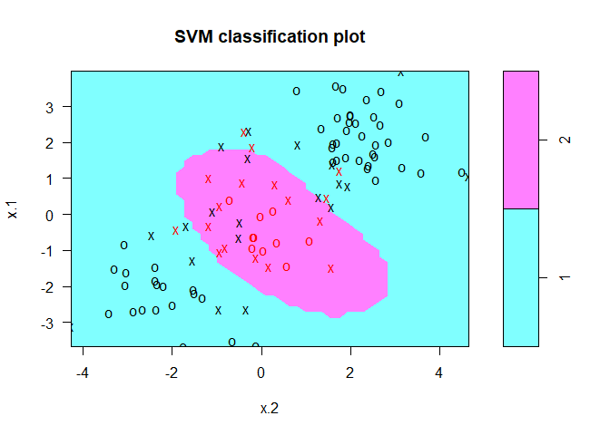<!-- -->

```r
summary(svmfit)
```

```
## 
## Call:
## svm(formula = y ~ ., data = dat[train, ], kernel = "radial", 
##     gamma = 1, cost = 1)
## 
## 
## Parameters:
##    SVM-Type:  C-classification 
##  SVM-Kernel:  radial 
##        cost:  1 
##       gamma:  1 
## 
## Number of Support Vectors:  37
## 
##  ( 17 20 )
## 
## 
## Number of Classes:  2 
## 
## Levels: 
##  1 2
```


```r
svmfit=svm(y~., data=dat[train,], kernel="radial",gamma=1,cost=1e5)
plot(svmfit,dat[train,])
```

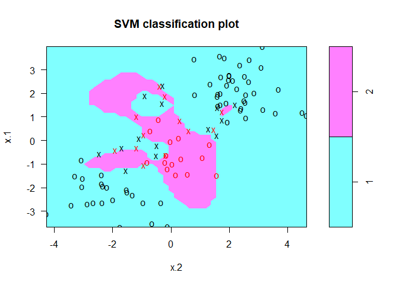<!-- -->


```r
set.seed(1)
tune.out=tune(svm, y~., data=dat[train,], kernel="radial", ranges=list(cost=c(0.1,1,10,100,1000),gamma=c(0.5,1,2,3,4)))
summary(tune.out)
```

```
## 
## Parameter tuning of 'svm':
## 
## - sampling method: 10-fold cross validation 
## 
## - best parameters:
##  cost gamma
##     1     2
## 
## - best performance: 0.12 
## 
## - Detailed performance results:
##     cost gamma error dispersion
## 1  1e-01   0.5  0.27 0.11595018
## 2  1e+00   0.5  0.13 0.08232726
## 3  1e+01   0.5  0.15 0.07071068
## 4  1e+02   0.5  0.17 0.08232726
## 5  1e+03   0.5  0.21 0.09944289
## 6  1e-01   1.0  0.25 0.13540064
## 7  1e+00   1.0  0.13 0.08232726
## 8  1e+01   1.0  0.16 0.06992059
## 9  1e+02   1.0  0.20 0.09428090
## 10 1e+03   1.0  0.20 0.08164966
## 11 1e-01   2.0  0.25 0.12692955
## 12 1e+00   2.0  0.12 0.09189366
## 13 1e+01   2.0  0.17 0.09486833
## 14 1e+02   2.0  0.19 0.09944289
## 15 1e+03   2.0  0.20 0.09428090
## 16 1e-01   3.0  0.27 0.11595018
## 17 1e+00   3.0  0.13 0.09486833
## 18 1e+01   3.0  0.18 0.10327956
## 19 1e+02   3.0  0.21 0.08755950
## 20 1e+03   3.0  0.22 0.10327956
## 21 1e-01   4.0  0.27 0.11595018
## 22 1e+00   4.0  0.15 0.10801234
## 23 1e+01   4.0  0.18 0.11352924
## 24 1e+02   4.0  0.21 0.08755950
## 25 1e+03   4.0  0.24 0.10749677
```

```r
table(true=dat[-train,"y"], pred=predict(tune.out$best.model,newdata=dat[-train,]))
```

```
##     pred
## true  1  2
##    1 74  3
##    2  7 16
```

# ROC Curves


```r
library(ROCR)
```

```
## Loading required package: gplots
```

```
## 
## Attaching package: 'gplots'
```

```
## The following object is masked from 'package:stats':
## 
##     lowess
```

```r
rocplot=function(pred, truth, ...){
   predob = prediction(pred, truth)
   perf = performance(predob, "tpr", "fpr")
   plot(perf,...)}
```


```r
svmfit.opt=svm(y~., data=dat[train,], kernel="radial",gamma=2, cost=1,decision.values=T)
fitted=attributes(predict(svmfit.opt,dat[train,],decision.values=TRUE))$decision.values
par(mfrow=c(1,2))
rocplot(fitted,dat[train,"y"],main="Training Data")

svmfit.flex=svm(y~., data=dat[train,], kernel="radial",gamma=50, cost=1, decision.values=T)
fitted=attributes(predict(svmfit.flex,dat[train,],decision.values=T))$decision.values
rocplot(fitted,dat[train,"y"],add=T,col="red")

fitted=attributes(predict(svmfit.opt,dat[-train,],decision.values=T))$decision.values
rocplot(fitted,dat[-train,"y"],main="Test Data")
fitted=attributes(predict(svmfit.flex,dat[-train,],decision.values=T))$decision.values
rocplot(fitted,dat[-train,"y"],add=T,col="red")
```

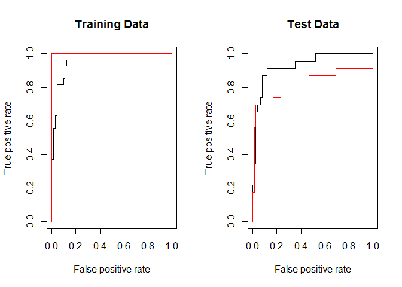<!-- -->

# SVM with Multiple Classes


```r
set.seed(1)
x=rbind(x, matrix(rnorm(50*2), ncol=2))
y=c(y, rep(0,50))
x[y==0,2]=x[y==0,2]+2
dat=data.frame(x=x, y=as.factor(y))
par(mfrow=c(1,1))
plot(x,col=(y+1))
```

<!-- -->

```r
svmfit=svm(y~., data=dat, kernel="radial", cost=10, gamma=1)
plot(svmfit, dat)
```

<!-- -->

# Application to Gene Expression Data


```r
library(ISLR)
names(Khan)
```

```
## [1] "xtrain" "xtest"  "ytrain" "ytest"
```

```r
dim(Khan$xtrain)
```

```
## [1]   63 2308
```

```r
dim(Khan$xtest)
```

```
## [1]   20 2308
```

```r
length(Khan$ytrain)
```

```
## [1] 63
```

```r
length(Khan$ytest)
```

```
## [1] 20
```

```r
table(Khan$ytrain)
```

```
## 
##  1  2  3  4 
##  8 23 12 20
```

```r
table(Khan$ytest)
```

```
## 
## 1 2 3 4 
## 3 6 6 5
```

```r
dat=data.frame(x=Khan$xtrain, y=as.factor(Khan$ytrain))
out=svm(y~., data=dat, kernel="linear",cost=10)
summary(out)
```

```
## 
## Call:
## svm(formula = y ~ ., data = dat, kernel = "linear", cost = 10)
## 
## 
## Parameters:
##    SVM-Type:  C-classification 
##  SVM-Kernel:  linear 
##        cost:  10 
##       gamma:  0.0004332756 
## 
## Number of Support Vectors:  58
## 
##  ( 20 20 11 7 )
## 
## 
## Number of Classes:  4 
## 
## Levels: 
##  1 2 3 4
```

```r
table(out$fitted, dat$y)
```

```
##    
##      1  2  3  4
##   1  8  0  0  0
##   2  0 23  0  0
##   3  0  0 12  0
##   4  0  0  0 20
```


```r
dat.te=data.frame(x=Khan$xtest, y=as.factor(Khan$ytest))
pred.te=predict(out, newdata=dat.te)
table(pred.te, dat.te$y)
```

```
##        
## pred.te 1 2 3 4
##       1 3 0 0 0
##       2 0 6 2 0
##       3 0 0 4 0
##       4 0 0 0 5
```

## 4. Generate a simulated two-class data set with 100 observations and two features in which there is a visible but non-linear separation between the two classes. Show that in this setting, a support vector machine with a polynomial kernel (with degree greater than 1) or a radial kernel will outperform a support vector classifier on the training data. Which technique performs best on the test data? Make plots and report training and test error rates in order to back up your assertions.


```r
set.seed(10111)
x=matrix(rnorm(400),200,2)
y=rep(c(-1,1),c(10,10))
x[y==1,]=x[y==1,] + 2
plot(x, col=y+3,pch=19)
```

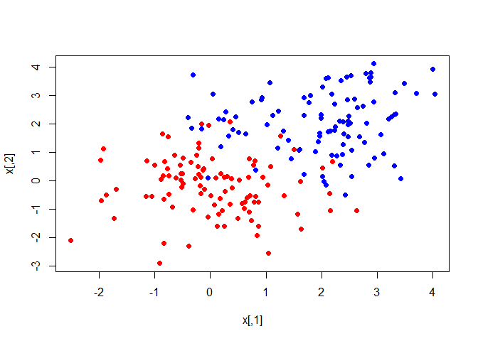<!-- -->

```r
dat=data.frame(x,y=as.factor(y))
dim(dat)
```

```
## [1] 200   3
```

```r
names(dat)
```

```
## [1] "X1" "X2" "y"
```

```r
make.grid=function(x,n=75){
  grange=apply(x,2,range)
  x1=seq(from=grange[1,1],to=grange[2,1],length=n)
  x2=seq(from=grange[1,2],to=grange[2,2],length=n)
  expand.grid(X1=x1,X2=x2)
}

fit=svm(factor(y)~., data=dat, scale=FALSE, kernel="radial",gamma=1,cost=5)
xgrid=make.grid(x)
ygrid=predict(fit,xgrid)
plot(xgrid,col=as.numeric(ygrid),pch=20,cex=.2)
points(x,col=y+1,pch=19)
```

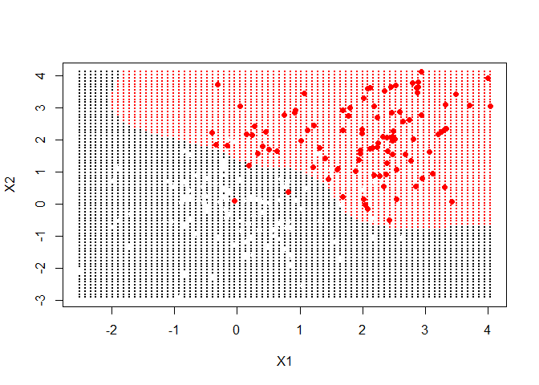<!-- -->

```r
fit=svm(factor(y)~., data=dat, scale=FALSE,  kernel="polynomial",degree=3 ,cost=5)
xgrid=make.grid(x)
ygrid=predict(fit,xgrid)
plot(xgrid,col=as.numeric(ygrid),pch=20,cex=.2)
points(x,col=y+1,pch=19)
```

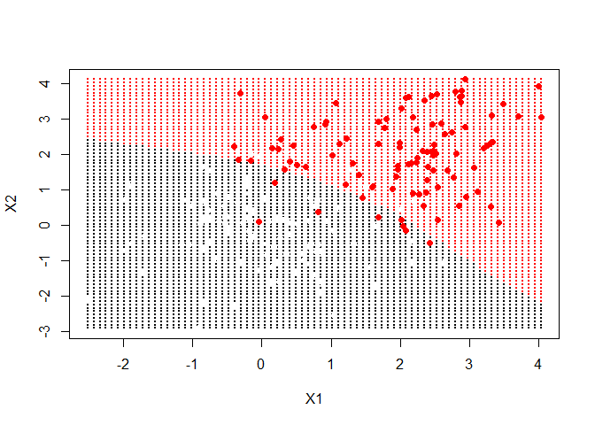<!-- -->


```r
set.seed(1)
train=sample(200,100)

svmfit=svm(y~., data=dat[train,], scale=FALSE, kernel="radial",gamma=1,cost=5)
plot(svmfit, dat[train,])
```

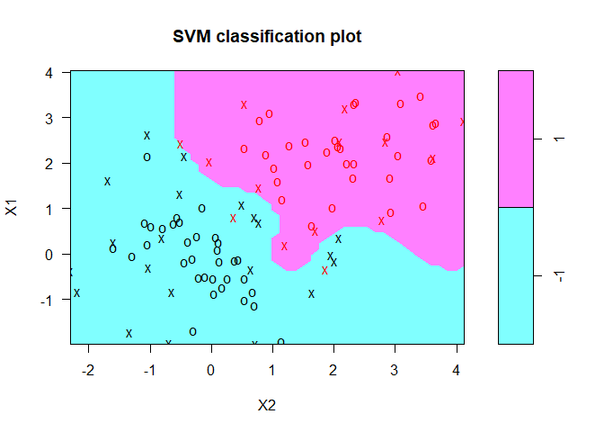<!-- -->

```r
summary(svmfit)
```

```
## 
## Call:
## svm(formula = y ~ ., data = dat[train, ], kernel = "radial", 
##     gamma = 1, cost = 5, scale = FALSE)
## 
## 
## Parameters:
##    SVM-Type:  C-classification 
##  SVM-Kernel:  radial 
##        cost:  5 
##       gamma:  1 
## 
## Number of Support Vectors:  36
## 
##  ( 15 21 )
## 
## 
## Number of Classes:  2 
## 
## Levels: 
##  -1 1
```

```r
table(true=dat[-train,"y"], pred=predict(svmfit,newdata=dat[-train,]))
```

```
##     pred
## true -1  1
##   -1 39  7
##   1   8 46
```

```r
svmfit=svm(y~., data=dat[train,], scale=FALSE, kernel="polynomial",degree=3 ,cost=5)
plot(svmfit, dat[train,])
```

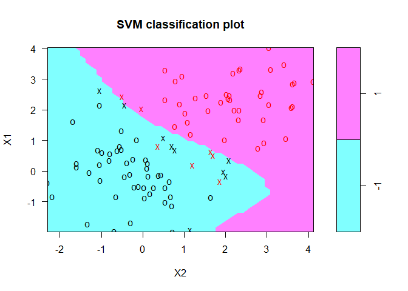<!-- -->

```r
summary(svmfit)
```

```
## 
## Call:
## svm(formula = y ~ ., data = dat[train, ], kernel = "polynomial", 
##     degree = 3, cost = 5, scale = FALSE)
## 
## 
## Parameters:
##    SVM-Type:  C-classification 
##  SVM-Kernel:  polynomial 
##        cost:  5 
##      degree:  3 
##       gamma:  0.5 
##      coef.0:  0 
## 
## Number of Support Vectors:  16
## 
##  ( 7 9 )
## 
## 
## Number of Classes:  2 
## 
## Levels: 
##  -1 1
```

```r
table(true=dat[-train,"y"], pred=predict(svmfit,newdata=dat[-train,]))
```

```
##     pred
## true -1  1
##   -1 42  4
##   1   7 47
```

> polynomial is better, which may cause by parameters.


```r
set.seed(1)
tune.out=tune(svm, y~., data=dat[train,], kernel="radial", ranges=list(cost=c(0.1,1,10,100,1000),gamma=c(0.5,1,2,3,4)))
summary(tune.out)
```

```
## 
## Parameter tuning of 'svm':
## 
## - sampling method: 10-fold cross validation 
## 
## - best parameters:
##  cost gamma
##   0.1   0.5
## 
## - best performance: 0.05 
## 
## - Detailed performance results:
##     cost gamma error dispersion
## 1  1e-01   0.5  0.05 0.05270463
## 2  1e+00   0.5  0.09 0.09944289
## 3  1e+01   0.5  0.08 0.09189366
## 4  1e+02   0.5  0.10 0.10540926
## 5  1e+03   0.5  0.09 0.11005049
## 6  1e-01   1.0  0.05 0.05270463
## 7  1e+00   1.0  0.09 0.09944289
## 8  1e+01   1.0  0.08 0.09189366
## 9  1e+02   1.0  0.08 0.10327956
## 10 1e+03   1.0  0.11 0.09944289
## 11 1e-01   2.0  0.05 0.05270463
## 12 1e+00   2.0  0.08 0.10327956
## 13 1e+01   2.0  0.09 0.11005049
## 14 1e+02   2.0  0.10 0.10540926
## 15 1e+03   2.0  0.12 0.11352924
## 16 1e-01   3.0  0.08 0.09189366
## 17 1e+00   3.0  0.07 0.09486833
## 18 1e+01   3.0  0.08 0.10327956
## 19 1e+02   3.0  0.12 0.09189366
## 20 1e+03   3.0  0.12 0.09189366
## 21 1e-01   4.0  0.19 0.16633300
## 22 1e+00   4.0  0.07 0.09486833
## 23 1e+01   4.0  0.10 0.10540926
## 24 1e+02   4.0  0.13 0.08232726
## 25 1e+03   4.0  0.13 0.08232726
```

```r
table(true=dat[-train,"y"], pred=predict(tune.out$best.model,newdata=dat[-train,]))
```

```
##     pred
## true -1  1
##   -1 42  4
##   1   5 49
```

> radial is better.

## 5. We have seen that we can fit an SVM with a non-linear kernel in order to perform classification using a non-linear decision boundary. We will now see that we can also obtain a non-linear decision boundary by performing logistic regression using non-linear transformations of the features.

### (a) Generate a data set with n = 500 and p = 2, such that the observations belong to two classes with a quadratic decision boundary between them. For instance, you can do this as follows:

```r
set.seed(1)
x1= runif (500) -0.5
x2= runif (500) -0.5
y=1*( x1^2- x2 ^2 > 0)
dat5a=data.frame(x1,x2,y=as.factor(y))
dim(dat5a)
```

```
## [1] 500   3
```

```r
names(dat5a)
```

```
## [1] "x1" "x2" "y"
```

```r
head(dat5a)
```

```
##            x1          x2 y
## 1 -0.23449134  0.05417706 1
## 2 -0.12787610  0.18827524 0
## 3  0.07285336  0.15805755 0
## 4  0.40820779  0.16334273 1
## 5 -0.29831807 -0.02776580 1
## 6  0.39838968  0.46952817 0
```

### (b) Plot the observations, colored according to their class labels.
Your plot should display X 1 on the x-axis, and X 2 on the y-axis.


```r
plot(x1,x2, col=y+3,pch=19)
```

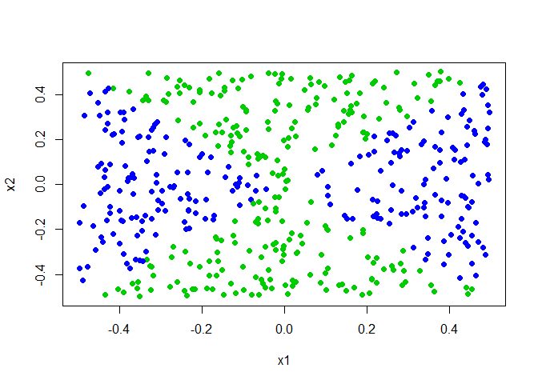<!-- -->


### (c) Fit a logistic regression model to the data, using X 1 and X 2 as predictors.


```r
glm.fits=glm(y~x1+x2,data=dat5a,family=binomial)
summary(glm.fits)
```

```
## 
## Call:
## glm(formula = y ~ x1 + x2, family = binomial, data = dat5a)
## 
## Deviance Residuals: 
##    Min      1Q  Median      3Q     Max  
## -1.179  -1.139  -1.112   1.206   1.257  
## 
## Coefficients:
##              Estimate Std. Error z value Pr(>|z|)
## (Intercept) -0.087260   0.089579  -0.974    0.330
## x1           0.196199   0.316864   0.619    0.536
## x2          -0.002854   0.305712  -0.009    0.993
## 
## (Dispersion parameter for binomial family taken to be 1)
## 
##     Null deviance: 692.18  on 499  degrees of freedom
## Residual deviance: 691.79  on 497  degrees of freedom
## AIC: 697.79
## 
## Number of Fisher Scoring iterations: 3
```


### (d) Apply this model to the training data in order to obtain a predicted class label for each training observation. Plot the observations, colored according to the predicted class labels. The decision boundary should be linear.


```r
glm.probs=predict(glm.fits,type="response")
glm.probs[1:10]
```

```
##         1         2         3         4         5         6         7 
## 0.4666940 0.4718083 0.4816539 0.4980910 0.4636367 0.4973910 0.5000660 
##         8         9        10 
## 0.4858265 0.4843401 0.4567756
```

```r
glm.pred=rep(1,500)
glm.pred[glm.probs>0.5]=2
table(glm.pred,y)
```

```
##         y
## glm.pred   0   1
##        1 258 212
##        2   3  27
```

```r
plot(x1,x2, col=glm.pred,pch=y)
```

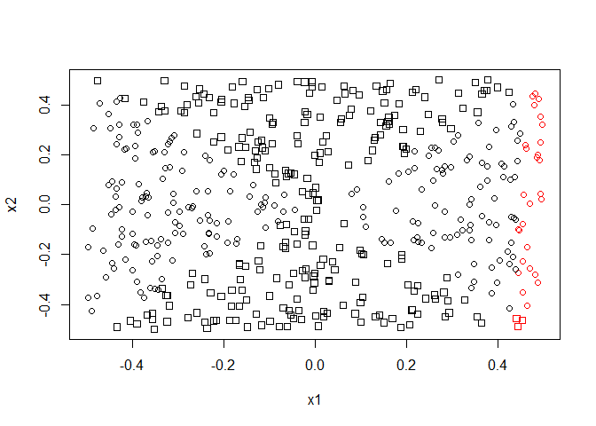<!-- -->


### (e) Now fit a logistic regression model to the data using non-linear functions of X 1 and X 2 as predictors (e.g. X 2 1 , X 1 × X 2 , log(X 2 ), and so forth).


```r
glm.fits=glm(y~poly(x1,3)+poly(x2,3),data=dat5a,family=binomial)
```

```
## Warning: glm.fit: algorithm did not converge
```

```
## Warning: glm.fit: fitted probabilities numerically 0 or 1 occurred
```

```r
summary(glm.fits)
```

```
## 
## Call:
## glm(formula = y ~ poly(x1, 3) + poly(x2, 3), family = binomial, 
##     data = dat5a)
## 
## Deviance Residuals: 
##        Min          1Q      Median          3Q         Max  
## -8.116e-04  -2.000e-08  -2.000e-08   2.000e-08   1.098e-03  
## 
## Coefficients:
##              Estimate Std. Error z value Pr(>|z|)
## (Intercept)    -112.8     7700.8  -0.015    0.988
## poly(x1, 3)1   2320.9   202067.7   0.011    0.991
## poly(x1, 3)2  26012.9   817440.0   0.032    0.975
## poly(x1, 3)3   -238.4   100966.6  -0.002    0.998
## poly(x2, 3)1    200.2    85132.7   0.002    0.998
## poly(x2, 3)2 -27719.8   872877.7  -0.032    0.975
## poly(x2, 3)3    387.8    62341.3   0.006    0.995
## 
## (Dispersion parameter for binomial family taken to be 1)
## 
##     Null deviance: 6.9218e+02  on 499  degrees of freedom
## Residual deviance: 3.3141e-06  on 493  degrees of freedom
## AIC: 14
## 
## Number of Fisher Scoring iterations: 25
```


### (f) Apply this model to the training data in order to obtain a predicted class label for each training observation. Plot the observations, colored according to the predicted class labels. The decision boundary should be obviously non-linear. If it is not, then repeat (a)-(e) until you come up with an example in which the predicted class labels are obviously non-linear.


```r
glm.probs=predict(glm.fits,type="response")
glm.probs[1:10]
```

```
##            1            2            3            4            5 
## 1.000000e+00 2.220446e-16 2.220446e-16 1.000000e+00 1.000000e+00 
##            6            7            8            9           10 
## 2.220446e-16 1.000000e+00 2.220446e-16 2.220446e-16 1.000000e+00
```

```r
glm.pred=rep(1,500)
glm.pred[glm.probs>0.5]=2
table(glm.pred,y)
```

```
##         y
## glm.pred   0   1
##        1 261   0
##        2   0 239
```

```r
plot(x1,x2, col=glm.pred,pch=y)
```

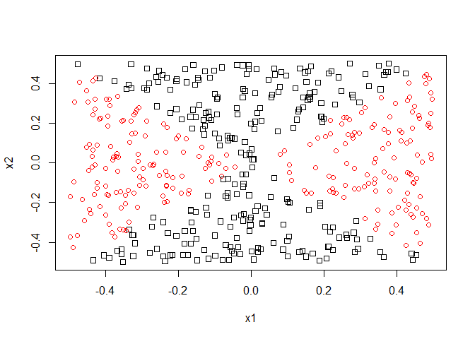<!-- -->


### (g) Fit a support vector classifier to the data with X 1 and X 2 as predictors. Obtain a class prediction for each training observation. Plot the observations, colored according to the predicted class labels.


```r
svmfit=svm(y~x1+x2, data=dat5a, kernel="linear", cost=10, scale=FALSE)
print(svmfit)
```

```
## 
## Call:
## svm(formula = y ~ x1 + x2, data = dat5a, kernel = "linear", cost = 10, 
##     scale = FALSE)
## 
## 
## Parameters:
##    SVM-Type:  C-classification 
##  SVM-Kernel:  linear 
##        cost:  10 
##       gamma:  0.5 
## 
## Number of Support Vectors:  482
```

```r
plot(svmfit, dat5a)
```

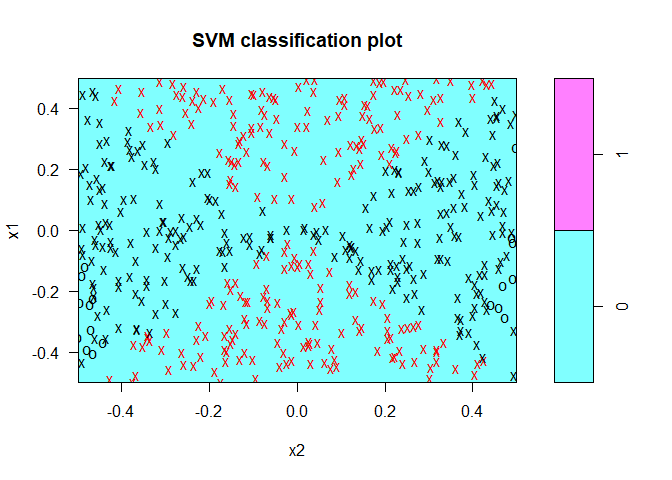<!-- -->

```r
set.seed(1)
tune.out=tune(svm, y~x1+x2, data=dat5a, kernel="linear", ranges=list(cost=c(0.01,0.1,1,10,100)))
summary(tune.out)
```

```
## 
## Parameter tuning of 'svm':
## 
## - sampling method: 10-fold cross validation 
## 
## - best parameters:
##  cost
##  0.01
## 
## - best performance: 0.478 
## 
## - Detailed performance results:
##    cost error dispersion
## 1 1e-02 0.478 0.04848826
## 2 1e-01 0.478 0.04848826
## 3 1e+00 0.478 0.04848826
## 4 1e+01 0.478 0.04848826
## 5 1e+02 0.478 0.04848826
```

```r
svm.pred=predict(tune.out$best.model,newdata=dat5a)
table(true=y,pred=svm.pred)
```

```
##     pred
## true   0   1
##    0 261   0
##    1 239   0
```

```r
plot(x1,x2, col=svm.pred, pch=y)
```

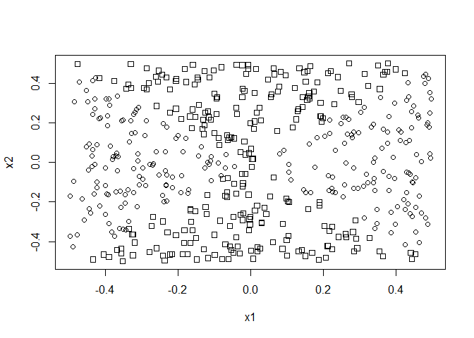<!-- -->


### (h) Fit a SVM using a non-linear kernel to the data. Obtain a class prediction for each training observation. Plot the observations, colored according to the predicted class labels.


```r
set.seed(1)
tune.out=tune(svm, y~x1+x2, data=dat5a, kernel="radial", ranges=list(cost=c(0.01,0.1,1,10,100),gamma=c(0.5,1,2,3,4)))
summary(tune.out)
```

```
## 
## Parameter tuning of 'svm':
## 
## - sampling method: 10-fold cross validation 
## 
## - best parameters:
##  cost gamma
##   100     2
## 
## - best performance: 0.014 
## 
## - Detailed performance results:
##     cost gamma error dispersion
## 1  1e-02   0.5 0.478 0.04848826
## 2  1e-01   0.5 0.070 0.02357023
## 3  1e+00   0.5 0.048 0.02859681
## 4  1e+01   0.5 0.032 0.03155243
## 5  1e+02   0.5 0.026 0.03134042
## 6  1e-02   1.0 0.478 0.04848826
## 7  1e-01   1.0 0.068 0.02529822
## 8  1e+00   1.0 0.036 0.02796824
## 9  1e+01   1.0 0.026 0.02674987
## 10 1e+02   1.0 0.016 0.02458545
## 11 1e-02   2.0 0.478 0.04848826
## 12 1e-01   2.0 0.062 0.04467164
## 13 1e+00   2.0 0.032 0.02699794
## 14 1e+01   2.0 0.020 0.02108185
## 15 1e+02   2.0 0.014 0.02118700
## 16 1e-02   3.0 0.478 0.04848826
## 17 1e-01   3.0 0.050 0.03800585
## 18 1e+00   3.0 0.026 0.03134042
## 19 1e+01   3.0 0.022 0.01988858
## 20 1e+02   3.0 0.018 0.02201010
## 21 1e-02   4.0 0.478 0.04848826
## 22 1e-01   4.0 0.042 0.03047768
## 23 1e+00   4.0 0.024 0.02796824
## 24 1e+01   4.0 0.018 0.01751190
## 25 1e+02   4.0 0.024 0.02270585
```

```r
svm.pred=predict(tune.out$best.model,newdata=dat5a)
table(true=y,pred=svm.pred)
```

```
##     pred
## true   0   1
##    0 260   1
##    1   1 238
```

```r
plot(x1,x2, col=svm.pred, pch=y)
```

<!-- -->


### (i) Comment on your results.

> a SVM using a non-linear kernel and a logistic regression model with non-linear functions are better.

## 7. In this problem, you will use support vector approaches in order to predict whether a given car gets high or low gas mileage based on the Auto data set.

### (a) Create a binary variable that takes on a 1 for cars with gas mileage above the median, and a 0 for cars with gas mileage below the median.


```r
library(ISLR)
summary(Auto)
```

```
##       mpg          cylinders      displacement     horsepower   
##  Min.   : 9.00   Min.   :3.000   Min.   : 68.0   Min.   : 46.0  
##  1st Qu.:17.00   1st Qu.:4.000   1st Qu.:105.0   1st Qu.: 75.0  
##  Median :22.75   Median :4.000   Median :151.0   Median : 93.5  
##  Mean   :23.45   Mean   :5.472   Mean   :194.4   Mean   :104.5  
##  3rd Qu.:29.00   3rd Qu.:8.000   3rd Qu.:275.8   3rd Qu.:126.0  
##  Max.   :46.60   Max.   :8.000   Max.   :455.0   Max.   :230.0  
##                                                                 
##      weight      acceleration        year           origin     
##  Min.   :1613   Min.   : 8.00   Min.   :70.00   Min.   :1.000  
##  1st Qu.:2225   1st Qu.:13.78   1st Qu.:73.00   1st Qu.:1.000  
##  Median :2804   Median :15.50   Median :76.00   Median :1.000  
##  Mean   :2978   Mean   :15.54   Mean   :75.98   Mean   :1.577  
##  3rd Qu.:3615   3rd Qu.:17.02   3rd Qu.:79.00   3rd Qu.:2.000  
##  Max.   :5140   Max.   :24.80   Max.   :82.00   Max.   :3.000  
##                                                                
##                  name    
##  amc matador       :  5  
##  ford pinto        :  5  
##  toyota corolla    :  5  
##  amc gremlin       :  4  
##  amc hornet        :  4  
##  chevrolet chevette:  4  
##  (Other)           :365
```

```r
#?Auto
Auto$BI=as.factor(ifelse(Auto$mpg>22.75, 1, 0))
summary(Auto)
```

```
##       mpg          cylinders      displacement     horsepower   
##  Min.   : 9.00   Min.   :3.000   Min.   : 68.0   Min.   : 46.0  
##  1st Qu.:17.00   1st Qu.:4.000   1st Qu.:105.0   1st Qu.: 75.0  
##  Median :22.75   Median :4.000   Median :151.0   Median : 93.5  
##  Mean   :23.45   Mean   :5.472   Mean   :194.4   Mean   :104.5  
##  3rd Qu.:29.00   3rd Qu.:8.000   3rd Qu.:275.8   3rd Qu.:126.0  
##  Max.   :46.60   Max.   :8.000   Max.   :455.0   Max.   :230.0  
##                                                                 
##      weight      acceleration        year           origin     
##  Min.   :1613   Min.   : 8.00   Min.   :70.00   Min.   :1.000  
##  1st Qu.:2225   1st Qu.:13.78   1st Qu.:73.00   1st Qu.:1.000  
##  Median :2804   Median :15.50   Median :76.00   Median :1.000  
##  Mean   :2978   Mean   :15.54   Mean   :75.98   Mean   :1.577  
##  3rd Qu.:3615   3rd Qu.:17.02   3rd Qu.:79.00   3rd Qu.:2.000  
##  Max.   :5140   Max.   :24.80   Max.   :82.00   Max.   :3.000  
##                                                                
##                  name     BI     
##  amc matador       :  5   0:196  
##  ford pinto        :  5   1:196  
##  toyota corolla    :  5          
##  amc gremlin       :  4          
##  amc hornet        :  4          
##  chevrolet chevette:  4          
##  (Other)           :365
```

### (b) Fit a support vector classifier to the data with various values of cost, in order to predict whether a car gets high or low gas mileage. Report the cross-validation errors associated with different values of this parameter. Comment on your results.


```r
set.seed(11)
tune.out=tune(svm, BI~., data=Auto, kernel="linear", ranges=list(cost=c(0.1,1,10,100,1000)))
summary(tune.out)
```

```
## 
## Parameter tuning of 'svm':
## 
## - sampling method: 10-fold cross validation 
## 
## - best parameters:
##  cost
##     1
## 
## - best performance: 0.01025641 
## 
## - Detailed performance results:
##    cost      error dispersion
## 1 1e-01 0.03833333 0.03027982
## 2 1e+00 0.01025641 0.01792836
## 3 1e+01 0.01794872 0.02110955
## 4 1e+02 0.03070513 0.03153205
## 5 1e+03 0.03070513 0.03153205
```

```r
bestmod=tune.out$best.model
summary(bestmod)
```

```
## 
## Call:
## best.tune(method = svm, train.x = BI ~ ., data = Auto, ranges = list(cost = c(0.1, 
##     1, 10, 100, 1000)), kernel = "linear")
## 
## 
## Parameters:
##    SVM-Type:  C-classification 
##  SVM-Kernel:  linear 
##        cost:  1 
##       gamma:  0.003205128 
## 
## Number of Support Vectors:  56
## 
##  ( 26 30 )
## 
## 
## Number of Classes:  2 
## 
## Levels: 
##  0 1
```

### (c) Now repeat (b), this time using SVMs with radial and polynomial basis kernels, with different values of gamma and degree and cost. Comment on your results.


```r
set.seed(11)
tune.out=tune(svm, BI~., data=Auto, kernel="radial", ranges=list(cost=c(0.1,1,10,100,1000),gamma=c(0.5,1,2,3,4)))
summary(tune.out)
```

```
## 
## Parameter tuning of 'svm':
## 
## - sampling method: 10-fold cross validation 
## 
## - best parameters:
##  cost gamma
##    10   0.5
## 
## - best performance: 0.04326923 
## 
## - Detailed performance results:
##     cost gamma      error dispersion
## 1  1e-01   0.5 0.08403846 0.05627935
## 2  1e+00   0.5 0.05083333 0.04312858
## 3  1e+01   0.5 0.04326923 0.03614239
## 4  1e+02   0.5 0.04326923 0.03614239
## 5  1e+03   0.5 0.04326923 0.03614239
## 6  1e-01   1.0 0.59679487 0.06655151
## 7  1e+00   1.0 0.06615385 0.05389175
## 8  1e+01   1.0 0.06365385 0.05137994
## 9  1e+02   1.0 0.06365385 0.05137994
## 10 1e+03   1.0 0.06365385 0.05137994
## 11 1e-01   2.0 0.59679487 0.06655151
## 12 1e+00   2.0 0.14525641 0.08159607
## 13 1e+01   2.0 0.13500000 0.08324464
## 14 1e+02   2.0 0.13500000 0.08324464
## 15 1e+03   2.0 0.13500000 0.08324464
## 16 1e-01   3.0 0.59679487 0.06655151
## 17 1e+00   3.0 0.45884615 0.12955021
## 18 1e+01   3.0 0.44602564 0.14230089
## 19 1e+02   3.0 0.44602564 0.14230089
## 20 1e+03   3.0 0.44602564 0.14230089
## 21 1e-01   4.0 0.59679487 0.06655151
## 22 1e+00   4.0 0.50500000 0.07002603
## 23 1e+01   4.0 0.49987179 0.07227455
## 24 1e+02   4.0 0.49987179 0.07227455
## 25 1e+03   4.0 0.49987179 0.07227455
```

```r
bestmod.r=tune.out$best.model
summary(bestmod.r)
```

```
## 
## Call:
## best.tune(method = svm, train.x = BI ~ ., data = Auto, ranges = list(cost = c(0.1, 
##     1, 10, 100, 1000), gamma = c(0.5, 1, 2, 3, 4)), kernel = "radial")
## 
## 
## Parameters:
##    SVM-Type:  C-classification 
##  SVM-Kernel:  radial 
##        cost:  10 
##       gamma:  0.5 
## 
## Number of Support Vectors:  259
## 
##  ( 127 132 )
## 
## 
## Number of Classes:  2 
## 
## Levels: 
##  0 1
```

```r
svm.pred=predict(bestmod.r,newdata=Auto)
table(true=Auto$BI,pred=svm.pred)
```

```
##     pred
## true   0   1
##    0 196   0
##    1   0 196
```

```r
#
tune.out=tune(svm, BI~., data=Auto, kernel="polynomial", ranges=list(cost=c(0.1,1,10,100,1000),degree=c(1,2,3,4,5)))
summary(tune.out)
```

```
## 
## Parameter tuning of 'svm':
## 
## - sampling method: 10-fold cross validation 
## 
## - best parameters:
##  cost degree
##  1000      1
## 
## - best performance: 0.01282051 
## 
## - Detailed performance results:
##     cost degree      error dispersion
## 1  1e-01      1 0.13820513 0.08503533
## 2  1e+00      1 0.07923077 0.04604708
## 3  1e+01      1 0.06134615 0.05304144
## 4  1e+02      1 0.02307692 0.02821808
## 5  1e+03      1 0.01282051 0.01813094
## 6  1e-01      2 0.53576923 0.02483197
## 7  1e+00      2 0.53576923 0.02483197
## 8  1e+01      2 0.51044872 0.12874390
## 9  1e+02      2 0.29858974 0.06097334
## 10 1e+03      2 0.23000000 0.09735236
## 11 1e-01      3 0.53576923 0.02483197
## 12 1e+00      3 0.53576923 0.02483197
## 13 1e+01      3 0.53576923 0.02483197
## 14 1e+02      3 0.33942308 0.07403607
## 15 1e+03      3 0.25282051 0.07930270
## 16 1e-01      4 0.53576923 0.02483197
## 17 1e+00      4 0.53576923 0.02483197
## 18 1e+01      4 0.53576923 0.02483197
## 19 1e+02      4 0.53576923 0.02483197
## 20 1e+03      4 0.51269231 0.06808217
## 21 1e-01      5 0.53576923 0.02483197
## 22 1e+00      5 0.53576923 0.02483197
## 23 1e+01      5 0.53576923 0.02483197
## 24 1e+02      5 0.53576923 0.02483197
## 25 1e+03      5 0.53576923 0.02483197
```

```r
bestmod.p=tune.out$best.model
summary(bestmod.p)
```

```
## 
## Call:
## best.tune(method = svm, train.x = BI ~ ., data = Auto, ranges = list(cost = c(0.1, 
##     1, 10, 100, 1000), degree = c(1, 2, 3, 4, 5)), kernel = "polynomial")
## 
## 
## Parameters:
##    SVM-Type:  C-classification 
##  SVM-Kernel:  polynomial 
##        cost:  1000 
##      degree:  1 
##       gamma:  0.003205128 
##      coef.0:  0 
## 
## Number of Support Vectors:  49
## 
##  ( 25 24 )
## 
## 
## Number of Classes:  2 
## 
## Levels: 
##  0 1
```

```r
svm.pred=predict(bestmod.p,newdata=Auto)
table(true=Auto$BI,pred=svm.pred)
```

```
##     pred
## true   0   1
##    0 196   0
##    1   1 195
```


### (d) Make some plots to back up your assertions in (b) and (c).
Hint: In the lab, we used the plot() function for svm objects
only in cases with p = 2. When p > 2, you can use the plot()
function to create plots displaying pairs of variables at a time.
Essentially, instead of typing

plot(svmfit , dat)

where svmfit contains your fitted model and dat is a data frame
containing your data, you can type

plot(svmfit , dat , x1 ~ x4)

in order to plot just the first and fourth variables. However, you
must replace x1 and x4 with the correct variable names. To find
out more, type ?plot.svm.


```r
names(Auto)
```

```
##  [1] "mpg"          "cylinders"    "displacement" "horsepower"  
##  [5] "weight"       "acceleration" "year"         "origin"      
##  [9] "name"         "BI"
```

```r
plot(bestmod.r,data=Auto,mpg~cylinders)
```

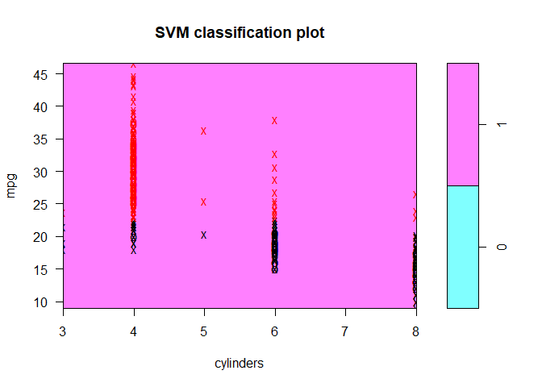<!-- -->

```r
plot(bestmod.r,data=Auto,mpg~displacement)
```

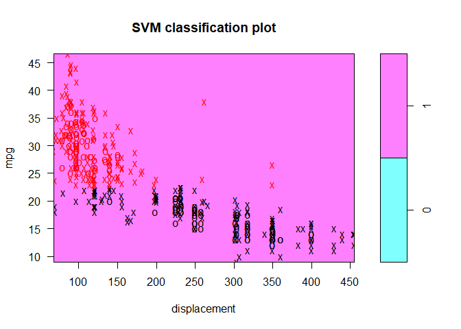<!-- -->

```r
plot(bestmod.r,data=Auto,mpg~horsepower)
```

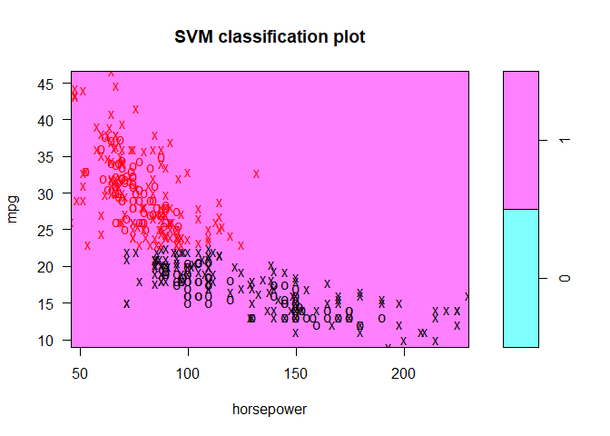<!-- -->

```r
plot(bestmod.r,data=Auto,mpg~weight)
```

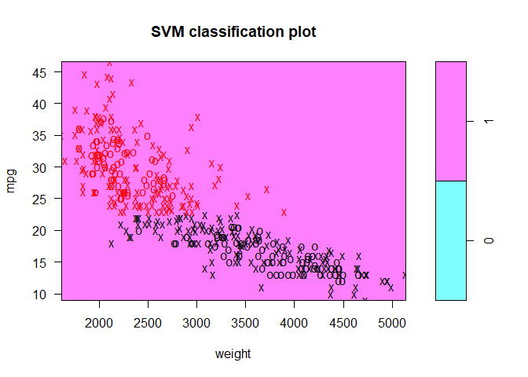<!-- -->

```r
plot(bestmod.r,data=Auto,mpg~acceleration)
```

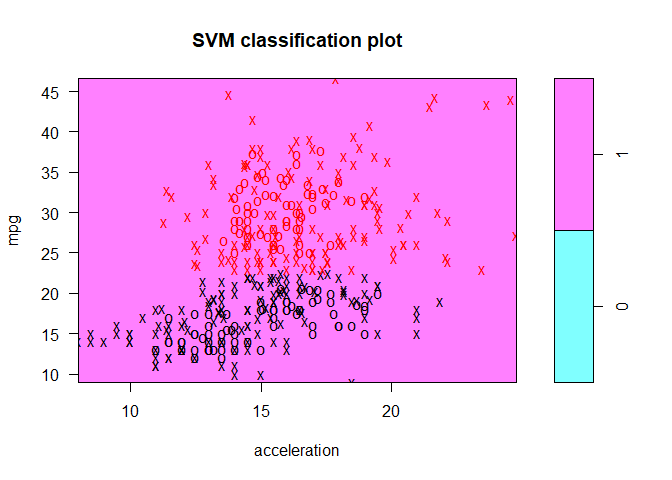<!-- -->

```r
plot(bestmod.r,data=Auto,mpg~year)
```

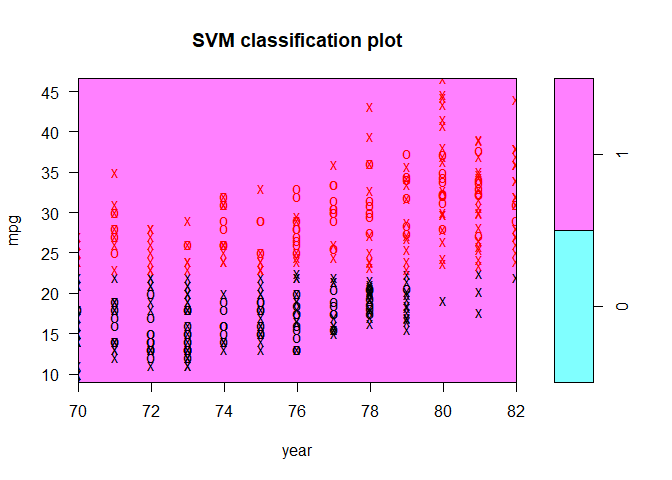<!-- -->

```r
plot(bestmod.r,data=Auto,mpg~origin)
```

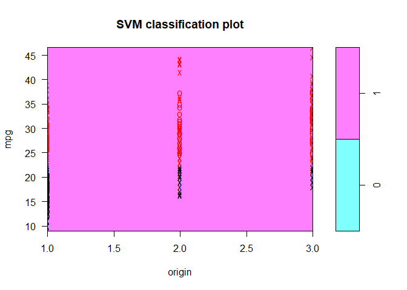<!-- -->

```r
plot(bestmod.p,data=Auto,mpg~cylinders)
```

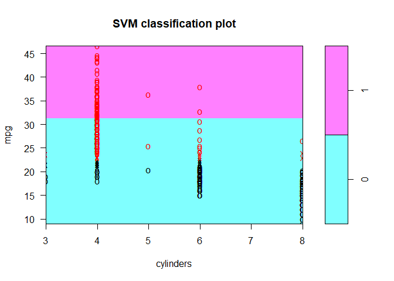<!-- -->

```r
plot(bestmod.p,data=Auto,mpg~displacement)
```

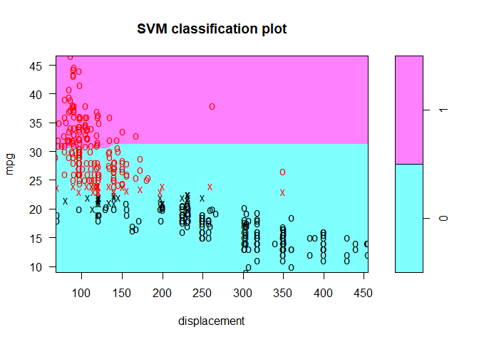<!-- -->

```r
plot(bestmod.p,data=Auto,mpg~horsepower)
```

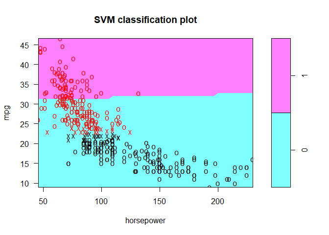<!-- -->

```r
plot(bestmod.p,data=Auto,mpg~weight)
```

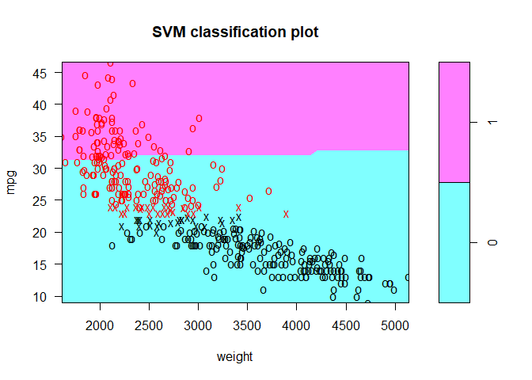<!-- -->

```r
plot(bestmod.p,data=Auto,mpg~acceleration)
```

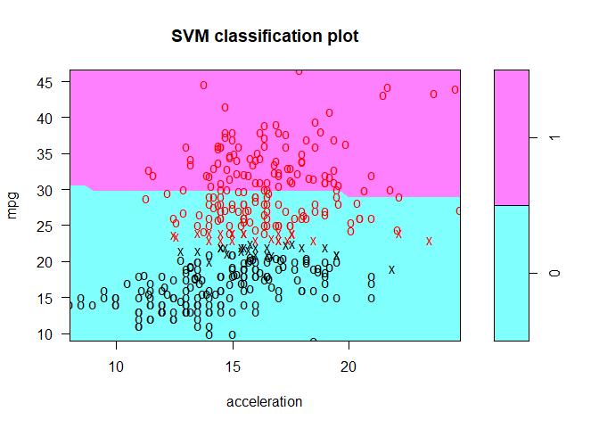<!-- -->

```r
plot(bestmod.p,data=Auto,mpg~year)
```

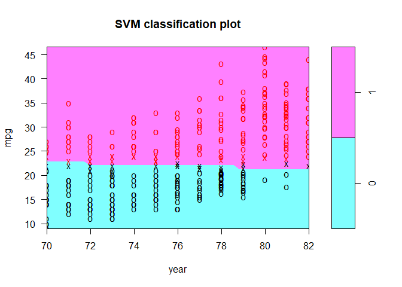<!-- -->

```r
plot(bestmod.p,data=Auto,mpg~origin)
```

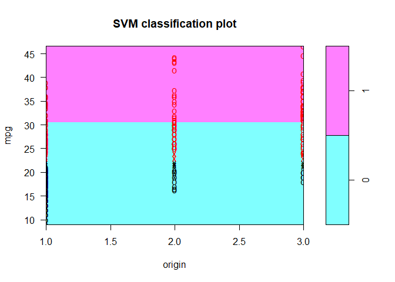<!-- -->


## 8. This problem involves the OJ data set which is part of the ISLR package.
### (a) Create a training set containing a random sample of 800 observations, and a test set containing the remaining observations.


```r
summary(OJ)
```

```
##  Purchase WeekofPurchase     StoreID        PriceCH         PriceMM     
##  CH:653   Min.   :227.0   Min.   :1.00   Min.   :1.690   Min.   :1.690  
##  MM:417   1st Qu.:240.0   1st Qu.:2.00   1st Qu.:1.790   1st Qu.:1.990  
##           Median :257.0   Median :3.00   Median :1.860   Median :2.090  
##           Mean   :254.4   Mean   :3.96   Mean   :1.867   Mean   :2.085  
##           3rd Qu.:268.0   3rd Qu.:7.00   3rd Qu.:1.990   3rd Qu.:2.180  
##           Max.   :278.0   Max.   :7.00   Max.   :2.090   Max.   :2.290  
##      DiscCH            DiscMM         SpecialCH        SpecialMM     
##  Min.   :0.00000   Min.   :0.0000   Min.   :0.0000   Min.   :0.0000  
##  1st Qu.:0.00000   1st Qu.:0.0000   1st Qu.:0.0000   1st Qu.:0.0000  
##  Median :0.00000   Median :0.0000   Median :0.0000   Median :0.0000  
##  Mean   :0.05186   Mean   :0.1234   Mean   :0.1477   Mean   :0.1617  
##  3rd Qu.:0.00000   3rd Qu.:0.2300   3rd Qu.:0.0000   3rd Qu.:0.0000  
##  Max.   :0.50000   Max.   :0.8000   Max.   :1.0000   Max.   :1.0000  
##     LoyalCH          SalePriceMM     SalePriceCH      PriceDiff      
##  Min.   :0.000011   Min.   :1.190   Min.   :1.390   Min.   :-0.6700  
##  1st Qu.:0.325257   1st Qu.:1.690   1st Qu.:1.750   1st Qu.: 0.0000  
##  Median :0.600000   Median :2.090   Median :1.860   Median : 0.2300  
##  Mean   :0.565782   Mean   :1.962   Mean   :1.816   Mean   : 0.1465  
##  3rd Qu.:0.850873   3rd Qu.:2.130   3rd Qu.:1.890   3rd Qu.: 0.3200  
##  Max.   :0.999947   Max.   :2.290   Max.   :2.090   Max.   : 0.6400  
##  Store7      PctDiscMM        PctDiscCH       ListPriceDiff  
##  No :714   Min.   :0.0000   Min.   :0.00000   Min.   :0.000  
##  Yes:356   1st Qu.:0.0000   1st Qu.:0.00000   1st Qu.:0.140  
##            Median :0.0000   Median :0.00000   Median :0.240  
##            Mean   :0.0593   Mean   :0.02731   Mean   :0.218  
##            3rd Qu.:0.1127   3rd Qu.:0.00000   3rd Qu.:0.300  
##            Max.   :0.4020   Max.   :0.25269   Max.   :0.440  
##      STORE      
##  Min.   :0.000  
##  1st Qu.:0.000  
##  Median :2.000  
##  Mean   :1.631  
##  3rd Qu.:3.000  
##  Max.   :4.000
```

```r
dim(OJ)
```

```
## [1] 1070   18
```

```r
set.seed(1)
train=sample(1:nrow(OJ), 800, replace = F)
traindata=OJ[train,]
testdata=OJ[-train,]
summary(traindata)
```

```
##  Purchase WeekofPurchase     StoreID         PriceCH         PriceMM     
##  CH:494   Min.   :227.0   Min.   :1.000   Min.   :1.690   Min.   :1.690  
##  MM:306   1st Qu.:240.0   1st Qu.:2.000   1st Qu.:1.790   1st Qu.:1.990  
##           Median :257.0   Median :3.000   Median :1.860   Median :2.090  
##           Mean   :254.5   Mean   :3.914   Mean   :1.867   Mean   :2.083  
##           3rd Qu.:269.0   3rd Qu.:7.000   3rd Qu.:1.990   3rd Qu.:2.180  
##           Max.   :278.0   Max.   :7.000   Max.   :2.090   Max.   :2.290  
##      DiscCH            DiscMM         SpecialCH        SpecialMM     
##  Min.   :0.00000   Min.   :0.0000   Min.   :0.0000   Min.   :0.0000  
##  1st Qu.:0.00000   1st Qu.:0.0000   1st Qu.:0.0000   1st Qu.:0.0000  
##  Median :0.00000   Median :0.0000   Median :0.0000   Median :0.0000  
##  Mean   :0.05304   Mean   :0.1199   Mean   :0.1425   Mean   :0.1625  
##  3rd Qu.:0.00000   3rd Qu.:0.2100   3rd Qu.:0.0000   3rd Qu.:0.0000  
##  Max.   :0.50000   Max.   :0.8000   Max.   :1.0000   Max.   :1.0000  
##     LoyalCH          SalePriceMM     SalePriceCH      PriceDiff      
##  Min.   :0.000011   Min.   :1.190   Min.   :1.390   Min.   :-0.6700  
##  1st Qu.:0.320000   1st Qu.:1.690   1st Qu.:1.750   1st Qu.: 0.0000  
##  Median :0.600000   Median :2.090   Median :1.860   Median : 0.2300  
##  Mean   :0.571341   Mean   :1.963   Mean   :1.814   Mean   : 0.1489  
##  3rd Qu.:0.868928   3rd Qu.:2.130   3rd Qu.:1.890   3rd Qu.: 0.3200  
##  Max.   :0.999934   Max.   :2.290   Max.   :2.090   Max.   : 0.6400  
##  Store7      PctDiscMM        PctDiscCH       ListPriceDiff   
##  No :540   Min.   :0.0000   Min.   :0.00000   Min.   :0.0000  
##  Yes:260   1st Qu.:0.0000   1st Qu.:0.00000   1st Qu.:0.1300  
##            Median :0.0000   Median :0.00000   Median :0.2400  
##            Mean   :0.0577   Mean   :0.02795   Mean   :0.2158  
##            3rd Qu.:0.1127   3rd Qu.:0.00000   3rd Qu.:0.3000  
##            Max.   :0.4020   Max.   :0.25269   Max.   :0.4400  
##      STORE      
##  Min.   :0.000  
##  1st Qu.:0.000  
##  Median :2.000  
##  Mean   :1.639  
##  3rd Qu.:3.000  
##  Max.   :4.000
```

```r
dim(traindata)
```

```
## [1] 800  18
```

```r
summary(testdata)
```

```
##  Purchase WeekofPurchase     StoreID         PriceCH         PriceMM     
##  CH:159   Min.   :227.0   Min.   :1.000   Min.   :1.690   Min.   :1.690  
##  MM:111   1st Qu.:239.0   1st Qu.:2.000   1st Qu.:1.790   1st Qu.:2.090  
##           Median :256.0   Median :3.000   Median :1.860   Median :2.110  
##           Mean   :254.1   Mean   :4.096   Mean   :1.869   Mean   :2.093  
##           3rd Qu.:267.0   3rd Qu.:7.000   3rd Qu.:1.990   3rd Qu.:2.180  
##           Max.   :278.0   Max.   :7.000   Max.   :2.090   Max.   :2.290  
##      DiscCH            DiscMM         SpecialCH       SpecialMM     
##  Min.   :0.00000   Min.   :0.0000   Min.   :0.000   Min.   :0.0000  
##  1st Qu.:0.00000   1st Qu.:0.0000   1st Qu.:0.000   1st Qu.:0.0000  
##  Median :0.00000   Median :0.0000   Median :0.000   Median :0.0000  
##  Mean   :0.04837   Mean   :0.1336   Mean   :0.163   Mean   :0.1593  
##  3rd Qu.:0.00000   3rd Qu.:0.2300   3rd Qu.:0.000   3rd Qu.:0.0000  
##  Max.   :0.50000   Max.   :0.8000   Max.   :1.000   Max.   :1.0000  
##     LoyalCH          SalePriceMM     SalePriceCH     PriceDiff      
##  Min.   :0.000022   Min.   :1.190   Min.   :1.39   Min.   :-0.6700  
##  1st Qu.:0.384219   1st Qu.:1.690   1st Qu.:1.75   1st Qu.: 0.0000  
##  Median :0.577943   Median :2.090   Median :1.86   Median : 0.2400  
##  Mean   :0.549313   Mean   :1.960   Mean   :1.82   Mean   : 0.1392  
##  3rd Qu.:0.792074   3rd Qu.:2.167   3rd Qu.:1.89   3rd Qu.: 0.3150  
##  Max.   :0.999947   Max.   :2.290   Max.   :2.06   Max.   : 0.6400  
##  Store7      PctDiscMM         PctDiscCH       ListPriceDiff   
##  No :174   Min.   :0.00000   Min.   :0.00000   Min.   :0.0000  
##  Yes: 96   1st Qu.:0.00000   1st Qu.:0.00000   1st Qu.:0.1700  
##            Median :0.00000   Median :0.00000   Median :0.2400  
##            Mean   :0.06403   Mean   :0.02542   Mean   :0.2244  
##            3rd Qu.:0.11268   3rd Qu.:0.00000   3rd Qu.:0.3000  
##            Max.   :0.40201   Max.   :0.25269   Max.   :0.4400  
##      STORE      
##  Min.   :0.000  
##  1st Qu.:0.000  
##  Median :2.000  
##  Mean   :1.607  
##  3rd Qu.:3.000  
##  Max.   :4.000
```

```r
dim(testdata)
```

```
## [1] 270  18
```

### (b) Fit a support vector classifier to the training data using cost=0.01, with Purchase as the response and the other variables as predictors. Use the summary() function to produce summary statistics, and describe the results obtained.


```r
svmfit=svm(Purchase~.,data=traindata, kernel = "linear", cost = 0.01, scale=TRUE)
summary(svmfit)
```

```
## 
## Call:
## svm(formula = Purchase ~ ., data = traindata, kernel = "linear", 
##     cost = 0.01, scale = TRUE)
## 
## 
## Parameters:
##    SVM-Type:  C-classification 
##  SVM-Kernel:  linear 
##        cost:  0.01 
##       gamma:  0.05555556 
## 
## Number of Support Vectors:  432
## 
##  ( 215 217 )
## 
## 
## Number of Classes:  2 
## 
## Levels: 
##  CH MM
```

### (c) What are the training and test error rates?


```r
# training
pred=predict(svmfit,traindata)
table(predict=pred, truth=traindata$Purchase)
```

```
##        truth
## predict  CH  MM
##      CH 439  78
##      MM  55 228
```

```r
(1-(439+228)/800)*100
```

```
## [1] 16.625
```

```r
# test
pred=predict(svmfit,testdata)
table(predict=pred, truth=testdata$Purchase)
```

```
##        truth
## predict  CH  MM
##      CH 141  31
##      MM  18  80
```

```r
(1-(141+80)/270)*100
```

```
## [1] 18.14815
```

### (d) Use the tune() function to select an optimal cost. Consider values in the range 0.01 to 10.


```r
set.seed(11)
tune.out=tune(svm, Purchase~., data=traindata, scale=TRUE, kernel="linear", ranges=list(cost=c(0.01,0.1,1,10)))
summary(tune.out)
```

```
## 
## Parameter tuning of 'svm':
## 
## - sampling method: 10-fold cross validation 
## 
## - best parameters:
##  cost
##   0.1
## 
## - best performance: 0.16875 
## 
## - Detailed performance results:
##    cost   error dispersion
## 1  0.01 0.16875 0.03019037
## 2  0.10 0.16875 0.02144923
## 3  1.00 0.17000 0.02220485
## 4 10.00 0.17250 0.02993047
```

```r
bestmod=tune.out$best.model
summary(bestmod)
```

```
## 
## Call:
## best.tune(method = svm, train.x = Purchase ~ ., data = traindata, 
##     ranges = list(cost = c(0.01, 0.1, 1, 10)), scale = TRUE, 
##     kernel = "linear")
## 
## 
## Parameters:
##    SVM-Type:  C-classification 
##  SVM-Kernel:  linear 
##        cost:  0.1 
##       gamma:  0.05555556 
## 
## Number of Support Vectors:  343
## 
##  ( 171 172 )
## 
## 
## Number of Classes:  2 
## 
## Levels: 
##  CH MM
```

### (e) Compute the training and test error rates using this new value for cost.


```r
# training
pred=predict(bestmod,traindata)
table(predict=pred, truth=traindata$Purchase)
```

```
##        truth
## predict  CH  MM
##      CH 438  71
##      MM  56 235
```

```r
(1-(438+235)/800)*100
```

```
## [1] 15.875
```

```r
# test
pred=predict(bestmod,testdata)
table(predict=pred, truth=testdata$Purchase)
```

```
##        truth
## predict  CH  MM
##      CH 140  32
##      MM  19  79
```

```r
(1-(140+79)/270)*100
```

```
## [1] 18.88889
```

> 18.89%

### (f) Repeat parts (b) through (e) using a support vector machine with a radial kernel. Use the default value for gamma.


```r
#b
svmfit=svm(Purchase~.,data=traindata, kernel = "radial", cost = 0.01, scale=TRUE)
summary(svmfit)
```

```
## 
## Call:
## svm(formula = Purchase ~ ., data = traindata, kernel = "radial", 
##     cost = 0.01, scale = TRUE)
## 
## 
## Parameters:
##    SVM-Type:  C-classification 
##  SVM-Kernel:  radial 
##        cost:  0.01 
##       gamma:  0.05555556 
## 
## Number of Support Vectors:  617
## 
##  ( 306 311 )
## 
## 
## Number of Classes:  2 
## 
## Levels: 
##  CH MM
```

```r
#c
# training
pred=predict(svmfit,traindata)
table(predict=pred, truth=traindata$Purchase)
```

```
##        truth
## predict  CH  MM
##      CH 494 306
##      MM   0   0
```

```r
(1-(494+0)/800)*100
```

```
## [1] 38.25
```

```r
# test
pred=predict(svmfit,testdata)
table(predict=pred, truth=testdata$Purchase)
```

```
##        truth
## predict  CH  MM
##      CH 159 111
##      MM   0   0
```

```r
(1-(159+0)/270)*100
```

```
## [1] 41.11111
```


```r
#d
set.seed(11)
tune.out=tune(svm, Purchase~., data=traindata, kernel="radial", scale=TRUE, ranges=list(cost=c(0.01,0.1,1,10),gamma=c(0.1,0.5,1,2,3,4)))
summary(tune.out)
```

```
## 
## Parameter tuning of 'svm':
## 
## - sampling method: 10-fold cross validation 
## 
## - best parameters:
##  cost gamma
##     1   0.1
## 
## - best performance: 0.1825 
## 
## - Detailed performance results:
##     cost gamma   error dispersion
## 1   0.01   0.1 0.38250 0.07777282
## 2   0.10   0.1 0.18875 0.05350558
## 3   1.00   0.1 0.18250 0.02898755
## 4  10.00   0.1 0.18750 0.02946278
## 5   0.01   0.5 0.38250 0.07777282
## 6   0.10   0.5 0.28500 0.06258328
## 7   1.00   0.5 0.20125 0.03606033
## 8  10.00   0.5 0.20750 0.03184162
## 9   0.01   1.0 0.38250 0.07777282
## 10  0.10   1.0 0.33500 0.07723521
## 11  1.00   1.0 0.21375 0.03356689
## 12 10.00   1.0 0.23500 0.03162278
## 13  0.01   2.0 0.38250 0.07777282
## 14  0.10   2.0 0.36250 0.07971303
## 15  1.00   2.0 0.22625 0.04427267
## 16 10.00   2.0 0.24500 0.03641962
## 17  0.01   3.0 0.38250 0.07777282
## 18  0.10   3.0 0.37875 0.07928719
## 19  1.00   3.0 0.23000 0.03593976
## 20 10.00   3.0 0.24000 0.04073969
## 21  0.01   4.0 0.38250 0.07777282
## 22  0.10   4.0 0.38125 0.07933097
## 23  1.00   4.0 0.24000 0.03670453
## 24 10.00   4.0 0.23500 0.03670453
```

```r
bestmod=tune.out$best.model
summary(bestmod)
```

```
## 
## Call:
## best.tune(method = svm, train.x = Purchase ~ ., data = traindata, 
##     ranges = list(cost = c(0.01, 0.1, 1, 10), gamma = c(0.1, 
##         0.5, 1, 2, 3, 4)), kernel = "radial", scale = TRUE)
## 
## 
## Parameters:
##    SVM-Type:  C-classification 
##  SVM-Kernel:  radial 
##        cost:  1 
##       gamma:  0.1 
## 
## Number of Support Vectors:  380
## 
##  ( 185 195 )
## 
## 
## Number of Classes:  2 
## 
## Levels: 
##  CH MM
```

```r
#e
# training
pred=predict(bestmod,traindata)
table(predict=pred, truth=traindata$Purchase)
```

```
##        truth
## predict  CH  MM
##      CH 455  75
##      MM  39 231
```

```r
(1-(455+231)/800)*100
```

```
## [1] 14.25
```

```r
# test
pred=predict(bestmod,testdata)
table(predict=pred, truth=testdata$Purchase)
```

```
##        truth
## predict  CH  MM
##      CH 142  28
##      MM  17  83
```

```r
(1-(142+83)/270)*100
```

```
## [1] 16.66667
```

> 16.67%

### (g) Repeat parts (b) through (e) using a support vector machine with a polynomial kernel. Set degree=2.


```r
#b
svmfit=svm(Purchase~.,data=traindata, kernel = "polynomial", degree=2, cost = 0.01, scale=FALSE)
summary(svmfit)
```

```
## 
## Call:
## svm(formula = Purchase ~ ., data = traindata, kernel = "polynomial", 
##     degree = 2, cost = 0.01, scale = FALSE)
## 
## 
## Parameters:
##    SVM-Type:  C-classification 
##  SVM-Kernel:  polynomial 
##        cost:  0.01 
##      degree:  2 
##       gamma:  0.05555556 
##      coef.0:  0 
## 
## Number of Support Vectors:  331
## 
##  ( 165 166 )
## 
## 
## Number of Classes:  2 
## 
## Levels: 
##  CH MM
```

```r
#c
# training
pred=predict(svmfit,traindata)
table(predict=pred, truth=traindata$Purchase)
```

```
##        truth
## predict  CH  MM
##      CH 438  71
##      MM  56 235
```

```r
(1-(438+235)/800)*100
```

```
## [1] 15.875
```

```r
# test
pred=predict(svmfit,testdata)
table(predict=pred, truth=testdata$Purchase)
```

```
##        truth
## predict  CH  MM
##      CH 140  31
##      MM  19  80
```

```r
(1-(140+80)/270)*100
```

```
## [1] 18.51852
```


```r
#d
set.seed(11)
tune.out=tune(svm, Purchase~., data=traindata, scale=TRUE, kernel="polynomial", ranges=list(cost=c(0.01,0.1,1,10),degree=c(1,2,3,4,5)))
summary(tune.out)
```

```
## 
## Parameter tuning of 'svm':
## 
## - sampling method: 10-fold cross validation 
## 
## - best parameters:
##  cost degree
##     1      1
## 
## - best performance: 0.1675 
## 
## - Detailed performance results:
##     cost degree   error dispersion
## 1   0.01      1 0.38250 0.07777282
## 2   0.10      1 0.16875 0.02716334
## 3   1.00      1 0.16750 0.02648375
## 4  10.00      1 0.16750 0.02443813
## 5   0.01      2 0.38250 0.07777282
## 6   0.10      2 0.32750 0.06866788
## 7   1.00      2 0.19625 0.04251225
## 8  10.00      2 0.17500 0.03435921
## 9   0.01      3 0.36750 0.07364517
## 10  0.10      3 0.30500 0.06406377
## 11  1.00      3 0.18750 0.03864008
## 12 10.00      3 0.18875 0.02598744
## 13  0.01      4 0.36750 0.07364517
## 14  0.10      4 0.32000 0.06851602
## 15  1.00      4 0.24000 0.04993051
## 16 10.00      4 0.19625 0.03387579
## 17  0.01      5 0.37250 0.06816035
## 18  0.10      5 0.32750 0.06582806
## 19  1.00      5 0.24250 0.04571956
## 20 10.00      5 0.21375 0.02913689
```

```r
bestmod=tune.out$best.model
summary(bestmod)
```

```
## 
## Call:
## best.tune(method = svm, train.x = Purchase ~ ., data = traindata, 
##     ranges = list(cost = c(0.01, 0.1, 1, 10), degree = c(1, 2, 
##         3, 4, 5)), scale = TRUE, kernel = "polynomial")
## 
## 
## Parameters:
##    SVM-Type:  C-classification 
##  SVM-Kernel:  polynomial 
##        cost:  1 
##      degree:  1 
##       gamma:  0.05555556 
##      coef.0:  0 
## 
## Number of Support Vectors:  352
## 
##  ( 176 176 )
## 
## 
## Number of Classes:  2 
## 
## Levels: 
##  CH MM
```

```r
#e
# training
pred=predict(bestmod,traindata)
table(predict=pred, truth=traindata$Purchase)
```

```
##        truth
## predict  CH  MM
##      CH 439  73
##      MM  55 233
```

```r
(1-(439+233)/800)*100
```

```
## [1] 16
```

```r
# test
pred=predict(bestmod,testdata)
table(predict=pred, truth=testdata$Purchase)
```

```
##        truth
## predict  CH  MM
##      CH 139  32
##      MM  20  79
```

```r
(1-(139+79)/270)*100
```

```
## [1] 19.25926
```

> 19.25%

### (h) Overall, which approach seems to give the best results on this data?

> linear = 18.89%, radial =  16.67%, polynomial =19.25%, so radial seems to give the best results on this data


