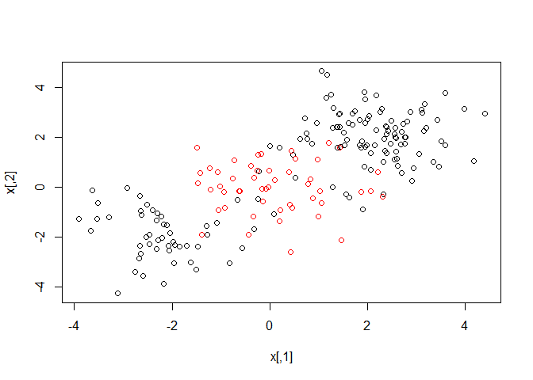
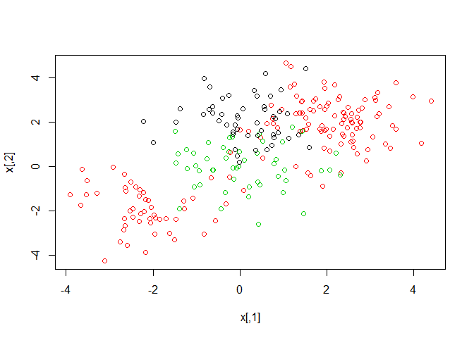
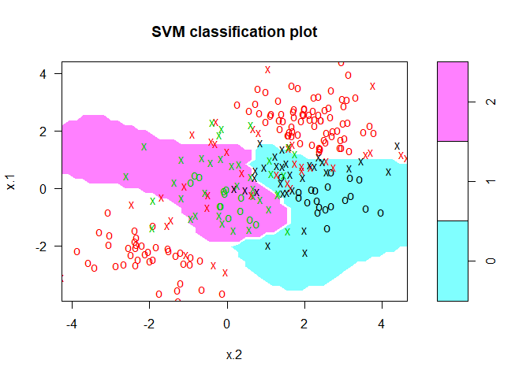

# from video


```r
library(e1071)
# data are not abailable, so I use data from Lab
#video
set.seed(10111)
x=matrix(rnorm(40),20,2)
y=rep(c(-1,1),c(10,10))
x[y==1,]=x[y==1,] + 1
plot(x, col=y+3,pch=19)
```

<!-- -->

```r
dat=data.frame(x,y=as.factor(y))
names(dat)
```

```
## [1] "X1" "X2" "y"
```

```r
make.grid=function(x,n=75){
  grange=apply(x,2,range)
  x1=seq(from=grange[1,1],to=grange[2,1],length=n)
  x2=seq(from=grange[1,2],to=grange[2,2],length=n)
  expand.grid(X1=x1,X2=x2)
}

fit=svm(factor(y)~., data=dat, scale=FALSE,  kernel="radial",cost=5)
xgrid=make.grid(x)
ygrid=predict(fit,xgrid)
plot(xgrid,col=as.numeric(ygrid),pch=20,cex=.2)
points(x,col=y+1,pch=19)
```

<!-- -->

```r
func=predict(fit,xgrid,decision.values = TRUE)
func=attributes(func)$decision
xgrid=make.grid(x)
ygrid=predict(fit,xgrid)
plot(xgrid,col=as.numeric(ygrid),pch=20,cex=.2)
points(x,col=y+1,pch=19)
```

<!-- -->

```r
#xgrid
#contour(xgrid$X1,xgrid$X2,matrix(func,69,99),level = 0, add=TRUE)
#contour(X1,X2,matrix(prob,69,99),level = 0.5, add=TRUE, col="blue",lwd = 2)
```


# Support Vector Machine


```r
set.seed(1)
x=matrix(rnorm(200*2), ncol=2)
x[1:100,]=x[1:100,]+2
x[101:150,]=x[101:150,]-2
y=c(rep(1,150),rep(2,50))
dat=data.frame(x=x,y=as.factor(y))
plot(x, col=y)
```

<!-- -->


```r
train=sample(200,100)
svmfit=svm(y~., data=dat[train,], kernel="radial",  gamma=1, cost=1)
plot(svmfit, dat[train,])
```

<!-- -->

```r
summary(svmfit)
```

```
## 
## Call:
## svm(formula = y ~ ., data = dat[train, ], kernel = "radial", 
##     gamma = 1, cost = 1)
## 
## 
## Parameters:
##    SVM-Type:  C-classification 
##  SVM-Kernel:  radial 
##        cost:  1 
##       gamma:  1 
## 
## Number of Support Vectors:  37
## 
##  ( 17 20 )
## 
## 
## Number of Classes:  2 
## 
## Levels: 
##  1 2
```


```r
svmfit=svm(y~., data=dat[train,], kernel="radial",gamma=1,cost=1e5)
plot(svmfit,dat[train,])
```

<!-- -->


```r
set.seed(1)
tune.out=tune(svm, y~., data=dat[train,], kernel="radial", ranges=list(cost=c(0.1,1,10,100,1000),gamma=c(0.5,1,2,3,4)))
summary(tune.out)
```

```
## 
## Parameter tuning of 'svm':
## 
## - sampling method: 10-fold cross validation 
## 
## - best parameters:
##  cost gamma
##     1     2
## 
## - best performance: 0.12 
## 
## - Detailed performance results:
##     cost gamma error dispersion
## 1  1e-01   0.5  0.27 0.11595018
## 2  1e+00   0.5  0.13 0.08232726
## 3  1e+01   0.5  0.15 0.07071068
## 4  1e+02   0.5  0.17 0.08232726
## 5  1e+03   0.5  0.21 0.09944289
## 6  1e-01   1.0  0.25 0.13540064
## 7  1e+00   1.0  0.13 0.08232726
## 8  1e+01   1.0  0.16 0.06992059
## 9  1e+02   1.0  0.20 0.09428090
## 10 1e+03   1.0  0.20 0.08164966
## 11 1e-01   2.0  0.25 0.12692955
## 12 1e+00   2.0  0.12 0.09189366
## 13 1e+01   2.0  0.17 0.09486833
## 14 1e+02   2.0  0.19 0.09944289
## 15 1e+03   2.0  0.20 0.09428090
## 16 1e-01   3.0  0.27 0.11595018
## 17 1e+00   3.0  0.13 0.09486833
## 18 1e+01   3.0  0.18 0.10327956
## 19 1e+02   3.0  0.21 0.08755950
## 20 1e+03   3.0  0.22 0.10327956
## 21 1e-01   4.0  0.27 0.11595018
## 22 1e+00   4.0  0.15 0.10801234
## 23 1e+01   4.0  0.18 0.11352924
## 24 1e+02   4.0  0.21 0.08755950
## 25 1e+03   4.0  0.24 0.10749677
```

```r
table(true=dat[-train,"y"], pred=predict(tune.out$best.model,newdata=dat[-train,]))
```

```
##     pred
## true  1  2
##    1 74  3
##    2  7 16
```

# ROC Curves


```r
library(ROCR)
```

```
## Loading required package: gplots
```

```
## 
## Attaching package: 'gplots'
```

```
## The following object is masked from 'package:stats':
## 
##     lowess
```

```r
rocplot=function(pred, truth, ...){
   predob = prediction(pred, truth)
   perf = performance(predob, "tpr", "fpr")
   plot(perf,...)}
```


```r
svmfit.opt=svm(y~., data=dat[train,], kernel="radial",gamma=2, cost=1,decision.values=T)
fitted=attributes(predict(svmfit.opt,dat[train,],decision.values=TRUE))$decision.values
par(mfrow=c(1,2))
rocplot(fitted,dat[train,"y"],main="Training Data")

svmfit.flex=svm(y~., data=dat[train,], kernel="radial",gamma=50, cost=1, decision.values=T)
fitted=attributes(predict(svmfit.flex,dat[train,],decision.values=T))$decision.values
rocplot(fitted,dat[train,"y"],add=T,col="red")

fitted=attributes(predict(svmfit.opt,dat[-train,],decision.values=T))$decision.values
rocplot(fitted,dat[-train,"y"],main="Test Data")
fitted=attributes(predict(svmfit.flex,dat[-train,],decision.values=T))$decision.values
rocplot(fitted,dat[-train,"y"],add=T,col="red")
```

<!-- -->

# SVM with Multiple Classes


```r
set.seed(1)
x=rbind(x, matrix(rnorm(50*2), ncol=2))
y=c(y, rep(0,50))
x[y==0,2]=x[y==0,2]+2
dat=data.frame(x=x, y=as.factor(y))
par(mfrow=c(1,1))
plot(x,col=(y+1))
```

<!-- -->

```r
svmfit=svm(y~., data=dat, kernel="radial", cost=10, gamma=1)
plot(svmfit, dat)
```

<!-- -->

# Application to Gene Expression Data


```r
library(ISLR)
names(Khan)
```

```
## [1] "xtrain" "xtest"  "ytrain" "ytest"
```

```r
dim(Khan$xtrain)
```

```
## [1]   63 2308
```

```r
dim(Khan$xtest)
```

```
## [1]   20 2308
```

```r
length(Khan$ytrain)
```

```
## [1] 63
```

```r
length(Khan$ytest)
```

```
## [1] 20
```

```r
table(Khan$ytrain)
```

```
## 
##  1  2  3  4 
##  8 23 12 20
```

```r
table(Khan$ytest)
```

```
## 
## 1 2 3 4 
## 3 6 6 5
```

```r
dat=data.frame(x=Khan$xtrain, y=as.factor(Khan$ytrain))
out=svm(y~., data=dat, kernel="linear",cost=10)
summary(out)
```

```
## 
## Call:
## svm(formula = y ~ ., data = dat, kernel = "linear", cost = 10)
## 
## 
## Parameters:
##    SVM-Type:  C-classification 
##  SVM-Kernel:  linear 
##        cost:  10 
##       gamma:  0.0004332756 
## 
## Number of Support Vectors:  58
## 
##  ( 20 20 11 7 )
## 
## 
## Number of Classes:  4 
## 
## Levels: 
##  1 2 3 4
```

```r
table(out$fitted, dat$y)
```

```
##    
##      1  2  3  4
##   1  8  0  0  0
##   2  0 23  0  0
##   3  0  0 12  0
##   4  0  0  0 20
```


```r
dat.te=data.frame(x=Khan$xtest, y=as.factor(Khan$ytest))
pred.te=predict(out, newdata=dat.te)
table(pred.te, dat.te$y)
```

```
##        
## pred.te 1 2 3 4
##       1 3 0 0 0
##       2 0 6 2 0
##       3 0 0 4 0
##       4 0 0 0 5
```

## 4. Generate a simulated two-class data set with 100 observations and two features in which there is a visible but non-linear separation between the two classes. Show that in this setting, a support vector machine with a polynomial kernel (with degree greater than 1) or a radial kernel will outperform a support vector classifier on the training data. Which technique performs best on the test data? Make plots and report training and test error rates in order to back up your assertions.


```r
set.seed(10111)
x=matrix(rnorm(400),200,2)
y=rep(c(-1,1),c(10,10))
x[y==1,]=x[y==1,] + 2
plot(x, col=y+3,pch=19)
```

<!-- -->

```r
dat=data.frame(x,y=as.factor(y))
dim(dat)
```

```
## [1] 200   3
```

```r
names(dat)
```

```
## [1] "X1" "X2" "y"
```

```r
make.grid=function(x,n=75){
  grange=apply(x,2,range)
  x1=seq(from=grange[1,1],to=grange[2,1],length=n)
  x2=seq(from=grange[1,2],to=grange[2,2],length=n)
  expand.grid(X1=x1,X2=x2)
}

fit=svm(factor(y)~., data=dat, scale=FALSE, kernel="radial",gamma=1,cost=5)
xgrid=make.grid(x)
ygrid=predict(fit,xgrid)
plot(xgrid,col=as.numeric(ygrid),pch=20,cex=.2)
points(x,col=y+1,pch=19)
```

<!-- -->

```r
fit=svm(factor(y)~., data=dat, scale=FALSE,  kernel="polynomial",degree=3 ,cost=5)
xgrid=make.grid(x)
ygrid=predict(fit,xgrid)
plot(xgrid,col=as.numeric(ygrid),pch=20,cex=.2)
points(x,col=y+1,pch=19)
```

<!-- -->


```r
set.seed(1)
train=sample(200,100)

svmfit=svm(y~., data=dat[train,], scale=FALSE, kernel="radial",gamma=1,cost=5)
plot(svmfit, dat[train,])
```

<!-- -->

```r
summary(svmfit)
```

```
## 
## Call:
## svm(formula = y ~ ., data = dat[train, ], kernel = "radial", 
##     gamma = 1, cost = 5, scale = FALSE)
## 
## 
## Parameters:
##    SVM-Type:  C-classification 
##  SVM-Kernel:  radial 
##        cost:  5 
##       gamma:  1 
## 
## Number of Support Vectors:  36
## 
##  ( 15 21 )
## 
## 
## Number of Classes:  2 
## 
## Levels: 
##  -1 1
```

```r
table(true=dat[-train,"y"], pred=predict(svmfit,newdata=dat[-train,]))
```

```
##     pred
## true -1  1
##   -1 39  7
##   1   8 46
```

```r
svmfit=svm(y~., data=dat[train,], scale=FALSE, kernel="polynomial",degree=3 ,cost=5)
plot(svmfit, dat[train,])
```

<!-- -->

```r
summary(svmfit)
```

```
## 
## Call:
## svm(formula = y ~ ., data = dat[train, ], kernel = "polynomial", 
##     degree = 3, cost = 5, scale = FALSE)
## 
## 
## Parameters:
##    SVM-Type:  C-classification 
##  SVM-Kernel:  polynomial 
##        cost:  5 
##      degree:  3 
##       gamma:  0.5 
##      coef.0:  0 
## 
## Number of Support Vectors:  16
## 
##  ( 7 9 )
## 
## 
## Number of Classes:  2 
## 
## Levels: 
##  -1 1
```

```r
table(true=dat[-train,"y"], pred=predict(svmfit,newdata=dat[-train,]))
```

```
##     pred
## true -1  1
##   -1 42  4
##   1   7 47
```

> polynomial is better, which may cause by parameters.


```r
set.seed(1)
tune.out=tune(svm, y~., data=dat[train,], kernel="radial", ranges=list(cost=c(0.1,1,10,100,1000),gamma=c(0.5,1,2,3,4)))
summary(tune.out)
```

```
## 
## Parameter tuning of 'svm':
## 
## - sampling method: 10-fold cross validation 
## 
## - best parameters:
##  cost gamma
##   0.1   0.5
## 
## - best performance: 0.05 
## 
## - Detailed performance results:
##     cost gamma error dispersion
## 1  1e-01   0.5  0.05 0.05270463
## 2  1e+00   0.5  0.09 0.09944289
## 3  1e+01   0.5  0.08 0.09189366
## 4  1e+02   0.5  0.10 0.10540926
## 5  1e+03   0.5  0.09 0.11005049
## 6  1e-01   1.0  0.05 0.05270463
## 7  1e+00   1.0  0.09 0.09944289
## 8  1e+01   1.0  0.08 0.09189366
## 9  1e+02   1.0  0.08 0.10327956
## 10 1e+03   1.0  0.11 0.09944289
## 11 1e-01   2.0  0.05 0.05270463
## 12 1e+00   2.0  0.08 0.10327956
## 13 1e+01   2.0  0.09 0.11005049
## 14 1e+02   2.0  0.10 0.10540926
## 15 1e+03   2.0  0.12 0.11352924
## 16 1e-01   3.0  0.08 0.09189366
## 17 1e+00   3.0  0.07 0.09486833
## 18 1e+01   3.0  0.08 0.10327956
## 19 1e+02   3.0  0.12 0.09189366
## 20 1e+03   3.0  0.12 0.09189366
## 21 1e-01   4.0  0.19 0.16633300
## 22 1e+00   4.0  0.07 0.09486833
## 23 1e+01   4.0  0.10 0.10540926
## 24 1e+02   4.0  0.13 0.08232726
## 25 1e+03   4.0  0.13 0.08232726
```

```r
table(true=dat[-train,"y"], pred=predict(tune.out$best.model,newdata=dat[-train,]))
```

```
##     pred
## true -1  1
##   -1 42  4
##   1   5 49
```

> radial is better.

## 5. We have seen that we can fit an SVM with a non-linear kernel in order to perform classification using a non-linear decision boundary. We will now see that we can also obtain a non-linear decision boundary by performing logistic regression using non-linear transformations of the features.

### (a) Generate a data set with n = 500 and p = 2, such that the observations belong to two classes with a quadratic decision boundary between them. For instance, you can do this as follows:

```r
set.seed(1)
x1= runif (500) -0.5
x2= runif (500) -0.5
y=1*( x1^2- x2 ^2 > 0)
dat5a=data.frame(x1,x2,y=as.factor(y))
dim(dat5a)
```

```
## [1] 500   3
```

```r
names(dat5a)
```

```
## [1] "x1" "x2" "y"
```

```r
head(dat5a)
```

```
##            x1          x2 y
## 1 -0.23449134  0.05417706 1
## 2 -0.12787610  0.18827524 0
## 3  0.07285336  0.15805755 0
## 4  0.40820779  0.16334273 1
## 5 -0.29831807 -0.02776580 1
## 6  0.39838968  0.46952817 0
```

### (b) Plot the observations, colored according to their class labels.
Your plot should display X 1 on the x-axis, and X 2 on the y-axis.


```r
plot(x1,x2, col=y+3,pch=19)
```

<!-- -->


### (c) Fit a logistic regression model to the data, using X 1 and X 2 as predictors.


```r
glm.fits=glm(y~x1+x2,data=dat5a,family=binomial)
summary(glm.fits)
```

```
## 
## Call:
## glm(formula = y ~ x1 + x2, family = binomial, data = dat5a)
## 
## Deviance Residuals: 
##    Min      1Q  Median      3Q     Max  
## -1.179  -1.139  -1.112   1.206   1.257  
## 
## Coefficients:
##              Estimate Std. Error z value Pr(>|z|)
## (Intercept) -0.087260   0.089579  -0.974    0.330
## x1           0.196199   0.316864   0.619    0.536
## x2          -0.002854   0.305712  -0.009    0.993
## 
## (Dispersion parameter for binomial family taken to be 1)
## 
##     Null deviance: 692.18  on 499  degrees of freedom
## Residual deviance: 691.79  on 497  degrees of freedom
## AIC: 697.79
## 
## Number of Fisher Scoring iterations: 3
```


### (d) Apply this model to the training data in order to obtain a predicted class label for each training observation. Plot the observations, colored according to the predicted class labels. The decision boundary should be linear.


```r
glm.probs=predict(glm.fits,type="response")
glm.probs[1:10]
```

```
##         1         2         3         4         5         6         7 
## 0.4666940 0.4718083 0.4816539 0.4980910 0.4636367 0.4973910 0.5000660 
##         8         9        10 
## 0.4858265 0.4843401 0.4567756
```

```r
glm.pred=rep(1,500)
glm.pred[glm.probs>0.5]=2
table(glm.pred,y)
```

```
##         y
## glm.pred   0   1
##        1 258 212
##        2   3  27
```

```r
plot(x1,x2, col=glm.pred,pch=y)
```

<!-- -->


### (e) Now fit a logistic regression model to the data using non-linear functions of X 1 and X 2 as predictors (e.g. X 2 1 , X 1 × X 2 , log(X 2 ), and so forth).


```r
glm.fits=glm(y~poly(x1,3)+poly(x2,3),data=dat5a,family=binomial)
```

```
## Warning: glm.fit: algorithm did not converge
```

```
## Warning: glm.fit: fitted probabilities numerically 0 or 1 occurred
```

```r
summary(glm.fits)
```

```
## 
## Call:
## glm(formula = y ~ poly(x1, 3) + poly(x2, 3), family = binomial, 
##     data = dat5a)
## 
## Deviance Residuals: 
##        Min          1Q      Median          3Q         Max  
## -8.116e-04  -2.000e-08  -2.000e-08   2.000e-08   1.098e-03  
## 
## Coefficients:
##              Estimate Std. Error z value Pr(>|z|)
## (Intercept)    -112.8     7700.8  -0.015    0.988
## poly(x1, 3)1   2320.9   202067.7   0.011    0.991
## poly(x1, 3)2  26012.9   817440.0   0.032    0.975
## poly(x1, 3)3   -238.4   100966.6  -0.002    0.998
## poly(x2, 3)1    200.2    85132.7   0.002    0.998
## poly(x2, 3)2 -27719.8   872877.7  -0.032    0.975
## poly(x2, 3)3    387.8    62341.3   0.006    0.995
## 
## (Dispersion parameter for binomial family taken to be 1)
## 
##     Null deviance: 6.9218e+02  on 499  degrees of freedom
## Residual deviance: 3.3141e-06  on 493  degrees of freedom
## AIC: 14
## 
## Number of Fisher Scoring iterations: 25
```


### (f) Apply this model to the training data in order to obtain a predicted class label for each training observation. Plot the observations, colored according to the predicted class labels. The decision boundary should be obviously non-linear. If it is not, then repeat (a)-(e) until you come up with an example in which the predicted class labels are obviously non-linear.


```r
glm.probs=predict(glm.fits,type="response")
glm.probs[1:10]
```

```
##            1            2            3            4            5 
## 1.000000e+00 2.220446e-16 2.220446e-16 1.000000e+00 1.000000e+00 
##            6            7            8            9           10 
## 2.220446e-16 1.000000e+00 2.220446e-16 2.220446e-16 1.000000e+00
```

```r
glm.pred=rep(1,500)
glm.pred[glm.probs>0.5]=2
table(glm.pred,y)
```

```
##         y
## glm.pred   0   1
##        1 261   0
##        2   0 239
```

```r
plot(x1,x2, col=glm.pred,pch=y)
```

<!-- -->


### (g) Fit a support vector classifier to the data with X 1 and X 2 as predictors. Obtain a class prediction for each training observation. Plot the observations, colored according to the predicted class labels.


```r
svmfit=svm(y~x1+x2, data=dat5a, kernel="linear", cost=10, scale=FALSE)
print(svmfit)
```

```
## 
## Call:
## svm(formula = y ~ x1 + x2, data = dat5a, kernel = "linear", cost = 10, 
##     scale = FALSE)
## 
## 
## Parameters:
##    SVM-Type:  C-classification 
##  SVM-Kernel:  linear 
##        cost:  10 
##       gamma:  0.5 
## 
## Number of Support Vectors:  482
```

```r
plot(svmfit, dat5a)
```

<!-- -->

```r
set.seed(1)
tune.out=tune(svm, y~x1+x2, data=dat5a, kernel="linear", ranges=list(cost=c(0.01,0.1,1,10,100)))
summary(tune.out)
```

```
## 
## Parameter tuning of 'svm':
## 
## - sampling method: 10-fold cross validation 
## 
## - best parameters:
##  cost
##  0.01
## 
## - best performance: 0.478 
## 
## - Detailed performance results:
##    cost error dispersion
## 1 1e-02 0.478 0.04848826
## 2 1e-01 0.478 0.04848826
## 3 1e+00 0.478 0.04848826
## 4 1e+01 0.478 0.04848826
## 5 1e+02 0.478 0.04848826
```

```r
svm.pred=predict(tune.out$best.model,newdata=dat5a)
table(true=y,pred=svm.pred)
```

```
##     pred
## true   0   1
##    0 261   0
##    1 239   0
```

```r
plot(x1,x2, col=svm.pred, pch=y)
```

<!-- -->


### (h) Fit a SVM using a non-linear kernel to the data. Obtain a class prediction for each training observation. Plot the observations, colored according to the predicted class labels.


```r
set.seed(1)
tune.out=tune(svm, y~x1+x2, data=dat5a, kernel="radial", ranges=list(cost=c(0.01,0.1,1,10,100),gamma=c(0.5,1,2,3,4)))
summary(tune.out)
```

```
## 
## Parameter tuning of 'svm':
## 
## - sampling method: 10-fold cross validation 
## 
## - best parameters:
##  cost gamma
##   100     2
## 
## - best performance: 0.014 
## 
## - Detailed performance results:
##     cost gamma error dispersion
## 1  1e-02   0.5 0.478 0.04848826
## 2  1e-01   0.5 0.070 0.02357023
## 3  1e+00   0.5 0.048 0.02859681
## 4  1e+01   0.5 0.032 0.03155243
## 5  1e+02   0.5 0.026 0.03134042
## 6  1e-02   1.0 0.478 0.04848826
## 7  1e-01   1.0 0.068 0.02529822
## 8  1e+00   1.0 0.036 0.02796824
## 9  1e+01   1.0 0.026 0.02674987
## 10 1e+02   1.0 0.016 0.02458545
## 11 1e-02   2.0 0.478 0.04848826
## 12 1e-01   2.0 0.062 0.04467164
## 13 1e+00   2.0 0.032 0.02699794
## 14 1e+01   2.0 0.020 0.02108185
## 15 1e+02   2.0 0.014 0.02118700
## 16 1e-02   3.0 0.478 0.04848826
## 17 1e-01   3.0 0.050 0.03800585
## 18 1e+00   3.0 0.026 0.03134042
## 19 1e+01   3.0 0.022 0.01988858
## 20 1e+02   3.0 0.018 0.02201010
## 21 1e-02   4.0 0.478 0.04848826
## 22 1e-01   4.0 0.042 0.03047768
## 23 1e+00   4.0 0.024 0.02796824
## 24 1e+01   4.0 0.018 0.01751190
## 25 1e+02   4.0 0.024 0.02270585
```

```r
svm.pred=predict(tune.out$best.model,newdata=dat5a)
table(true=y,pred=svm.pred)
```

```
##     pred
## true   0   1
##    0 260   1
##    1   1 238
```

```r
plot(x1,x2, col=svm.pred, pch=y)
```

<!-- -->


### (i) Comment on your results.

> a SVM using a non-linear kernel and a logistic regression model with non-linear functions are better.

## 7. In this problem, you will use support vector approaches in order to predict whether a given car gets high or low gas mileage based on the Auto data set.

### (a) Create a binary variable that takes on a 1 for cars with gas mileage above the median, and a 0 for cars with gas mileage below the median.


```r
library(ISLR)
summary(Auto)
```

```
##       mpg          cylinders      displacement     horsepower   
##  Min.   : 9.00   Min.   :3.000   Min.   : 68.0   Min.   : 46.0  
##  1st Qu.:17.00   1st Qu.:4.000   1st Qu.:105.0   1st Qu.: 75.0  
##  Median :22.75   Median :4.000   Median :151.0   Median : 93.5  
##  Mean   :23.45   Mean   :5.472   Mean   :194.4   Mean   :104.5  
##  3rd Qu.:29.00   3rd Qu.:8.000   3rd Qu.:275.8   3rd Qu.:126.0  
##  Max.   :46.60   Max.   :8.000   Max.   :455.0   Max.   :230.0  
##                                                                 
##      weight      acceleration        year           origin     
##  Min.   :1613   Min.   : 8.00   Min.   :70.00   Min.   :1.000  
##  1st Qu.:2225   1st Qu.:13.78   1st Qu.:73.00   1st Qu.:1.000  
##  Median :2804   Median :15.50   Median :76.00   Median :1.000  
##  Mean   :2978   Mean   :15.54   Mean   :75.98   Mean   :1.577  
##  3rd Qu.:3615   3rd Qu.:17.02   3rd Qu.:79.00   3rd Qu.:2.000  
##  Max.   :5140   Max.   :24.80   Max.   :82.00   Max.   :3.000  
##                                                                
##                  name    
##  amc matador       :  5  
##  ford pinto        :  5  
##  toyota corolla    :  5  
##  amc gremlin       :  4  
##  amc hornet        :  4  
##  chevrolet chevette:  4  
##  (Other)           :365
```

```r
#?Auto
Auto$BI=as.factor(ifelse(Auto$mpg>22.75, 1, 0))
summary(Auto)
```

```
##       mpg          cylinders      displacement     horsepower   
##  Min.   : 9.00   Min.   :3.000   Min.   : 68.0   Min.   : 46.0  
##  1st Qu.:17.00   1st Qu.:4.000   1st Qu.:105.0   1st Qu.: 75.0  
##  Median :22.75   Median :4.000   Median :151.0   Median : 93.5  
##  Mean   :23.45   Mean   :5.472   Mean   :194.4   Mean   :104.5  
##  3rd Qu.:29.00   3rd Qu.:8.000   3rd Qu.:275.8   3rd Qu.:126.0  
##  Max.   :46.60   Max.   :8.000   Max.   :455.0   Max.   :230.0  
##                                                                 
##      weight      acceleration        year           origin     
##  Min.   :1613   Min.   : 8.00   Min.   :70.00   Min.   :1.000  
##  1st Qu.:2225   1st Qu.:13.78   1st Qu.:73.00   1st Qu.:1.000  
##  Median :2804   Median :15.50   Median :76.00   Median :1.000  
##  Mean   :2978   Mean   :15.54   Mean   :75.98   Mean   :1.577  
##  3rd Qu.:3615   3rd Qu.:17.02   3rd Qu.:79.00   3rd Qu.:2.000  
##  Max.   :5140   Max.   :24.80   Max.   :82.00   Max.   :3.000  
##                                                                
##                  name     BI     
##  amc matador       :  5   0:196  
##  ford pinto        :  5   1:196  
##  toyota corolla    :  5          
##  amc gremlin       :  4          
##  amc hornet        :  4          
##  chevrolet chevette:  4          
##  (Other)           :365
```

### (b) Fit a support vector classifier to the data with various values of cost, in order to predict whether a car gets high or low gas mileage. Report the cross-validation errors associated with different values of this parameter. Comment on your results.


```r
set.seed(11)
tune.out=tune(svm, BI~., data=Auto, kernel="linear", ranges=list(cost=c(0.1,1,10,100,1000)))
summary(tune.out)
```

```
## 
## Parameter tuning of 'svm':
## 
## - sampling method: 10-fold cross validation 
## 
## - best parameters:
##  cost
##     1
## 
## - best performance: 0.01025641 
## 
## - Detailed performance results:
##    cost      error dispersion
## 1 1e-01 0.03833333 0.03027982
## 2 1e+00 0.01025641 0.01792836
## 3 1e+01 0.01794872 0.02110955
## 4 1e+02 0.03070513 0.03153205
## 5 1e+03 0.03070513 0.03153205
```

```r
bestmod=tune.out$best.model
summary(bestmod)
```

```
## 
## Call:
## best.tune(method = svm, train.x = BI ~ ., data = Auto, ranges = list(cost = c(0.1, 
##     1, 10, 100, 1000)), kernel = "linear")
## 
## 
## Parameters:
##    SVM-Type:  C-classification 
##  SVM-Kernel:  linear 
##        cost:  1 
##       gamma:  0.003205128 
## 
## Number of Support Vectors:  56
## 
##  ( 26 30 )
## 
## 
## Number of Classes:  2 
## 
## Levels: 
##  0 1
```

### (c) Now repeat (b), this time using SVMs with radial and polynomial basis kernels, with different values of gamma and degree and cost. Comment on your results.


```r
set.seed(11)
tune.out=tune(svm, BI~., data=Auto, kernel="radial", ranges=list(cost=c(0.1,1,10,100,1000),gamma=c(0.5,1,2,3,4)))
summary(tune.out)
```

```
## 
## Parameter tuning of 'svm':
## 
## - sampling method: 10-fold cross validation 
## 
## - best parameters:
##  cost gamma
##    10   0.5
## 
## - best performance: 0.04326923 
## 
## - Detailed performance results:
##     cost gamma      error dispersion
## 1  1e-01   0.5 0.08403846 0.05627935
## 2  1e+00   0.5 0.05083333 0.04312858
## 3  1e+01   0.5 0.04326923 0.03614239
## 4  1e+02   0.5 0.04326923 0.03614239
## 5  1e+03   0.5 0.04326923 0.03614239
## 6  1e-01   1.0 0.59679487 0.06655151
## 7  1e+00   1.0 0.06615385 0.05389175
## 8  1e+01   1.0 0.06365385 0.05137994
## 9  1e+02   1.0 0.06365385 0.05137994
## 10 1e+03   1.0 0.06365385 0.05137994
## 11 1e-01   2.0 0.59679487 0.06655151
## 12 1e+00   2.0 0.14525641 0.08159607
## 13 1e+01   2.0 0.13500000 0.08324464
## 14 1e+02   2.0 0.13500000 0.08324464
## 15 1e+03   2.0 0.13500000 0.08324464
## 16 1e-01   3.0 0.59679487 0.06655151
## 17 1e+00   3.0 0.45884615 0.12955021
## 18 1e+01   3.0 0.44602564 0.14230089
## 19 1e+02   3.0 0.44602564 0.14230089
## 20 1e+03   3.0 0.44602564 0.14230089
## 21 1e-01   4.0 0.59679487 0.06655151
## 22 1e+00   4.0 0.50500000 0.07002603
## 23 1e+01   4.0 0.49987179 0.07227455
## 24 1e+02   4.0 0.49987179 0.07227455
## 25 1e+03   4.0 0.49987179 0.07227455
```

```r
bestmod.r=tune.out$best.model
summary(bestmod.r)
```

```
## 
## Call:
## best.tune(method = svm, train.x = BI ~ ., data = Auto, ranges = list(cost = c(0.1, 
##     1, 10, 100, 1000), gamma = c(0.5, 1, 2, 3, 4)), kernel = "radial")
## 
## 
## Parameters:
##    SVM-Type:  C-classification 
##  SVM-Kernel:  radial 
##        cost:  10 
##       gamma:  0.5 
## 
## Number of Support Vectors:  259
## 
##  ( 127 132 )
## 
## 
## Number of Classes:  2 
## 
## Levels: 
##  0 1
```

```r
svm.pred=predict(bestmod.r,newdata=Auto)
table(true=Auto$BI,pred=svm.pred)
```

```
##     pred
## true   0   1
##    0 196   0
##    1   0 196
```

```r
#
tune.out=tune(svm, BI~., data=Auto, kernel="polynomial", ranges=list(cost=c(0.1,1,10,100,1000),degree=c(1,2,3,4,5)))
summary(tune.out)
```

```
## 
## Parameter tuning of 'svm':
## 
## - sampling method: 10-fold cross validation 
## 
## - best parameters:
##  cost degree
##  1000      1
## 
## - best performance: 0.01282051 
## 
## - Detailed performance results:
##     cost degree      error dispersion
## 1  1e-01      1 0.13820513 0.08503533
## 2  1e+00      1 0.07923077 0.04604708
## 3  1e+01      1 0.06134615 0.05304144
## 4  1e+02      1 0.02307692 0.02821808
## 5  1e+03      1 0.01282051 0.01813094
## 6  1e-01      2 0.53576923 0.02483197
## 7  1e+00      2 0.53576923 0.02483197
## 8  1e+01      2 0.51044872 0.12874390
## 9  1e+02      2 0.29858974 0.06097334
## 10 1e+03      2 0.23000000 0.09735236
## 11 1e-01      3 0.53576923 0.02483197
## 12 1e+00      3 0.53576923 0.02483197
## 13 1e+01      3 0.53576923 0.02483197
## 14 1e+02      3 0.33942308 0.07403607
## 15 1e+03      3 0.25282051 0.07930270
## 16 1e-01      4 0.53576923 0.02483197
## 17 1e+00      4 0.53576923 0.02483197
## 18 1e+01      4 0.53576923 0.02483197
## 19 1e+02      4 0.53576923 0.02483197
## 20 1e+03      4 0.51269231 0.06808217
## 21 1e-01      5 0.53576923 0.02483197
## 22 1e+00      5 0.53576923 0.02483197
## 23 1e+01      5 0.53576923 0.02483197
## 24 1e+02      5 0.53576923 0.02483197
## 25 1e+03      5 0.53576923 0.02483197
```

```r
bestmod.p=tune.out$best.model
summary(bestmod.p)
```

```
## 
## Call:
## best.tune(method = svm, train.x = BI ~ ., data = Auto, ranges = list(cost = c(0.1, 
##     1, 10, 100, 1000), degree = c(1, 2, 3, 4, 5)), kernel = "polynomial")
## 
## 
## Parameters:
##    SVM-Type:  C-classification 
##  SVM-Kernel:  polynomial 
##        cost:  1000 
##      degree:  1 
##       gamma:  0.003205128 
##      coef.0:  0 
## 
## Number of Support Vectors:  49
## 
##  ( 25 24 )
## 
## 
## Number of Classes:  2 
## 
## Levels: 
##  0 1
```

```r
svm.pred=predict(bestmod.p,newdata=Auto)
table(true=Auto$BI,pred=svm.pred)
```

```
##     pred
## true   0   1
##    0 196   0
##    1   1 195
```


### (d) Make some plots to back up your assertions in (b) and (c).
Hint: In the lab, we used the plot() function for svm objects
only in cases with p = 2. When p > 2, you can use the plot()
function to create plots displaying pairs of variables at a time.
Essentially, instead of typing

plot(svmfit , dat)

where svmfit contains your fitted model and dat is a data frame
containing your data, you can type

plot(svmfit , dat , x1 ~ x4)

in order to plot just the first and fourth variables. However, you
must replace x1 and x4 with the correct variable names. To find
out more, type ?plot.svm.


```r
names(Auto)
```

```
##  [1] "mpg"          "cylinders"    "displacement" "horsepower"  
##  [5] "weight"       "acceleration" "year"         "origin"      
##  [9] "name"         "BI"
```

```r
plot(bestmod.r,data=Auto,mpg~cylinders)
```

<!-- -->

```r
plot(bestmod.r,data=Auto,mpg~displacement)
```

<!-- -->

```r
plot(bestmod.r,data=Auto,mpg~horsepower)
```

<!-- -->

```r
plot(bestmod.r,data=Auto,mpg~weight)
```

<!-- -->

```r
plot(bestmod.r,data=Auto,mpg~acceleration)
```

<!-- -->

```r
plot(bestmod.r,data=Auto,mpg~year)
```

<!-- -->

```r
plot(bestmod.r,data=Auto,mpg~origin)
```

<!-- -->

```r
plot(bestmod.p,data=Auto,mpg~cylinders)
```

<!-- -->

```r
plot(bestmod.p,data=Auto,mpg~displacement)
```

<!-- -->

```r
plot(bestmod.p,data=Auto,mpg~horsepower)
```

<!-- -->

```r
plot(bestmod.p,data=Auto,mpg~weight)
```

<!-- -->

```r
plot(bestmod.p,data=Auto,mpg~acceleration)
```

<!-- -->

```r
plot(bestmod.p,data=Auto,mpg~year)
```

<!-- -->

```r
plot(bestmod.p,data=Auto,mpg~origin)
```

<!-- -->


## 8. This problem involves the OJ data set which is part of the ISLR package.
### (a) Create a training set containing a random sample of 800 observations, and a test set containing the remaining observations.


```r
summary(OJ)
```

```
##  Purchase WeekofPurchase     StoreID        PriceCH         PriceMM     
##  CH:653   Min.   :227.0   Min.   :1.00   Min.   :1.690   Min.   :1.690  
##  MM:417   1st Qu.:240.0   1st Qu.:2.00   1st Qu.:1.790   1st Qu.:1.990  
##           Median :257.0   Median :3.00   Median :1.860   Median :2.090  
##           Mean   :254.4   Mean   :3.96   Mean   :1.867   Mean   :2.085  
##           3rd Qu.:268.0   3rd Qu.:7.00   3rd Qu.:1.990   3rd Qu.:2.180  
##           Max.   :278.0   Max.   :7.00   Max.   :2.090   Max.   :2.290  
##      DiscCH            DiscMM         SpecialCH        SpecialMM     
##  Min.   :0.00000   Min.   :0.0000   Min.   :0.0000   Min.   :0.0000  
##  1st Qu.:0.00000   1st Qu.:0.0000   1st Qu.:0.0000   1st Qu.:0.0000  
##  Median :0.00000   Median :0.0000   Median :0.0000   Median :0.0000  
##  Mean   :0.05186   Mean   :0.1234   Mean   :0.1477   Mean   :0.1617  
##  3rd Qu.:0.00000   3rd Qu.:0.2300   3rd Qu.:0.0000   3rd Qu.:0.0000  
##  Max.   :0.50000   Max.   :0.8000   Max.   :1.0000   Max.   :1.0000  
##     LoyalCH          SalePriceMM     SalePriceCH      PriceDiff      
##  Min.   :0.000011   Min.   :1.190   Min.   :1.390   Min.   :-0.6700  
##  1st Qu.:0.325257   1st Qu.:1.690   1st Qu.:1.750   1st Qu.: 0.0000  
##  Median :0.600000   Median :2.090   Median :1.860   Median : 0.2300  
##  Mean   :0.565782   Mean   :1.962   Mean   :1.816   Mean   : 0.1465  
##  3rd Qu.:0.850873   3rd Qu.:2.130   3rd Qu.:1.890   3rd Qu.: 0.3200  
##  Max.   :0.999947   Max.   :2.290   Max.   :2.090   Max.   : 0.6400  
##  Store7      PctDiscMM        PctDiscCH       ListPriceDiff  
##  No :714   Min.   :0.0000   Min.   :0.00000   Min.   :0.000  
##  Yes:356   1st Qu.:0.0000   1st Qu.:0.00000   1st Qu.:0.140  
##            Median :0.0000   Median :0.00000   Median :0.240  
##            Mean   :0.0593   Mean   :0.02731   Mean   :0.218  
##            3rd Qu.:0.1127   3rd Qu.:0.00000   3rd Qu.:0.300  
##            Max.   :0.4020   Max.   :0.25269   Max.   :0.440  
##      STORE      
##  Min.   :0.000  
##  1st Qu.:0.000  
##  Median :2.000  
##  Mean   :1.631  
##  3rd Qu.:3.000  
##  Max.   :4.000
```

```r
dim(OJ)
```

```
## [1] 1070   18
```

```r
set.seed(1)
train=sample(1:nrow(OJ), 800, replace = F)
traindata=OJ[train,]
testdata=OJ[-train,]
summary(traindata)
```

```
##  Purchase WeekofPurchase     StoreID         PriceCH         PriceMM     
##  CH:494   Min.   :227.0   Min.   :1.000   Min.   :1.690   Min.   :1.690  
##  MM:306   1st Qu.:240.0   1st Qu.:2.000   1st Qu.:1.790   1st Qu.:1.990  
##           Median :257.0   Median :3.000   Median :1.860   Median :2.090  
##           Mean   :254.5   Mean   :3.914   Mean   :1.867   Mean   :2.083  
##           3rd Qu.:269.0   3rd Qu.:7.000   3rd Qu.:1.990   3rd Qu.:2.180  
##           Max.   :278.0   Max.   :7.000   Max.   :2.090   Max.   :2.290  
##      DiscCH            DiscMM         SpecialCH        SpecialMM     
##  Min.   :0.00000   Min.   :0.0000   Min.   :0.0000   Min.   :0.0000  
##  1st Qu.:0.00000   1st Qu.:0.0000   1st Qu.:0.0000   1st Qu.:0.0000  
##  Median :0.00000   Median :0.0000   Median :0.0000   Median :0.0000  
##  Mean   :0.05304   Mean   :0.1199   Mean   :0.1425   Mean   :0.1625  
##  3rd Qu.:0.00000   3rd Qu.:0.2100   3rd Qu.:0.0000   3rd Qu.:0.0000  
##  Max.   :0.50000   Max.   :0.8000   Max.   :1.0000   Max.   :1.0000  
##     LoyalCH          SalePriceMM     SalePriceCH      PriceDiff      
##  Min.   :0.000011   Min.   :1.190   Min.   :1.390   Min.   :-0.6700  
##  1st Qu.:0.320000   1st Qu.:1.690   1st Qu.:1.750   1st Qu.: 0.0000  
##  Median :0.600000   Median :2.090   Median :1.860   Median : 0.2300  
##  Mean   :0.571341   Mean   :1.963   Mean   :1.814   Mean   : 0.1489  
##  3rd Qu.:0.868928   3rd Qu.:2.130   3rd Qu.:1.890   3rd Qu.: 0.3200  
##  Max.   :0.999934   Max.   :2.290   Max.   :2.090   Max.   : 0.6400  
##  Store7      PctDiscMM        PctDiscCH       ListPriceDiff   
##  No :540   Min.   :0.0000   Min.   :0.00000   Min.   :0.0000  
##  Yes:260   1st Qu.:0.0000   1st Qu.:0.00000   1st Qu.:0.1300  
##            Median :0.0000   Median :0.00000   Median :0.2400  
##            Mean   :0.0577   Mean   :0.02795   Mean   :0.2158  
##            3rd Qu.:0.1127   3rd Qu.:0.00000   3rd Qu.:0.3000  
##            Max.   :0.4020   Max.   :0.25269   Max.   :0.4400  
##      STORE      
##  Min.   :0.000  
##  1st Qu.:0.000  
##  Median :2.000  
##  Mean   :1.639  
##  3rd Qu.:3.000  
##  Max.   :4.000
```

```r
dim(traindata)
```

```
## [1] 800  18
```

```r
summary(testdata)
```

```
##  Purchase WeekofPurchase     StoreID         PriceCH         PriceMM     
##  CH:159   Min.   :227.0   Min.   :1.000   Min.   :1.690   Min.   :1.690  
##  MM:111   1st Qu.:239.0   1st Qu.:2.000   1st Qu.:1.790   1st Qu.:2.090  
##           Median :256.0   Median :3.000   Median :1.860   Median :2.110  
##           Mean   :254.1   Mean   :4.096   Mean   :1.869   Mean   :2.093  
##           3rd Qu.:267.0   3rd Qu.:7.000   3rd Qu.:1.990   3rd Qu.:2.180  
##           Max.   :278.0   Max.   :7.000   Max.   :2.090   Max.   :2.290  
##      DiscCH            DiscMM         SpecialCH       SpecialMM     
##  Min.   :0.00000   Min.   :0.0000   Min.   :0.000   Min.   :0.0000  
##  1st Qu.:0.00000   1st Qu.:0.0000   1st Qu.:0.000   1st Qu.:0.0000  
##  Median :0.00000   Median :0.0000   Median :0.000   Median :0.0000  
##  Mean   :0.04837   Mean   :0.1336   Mean   :0.163   Mean   :0.1593  
##  3rd Qu.:0.00000   3rd Qu.:0.2300   3rd Qu.:0.000   3rd Qu.:0.0000  
##  Max.   :0.50000   Max.   :0.8000   Max.   :1.000   Max.   :1.0000  
##     LoyalCH          SalePriceMM     SalePriceCH     PriceDiff      
##  Min.   :0.000022   Min.   :1.190   Min.   :1.39   Min.   :-0.6700  
##  1st Qu.:0.384219   1st Qu.:1.690   1st Qu.:1.75   1st Qu.: 0.0000  
##  Median :0.577943   Median :2.090   Median :1.86   Median : 0.2400  
##  Mean   :0.549313   Mean   :1.960   Mean   :1.82   Mean   : 0.1392  
##  3rd Qu.:0.792074   3rd Qu.:2.167   3rd Qu.:1.89   3rd Qu.: 0.3150  
##  Max.   :0.999947   Max.   :2.290   Max.   :2.06   Max.   : 0.6400  
##  Store7      PctDiscMM         PctDiscCH       ListPriceDiff   
##  No :174   Min.   :0.00000   Min.   :0.00000   Min.   :0.0000  
##  Yes: 96   1st Qu.:0.00000   1st Qu.:0.00000   1st Qu.:0.1700  
##            Median :0.00000   Median :0.00000   Median :0.2400  
##            Mean   :0.06403   Mean   :0.02542   Mean   :0.2244  
##            3rd Qu.:0.11268   3rd Qu.:0.00000   3rd Qu.:0.3000  
##            Max.   :0.40201   Max.   :0.25269   Max.   :0.4400  
##      STORE      
##  Min.   :0.000  
##  1st Qu.:0.000  
##  Median :2.000  
##  Mean   :1.607  
##  3rd Qu.:3.000  
##  Max.   :4.000
```

```r
dim(testdata)
```

```
## [1] 270  18
```

### (b) Fit a support vector classifier to the training data using cost=0.01, with Purchase as the response and the other variables as predictors. Use the summary() function to produce summary statistics, and describe the results obtained.


```r
svmfit=svm(Purchase~.,data=traindata, kernel = "linear", cost = 0.01, scale=TRUE)
summary(svmfit)
```

```
## 
## Call:
## svm(formula = Purchase ~ ., data = traindata, kernel = "linear", 
##     cost = 0.01, scale = TRUE)
## 
## 
## Parameters:
##    SVM-Type:  C-classification 
##  SVM-Kernel:  linear 
##        cost:  0.01 
##       gamma:  0.05555556 
## 
## Number of Support Vectors:  432
## 
##  ( 215 217 )
## 
## 
## Number of Classes:  2 
## 
## Levels: 
##  CH MM
```

### (c) What are the training and test error rates?


```r
# training
pred=predict(svmfit,traindata)
table(predict=pred, truth=traindata$Purchase)
```

```
##        truth
## predict  CH  MM
##      CH 439  78
##      MM  55 228
```

```r
(1-(439+228)/800)*100
```

```
## [1] 16.625
```

```r
# test
pred=predict(svmfit,testdata)
table(predict=pred, truth=testdata$Purchase)
```

```
##        truth
## predict  CH  MM
##      CH 141  31
##      MM  18  80
```

```r
(1-(141+80)/270)*100
```

```
## [1] 18.14815
```

### (d) Use the tune() function to select an optimal cost. Consider values in the range 0.01 to 10.


```r
set.seed(11)
tune.out=tune(svm, Purchase~., data=traindata, scale=TRUE, kernel="linear", ranges=list(cost=c(0.01,0.1,1,10)))
summary(tune.out)
```

```
## 
## Parameter tuning of 'svm':
## 
## - sampling method: 10-fold cross validation 
## 
## - best parameters:
##  cost
##   0.1
## 
## - best performance: 0.16875 
## 
## - Detailed performance results:
##    cost   error dispersion
## 1  0.01 0.16875 0.03019037
## 2  0.10 0.16875 0.02144923
## 3  1.00 0.17000 0.02220485
## 4 10.00 0.17250 0.02993047
```

```r
bestmod=tune.out$best.model
summary(bestmod)
```

```
## 
## Call:
## best.tune(method = svm, train.x = Purchase ~ ., data = traindata, 
##     ranges = list(cost = c(0.01, 0.1, 1, 10)), scale = TRUE, 
##     kernel = "linear")
## 
## 
## Parameters:
##    SVM-Type:  C-classification 
##  SVM-Kernel:  linear 
##        cost:  0.1 
##       gamma:  0.05555556 
## 
## Number of Support Vectors:  343
## 
##  ( 171 172 )
## 
## 
## Number of Classes:  2 
## 
## Levels: 
##  CH MM
```

### (e) Compute the training and test error rates using this new value for cost.


```r
# training
pred=predict(bestmod,traindata)
table(predict=pred, truth=traindata$Purchase)
```

```
##        truth
## predict  CH  MM
##      CH 438  71
##      MM  56 235
```

```r
(1-(438+235)/800)*100
```

```
## [1] 15.875
```

```r
# test
pred=predict(bestmod,testdata)
table(predict=pred, truth=testdata$Purchase)
```

```
##        truth
## predict  CH  MM
##      CH 140  32
##      MM  19  79
```

```r
(1-(140+79)/270)*100
```

```
## [1] 18.88889
```

> 18.89%

### (f) Repeat parts (b) through (e) using a support vector machine with a radial kernel. Use the default value for gamma.


```r
#b
svmfit=svm(Purchase~.,data=traindata, kernel = "radial", cost = 0.01, scale=TRUE)
summary(svmfit)
```

```
## 
## Call:
## svm(formula = Purchase ~ ., data = traindata, kernel = "radial", 
##     cost = 0.01, scale = TRUE)
## 
## 
## Parameters:
##    SVM-Type:  C-classification 
##  SVM-Kernel:  radial 
##        cost:  0.01 
##       gamma:  0.05555556 
## 
## Number of Support Vectors:  617
## 
##  ( 306 311 )
## 
## 
## Number of Classes:  2 
## 
## Levels: 
##  CH MM
```

```r
#c
# training
pred=predict(svmfit,traindata)
table(predict=pred, truth=traindata$Purchase)
```

```
##        truth
## predict  CH  MM
##      CH 494 306
##      MM   0   0
```

```r
(1-(494+0)/800)*100
```

```
## [1] 38.25
```

```r
# test
pred=predict(svmfit,testdata)
table(predict=pred, truth=testdata$Purchase)
```

```
##        truth
## predict  CH  MM
##      CH 159 111
##      MM   0   0
```

```r
(1-(159+0)/270)*100
```

```
## [1] 41.11111
```


```r
#d
set.seed(11)
tune.out=tune(svm, Purchase~., data=traindata, kernel="radial", scale=TRUE, ranges=list(cost=c(0.01,0.1,1,10),gamma=c(0.1,0.5,1,2,3,4)))
summary(tune.out)
```

```
## 
## Parameter tuning of 'svm':
## 
## - sampling method: 10-fold cross validation 
## 
## - best parameters:
##  cost gamma
##     1   0.1
## 
## - best performance: 0.1825 
## 
## - Detailed performance results:
##     cost gamma   error dispersion
## 1   0.01   0.1 0.38250 0.07777282
## 2   0.10   0.1 0.18875 0.05350558
## 3   1.00   0.1 0.18250 0.02898755
## 4  10.00   0.1 0.18750 0.02946278
## 5   0.01   0.5 0.38250 0.07777282
## 6   0.10   0.5 0.28500 0.06258328
## 7   1.00   0.5 0.20125 0.03606033
## 8  10.00   0.5 0.20750 0.03184162
## 9   0.01   1.0 0.38250 0.07777282
## 10  0.10   1.0 0.33500 0.07723521
## 11  1.00   1.0 0.21375 0.03356689
## 12 10.00   1.0 0.23500 0.03162278
## 13  0.01   2.0 0.38250 0.07777282
## 14  0.10   2.0 0.36250 0.07971303
## 15  1.00   2.0 0.22625 0.04427267
## 16 10.00   2.0 0.24500 0.03641962
## 17  0.01   3.0 0.38250 0.07777282
## 18  0.10   3.0 0.37875 0.07928719
## 19  1.00   3.0 0.23000 0.03593976
## 20 10.00   3.0 0.24000 0.04073969
## 21  0.01   4.0 0.38250 0.07777282
## 22  0.10   4.0 0.38125 0.07933097
## 23  1.00   4.0 0.24000 0.03670453
## 24 10.00   4.0 0.23500 0.03670453
```

```r
bestmod=tune.out$best.model
summary(bestmod)
```

```
## 
## Call:
## best.tune(method = svm, train.x = Purchase ~ ., data = traindata, 
##     ranges = list(cost = c(0.01, 0.1, 1, 10), gamma = c(0.1, 
##         0.5, 1, 2, 3, 4)), kernel = "radial", scale = TRUE)
## 
## 
## Parameters:
##    SVM-Type:  C-classification 
##  SVM-Kernel:  radial 
##        cost:  1 
##       gamma:  0.1 
## 
## Number of Support Vectors:  380
## 
##  ( 185 195 )
## 
## 
## Number of Classes:  2 
## 
## Levels: 
##  CH MM
```

```r
#e
# training
pred=predict(bestmod,traindata)
table(predict=pred, truth=traindata$Purchase)
```

```
##        truth
## predict  CH  MM
##      CH 455  75
##      MM  39 231
```

```r
(1-(455+231)/800)*100
```

```
## [1] 14.25
```

```r
# test
pred=predict(bestmod,testdata)
table(predict=pred, truth=testdata$Purchase)
```

```
##        truth
## predict  CH  MM
##      CH 142  28
##      MM  17  83
```

```r
(1-(142+83)/270)*100
```

```
## [1] 16.66667
```

> 16.67%

### (g) Repeat parts (b) through (e) using a support vector machine with a polynomial kernel. Set degree=2.


```r
#b
svmfit=svm(Purchase~.,data=traindata, kernel = "polynomial", degree=2, cost = 0.01, scale=FALSE)
summary(svmfit)
```

```
## 
## Call:
## svm(formula = Purchase ~ ., data = traindata, kernel = "polynomial", 
##     degree = 2, cost = 0.01, scale = FALSE)
## 
## 
## Parameters:
##    SVM-Type:  C-classification 
##  SVM-Kernel:  polynomial 
##        cost:  0.01 
##      degree:  2 
##       gamma:  0.05555556 
##      coef.0:  0 
## 
## Number of Support Vectors:  331
## 
##  ( 165 166 )
## 
## 
## Number of Classes:  2 
## 
## Levels: 
##  CH MM
```

```r
#c
# training
pred=predict(svmfit,traindata)
table(predict=pred, truth=traindata$Purchase)
```

```
##        truth
## predict  CH  MM
##      CH 438  71
##      MM  56 235
```

```r
(1-(438+235)/800)*100
```

```
## [1] 15.875
```

```r
# test
pred=predict(svmfit,testdata)
table(predict=pred, truth=testdata$Purchase)
```

```
##        truth
## predict  CH  MM
##      CH 140  31
##      MM  19  80
```

```r
(1-(140+80)/270)*100
```

```
## [1] 18.51852
```


```r
#d
set.seed(11)
tune.out=tune(svm, Purchase~., data=traindata, scale=TRUE, kernel="polynomial", ranges=list(cost=c(0.01,0.1,1,10),degree=c(1,2,3,4,5)))
summary(tune.out)
```

```
## 
## Parameter tuning of 'svm':
## 
## - sampling method: 10-fold cross validation 
## 
## - best parameters:
##  cost degree
##     1      1
## 
## - best performance: 0.1675 
## 
## - Detailed performance results:
##     cost degree   error dispersion
## 1   0.01      1 0.38250 0.07777282
## 2   0.10      1 0.16875 0.02716334
## 3   1.00      1 0.16750 0.02648375
## 4  10.00      1 0.16750 0.02443813
## 5   0.01      2 0.38250 0.07777282
## 6   0.10      2 0.32750 0.06866788
## 7   1.00      2 0.19625 0.04251225
## 8  10.00      2 0.17500 0.03435921
## 9   0.01      3 0.36750 0.07364517
## 10  0.10      3 0.30500 0.06406377
## 11  1.00      3 0.18750 0.03864008
## 12 10.00      3 0.18875 0.02598744
## 13  0.01      4 0.36750 0.07364517
## 14  0.10      4 0.32000 0.06851602
## 15  1.00      4 0.24000 0.04993051
## 16 10.00      4 0.19625 0.03387579
## 17  0.01      5 0.37250 0.06816035
## 18  0.10      5 0.32750 0.06582806
## 19  1.00      5 0.24250 0.04571956
## 20 10.00      5 0.21375 0.02913689
```

```r
bestmod=tune.out$best.model
summary(bestmod)
```

```
## 
## Call:
## best.tune(method = svm, train.x = Purchase ~ ., data = traindata, 
##     ranges = list(cost = c(0.01, 0.1, 1, 10), degree = c(1, 2, 
##         3, 4, 5)), scale = TRUE, kernel = "polynomial")
## 
## 
## Parameters:
##    SVM-Type:  C-classification 
##  SVM-Kernel:  polynomial 
##        cost:  1 
##      degree:  1 
##       gamma:  0.05555556 
##      coef.0:  0 
## 
## Number of Support Vectors:  352
## 
##  ( 176 176 )
## 
## 
## Number of Classes:  2 
## 
## Levels: 
##  CH MM
```

```r
#e
# training
pred=predict(bestmod,traindata)
table(predict=pred, truth=traindata$Purchase)
```

```
##        truth
## predict  CH  MM
##      CH 439  73
##      MM  55 233
```

```r
(1-(439+233)/800)*100
```

```
## [1] 16
```

```r
# test
pred=predict(bestmod,testdata)
table(predict=pred, truth=testdata$Purchase)
```

```
##        truth
## predict  CH  MM
##      CH 139  32
##      MM  20  79
```

```r
(1-(139+79)/270)*100
```

```
## [1] 19.25926
```

> 19.25%

### (h) Overall, which approach seems to give the best results on this data?

> linear = 18.89%, radial =  16.67%, polynomial =19.25%, so radial seems to give the best results on this data


